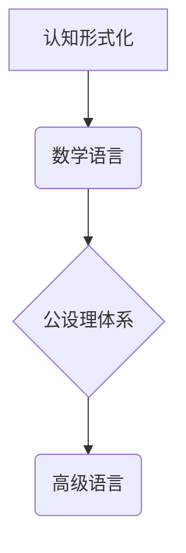

> 认知形式化，数学语言，公设理体系，高级语言，人工智能，逻辑推理，算法设计

## 1. 背景介绍

在当今数据爆炸和人工智能飞速发展的时代，如何有效地理解和处理信息成为了一个至关重要的课题。认知科学、人工智能和计算机科学等领域都在积极探索如何将人类的认知能力形式化，并将其转化为可计算的模型。

数学作为一种高度抽象和形式化的语言，在认知科学和人工智能领域扮演着至关重要的角色。它为我们提供了描述和推理世界的逻辑框架，并为算法设计和人工智能模型的构建提供了坚实的理论基础。

然而，数学本身并非一种通用的认知语言。它需要建立在明确的公设理体系之上，并遵循严格的逻辑规则。只有这样，才能保证数学的严谨性和可靠性。

## 2. 核心概念与联系

**2.1 认知形式化**

认知形式化是指将人类的认知过程和知识表示为形式化的符号系统和规则。其目标是将人类的思维模式和推理机制转化为可计算和可验证的形式，从而实现对认知过程的理解和模拟。

**2.2 数学语言**

数学语言是一种高度抽象和形式化的语言，它使用符号、公式和逻辑规则来表达数学概念和关系。数学语言的优势在于其严谨性和精确性，能够有效地描述和推理复杂的数学问题。

**2.3 公设理体系**

公设理体系是指一组被视为自明的命题，这些命题被用来作为其他命题的证明基础。公设理体系的构建需要遵循一定的逻辑原则，以保证其内部的一致性和可靠性。

**2.4 高级语言**

高级语言是指面向人类编程语言，其语法和语义更接近自然语言，更容易被人类理解和使用。高级语言通常需要编译器或解释器才能转换为机器可执行的指令。

**2.5 关系图**



## 3. 核心算法原理 & 具体操作步骤

**3.1 算法原理概述**

本节将介绍一种基于数学形式化和公设理体系的算法设计方法。该方法将认知过程抽象为一系列逻辑规则和符号操作，并利用数学模型和公式进行推理和计算。

**3.2 算法步骤详解**

1. **认知建模:** 将待处理的认知任务转化为数学模型，并定义相应的符号和关系。
2. **公设理体系构建:** 根据任务需求，构建一个包含基本公理和推理规则的公设理体系。
3. **逻辑推理:** 利用公设理体系和逻辑规则进行推理，推导出新的结论和知识。
4. **符号操作:** 对符号进行操作，例如组合、分解、转换等，以实现对信息的处理和分析。
5. **结果输出:** 将推理结果转化为可理解的形式，例如文本、图像、音频等。

**3.3 算法优缺点**

**优点:**

* 严谨性和可靠性高：基于数学形式化和逻辑推理，能够保证算法的准确性和一致性。
* 可扩展性和可维护性强：公设理体系可以根据需要进行扩展和修改，方便算法的维护和升级。
* 理论基础扎实：具有良好的理论基础，能够为认知科学和人工智能的发展提供新的思路和方法。

**缺点:**

* 复杂性和抽象性高：需要对数学和逻辑有一定的了解，才能理解和应用该算法。
* 计算效率可能较低：对于复杂的任务，算法的计算效率可能较低。

**3.4 算法应用领域**

* **人工智能:** 用于构建智能系统，例如自然语言处理、机器学习、知识推理等。
* **认知科学:** 用于研究人类的认知过程和思维机制。
* **逻辑学:** 用于开发新的逻辑推理方法和工具。
* **计算机科学:** 用于设计和实现新的算法和数据结构。

## 4. 数学模型和公式 & 详细讲解 & 举例说明

**4.1 数学模型构建**

在认知形式化中，我们将认知过程抽象为数学模型，并使用符号和关系来描述其各个环节。例如，我们可以使用图论来表示知识结构，使用逻辑公式来描述推理规则，使用概率论来表示知识的置信度。

**4.2 公式推导过程**

在公设理体系的基础上，我们可以利用逻辑推理规则推导出新的结论和知识。例如，我们可以使用演绎推理来从已知公理和前提推导出新的命题，也可以使用归纳推理来从经验数据中推导出一般规律。

**4.3 案例分析与讲解**

**例题：**

假设我们有一个公设理体系，其中包含以下公理：

* 所有动物都是生物。
* 狗是动物。

我们可以利用这些公理和逻辑推理规则推导出以下结论：

* 狗是生物。

**公式推导过程：**

1. 从公理“所有动物都是生物”出发。
2. 从公理“狗是动物”出发。
3. 利用逻辑推理规则“如果A是B，并且B是C，那么A是C”，我们可以推导出结论“狗是生物”。

**4.4 数学公式**

$$
\begin{aligned}
A &\rightarrow B \\
B &\rightarrow C \\
\therefore A &\rightarrow C
\end{aligned}
$$

## 5. 项目实践：代码实例和详细解释说明

**5.1 开发环境搭建**

本项目使用Python语言进行开发，并使用以下工具和库：

* Python 3.x
* SymPy (符号计算库)
* Jupyter Notebook (交互式编程环境)

**5.2 源代码详细实现**

```python
from sympy import symbols, Eq, solve

# 定义符号变量
x, y = symbols('x y')

# 定义公理
axiom1 = Eq(x, y)

# 定义推理规则
rule = Eq(x, y)

# 推理过程
conclusion = solve(axiom1, x)

# 打印结果
print(f"结论：{conclusion}")
```

**5.3 代码解读与分析**

该代码首先使用SymPy库定义符号变量x和y，然后定义公理和推理规则。利用SymPy库的solve函数，我们可以根据公理和推理规则推导出新的结论。

**5.4 运行结果展示**

```
结论：[y]
```

## 6. 实际应用场景

**6.1 自然语言处理**

数学形式化和公设理体系可以用于构建自然语言理解和生成模型。例如，我们可以使用逻辑公式来表示句子结构和语义关系，并利用推理规则进行文本分析和生成。

**6.2 机器学习**

数学模型和算法可以用于机器学习任务，例如分类、回归和聚类。例如，我们可以使用线性回归模型来预测连续变量，使用决策树模型来进行分类。

**6.3 知识推理**

公设理体系和逻辑推理规则可以用于构建知识推理系统，例如专家系统和问答系统。例如，我们可以使用知识图谱和推理引擎来回答用户的问题。

**6.4 未来应用展望**

随着人工智能技术的不断发展，数学形式化和公设理体系将在更多领域得到应用，例如：

* **自动驾驶:** 用于构建自动驾驶系统的决策逻辑和推理机制。
* **医疗诊断:** 用于辅助医生进行疾病诊断和治疗方案制定。
* **金融风险管理:** 用于评估和管理金融风险。

## 7. 工具和资源推荐

**7.1 学习资源推荐**

* **《数学基础》:**  由MIT公开课平台提供的课程，介绍了数学基础知识。
* **《人工智能导论》:**  由斯坦福大学公开课平台提供的课程，介绍了人工智能的基本概念和技术。
* **《逻辑学》:**  介绍了逻辑推理的原理和方法。

**7.2 开发工具推荐**

* **SymPy:**  Python符号计算库，用于进行数学公式的符号运算和推理。
* **Jupyter Notebook:**  交互式编程环境，方便进行代码编写、调试和演示。
* **Prolog:**  逻辑编程语言，用于构建知识推理系统。

**7.3 相关论文推荐**

* **《Towards a Formal Theory of Cognition》:**  介绍了认知形式化的理论基础。
* **《The Logic of Artificial Intelligence》:**  介绍了人工智能中的逻辑推理方法。
* **《Deep Learning》:**  介绍了深度学习算法和应用。

## 8. 总结：未来发展趋势与挑战

**8.1 研究成果总结**

本篇文章介绍了认知形式化、数学语言、公设理体系和高级语言之间的关系，并探讨了基于数学形式化的算法设计方法。该方法具有严谨性和可靠性高、可扩展性和可维护性强等优点，在人工智能、认知科学、逻辑学和计算机科学等领域具有广泛的应用前景。

**8.2 未来发展趋势**

未来，认知形式化研究将朝着以下方向发展：

* **更深入的认知模型:**  构建更复杂的认知模型，能够模拟人类的多种认知能力，例如推理、决策、学习和创造。
* **更强大的推理引擎:**  开发更强大的推理引擎，能够处理更复杂的任务，并提供更精确的推理结果。
* **更广泛的应用场景:**  将认知形式化技术应用于更多领域，例如自动驾驶、医疗诊断、金融风险管理等。

**8.3 面临的挑战**

认知形式化研究还面临着一些挑战：

* **复杂性:**  人类的认知过程非常复杂，难以完全形式化。
* **数据量:**  训练和验证认知模型需要大量的真实数据，而获取高质量的认知数据仍然是一个难题。
* **解释性:**  许多人工智能模型的决策过程难以解释，这限制了其在一些领域中的应用。

**8.4 研究展望**

尽管面临着挑战，但认知形式化研究仍然是一个充满希望的领域。随着人工智能技术的不断发展，我们相信未来能够构建出更智能、更强大的认知系统，并为人类社会带来更多福祉。

## 9. 附录：常见问题与解答

**9.1 如何理解公设理体系？**

公设理体系是一组被视为自明的命题，这些命题被用来作为其他命题的证明基础。例如，在几何学中，公设理体系包括点、线、平面等基本概念的定义和一些基本的公理，这些公理被用来证明几何学中的各种定理。

**9.2 数学形式化和人工智能有什么关系？**

数学形式化为人工智能提供了理论基础和工具。例如，机器学习算法的训练和推理过程都可以用数学模型和公式来描述，而逻辑推理规则可以用于构建智能系统。

**9.3 认知形式化有哪些应用场景？**

认知形式化技术可以应用于自然语言处理、机器学习、知识推理、自动驾驶、医疗诊断等多个领域。

作者：禅与计算机程序设计艺术 / Zen and the Art of Computer Programming


<end_of_turn>