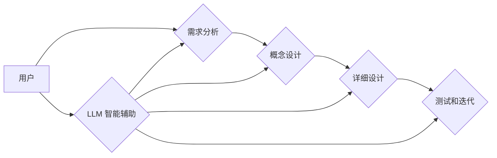

> Large Language Model (LLM), 协作设计, 人工智能, 自然语言处理, 软件开发

## 1. 背景介绍

大型语言模型 (LLM) 已经成为人工智能领域最令人兴奋的突破之一，其强大的文本生成、理解和翻译能力正在改变我们与信息交互的方式。从 ChatGPT 的问答能力到 GitHub Copilot 的代码生成，LLM 正在各个领域展现出巨大的潜力。然而，LLM 的应用远不止于此。

随着 LLM 技术的不断发展，我们开始探索其在协作设计领域的应用。协作设计是指多个参与者共同参与设计和开发的过程，它需要高效的沟通、信息共享和创意碰撞。LLM 的能力可以极大地提升协作设计效率和质量，为设计师、工程师和开发人员提供全新的工具和思路。

## 2. 核心概念与联系

### 2.1  LLM 的协作设计应用

LLM 在协作设计中的应用主要体现在以下几个方面：

* **智能辅助设计:** LLM 可以根据用户的需求和设计意图，生成草图、模型和代码，帮助设计师和工程师快速完成设计原型。
* **协同文档编辑:** LLM 可以理解和编辑设计文档，帮助团队成员协同工作，避免信息冲突和重复劳动。
* **创意激发:** LLM 可以根据用户的输入，生成新的设计方案和创意点子，帮助团队突破思维瓶颈。
* **知识管理:** LLM 可以构建设计知识库，帮助团队成员快速查找和利用相关设计经验和最佳实践。

### 2.2  协作设计流程与 LLM 融合

传统的协作设计流程通常包括以下几个阶段：

1. **需求分析:** 团队成员收集和分析用户的需求。
2. **概念设计:** 设计师根据需求，提出初步的设计方案。
3. **详细设计:** 工程师根据概念设计，进行详细的设计和开发。
4. **测试和迭代:** 团队成员进行测试和迭代，不断优化设计方案。

LLM 可以融入到每个阶段，提供智能辅助和协作支持。例如，在需求分析阶段，LLM 可以帮助团队成员整理和分析用户需求，生成需求文档；在概念设计阶段，LLM 可以根据需求，生成多种设计方案供团队成员选择；在详细设计阶段，LLM 可以帮助工程师生成代码和文档，并进行代码审查和优化。

### 2.3  LLM 协作设计架构



## 3. 核心算法原理 & 具体操作步骤

### 3.1  算法原理概述

LLM 的核心算法是基于 Transformer 架构的深度神经网络。Transformer 网络通过自注意力机制，能够捕捉文本序列中的长距离依赖关系，从而实现更准确的文本理解和生成。

### 3.2  算法步骤详解

1. **文本预处理:** 将输入文本进行分词、词嵌入等预处理操作，将文本转换为模型可以理解的数字格式。
2. **编码:** 使用 Transformer 网络的编码器部分，将预处理后的文本编码成一个固定长度的向量表示。
3. **解码:** 使用 Transformer 网络的解码器部分，根据编码后的向量表示，生成目标文本。
4. **输出:** 将生成的文本解码成可读的形式，输出给用户。

### 3.3  算法优缺点

**优点:**

* 能够捕捉文本序列中的长距离依赖关系，实现更准确的文本理解和生成。
* 训练数据量大，能够学习到丰富的语言知识。
* 可迁移性强，可以应用于多种自然语言处理任务。

**缺点:**

* 训练成本高，需要大量的计算资源和训练数据。
* 容易受到训练数据偏差的影响，可能生成带有偏见或错误的信息。
* 对输入文本长度有限制，处理长文本序列效率较低。

### 3.4  算法应用领域

LLM 的应用领域非常广泛，包括：

* 自然语言处理：文本分类、情感分析、机器翻译、问答系统等。
* 代码生成：自动生成代码、代码补全、代码注释等。
* 内容创作：生成文章、故事、诗歌等创意内容。
* 人机交互：聊天机器人、语音助手等。

## 4. 数学模型和公式 & 详细讲解 & 举例说明

### 4.1  数学模型构建

LLM 的数学模型主要基于 Transformer 架构，其核心是自注意力机制。自注意力机制可以计算每个词与其他词之间的相关性，从而捕捉文本序列中的长距离依赖关系。

### 4.2  公式推导过程

自注意力机制的计算公式如下：

$$
Attention(Q, K, V) = softmax(\frac{QK^T}{\sqrt{d_k}})V
$$

其中：

* $Q$：查询矩阵
* $K$：键矩阵
* $V$：值矩阵
* $d_k$：键向量的维度
* $softmax$：softmax 函数

### 4.3  案例分析与讲解

假设我们有一个句子 "The cat sat on the mat"，我们想要计算 "cat" 与 "mat" 之间的注意力权重。

1. 将句子中的每个词转换为词向量，得到 $Q$、$K$ 和 $V$ 矩阵。
2. 计算 $QK^T$，得到一个矩阵，每个元素代表两个词之间的相关性。
3. 对 $QK^T$ 进行归一化，得到注意力权重矩阵。
4. 将注意力权重矩阵与 $V$ 矩阵相乘，得到 "cat" 与 "mat" 之间的注意力向量。

注意力权重矩阵中的值越大，表示 "cat" 和 "mat" 之间的相关性越强。

## 5. 项目实践：代码实例和详细解释说明

### 5.1  开发环境搭建

* Python 3.7+
* PyTorch 或 TensorFlow
* CUDA 和 cuDNN (可选)

### 5.2  源代码详细实现

```python
import torch
import torch.nn as nn

class Attention(nn.Module):
    def __init__(self, d_model, num_heads):
        super(Attention, self).__init__()
        self.d_model = d_model
        self.num_heads = num_heads
        self.head_dim = d_model // num_heads

        self.query = nn.Linear(d_model, d_model)
        self.key = nn.Linear(d_model, d_model)
        self.value = nn.Linear(d_model, d_model)
        self.fc_out = nn.Linear(d_model, d_model)

    def forward(self, query, key, value, mask=None):
        batch_size = query.size(0)

        # Linear projections
        Q = self.query(query).view(batch_size, -1, self.num_heads, self.head_dim).transpose(1, 2)
        K = self.key(key).view(batch_size, -1, self.num_heads, self.head_dim).transpose(1, 2)
        V = self.value(value).view(batch_size, -1, self.num_heads, self.head_dim).transpose(1, 2)

        # Scaled dot-product attention
        scores = torch.matmul(Q, K.transpose(-2, -1)) / torch.sqrt(torch.tensor(self.head_dim, dtype=torch.float))

        if mask is not None:
            scores = scores.masked_fill(mask == 0, -1e9)

        attention_weights = torch.softmax(scores, dim=-1)

        # Weighted sum of values
        context = torch.matmul(attention_weights, V)

        # Concatenate heads and project
        context = context.transpose(1, 2).contiguous().view(batch_size, -1, self.d_model)
        output = self.fc_out(context)

        return output, attention_weights
```

### 5.3  代码解读与分析

这段代码实现了自注意力机制的计算过程。

* `Attention` 类定义了自注意力机制的结构，包括查询、键、值线性变换层以及最终的输出层。
* `forward` 方法计算了自注意力机制的输出，包括注意力权重和上下文向量。
* `mask` 参数用于屏蔽某些词之间的注意力关系，例如在机器翻译中，屏蔽源语言中的未来词。

### 5.4  运行结果展示

运行这段代码可以得到注意力权重矩阵和上下文向量，这些结果可以用于分析文本序列中的词语关系和语义理解。

## 6. 实际应用场景

### 6.1  协作设计平台

LLM 可以集成到协作设计平台中，为设计师和工程师提供智能辅助和协作支持。例如，LLM 可以根据用户的需求，生成设计草图和模型，帮助团队成员快速完成设计原型；LLM 可以理解和编辑设计文档，帮助团队成员协同工作，避免信息冲突和重复劳动；LLM 可以生成设计方案和创意点子，帮助团队成员突破思维瓶颈。

### 6.2  代码生成工具

LLM 可以用于开发代码生成工具，帮助开发人员快速生成代码片段和函数。例如，GitHub Copilot 就是一个基于 LLM 的代码生成工具，它可以根据开发人员的代码注释和上下文，自动生成代码建议。

### 6.3  知识管理系统

LLM 可以用于构建知识管理系统，帮助团队成员快速查找和利用相关设计经验和最佳实践。例如，LLM 可以分析设计文档和代码库，构建设计知识库，并根据用户的查询，提供相关的设计方案和代码示例。

### 6.4  未来应用展望

随着 LLM 技术的不断发展，其在协作设计领域的应用将更加广泛和深入。未来，LLM 可能能够：

* 更准确地理解用户的需求和设计意图，生成更符合用户期望的设计方案。
* 更智能地协同设计，自动完成一些重复性的设计任务，提高设计效率。
* 更深入地理解设计知识，提供更专业的建议和指导。

## 7. 工具和资源推荐

### 7.1  学习资源推荐

* **书籍:**
    * 《深度学习》 by Ian Goodfellow, Yoshua Bengio, and Aaron Courville
    * 《自然语言处理》 by Dan Jurafsky and James H. Martin
* **在线课程:**
    * Coursera: Deep Learning Specialization
    * Stanford CS224N: Natural Language Processing with Deep Learning

### 7.2  开发工具推荐

* **PyTorch:** https://pytorch.org/
* **TensorFlow:** https://www.tensorflow.org/
* **Hugging Face Transformers:** https://huggingface.co/transformers/

### 7.3  相关论文推荐

* **Attention Is All You Need:** https://arxiv.org/abs/1706.03762
* **BERT: Pre-training of Deep Bidirectional Transformers for Language Understanding:** https://arxiv.org/abs/1810.04805
* **GPT-3: Language Models are Few-Shot Learners:** https://arxiv.org/abs/2005.14165

## 8. 总结：未来发展趋势与挑战

### 8.1  研究成果总结

LLM 在协作设计领域的应用取得了显著的成果，为设计师、工程师和开发人员提供了全新的工具和思路。LLM 可以帮助团队成员更高效地协作设计，提高设计质量和效率。

### 8.2  未来发展趋势

未来，LLM 在协作设计领域的应用将更加广泛和深入。

* **更强大的模型:** 随着计算资源和训练数据的不断增加，LLM 的模型规模和能力将不断提升，能够更好地理解和生成设计内容。
* **更个性化的体验:** LLM 将能够根据用户的个人喜好和设计风格，生成更个性化的设计方案。
* **更跨领域的应用:** LLM 将能够