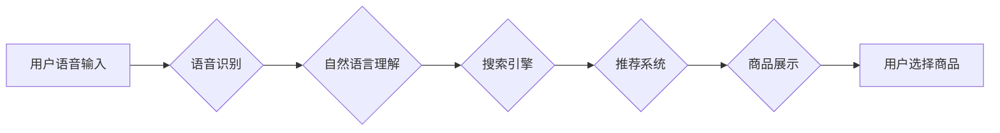

> 语音搜索，电商，自然语言处理，语音识别，机器学习，用户体验

## 1. 背景介绍

随着智能手机和移动互联网的普及，语音交互技术逐渐成为人们生活中不可或缺的一部分。语音搜索作为一种便捷高效的搜索方式，在电商领域展现出巨大的应用潜力。消费者可以通过语音指令快速查找商品信息、下单购买，提升购物体验。

电商平台积极拥抱语音搜索技术，将其融入到产品搜索、商品推荐、客户服务等多个环节。例如，阿里巴巴的“天猫精灵”、京东的“京东小智”等智能音箱，以及微信、支付宝等移动支付平台的语音搜索功能，都为消费者提供了更加便捷的购物体验。

## 2. 核心概念与联系

语音搜索技术在电商领域应用的核心概念包括：

* **语音识别 (Speech Recognition):** 将语音信号转换为文本，是语音搜索技术的基础。
* **自然语言处理 (Natural Language Processing, NLP):** 对文本进行理解、分析和处理，例如识别用户意图、提取关键词等。
* **搜索引擎 (Search Engine):** 根据用户查询的关键词，从海量商品数据中检索出相关结果。
* **推荐系统 (Recommendation System):** 基于用户历史行为、偏好等信息，推荐相关商品。

**语音搜索技术在电商领域的应用架构**



## 3. 核心算法原理 & 具体操作步骤

### 3.1  算法原理概述

语音搜索技术的核心算法包括语音识别算法和自然语言处理算法。

* **语音识别算法:** 主要利用统计模型和机器学习技术，将语音信号转换为文本。常见的语音识别算法包括隐马尔可夫模型 (HMM)、条件随机场 (CRF) 和深度学习模型 (DNN)。

* **自然语言处理算法:** 主要利用词法分析、语法分析和语义分析等技术，对文本进行理解和分析。常见的自然语言处理算法包括词袋模型 (Bag-of-Words)、TF-IDF、主题模型 (LDA) 和深度学习模型 (BERT)。

### 3.2  算法步骤详解

**语音识别步骤:**

1. **语音采集:** 使用麦克风采集用户语音信号。
2. **语音预处理:** 对语音信号进行降噪、增益调整等处理，提高识别准确率。
3. **特征提取:** 从语音信号中提取特征，例如梅尔频率倒谱系数 (MFCC)。
4. **模型识别:** 将提取的特征输入语音识别模型，进行识别。
5. **文本输出:** 将识别结果输出为文本。

**自然语言处理步骤:**

1. **词法分析:** 将文本分割成单词或词组。
2. **语法分析:** 分析文本的语法结构，识别句子成分。
3. **语义分析:** 理解文本的含义，识别关键词和实体。
4. **意图识别:** 识别用户的搜索意图，例如查找商品、比较价格、下单购买等。

### 3.3  算法优缺点

**语音识别算法:**

* **优点:** 识别速度快，可以识别多种语言和口音。
* **缺点:** 识别准确率受环境噪声、说话者口音等因素影响。

**自然语言处理算法:**

* **优点:** 可以理解复杂的语言表达，识别用户意图。
* **缺点:** 需要大量的训练数据，处理长文本时效率较低。

### 3.4  算法应用领域

语音识别和自然语言处理算法广泛应用于各个领域，例如：

* **语音助手:** 例如 Siri、Alexa、Google Assistant 等。
* **语音搜索:** 例如 Google 语音搜索、百度语音搜索等。
* **机器翻译:** 例如 Google 翻译、DeepL 等。
* **文本摘要:** 例如 QuillBot、Summarizer 等。

## 4. 数学模型和公式 & 详细讲解 & 举例说明

### 4.1  数学模型构建

语音识别算法通常使用隐马尔可夫模型 (HMM) 来建模语音信号的生成过程。HMM 是一种统计模型，它假设语音信号是由一系列隐藏状态生成的，每个隐藏状态对应一个音素或音节。

**HMM 的状态转移概率矩阵:**

$$
A = \begin{bmatrix}
a_{11} & a_{12} & \cdots & a_{1N} \\
a_{21} & a_{22} & \cdots & a_{2N} \\
\vdots & \vdots & \ddots & \vdots \\
a_{N1} & a_{N2} & \cdots & a_{NN}
\end{bmatrix}
$$

其中，$a_{ij}$ 表示从状态 $i$ 转移到状态 $j$ 的概率。

**HMM 的观测概率矩阵:**

$$
B = \begin{bmatrix}
b_{11} & b_{12} & \cdots & b_{1M} \\
b_{21} & b_{22} & \cdots & b_{2M} \\
\vdots & \vdots & \ddots & \vdots \\
b_{N1} & b_{N2} & \cdots & b_{NM}
\end{bmatrix}
$$

其中，$b_{ij}$ 表示在状态 $i$ 时观测到音素 $j$ 的概率。

### 4.2  公式推导过程

语音识别算法的目标是找到最有可能生成观测序列的隐藏状态序列。可以使用维特比算法 (Viterbi Algorithm) 来求解这个问题。维特比算法是一种动态规划算法，它通过计算每个状态在每个时刻的最佳路径，最终找到最优路径。

### 4.3  案例分析与讲解

例如，假设我们有一个语音信号，它被识别为三个音素： "a", "b", "c"。我们可以使用 HMM 来建模这个语音信号的生成过程。

首先，我们需要定义 HMM 的状态集和观测集。假设我们的状态集为 {S1, S2, S3}，观测集为 {a, b, c}。然后，我们需要估计 HMM 的状态转移概率矩阵和观测概率矩阵。

可以使用训练数据来估计 HMM 的参数。例如，我们可以统计每个状态之间的转移次数，以及每个状态观测到每个音素的次数，从而得到状态转移概率矩阵和观测概率矩阵。

最后，可以使用维特比算法来找到最有可能生成观测序列 "a, b, c" 的隐藏状态序列。

## 5. 项目实践：代码实例和详细解释说明

### 5.1  开发环境搭建

* **操作系统:** Ubuntu 20.04 LTS
* **编程语言:** Python 3.8
* **深度学习框架:** TensorFlow 2.0
* **语音识别库:** SpeechRecognition

### 5.2  源代码详细实现

```python
import speech_recognition as sr

# 初始化语音识别对象
r = sr.Recognizer()

# 使用麦克风录音
with sr.Microphone() as source:
    print("请说出您的语音指令:")
    audio = r.listen(source)

# 使用Google语音识别服务识别语音
try:
    text = r.recognize_google(audio, language='zh-CN')
    print("您说的是:", text)
except sr.UnknownValueError:
    print("语音识别失败，请重试")
except sr.RequestError as e:
    print("无法连接到语音识别服务:", e)
```

### 5.3  代码解读与分析

* **导入库:** 首先导入 `speech_recognition` 库，用于语音识别。
* **初始化语音识别对象:** 创建一个 `Recognizer` 对象，用于处理语音识别任务。
* **录音:** 使用 `Microphone` 对象获取麦克风输入，并使用 `listen()` 方法录音。
* **语音识别:** 使用 `recognize_google()` 方法将录音转换为文本，并指定语言为中文。
* **错误处理:** 使用 `try-except` 语句处理语音识别失败的情况，例如无法识别语音或无法连接到语音识别服务。

### 5.4  运行结果展示

当用户说出语音指令时，程序会识别语音并输出文本结果。例如，如果用户说 "查找苹果手机"，程序会输出 "您说的是: 查找苹果手机"。

## 6. 实际应用场景

### 6.1  电商搜索

消费者可以通过语音搜索商品名称、品牌、型号等信息，快速找到心仪的商品。例如，用户可以语音搜索 "查找华为P50手机"，电商平台会返回相关商品信息。

### 6.2  商品推荐

电商平台可以根据用户的语音搜索历史、购买记录等信息，推荐相关商品。例如，如果用户经常搜索 "运动鞋"，电商平台会推荐相关的运动鞋商品。

### 6.3  客户服务

电商平台可以使用语音助手提供客户服务，例如回答常见问题、处理订单查询等。用户可以通过语音与客服人员进行对话，获得更便捷的服务体验。

### 6.4  未来应用展望

随着语音识别技术的不断发展，语音搜索在电商领域的应用场景将更加广泛。例如，未来可能出现以下应用场景:

* **个性化购物体验:** 根据用户的语音习惯和偏好，提供个性化的商品推荐和购物建议。
* **沉浸式购物体验:** 通过语音交互，模拟线下购物体验，例如试衣、试妆等。
* **跨平台语音搜索:** 用户可以在不同平台，例如手机、智能音箱、电脑等设备上，使用统一的语音搜索功能。

## 7. 工具和资源推荐

### 7.1  学习资源推荐

* **语音识别与自然语言处理课程:** Coursera、edX 等在线学习平台提供丰富的语音识别与自然语言处理课程。
* **开源语音识别库:** Kaldi、CMU Sphinx 等开源语音识别库可以帮助开发者学习和实践语音识别技术。
* **自然语言处理工具包:** NLTK、spaCy 等自然语言处理工具包可以帮助开发者进行文本分析和处理。

### 7.2  开发工具推荐

* **Python:** Python 是语音识别和自然语言处理领域最常用的编程语言。
* **TensorFlow:** TensorFlow 是一个开源深度学习框架，可以用于训练语音识别模型。
* **PyTorch:** PyTorch 是另一个开源深度学习框架，也广泛应用于语音识别领域。

### 7.3  相关论文推荐

* **Speech Recognition with Deep Neural Networks**
* **Sequence to Sequence Learning with Neural Networks**
* **BERT: Pre-training of Deep Bidirectional Transformers for Language Understanding**

## 8. 总结：未来发展趋势与挑战

### 8.1  研究成果总结

语音搜索技术在电商领域取得了显著的进展，例如语音识别准确率不断提高，自然语言理解能力不断增强。

### 8.2  未来发展趋势

未来，语音搜索技术将朝着以下方向发展:

* **更准确的语音识别:** 利用深度学习等先进技术，提高语音识别准确率，支持更多语言和口音。
* **更智能的自然语言理解:** 能够理解更复杂的语言表达，识别更精细的用户意图。
* **更个性化的购物体验:** 根据用户的语音习惯和偏好，提供个性化的商品推荐和购物建议。

### 8.3  面临的挑战

语音搜索技术在电商领域也面临一些挑战:

* **环境噪声:** 复杂的购物环境，例如商场、超市等，会影响语音识别的准确率。
* **用户隐私:** 语音数据包含用户的个人信息，需要妥善保护用户隐私。
* **技术标准:** 缺乏统一的语音搜索技术标准，导致不同平台的语音搜索体验不一致。

### 8.4  研究展望

未来，需要进一步研究以下问题:

* 如何提高语音识别在复杂环境下的准确率。
* 如何更好地保护用户语音数据的隐私。
* 如何制定统一的语音搜索技术标准，提升用户体验。


## 9. 附录：常见问题与解答

**Q1: 语音搜索技术与传统文本搜索相比有什么优势？**

**A1:** 语音搜索技术相比传统文本搜索，具有以下优势:

* 更便捷: 用户可以通过