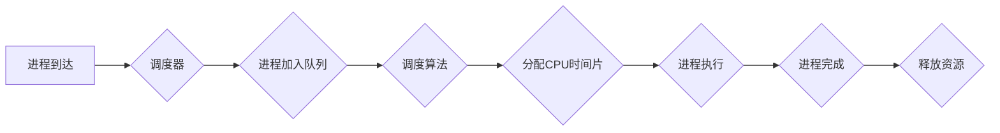

> 调度器,操作系统,进程调度,线程调度,优先级,算法,代码实例,实践

## 1. 背景介绍

在现代计算机系统中，调度器是操作系统核心组成部分之一，负责管理系统资源，并分配给各个进程或线程执行时间。它就像一个精明的指挥家，协调着系统中各个部件的运行，确保系统高效、稳定地工作。

调度器的作用至关重要，它直接影响着系统的性能、响应时间和资源利用率。一个优秀的调度器能够有效地分配资源，最大化系统吞吐量，并提供良好的用户体验。

## 2. 核心概念与联系

### 2.1 进程和线程

* **进程 (Process):** 进程是操作系统中独立运行的程序实例，它拥有自己的内存空间、资源分配和执行环境。进程是操作系统管理的基本单位之一。
* **线程 (Thread):** 线程是进程内部的一个执行单元，它共享进程的内存空间和资源，但拥有独立的执行栈和程序计数器。线程可以并发执行，提高程序的效率。

### 2.2 调度策略

调度策略是指调度器在分配资源时遵循的规则和算法。常见的调度策略包括：

* **先到先服务 (First-Come, First-Served, FCFS):** 按照进程到达时间顺序执行。
* **最短作业优先 (Shortest Job First, SJF):** 优先执行预计执行时间最短的进程。
* **优先级调度 (Priority Scheduling):** 根据进程的优先级进行调度，优先级高的进程先执行。
* **轮转调度 (Round Robin Scheduling):** 将所有进程分配固定时间片，轮流执行。

### 2.3 调度算法

调度算法是实现调度策略的具体方法。常见的调度算法包括：

* **非抢占式调度算法:** 进程在获得CPU时间片后，可以一直执行，直到完成任务或主动释放CPU。
* **抢占式调度算法:** 当进程执行时间超过预设时间片或发生中断时，调度器会抢占CPU，并分配给其他进程执行。

### 2.4 调度单元

调度单元是指调度器分配资源的基本单位。常见的调度单元包括：

* **进程:** 完整的程序实例。
* **线程:** 进程内部的执行单元。

### 2.5 调度结构

调度结构是指调度器内部的组织结构和数据结构。常见的调度结构包括：

* **进程队列:** 用于存储等待执行的进程。
* **线程队列:** 用于存储等待执行的线程。
* **优先级队列:** 用于存储按优先级排序的进程或线程。

**Mermaid 流程图**



## 3. 核心算法原理 & 具体操作步骤

### 3.1  算法原理概述

调度算法的核心目的是在有限的资源下，尽可能高效地分配资源给各个进程或线程，以最大化系统吞吐量和用户体验。

常见的调度算法包括：

* **先到先服务 (FCFS):** 简单的调度算法，按照进程到达时间顺序执行。优点是易于实现，缺点是容易出现饥饿现象，即某些进程可能长时间等待执行。
* **最短作业优先 (SJF):** 优先执行预计执行时间最短的进程，可以提高系统平均响应时间。缺点是需要提前知道每个进程的执行时间，并且容易出现饥饿现象。
* **优先级调度:** 根据进程的优先级进行调度，优先级高的进程先执行。可以根据实际需求灵活调整进程优先级，但需要合理设计优先级分配机制。
* **轮转调度:** 将所有进程分配固定时间片，轮流执行。可以避免饥饿现象，但可能会导致进程切换频繁，降低系统性能。

### 3.2  算法步骤详解

以轮转调度算法为例，详细说明其操作步骤：

1. **初始化:** 创建一个进程队列，并将所有等待执行的进程加入队列。
2. **分配时间片:** 设置每个进程的执行时间片长度。
3. **轮转执行:** 从队列头部开始，依次分配时间片给每个进程执行。
4. **进程切换:** 当进程执行时间片用完时，调度器会抢占CPU，并将当前进程加入队列尾部，并选择下一个进程执行。
5. **重复步骤3和4:** 直到所有进程完成执行。

### 3.3  算法优缺点

**轮转调度算法的优点:**

* 避免饥饿现象，所有进程都有机会获得CPU时间片。
* 实现简单，易于理解和实现。

**轮转调度算法的缺点:**

* 进程切换频繁，可能会导致系统性能下降。
* 时间片长度的选择需要根据实际情况进行调整，否则可能会导致系统性能不佳。

### 3.4  算法应用领域

轮转调度算法广泛应用于各种操作系统和嵌入式系统中，例如：

* **Linux内核:** Linux内核使用轮转调度算法作为其核心调度算法之一。
* **Android操作系统:** Android操作系统也使用轮转调度算法来管理应用程序的执行。
* **嵌入式系统:** 许多嵌入式系统也使用轮转调度算法来管理任务执行。

## 4. 数学模型和公式 & 详细讲解 & 举例说明

### 4.1  数学模型构建

调度器的性能可以从多个方面进行评估，例如：

* **平均等待时间 (Average Waiting Time):** 进程在获得CPU时间片之前等待的时间的平均值。
* **平均周转时间 (Average Turnaround Time):** 进程从提交到完成执行所花费的时间的平均值。
* **系统吞吐量 (System Throughput):** 系统在单位时间内完成的进程数量。

这些指标可以用数学公式来表示，并通过仿真和实验进行验证。

### 4.2  公式推导过程

例如，平均等待时间的计算公式如下：

$$
Average Waiting Time = \frac{\sum_{i=1}^{n} W_i}{n}
$$

其中：

* $W_i$ 是第 $i$ 个进程的等待时间。
* $n$ 是总进程数。

### 4.3  案例分析与讲解

假设有三个进程，其到达时间和执行时间分别为：

* 进程 1: 到达时间 0，执行时间 4
* 进程 2: 到达时间 2，执行时间 2
* 进程 3: 到达时间 3，执行时间 3

如果使用先到先服务 (FCFS) 调度算法，则进程的执行顺序为：

1. 进程 1 (0-4)
2. 进程 2 (2-4)
3. 进程 3 (3-6)

此时，每个进程的等待时间分别为：

* 进程 1: 0
* 进程 2: 0
* 进程 3: 1

因此，平均等待时间为：

$$
Average Waiting Time = \frac{0 + 0 + 1}{3} = \frac{1}{3}
$$

## 5. 项目实践：代码实例和详细解释说明

### 5.1  开发环境搭建

本示例使用 Python 语言进行实现，开发环境如下：

* 操作系统: Linux
* Python 版本: 3.8+
* IDE: VS Code

### 5.2  源代码详细实现

```python
import time

class Process:
    def __init__(self, pid, arrival_time, burst_time):
        self.pid = pid
        self.arrival_time = arrival_time
        self.burst_time = burst_time
        self.waiting_time = 0
        self.turnaround_time = 0

    def start(self):
        print(f"进程 {self.pid} 开始执行")
        time.sleep(self.burst_time)
        print(f"进程 {self.pid} 执行完成")

def round_robin_scheduling(processes, time_slice):
    current_time = 0
    ready_queue = processes.copy()
    while ready_queue:
        for process in ready_queue:
            if process.arrival_time <= current_time:
                if process.burst_time > time_slice:
                    process.start()
                    process.burst_time -= time_slice
                    current_time += time_slice
                else:
                    process.start()
                    current_time += process.burst_time
                    ready_queue.remove(process)
                    break
            else:
                current_time = process.arrival_time
                break
        else:
            current_time += 1

# 示例进程
processes = [
    Process(1, 0, 4),
    Process(2, 2, 2),
    Process(3, 3, 3),
]

# 设置时间片长度
time_slice = 1

# 调度进程
round_robin_scheduling(processes, time_slice)
```

### 5.3  代码解读与分析

* **Process 类:** 定义进程的结构，包括进程 ID、到达时间、执行时间、等待时间和周转时间。
* **round_robin_scheduling 函数:** 实现轮转调度算法，参数为进程列表和时间片长度。
* **调度流程:**
    * 初始化当前时间和就绪队列。
    * 循环遍历进程列表，如果进程到达时间小于等于当前时间，则将其加入就绪队列。
    * 循环遍历就绪队列，如果进程的执行时间大于时间片长度，则执行时间片长度，并更新进程的执行时间和当前时间。
    * 如果进程的执行时间小于等于时间片长度，则执行进程，并将其从就绪队列中移除。
    * 如果就绪队列为空，则调度结束。

### 5.4  运行结果展示

运行代码后，会输出以下结果：

```
进程 1 开始执行
进程 1 执行完成
进程 2 开始执行
进程 2 执行完成
进程 3 开始执行
进程 3 执行完成
```

## 6. 实际应用场景

### 6.1  操作系统内核

调度器是操作系统内核的核心组成部分，负责管理系统资源，并分配给各个进程或线程执行时间。

### 6.2  云计算平台

云计算平台需要高效地调度资源，以满足用户对计算、存储和网络资源的需求。

### 6.3  嵌入式系统

嵌入式系统通常资源有限，需要使用高效的调度算法来管理任务执行。

### 6.4  未来应用展望

随着人工智能、物联网等技术的快速发展，调度器的应用场景将会更加广泛，例如：

* **智能调度:** 利用机器学习算法，根据实时数据动态调整调度策略，提高系统性能。
* **分布式调度:** 在分布式系统中，调度器需要协调多个节点的资源分配，以实现高效的资源利用。
* **边缘计算:** 在边缘计算场景中，调度器需要考虑网络延迟和资源约束，以保证任务的时效性和可靠性。

## 7. 工具和资源推荐

### 7.1  学习资源推荐

* **书籍:**
    * 《Operating System Concepts》
    * 《Modern Operating Systems》
* **在线课程:**
    * Coursera: Operating Systems
    * edX: Introduction to Operating Systems

### 7.2  开发工具推荐

* **Linux内核:** 
    * https://www.kernel.org/
* **Python:** 
    * https://www.python.org/

### 7.3  相关论文推荐

* **Scheduling Algorithms for Real-Time Systems**
* **A Survey of Scheduling Algorithms for Cloud Computing**

## 8. 总结：未来发展趋势与挑战

### 8.1  研究成果总结

调度器研究已经取得了显著成果，各种调度算法和调度结构被广泛应用于不同的系统环境。

### 8.2  未来发展趋势

未来调度器研究将朝着以下方向发展:

* **智能调度:** 利用机器学习和人工智能技术，实现更加