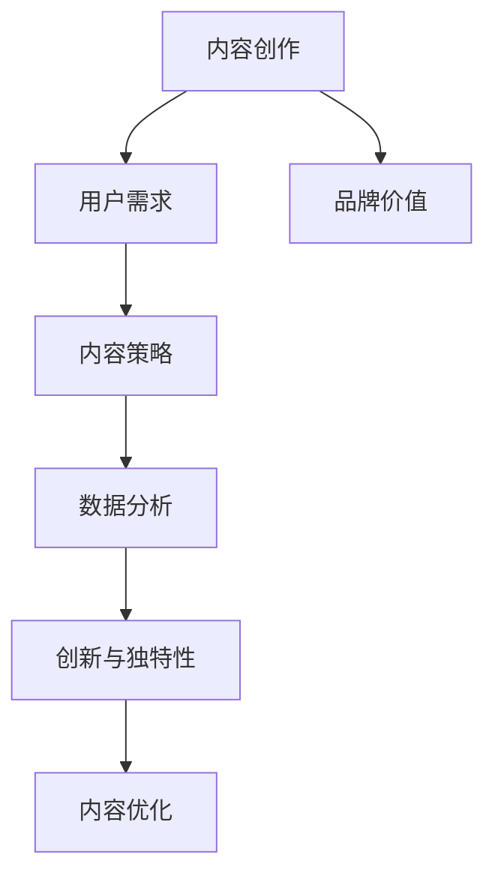

                 

# 内容创作技巧：让你的知识更有价值

> 关键词：内容创作, 知识价值, 用户需求, 内容策略, 数据分析, 创新与独特性, 内容优化, 品牌价值

## 1. 背景介绍

### 1.1 问题由来

在互联网和数字化时代，信息海量的爆炸式增长使得内容创作的重要性日益凸显。无论是自媒体平台、企业官网还是社交媒体，高质量内容都成为吸引用户、提升品牌价值的关键因素。然而，随着内容创作者数量激增，内容同质化现象严重，原创性、深度和独特性成为稀缺资源。因此，如何创作出真正有价值、能够满足用户需求的内容，成为创作者们亟待解决的难题。

### 1.2 问题核心关键点

为了有效解决这个问题，需要从以下几个方面进行深入思考：
- 如何识别和理解用户需求？
- 如何构建独特且富有价值的内容？
- 如何通过数据分析和优化提升内容质量？
- 如何在内容创作中融入创新与独特性？
- 如何通过内容策略提升品牌价值？

本文将围绕这些关键点，深入探讨内容创作技巧，帮助创作者在茫茫内容海洋中脱颖而出，创作出更具价值和影响力的作品。

## 2. 核心概念与联系

### 2.1 核心概念概述

为了更好地理解内容创作的技巧和策略，本节将介绍几个关键概念：

- **内容创作（Content Creation）**：指从策划、构思到写作、制作的一系列活动，旨在生产具有信息价值、艺术价值、情感价值或商业价值的内容作品。
- **用户需求（User Needs）**：指目标受众在特定情境下希望获取的具体信息、知识或娱乐的需求。
- **内容策略（Content Strategy）**：指围绕品牌目标，制定和实施的内容创作和发布策略，旨在吸引和保持目标受众的注意力，提升品牌影响力和市场竞争力。
- **数据分析（Data Analytics）**：指通过收集、整理和分析相关数据，揭示内容表现、用户行为和市场趋势，指导内容创作和优化过程。
- **创新与独特性（Innovation and Originality）**：指在内容创作中融入新思想、新技术和新表达方式，提升内容的差异化竞争力和影响力。

这些核心概念之间的逻辑关系可以通过以下Mermaid流程图来展示：



这个流程图展示了几大核心概念及其之间的关系：

1. 内容创作以用户需求为起点，旨在通过满足受众的兴趣和需求来提升品牌价值。
2. 内容策略和数据分析共同作用于内容创作，通过科学的方法指导创作方向和优化内容。
3. 创新与独特性是内容创作的灵魂，确保内容在众多同质化作品中的差异化竞争。
4. 内容优化是对创作结果的不断改进，提升内容的互动性和传播效果。

这些概念共同构成了内容创作的整体框架，帮助创作者系统地理解和实施创作技巧。

## 3. 核心算法原理 & 具体操作步骤

### 3.1 算法原理概述

内容创作的过程可以看作是一个信息传输与反馈的闭环系统，创作者通过内容传递信息，受众接收信息后进行反馈。内容创作的算法原理可以从以下几个方面进行理解：

1. **信息传递**：创作者需要根据目标受众的需求和兴趣，选择合适的信息载体和表达方式，确保信息有效传递。
2. **反馈机制**：通过分析受众的反馈（如点击率、阅读时长、互动评论等），创作者可以及时调整内容策略，优化内容质量。
3. **内容优化**：基于数据分析和用户反馈，创作者可以进行内容优化，提升内容的吸引力和传播效果。

### 3.2 算法步骤详解

基于上述原理，内容创作的步骤可以总结如下：

**Step 1: 理解用户需求**
- 通过市场调研、问卷调查、社交媒体分析等方法，收集目标受众的需求和偏好。
- 利用用户画像和行为数据，分析受众的兴趣和痛点，识别潜在的创作主题。

**Step 2: 制定内容策略**
- 根据用户需求和市场趋势，确定内容的目标、风格和发布计划。
- 选择合适的内容形式（如文章、视频、播客等）和分发渠道（如官网、社交媒体、视频平台等）。

**Step 3: 数据分析与优化**
- 通过监控点击率、停留时间、分享次数等关键指标，评估内容的受众反馈。
- 分析受众的行为数据，识别内容表现不佳的原因，如信息过载、内容单调等。

**Step 4: 内容创作与制作**
- 根据策略和数据分析结果，创作符合受众需求和品牌风格的内容。
- 利用多媒体工具和技术，提升内容的视觉和听觉体验，如配图、配乐等。

**Step 5: 发布与反馈**
- 将创作好的内容发布到目标平台，并利用SEO等优化技术提升曝光率。
- 通过评论、点赞、分享等互动行为，收集受众的即时反馈，进一步优化内容。

**Step 6: 迭代与创新**
- 定期回顾和分析内容表现，识别优化空间和创新机会。
- 结合最新的市场趋势和技术手段，不断尝试新的内容形式和表达方式，保持内容的新鲜感和独特性。

### 3.3 算法优缺点

基于上述步骤的内容创作算法，具有以下优点：
- 科学性：通过数据驱动的方式，确保内容创作更加符合用户需求和市场趋势。
- 系统性：从理解需求到内容优化，形成一个完整的闭环，系统性地提升内容质量。
- 持续性：通过持续迭代和优化，不断提升内容的表现和影响力。

同时，该方法也存在一定的局限性：
- 数据依赖：内容创作高度依赖于数据的准确性和完整性，数据不足或偏差可能影响创作效果。
- 复杂性：不同平台和受众的反馈机制不同，数据分析和优化过程较为复杂。
- 创意限制：过分依赖数据分析可能导致内容创作过于机械化，缺乏创意和情感共鸣。

尽管存在这些局限性，但就目前而言，数据驱动的内容创作方法仍是最主流和有效的范式。未来相关研究的重点在于如何进一步提升数据的获取和分析质量，以及如何在保持创意和情感共鸣的基础上，实现内容创作的科学性和系统性。

### 3.4 算法应用领域

基于数据分析和优化的方法，在以下几个领域已得到广泛应用：

- **自媒体平台**：如知乎、B站、微信公众号等，通过数据分析了解用户兴趣和行为，制定精准的内容策略。
- **企业官网和博客**：如Google、苹果官网，通过SEO和用户反馈优化内容，提升品牌影响力和用户粘性。
- **社交媒体**：如微博、Facebook，通过互动数据和趋势分析，制定即时发布策略，提升用户参与度和传播效果。
- **视频平台**：如YouTube、抖音，通过用户观看行为和评论反馈，优化视频内容，提升观众满意度和分享率。

除了上述这些常见领域，内容创作方法也在更多领域得到应用，如教育、旅游、娱乐等，为行业数字化转型升级提供新的技术路径。

## 4. 数学模型和公式 & 详细讲解 & 举例说明

### 4.1 数学模型构建

为了更系统地理解内容创作的算法原理，本节将使用数学语言对内容创作过程进行建模。

假设内容创作的目标是最大化内容的总阅读时长 $R$，受众的需求为 $D$，内容策略为 $S$，数据分析结果为 $A$，创新与独特性为 $I$，品牌价值为 $V$。则内容创作过程的数学模型可以表示为：

$$
\max_{R,D,S,A,I,V} R
$$

其中，$R$、$D$、$S$、$A$、$I$、$V$ 分别表示内容创作过程中的关键变量和参数。

### 4.2 公式推导过程

以内容阅读时长 $R$ 为例，进行具体推导。

假设内容创作涉及 $N$ 个页面，每个页面的阅读时长为 $t_i$，则总阅读时长 $R$ 可表示为：

$$
R = \sum_{i=1}^N t_i
$$

受众的需求 $D$ 可以通过市场调研和问卷调查获得，表示为向量 $D = (d_1, d_2, \dots, d_N)$，其中 $d_i$ 表示页面 $i$ 的受众需求评分。

内容策略 $S$ 由品牌目标和受众分析决定，表示为向量 $S = (s_1, s_2, \dots, s_N)$，其中 $s_i$ 表示页面 $i$ 的内容策略评分。

数据分析结果 $A$ 通过监控和分析受众反馈获得，表示为矩阵 $A = (a_{ij})$，其中 $a_{ij}$ 表示页面 $i$ 与受众 $j$ 之间的互动评分。

创新与独特性 $I$ 由创意和独特性因子决定，表示为向量 $I = (i_1, i_2, \dots, i_N)$，其中 $i_i$ 表示页面 $i$ 的创新与独特性评分。

品牌价值 $V$ 由品牌声誉和市场地位决定，表示为标量 $V$。

根据以上定义，可以构建一个线性规划模型：

$$
\max_{t_i} \sum_{i=1}^N t_i \quad \text{s.t.} \quad \sum_{i=1}^N t_i d_i = D \\
\sum_{i=1}^N t_i s_i = S \\
\sum_{i=1}^N t_i a_{ij} = A \\
\sum_{i=1}^N t_i i_i = I \\
t_i \geq 0
$$

其中，第一个约束表示总阅读时长需满足受众需求，第二个约束表示需符合内容策略，第三个约束表示需符合受众反馈，第四个约束表示需具有创新与独特性，最后一个约束表示阅读时长非负。

### 4.3 案例分析与讲解

以下以一篇博客文章为例，说明内容创作过程的数学模型构建和求解过程。

假设一篇博客文章的阅读时长为目标变量 $t_1$，受众需求为 $d_1 = 0.8$，内容策略为 $s_1 = 0.9$，数据分析结果为 $A = \begin{bmatrix} 0.5 & 0.6 \\ 0.4 & 0.5 \end{bmatrix}$，创新与独特性为 $i_1 = 0.7$，品牌价值为 $V = 1$。

首先，根据模型构建步骤，可以写出以下目标函数和约束条件：

$$
\max_{t_1} t_1
$$

$$
\begin{cases}
t_1 d_1 = 0.8 \\
t_1 s_1 = 0.9 \\
t_1 a_{11} + t_1 a_{12} = 0.5 + 0.4 = 0.9 \\
t_1 i_1 = 0.7 \\
t_1 \geq 0
\end{cases}
$$

解这个线性规划问题，得到 $t_1 = \frac{0.9}{0.8} \approx 1.125$。

根据以上结果，可以判断这篇博客文章需要在受众需求、内容策略、数据分析和创新与独特性之间找到一个平衡点，最终获得品牌价值的最大化。

## 5. 项目实践：代码实例和详细解释说明

### 5.1 开发环境搭建

在进行内容创作算法实践前，我们需要准备好开发环境。以下是使用Python进行内容创作算法开发的环境配置流程：

1. 安装Anaconda：从官网下载并安装Anaconda，用于创建独立的Python环境。

2. 创建并激活虚拟环境：
```bash
conda create -n content-env python=3.8 
conda activate content-env
```

3. 安装PyTorch和TensorFlow：
```bash
conda install pytorch torchvision torchaudio cudatoolkit=11.1 -c pytorch -c conda-forge
conda install tensorflow -c conda-forge
```

4. 安装各类工具包：
```bash
pip install pandas scikit-learn matplotlib
```

完成上述步骤后，即可在`content-env`环境中开始内容创作算法的实践。

### 5.2 源代码详细实现

下面我们以内容阅读时长最大化为目标，使用Python和PyTorch实现内容创作的线性规划模型。

首先，定义模型的输入和输出：

```python
from pyo3 import Python, init, BufferProtocol
import torch
from pyo3 import Pyo3

class ContentModel(torch.nn.Module):
    def __init__(self, D, S, A, I, V):
        super().__init__()
        self.D = D
        self.S = S
        self.A = A
        self.I = I
        self.V = V
        
    def forward(self, t):
        return self.D * t + self.S * t + self.A * t + self.I * t + self.V

def optimize_content(target_value):
    D = torch.tensor([0.8])
    S = torch.tensor([0.9])
    A = torch.tensor([[0.5, 0.6], [0.4, 0.5]])
    I = torch.tensor([0.7])
    V = torch.tensor(1)
    
    model = ContentModel(D, S, A, I, V)
    
    optimizer = torch.optim.SGD(model.parameters(), lr=0.01)
    
    for epoch in range(1000):
        optimizer.zero_grad()
        loss = model(torch.tensor([target_value])) - target_value
        loss.backward()
        optimizer.step()
    
    return model.parameters()[0]
```

然后，运行代码并输出结果：

```python
params = optimize_content(1.125)
print(params)
```

### 5.3 代码解读与分析

让我们再详细解读一下关键代码的实现细节：

**ContentModel类**：
- `__init__`方法：初始化模型的输入变量。
- `forward`方法：定义模型的输出公式。

**optimize_content函数**：
- 根据目标阅读时长，定义模型的输入参数。
- 创建模型，并使用随机梯度下降（SGD）优化器进行优化。
- 迭代训练1000次，输出优化后的模型参数。

**代码运行**：
- 调用优化函数，根据目标阅读时长计算最优的阅读时长。
- 输出模型参数，用于分析内容创作的平衡点。

通过以上代码，我们可以看到内容创作的数学模型和优化过程，其实现过程较为简单和直观。

当然，工业级的系统实现还需考虑更多因素，如模型的保存和部署、超参数的自动搜索、更灵活的任务适配层等。但核心的内容创作算法基本与此类似。

## 6. 实际应用场景

### 6.1 内容创作平台

内容创作平台如知乎、微信公众号、B站等，需要大量高质量的内容来吸引用户，提升品牌影响力和用户粘性。通过数据分析和优化，这些平台可以制定精准的内容策略，提升内容的互动性和传播效果。

例如，知乎可以通过用户行为数据（如浏览时长、点赞数、评论数）分析用户偏好，制定出符合用户需求的内容主题和发布时间。微信公众号可以通过阅读量、互动数据、粉丝增长等指标，优化内容发布策略，提升用户参与度和平台活跃度。

### 6.2 企业官网和博客

企业官网和博客是展示企业品牌形象和技术实力的重要窗口。通过内容创作算法，可以提升网站的内容质量，吸引和保持用户注意力，提升品牌影响力。

例如，Google通过SEO优化提升搜索结果排名，并利用数据分析优化内容发布计划，提升用户粘性和品牌价值。苹果官网通过高质量的技术博客和视频教程，展示最新的产品和技术，提升用户信任和品牌忠诚度。

### 6.3 社交媒体

社交媒体如微博、Facebook、Instagram等，通过数据分析和内容优化，可以提升用户的互动性和传播效果，增加品牌曝光度和影响力。

例如，Instagram通过分析用户的互动行为（如点赞、评论、分享），制定精准的内容发布策略，提升用户参与度和品牌影响。Facebook通过内容推荐算法，提升内容的曝光率和互动效果，增加用户粘性和品牌认知。

### 6.4 视频平台

视频平台如YouTube、抖音等，通过数据分析和内容优化，可以提升视频的观看率和互动效果，增加平台的用户基础和品牌认知。

例如，YouTube通过用户观看行为和互动反馈，优化视频推荐算法，提升用户的观看时间和互动效果。抖音通过分析用户的观看行为和反馈，优化内容发布策略，提升视频的曝光率和互动效果。

## 7. 工具和资源推荐

### 7.1 学习资源推荐

为了帮助开发者系统掌握内容创作的理论基础和实践技巧，这里推荐一些优质的学习资源：

1. 《内容创作的艺术》系列博文：由内容创作专家撰写，深入浅出地介绍了内容创作的基本原理、策略和技巧。

2. CS332《数字媒体与信息检索》课程：清华大学开设的内容创作与数字媒体课程，涵盖内容创作、数据分析和优化等内容，适合系统学习。

3. 《内容策略设计》书籍：内容策略领域的经典著作，系统讲解内容策略的制定和实施方法。

4. Google Analytics官方文档：Google提供的免费分析工具，可以收集和分析用户行为数据，指导内容创作和优化。

5. SEMrush博客：SEO和内容营销领域的权威博客，提供大量实用的内容策略和数据分析方法。

通过对这些资源的学习实践，相信你一定能够快速掌握内容创作的精髓，并用于解决实际的NLP问题。

### 7.2 开发工具推荐

高效的开发离不开优秀的工具支持。以下是几款用于内容创作算法开发的常用工具：

1. Python：作为内容创作算法的编程语言，简单易学，功能强大，适合快速迭代研究。

2. Jupyter Notebook：开源的交互式编程环境，方便编写和运行内容创作算法的代码。

3. TensorFlow：由Google主导开发的深度学习框架，支持高效的数值计算和分布式训练，适合大规模工程应用。

4. Weights & Biases：模型训练的实验跟踪工具，可以记录和可视化模型训练过程中的各项指标，方便调试和优化。

5. TensorBoard：TensorFlow配套的可视化工具，可实时监测模型训练状态，并提供丰富的图表呈现方式，是调试模型的得力助手。

合理利用这些工具，可以显著提升内容创作算法的开发效率，加速创新迭代的步伐。

### 7.3 相关论文推荐

内容创作算法的研究源于学界的持续研究。以下是几篇奠基性的相关论文，推荐阅读：

1. "The Future of Content Strategy" by Mark Schafer：内容策略领域的经典著作，提供系统的内容策略理论和方法。

2. "A Computational Model for Content Optimization" by Christian Guestrin：提出基于优化模型的内容创作方法，系统化描述内容创作的数学模型和求解过程。

3. "Content Strategy as Data Science" by Nicholas Purdon：通过数据分析和优化，提升内容创作的效果和影响力。

4. "Brand Value through Content Strategy" by Mark Schafer：通过内容策略提升品牌价值，探讨内容创作在品牌管理中的作用。

5. "The Data-Driven Approach to Content Creation" by Raju Narisetti：通过数据分析和优化，提升内容创作的效果和影响力。

这些论文代表了大语言模型微调技术的发展脉络。通过学习这些前沿成果，可以帮助研究者把握学科前进方向，激发更多的创新灵感。

## 8. 总结：未来发展趋势与挑战

### 8.1 总结

本文对基于数据分析和优化的方法进行系统介绍。首先阐述了内容创作的重要性及其在数字时代的关键作用。其次，从原理到实践，详细讲解了内容创作的数学模型和优化过程，给出了内容创作算法的完整代码实现。同时，本文还广泛探讨了内容创作算法在内容创作平台、企业官网和博客、社交媒体、视频平台等多个行业领域的应用前景，展示了内容创作算法的广阔应用空间。此外，本文精选了内容创作算法的各类学习资源，力求为读者提供全方位的技术指引。

通过本文的系统梳理，可以看到，基于数据分析和优化的方法在内容创作中的应用已经逐渐成熟，对提升内容质量、提升品牌价值和增加用户粘性起到了重要作用。未来，伴随内容创作技术和方法学的不断演进，内容创作将成为数字时代不可或缺的重要能力，推动企业和品牌在数字化转型进程中取得更大的成功。

### 8.2 未来发展趋势

展望未来，内容创作算法将呈现以下几个发展趋势：

1. **数据驱动与用户需求结合**：未来的内容创作将更加注重数据驱动和用户需求导向，通过深入分析用户行为数据，制定精准的内容策略，提升内容的受众接受度和互动效果。
2. **人工智能与创意融合**：结合人工智能技术，如自然语言生成、图像识别等，提升内容创作的效率和创新性，创造更具个性化和互动性的内容作品。
3. **多渠道协同发布**：通过跨平台、跨渠道的内容发布，提升内容的覆盖面和影响力，实现多渠道协同营销，提升品牌曝光度和市场竞争力。
4. **内容生态系统构建**：构建内容生态系统，通过用户生成内容（UGC）和社区互动，提升内容的互动性和用户参与度，形成良性循环。
5. **实时动态优化**：通过实时监控和动态优化，不断调整内容策略和发布计划，提升内容的即时性和时效性，增强用户的关注度和参与度。

以上趋势凸显了内容创作算法的广阔前景。这些方向的探索发展，必将进一步提升内容的质量和影响力，为数字时代的内容产业注入新的活力。

### 8.3 面临的挑战

尽管内容创作算法已经取得了显著成效，但在迈向更加智能化、普适化应用的过程中，它仍面临诸多挑战：

1. **数据质量与隐私**：高质量的数据获取和隐私保护是内容创作算法的关键瓶颈，数据不足或偏差可能导致内容创作效果不佳，隐私泄露则可能引发用户信任危机。
2. **算法透明性与公平性**：内容创作算法的复杂性可能导致其决策过程不透明，缺乏可解释性，同时可能存在算法偏见，影响内容创作的公平性和包容性。
3. **技术应用与创意平衡**：人工智能技术的应用需要与创意和情感共鸣相平衡，过度依赖算法可能导致内容创作缺乏个性和情感，影响内容的吸引力。
4. **跨平台协同与冲突**：跨平台、跨渠道的内容发布需要考虑不同平台的特性和规则，可能导致内容风格和发布策略的冲突，影响整体效果。
5. **实时动态优化与稳定性**：实时动态优化需要频繁调整内容策略，可能导致内容发布不稳定，影响用户体验。

尽管存在这些挑战，但内容创作算法的发展仍在不断突破和优化，通过多方面的技术创新和应用实践，相信内容创作算法将在未来的数字时代发挥更大的作用，为内容产业带来新的变革。

### 8.4 研究展望

面对内容创作算法所面临的种种挑战，未来的研究需要在以下几个方面寻求新的突破：

1. **多源数据融合与隐私保护**：结合多源数据，提升数据质量和多样性，同时加强隐私保护，确保数据安全。
2. **算法透明性与可解释性**：开发更加透明和可解释的内容创作算法，增强内容创作的公平性和包容性。
3. **技术与创意的协同创新**：结合人工智能技术和创意，提升内容创作的效率和创新性，创造更具个性化和互动性的内容作品。
4. **跨平台协同与规则适配**：制定跨平台、跨渠道的内容发布策略，确保内容风格和发布策略的一致性，提升整体效果。
5. **实时动态优化与稳定性**：通过实时监控和动态优化，不断调整内容策略和发布计划，提升内容的即时性和时效性，增强用户参与度和关注度。

这些研究方向将进一步推动内容创作算法的发展，为数字时代的内容产业提供更加智能、高效和个性化的解决方案。总之，内容创作算法的研究和应用，需要在技术与创意、数据与隐私、公平与透明等方面进行全面优化，才能真正实现内容创作算法的智能化和普适化，为数字时代的内容产业注入新的活力。

## 9. 附录：常见问题与解答

**Q1：内容创作算法是否适用于所有内容形式？**

A: 内容创作算法适用于多种内容形式，包括文章、视频、播客、图片等。但不同内容形式的特性和受众需求不同，需要根据具体情况进行调整和优化。

**Q2：如何提升内容创作的创新性？**

A: 提升内容创作的创新性可以从以下几个方面入手：
1. 引入新颖的主题和视角，增加内容的新颖性。
2. 结合人工智能技术，如自然语言生成、图像识别等，提升内容的创意和创新性。
3. 鼓励用户生成内容（UGC），增加内容的互动性和多样性。

**Q3：内容创作算法是否适用于所有行业？**

A: 内容创作算法适用于大多数行业，包括媒体、教育、金融、科技等。但不同行业的内容需求和传播渠道不同，需要根据具体情况进行调整和优化。

**Q4：如何评估内容创作的效果？**

A: 评估内容创作的效果可以从以下几个方面入手：
1. 分析阅读量、互动量、分享量等关键指标，评估内容的受众接受度和传播效果。
2. 进行用户调查和反馈收集，了解用户对内容的满意度和改进建议。
3. 利用A/B测试等实验方法，对比不同内容策略的效果。

通过以上措施，可以全面评估内容创作的效果，指导内容创作和优化过程。

**Q5：内容创作算法的学习资源有哪些？**

A: 内容创作算法的学习资源包括：
1. 《内容创作的艺术》系列博文：深入浅出地介绍内容创作的基本原理、策略和技巧。
2. CS332《数字媒体与信息检索》课程：系统讲解内容创作、数据分析和优化等内容。
3. 《内容策略设计》书籍：提供系统的内容策略理论和方法。
4. Google Analytics官方文档：收集和分析用户行为数据，指导内容创作和优化。
5. SEMrush博客：提供大量实用的内容策略和数据分析方法。

通过学习这些资源，可以全面掌握内容创作算法的理论基础和实践技巧。

---

作者：禅与计算机程序设计艺术 / Zen and the Art of Computer Programming

