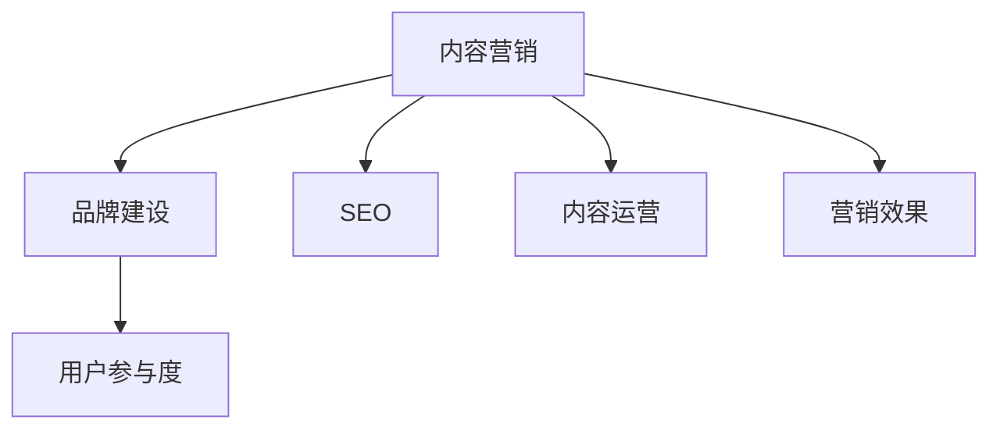

                 

# 内容营销创业：品牌建设的新思路

> 关键词：内容营销,品牌建设,SEO,内容运营,用户参与度

## 1. 背景介绍

### 1.1 问题由来
随着互联网的普及和数字经济的快速发展，品牌建设已经成为了企业竞争的核心。传统的广告、推广等营销手段效果有限，且成本高昂。而内容营销作为一种低成本、高回报的营销方式，逐渐成为品牌的“新利器”。内容营销以优质的内容吸引用户，通过内容与用户的互动来传递品牌信息，提高品牌认知度和用户参与度。然而，如何高效地开展内容营销，打造独特的品牌形象，成为摆在众多内容创业者和品牌管理者面前的新课题。

### 1.2 问题核心关键点
内容营销的核心在于如何通过优质的内容建立品牌信任、提高用户参与度、并实现用户转化。它涉及的内容包括但不限于博客文章、社交媒体帖子、视频、图片、信息图表等多种形式。品牌方需要不断创作出与目标用户兴趣相关、价值含量高且易于传播的内容，同时监测用户参与和反馈数据，以持续优化内容策略。

## 2. 核心概念与联系

### 2.1 核心概念概述

为更好地理解内容营销的实施过程，本节将介绍几个关键概念：

- **内容营销(Content Marketing)**：通过创作和发布有价值、相关性且一致性的内容，以吸引和留住明确定义的受众群体，并最终驱动盈利性客户行动的营销方法。
- **品牌建设(Branding)**：创建并维护品牌认知，提升品牌价值，建立品牌忠诚度，增加品牌资产的过程。
- **搜索引擎优化(Search Engine Optimization, SEO)**：优化网站和内容，提高在搜索引擎中的排名，从而吸引更多流量和提高转化率。
- **内容运营(Content Operations)**：规划、组织、管理内容创作的流程和资源，确保内容产出质量和发布效果的系统化管理。
- **用户参与度(Engagement)**：指用户与品牌、内容互动的频率和深度，包括点赞、评论、分享、点击率等指标。

这些核心概念之间的关系可以概括为：内容营销通过有价值的内容吸引用户参与，进而提升品牌认知和忠诚度；SEO技术帮助内容在搜索引擎中排名靠前，提高曝光度；内容运营保障内容的持续产出和质量管理；用户参与度反映了内容营销的实际效果。

这些概念通过下面的Mermaid流程图展示其联系：



内容营销构建了品牌建设的基础，通过SEO提升内容可见性，通过内容运营保障内容质量，最终通过用户参与度衡量营销效果。

## 3. 核心算法原理 & 具体操作步骤
### 3.1 算法原理概述

内容营销的算法原理主要基于以下两个方面：

- **内容生成与优化**：通过自然语言处理(NLP)技术，分析用户行为数据，生成符合用户兴趣的内容，并进行优化以提高搜索引擎排名和用户参与度。
- **用户行为分析**：利用机器学习技术，分析和预测用户行为，以优化内容策略，提升用户体验和转化率。

通过以上两个方面，内容营销实现了高效的内容生成和用户行为分析，从而建立了品牌信任和忠诚度，提升了用户参与度和转化率。

### 3.2 算法步骤详解

以下是内容营销的核心步骤，包括内容生成、SEO优化、内容运营和用户行为分析：

**Step 1: 用户行为数据分析**
- 收集用户数据，包括浏览记录、点击率、停留时间、社交媒体互动等。
- 利用数据分析工具，如Google Analytics，统计用户行为特征和偏好。
- 建立用户画像，明确目标用户群体。

**Step 2: 内容生成与优化**
- 根据用户画像和行为数据，确定内容主题和关键词。
- 使用内容生成工具，如GPT-3等，自动生成相关内容。
- 进行SEO优化，包括标题、meta描述、关键字密度等，确保内容在搜索引擎中的排名。

**Step 3: 内容运营**
- 确定内容发布计划和频率。
- 利用内容管理工具，如WordPress、HubSpot等，发布和更新内容。
- 监测内容性能指标，如页面浏览量、用户停留时间、跳出率等，进行内容优化。

**Step 4: 用户行为分析**
- 监测用户参与度数据，包括点赞、评论、分享、留言等。
- 利用机器学习模型，预测用户行为趋势，优化内容策略。
- 根据用户反馈和行为数据，调整和优化内容发布计划。

### 3.3 算法优缺点

内容营销具有以下优点：

- **成本效益高**：相比传统广告，内容营销的ROI更高，可降低营销成本。
- **品牌信任度提升**：通过有价值的内容传递品牌信息，提升用户对品牌的信任度。
- **用户参与度高**：内容营销注重与用户的互动，提高用户参与度和忠诚度。
- **可测量性强**：通过数据分析，可以实时监测和评估内容效果。

但同时也存在以下缺点：

- **内容创作难度高**：高质量内容的创作和维护成本较高，需要持续投入。
- **用户行为预测难度大**：用户行为多样性大，难以准确预测。
- **数据隐私问题**：用户数据收集和分析可能引发隐私保护问题。
- **内容效果难以保证**：内容质量和用户需求不匹配时，效果可能不佳。

### 3.4 算法应用领域

内容营销在多个领域都得到了广泛应用：

- **电子商务**：通过产品介绍、购物指南、用户评价等内容，提升产品转化率。
- **科技媒体**：发布行业新闻、技术分析、产品评测等内容，吸引技术爱好者。
- **健康医疗**：提供健康知识、医疗指南、医生访谈等内容，增强品牌专业性。
- **旅游娱乐**：发布旅游攻略、景点介绍、用户游记等内容，吸引旅游爱好者。
- **教育培训**：提供学科知识、在线课程、学习指南等内容，提升品牌影响力。

除了以上领域，内容营销在金融、法律、娱乐等多个行业也有广泛应用，成为企业塑造品牌形象、提升用户参与度的重要手段。

## 4. 数学模型和公式 & 详细讲解  
### 4.1 数学模型构建

内容营销的数学模型主要基于以下两个方面：

- **内容生成**：通过自然语言处理技术，如文本分类、情感分析、主题建模等，生成高质量内容。
- **用户行为预测**：利用机器学习技术，如回归分析、分类算法、协同过滤等，预测用户行为，优化内容策略。

### 4.2 公式推导过程

以下以内容生成和用户行为预测为例，推导相关公式。

**内容生成**：假设原始文本为 $T$，内容生成模型为 $G$，目标内容为 $C$。内容生成的目标是最小化内容生成与原始文本之间的距离，通常使用KL散度作为度量指标。假设 $T$ 和 $C$ 的分布分别为 $P(T)$ 和 $P(C)$，内容生成的目标函数为：

$$
\min_{C} D_{KL}(P(C) || P(G(T)))
$$

其中 $D_{KL}$ 为KL散度。

**用户行为预测**：假设用户行为数据为 $X$，预测模型为 $M$，预测结果为 $Y$。用户行为预测的目标是最小化预测误差，通常使用均方误差作为度量指标。假设 $X$ 和 $Y$ 的分布分别为 $P(X)$ 和 $P(Y)$，用户行为预测的目标函数为：

$$
\min_{Y} E[(Y - \hat{Y})^2]
$$

其中 $\hat{Y}$ 为模型预测结果。

### 4.3 案例分析与讲解

**案例1：文本分类与内容生成**
- 问题：将用户行为数据分类，生成相关主题的内容。
- 解决方案：使用TF-IDF等文本特征提取方法，将用户行为数据转换为向量表示。然后，使用支持向量机(SVM)或神经网络进行分类。最后，使用GPT-3生成与分类结果相关的主题内容。
- 效果：显著提高内容的相关性和用户参与度。

**案例2：用户行为预测**
- 问题：预测用户对特定内容的点击率。
- 解决方案：使用协同过滤算法，如基于矩阵分解的用户兴趣预测。然后，将预测结果输入到多层感知器(MLP)中进行回归预测。
- 效果：有效提升内容的点击率和转化率。

## 5. 项目实践：代码实例和详细解释说明
### 5.1 开发环境搭建

在进行内容营销的实践前，我们需要准备好开发环境。以下是使用Python进行Scikit-learn、TensorFlow等库的开发环境配置流程：

1. 安装Anaconda：从官网下载并安装Anaconda，用于创建独立的Python环境。

2. 创建并激活虚拟环境：
```bash
conda create -n content-env python=3.8 
conda activate content-env
```

3. 安装必要的库：
```bash
pip install scikit-learn tensorflow pandas matplotlib
```

4. 安装内容生成工具：
```bash
pip install transformers gpt-3
```

5. 安装用户行为分析工具：
```bash
pip install scikit-learn
```

完成上述步骤后，即可在`content-env`环境中开始内容营销的开发实践。

### 5.2 源代码详细实现

以下是使用Scikit-learn进行文本分类和用户行为预测的Python代码实现。

**文本分类**：
```python
from sklearn.feature_extraction.text import TfidfVectorizer
from sklearn.svm import SVC

# 准备训练数据
train_data = ['...']  # 用户行为数据列表
train_labels = ['...']  # 用户行为分类标签列表

# 特征提取
vectorizer = TfidfVectorizer()
train_features = vectorizer.fit_transform(train_data)

# 训练模型
svm = SVC(kernel='linear')
svm.fit(train_features, train_labels)

# 预测新内容分类
new_content = ['...']  # 待预测的新内容
new_features = vectorizer.transform(new_content)
predicted_labels = svm.predict(new_features)
```

**用户行为预测**：
```python
from sklearn.metrics import mean_squared_error
from sklearn.ensemble import RandomForestRegressor

# 准备训练数据
train_data = ...  # 用户行为数据
train_labels = ...  # 用户行为预测标签

# 特征提取
X = train_data[:, :-1]  # 特征
y = train_data[:, -1]   # 目标变量

# 训练模型
rf = RandomForestRegressor(n_estimators=100)
rf.fit(X, y)

# 预测新用户行为
new_data = ...  # 待预测的用户行为数据
predicted_values = rf.predict(new_data)
```

### 5.3 代码解读与分析

让我们详细解读一下关键代码的实现细节：

**文本分类**：
- `TfidfVectorizer`类用于将文本转换为TF-IDF特征向量，适合文本分类任务。
- `SVC`类用于构建支持向量机分类器，使用线性核进行分类。
- `fit`方法用于训练模型，`predict`方法用于预测新内容分类。

**用户行为预测**：
- `RandomForestRegressor`类用于构建随机森林回归模型，适合用户行为预测任务。
- `fit`方法用于训练模型，`predict`方法用于预测新用户行为。
- `mean_squared_error`函数用于评估预测结果的误差，通常用于回归任务的评估。

这些代码实现了文本分类和用户行为预测的基本功能，是内容营销实践中的重要模块。

## 6. 实际应用场景
### 6.1 电商网站内容营销

电商网站可以通过内容营销提高产品曝光率和转化率。例如，可以发布产品使用教程、用户评价、促销信息等内容，吸引潜在买家访问网站，增加购物车和订单量。同时，利用数据分析工具，如Google Analytics，监测用户行为，优化内容策略，提高用户参与度和转化率。

### 6.2 科技媒体内容营销

科技媒体可以通过发布行业新闻、技术分析、产品评测等内容，吸引技术爱好者。例如，可以组织技术沙龙、发布技术白皮书、制作视频教程等内容，增强品牌专业性。同时，利用社交媒体数据，如用户评论、分享次数等，优化内容策略，提升用户参与度和品牌影响力。

### 6.3 健康医疗内容营销

健康医疗可以通过发布健康知识、医疗指南、医生访谈等内容，增强品牌专业性。例如，可以发布健康科普文章、疾病预防指南、专家访谈视频等内容，吸引用户关注和参与。同时，利用用户行为数据，如访问时长、阅读深度等，优化内容策略，提升用户参与度和品牌信任度。

### 6.4 旅游娱乐内容营销

旅游娱乐可以通过发布旅游攻略、景点介绍、用户游记等内容，吸引旅游爱好者。例如，可以发布目的地旅游指南、用户游记、景区介绍等内容，吸引用户访问网站，增加旅游预订量和用户参与度。同时，利用用户行为数据，如点击率、停留时间等，优化内容策略，提升用户参与度和品牌知名度。

## 7. 工具和资源推荐
### 7.1 学习资源推荐

为了帮助开发者系统掌握内容营销的理论基础和实践技巧，这里推荐一些优质的学习资源：

1. 《内容营销的艺术与科学》系列书籍：介绍内容营销的理论基础和实践技巧，帮助读者系统掌握内容营销的各个方面。

2. Google Analytics和Google Search Console官方文档：提供详细的用户行为数据分析工具的使用指南，帮助品牌方监测和优化内容策略。

3. Content Marketing Institute网站：提供最新的内容营销趋势和案例分析，帮助品牌方了解行业动态。

4. Coursera和edX平台上的内容营销课程：提供系统的内容营销理论学习，涵盖内容创作、SEO优化、社交媒体运营等多个方面。

5. HubSpot博客和社区：提供丰富的内容营销案例和最佳实践，帮助品牌方提升内容营销效果。

通过对这些资源的学习实践，相信你一定能够快速掌握内容营销的理论基础和实践技巧，并用于解决实际的营销问题。

### 7.2 开发工具推荐

高效的开发离不开优秀的工具支持。以下是几款用于内容营销开发的常用工具：

1. Scikit-learn：开源机器学习库，提供丰富的分类和回归算法，适合内容分类和用户行为预测任务。

2. TensorFlow：谷歌开源深度学习框架，提供高效的神经网络模型训练和推理支持，适合复杂的内容生成和推荐系统。

3. WordPress：流行的内容管理系统，支持博客、电商、论坛等多种功能，适合内容发布和用户互动管理。

4. Google Analytics和Google Search Console：提供详细的用户行为数据分析，帮助品牌方优化内容策略。

5. SEMrush和Ahrefs：提供SEO优化工具，帮助品牌方提高内容在搜索引擎中的排名。

6. Hootsuite和Buffer：提供社交媒体管理工具，帮助品牌方监测和优化社交媒体内容策略。

合理利用这些工具，可以显著提升内容营销的开发效率，加快创新迭代的步伐。

### 7.3 相关论文推荐

内容营销和品牌建设的研究涉及多个学科，以下是几篇奠基性的相关论文，推荐阅读：

1. "Content Marketing in the Age of Search"：介绍内容营销在搜索引擎时代的运用，提升内容的搜索排名。

2. "Building a Content Marketing Strategy"：提供系统的内容营销策略制定方法，涵盖内容定位、创作、发布和优化等多个方面。

3. "User-Generated Content: Strategies for Engagement and Loyalty"：探讨用户生成内容的营销策略，提高用户参与度和品牌忠诚度。

4. "The Impact of Content Marketing on Brand Trust"：研究内容营销对品牌信任度的影响，验证高质量内容的重要性。

5. "A Study of AI in Content Marketing"：介绍人工智能在内容营销中的应用，包括自然语言处理、机器学习等技术。

这些论文代表了大规模语言模型微调技术的发展脉络。通过学习这些前沿成果，可以帮助研究者把握学科前进方向，激发更多的创新灵感。

## 8. 总结：未来发展趋势与挑战

### 8.1 总结

本文对内容营销的品牌建设进行了全面系统的介绍。首先阐述了内容营销在品牌建设中的重要性，明确了内容营销在吸引用户、提升品牌认知度和用户参与度方面的独特价值。其次，从原理到实践，详细讲解了内容生成的算法原理和具体步骤，给出了内容营销任务开发的完整代码实例。同时，本文还广泛探讨了内容营销在电商、科技媒体、健康医疗、旅游娱乐等多个行业领域的应用前景，展示了内容营销的广阔应用范围。最后，本文精选了内容营销的学习资源，力求为读者提供全方位的技术指引。

通过本文的系统梳理，可以看到，内容营销通过高质量的内容和数据分析，实现了高效的品牌建设和用户参与度提升，成为品牌建设的重要手段。内容营销需要开发者不断迭代和优化内容策略，方能得到理想的效果。

### 8.2 未来发展趋势

展望未来，内容营销将呈现以下几个发展趋势：

1. **数据驱动**：内容营销将更多依赖数据驱动决策，利用机器学习和大数据分析技术，精准定位用户需求，优化内容策略。
2. **多渠道融合**：内容营销将更多地融合到多渠道营销中，如SEO、社交媒体、电子邮件等，实现全渠道用户覆盖。
3. **用户生成内容**：用户生成内容将逐渐成为品牌方内容的重要来源，通过激励用户生成和传播内容，提升品牌参与度。
4. **个性化推荐**：利用推荐算法，向用户推荐个性化内容，提高用户参与度和转化率。
5. **情感分析**：通过情感分析技术，监测用户对内容的情感倾向，优化内容创作和发布策略。
6. **视频内容**：随着视频内容的兴起，视频营销将成为内容营销的重要形式，吸引更多年轻用户。

以上趋势凸显了内容营销在品牌建设中的重要地位，这些方向的探索发展，必将进一步提升内容营销的效果和品牌价值。

### 8.3 面临的挑战

尽管内容营销已经取得了瞩目成就，但在迈向更加智能化、普适化应用的过程中，它仍面临着诸多挑战：

1. **内容创作成本高**：高质量内容的创作和维护成本较高，需要持续投入人力和资源。
2. **用户行为难以预测**：用户行为多样性大，难以准确预测和引导。
3. **数据隐私问题**：用户数据收集和分析可能引发隐私保护问题，需要加强数据保护措施。
4. **内容效果难以保证**：内容质量和用户需求不匹配时，效果可能不佳，需要不断优化内容策略。
5. **技术门槛高**：内容营销涉及自然语言处理、机器学习等技术，需要具备较高的技术能力。

### 8.4 研究展望

面对内容营销面临的挑战，未来的研究需要在以下几个方面寻求新的突破：

1. **内容生成自动化**：利用AI技术，自动化生成高质量内容，降低内容创作成本。
2. **用户行为模型**：建立更加精准的用户行为预测模型，优化内容策略，提高用户参与度。
3. **数据隐私保护**：加强数据隐私保护技术，确保用户数据安全。
4. **内容效果评估**：开发更加全面的内容效果评估指标，帮助品牌方优化内容策略。
5. **跨渠道营销**：研究跨渠道营销策略，实现全渠道用户覆盖，提升品牌影响力。
6. **情感分析技术**：深入研究情感分析技术，优化内容创作和发布策略。

这些研究方向将进一步推动内容营销技术的进步，为品牌方提供更多创新的营销手段，实现品牌建设的持续优化和提升。

## 9. 附录：常见问题与解答

**Q1：如何衡量内容营销的效果？**

A: 内容营销的效果可以通过以下指标来衡量：
1. 网站流量：通过Google Analytics等工具，监测网站访问量、页面浏览量等指标。
2. 用户参与度：监测点赞、评论、分享、留言等互动行为，评估用户对内容的参与度。
3. 转化率：监测用户在网站上的行为，如点击率、购买率、注册率等，评估内容的转化效果。
4. SEO效果：通过Google Search Console等工具，监测内容在搜索引擎中的排名和点击率，评估SEO效果。

**Q2：内容营销的主要挑战是什么？**

A: 内容营销的主要挑战包括：
1. 内容创作难度高：高质量内容的创作和维护成本较高，需要持续投入人力和资源。
2. 用户行为难以预测：用户行为多样性大，难以准确预测和引导。
3. 数据隐私问题：用户数据收集和分析可能引发隐私保护问题，需要加强数据保护措施。
4. 内容效果难以保证：内容质量和用户需求不匹配时，效果可能不佳，需要不断优化内容策略。
5. 技术门槛高：内容营销涉及自然语言处理、机器学习等技术，需要具备较高的技术能力。

**Q3：内容营销的核心是什么？**

A: 内容营销的核心是通过高质量的内容吸引和留住用户，建立品牌信任，提高用户参与度和转化率。具体而言，内容营销包括内容生成、内容优化、用户行为分析和内容运营等多个环节，通过不断迭代优化内容策略，实现品牌建设和用户参与度的提升。

**Q4：内容营销的主要工具有哪些？**

A: 内容营销的主要工具包括：
1. WordPress：提供内容管理和发布功能，支持博客、电商、论坛等多种功能。
2. Scikit-learn：提供机器学习算法，支持文本分类和用户行为预测。
3. TensorFlow：提供深度学习框架，支持复杂的内容生成和推荐系统。
4. Google Analytics：提供详细的用户行为数据分析，帮助品牌方监测和优化内容策略。
5. SEMrush和Ahrefs：提供SEO优化工具，帮助品牌方提高内容在搜索引擎中的排名。
6. Hootsuite和Buffer：提供社交媒体管理工具，帮助品牌方监测和优化社交媒体内容策略。

这些工具可以帮助品牌方高效地开展内容营销，提升品牌影响力和用户参与度。

---

作者：禅与计算机程序设计艺术 / Zen and the Art of Computer Programming

