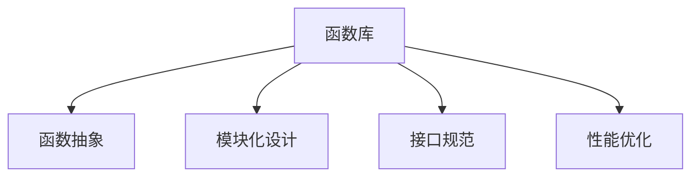

                 

# 函数库:封装复用代码的利器

## 1. 背景介绍

### 1.1 问题由来
软件开发过程中，开发者常常遇到代码重复、可复用性差等问题。随着软件规模的扩大，系统复杂性不断增加，代码的维护和扩展变得愈发困难。为了提高代码的可重用性和可维护性，函数库应运而生。函数库提供了一组预先定义的函数，开发者可以在程序中直接调用，避免重复编写相同的功能模块，从而提高开发效率和代码质量。

### 1.2 问题核心关键点
函数库的核心价值在于封装复用代码，提升软件开发的效率和质量。函数库封装了常用的功能模块，可以大幅度减少代码的冗余，提高代码的可读性和可维护性。在大型系统中，函数库能够显著降低系统的复杂性，减少错误的出现概率，提升开发和维护的效率。

函数库的实现依赖于以下关键点：

- **函数抽象**：将复杂的功能模块抽象成易于调用和复用的函数，减少重复编写代码的工作量。
- **模块化设计**：将函数库的各个功能模块进行模块化设计，方便独立开发和测试。
- **接口规范**：统一函数库的接口规范，确保不同模块之间的兼容性，减少代码耦合度。
- **性能优化**：对函数库中的函数进行性能优化，确保其高效执行。

这些关键点构成了函数库的实现框架，使得函数库在提升开发效率和代码质量方面发挥了重要作用。

## 2. 核心概念与联系

### 2.1 核心概念概述

为更好地理解函数库的原理和架构，本节将介绍几个密切相关的核心概念：

- **函数库(Functions Library)**：封装了常用的功能模块，提供一组预先定义的函数，供开发者在程序中直接调用。
- **函数抽象(Function Abstraction)**：将复杂的功能模块抽象成易于调用和复用的函数，减少重复编写代码的工作量。
- **模块化设计(Modular Design)**：将函数库的各个功能模块进行模块化设计，方便独立开发和测试。
- **接口规范(API Specification)**：统一函数库的接口规范，确保不同模块之间的兼容性，减少代码耦合度。
- **性能优化(Performance Optimization)**：对函数库中的函数进行性能优化，确保其高效执行。

这些核心概念之间的逻辑关系可以通过以下Mermaid流程图来展示：



这个流程图展示函数库的核心概念及其之间的关系：

1. 函数库通过函数抽象封装了复杂功能模块。
2. 模块化设计使函数库的各个功能模块独立开发和测试。
3. 接口规范确保不同模块之间的兼容性。
4. 性能优化提升函数库的执行效率。

## 3. 核心算法原理 & 具体操作步骤
### 3.1 算法原理概述

函数库的实现核心在于将复杂的功能模块封装成易于调用和复用的函数。其算法原理可以总结如下：

1. **函数抽象**：将复杂的功能模块抽象成函数，并定义清晰的函数接口，确保函数可以独立调用和复用。
2. **模块化设计**：将函数库中的各个函数模块进行模块化设计，每个模块独立开发和测试，确保其稳定性和可靠性。
3. **接口规范**：定义函数库的接口规范，确保不同模块之间的兼容性和交互。
4. **性能优化**：对函数库中的函数进行性能优化，提升函数的执行效率和响应速度。

### 3.2 算法步骤详解

函数库的实现一般包括以下几个关键步骤：

**Step 1: 功能模块定义**
- 确定函数库需要封装的功能模块，如字符串处理、数据结构、文件操作等。
- 定义每个模块的函数接口，包括函数名、参数类型、返回值类型等。

**Step 2: 函数实现**
- 根据函数接口，编写函数实现代码。
- 确保函数实现逻辑清晰、易于理解和维护。
- 编写测试用例，对函数进行单元测试，确保其正确性和稳定性。

**Step 3: 模块化设计**
- 将函数库中的各个函数模块进行模块化设计，每个模块独立开发和测试。
- 定义模块之间的接口，确保模块之间的交互和数据传递。

**Step 4: 接口规范**
- 定义函数库的接口规范，确保不同模块之间的兼容性和交互。
- 编写文档，详细说明每个模块的接口和使用方法。

**Step 5: 性能优化**
- 对函数库中的函数进行性能优化，提升函数的执行效率和响应速度。
- 使用工具如Profiling、Optimization等进行性能分析，识别性能瓶颈。
- 通过代码优化、算法改进、缓存等手段提升性能。

**Step 6: 测试和部署**
- 对函数库进行集成测试，确保各个模块之间的兼容性。
- 编写单元测试、集成测试、性能测试等测试用例，验证函数库的正确性和稳定性。
- 将函数库部署到实际应用中，进行功能测试和性能测试。

以上是函数库实现的一般流程。在实际应用中，还需要针对具体场景进行优化设计，如引入更灵活的接口机制、进行模块化设计等。

### 3.3 算法优缺点

函数库的实现具有以下优点：
1. 代码复用率高。函数库封装了常用的功能模块，减少了代码的重复编写，提高了开发效率。
2. 代码可读性高。函数库中的函数接口清晰、易于理解，便于开发者快速上手。
3. 维护成本低。函数库中的模块独立开发和测试，便于维护和升级。
4. 性能可控。通过性能优化手段，函数库中的函数执行效率高，响应速度快。

同时，函数库的实现也存在一定的局限性：
1. 功能模块局限。函数库的功能模块需要开发者事先定义，无法动态扩展。
2. 接口规范限制。函数库的接口规范可能无法满足所有应用场景的需求。
3. 系统依赖高。函数库依赖于特定语言和开发环境，难以跨平台移植。
4. 开发复杂度高。函数库的实现需要高度抽象和模块化设计，开发难度较大。

尽管存在这些局限性，但就目前而言，函数库在软件开发中仍然发挥着不可替代的重要作用。未来相关研究的重点在于如何进一步优化函数库的设计和实现，使其在更高层次上发挥更大的价值。

### 3.4 算法应用领域

函数库在软件开发中得到了广泛的应用，覆盖了几乎所有常见的应用场景，例如：

- 数据处理：如数据清洗、数据转换、数据统计等。
- 文件操作：如文件读取、文件写入、目录操作等。
- 字符串处理：如字符串分割、字符串替换、字符串格式化等。
- 网络通信：如TCP/IP协议、HTTP协议、WebSocket协议等。
- 加密解密：如对称加密、非对称加密、哈希算法等。
- 数学计算：如线性代数、微积分、统计学等。

除了上述这些经典场景外，函数库还被创新性地应用到更多领域中，如机器学习、图像处理、自然语言处理等，为软件开发带来了新的突破。随着软件开发技术的发展，相信函数库在更多领域的应用将会更加广泛，成为软件开发不可或缺的利器。

## 4. 数学模型和公式 & 详细讲解 & 举例说明
### 4.1 数学模型构建

函数库的实现涉及多个模块和函数，每个函数的功能和参数各不相同。函数库的数学模型可以表示为：

$$
F = \{f_1(x_1, y_1), f_2(x_2, y_2), \ldots, f_n(x_n, y_n)\}
$$

其中 $F$ 表示函数库，$f_i$ 表示第 $i$ 个函数，$x_i$ 表示函数的输入参数，$y_i$ 表示函数的输出结果。

### 4.2 公式推导过程

函数库中的函数可以分为多种类型，如输入参数固定、输入参数可变、输出结果固定、输出结果可变等。不同类型的函数有不同的公式推导方式。

对于输入参数固定、输出结果固定的函数，其公式推导过程如下：

设 $f(x)$ 为函数库中的一个函数，其输入参数为 $x$，输出结果为 $y$。则函数的公式推导过程为：

$$
y = f(x)
$$

其中 $f(x)$ 为函数的实现函数，$x$ 为函数的输入参数，$y$ 为函数的输出结果。

对于输入参数可变、输出结果可变的函数，其公式推导过程如下：

设 $g(x)$ 为函数库中的一个函数，其输入参数为 $x$，输出结果为 $y$。则函数的公式推导过程为：

$$
y = g(x)
$$

其中 $g(x)$ 为函数的实现函数，$x$ 为函数的输入参数，$y$ 为函数的输出结果。

### 4.3 案例分析与讲解

以字符串处理函数为例，分析其数学模型和公式推导过程。

设 $str_split$ 为函数库中的一个字符串分割函数，其输入参数为字符串 $s$，输出结果为分割后的字符串数组。则函数的数学模型可以表示为：

$$
F = \{str_split(s)\}
$$

其中 $str_split(s)$ 表示字符串分割函数，$s$ 为输入的字符串。

函数 $str_split(s)$ 的实现可以采用不同的算法，如正则表达式、动态规划、字典树等。以正则表达式为例，其公式推导过程如下：

设 $s$ 为输入的字符串，$\{a_i\}$ 为分割后的字符串数组。则正则表达式分割的公式推导过程为：

$$
s = a_0 + a_1 + \ldots + a_n
$$

其中 $a_i$ 表示第 $i$ 个分割后的字符串，$s$ 为输入的字符串。

通过以上推导，我们可以看到函数库中的函数具有明确的数学模型和公式，便于开发和验证。

## 5. 项目实践：代码实例和详细解释说明
### 5.1 开发环境搭建

在进行函数库开发前，我们需要准备好开发环境。以下是使用Python进行函数库开发的环境配置流程：

1. 安装Python：从官网下载并安装Python，建议安装最新版本。
2. 安装pip：在命令行中输入 `python -m ensurepip --default-pip` 安装pip。
3. 安装virtualenv：在命令行中输入 `pip install virtualenv` 安装virtualenv。
4. 创建虚拟环境：在命令行中输入 `virtualenv my_env` 创建一个名为 `my_env` 的虚拟环境。
5. 激活虚拟环境：在命令行中输入 `source my_env/bin/activate` 激活虚拟环境。

### 5.2 源代码详细实现

下面我们以字符串处理函数库为例，给出使用Python进行函数库开发的完整代码实现。

首先，定义函数库的接口规范：

```python
from typing import List, Union

def str_split(s: str) -> List[str]:
    """
    将字符串s按照空格分割成字符串数组，返回分割后的数组。
    """
    pass

def str_replace(s: str, old: str, new: str) -> str:
    """
    将字符串s中的old子串替换为new子串，返回替换后的字符串。
    """
    pass

def str_upper(s: str) -> str:
    """
    将字符串s转换为大写形式，返回转换后的字符串。
    """
    pass
```

然后，实现函数库中的各个函数：

```python
def str_split(s: str) -> List[str]:
    """
    将字符串s按照空格分割成字符串数组，返回分割后的数组。
    """
    return s.split()

def str_replace(s: str, old: str, new: str) -> str:
    """
    将字符串s中的old子串替换为new子串，返回替换后的字符串。
    """
    return s.replace(old, new)

def str_upper(s: str) -> str:
    """
    将字符串s转换为大写形式，返回转换后的字符串。
    """
    return s.upper()
```

最后，进行函数库的测试：

```python
if __name__ == "__main__":
    print(str_split("Hello, world!"))
    print(str_replace("Hello, world!", "world", "Python"))
    print(str_upper("hello"))
```

以上就是使用Python进行函数库开发的完整代码实现。可以看到，函数库的实现非常简单，只需要定义函数接口和实现函数即可。通过编写测试用例，可以验证函数库的正确性和稳定性。

### 5.3 代码解读与分析

让我们再详细解读一下关键代码的实现细节：

**接口规范**：
- 使用Python的typing模块定义函数接口，明确函数的输入参数和输出结果。
- 接口定义简洁明了，便于开发者理解和调用。

**函数实现**：
- 根据函数接口，编写函数实现代码，确保逻辑清晰、易于理解。
- 使用Python的内置函数和模块，减少代码冗余，提高开发效率。

**测试用例**：
- 编写测试用例，对函数库中的函数进行单元测试，验证其正确性和稳定性。
- 使用Python的unittest模块，编写测试用例，确保函数库的质量和可靠性。

**运行结果展示**：
- 在主函数中，调用函数库中的函数，展示其功能和效果。
- 使用print函数输出函数执行结果，验证其正确性。

通过以上步骤，我们可以看到函数库的开发过程简洁高效，易于理解和实现。开发者可以通过函数库的接口规范和实现代码，快速编写和验证函数库中的函数，提高开发效率和代码质量。

## 6. 实际应用场景
### 6.1 软件开发
函数库在软件开发中得到了广泛应用，其封装复用代码的能力大大提升了开发效率和代码质量。开发者可以直接调用函数库中的函数，避免了重复编写相同的功能模块，减少了代码冗余和维护成本。

例如，在开发一个电商应用时，可以使用函数库中的文件操作函数进行订单文件的读写操作，避免重复编写代码。函数库中的加密解密函数可以对用户的密码进行加密存储，保证用户数据的安全性。函数库中的数学计算函数可以进行复杂的数据处理和分析，提高应用的性能和稳定性。

### 6.2 系统集成
函数库在系统集成中也具有重要的作用。系统集成需要将不同的模块和组件进行整合，形成一个完整的系统。函数库作为系统中的重要组件，提供了许多常用的功能模块，方便系统集成和测试。

例如，在开发一个大数据处理系统时，可以使用函数库中的数据处理函数进行数据清洗、数据转换、数据统计等操作，提高系统的处理效率和准确性。函数库中的网络通信函数可以进行数据的传输和交换，实现不同模块之间的交互和通信。函数库中的字符串处理函数可以进行数据的格式化和解析，提高系统的可读性和可维护性。

### 6.3 企业应用
函数库在企业应用中也得到了广泛应用，其封装复用代码的能力大大提升了企业的开发效率和代码质量。企业可以使用函数库中的功能模块进行系统开发和集成，避免重复编写代码，提高开发效率和代码质量。

例如，在开发一个ERP系统时，可以使用函数库中的数据库操作函数进行数据的读写操作，避免重复编写代码。函数库中的文件操作函数可以对系统的配置文件进行读写操作，保证系统的稳定性和可靠性。函数库中的加密解密函数可以对敏感数据进行加密存储，保障数据的安全性。函数库中的网络通信函数可以进行数据的传输和交换，实现不同模块之间的交互和通信。

### 6.4 未来应用展望
随着函数库技术的发展，其应用领域将更加广泛，未来应用前景广阔。

1. 智能化应用。函数库将与人工智能技术结合，提供更多的智能化功能。例如，使用函数库中的机器学习函数进行数据分析和预测，使用函数库中的自然语言处理函数进行文本分析和生成，使用函数库中的图像处理函数进行图像识别和生成。

2. 自动化应用。函数库将与自动化技术结合，提供更多的自动化功能。例如，使用函数库中的自动化测试函数进行代码测试和调试，使用函数库中的自动化部署函数进行系统部署和运维，使用函数库中的自动化监控函数进行系统监控和告警。

3. 跨平台应用。函数库将支持跨平台应用，提供更多的跨平台功能。例如，使用函数库中的跨平台函数进行数据传输和交互，使用函数库中的跨平台函数进行系统集成和部署，使用函数库中的跨平台函数进行数据存储和备份。

4. 安全性应用。函数库将加强安全性功能，提供更多的安全保障。例如，使用函数库中的加密解密函数进行数据加密和解密，使用函数库中的安全验证函数进行身份验证和授权，使用函数库中的安全监控函数进行安全预警和防护。

通过以上应用场景，我们可以看到函数库在软件开发、系统集成、企业应用等方面具有重要的作用。随着函数库技术的发展，相信函数库的应用领域将更加广泛，成为软件开发和系统集成不可或缺的重要工具。

## 7. 工具和资源推荐
### 7.1 学习资源推荐

为了帮助开发者系统掌握函数库的原理和实践技巧，这里推荐一些优质的学习资源：

1. 《Python编程：从入门到实践》：一本优秀的Python入门书籍，详细介绍了Python的基本语法和函数库的使用方法。
2. 《Effective Python: 59 Specific Ways to Write Better Python》：一本Python编程实践指南，介绍了编写高效Python代码的多种方法，包括函数库的编写和调用。
3. 《Python Cookbook》：一本Python编程技巧大全，提供了大量实用的函数库实现示例，方便开发者学习和应用。
4. 《Python Function Library》：一本Python函数库的实用指南，介绍了函数库的设计和实现方法，提供大量函数库实现案例。
5. 《Python for Data Analysis》：一本Python数据分析实战书籍，介绍了函数库在数据处理和分析中的应用方法，提供大量数据处理函数库实现案例。

通过对这些资源的学习实践，相信你一定能够快速掌握函数库的精髓，并用于解决实际的开发问题。

### 7.2 开发工具推荐

高效的函数库开发离不开优秀的工具支持。以下是几款用于函数库开发的常用工具：

1. PyCharm：一款功能强大的Python IDE，提供高效的代码编辑器、自动补全、调试工具等功能，方便函数库的开发和调试。
2. Visual Studio Code：一款轻量级的代码编辑器，提供多种编程语言的支持和丰富的插件生态，方便函数库的开发和测试。
3. Sublime Text：一款轻量级的文本编辑器，提供高效的代码编辑器、插件管理和语法高亮功能，方便函数库的开发和编辑。
4. PyInstaller：一款Python应用程序打包工具，可以将函数库打包成可执行文件或二进制文件，方便函数的部署和分发。
5. PyDoc：一款Python文档生成工具，可以自动生成函数库的API文档，方便开发者和用户学习和使用函数库。

合理利用这些工具，可以显著提升函数库开发的速度和质量，加快创新迭代的步伐。

### 7.3 相关论文推荐

函数库技术的发展源于学界的持续研究。以下是几篇奠基性的相关论文，推荐阅读：

1. "A Survey on Software Function Libraries"：一篇综述论文，详细介绍了函数库的研究背景、实现方法和应用场景。
2. "Designing and Implementing High-Quality Software Libraries"：一篇关于函数库设计和实现的论文，提供了函数库设计和实现的最佳实践和经验。
3. "Modular Programming: Principles and Paradigms"：一篇关于模块化编程的论文，介绍了模块化编程的思想和方法，为函数库的设计和实现提供了理论支持。
4. "Effective Function Design in Python"：一篇关于函数库设计的论文，介绍了函数库设计的原则和方法，为函数库的实现提供了指导。
5. "Building Efficient Libraries with Python"：一篇关于函数库构建的论文，介绍了函数库构建的最佳实践和经验，为函数库的开发提供了参考。

这些论文代表函数库技术的发展脉络。通过学习这些前沿成果，可以帮助研究者把握学科前进方向，激发更多的创新灵感。

## 8. 总结：未来发展趋势与挑战
### 8.1 总结

本文对函数库的原理和实现进行了全面系统的介绍。首先阐述了函数库在软件开发中的重要性和作用，明确了函数库在封装复用代码方面的独特价值。其次，从原理到实践，详细讲解了函数库的数学模型和实现步骤，给出了函数库开发的完整代码实例。同时，本文还广泛探讨了函数库在软件开发、系统集成、企业应用等多个领域的应用前景，展示了函数库范式的巨大潜力。此外，本文精选了函数库技术的各类学习资源，力求为开发者提供全方位的技术指引。

通过本文的系统梳理，可以看到，函数库在软件开发中发挥了不可替代的重要作用，大大提高了开发效率和代码质量。未来，伴随函数库技术的发展，相信其在更多领域的应用将会更加广泛，成为软件开发不可或缺的利器。

### 8.2 未来发展趋势

展望未来，函数库技术将呈现以下几个发展趋势：

1. 功能模块不断扩展。随着软件规模的不断扩大，函数库的功能模块将不断扩展，涵盖更多常见的功能模块。
2. 接口规范更加灵活。函数库的接口规范将更加灵活，支持更多类型和格式的数据交互。
3. 性能优化更加精细。函数库的性能优化将更加精细，采用多种优化手段提升函数的执行效率。
4. 跨平台支持更加完善。函数库的跨平台支持将更加完善，支持更多操作系统和编程语言。
5. 智能化应用更加普及。函数库将与人工智能技术结合，提供更多的智能化功能，支持复杂的数据处理和分析。
6. 安全性保障更加健全。函数库将加强安全性功能，提供更多的安全保障，防止数据泄露和恶意攻击。

以上趋势凸显函数库技术的广阔前景。这些方向的探索发展，必将进一步提升函数库的性能和应用范围，为软件开发带来更多的便利和效率。

### 8.3 面临的挑战

尽管函数库技术已经取得了一定的成果，但在迈向更加智能化、普适化应用的过程中，仍面临诸多挑战：

1. 功能模块局限。函数库的功能模块需要开发者事先定义，难以动态扩展和更新。
2. 接口规范限制。函数库的接口规范可能无法满足所有应用场景的需求。
3. 跨平台支持不足。函数库的跨平台支持可能存在兼容性问题，导致功能无法在多个平台上正常运行。
4. 安全性问题。函数库中的函数可能存在安全漏洞，如缓冲区溢出、代码注入等。
5. 性能瓶颈。函数库中的函数可能存在性能瓶颈，导致执行效率低下。

尽管存在这些挑战，但函数库在软件开发中的价值和作用是不可替代的。未来相关研究的重点在于如何进一步优化函数库的设计和实现，使其在更高层次上发挥更大的价值。

### 8.4 研究展望

面对函数库面临的挑战，未来的研究需要在以下几个方面寻求新的突破：

1. 动态扩展功能模块。通过引入插件和动态加载机制，实现函数库的功能模块动态扩展和更新。
2. 接口规范更加灵活。通过引入元编程和反射机制，实现函数库的接口规范更加灵活和动态。
3. 跨平台支持更加完善。通过引入跨平台库和框架，实现函数库的跨平台支持更加完善。
4. 安全性保障更加健全。通过引入安全验证和加密解密技术，实现函数库的安全性保障更加健全。
5. 性能优化更加精细。通过引入编译器和优化器，实现函数库的性能优化更加精细和高效。

这些研究方向的探索，必将引领函数库技术迈向更高的台阶，为软件开发带来更多的便利和效率。面向未来，函数库技术还需要与其他软件开发技术进行更深入的融合，如版本控制、持续集成、自动化测试等，多路径协同发力，共同推动软件开发技术的发展。

## 9. 附录：常见问题与解答

**Q1: 函数库的优点和缺点分别是什么？**

A: 函数库的优点包括：
1. 代码复用率高。函数库封装了常用的功能模块，减少了代码的重复编写，提高了开发效率。
2. 代码可读性高。函数库中的函数接口清晰、易于理解，便于开发者快速上手。
3. 维护成本低。函数库中的模块独立开发和测试，便于维护和升级。
4. 性能可控。通过性能优化手段，函数库中的函数执行效率高，响应速度快。

函数库的缺点包括：
1. 功能模块局限。函数库的功能模块需要开发者事先定义，难以动态扩展。
2. 接口规范限制。函数库的接口规范可能无法满足所有应用场景的需求。
3. 系统依赖高。函数库依赖于特定语言和开发环境，难以跨平台移植。
4. 开发复杂度高。函数库的实现需要高度抽象和模块化设计，开发难度较大。

尽管存在这些缺点，但函数库在软件开发中仍然发挥着不可替代的重要作用。

**Q2: 函数库的实现步骤是什么？**

A: 函数库的实现一般包括以下几个关键步骤：
1. 功能模块定义：确定函数库需要封装的功能模块，定义每个模块的函数接口。
2. 函数实现：根据函数接口，编写函数实现代码，确保逻辑清晰、易于理解。
3. 模块化设计：将函数库中的各个函数模块进行模块化设计，每个模块独立开发和测试。
4. 接口规范：定义函数库的接口规范，确保不同模块之间的兼容性和交互。
5. 性能优化：对函数库中的函数进行性能优化，提升函数的执行效率和响应速度。
6. 测试和部署：对函数库进行集成测试，确保各个模块之间的兼容性，并将函数库部署到实际应用中。

通过以上步骤，可以系统地实现函数库，确保其功能和性能满足应用需求。

**Q3: 函数库在软件开发中扮演什么角色？**

A: 函数库在软件开发中扮演了封装复用代码的角色。函数库封装了常用的功能模块，提供一组预先定义的函数，供开发者在程序中直接调用。通过函数库，开发者避免了重复编写相同的功能模块，减少了代码的冗余和维护成本，提高了开发效率和代码质量。

函数库还提供了标准的接口规范，方便开发者使用和调用。函数库中的函数实现简洁高效，便于开发者理解和调用。因此，函数库在软件开发中具有重要的作用，大大提高了开发效率和代码质量。

通过以上解释，我们可以看到函数库在软件开发中的重要角色和作用，相信在未来的软件开发中，函数库的应用将会更加广泛，成为软件开发不可或缺的重要工具。

---

作者：禅与计算机程序设计艺术 / Zen and the Art of Computer Programming

