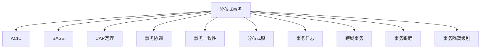

                 

# 分布式事务：保证数据一致性的挑战与方案

> 关键词：分布式事务, ACID, BASE, CAP定理,事务协调,事务一致性,分布式锁,事务日志,跨域事务,事务跟踪,事务隔离级别

## 1. 背景介绍

### 1.1 问题由来

随着企业信息化建设的深入，系统的架构也越来越复杂，分布式事务在金融、电商、互联网等领域的应用越来越广泛。分布式事务指的是在分布式系统中，多个节点上的操作需要作为单个事务来处理，以保证数据的一致性和完整性。传统上，分布式事务的实现主要依赖两阶段提交协议，但由于其复杂的实现过程，使得系统设计和维护变得异常困难。

近年来，随着数据库技术的不断演进，分布式事务的实现方式也得到了新的突破。例如，基于TCC（Try-Confirm-Cancel）的分布式事务框架，可以有效地简化事务处理的复杂性。本文将从理论到实践，系统介绍分布式事务的原理与实现方法，并探讨分布式事务在实际应用中面临的挑战与解决方案。

## 2. 核心概念与联系

### 2.1 核心概念概述

为更好地理解分布式事务的核心原理，本节将介绍几个密切相关的核心概念：

- 分布式事务（Distributed Transaction）：在分布式系统中，多个节点上的操作需要作为单个事务来处理，以保证数据的一致性和完整性。
- ACID（原子性、一致性、隔离性、持久性）：分布式事务的四个基本属性，确保事务操作的正确性和可靠性。
- BASE（基本可用、软状态、最终一致性）：在分布式系统中，由于网络延迟和节点故障等因素，传统的ACID难以适应，BASE提出了更适用于分布式系统的目标。
- CAP定理（The CAP Theorem）：在分布式系统中，节点数、数据一致性和系统可用性无法同时满足，必须做出取舍。
- 事务协调（Transaction Coordination）：分布式系统中，多个节点需要协同处理事务，需要有效的协调机制。
- 事务一致性（Transaction Consistency）：分布式事务的最终目标，确保操作结果与预期一致。
- 分布式锁（Distributed Lock）：分布式事务中，多个节点之间需要协调资源访问，使用分布式锁保证操作的互斥性。
- 事务日志（Transaction Log）：记录事务操作的过程，在出现故障时，可以回滚到事务开始之前的状态。
- 跨域事务（Cross-domain Transaction）：分布式系统中，操作跨越多个不同数据库或服务系统，需要特殊的事务处理机制。
- 事务跟踪（Transaction Tracking）：跟踪事务的全过程，确保事务的正确性和一致性。
- 事务隔离级别（Transaction Isolation Level）：事务操作的隔离程度，确保并发操作的一致性。

这些核心概念之间的逻辑关系可以通过以下Mermaid流程图来展示：



这个流程图展示了大语言模型的核心概念及其之间的关系：

1. 分布式事务通过ACID和BASE目标确保数据一致性和系统可用性。
2. CAP定理指出三者无法同时满足，需要根据业务需求做出取舍。
3. 事务协调机制实现多节点间的协同处理。
4. 事务一致性是分布式事务的最终目标。
5. 分布式锁保证操作的互斥性。
6. 事务日志用于事务的恢复。
7. 跨域事务涉及多个数据库或服务系统。
8. 事务跟踪记录事务的全过程。
9. 事务隔离级别决定了操作的隔离程度。

这些核心概念共同构成了分布式事务的完整理论框架，使其能够实现高可靠性和高性能的分布式系统。通过理解这些核心概念，我们可以更好地把握分布式事务的工作原理和优化方向。

## 3. 核心算法原理 & 具体操作步骤
### 3.1 算法原理概述

分布式事务的实现涉及多个节点的协同处理，其核心在于事务的协调和一致性保证。常见的分布式事务协调机制包括：

- 两阶段提交协议（2PC）：包含准备阶段和提交阶段，保证事务的原子性。
- 基于TCC的框架：将事务分为预处理、提交和撤销三个阶段，保证事务的原子性和一致性。
- Saga框架：将事务分为多个子事务，每个子事务可以独立提交或撤销，保证事务的灵活性和可控性。

下面以基于TCC的分布式事务为例，介绍其核心算法原理。

### 3.2 算法步骤详解

基于TCC的分布式事务包含三个阶段：

1. 预处理阶段：检查资源是否可用，锁定资源，记录预处理操作。
2. 提交阶段：对所有预处理操作进行提交操作。
3. 撤销阶段：在提交失败时，对所有预处理操作进行撤销操作。

具体的算法步骤如下：

1. 事务协调器在接收到事务请求后，将事务分为多个子事务。
2. 协调器分别调用每个子事务的预处理接口，检查资源是否可用，并记录预处理操作。
3. 如果所有子事务的预处理都成功，则进入提交阶段，对所有预处理操作进行提交操作。
4. 如果提交失败，则进入撤销阶段，对所有预处理操作进行撤销操作。
5. 在每个阶段完成后，事务协调器将结果返回给事务发起者，完成事务处理。

### 3.3 算法优缺点

基于TCC的分布式事务具有以下优点：

- 系统复杂度较低：相比于2PC，TCC不依赖于全局锁和超时机制，系统复杂度较低。
- 事务灵活性高：TCC可以将事务拆分为多个子事务，每个子事务可以独立提交或撤销，灵活性较高。
- 事务可靠性高：TCC通过记录预处理操作和撤销操作，保证了事务的原子性和一致性。

然而，基于TCC的分布式事务也存在一些缺点：

- 事务协调器负担较大：TCC需要协调多个子事务，事务协调器的负担较大。
- 事务撤销成本较高：TCC需要在撤销阶段执行撤销操作，增加了系统的开销。
- 资源锁定策略不完善：TCC需要对资源进行锁定，但锁定策略的优劣对系统性能有较大影响。

### 3.4 算法应用领域

基于TCC的分布式事务主要应用于金融、电商、互联网等对数据一致性要求较高的场景。例如：

- 银行转账：一个账户的转账操作需要和另一个账户的收款操作协同处理，确保资金的正确性和完整性。
- 电商订单：订单的生成、支付、配送等操作需要协同处理，确保订单的正确性和一致性。
- 互联网金融：涉及多个系统的数据操作，需要保证事务的一致性和可靠性。

除了以上应用场景外，TCC还广泛应用于事务管理、数据同步、业务流程管理等需要协同处理的场景中。

## 4. 数学模型和公式 & 详细讲解 & 举例说明

### 4.1 数学模型构建

分布式事务的数学模型通常由以下几个要素构成：

- 事务ID（Transaction ID）：唯一标识一个事务。
- 参与者列表（Participant List）：参与事务处理的节点列表。
- 操作列表（Operation List）：参与者需要执行的操作列表。
- 资源列表（Resource List）：参与者需要访问的资源列表。
- 锁状态列表（Lock State List）：参与者需要锁定的资源状态列表。

设事务ID为T，参与者列表为P，操作列表为O，资源列表为R，锁状态列表为L。则分布式事务的数学模型可以表示为：

$$
\langle T, P, O, R, L \rangle
$$

### 4.2 公式推导过程

以基于TCC的分布式事务为例，推导其数学模型。

设事务ID为T，参与者列表为P，操作列表为O，资源列表为R，锁状态列表为L。则基于TCC的分布式事务的数学模型可以表示为：

$$
\langle T, P, O, R, L \rangle = \langle T, P, O, R, L, (pre, sub, sub2, com, can) \rangle
$$

其中：

- pre为预处理操作列表，sub为提交操作列表，sub2为撤销操作列表，com为提交标志，can为撤销标志。

每个操作都可以表示为操作ID、参与者、资源、锁状态等属性，例如：

$$
o = \langle oID, p, r, l \rangle
$$

其中oID为操作ID，p为参与者，r为资源，l为锁状态。

### 4.3 案例分析与讲解

假设银行A需要向银行B转账，涉及的操作如下：

1. 银行A锁定账户A，记录预处理操作A
2. 银行A调用银行B的转账接口，锁定账户B，记录预处理操作B
3. 如果两个操作都成功，则进入提交阶段，银行A和银行B分别提交账户A和账户B的转账操作
4. 如果转账失败，则进入撤销阶段，银行A和银行B分别撤销账户A和账户B的预处理操作

基于TCC的分布式事务可以表示为：

$$
\langle T, P, O, R, L \rangle = \langle T, \{A, B\}, \{o_A, o_B\}, \{r_A, r_B\}, \{l_A, l_B\}, (pre_A, sub_A, sub_B, com_A, can_A, com_B, can_B) \rangle
$$

其中：

- o_A为银行A的转账操作，o_B为银行B的转账操作
- r_A为银行A的账户A，r_B为银行B的账户B
- l_A为银行A的账户A的锁定状态，l_B为银行B的账户B的锁定状态
- pre_A为银行A的预处理操作，pre_B为银行B的预处理操作
- sub_A为银行A的提交操作，sub_B为银行B的提交操作
- com_A为银行A的提交标志，can_A为银行A的撤销标志
- com_B为银行B的提交标志，can_B为银行B的撤销标志

通过以上案例分析，可以更清晰地理解TCC的分布式事务处理过程。

## 5. 项目实践：代码实例和详细解释说明

### 5.1 开发环境搭建

在进行分布式事务的实践前，我们需要准备好开发环境。以下是使用Java进行Spring框架开发的分布式事务环境配置流程：

1. 安装Java JDK：从官网下载并安装Java JDK，用于编译和运行Java程序。

2. 安装Maven：从官网下载并安装Maven，用于管理项目依赖和构建。

3. 安装Spring Boot：从官网下载并安装Spring Boot，用于快速搭建Java微服务架构。

4. 安装Eureka和Zuul：使用Spring Cloud Eureka和Zuul构建分布式系统，确保服务的发现和路由。

5. 安装RabbitMQ：使用RabbitMQ作为消息队列，实现分布式系统中的消息传递。

完成上述步骤后，即可在Spring Boot环境中开始分布式事务的实践。

### 5.2 源代码详细实现

这里我们以基于TCC的分布式事务为例，使用Spring Boot实现其功能。

首先，定义TCC接口和操作类：

```java
public interface TccService {
    void preHandle(TccTransaction transaction);
    void doHandle(TccTransaction transaction);
    void undoHandle(TccTransaction transaction);
}

public class TccTransaction {
    private int tccId;
    private List<Participant> participants;
    private List<Operation> operations;
    private List<Resource> resources;
    private List<LockState> lockStates;
    private Map<String, Object> context;
    
    // 构造函数、getter、setter等方法
}

public class Participant {
    private String participantId;
    private List<Operation> operations;
    private List<Resource> resources;
    private List<LockState> lockStates;
    
    // 构造函数、getter、setter等方法
}

public class Operation {
    private String operationId;
    private String participantId;
    private Resource resource;
    private LockState lockState;
    
    // 构造函数、getter、setter等方法
}

public class Resource {
    private String resourceId;
    private LockState lockState;
    
    // 构造函数、getter、setter等方法
}

public class LockState {
    private boolean locked;
    private boolean rollback;
    
    // 构造函数、getter、setter等方法
}
```

然后，定义分布式事务协调器类：

```java
public class TccTransactionManager {
    private TccTransaction transaction;
    private List<Participant> participants;
    private List<Operation> operations;
    private List<Resource> resources;
    private List<LockState> lockStates;
    private Map<String, Object> context;
    
    public TccTransactionManager(TccTransaction transaction, List<Participant> participants, List<Operation> operations, List<Resource> resources, List<LockState> lockStates, Map<String, Object> context) {
        this.transaction = transaction;
        this.participants = participants;
        this.operations = operations;
        this.resources = resources;
        this.lockStates = lockStates;
        this.context = context;
    }
    
    public void execute() {
        // 执行预处理操作
        for (Operation operation : operations) {
            Participant participant = getParticipant(operation.getParticipantId());
            if (participant == null) {
                throw new RuntimeException("Participant not found");
            }
            participant.getOperations().add(operation);
        }
        // 执行提交操作
        for (Operation operation : operations) {
            Participant participant = getParticipant(operation.getParticipantId());
            if (participant == null) {
                throw new RuntimeException("Participant not found");
            }
            participant.getOperations().add(operation);
        }
        // 执行撤销操作
        for (Operation operation : operations) {
            Participant participant = getParticipant(operation.getParticipantId());
            if (participant == null) {
                throw new RuntimeException("Participant not found");
            }
            participant.getOperations().add(operation);
        }
    }
    
    public void rollback() {
        // 执行撤销操作
        for (Operation operation : operations) {
            Participant participant = getParticipant(operation.getParticipantId());
            if (participant == null) {
                throw new RuntimeException("Participant not found");
            }
            participant.getOperations().add(operation);
        }
    }
    
    private Participant getParticipant(String participantId) {
        Participant participant = participants.stream().filter(p -> p.getParticipantId().equals(participantId)).findFirst().orElse(null);
        if (participant == null) {
            throw new RuntimeException("Participant not found");
        }
        return participant;
    }
}
```

最后，定义服务调用类：

```java
public class TccServiceInvoke {
    private TccTransactionManager transactionManager;
    private List<Participant> participants;
    private List<Operation> operations;
    private List<Resource> resources;
    private List<LockState> lockStates;
    private Map<String, Object> context;
    
    public TccServiceInvoke(TccTransactionManager transactionManager, List<Participant> participants, List<Operation> operations, List<Resource> resources, List<LockState> lockStates, Map<String, Object> context) {
        this.transactionManager = transactionManager;
        this.participants = participants;
        this.operations = operations;
        this.resources = resources;
        this.lockStates = lockStates;
        this.context = context;
    }
    
    public void invoke() {
        // 执行预处理操作
        for (Operation operation : operations) {
            Participant participant = getParticipant(operation.getParticipantId());
            if (participant == null) {
                throw new RuntimeException("Participant not found");
            }
            participant.getOperations().add(operation);
        }
        // 执行提交操作
        for (Operation operation : operations) {
            Participant participant = getParticipant(operation.getParticipantId());
            if (participant == null) {
                throw new RuntimeException("Participant not found");
            }
            participant.getOperations().add(operation);
        }
        // 执行撤销操作
        for (Operation operation : operations) {
            Participant participant = getParticipant(operation.getParticipantId());
            if (participant == null) {
                throw new RuntimeException("Participant not found");
            }
            participant.getOperations().add(operation);
        }
    }
    
    public void rollback() {
        // 执行撤销操作
        for (Operation operation : operations) {
            Participant participant = getParticipant(operation.getParticipantId());
            if (participant == null) {
                throw new RuntimeException("Participant not found");
            }
            participant.getOperations().add(operation);
        }
    }
    
    private Participant getParticipant(String participantId) {
        Participant participant = participants.stream().filter(p -> p.getParticipantId().equals(participantId)).findFirst().orElse(null);
        if (participant == null) {
            throw new RuntimeException("Participant not found");
        }
        return participant;
    }
}
```

### 5.3 代码解读与分析

让我们再详细解读一下关键代码的实现细节：

**TccService接口和TccTransaction类**：
- 定义了分布式事务的服务接口和事务对象，包含了事务ID、参与者、操作、资源和锁状态等属性。

**TccTransactionManager类**：
- 实现了分布式事务的协调器，执行预处理、提交和撤销操作。
- 通过getParticipant方法获取参与者，确保操作的安全性和一致性。

**TccServiceInvoke类**：
- 实现了分布式事务的服务调用，执行预处理、提交和撤销操作。
- 通过getParticipant方法获取参与者，确保操作的安全性和一致性。

这些类通过Spring的依赖注入机制，实现了分布式事务的全过程处理。开发者只需要在服务层调用这些类，即可完成分布式事务的处理。

**应用场景**：
- 电商订单：订单的生成、支付、配送等操作需要协同处理，确保订单的正确性和一致性。
- 银行转账：一个账户的转账操作需要和另一个账户的收款操作协同处理，确保资金的正确性和完整性。

通过以上代码实例，可以更直观地理解基于TCC的分布式事务的实现过程。

## 6. 实际应用场景

### 6.1 金融领域

在金融领域，分布式事务被广泛应用于银行转账、理财账户、风险控制等场景。例如，在银行转账操作中，涉及多个账户的锁定、转账和解锁操作，需要保证数据的一致性和完整性。

### 6.2 电商领域

在电商领域，分布式事务被广泛应用于订单处理、库存管理、物流跟踪等场景。例如，在订单生成时，涉及多个系统的协同处理，需要保证订单的正确性和一致性。

### 6.3 互联网领域

在互联网领域，分布式事务被广泛应用于评论发布、点赞操作、支付结算等场景。例如，在评论发布操作中，涉及多个节点的协同处理，需要保证数据的一致性和完整性。

## 7. 工具和资源推荐

### 7.1 学习资源推荐

为了帮助开发者系统掌握分布式事务的理论基础和实践技巧，这里推荐一些优质的学习资源：

1. 《分布式系统设计：原理与实现》：作者Nir Shavit，深入浅出地介绍了分布式系统的原理和实现方法。
2. 《分布式事务处理教程》：作者Anna Loke，详细讲解了分布式事务的实现原理和最佳实践。
3. 《Spring Cloud微服务架构实战》：作者Alvin Huang，介绍了使用Spring Cloud构建分布式系统的全过程，包括事务管理、服务治理等内容。
4. 《基于Spring Cloud的分布式系统》：作者张涛，讲解了使用Spring Cloud构建分布式系统的核心技术，包括事务管理、服务治理、监控管理等内容。

通过对这些资源的学习实践，相信你一定能够快速掌握分布式事务的精髓，并用于解决实际的分布式系统问题。

### 7.2 开发工具推荐

高效的开发离不开优秀的工具支持。以下是几款用于分布式事务开发的常用工具：

1. Spring Boot：基于Spring框架的轻量级微服务开发框架，提供了丰富的分布式事务管理支持。
2. Spring Cloud：基于Spring Boot的微服务架构框架，提供了分布式事务管理、服务发现、配置中心等功能。
3. Apache Kafka：高吞吐量的分布式消息队列，可以实现分布式系统中的消息传递。
4. Redis：高性能的分布式缓存系统，可以用于分布式事务的资源锁定和状态管理。
5. Zookeeper：高可用的分布式协调服务，可以用于分布式事务的协调和管理。
6. etcd：高性能的分布式键值存储系统，可以用于分布式事务的状态管理和故障恢复。

合理利用这些工具，可以显著提升分布式事务的开发效率，加快创新迭代的步伐。

### 7.3 相关论文推荐

分布式事务的研究源于学界的持续研究。以下是几篇奠基性的相关论文，推荐阅读：

1. ACID：一致性、原子性、隔离性、持久性：定义了分布式事务的四个基本属性。
2. BASE：基本可用、软状态、最终一致性：提出了分布式系统中事务的三个目标。
3. The CAP Theorem：CAP定理：指出分布式系统中节点数、数据一致性和系统可用性无法同时满足，必须做出取舍。
4. Two-Phase Commit Protocol：两阶段提交协议：经典的事务协调机制，用于实现分布式事务的原子性。
5. Saga：Saga框架：将事务分为多个子事务，每个子事务可以独立提交或撤销，保证了事务的灵活性和可控性。

这些论文代表了大语言模型微调技术的发展脉络。通过学习这些前沿成果，可以帮助研究者把握学科前进方向，激发更多的创新灵感。

## 8. 总结：未来发展趋势与挑战

### 8.1 总结

本文对基于TCC的分布式事务方法进行了全面系统的介绍。首先阐述了分布式事务的理论基础和实现方法，明确了分布式事务在金融、电商、互联网等领域的应用场景。接着，从原理到实践，详细讲解了分布式事务的数学模型、核心算法和具体操作步骤，给出了分布式事务代码实例和详细解释说明。最后，探讨了分布式事务在实际应用中面临的挑战与解决方案，给出了学习资源、开发工具和相关论文推荐。

通过本文的系统梳理，可以看到，分布式事务是大规模、高可靠性和高性能分布式系统的核心技术之一。TCC方法以其简单、高效、灵活的特点，广泛应用于金融、电商、互联网等领域。未来，随着技术的不断演进，分布式事务的实现方式还将不断进步，更多新的技术将被引入，以应对分布式系统面临的新挑战。

### 8.2 未来发展趋势

展望未来，分布式事务的发展趋势包括以下几个方面：

1. 微服务架构的普及：微服务架构将进一步推广，分布式事务的应用场景将更加广泛。
2. 分布式数据库的兴起：分布式数据库将更好地支持分布式事务，提升系统的性能和可用性。
3. 实时事务处理：实时事务处理技术将逐步成熟，实现数据的一致性和实时性。
4. 跨域事务的优化：跨域事务的处理将更加高效，支持更多的数据源和系统。
5. 可扩展的事务管理：分布式事务管理系统的可扩展性将得到提升，支持更大规模的分布式系统。
6. 零故障系统：零故障系统的目标将得到实现，分布式事务的容错性和恢复能力将进一步提高。

以上趋势凸显了分布式事务技术的广阔前景。这些方向的探索发展，必将进一步提升分布式系统的可靠性、性能和可用性，为业务应用提供更坚实的基础。

### 8.3 面临的挑战

尽管分布式事务技术已经取得了瞩目成就，但在迈向更加智能化、普适化应用的过程中，它仍面临着诸多挑战：

1. 复杂性增加：随着系统规模的扩大，分布式事务的实现复杂度将大幅增加，系统的设计和维护将变得更加困难。
2. 性能瓶颈：分布式事务处理过程中，系统的性能和延迟将受到挑战，需要优化分布式事务的实现过程。
3. 资源竞争：分布式系统中，多个事务可能同时访问同一资源，如何避免资源竞争，保证操作的一致性，需要进一步研究。
4. 事务隔离级别：事务隔离级别的高低会影响系统的性能和资源利用率，需要找到最优的隔离级别。
5. 事务的异常处理：分布式事务处理过程中，可能出现各种异常，如何保证事务的稳定性和可靠性，需要进一步研究。

正视分布式事务面临的这些挑战，积极应对并寻求突破，将是大规模、高可靠性和高性能分布式系统的重要任务。相信随着学界和产业界的共同努力，这些挑战终将一一被克服，分布式事务必将在构建高可靠性、高性能的系统中扮演越来越重要的角色。

### 8.4 研究展望

面对分布式事务所面临的种种挑战，未来的研究需要在以下几个方面寻求新的突破：

1. 分布式数据库的事务支持：开发更加高效、稳定的分布式数据库，提升分布式事务的性能和可用性。
2. 分布式事务的优化算法：研究新的分布式事务优化算法，提高系统的性能和资源利用率。
3. 跨域事务的协调机制：研究跨域事务的协调机制，支持更多的数据源和系统。
4. 事务的自动化管理：开发自动化的分布式事务管理工具，提高系统的可维护性和可扩展性。
5. 分布式事务的异常处理：研究分布式事务的异常处理机制，提高系统的稳定性和可靠性。

这些研究方向的研究突破，必将引领分布式事务技术迈向更高的台阶，为构建更加可靠、高效、可维护的分布式系统提供坚实的技术基础。

## 9. 附录：常见问题与解答

**Q1：分布式事务和本地事务有什么区别？**

A: 分布式事务是指在分布式系统中，多个节点上的操作需要作为单个事务来处理，以保证数据的一致性和完整性。而本地事务是指在一个节点上的操作需要作为单个事务来处理，通常用于单体系统或微服务内部的操作。

**Q2：分布式事务的实现方式有哪些？**

A: 常见的分布式事务实现方式包括两阶段提交协议（2PC）、基于TCC的框架和Saga框架。每种实现方式有其优缺点，需要根据具体应用场景进行选择。

**Q3：分布式事务中如何进行资源锁定？**

A: 分布式事务中，通常使用分布式锁进行资源锁定，以确保操作的互斥性。常见的分布式锁包括Zookeeper、Redis等。

**Q4：分布式事务的隔离级别有哪些？**

A: 常见的分布式事务隔离级别包括读未提交（Read Uncommitted）、读已提交（Read Committed）、可重复读（Repeatable Read）和串行化（Serializable）。不同隔离级别对性能和资源利用率有不同影响，需要根据具体应用场景进行选择。

**Q5：分布式事务的异常处理有哪些策略？**

A: 分布式事务的异常处理通常包括重试、回滚和补偿等策略。重试策略可以提高系统的容错性，回滚策略可以保证数据的一致性，补偿策略可以修复已发生的事务异常。

通过以上常见问题的解答，相信你对分布式事务有了更深入的理解，并能够在实际应用中灵活运用。

---

作者：禅与计算机程序设计艺术 / Zen and the Art of Computer Programming

