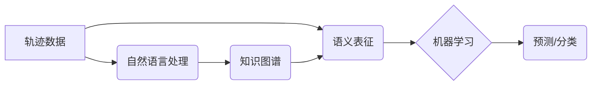

>轨迹数据，语义表征，机器学习，深度学习，自然语言处理，知识图谱

## 1. 背景介绍

在当今数据爆炸的时代，轨迹数据作为一种记录用户行动轨迹的丰富数据类型，在各个领域得到了广泛应用。例如，电商平台可以利用用户浏览历史和购买记录进行个性化推荐；交通管理部门可以分析车辆轨迹数据优化交通流量；城市规划部门可以根据居民轨迹数据规划更合理的公共设施布局。

然而，传统的轨迹数据分析方法主要依赖于空间特征，难以挖掘轨迹数据的深层语义信息。例如，仅仅知道用户从A点到B点的轨迹，并不能完全理解用户的意图，比如用户是去购物、就餐还是探访朋友。因此，如何有效地对轨迹数据进行语义表征，并利用语义信息进行分析和学习，成为当前研究的热点问题。

## 2. 核心概念与联系

轨迹数据的语义表征是指将轨迹数据中的空间信息、时间信息、用户行为信息等转化为具有语义含义的表示形式。

**核心概念：**

* **轨迹数据:** 指的是记录用户或物体的移动轨迹的时空序列数据。
* **语义表征:** 指的是将数据转化为具有语义含义的表示形式，例如词向量、句子向量等。
* **机器学习:** 指的是利用算法从数据中学习规律，并进行预测或分类。
* **深度学习:** 指的是一种基于多层神经网络的机器学习方法。
* **自然语言处理:** 指的是处理和理解人类语言的技术。
* **知识图谱:** 指的是一种结构化的知识表示形式，包含实体、关系和属性。

**核心概念联系：**



## 3. 核心算法原理 & 具体操作步骤

### 3.1  算法原理概述

轨迹数据的语义表征主要采用以下几种方法：

* **基于规则的方法:** 基于事先定义的规则，将轨迹数据转化为语义表示。例如，根据时间信息判断用户是否在工作时间段，根据地点信息判断用户是否在商业区。
* **基于统计的方法:** 利用统计模型，例如隐马尔可夫模型 (HMM) 或条件随机场 (CRF)，学习轨迹数据的语义模式。
* **基于深度学习的方法:** 利用深度神经网络，例如循环神经网络 (RNN) 或图神经网络 (GNN)，学习轨迹数据的复杂语义关系。

### 3.2  算法步骤详解

以基于深度学习的方法为例，其具体操作步骤如下：

1. **数据预处理:** 将轨迹数据进行清洗、格式化和特征提取。例如，将时间信息转换为时间戳，将地点信息转换为地理坐标。
2. **数据编码:** 将预处理后的轨迹数据编码为深度学习模型可以理解的格式。例如，使用词嵌入技术将地点信息编码为向量表示。
3. **模型训练:** 利用深度学习模型，例如RNN或GNN，对编码后的轨迹数据进行训练，学习轨迹数据的语义表示。
4. **语义表征:** 将训练好的深度学习模型应用于新的轨迹数据，得到新的轨迹数据的语义表示。

### 3.3  算法优缺点

**优点:**

* 可以学习到轨迹数据的复杂语义关系。
* 表征能力强，能够捕捉到轨迹数据的隐含信息。

**缺点:**

* 需要大量的训练数据。
* 计算复杂度高，训练时间长。

### 3.4  算法应用领域

* **个性化推荐:** 根据用户的轨迹数据，推荐相关的商品、服务或内容。
* **交通管理:** 分析车辆轨迹数据，预测交通流量，优化交通信号灯控制。
* **城市规划:** 根据居民轨迹数据，规划更合理的公共设施布局。
* **安防监控:** 分析人员轨迹数据，识别异常行为，提高安防安全。

## 4. 数学模型和公式 & 详细讲解 & 举例说明

### 4.1  数学模型构建

假设我们有一个轨迹数据集 $D = \{t_1, t_2, ..., t_n\}$, 其中每个轨迹 $t_i$ 是一个时间序列，包含一系列地点信息。

我们可以使用循环神经网络 (RNN) 来学习轨迹数据的语义表征。RNN 的核心思想是利用循环结构，将时间序列数据中的信息传递到下一个时间步，从而学习到时间序列的上下文信息。

### 4.2  公式推导过程

RNN 的输出 $h_t$ 在时间步 $t$ 可以表示为：

$$h_t = f(W_{xh}x_t + W_{hh}h_{t-1} + b_h)$$

其中：

* $x_t$ 是时间步 $t$ 的输入，例如地点信息。
* $h_{t-1}$ 是前一个时间步的隐藏状态。
* $W_{xh}$ 和 $W_{hh}$ 是权重矩阵。
* $b_h$ 是偏置项。
* $f$ 是激活函数。

### 4.3  案例分析与讲解

例如，我们可以使用 RNN 来学习用户的购物轨迹数据，并预测用户下一个想去的地方。

训练数据包括用户的历史购物记录，例如用户从 A 店到 B 店，再到 C 店。

训练完成后，我们可以输入用户的当前位置，RNN 会根据用户的历史购物轨迹，预测用户下一个想去的地方。

## 5. 项目实践：代码实例和详细解释说明

### 5.1  开发环境搭建

* Python 3.6+
* TensorFlow 2.0+
* Keras 2.0+
* Jupyter Notebook

### 5.2  源代码详细实现

```python
import tensorflow as tf
from tensorflow.keras.models import Sequential
from tensorflow.keras.layers import LSTM, Dense

# 定义模型
model = Sequential()
model.add(LSTM(units=128, input_shape=(timesteps, features)))
model.add(Dense(units=num_classes, activation='softmax'))

# 编译模型
model.compile(optimizer='adam', loss='categorical_crossentropy', metrics=['accuracy'])

# 训练模型
model.fit(X_train, y_train, epochs=10, batch_size=32)

# 评估模型
loss, accuracy = model.evaluate(X_test, y_test)
print('Loss:', loss)
print('Accuracy:', accuracy)
```

### 5.3  代码解读与分析

* `LSTM` 层：循环神经网络层，用于学习时间序列数据中的上下文信息。
* `Dense` 层：全连接层，用于将 LSTM 层的输出映射到目标类别。
* `optimizer`：优化器，用于更新模型参数。
* `loss`：损失函数，用于衡量模型预测结果与真实值的差异。
* `metrics`：评估指标，用于评估模型的性能。

### 5.4  运行结果展示

训练完成后，我们可以使用模型预测新的轨迹数据。例如，我们可以输入用户的当前位置和历史购物记录，模型会预测用户下一个想去的地方。

## 6. 实际应用场景

### 6.1  电商推荐

利用用户浏览历史和购买记录，推荐相关的商品或服务。

### 6.2  交通管理

分析车辆轨迹数据，预测交通流量，优化交通信号灯控制。

### 6.3  城市规划

根据居民轨迹数据，规划更合理的公共设施布局。

### 6.4  未来应用展望

* **个性化服务:** 根据用户的轨迹数据，提供更加个性化的服务，例如定制化路线规划、个性化新闻推荐等。
* **智能城市:** 利用轨迹数据构建智能城市模型，提高城市管理效率和居民生活质量。
* **安全保障:** 利用轨迹数据识别异常行为，提高安全保障水平。

## 7. 工具和资源推荐

### 7.1  学习资源推荐

* **书籍:**
    * 《深度学习》
    * 《自然语言处理》
    * 《图神经网络》
* **在线课程:**
    * Coursera
    * edX
    * Udacity

### 7.2  开发工具推荐

* **Python:** 
* **TensorFlow:** 深度学习框架
* **Keras:** 深度学习 API
* **PyTorch:** 深度学习框架

### 7.3  相关论文推荐

* **Trajectory-Based Recommendation with Deep Learning**
* **Deep Learning for Trajectory Prediction**
* **Graph Neural Networks for Trajectory Forecasting**

## 8. 总结：未来发展趋势与挑战

### 8.1  研究成果总结

轨迹数据的语义表征与学习取得了显著进展，为数据分析和应用提供了新的思路和方法。

### 8.2  未来发展趋势

* **多模态轨迹表征:** 将轨迹数据与其他数据类型，例如文本、图像、音频等进行融合，构建更丰富的语义表征。
* **动态轨迹分析:** 研究动态变化的轨迹数据，例如用户行为模式的演变、交通流量的波动等。
* **隐私保护:** 研究如何保护用户隐私，同时进行轨迹数据分析。

### 8.3  面临的挑战

* **数据质量:** 轨迹数据往往存在噪声、缺失值等问题，需要进行有效的数据清洗和预处理。
* **计算复杂度:** 轨迹数据的语义表征和学习往往需要大量的计算资源。
* **隐私保护:** 轨迹数据包含用户的敏感信息，需要采取有效的隐私保护措施。

### 8.4  研究展望

未来，轨迹数据的语义表征与学习将继续是一个重要的研究方向，有望在更多领域得到应用，为社会发展做出贡献。

## 9. 附录：常见问题与解答

* **Q1: 如何处理轨迹数据中的噪声和缺失值？**

* **A1:** 可以使用数据清洗和预处理技术，例如均值插值、线性插值等，对噪声和缺失值进行处理。

* **Q2: 如何选择合适的语义表征方法？**

* **A2:** 需要根据具体应用场景和数据特点选择合适的语义表征方法。例如，对于时间序列数据，可以使用 RNN 或 LSTM 等方法；对于图数据，可以使用 GNN 等方法。

* **Q3: 如何评估轨迹数据的语义表征效果？**

* **A3:** 可以使用多种评估指标，例如准确率、召回率、F1 值等，来评估轨迹数据的语义表征效果。

作者：禅与计算机程序设计艺术 / Zen and the Art of Computer Programming


<end_of_turn>