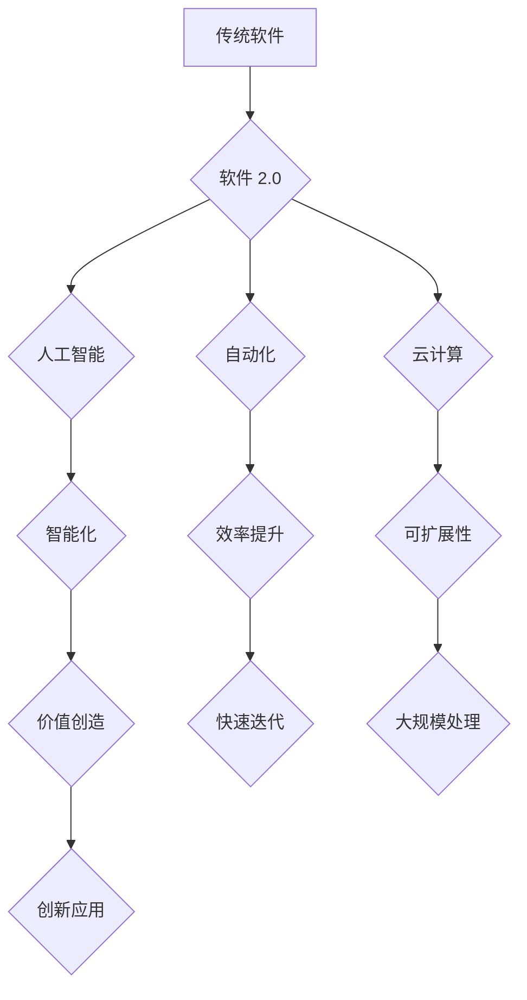

> 软件 2.0,人工智能,自动化,效率提升,价值创造,软件架构,机器学习,深度学习

## 1. 背景介绍

软件已经深刻地改变了我们的生活，从智能手机到云计算，从社交网络到自动驾驶，软件无处不在。然而，传统的软件开发模式面临着越来越多的挑战：

* **开发周期长:** 软件开发周期长，迭代速度慢，难以满足快速变化的市场需求。
* **维护成本高:** 软件维护成本高，随着软件规模的增长，维护难度不断增加。
* **可扩展性差:** 传统的软件架构难以满足大规模数据处理和并发访问的需求。
* **缺乏智能化:** 传统的软件缺乏智能化，无法自动学习和适应环境变化。

为了解决这些问题，软件 2.0 应运而生。软件 2.0 是一种基于人工智能、自动化和云计算的新一代软件开发模式，它旨在提升软件开发效率，创造更大的价值。

## 2. 核心概念与联系

软件 2.0 的核心概念包括：

* **人工智能 (AI):**  AI 技术可以赋予软件智能化能力，例如自动学习、决策和推理。
* **自动化:** 自动化可以减少人工干预，提高软件开发效率。
* **云计算:** 云计算提供弹性、可扩展的计算资源，支持大规模软件开发和部署。

**软件 2.0 架构**



## 3. 核心算法原理 & 具体操作步骤

### 3.1  算法原理概述

软件 2.0 的核心算法包括机器学习、深度学习和自然语言处理等。

* **机器学习:**  机器学习算法可以从数据中学习模式，并根据学习到的模式进行预测或分类。
* **深度学习:** 深度学习是机器学习的一种高级形式，它使用多层神经网络来模拟人类大脑的学习过程。
* **自然语言处理:** 自然语言处理算法可以理解和处理人类语言，例如文本分析、机器翻译和语音识别。

### 3.2  算法步骤详解

以机器学习算法为例，其基本步骤包括：

1. **数据收集和预处理:** 收集相关数据并进行清洗、转换和特征提取。
2. **模型选择:** 选择合适的机器学习算法模型，例如线性回归、逻辑回归、决策树等。
3. **模型训练:** 使用训练数据训练模型，调整模型参数以达到最佳性能。
4. **模型评估:** 使用测试数据评估模型性能，例如准确率、召回率、F1-score等。
5. **模型部署:** 将训练好的模型部署到实际应用场景中。

### 3.3  算法优缺点

**优点:**

* **自动化:** 可以自动学习和适应环境变化，无需人工干预。
* **精准度高:** 可以根据数据进行精准预测和分类。
* **可扩展性强:** 可以处理海量数据和复杂问题。

**缺点:**

* **数据依赖:** 需要大量高质量的数据进行训练。
* **解释性差:** 算法的决策过程难以解释。
* **计算资源消耗大:** 训练深度学习模型需要大量的计算资源。

### 3.4  算法应用领域

机器学习、深度学习和自然语言处理算法广泛应用于各个领域，例如：

* **图像识别:** 人脸识别、物体检测、图像分类。
* **语音识别:** 语音转文本、语音助手。
* **自然语言理解:** 文本分类、情感分析、机器翻译。
* **推荐系统:** 产品推荐、内容推荐。
* **医疗诊断:** 疾病预测、影像分析。

## 4. 数学模型和公式 & 详细讲解 & 举例说明

### 4.1  数学模型构建

机器学习算法通常使用数学模型来表示数据之间的关系。例如，线性回归模型使用以下公式来预测目标变量：

$$y = mx + b$$

其中：

* $y$ 是目标变量
* $x$ 是输入变量
* $m$ 是斜率
* $b$ 是截距

### 4.2  公式推导过程

线性回归模型的参数 $m$ 和 $b$ 可以通过最小化预测误差来求解。预测误差可以使用均方误差 (MSE) 来衡量：

$$MSE = \frac{1}{n} \sum_{i=1}^{n} (y_i - \hat{y}_i)^2$$

其中：

* $n$ 是样本数量
* $y_i$ 是第 $i$ 个样本的目标变量
* $\hat{y}_i$ 是第 $i$ 个样本的预测值

通过求解 MSE 的最小值，可以得到最佳的 $m$ 和 $b$ 值。

### 4.3  案例分析与讲解

假设我们想要预测房屋价格，输入变量是房屋面积，目标变量是房屋价格。我们可以使用线性回归模型来建立房屋价格预测模型。

如果我们收集了 100 个房屋的面积和价格数据，并使用线性回归模型进行训练，可以得到一个最佳的模型，例如：

$$y = 5000x + 100000$$

其中：

* $y$ 是房屋价格
* $x$ 是房屋面积

这意味着，每增加 1 平方米房屋面积，房屋价格会增加 5000 元。

## 5. 项目实践：代码实例和详细解释说明

### 5.1  开发环境搭建

为了实现软件 2.0 的开发，需要搭建相应的开发环境。

* **操作系统:** Linux 或 macOS
* **编程语言:** Python
* **机器学习库:** TensorFlow、PyTorch、Scikit-learn
* **云计算平台:** AWS、Azure、GCP

### 5.2  源代码详细实现

以下是一个使用 Python 和 Scikit-learn 库实现线性回归模型的代码示例：

```python
from sklearn.linear_model import LinearRegression
from sklearn.model_selection import train_test_split
import numpy as np

# 生成示例数据
X = np.array([[1], [2], [3], [4], [5]])
y = np.array([2, 4, 5, 4, 5])

# 将数据分成训练集和测试集
X_train, X_test, y_train, y_test = train_test_split(X, y, test_size=0.2)

# 创建线性回归模型
model = LinearRegression()

# 训练模型
model.fit(X_train, y_train)

# 预测测试集数据
y_pred = model.predict(X_test)

# 评估模型性能
print('Coefficients:', model.coef_)
print('Intercept:', model.intercept_)
print('R-squared:', model.score(X_test, y_test))
```

### 5.3  代码解读与分析

* **数据准备:** 代码首先生成示例数据，并将数据分成训练集和测试集。
* **模型创建:** 使用 `LinearRegression()` 创建线性回归模型。
* **模型训练:** 使用 `fit()` 方法训练模型，将训练数据输入模型，模型学习数据之间的关系。
* **模型预测:** 使用 `predict()` 方法预测测试集数据，得到预测结果。
* **模型评估:** 使用 `score()` 方法评估模型性能，计算 R-squared 值，表示模型拟合数据的程度。

### 5.4  运行结果展示

运行代码后，会输出模型的系数、截距和 R-squared 值。

## 6. 实际应用场景

软件 2.0 的应用场景非常广泛，例如：

* **智能客服:** 使用自然语言处理技术，自动回复客户咨询，提高客服效率。
* **个性化推荐:** 使用机器学习算法，根据用户行为和偏好，推荐个性化产品和内容。
* **欺诈检测:** 使用机器学习算法，识别和预防欺诈行为。
* **医疗诊断辅助:** 使用深度学习算法，辅助医生进行疾病诊断。

### 6.4  未来应用展望

随着人工智能技术的不断发展，软件 2.0 的应用场景将更加广泛，例如：

* **自动驾驶:** 使用深度学习算法，实现自动驾驶汽车。
* **个性化教育:** 使用机器学习算法，提供个性化教育方案。
* **智能家居:** 使用人工智能技术，实现智能家居控制。

## 7. 工具和资源推荐

### 7.1  学习资源推荐

* **在线课程:** Coursera、edX、Udacity
* **书籍:** 《深度学习》、《机器学习实战》
* **博客:** Towards Data Science、Machine Learning Mastery

### 7.2  开发工具推荐

* **IDE:** PyCharm、VS Code
* **机器学习库:** TensorFlow、PyTorch、Scikit-learn
* **云计算平台:** AWS、Azure、GCP

### 7.3  相关论文推荐

* **《ImageNet Classification with Deep Convolutional Neural Networks》**
* **《Attention Is All You Need》**
* **《BERT: Pre-training of Deep Bidirectional Transformers for Language Understanding》**

## 8. 总结：未来发展趋势与挑战

### 8.1  研究成果总结

软件 2.0 的研究取得了显著成果，人工智能、自动化和云计算技术为软件开发带来了革命性的变革。

### 8.2  未来发展趋势

未来，软件 2.0 将朝着以下方向发展：

* **更智能化:** 软件将更加智能化，能够更好地理解和响应用户需求。
* **更自动化:** 软件开发流程将更加自动化，提高开发效率。
* **更可扩展:** 软件将更加可扩展，能够处理更大的数据和更复杂的业务逻辑。

### 8.3  面临的挑战

软件 2.0 的发展也面临着一些挑战：

* **数据安全:** 软件 2.0 需要处理大量数据，数据安全问题需要得到重视。
* **算法解释性:** 许多机器学习算法的决策过程难以解释，这可能会导致信任问题。
* **伦理问题:** 软件 2.0 的发展可能会带来一些伦理问题，例如算法偏见和就业问题。

### 8.4  研究展望

未来，我们需要继续研究和探索软件 2.0 的新技术和应用场景，并积极应对其带来的挑战，以实现软件 2.0 的可持续发展。

## 9. 附录：常见问题与解答

**常见问题:**

* **软件 2.0 和传统软件有什么区别？**

**解答:** 软件 2.0 基于人工智能、自动化和云计算，能够自动学习、适应环境变化，提高开发效率和创造价值。传统软件则依赖人工开发，效率较低，难以满足快速变化的市场需求。

* **如何学习软件 2.0 的相关知识？**

**解答:** 可以通过在线课程、书籍、博客等方式学习软件 2.0 的相关知识。

* **软件 2.0 的应用场景有哪些？**

**解答:** 软件 2.0 的应用场景非常广泛，例如智能客服、个性化推荐、欺诈检测、医疗诊断辅助等。

**作者：禅与计算机程序设计艺术 / Zen and the Art of Computer Programming**


<end_of_turn>