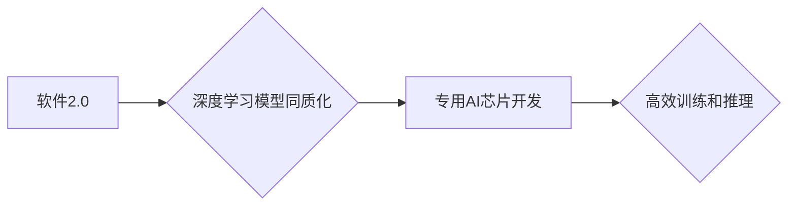

> 软件2.0,专用AI芯片,同质化,深度学习,模型压缩,硬件加速

## 1. 背景介绍

近年来，人工智能（AI）技术蓬勃发展，深度学习算法取得了令人瞩目的成就。然而，深度学习模型的训练和推理过程对计算资源需求极高，这限制了其在边缘设备和移动端等场景的应用。为了解决这一问题，专用AI芯片应运而生。

专用AI芯片针对深度学习算法的特点，设计了高效的计算架构和内存组织，能够显著提高模型的训练和推理速度，同时降低功耗。然而，专用AI芯片的开发成本高昂，需要对深度学习算法和硬件架构有深入的了解。

## 2. 核心概念与联系

**2.1 软件2.0**

软件2.0是指以深度学习模型为核心，以数据为驱动，以算法为引擎的新一代软件形态。它打破了传统软件的逻辑编程模式，以数据驱动的方式进行决策和推理，具有更高的智能性和适应性。

**2.2 专用AI芯片**

专用AI芯片是指专门为深度学习算法设计的芯片，其架构和指令集针对深度学习算法的特点进行优化，能够高效地执行卷积、池化、激活函数等深度学习运算。

**2.3 同质化**

软件2.0的深度学习模型在结构和功能上呈现出越来越高的同质化趋势。例如，许多主流的深度学习模型都是基于Transformer架构，其结构和参数规模相似。

**2.4 联系**

软件2.0的同质化趋势为专用AI芯片的开发提供了重要的基础。由于深度学习模型的结构和功能趋于一致，可以设计通用化的硬件架构和指令集，支持多种深度学习模型的运行。

**Mermaid 流程图**



## 3. 核心算法原理 & 具体操作步骤

**3.1 算法原理概述**

专用AI芯片的核心算法原理是将深度学习模型的计算任务分解成多个并行可执行的子任务，并利用专用硬件加速器高效地执行这些子任务。

**3.2 算法步骤详解**

1. **模型压缩:** 将深度学习模型压缩成更小的规模，减少模型参数和计算量。
2. **模型转换:** 将压缩后的模型转换为专用AI芯片的指令集。
3. **硬件加速:** 利用专用AI芯片的加速器执行模型的计算任务。
4. **结果输出:** 将计算结果输出到内存或其他设备。

**3.3 算法优缺点**

**优点:**

* **提高训练和推理速度:** 专用AI芯片的硬件加速能够显著提高模型的训练和推理速度。
* **降低功耗:** 专用AI芯片的低功耗设计能够延长设备的续航时间。
* **提高模型精度:** 通过模型压缩和硬件加速，可以提高模型的精度。

**缺点:**

* **开发成本高昂:** 专用AI芯片的开发成本高昂，需要专业的硬件设计和软件开发团队。
* **模型移植困难:** 将深度学习模型移植到专用AI芯片上可能需要进行复杂的代码修改和优化。

**3.4 算法应用领域**

专用AI芯片的应用领域非常广泛，包括：

* **智能手机:** 用于语音识别、图像识别、人脸识别等应用。
* **物联网设备:** 用于边缘计算、智能家居、工业自动化等应用。
* **自动驾驶:** 用于感知、决策、控制等应用。
* **医疗保健:** 用于疾病诊断、药物研发等应用。

## 4. 数学模型和公式 & 详细讲解 & 举例说明

**4.1 数学模型构建**

深度学习模型的训练过程可以看作是一个优化问题，目标是找到模型参数，使得模型在训练数据上的损失函数最小。

损失函数通常定义为预测值与真实值的差值，例如均方误差（MSE）:

$$
MSE = \frac{1}{N} \sum_{i=1}^{N} (y_i - \hat{y}_i)^2
$$

其中：

* $N$ 是样本数量
* $y_i$ 是真实值
* $\hat{y}_i$ 是预测值

**4.2 公式推导过程**

为了找到最优的模型参数，可以使用梯度下降算法。梯度下降算法的基本思想是沿着损失函数的梯度方向更新模型参数，直到损失函数达到最小值。

梯度下降算法的更新公式为：

$$
\theta = \theta - \alpha \nabla L(\theta)
$$

其中：

* $\theta$ 是模型参数
* $\alpha$ 是学习率
* $\nabla L(\theta)$ 是损失函数对模型参数的梯度

**4.3 案例分析与讲解**

例如，在图像分类任务中，可以使用卷积神经网络（CNN）作为模型。CNN的结构包含多个卷积层、池化层和全连接层。

在训练CNN模型时，可以使用梯度下降算法更新模型参数。

## 5. 项目实践：代码实例和详细解释说明

**5.1 开发环境搭建**

* 操作系统：Ubuntu 20.04
* 编程语言：Python 3.8
* 深度学习框架：TensorFlow 2.0
* 专用AI芯片平台：Xilinx Alveo U280

**5.2 源代码详细实现**

```python
import tensorflow as tf

# 定义模型结构
model = tf.keras.models.Sequential([
    tf.keras.layers.Conv2D(32, (3, 3), activation='relu', input_shape=(28, 28, 1)),
    tf.keras.layers.MaxPooling2D((2, 2)),
    tf.keras.layers.Conv2D(64, (3, 3), activation='relu'),
    tf.keras.layers.MaxPooling2D((2, 2)),
    tf.keras.layers.Flatten(),
    tf.keras.layers.Dense(10, activation='softmax')
])

# 编译模型
model.compile(optimizer='adam',
              loss='sparse_categorical_crossentropy',
              metrics=['accuracy'])

# 训练模型
model.fit(x_train, y_train, epochs=10)

# 保存模型
model.save('mnist_model.h5')
```

**5.3 代码解读与分析**

这段代码定义了一个简单的卷积神经网络模型，用于手写数字识别任务。

* `tf.keras.models.Sequential` 创建了一个顺序模型，将层级依次连接。
* `tf.keras.layers.Conv2D` 定义了一个卷积层，用于提取图像特征。
* `tf.keras.layers.MaxPooling2D` 定义了一个池化层，用于降低特征图的尺寸。
* `tf.keras.layers.Flatten` 将多维特征图转换为一维向量。
* `tf.keras.layers.Dense` 定义了一个全连接层，用于分类。
* `model.compile` 编译模型，指定优化器、损失函数和评价指标。
* `model.fit` 训练模型，使用训练数据进行训练。
* `model.save` 保存训练好的模型。

**5.4 运行结果展示**

训练完成后，可以将模型应用于测试数据，评估模型的性能。

## 6. 实际应用场景

**6.1 智能手机**

专用AI芯片可以用于智能手机中的语音识别、图像识别、人脸识别等应用，提高手机的智能化程度。

**6.2 物联网设备**

专用AI芯片可以用于物联网设备中的边缘计算，例如智能家居、工业自动化等，实现设备的本地智能化处理。

**6.3 自动驾驶**

专用AI芯片可以用于自动驾驶中的感知、决策、控制等应用，提高自动驾驶系统的安全性、可靠性和智能化程度。

**6.4 医疗保健**

专用AI芯片可以用于医疗保健中的疾病诊断、药物研发等应用，提高医疗诊断的准确性和效率。

**6.5 未来应用展望**

随着专用AI芯片技术的不断发展，其应用场景将更加广泛，例如：

* 人机交互：实现更加自然、流畅的人机交互。
* 个性化服务：提供更加个性化、定制化的服务。
* 科学研究：加速科学研究的进程。

## 7. 工具和资源推荐

**7.1 学习资源推荐**

* 深度学习书籍：
    * 《深度学习》
    * 《动手学深度学习》
* 在线课程：
    * Coursera 深度学习课程
    * Udacity 深度学习工程师 Nanodegree

**7.2 开发工具推荐**

* 深度学习框架：
    * TensorFlow
    * PyTorch
* 专用AI芯片平台：
    * Xilinx Alveo
    * Intel Nervana

**7.3 相关论文推荐**

* 《MobileBERT: A Compact BERT for Mobile Devices》
* 《EfficientNet: Rethinking Model Scaling for Convolutional Neural Networks》

## 8. 总结：未来发展趋势与挑战

**8.1 研究成果总结**

专用AI芯片的开发取得了显著进展，能够有效地加速深度学习模型的训练和推理过程。

**8.2 未来发展趋势**

* **更强大的计算能力:** 专用AI芯片的计算能力将继续提升，能够支持更复杂的深度学习模型。
* **更低的功耗:** 专用AI芯片的功耗将进一步降低，能够延长设备的续航时间。
* **更广泛的应用场景:** 专用AI芯片的应用场景将更加广泛，覆盖更多领域。

**8.3 面临的挑战**

* **模型移植困难:** 将深度学习模型移植到专用AI芯片上可能需要进行复杂的代码修改和优化。
* **开发成本高昂:** 专用AI芯片的开发成本高昂，需要专业的硬件设计和软件开发团队。
* **生态系统建设:** 专用AI芯片的生态系统还需要进一步完善，需要更多的开发者和应用。

**8.4 研究展望**

未来，研究者将继续探索更有效的深度学习算法和硬件架构，以提高专用AI芯片的性能和效率。同时，也将致力于解决模型移植、开发成本和生态系统建设等挑战，推动专用AI芯片的广泛应用。

## 9. 附录：常见问题与解答

**9.1 如何将深度学习模型移植到专用AI芯片上？**

将深度学习模型移植到专用AI芯片上需要进行以下步骤：

1. 使用模型转换工具将深度学习模型转换为专用AI芯片的指令集。
2. 对模型进行优化，例如模型压缩、量化等，以降低模型的计算量和内存占用。
3. 将优化后的模型部署到专用AI芯片上，并进行测试和验证。

**9.2 专用AI芯片的开发成本高昂吗？**

是的，专用AI芯片的开发成本高昂，需要专业的硬件设计和软件开发团队。

**9.3 专用AI芯片的生态系统如何？**

专用AI芯片的生态系统还需要进一步完善，需要更多的开发者和应用。

作者：禅与计算机程序设计艺术 / Zen and the Art of Computer Programming


<end_of_turn>