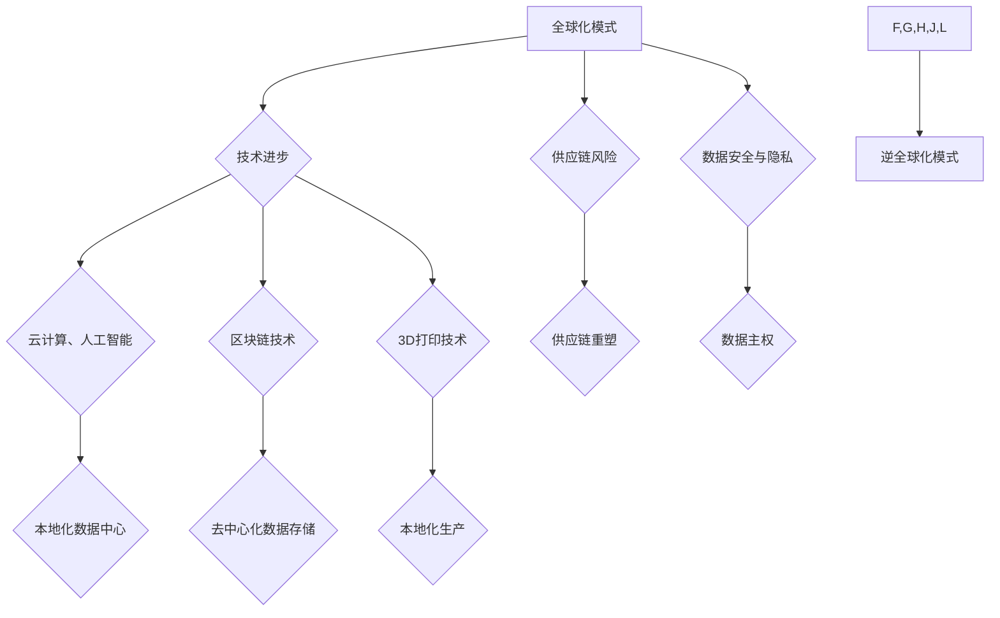

> 逆全球化、技术驱动、供应链韧性、数据安全、数字 sovereignty、去中心化、云计算、人工智能、区块链

## 1. 背景介绍

近年来，全球化进程遭遇逆转，逆全球化浪潮逐渐兴起。从贸易保护主义到供应链重塑，从数据安全到数字主权，一系列因素共同推动着世界经济和社会结构的深刻变革。

传统的全球化模式，以自由贸易、跨国投资和全球供应链为核心，在过去几十年中推动了经济增长和全球一体化。然而，随着科技进步、地缘政治紧张和社会价值观的演变，逆全球化趋势逐渐显现。

## 2. 核心概念与联系

**2.1 逆全球化概念**

逆全球化是指在全球化进程中，国家和企业逐渐减少对国际经济和政治的依赖，转向更加自给自足、封闭的模式。

**2.2 技术驱动逆全球化**

科技进步是逆全球化浪潮的重要推动力。

* **云计算和人工智能:** 
    * 云计算技术使得企业能够在本地部署数据中心，降低对海外数据中心的依赖。
    * 人工智能技术可以帮助企业自动化生产流程，减少对海外劳动力资源的依赖。
* **区块链技术:** 
    * 区块链技术可以实现去中心化的数据存储和交易，减少对集中式平台的依赖。
* **3D打印技术:** 
    * 3D打印技术可以实现本地化生产，减少对全球供应链的依赖。

**2.3 供应链韧性**

全球疫情和地缘政治冲突暴露了全球供应链的脆弱性。企业开始寻求更加分散、弹性的供应链模式，以降低风险。

**2.4 数据安全和数字主权**

数据安全和数字主权成为国家和企业关注的焦点。各国政府加强数据保护法规，企业也更加重视数据安全和隐私保护。

**2.5  Mermaid 流程图**



## 3. 核心算法原理 & 具体操作步骤

**3.1 算法原理概述**

逆全球化趋势的形成是一个复杂的过程，涉及多个因素的相互作用。我们可以通过构建数学模型来分析这些因素之间的关系，并预测逆全球化的发展趋势。

**3.2 算法步骤详解**

1. **数据收集:** 收集相关数据，包括贸易数据、投资数据、技术发展数据、地缘政治数据等。
2. **数据分析:** 使用统计学、机器学习等方法分析数据，识别出影响逆全球化的关键因素。
3. **模型构建:** 基于分析结果，构建数学模型，描述逆全球化趋势的形成机制。
4. **模型验证:** 使用历史数据验证模型的准确性，并进行调整优化。
5. **预测分析:** 使用模型预测未来逆全球化的发展趋势。

**3.3 算法优缺点**

* **优点:** 
    * 可以量化分析逆全球化的影响因素。
    * 可以预测未来逆全球化的发展趋势。
* **缺点:** 
    * 数学模型的构建需要大量的专业知识和经验。
    * 模型的准确性取决于数据的质量和模型的复杂度。

**3.4 算法应用领域**

* **经济学:** 预测全球经济发展趋势、分析贸易政策的影响。
* **政治学:** 研究地缘政治风险、预测国际关系的变化。
* **科技发展:** 评估新技术的社会影响、制定科技发展战略。

## 4. 数学模型和公式 & 详细讲解 & 举例说明

**4.1 数学模型构建**

我们可以构建一个简单的数学模型来描述逆全球化趋势的形成。假设：

*  `G`：全球化指数
*  `T`：技术进步指数
*  `S`：供应链风险指数
*  `D`：数据安全指数

则逆全球化指数 `N` 可以表示为：

$$N = f(G, T, S, D)$$

其中，`f` 是一个非线性函数，描述了这些因素之间的相互作用关系。

**4.2 公式推导过程**

我们可以通过分析各个因素对逆全球化的影响，推导 `f` 函数的具体形式。例如，我们可以假设：

*  `G` 和 `N` 呈负相关，即全球化指数越高，逆全球化指数越低。
*  `T` 和 `N` 呈正相关，即技术进步指数越高，逆全球化指数越高。
*  `S` 和 `N` 呈正相关，即供应链风险指数越高，逆全球化指数越高。
*  `D` 和 `N` 呈正相关，即数据安全指数越高，逆全球化指数越高。

基于这些假设，我们可以构建一个简单的线性模型：

$$N = aG + bT + cS + dD$$

其中，`a`、`b`、`c`、`d` 是待定系数。

**4.3 案例分析与讲解**

我们可以使用历史数据来估计模型参数，并验证模型的准确性。例如，我们可以使用过去 20 年的全球化指数、技术进步指数、供应链风险指数和数据安全指数数据，来预测过去 20 年的逆全球化指数。

## 5. 项目实践：代码实例和详细解释说明

**5.1 开发环境搭建**

* 操作系统：Linux
* 编程语言：Python
* 数据分析库：Pandas、NumPy
* 机器学习库：Scikit-learn

**5.2 源代码详细实现**

```python
import pandas as pd
from sklearn.linear_model import LinearRegression

# 加载数据
data = pd.read_csv('globalization_data.csv')

# 提取特征变量和目标变量
X = data[['globalization_index', 'technology_index', 'supply_chain_risk_index', 'data_security_index']]
y = data['globalization_index']

# 创建线性回归模型
model = LinearRegression()

# 训练模型
model.fit(X, y)

# 预测逆全球化指数
predictions = model.predict(X)

# 打印模型参数
print(model.coef_)
print(model.intercept_)
```

**5.3 代码解读与分析**

* 代码首先加载数据，并提取特征变量和目标变量。
* 然后，创建线性回归模型，并使用训练数据训练模型。
* 最后，使用训练好的模型预测逆全球化指数，并打印模型参数。

**5.4 运行结果展示**

运行代码后，会输出模型参数和预测结果。我们可以通过分析模型参数，了解各个因素对逆全球化的影响程度。

## 6. 实际应用场景

**6.1 经济政策制定**

逆全球化趋势对经济政策制定具有重要影响。政府可以利用逆全球化模型，预测逆全球化对经济的影响，并制定相应的政策应对。

**6.2 企业战略规划**

企业需要根据逆全球化趋势调整其战略规划。例如，企业可以考虑分散供应链、加强数据安全保护、开发本地化产品等。

**6.3 国际关系研究**

逆全球化趋势对国际关系也有重要影响。研究人员可以利用逆全球化模型，分析逆全球化对国际关系的影响，并预测未来国际关系的变化。

**6.4 未来应用展望**

随着科技进步和数据量的增加，逆全球化模型将更加完善和准确。未来，逆全球化模型可以应用于更广泛的领域，例如：

* **教育:** 分析逆全球化对教育的影响，并制定相应的教育政策。
* **文化:** 研究逆全球化对文化的影响，并促进文化交流与融合。
* **环境:** 分析逆全球化对环境的影响，并制定相应的环境保护政策。

## 7. 工具和资源推荐

**7.1 学习资源推荐**

* **书籍:**
    * 《逆全球化：世界经济的新格局》
    * 《后全球化时代》
* **在线课程:**
    * Coursera: Globalisation and its Discontents
    * edX: The Future of Globalization

**7.2 开发工具推荐**

* **Python:** 
    * Pandas
    * NumPy
    * Scikit-learn
* **R:** 
    * Tidyverse
    * caret

**7.3 相关论文推荐**

* **The Rise of Reverse Globalization**
* **Globalization and its Discontents**
* **The Future of Globalization**

## 8. 总结：未来发展趋势与挑战

**8.1 研究成果总结**

通过分析逆全球化趋势的形成机制，我们可以更好地理解其背后的原因和影响。

**8.2 未来发展趋势**

逆全球化趋势将继续发展，并对世界经济和社会结构产生深远影响。

**8.3 面临的挑战**

* **数据获取和分析:** 逆全球化模型需要大量的数据支持，而获取高质量的数据仍然是一个挑战。
* **模型复杂度:** 逆全球化是一个复杂的过程，需要构建更加复杂的模型来准确预测其发展趋势。
* **政策制定:** 逆全球化趋势对政策制定提出了新的挑战，需要政府制定更加灵活和有效的政策应对。

**8.4 研究展望**

未来，我们需要继续深入研究逆全球化趋势，并开发更加完善的模型和工具，以更好地应对逆全球化带来的挑战。

## 9. 附录：常见问题与解答

**9.1 什么是逆全球化？**

逆全球化是指在全球化进程中，国家和企业逐渐减少对国际经济和政治的依赖，转向更加自给自足、封闭的模式。

**9.2 逆全球化趋势的形成原因是什么？**

逆全球化趋势的形成原因是多方面的，包括科技进步、供应链风险、数据安全、地缘政治紧张等因素。

**9.3 逆全球化对世界经济和社会结构有什么影响？**

逆全球化趋势将对世界经济和社会结构产生深远影响，例如：

* 贸易格局发生变化
* 供应链更加分散
* 数据安全和隐私保护更加重要
* 国家主权得到加强

**9.4 如何应对逆全球化带来的挑战？**

应对逆全球化带来的挑战需要多方面的努力，例如：

* 政府制定更加灵活和有效的政策
* 企业调整其战略规划
* 个人提升自身技能和竞争力


作者：禅与计算机程序设计艺术 / Zen and the Art of Computer Programming 
<end_of_turn>