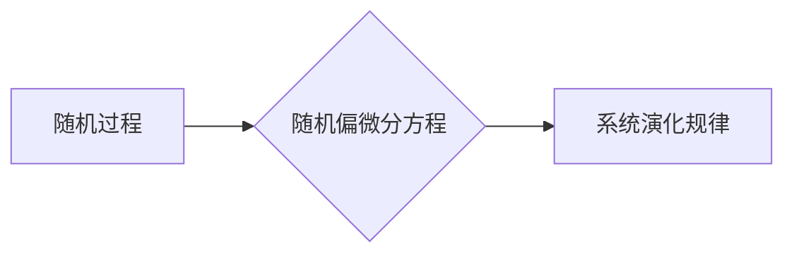

> 随机分析,随机偏微分方程,马尔可夫链,蒙特卡罗方法,金融建模,随机过程

## 1. 背景介绍

在现代科学和工程领域，随机现象无处不在。从股票市场价格的波动到天气预报的不确定性，从分子运动的随机性到网络流量的波动性，随机性是描述和理解复杂系统的核心要素。为了有效地分析和建模这些随机系统，我们需要借助强大的数学工具——随机分析。

随机分析是研究随机过程的数学分支，它为理解和预测随机现象提供了理论基础。其中，随机偏微分方程 (Stochastic Partial Differential Equations, SPDEs) 作为随机分析的重要组成部分，在描述随机系统演化过程方面发挥着至关重要的作用。

SPDEs 结合了偏微分方程和随机过程的思想，能够刻画随机系统在时间和空间上的演化规律。它们在金融建模、物理学、生物学、工程学等领域有着广泛的应用。

## 2. 核心概念与联系

### 2.1 随机过程

随机过程是指随时间推移而变化的随机变量的集合。例如，股票价格随时间变化就是一个随机过程。

### 2.2 偏微分方程

偏微分方程是描述物理量在空间和时间上的变化规律的方程。例如，热传导方程描述了温度在空间和时间上的变化规律。

### 2.3 随机偏微分方程

随机偏微分方程将随机过程和偏微分方程结合起来，描述随机系统在时间和空间上的演化规律。

**Mermaid 流程图**



## 3. 核心算法原理 & 具体操作步骤

### 3.1 算法原理概述

解决随机偏微分方程通常采用数值方法，其中蒙特卡罗方法是一种常用的算法。蒙特卡罗方法利用随机数的性质，通过模拟大量随机事件来逼近随机偏微分方程的解。

### 3.2 算法步骤详解

1. **离散化时间和空间:** 将时间和空间域离散化，将随机偏微分方程转化为离散时间和空间的差分方程。
2. **随机采样:** 在每个时间步长和空间点，根据随机过程的性质，采样随机数来模拟随机项的影响。
3. **迭代求解:** 利用差分方程和随机采样结果，迭代求解随机偏微分方程的解。
4. **结果统计:** 收集多个模拟结果，并进行统计分析，以逼近随机偏微分方程的解。

### 3.3 算法优缺点

**优点:**

* 适用于复杂随机系统，能够处理非线性、多维随机偏微分方程。
* 算法原理简单易懂，易于实现。

**缺点:**

* 由于依赖于随机采样，结果存在一定的随机误差。
* 计算量较大，需要大量的随机采样才能获得较高的精度。

### 3.4 算法应用领域

* **金融建模:** 模拟股票价格波动、期权定价等。
* **物理学:** 模拟流体流动、扩散过程等。
* **生物学:** 模拟细胞生长、基因表达等。
* **工程学:** 模拟结构振动、材料疲劳等。

## 4. 数学模型和公式 & 详细讲解 & 举例说明

### 4.1 数学模型构建

考虑一个一维随机偏微分方程：

$$
\frac{\partial u(x,t)}{\partial t} = \frac{\partial^2 u(x,t)}{\partial x^2} + \sigma(u(x,t))\dot{W}(x,t)
$$

其中：

* $u(x,t)$ 是随机过程的解，表示系统在位置 $x$ 和时间 $t$ 的状态。
* $\sigma(u(x,t))$ 是随机项的强度，取决于系统状态。
* $\dot{W}(x,t)$ 是维纳过程，表示随机扰动。

### 4.2 公式推导过程

该方程描述了系统状态随时间和空间变化的规律，其中随机项 $\sigma(u(x,t))\dot{W}(x,t)$ 表示系统受到随机扰动的影响。

### 4.3 案例分析与讲解

例如，在金融建模中，我们可以用随机偏微分方程来模拟股票价格的波动。其中，$u(x,t)$ 表示股票价格，$\sigma(u(x,t))$ 表示股票价格波动率，$\dot{W}(x,t)$ 表示随机事件的影响，例如市场新闻、经济数据等。

## 5. 项目实践：代码实例和详细解释说明

### 5.1 开发环境搭建

* 编程语言：Python
* 库依赖：NumPy, SciPy, Matplotlib

### 5.2 源代码详细实现

```python
import numpy as np
from scipy.stats import norm
import matplotlib.pyplot as plt

# 参数设置
dt = 0.01
T = 1
S0 = 100
sigma = 0.2
r = 0.05

# 生成随机数
dW = np.random.normal(0, np.sqrt(dt), int(T/dt))

# 计算股票价格
S = S0 * np.exp((r - 0.5 * sigma**2) * T + sigma * np.cumsum(dW))

# 绘制股票价格走势图
plt.plot(S)
plt.title('股票价格走势图')
plt.xlabel('时间')
plt.ylabel('价格')
plt.show()
```

### 5.3 代码解读与分析

该代码实现了一个简单的股票价格模拟，利用蒙特卡罗方法模拟股票价格的波动。

* 首先，设置参数，包括时间步长、模拟时间、初始价格、波动率和风险利率。
* 然后，生成随机数，模拟随机事件的影响。
* 最后，计算股票价格，并绘制股票价格走势图。

### 5.4 运行结果展示

运行代码后，会生成一个股票价格走势图，展示股票价格随时间的随机波动。

## 6. 实际应用场景

### 6.1 金融建模

* **股票价格预测:** 利用随机偏微分方程模拟股票价格的波动，预测未来股票价格走势。
* **期权定价:** 计算期权的价值，根据随机偏微分方程模拟股票价格的波动。
* **风险管理:** 评估投资组合的风险，利用随机偏微分方程模拟市场波动。

### 6.2 物理学

* **流体动力学:** 模拟流体流动，例如气流、水流等。
* **扩散过程:** 模拟物质在空间中的扩散，例如热扩散、污染物扩散等。
* **量子力学:** 描述量子粒子的运动，例如电子、光子等。

### 6.3 生物学

* **细胞生长:** 模拟细胞的生长和分裂过程。
* **基因表达:** 模拟基因表达的随机性。
* **种群动态:** 模拟种群的演化和变化。

### 6.4 未来应用展望

随着计算能力的提升和算法的改进，随机偏微分方程在更多领域将得到应用，例如：

* **人工智能:** 用于训练深度学习模型，提高模型的鲁棒性和泛化能力。
* **气候模型:** 模拟气候变化，预测未来气候趋势。
* **医疗诊断:** 用于分析医学图像，辅助医生诊断疾病。

## 7. 工具和资源推荐

### 7.1 学习资源推荐

* **书籍:**
    * "Stochastic Calculus for Finance II: Continuous-Time Models" by Steven Shreve
    * "An Introduction to Stochastic Differential Equations" by Bernt Øksendal
* **在线课程:**
    * Coursera: "Stochastic Calculus" by University of California, San Diego
    * edX: "Stochastic Processes" by University of Oxford

### 7.2 开发工具推荐

* **编程语言:** Python, C++, MATLAB
* **数值计算库:** NumPy, SciPy, MATLAB

### 7.3 相关论文推荐

* "A Monte Carlo Method for Solving Stochastic Differential Equations" by Kloeden and Platen
* "Numerical Methods for Stochastic Differential Equations" by Milstein

## 8. 总结：未来发展趋势与挑战

### 8.1 研究成果总结

随机分析和随机偏微分方程在过去几十年取得了显著进展，为理解和建模随机系统提供了强大的理论工具。

### 8.2 未来发展趋势

* **高维随机偏微分方程:** 研究高维随机偏微分方程的数值方法和理论性质。
* **非线性随机偏微分方程:** 研究非线性随机偏微分方程的解的存在性和唯一性。
* **随机偏微分方程的应用:** 将随机偏微分方程应用于更多领域，例如人工智能、气候模型、医疗诊断等。

### 8.3 面临的挑战

* **计算复杂度:** 随机偏微分方程的数值求解通常需要大量的计算资源。
* **理论分析:** 随机偏微分方程的理论性质仍然存在很多未解之谜。
* **应用推广:** 将随机偏微分方程应用于实际问题仍然面临很多挑战。

### 8.4 研究展望

未来，随机分析和随机偏微分方程的研究将继续深入，为理解和建模复杂随机系统提供更强大的工具和理论基础。

## 9. 附录：常见问题与解答

### 9.1 什么是随机过程？

随机过程是指随时间推移而变化的随机变量的集合。例如，股票价格随时间变化就是一个随机过程。

### 9.2 什么是偏微分方程？

偏微分方程是描述物理量在空间和时间上的变化规律的方程。例如，热传导方程描述了温度在空间和时间上的变化规律。

### 9.3 蒙特卡罗方法是什么？

蒙特卡罗方法是一种利用随机数的性质，通过模拟大量随机事件来逼近随机偏微分方程的解的数值方法。


作者：禅与计算机程序设计艺术 / Zen and the Art of Computer Programming 
<end_of_turn>