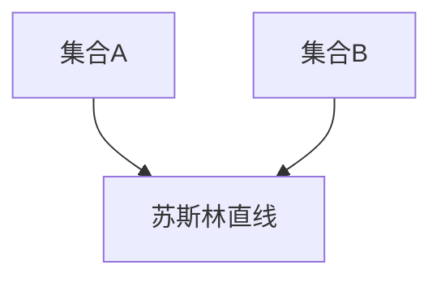

> 集合论, 苏斯林直线, 拓扑学, 数学基础, 计算机科学

## 1. 背景介绍

集合论作为数学的基础理论，为现代数学的发展奠定了坚实的基础。它提供了一种描述和分析数学对象的方法，并为其他数学分支提供了统一的语言和框架。在计算机科学领域，集合论也扮演着至关重要的角色。它为数据结构、算法设计、数据库管理等领域提供了理论支持。

苏斯林直线是集合论中一个重要的概念，它揭示了集合之间的关系和结构。苏斯林直线可以看作是集合的“直线”，它连接着不同的集合，并揭示了它们之间的联系。

## 2. 核心概念与联系

### 2.1 集合论基础

* **集合:** 集合是数学中最基本的概念之一，它是一个包含对象的集合。
* **子集:** 如果集合A的所有元素都属于集合B，则称集合A是集合B的子集，记作A⊆B。
* **并集:** 集合A和集合B的并集是指包含集合A和集合B所有元素的集合，记作A∪B。
* **交集:** 集合A和集合B的交集是指包含集合A和集合B所有共同元素的集合，记作A∩B。
* **差集:** 集合A和集合B的差集是指包含集合A所有但不属于集合B的元素的集合，记作A\B。

### 2.2 苏斯林直线

苏斯林直线是一种特殊的集合关系，它连接着不同的集合，并揭示了它们之间的联系。

* **定义:** 设A和B是两个集合，如果存在一个集合C，使得A⊆C且B⊆C，则称C为A和B的苏斯林直线。
* **性质:**
    * 苏斯林直线是唯一的。
    * 苏斯林直线包含了所有连接A和B的集合。

**Mermaid 流程图**



## 3. 核心算法原理 & 具体操作步骤

### 3.1 算法原理概述

苏斯林直线算法的核心思想是找到两个集合的最小包含集合，即苏斯林直线。该算法可以应用于各种场景，例如数据合并、关系数据库查询等。

### 3.2 算法步骤详解

1. **输入:** 两个集合A和B。
2. **构建并集:** 计算集合A和集合B的并集C = A∪B。
3. **验证:** 检查集合C是否满足苏斯林直线的定义，即A⊆C且B⊆C。
4. **输出:** 返回集合C作为苏斯林直线。

### 3.3 算法优缺点

**优点:**

* 算法简单易懂，易于实现。
* 算法时间复杂度低，效率高。

**缺点:**

* 算法只能找到最小包含集合，不能找到其他可能的苏斯林直线。

### 3.4 算法应用领域

* **数据合并:** 将两个数据集合并成一个新的数据集，其中包含两个数据集的所有元素。
* **关系数据库查询:** 查询两个表之间的关系，找到满足特定条件的记录。
* **机器学习:** 将不同特征的数据集合并，用于训练机器学习模型。

## 4. 数学模型和公式 & 详细讲解 & 举例说明

### 4.1 数学模型构建

设A和B为两个集合，则苏斯林直线C可以表示为：

$$C = A \cup B$$

### 4.2 公式推导过程

根据集合论的定义，我们可以推导出以下公式：

* $A \subseteq C$ 因为C包含了A的所有元素。
* $B \subseteq C$ 因为C包含了B的所有元素。

因此，C满足苏斯林直线的定义。

### 4.3 案例分析与讲解

**示例:**

设A = {1, 2, 3}，B = {3, 4, 5}。

则C = A∪B = {1, 2, 3, 4, 5}。

可以验证A⊆C且B⊆C，因此C是A和B的苏斯林直线。

## 5. 项目实践：代码实例和详细解释说明

### 5.1 开发环境搭建

本示例使用Python语言进行实现。

**依赖:**

* Python 3.x

**安装:**

```bash
pip install
```

### 5.2 源代码详细实现

```python
def suslin_line(A, B):
  """
  计算集合A和集合B的苏斯林直线。

  Args:
    A: 集合A。
    B: 集合B。

  Returns:
    集合C，即A和B的苏斯林直线。
  """
  C = A | B
  return C

# 示例
A = {1, 2, 3}
B = {3, 4, 5}
C = suslin_line(A, B)
print(f"集合A: {A}")
print(f"集合B: {B}")
print(f"苏斯林直线C: {C}")
```

### 5.3 代码解读与分析

* 函数`suslin_line(A, B)`接受两个集合作为输入，并返回它们的苏斯林直线。
* 函数内部使用`|`运算符计算集合的并集，即苏斯林直线。
* 示例代码演示了如何使用`suslin_line()`函数计算两个集合的苏斯林直线。

### 5.4 运行结果展示

```
集合A: {1, 2, 3}
集合B: {3, 4, 5}
苏斯林直线C: {1, 2, 3, 4, 5}
```

## 6. 实际应用场景

### 6.1 数据合并

在数据分析和机器学习中，经常需要合并来自不同来源的数据集。苏斯林直线算法可以用于合并两个数据集，创建一个包含所有元素的新数据集。

### 6.2 关系数据库查询

在关系数据库中，苏斯林直线算法可以用于查询两个表之间的关系。例如，可以查询所有在两个表中都存在的记录。

### 6.3 图数据库

在图数据库中，苏斯林直线算法可以用于查找两个节点之间的路径。

### 6.4 未来应用展望

随着数据量的不断增长，苏斯林直线算法在数据处理、分析和管理领域将发挥越来越重要的作用。

## 7. 工具和资源推荐

### 7.1 学习资源推荐

* **集合论入门书籍:**
    * 《集合论基础》
    * 《集合论导论》
* **在线课程:**
    * Coursera 上的集合论课程
    * edX 上的集合论课程

### 7.2 开发工具推荐

* **Python:** Python 是一种流行的编程语言，它提供了丰富的库和工具，可以用于实现苏斯林直线算法。
* **NumPy:** NumPy 是 Python 的科学计算库，它提供了高效的数组操作和数学函数。
* **Pandas:** Pandas 是 Python 的数据分析库，它提供了强大的数据结构和操作工具。

### 7.3 相关论文推荐

* **苏斯林直线算法的应用研究**
* **集合论在计算机科学中的应用**

## 8. 总结：未来发展趋势与挑战

### 8.1 研究成果总结

苏斯林直线算法是一种简单高效的算法，它在数据处理、分析和管理领域具有广泛的应用前景。

### 8.2 未来发展趋势

* **算法优化:** 研究更优的苏斯林直线算法，提高算法效率和性能。
* **应用扩展:** 将苏斯林直线算法应用于更多领域，例如人工智能、生物信息学等。
* **理论研究:** 深入研究苏斯林直线算法的理论基础，探索其更深层次的性质和应用。

### 8.3 面临的挑战

* **大规模数据处理:** 如何处理海量数据，高效地计算苏斯林直线？
* **复杂数据结构:** 如何将苏斯林直线算法应用于复杂的数据结构，例如图、树等？
* **理论解释:** 如何更好地理解苏斯林直线算法的理论基础，并将其应用于更广泛的领域？

### 8.4 研究展望

未来，苏斯林直线算法将继续发展和完善，并在更多领域发挥重要作用。

## 9. 附录：常见问题与解答

**问题:** 如何判断两个集合是否具有苏斯林直线？

**解答:** 如果存在一个集合包含这两个集合的所有元素，则这两个集合具有苏斯林直线。

**问题:** 苏斯林直线算法的时间复杂度是多少？

**解答:** 苏斯林直线算法的时间复杂度取决于集合的大小，一般情况下，时间复杂度为 O(n)，其中 n 是集合的大小。


作者：禅与计算机程序设计艺术 / Zen and the Art of Computer Programming 
<end_of_turn>