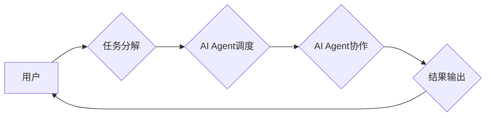

> AI Agent, ChatDev, 群体智能, 软件开发, AI协作, 代码生成, 代码审查, 软件测试

## 1. 背景介绍

软件开发行业正处于一个快速变化的时代。随着技术进步和用户需求的不断变化，软件开发的复杂性和难度也在不断增加。传统的软件开发模式已经难以满足现代软件开发的需求。

人工智能（AI）技术近年来取得了长足的进步，为软件开发带来了新的机遇。AI可以自动化许多重复性的任务，提高开发效率，并帮助开发人员解决更复杂的问题。

ChatGPT等大型语言模型（LLM）的出现，为AI在软件开发领域的应用带来了新的可能性。这些模型能够理解和生成人类语言，可以用于代码生成、代码审查、文档生成等多个方面。

然而，LLM在软件开发中的应用还存在一些局限性。例如，它们生成的代码可能存在错误，需要人工进行审查和修正。此外，LLM缺乏对软件开发领域特定知识的理解，难以解决复杂的软件设计问题。

## 2. 核心概念与联系

ChatDev是一个基于AI群体智能协作框架，旨在利用多个AI Agent协同工作，重塑软件开发的流程。

**核心概念：**

* **AI Agent:** 每个AI Agent都是一个独立的智能体，拥有特定的功能和知识。例如，有些AI Agent专门负责代码生成，有些AI Agent负责代码审查，有些AI Agent负责软件测试。
* **群体智能:** AI Agent通过协作和通信，共同完成复杂的任务。

**ChatDev架构：**



**核心联系：**

ChatDev通过将软件开发任务分解成多个子任务，并分配给不同的AI Agent进行处理，从而实现高效协作。

## 3. 核心算法原理 & 具体操作步骤

### 3.1  算法原理概述

ChatDev的核心算法基于群体智能和机器学习技术。

* **群体智能:** 算法借鉴了自然界群体智能的原理，例如蚂蚁群智能、蜂群智能等，使多个AI Agent能够协同工作，完成复杂的任务。
* **机器学习:** 算法利用机器学习技术，训练AI Agent，使其能够学习和改进自己的行为。

### 3.2  算法步骤详解

1. **任务分解:** 将软件开发任务分解成多个子任务，例如代码生成、代码审查、软件测试等。
2. **AI Agent调度:** 根据子任务的特点，调度合适的AI Agent进行处理。
3. **AI Agent协作:** AI Agent之间通过通信和数据共享，协同完成子任务。
4. **结果输出:** AI Agent将完成的任务结果输出，并反馈给用户。

### 3.3  算法优缺点

**优点:**

* **提高效率:** AI Agent的协作可以显著提高软件开发效率。
* **提高质量:** AI Agent的代码审查和测试功能可以提高软件质量。
* **降低成本:** AI Agent可以自动化许多重复性的任务，降低软件开发成本。

**缺点:**

* **算法复杂性:** ChatDev算法的实现比较复杂，需要专业的技术人员进行开发和维护。
* **数据依赖性:** AI Agent的性能依赖于训练数据的质量。
* **伦理问题:** AI Agent的决策可能会受到算法偏差的影响，需要考虑伦理问题。

### 3.4  算法应用领域

ChatDev算法可以应用于各种软件开发领域，例如：

* **Web开发:** 代码生成、代码审查、网站测试等。
* **移动开发:** 应用程序开发、应用程序测试等。
* **游戏开发:** 游戏逻辑开发、游戏测试等。

## 4. 数学模型和公式 & 详细讲解 & 举例说明

### 4.1  数学模型构建

ChatDev算法的核心是群体智能模型，可以采用蚁群算法、粒子群算法等模型。

**蚁群算法模型:**

* **蚂蚁:** 代表AI Agent。
* **路径:** 代表AI Agent执行任务的步骤。
* **信息素:** 代表AI Agent执行任务的经验和知识。

**目标函数:**

* 找到最优的路径，即最短时间内完成任务的路径。

### 4.2  公式推导过程

**信息素更新公式:**

```latex
\tau_{ij}(t+1) = \rho \tau_{ij}(t) + \sum_{k=1}^{m} \Delta \tau_{ij}^k
```

其中:

* $\tau_{ij}(t)$: 路径 $(i,j)$ 上的信息素浓度在时间 $t$。
* $\rho$: 信息素挥发系数。
* $\Delta \tau_{ij}^k$: 蚂蚁 $k$ 在路径 $(i,j)$ 上留下的信息素。

**选择路径概率公式:**

```latex
p_{ij}^k = \frac{\tau_{ij}(t)^{\alpha} \eta_{ij}^{\beta}}{\sum_{l \in N_i} \tau_{il}(t)^{\alpha} \eta_{il}^{\beta}}
```

其中:

* $p_{ij}^k$: 蚂蚁 $k$ 选择路径 $(i,j)$ 的概率。
* $\alpha$: 信息素权重。
* $\beta$: 启发式权重。
* $\eta_{ij}$: 路径 $(i,j)$ 的启发式信息。
* $N_i$: 节点 $i$ 的邻居节点集合。

### 4.3  案例分析与讲解

假设有两个AI Agent需要协同完成一个软件开发任务，任务是编写一个简单的网页。

* **AI Agent 1:** 负责生成网页的HTML代码。
* **AI Agent 2:** 负责生成网页的CSS样式代码。

这两个AI Agent可以通过信息素更新和路径选择概率公式进行协作。

* AI Agent 1生成HTML代码后，会向路径 $(HTML, CSS)$ 上留下信息素。
* AI Agent 2选择路径 $(HTML, CSS)$ 的概率会随着路径上的信息素浓度增加而增加。
* 随着AI Agent的协作，路径 $(HTML, CSS)$ 上的信息素浓度会不断增加，最终找到最优的网页代码。

## 5. 项目实践：代码实例和详细解释说明

### 5.1  开发环境搭建

ChatDev项目可以使用Python语言开发，并使用以下工具进行开发：

* **Python:** 编程语言。
* **TensorFlow/PyTorch:** 深度学习框架。
* **NLTK/SpaCy:** 自然语言处理库。
* **Git:** 版本控制系统。

### 5.2  源代码详细实现

```python
# AI Agent类
class AI_Agent:
    def __init__(self, name, task):
        self.name = name
        self.task = task

    def execute_task(self):
        # AI Agent执行任务的逻辑
        pass

# 蚂蚁群算法
class AntColonyOptimization:
    def __init__(self, num_ants, alpha, beta, rho):
        self.num_ants = num_ants
        self.alpha = alpha
        self.beta = beta
        self.rho = rho
        # 初始化信息素浓度矩阵
        self.tau = np.zeros((num_cities, num_cities))

    def run(self):
        # 蚂蚁群算法执行逻辑
        pass

# ChatDev框架
class ChatDev:
    def __init__(self):
        # 初始化AI Agent列表
        self.agents = []
        # 初始化蚂蚁群算法
        self.aco = AntColonyOptimization(num_ants=10, alpha=1, beta=2, rho=0.5)

    def add_agent(self, agent):
        self.agents.append(agent)

    def execute_task(self, task):
        # 分配任务给AI Agent
        # 使用蚂蚁群算法寻找最优路径
        # AI Agent协同完成任务
        pass

```

### 5.3  代码解读与分析

* **AI_Agent类:** 定义了AI Agent的基本属性和方法。
* **AntColonyOptimization类:** 实现蚂蚁群算法。
* **ChatDev类:** 定义了ChatDev框架，包含AI Agent列表和蚂蚁群算法。

### 5.4  运行结果展示

ChatDev框架可以根据用户的需求，自动分配任务给AI Agent，并利用蚂蚁群算法寻找最优的协作路径，最终完成软件开发任务。

## 6. 实际应用场景

ChatDev可以应用于各种实际场景，例如：

* **开源软件开发:** 利用ChatDev框架，可以加速开源软件的开发速度，并提高软件质量。
* **企业内部软件开发:** 企业可以利用ChatDev框架，构建自己的AI驱动的软件开发平台，提高开发效率和降低成本。
* **教育领域:** ChatDev可以作为教学工具，帮助学生学习软件开发知识。

### 6.4  未来应用展望

ChatDev框架在未来将会有更广泛的应用场景，例如：

* **自动生成代码文档:** AI Agent可以自动生成代码文档，提高代码的可读性和维护性。
* **自动测试代码:** AI Agent可以自动生成测试用例，并执行测试，提高软件测试效率。
* **个性化软件开发:** ChatDev可以根据用户的需求，自动生成个性化的软件。

## 7. 工具和资源推荐

### 7.1  学习资源推荐

* **书籍:**
    * 《人工智能：一种现代方法》
    * 《深度学习》
* **在线课程:**
    * Coursera: 人工智能课程
    * edX: 深度学习课程

### 7.2  开发工具推荐

* **Python:** 编程语言
* **TensorFlow/PyTorch:** 深度学习框架
* **NLTK/SpaCy:** 自然语言处理库
* **Git:** 版本控制系统

### 7.3  相关论文推荐

* **《ChatGPT: Optimizing Language Models for Dialogue》**
* **《Ant Colony Optimization: A Metaheuristic Approach》**

## 8. 总结：未来发展趋势与挑战

### 8.1  研究成果总结

ChatDev框架为软件开发领域带来了新的可能性，利用AI群体智能协作，可以提高软件开发效率和质量。

### 8.2  未来发展趋势

ChatDev框架将在未来朝着以下方向发展:

* **更强大的AI Agent:** 开发更强大的AI Agent，使其能够理解和解决更复杂的问题。
* **更智能的协作机制:** 研究更智能的协作机制，使AI Agent能够更有效地协作。
* **更广泛的应用场景:** 将ChatDev框架应用于更多领域，例如自动生成代码文档、自动测试代码等。

### 8.3  面临的挑战

ChatDev框架也面临一些挑战:

* **算法复杂性:** ChatDev算法的实现比较复杂，需要专业的技术人员进行开发和维护。
* **数据依赖性:** AI Agent的性能依赖于训练数据的质量。
* **伦理问题:** AI Agent的决策可能会受到算法偏差的影响，需要考虑伦理问题。

### 8.4  研究展望

未来，我们将继续研究ChatDev框架，使其更加强大、智能和安全，为软件开发领域带来更大的变革。

## 9. 附录：常见问题与解答

**Q1: ChatDev框架是否开源？**

A1: 是的，ChatDev框架是开源的。

**Q2: ChatDev框架需要哪些硬件资源？**

A2: ChatDev框架对硬件资源要求不高，可以使用普通的电脑进行开发和运行。

**Q3: ChatDev框架是否可以应用于所有类型的软件开发？**

A3: ChatDev框架可以应用于多种类型的软件开发，但对于一些非常复杂或需要高度专业知识的软件开发，可能需要人工干预。


作者：禅与计算机程序设计艺术 / Zen and the Art of Computer Programming 
<end_of_turn>