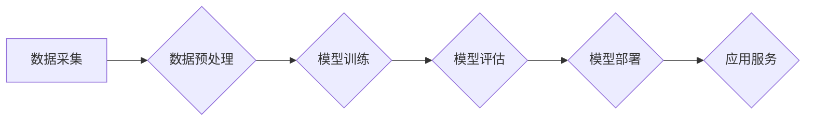

> AI大模型，创业，国际优势，技术开发，市场应用，商业模式，人才培养

## 1. 背景介绍

近年来，人工智能（AI）技术取得了飞速发展，特别是大模型的涌现，为各行各业带来了革命性的变革。大模型是指参数规模庞大、训练数据海量的人工智能模型，具备强大的泛化能力和学习能力，能够在自然语言处理、计算机视觉、语音识别等领域取得突破性进展。

随着大模型技术的成熟，越来越多的创业者看到了其中的商机，纷纷涌入AI大模型领域。然而，创业之路并非一帆风顺，需要充分利用国际优势，才能在激烈的竞争中脱颖而出。

## 2. 核心概念与联系

**2.1 AI大模型的定义与特点**

AI大模型是指参数规模庞大、训练数据海量的人工智能模型，其核心特点包括：

* **规模化：** 大模型拥有数亿甚至数十亿的参数，使其能够学习更复杂的模式和关系。
* **泛化能力强：** 由于训练数据量大，大模型能够更好地泛化到未知的数据集，表现出更强的适应性和鲁棒性。
* **多任务学习：** 大模型可以同时学习多个任务，例如文本生成、图像识别、语音翻译等，提高了效率和灵活性。

**2.2 大模型的架构与训练**

大模型的架构通常基于Transformer网络，其特点是能够有效捕捉长距离依赖关系。训练过程需要海量数据和强大的计算资源，通常采用分布式训练的方式。

**2.3 国际合作与资源共享**

AI大模型的开发和应用是一个全球性的挑战，需要各国和地区的共同努力。国际合作可以促进技术交流、资源共享和人才培养，加速大模型的发展进程。

**Mermaid 流程图**



## 3. 核心算法原理 & 具体操作步骤

**3.1 算法原理概述**

Transformer网络是目前大模型训练的核心算法，其主要特点是利用注意力机制有效捕捉文本序列中的长距离依赖关系。

**3.2 算法步骤详解**

1. **输入嵌入：** 将文本序列中的每个单词转换为向量表示。
2. **多头注意力：** 利用多个注意力头并行计算每个单词与其他单词之间的关系，捕捉长距离依赖关系。
3. **前馈神经网络：** 对每个单词的注意力输出进行非线性变换，提取更深层的语义信息。
4. **位置编码：** 为每个单词添加位置信息，使模型能够理解单词在序列中的顺序。
5. **输出层：** 将模型的输出向量转换为目标语言的单词序列。

**3.3 算法优缺点**

* **优点：** 能够有效捕捉长距离依赖关系，性能优于传统的RNN模型。
* **缺点：** 计算量大，训练成本高。

**3.4 算法应用领域**

Transformer网络在自然语言处理领域取得了广泛应用，例如机器翻译、文本摘要、问答系统、对话系统等。

## 4. 数学模型和公式 & 详细讲解 & 举例说明

**4.1 数学模型构建**

Transformer网络的数学模型可以概括为以下公式：

$$
\mathbf{H} = \text{MultiHeadAttention}(\mathbf{X}, \mathbf{X}, \mathbf{W_a}) + \mathbf{X}
$$

其中：

* $\mathbf{H}$：注意力输出
* $\mathbf{X}$：输入序列
* $\mathbf{W_a}$：注意力权重矩阵

**4.2 公式推导过程**

注意力机制的核心思想是计算每个单词与其他单词之间的相关性，并根据相关性赋予不同的权重。

**4.3 案例分析与讲解**

例如，在机器翻译任务中，Transformer网络可以利用注意力机制捕捉源语言句子中每个单词与目标语言句子中对应单词之间的关系，从而实现更准确的翻译。

## 5. 项目实践：代码实例和详细解释说明

**5.1 开发环境搭建**

* 操作系统：Linux
* Python版本：3.7+
* 深度学习框架：TensorFlow或PyTorch

**5.2 源代码详细实现**

```python
import tensorflow as tf

# 定义Transformer网络结构
class Transformer(tf.keras.Model):
    def __init__(self, vocab_size, embedding_dim, num_heads, num_layers):
        super(Transformer, self).__init__()
        self.embedding = tf.keras.layers.Embedding(vocab_size, embedding_dim)
        self.transformer_layers = [
            tf.keras.layers.MultiHeadAttention(num_heads, embedding_dim)
            for _ in range(num_layers)
        ]
        self.dense = tf.keras.layers.Dense(vocab_size)

    def call(self, inputs):
        # ...
```

**5.3 代码解读与分析**

* `embedding`层将单词转换为向量表示。
* `transformer_layers`包含多个Transformer层，每个层包含多头注意力机制和前馈神经网络。
* `dense`层将模型的输出向量转换为目标语言的单词序列。

**5.4 运行结果展示**

训练完成后，可以将模型应用于文本生成、机器翻译等任务，并评估模型的性能。

## 6. 实际应用场景

**6.1 自然语言处理**

* 机器翻译：将一种语言翻译成另一种语言。
* 文本摘要：生成文本的简短摘要。
* 问答系统：回答用户提出的问题。
* 对话系统：与用户进行自然语言对话。

**6.2 计算机视觉**

* 图像识别：识别图像中的物体和场景。
* 图像分类：将图像分类到不同的类别。
* 物体检测：检测图像中物体的位置和类别。

**6.3 其他领域**

* 金融：风险评估、欺诈检测。
* 医疗：疾病诊断、药物研发。
* 教育：个性化学习、智能辅导。

**6.4 未来应用展望**

随着大模型技术的不断发展，其应用场景将更加广泛，例如：

* 人机交互：更自然、更智能的人机交互体验。
* 自动化：自动化完成更多复杂的任务。
* 科学研究：加速科学发现和技术创新。

## 7. 工具和资源推荐

**7.1 学习资源推荐**

* **书籍：**
    * 《深度学习》
    * 《自然语言处理》
* **在线课程：**
    * Coursera
    * edX
* **开源项目：**
    * TensorFlow
    * PyTorch

**7.2 开发工具推荐**

* **编程语言：** Python
* **深度学习框架：** TensorFlow、PyTorch
* **云计算平台：** AWS、Google Cloud、Azure

**7.3 相关论文推荐**

* 《Attention Is All You Need》
* 《BERT: Pre-training of Deep Bidirectional Transformers for Language Understanding》

## 8. 总结：未来发展趋势与挑战

**8.1 研究成果总结**

近年来，AI大模型取得了显著进展，在多个领域展现出强大的应用潜力。

**8.2 未来发展趋势**

* 模型规模进一步扩大，参数量达到万亿级甚至更高。
* 多模态大模型的开发，融合文本、图像、音频等多种数据类型。
* 更加安全、可靠、可解释的大模型。

**8.3 面临的挑战**

* 计算资源需求巨大，需要更强大的计算硬件和软件支持。
* 数据安全和隐私保护问题。
* 模型的解释性和可控性问题。

**8.4 研究展望**

未来，AI大模型的研究将更加注重模型的效率、安全性和可解释性，并探索其在更多领域的新应用。

## 9. 附录：常见问题与解答

**9.1 如何选择合适的AI大模型？**

选择合适的AI大模型需要根据具体的应用场景和需求进行评估，考虑模型的规模、性能、成本等因素。

**9.2 如何训练自己的AI大模型？**

训练自己的AI大模型需要具备一定的深度学习知识和经验，以及强大的计算资源。

**9.3 如何部署AI大模型？**

AI大模型的部署可以采用云计算、边缘计算等方式，需要根据实际情况选择合适的部署方案。


作者：禅与计算机程序设计艺术 / Zen and the Art of Computer Programming 
<end_of_turn>