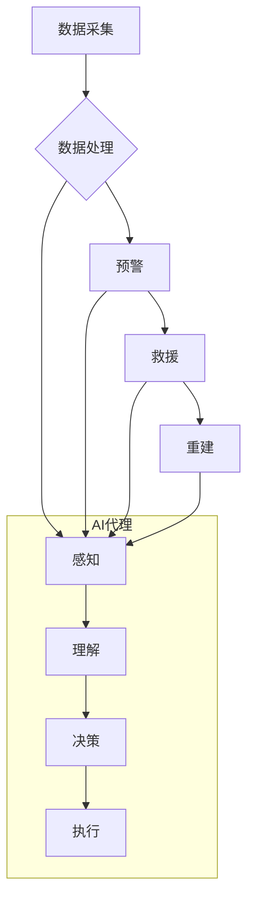

> AI代理, 防灾减灾, 工作流, 人工智能, 机器学习, 自然语言处理, 数据分析, 决策支持

## 1. 背景介绍

自然灾害是人类社会面临的重大挑战之一，其带来的巨大损失和灾难性后果给人们的生命财产安全带来了严重威胁。传统的防灾减灾工作模式往往依赖于人工操作和经验判断，效率低下，难以应对突发事件。随着人工智能技术的快速发展，AI代理技术逐渐成为防灾减灾领域的新兴热点。

AI代理是一种能够自主学习、决策和执行任务的智能系统，它可以模拟人类的行为，并根据预设的目标和环境信息进行智能决策。在防灾减灾系统中，AI代理可以扮演多个角色，例如：

* **灾害预警和监测:** 利用传感器数据、气象预报等信息，AI代理可以对潜在的灾害进行预警和监测，及时发出预警信号，帮助人们做好防范准备。
* **灾害救援和应急响应:** 在灾害发生后，AI代理可以根据实时信息，规划救援路线，协调救援资源，提高救援效率。
* **灾后重建和恢复:** AI代理可以帮助评估灾害损失，规划重建方案，协调资源分配，加速灾后重建和恢复。

## 2. 核心概念与联系

**2.1 AI代理工作流**

AI代理工作流是指AI代理在完成特定任务过程中所遵循的一系列步骤和规则。它通常包括以下几个阶段：

* **感知阶段:** AI代理通过传感器、网络数据等方式获取环境信息。
* **理解阶段:** AI代理对获取的信息进行分析和理解，提取关键信息。
* **决策阶段:** AI代理根据理解到的信息，制定相应的行动方案。
* **执行阶段:** AI代理执行决策方案，并反馈执行结果。

**2.2 防灾减灾系统架构**

防灾减灾系统通常由以下几个模块组成：

* **数据采集模块:** 收集灾害相关数据，例如气象数据、地震数据、水位数据等。
* **数据处理模块:** 对采集到的数据进行预处理、清洗、分析等操作。
* **预警模块:** 基于数据分析结果，对潜在的灾害进行预警。
* **救援模块:** 协调救援资源，规划救援路线，指导救援行动。
* **重建模块:** 评估灾害损失，规划重建方案，协调资源分配。

**2.3 AI代理与防灾减灾系统**

AI代理可以嵌入到防灾减灾系统的各个模块中，发挥其智能化优势。例如，AI代理可以帮助数据处理模块进行更精准的数据分析，提高预警模块的预警准确率，优化救援模块的救援决策，加速重建模块的重建效率。



## 3. 核心算法原理 & 具体操作步骤

**3.1 算法原理概述**

在防灾减灾系统中，AI代理通常采用以下几种核心算法：

* **机器学习:** 用于从历史数据中学习灾害模式和预警规则。
* **自然语言处理:** 用于处理灾害相关文本信息，例如新闻报道、社交媒体数据等。
* **数据分析:** 用于分析灾害相关数据，发现潜在的灾害风险。
* **决策树:** 用于根据预警信息和环境条件，制定相应的行动方案。

**3.2 算法步骤详解**

以机器学习算法为例，其在防灾减灾系统中的具体操作步骤如下：

1. **数据收集:** 收集历史灾害数据，包括灾害类型、发生时间、地点、强度等信息。
2. **数据预处理:** 对收集到的数据进行清洗、转换、编码等操作，使其适合机器学习算法的训练。
3. **模型训练:** 选择合适的机器学习算法，例如支持向量机、决策树、神经网络等，对预处理后的数据进行训练，建立灾害预警模型。
4. **模型评估:** 使用测试数据对训练好的模型进行评估，评估模型的准确率、召回率等指标。
5. **模型部署:** 将训练好的模型部署到防灾减灾系统中，用于实时预警。

**3.3 算法优缺点**

**优点:**

* 能够从历史数据中学习灾害模式，提高预警准确率。
* 可以自动识别和分析灾害相关信息，减少人工干预。
* 可以根据实时数据进行动态调整，提高预警的及时性和准确性。

**缺点:**

* 需要大量的历史数据进行训练，否则模型的准确率会降低。
* 对数据质量要求较高，数据不准确或不完整会影响模型的性能。
* 难以应对未知的灾害类型。

**3.4 算法应用领域**

机器学习算法在防灾减灾领域有广泛的应用，例如：

* **地震预警:** 利用地震波数据进行地震预警。
* **洪水预警:** 利用水位数据、降雨数据进行洪水预警。
* **火灾预警:** 利用气象数据、火灾历史数据进行火灾预警。

## 4. 数学模型和公式 & 详细讲解 & 举例说明

**4.1 数学模型构建**

在防灾减灾系统中，可以使用数学模型来描述灾害的发生、发展和影响。例如，可以使用Logistic回归模型来预测灾害发生的概率，可以使用线性回归模型来预测灾害的损失程度。

**4.2 公式推导过程**

以Logistic回归模型为例，其目标是预测灾害发生的概率，其数学公式如下：

$$
P(Y=1|X) = \frac{1}{1 + e^{-(w^T X + b)}}
$$

其中：

* $P(Y=1|X)$ 是灾害发生的概率，
* $X$ 是灾害相关特征向量，
* $w$ 是模型参数向量，
* $b$ 是模型偏置项。

**4.3 案例分析与讲解**

假设我们想要预测洪水发生的概率，我们可以使用Logistic回归模型，并将以下特征作为输入：降雨量、水位、历史洪水记录等。通过训练模型，我们可以得到模型参数 $w$ 和 $b$，然后将新的数据输入模型，即可预测洪水发生的概率。

## 5. 项目实践：代码实例和详细解释说明

**5.1 开发环境搭建**

本项目使用Python语言开发，需要安装以下软件包：

* Python 3.x
* TensorFlow 或 PyTorch
* NumPy
* Pandas

**5.2 源代码详细实现**

```python
import tensorflow as tf

# 定义模型
model = tf.keras.models.Sequential([
    tf.keras.layers.Dense(128, activation='relu', input_shape=(n_features,)),
    tf.keras.layers.Dense(64, activation='relu'),
    tf.keras.layers.Dense(1, activation='sigmoid')
])

# 编译模型
model.compile(optimizer='adam',
              loss='binary_crossentropy',
              metrics=['accuracy'])

# 训练模型
model.fit(X_train, y_train, epochs=10)

# 评估模型
loss, accuracy = model.evaluate(X_test, y_test)
print('Loss:', loss)
print('Accuracy:', accuracy)

# 预测
predictions = model.predict(X_new)
```

**5.3 代码解读与分析**

这段代码定义了一个简单的Logistic回归模型，并使用TensorFlow框架进行训练和评估。

* `tf.keras.models.Sequential` 创建了一个顺序模型，即层级结构的模型。
* `tf.keras.layers.Dense` 定义了全连接层，每个神经元都连接到上一层的每个神经元。
* `activation='relu'` 指定了激活函数为ReLU函数，可以提高模型的表达能力。
* `input_shape=(n_features,)` 指定了输入数据的维度。
* `optimizer='adam'` 指定了优化算法为Adam算法，可以加速模型训练。
* `loss='binary_crossentropy'` 指定了损失函数为二分类交叉熵函数，用于计算模型预测结果与真实结果之间的差异。
* `metrics=['accuracy']` 指定了评估指标为准确率，用于衡量模型的性能。

**5.4 运行结果展示**

训练完成后，模型会输出训练过程中的损失值和准确率，以及在测试集上的损失值和准确率。

## 6. 实际应用场景

**6.1 灾害预警系统**

AI代理可以集成到灾害预警系统中，根据实时数据进行灾害预警，例如：

* 利用气象数据、地震数据等，预测洪水、地震、台风等灾害的发生时间、地点和强度。
* 根据灾害预警信息，向相关人员发送预警短信、语音提示等，提醒他们做好防范准备。

**6.2 灾害救援系统**

AI代理可以帮助优化灾害救援行动，例如：

* 根据灾害情况和救援资源，规划最优的救援路线，提高救援效率。
* 利用无人机、机器人等智能设备，进行灾区勘探、搜救等任务。
* 根据灾区情况，协调救援物资分配，确保救援物资及时到达灾区。

**6.3 灾后重建系统**

AI代理可以帮助加速灾后重建工作，例如：

* 利用卫星图像、无人机影像等，评估灾害损失，规划重建方案。
* 根据重建方案，协调资源分配，加速重建进度。
* 利用大数据分析，预测灾后重建过程中可能出现的风险，并采取相应的措施。

**6.4 未来应用展望**

随着人工智能技术的不断发展，AI代理在防灾减灾领域的应用将更加广泛和深入。例如：

* 利用深度学习算法，提高灾害预警的准确率和时效性。
* 利用自然语言处理技术，分析灾害相关信息，例如社交媒体数据、新闻报道等，及时了解灾情变化。
* 利用虚拟现实、增强现实等技术，模拟灾害场景，进行灾害演练和应急预案演练。

## 7. 工具和资源推荐

**7.1 学习资源推荐**

* **在线课程:** Coursera、edX、Udacity 等平台提供人工智能、机器学习等相关课程。
* **书籍:** 《深度学习》、《机器学习实战》等书籍可以帮助读者深入了解人工智能相关知识。
* **开源项目:** TensorFlow、PyTorch 等开源项目可以帮助读者实践人工智能算法。

**7.2 开发工具推荐**

* **Python:** Python 是人工智能开发的常用语言，拥有丰富的库和工具。
* **Jupyter Notebook:** Jupyter Notebook 是一个交互式编程环境，方便进行代码编写、调试和可视化。
* **TensorFlow/PyTorch:** TensorFlow 和 PyTorch 是两个流行的深度学习框架。

**7.3 相关论文推荐**

* **自然语言处理:** BERT、GPT-3 等论文介绍了最新的自然语言处理技术。
* **机器学习:** AlphaGo、DeepMind 等论文介绍了最新的机器学习算法。
* **计算机视觉:** YOLO、ResNet 等论文介绍了最新的计算机视觉技术。

## 8. 总结：未来发展趋势与挑战

**8.1 研究成果总结**

近年来，AI代理在防灾减灾领域取得了显著的成果，例如：

* 提高了灾害预警的准确率和时效性。
* 优化了灾害救援行动，提高了救援效率。
* 加速了灾后重建工作，减少了灾害损失。

**8.2 未来发展趋势**

未来，AI代理在防灾减灾领域的应用将更加广泛和深入，例如