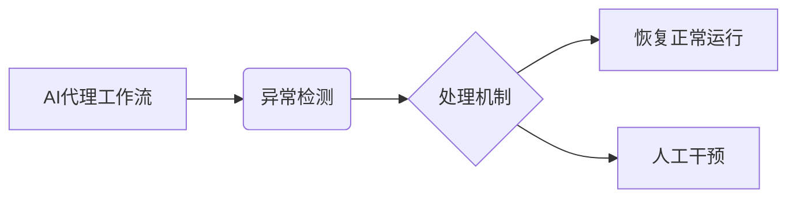

> AI代理,异常检测,工作流,机器学习,深度学习,强化学习,处理机制,自动化,可解释性

## 1. 背景介绍

随着人工智能技术的飞速发展，AI代理在各个领域扮演着越来越重要的角色。AI代理是指能够自主执行任务、学习和适应环境的智能系统。它们广泛应用于自动化流程、客户服务、数据分析等领域，极大地提高了效率和智能化水平。然而，在实际应用中，AI代理可能会遇到各种异常情况，例如数据错误、系统故障、恶意攻击等。这些异常情况会严重影响AI代理的正常运行，甚至导致系统崩溃。因此，如何有效地检测和处理AI代理工作流中的异常问题，成为了一个重要的研究课题。

传统的异常检测方法主要依赖于规则引擎，需要人工制定大量的规则来识别异常行为。这种方法的局限性在于：

* **规则难以覆盖所有异常情况：** 由于异常情况的复杂性和多样性，人工难以预见并制定所有可能的规则。
* **规则维护成本高：** 当系统环境或业务需求发生变化时，需要不断更新和维护规则，这增加了维护成本和工作量。
* **缺乏可解释性：** 规则引擎的决策过程通常是黑盒式的，难以解释为什么某个行为被判定为异常。

近年来，机器学习和深度学习技术在异常检测领域取得了显著的进展。这些技术能够从海量数据中学习异常模式，并自动识别异常行为。相比于规则引擎，机器学习和深度学习方法具有以下优势：

* **能够识别未知的异常情况：** 通过学习数据中的模式，机器学习模型能够识别出之前从未见过的异常情况。
* **自动学习和适应：** 机器学习模型能够随着时间的推移不断学习和适应环境变化，无需人工干预。
* **提高可解释性：** 一些机器学习模型，例如决策树和线性回归，能够提供相对可解释的决策过程。

## 2. 核心概念与联系

**2.1 AI代理工作流**

AI代理工作流是指AI代理执行任务的流程，通常由一系列步骤组成，每个步骤代表一个特定的任务或操作。例如，一个AI客服代理的工作流可能包括：

* 接收到用户咨询
* 理解用户意图
* 查询知识库
* 生成回复
* 发送回复

**2.2 异常检测**

异常检测是指识别与正常行为相异的异常行为的过程。异常行为可以是数据错误、系统故障、恶意攻击等。

**2.3 处理机制**

处理机制是指针对异常情况采取的措施，例如：

* 忽略异常数据
* 回滚到上一个步骤
* 触发报警
* 调用人工干预

**2.4 核心概念关系图**



## 3. 核心算法原理 & 具体操作步骤

### 3.1 算法原理概述

本篇博客将介绍基于机器学习的异常检测算法，主要包括以下几种：

* **统计方法：** 基于数据统计特征，例如均值、标准差、偏度等，识别与正常数据分布相异的数据点。
* **聚类方法：** 将数据点划分为不同的簇，识别与其他簇相异的数据点。
* **监督学习方法：** 利用标记好的训练数据，训练模型识别异常数据。

### 3.2 算法步骤详解

以基于统计方法的异常检测为例，其具体步骤如下：

1. **数据预处理：** 对原始数据进行清洗、转换和特征工程，例如删除缺失值、归一化数据、提取特征等。
2. **异常值识别：** 根据预处理后的数据，计算统计特征，例如均值、标准差、偏度等。将数据点与预设的阈值进行比较，识别出异常值。
3. **异常值处理：** 对识别出的异常值进行处理，例如忽略、修正或标记。

### 3.3 算法优缺点

**优点：**

* 计算简单，易于实现。
* 对数据量要求不高。

**缺点：**

* 难以识别复杂类型的异常。
* 阈值设置需要经验判断。

### 3.4 算法应用领域

统计方法的异常检测算法广泛应用于以下领域：

* **金融领域：** 识别欺诈交易、异常账户行为。
* **网络安全领域：** 识别恶意攻击、网络入侵。
* **工业领域：** 识别设备故障、生产异常。

## 4. 数学模型和公式 & 详细讲解 & 举例说明

### 4.1 数学模型构建

假设我们有一组数据 $X = \{x_1, x_2, ..., x_n\}$, 其中 $x_i$ 代表第 $i$ 个数据点。我们希望利用统计方法识别异常值。

**4.1.1 均值和标准差**

均值 $\mu$ 和标准差 $\sigma$ 是描述数据分布的常用统计特征。

$$
\mu = \frac{1}{n} \sum_{i=1}^{n} x_i
$$

$$
\sigma = \sqrt{\frac{1}{n-1} \sum_{i=1}^{n} (x_i - \mu)^2}
$$

**4.1.2 异常值识别阈值**

我们可以根据标准差设置一个阈值，例如 $k \sigma$，其中 $k$ 是一个常数，通常取值为 2 或 3。如果一个数据点 $x_i$ 满足以下条件，则将其视为异常值：

$$
|x_i - \mu| > k \sigma
$$

### 4.2 公式推导过程

上述公式的推导过程基于统计学的基本原理。均值代表数据的平均值，标准差代表数据的离散程度。异常值识别阈值 $k \sigma$ 的设置基于以下假设：

* 数据服从正态分布。
* 异常值在数据分布的尾部。

### 4.3 案例分析与讲解

假设我们有一组数据表示用户在电商平台上的购买金额，数据如下：

```
100, 200, 300, 400, 500, 1000, 10000
```

计算均值和标准差：

$$
\mu = \frac{1}{7} (100 + 200 + 300 + 400 + 500 + 1000 + 10000) = 1642.86
$$

$$
\sigma = \sqrt{\frac{1}{6} ((100 - 1642.86)^2 + (200 - 1642.86)^2 + ... + (10000 - 1642.86)^2)} = 3197.47
$$

设置异常值识别阈值为 $k \sigma = 3 * 3197.47 = 9592.41$。

根据公式，我们可以识别出数据点 10000 是异常值，因为它满足 $|10000 - 1642.86| > 9592.41$。

## 5. 项目实践：代码实例和详细解释说明

### 5.1 开发环境搭建

本项目使用 Python 语言进行开发，所需的库包括：

* NumPy：用于数值计算
* Pandas：用于数据处理
* Scikit-learn：用于机器学习算法

### 5.2 源代码详细实现

```python
import numpy as np
import pandas as pd
from sklearn.ensemble import IsolationForest

# 加载数据
data = pd.read_csv('data.csv')

# 数据预处理
# ...

# 训练异常检测模型
model = IsolationForest()
model.fit(data)

# 预测异常值
predictions = model.predict(data)

# 标记异常值
data['is_anomaly'] = predictions

# 保存结果
data.to_csv('result.csv', index=False)
```

### 5.3 代码解读与分析

* **数据加载和预处理:** 首先，我们使用 Pandas 库加载数据，并进行必要的预处理，例如删除缺失值、归一化数据等。
* **模型训练:** 我们使用 IsolationForest 算法训练异常检测模型。IsolationForest 是一种基于树的异常检测算法，它通过隔离异常值来识别异常数据点。
* **异常值预测:** 我们使用训练好的模型预测数据中的异常值。
* **异常值标记:** 我们将预测结果标记到数据中，方便后续分析和处理。

### 5.4 运行结果展示

运行代码后，我们将得到一个包含异常值标记的 CSV 文件。我们可以使用数据可视化工具，例如 Matplotlib 或 Seaborn，来展示异常值分布情况。

## 6. 实际应用场景

### 6.1 金融领域

* **欺诈检测:** 识别信用卡欺诈交易、账户异常行为。
* **风险管理:** 识别高风险客户、潜在的金融风险。

### 6.2 网络安全领域

* **入侵检测:** 识别网络攻击、恶意软件入侵。
* **安全日志分析:** 识别安全事件、潜在的安全威胁。

### 6.3 工业领域

* **设备故障预测:** 识别设备异常运行状态，预测设备故障。
* **生产过程监控:** 识别生产过程中的异常情况，提高生产效率。

### 6.4 未来应用展望

随着人工智能技术的不断发展，AI代理工作流中的异常检测和处理机制将得到更广泛的应用，例如：

* **智能医疗:** 识别患者异常症状、预测疾病风险。
* **智能交通:** 识别交通异常情况、优化交通流量。
* **智能家居:** 识别家居设备异常情况、提高家居安全。

## 7. 工具和资源推荐

### 7.1 学习资源推荐

* **书籍:**
    * "Anomaly Detection: Algorithms and Applications" by M. P. Singh
    * "Pattern Recognition and Machine Learning" by C. M. Bishop
* **在线课程:**
    * Coursera: "Machine Learning" by Andrew Ng
    * edX: "Introduction to Artificial Intelligence" by Columbia University

### 7.2 开发工具推荐

* **Python:** 
    * Scikit-learn: 机器学习库
    * TensorFlow: 深度学习库
    * PyTorch: 深度学习库
* **数据可视化工具:**
    * Matplotlib
    * Seaborn

### 7.3 相关论文推荐

* "Isolation Forest" by Liu, F., et al. (2008)
* "One-Class SVM for Anomaly Detection" by Schölkopf, B., et al. (2000)
* "Anomaly Detection Using Autoencoders" by Vincent, P., et al. (2008)

## 8. 总结：未来发展趋势与挑战

### 8.1 研究成果总结

本篇博客介绍了AI代理工作流中的异常检测与处理机制，重点介绍了基于机器学习的异常检测算法，并提供了代码实例和实际应用场景。

### 8.2 未来发展趋势

未来，AI代理工作流中的异常检测和处理机制将朝着以下方向发展：

* **更智能的异常检测:** 利用深度学习等更先进的机器学习算法，识别更复杂类型的异常。
* **更可解释的异常检测:** 开发更可解释的异常检测模型，提高模型的透明度和可信度。
* **更自动化处理机制:** 自动化异常处理流程，减少人工干预。

### 8.3 面临的挑战

AI代理工作流中的异常检测和处理机制仍然面临一些挑战：

* **数据质量问题:** 异常检测算法对数据质量要求较高，数据不完整、不准确会影响检测效果。
* **异常类型多样性:** 现实世界中的异常类型非常多样，难以用单一的算法进行识别。
* **可解释性问题:** 一些深度学习模型的决策过程难以解释，难以获得用户的信任。

