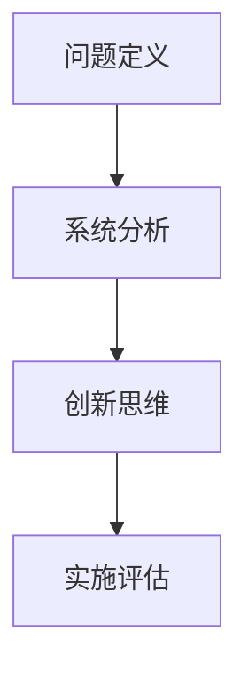

                 

# 创新思维：解决复杂问题

在快速变化的世界中，复杂问题无处不在。无论是技术难题、商业挑战还是社会议题，都需要我们运用创新思维来找到解决方案。本文将深入探讨创新思维的原理、操作步骤以及实际应用，帮助读者在面对复杂问题时，能够更加高效、系统地进行分析和解决。

## 1. 背景介绍

### 1.1 问题由来

随着科技的不断进步和社会的快速发展，问题变得越来越多样化和复杂化。技术的日新月异、商业的激烈竞争、社会的复杂治理，都需要我们具备高效的解决问题的能力。然而，复杂问题的解决往往不是一蹴而就的，它需要系统性的思考和创新的解决方案。

### 1.2 问题核心关键点

复杂问题解决的关键点包括：
- **问题定义**：清晰界定问题的本质和范围，找到问题解决的突破口。
- **系统分析**：对问题的各个要素进行深入分析，识别出关键影响因素。
- **创新思维**：利用跨学科的知识和方法，创新性地提出解决方案。
- **实施评估**：对解决方案进行实施和评估，确保问题得到根本解决。

## 2. 核心概念与联系

### 2.1 核心概念概述

为了更好地理解创新思维的原理和操作步骤，我们需要了解几个核心概念：

- **问题定义(Problem Definition)**：清晰地描述问题的核心，确定问题解决的边界。
- **系统分析(Systematic Analysis)**：通过系统化的方式分析问题，识别关键因素和潜在影响。
- **创新思维(Innovative Thinking)**：采用新颖的思路和方法，提出独特的解决方案。
- **实施评估(Implementation Evaluation)**：通过实验和评估，验证解决方案的可行性和有效性。

这些概念之间的逻辑关系可以通过以下Mermaid流程图来展示：



这个流程图展示了创新思维从问题定义到系统分析，再到创新思维和实施评估的整个过程。

## 3. 核心算法原理 & 具体操作步骤

### 3.1 算法原理概述

创新思维的本质在于通过系统分析和跨学科知识的融合，提出新颖的解决方案。其核心思想是通过深度挖掘问题本质，识别出关键因素，然后借助跨学科的创新方法，构建出独特的解决方案。

### 3.2 算法步骤详解

#### 步骤1：问题定义

- **明确问题**：对问题的现状进行详细描述，找到问题解决的入口。
- **问题分类**：将问题分为技术问题、商业问题、社会问题等，便于后续的系统分析。
- **问题界限**：确定问题解决的边界，避免过广或过窄的定义。

#### 步骤2：系统分析

- **要素识别**：列出问题的所有相关要素，包括环境、资源、人员、技术等。
- **关系建模**：使用网络、树状结构等模型，分析各要素之间的关系。
- **影响评估**：评估各个要素对问题解决的影响程度和方向。

#### 步骤3：创新思维

- **跨学科思考**：借鉴不同学科的思维方式和方法，寻找新的解决方案。
- **问题重构**：通过重新定义问题，找到新的突破口。
- **原型设计**：构建解决方案的初步原型，进行功能和性能的评估。

#### 步骤4：实施评估

- **实验设计**：设计实验或试点项目，验证解决方案的可行性和效果。
- **数据收集**：收集实验或项目的数据，进行结果分析。
- **结果评估**：评估解决方案的实施效果，提出改进建议。

### 3.3 算法优缺点

#### 优点

- **系统性**：通过系统分析，能够全面了解问题的各个方面，避免片面思考。
- **创新性**：跨学科的思考方式，有助于打破思维定势，提出独特的解决方案。
- **实践性**：通过实验和评估，能够验证解决方案的可行性和效果。

#### 缺点

- **复杂性**：系统分析和跨学科思考需要较高的思维水平和专业知识。
- **时间成本**：从问题定义到实验评估，整个过程耗时较长。
- **资源需求**：实验和试点项目需要一定的资源支持。

### 3.4 算法应用领域

创新思维不仅适用于技术开发，在商业管理、社会治理等各个领域都有广泛的应用。例如：

- **技术开发**：如软件开发、人工智能创新等。
- **商业管理**：如市场策略、产品设计等。
- **社会治理**：如公共安全、环境保护等。

## 4. 数学模型和公式 & 详细讲解 & 举例说明

### 4.1 数学模型构建

创新思维的数学模型可以描述为：

$$
\text{解决方案} = f(\text{问题定义}, \text{系统分析}, \text{创新思维}, \text{实施评估})
$$

其中，问题定义、系统分析、创新思维和实施评估是创新思维过程的四个核心环节，通过函数的映射关系，最终得出解决方案。

### 4.2 公式推导过程

以技术开发为例，假设问题定义、系统分析、创新思维和实施评估的权重分别为 $w_1, w_2, w_3, w_4$，则解决方案的数学模型为：

$$
\text{解决方案} = \sum_{i=1}^4 w_i \times \text{步骤}_i
$$

其中 $\text{步骤}_i$ 表示创新思维过程的四个步骤，根据具体问题的特点，可以通过专家打分、加权平均等方式确定各个步骤的权重。

### 4.3 案例分析与讲解

以软件开发中的系统重构为例：

1. **问题定义**：系统性能瓶颈导致用户体验不佳。
2. **系统分析**：通过分析发现，问题主要集中在数据库查询和用户界面设计两个方面。
3. **创新思维**：借鉴人工智能领域的模型优化技术，使用分布式数据库和响应式界面设计，提高系统性能和用户体验。
4. **实施评估**：通过实验验证，新的系统架构显著提高了系统的响应速度和稳定性。

## 5. 项目实践：代码实例和详细解释说明

### 5.1 开发环境搭建

在进行创新思维项目实践前，我们需要准备好开发环境。以下是使用Python进行数据分析和模型训练的环境配置流程：

1. 安装Anaconda：从官网下载并安装Anaconda，用于创建独立的Python环境。

2. 创建并激活虚拟环境：
```bash
conda create -n myenv python=3.8 
conda activate myenv
```

3. 安装Python包：
```bash
pip install pandas numpy matplotlib scikit-learn
```

4. 安装数据处理和可视化工具：
```bash
pip install seaborn jupyter notebook
```

完成上述步骤后，即可在`myenv`环境中开始创新思维的实践。

### 5.2 源代码详细实现

下面以商业管理中的市场策略优化为例，给出使用Python进行数据处理和模型训练的代码实现。

首先，定义数据处理函数：

```python
import pandas as pd
from sklearn.model_selection import train_test_split

def load_data(file_path):
    data = pd.read_csv(file_path)
    X = data.drop(['revenue'], axis=1)
    y = data['revenue']
    return train_test_split(X, y, test_size=0.2, random_state=42)

# 加载数据
X_train, X_test, y_train, y_test = load_data('sales_data.csv')

# 模型训练
from sklearn.linear_model import LinearRegression
from sklearn.metrics import mean_squared_error

model = LinearRegression()
model.fit(X_train, y_train)
y_pred = model.predict(X_test)
mse = mean_squared_error(y_test, y_pred)

print(f"Mean Squared Error: {mse:.3f}")
```

然后，定义模型评估函数：

```python
from sklearn.metrics import mean_absolute_error

def evaluate(model, X, y):
    y_pred = model.predict(X)
    mae = mean_absolute_error(y, y_pred)
    print(f"Mean Absolute Error: {mae:.3f}")
```

最后，启动市场策略优化的实验流程：

```python
# 模拟市场策略优化实验
def market_strategy_optimization(model, X_train, y_train):
    # 使用不同市场策略进行实验
    for strategy in ['low_price', 'high_quality', 'new_product']:
        # 加载数据
        X_train, X_test, y_train, y_test = load_data(f'sales_data_{strategy}.csv')

        # 模型训练和评估
        model.fit(X_train, y_train)
        evaluate(model, X_test, y_test)

        # 输出实验结果
        print(f"Strategy: {strategy}")
        evaluate(model, X_test, y_test)

# 优化实验
market_strategy_optimization(model, X_train, y_train)
```

以上就是使用Python对市场策略进行优化的完整代码实现。可以看到，得益于强大的数据分析和模型训练工具，我们可以用相对简洁的代码完成市场策略的优化实验。

### 5.3 代码解读与分析

让我们再详细解读一下关键代码的实现细节：

**load_data函数**：
- 读取数据集，去除目标变量，进行数据集的划分，并返回训练集和测试集。

**LinearRegression模型**：
- 使用线性回归模型，对销售数据进行拟合和预测。

**evaluate函数**：
- 计算模型预测值与真实值之间的MAE（平均绝对误差），评估模型的预测性能。

**market_strategy_optimization函数**：
- 循环执行不同的市场策略优化实验，加载相应的数据集，训练和评估模型，输出实验结果。

可以看到，通过Python的工具库和数据分析方法，我们能够高效地进行市场策略优化的实验。这展示了数据驱动决策的重要性，同时也体现了创新思维在商业管理中的应用。

当然，实际商业系统还需要考虑更多因素，如模型评估的指标、优化策略的落地实施、数据的质量控制等。但核心的创新思维过程基本与此类似。

## 6. 实际应用场景

### 6.1 商业管理

创新思维在商业管理中的应用非常广泛。从市场策略、产品设计到供应链管理，都可以通过系统分析和跨学科的思考，提出创新的解决方案。

例如，在产品设计中，通过借鉴设计思维（Design Thinking）的方法，企业可以与用户深度互动，了解他们的需求和痛点，设计出更加符合市场需求的产品。在市场策略中，通过数据驱动和跨学科的视角，企业可以制定更加精准和灵活的市场策略，提高市场响应速度和竞争力。

### 6.2 社会治理

在社会治理中，创新思维同样发挥着重要作用。从公共安全到环境保护，创新思维可以帮助政府找到高效的解决方案，提升治理效果。

例如，在公共安全中，通过大数据分析和跨学科的视角，政府可以识别出潜在的安全隐患，制定有针对性的预防措施，提高社会的安全性。在环境保护中，通过借鉴生态学和工程学的知识，政府可以设计出更加有效的环保方案，改善环境质量。

### 6.3 医疗健康

在医疗健康领域，创新思维同样具有重要应用价值。从疾病诊断到药物研发，都可以通过系统分析和跨学科的思考，提出创新的解决方案。

例如，在疾病诊断中，通过大数据分析和机器学习技术，医疗机构可以开发出更精准的诊断模型，提高诊断的准确性和效率。在药物研发中，通过借鉴化学和生物学的知识，科学家可以设计出更有效的药物分子，加速新药的研发进程。

### 6.4 未来应用展望

随着技术的不断进步和社会的快速发展，创新思维的应用将更加广泛和深入。未来，创新思维将在更多领域得到应用，为社会进步和经济发展提供新的动力。

1. **智能制造**：通过创新思维和大数据技术，制造业可以实现智能化的生产和管理，提高生产效率和产品质量。
2. **智慧城市**：通过创新思维和物联网技术，智慧城市可以实现更高效的城市管理和公共服务，提升城市居民的生活质量。
3. **数字金融**：通过创新思维和区块链技术，金融行业可以实现更安全、透明的金融交易和风险管理。

## 7. 工具和资源推荐

### 7.1 学习资源推荐

为了帮助开发者系统掌握创新思维的理论基础和实践技巧，这里推荐一些优质的学习资源：

1. **《创新思维：从0到1》**：这是一本经典的管理学书籍，介绍了创新思维的核心理论和方法。
2. **Coursera《创新思维与设计思维》课程**：斯坦福大学开设的创新思维课程，通过在线学习平台，带你系统掌握创新思维的基本概念和实践方法。
3. **《设计思维：实用指南》**：这本书详细介绍了设计思维的方法和工具，适用于各个领域的设计和创新项目。
4. **Khan Academy《数据分析与可视化》课程**：通过数据分析和可视化，掌握数据驱动的决策方法，适用于商业管理和社会治理中的创新思维应用。

通过这些资源的学习实践，相信你一定能够快速掌握创新思维的精髓，并用于解决实际的商业和社会问题。

### 7.2 开发工具推荐

高效的开发离不开优秀的工具支持。以下是几款用于创新思维开发的常用工具：

1. **Jupyter Notebook**：强大的交互式编程环境，支持多语言和库的集成，适用于数据分析和模型训练。
2. **Tableau**：数据可视化工具，帮助用户通过图表和仪表盘，直观地展示数据关系和趋势。
3. **MATLAB**：数值计算和仿真工具，支持多种算法和数据分析方法，适用于科学研究和技术开发。
4. **Python**：通用编程语言，具有强大的库和工具支持，适用于数据处理、分析和可视化。
5. **R**：统计分析语言，支持多种统计方法和数据可视化工具，适用于数据分析和建模。

合理利用这些工具，可以显著提升创新思维的开发效率，加快创新迭代的步伐。

### 7.3 相关论文推荐

创新思维的研究源于学界的持续探索。以下是几篇奠基性的相关论文，推荐阅读：

1. **《创新思维与复杂问题解决》**：这篇文章总结了创新思维的基本理论和方法，适用于各个领域的创新实践。
2. **《设计思维：理论与实践》**：这篇论文探讨了设计思维的基本原理和方法，适用于产品设计和市场策略的创新应用。
3. **《大数据与创新思维》**：这篇文章介绍了大数据技术在创新思维中的应用，适用于商业管理和社会治理中的创新实践。
4. **《人工智能与创新思维》**：这篇论文探讨了人工智能技术在创新思维中的应用，适用于技术开发和智能制造中的创新实践。

这些论文代表了大创新思维的发展脉络。通过学习这些前沿成果，可以帮助研究者把握学科前进方向，激发更多的创新灵感。

## 8. 总结：未来发展趋势与挑战

### 8.1 总结

本文对创新思维的原理、操作步骤和实际应用进行了全面系统的介绍。首先阐述了创新思维在解决复杂问题中的重要价值，明确了创新思维在问题定义、系统分析、创新思维和实施评估四个环节的逻辑关系。其次，从原理到实践，详细讲解了创新思维的数学模型和操作步骤，给出了创新思维任务开发的完整代码实例。同时，本文还广泛探讨了创新思维在商业管理、社会治理、医疗健康等多个领域的应用前景，展示了创新思维的广泛应用潜力。

通过本文的系统梳理，可以看到，创新思维在解决问题中起到了至关重要的作用。掌握创新思维的方法和工具，能够帮助我们在复杂多变的环境中找到突破口，提出创新的解决方案，推动社会的进步和技术的创新。

### 8.2 未来发展趋势

展望未来，创新思维将呈现以下几个发展趋势：

1. **跨学科融合**：随着技术的不断发展，跨学科的融合将成为创新思维的重要驱动力。不同领域的知识和方法的结合，将催生更多创新的应用场景和解决方案。
2. **数据驱动决策**：大数据和人工智能技术的发展，使得数据驱动的决策方法日益成熟。通过数据分析和建模，能够更准确地理解和预测复杂问题的变化趋势。
3. **用户参与设计**：设计思维中的用户参与设计方法，将使得创新过程更加注重用户体验和用户反馈，提高创新的成功率和应用价值。
4. **智能系统设计**：智能系统和自动化工具的发展，将使得创新思维的实践更加高效和可操作，降低创新过程中的资源和时间成本。

以上趋势展示了创新思维的发展前景，相信未来会有更多创新应用在各个领域中涌现。

### 8.3 面临的挑战

尽管创新思维在问题解决中具有重要作用，但在实践中也面临诸多挑战：

1. **思维定势**：长期的思维方式和习惯可能导致思维定势，限制创新思维的发挥。
2. **资源限制**：创新思维需要大量的时间和资源，特别是在数据驱动决策和智能系统设计方面，需要较强的技术和资源支持。
3. **团队协作**：创新思维需要跨学科和跨领域的团队协作，不同的专业背景和文化背景可能导致协作困难。
4. **风险管理**：创新过程中面临的未知和不确定性，需要有效的风险管理和控制机制。

这些挑战需要我们不断克服，才能让创新思维在实践中找到更广阔的应用空间。

### 8.4 研究展望

未来研究需要在以下几个方面寻求新的突破：

1. **跨学科融合**：加强跨学科的融合，推动不同领域的知识和方法的协同创新，拓展创新思维的应用边界。
2. **数据驱动决策**：进一步提升大数据和人工智能技术在创新思维中的应用，通过数据驱动的决策方法，提高创新过程的科学性和准确性。
3. **用户参与设计**：探索用户参与设计的方法和工具，提高创新过程的用户体验和满意度，推动创新应用的市场接受度。
4. **智能系统设计**：开发更加智能和高效的创新工具和平台，降低创新过程中的资源和时间成本，提高创新实践的可操作性。

这些研究方向的探索，必将引领创新思维向更高的层次发展，为复杂问题的解决提供更加系统和高效的路径。

## 9. 附录：常见问题与解答

**Q1：创新思维适用于所有问题吗？**

A: 创新思维适用于复杂问题和创新需求较高的场景，但对于简单和结构化的问题，可能需要更直接的解决方法。

**Q2：如何克服思维定势？**

A: 可以通过多学科学习和跨领域合作，开阔视野，打破思维定势。同时，引入外部专家和跨领域团队，提供新的视角和思路。

**Q3：创新思维需要哪些资源支持？**

A: 创新思维需要时间和资源，特别是在数据驱动决策和智能系统设计方面，需要强大的数据资源和技术支持。

**Q4：如何提高团队协作效率？**

A: 通过建立明确的目标和沟通机制，提高团队成员的理解和协作。引入跨学科和跨领域的团队成员，推动多学科协作和融合。

**Q5：如何管理创新过程中的风险？**

A: 建立风险评估和控制机制，通过多方案评估和模拟实验，识别潜在的风险因素，制定应对策略。

通过这些常见问题的解答，希望读者能够更好地理解创新思维的原理和操作步骤，克服实践中的挑战，实现创新思维的广泛应用。

---

作者：禅与计算机程序设计艺术 / Zen and the Art of Computer Programming

