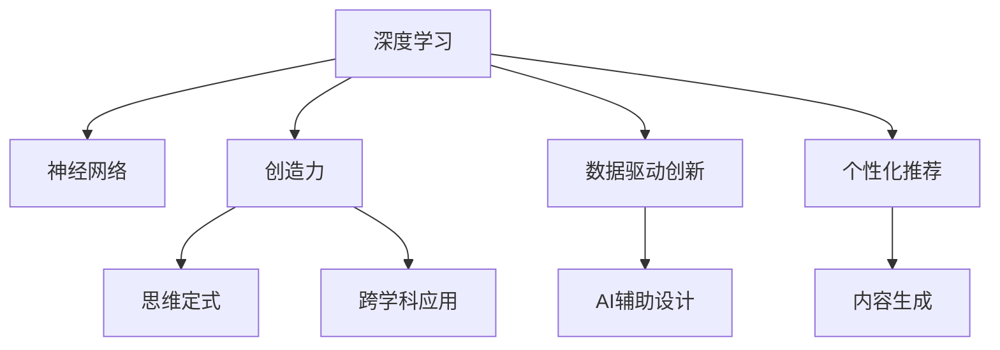

                 

# 创造力培养：打破思维定式

> 关键词：创造力,思维定式,深度学习,神经网络,人工智能,认知科学,跨学科应用

## 1. 背景介绍

### 1.1 问题由来

在当今快速变化的数字化时代，创造力成为了推动社会进步和个人发展的关键驱动力。然而，由于传统的教育体系和思维定式，人们往往难以打破常规思维，实现创新的突破。特别是在科技、艺术、设计等领域，创造力成为了推动发展的核心要素。

与此同时，人工智能(AI)技术的发展，尤其是深度学习(DL)和神经网络(NN)的突破，正在逐渐改变我们对于创造力的认知。AI不仅能够在诸多领域进行辅助设计、生成内容，甚至在某些领域已经超越了人类创造力。这种趋势促使我们思考：如何利用AI技术培养创造力，打破传统思维定式，激发创新潜力？

### 1.2 问题核心关键点

本博客旨在探讨如何利用深度学习和神经网络技术，培养和提升个人的创造力。将从核心概念、算法原理、具体实施步骤、实际应用场景等多个角度出发，深入解析如何通过技术手段打破思维定式，实现创造力的提升。

## 2. 核心概念与联系

### 2.1 核心概念概述

为更好地理解AI技术在培养创造力中的作用，本节将介绍几个密切相关的核心概念：

- 深度学习(Deep Learning)：一种通过多层神经网络实现模式识别的机器学习技术，被广泛应用于图像识别、语音识别、自然语言处理等领域。
- 神经网络(Neural Network)：一种模拟人脑神经元连接的计算模型，通过大量数据进行训练，可以学习到复杂的非线性关系。
- 创造力(Creativity)：指个体在特定任务中产生新颖、有价值、具有个人特色的想法和解决方案的能力。
- 思维定式(Mental Set)：指个体在解决问题时固有的思维模式和习惯，容易导致过于依赖已有经验和模式，难以突破创新。
- 跨学科应用(Cross-Disciplinary Applications)：利用AI技术在不同领域（如艺术、设计、医学等）进行创造性应用，推动技术创新和行业发展。

这些核心概念之间的逻辑关系可以通过以下Mermaid流程图来展示：



这个流程图展示了深度学习、神经网络、创造力、思维定式和跨学科应用之间的联系：

1. 深度学习通过神经网络结构，学习复杂模式，实现数据驱动创新。
2. 神经网络模型通过大量数据训练，能够自动发现数据中的复杂关系，辅助创造力的培养。
3. 创造力在特定任务中产生新颖、有价值的想法。
4. 思维定式限制了创造力的发挥，需要通过打破固有思维模式，激发新的创意。
5. 跨学科应用将AI技术应用于不同领域，推动技术创新和行业发展。

## 3. 核心算法原理 & 具体操作步骤
### 3.1 算法原理概述

利用AI技术培养创造力的核心在于通过深度学习和神经网络模型，发现和提取数据中的潜在模式，并应用于创新性任务的解决。这一过程主要分为以下几个步骤：

1. **数据准备**：收集相关领域的丰富数据，包括图像、文本、音频等。数据的多样性和丰富性有助于模型学习到更多的模式。

2. **模型训练**：选择适当的神经网络结构，利用大量数据对模型进行训练。训练过程通过反向传播算法优化模型参数，使其能够学习到数据的潜在关系。

3. **知识迁移**：将训练好的模型应用于新的任务或领域，通过微调或迁移学习的方式，使其能够在新任务中发挥作用。

4. **创新应用**：利用训练好的模型进行内容生成、设计辅助、个性化推荐等创新性应用，推动不同领域的创新发展。

### 3.2 算法步骤详解

本节将详细介绍利用AI技术培养创造力的具体步骤。

**Step 1: 数据收集与预处理**
- 收集与任务相关的数据，如艺术作品、设计图纸、音乐作品等。
- 进行数据清洗和预处理，如去除噪声、归一化、标准化等操作。

**Step 2: 模型选择与训练**
- 选择合适的神经网络结构，如卷积神经网络(CNN)、循环神经网络(RNN)、生成对抗网络(GAN)等。
- 利用GPU或TPU等高性能设备进行模型训练，设置合适的超参数，如学习率、批大小、迭代轮数等。

**Step 3: 模型微调与迁移学习**
- 在已有模型的基础上，针对新任务进行微调，以适应新的输入数据。
- 通过迁移学习的方式，将模型在特定领域进行迁移应用，提升在新任务中的表现。

**Step 4: 创新应用**
- 利用训练好的模型进行内容生成、设计辅助、个性化推荐等创新性应用。
- 结合用户反馈，进一步优化模型参数，提升模型效果。

### 3.3 算法优缺点

利用AI技术培养创造力的方法具有以下优点：
1. 数据驱动：通过大量数据训练，模型可以学习到复杂的非线性关系，辅助创造力的培养。
2. 高效率：利用GPU或TPU等高性能设备，可以在短时间内训练出高质量的模型。
3. 跨领域应用：通过迁移学习的方式，模型可以在多个领域进行创新应用，推动技术进步。

同时，该方法也存在以下局限性：
1. 数据依赖：高质量的数据是模型训练的前提，获取相关领域的高质量数据成本较高。
2. 模型泛化能力有限：当新任务与已有任务差异较大时，模型泛化能力可能受限。
3. 创新性不足：模型依赖已有数据进行训练，可能无法产生新颖的创意。
4. 可解释性不足：深度学习模型的决策过程难以解释，难以理解其内部工作机制。

尽管存在这些局限性，但AI技术在培养创造力方面的潜力巨大，未来仍有广阔的发展空间。

### 3.4 算法应用领域

AI技术在培养创造力方面的应用已经逐渐深入到多个领域：

- **艺术与设计**：利用AI技术进行图像生成、风格迁移、设计辅助等，提升创作效率和作品质量。
- **音乐与影视**：通过音乐生成、视频剪辑、特效设计等，辅助内容创作，实现创新表达。
- **医疗与健康**：利用AI技术进行药物设计、疾病预测、健康管理等，提升医疗服务质量和效率。
- **教育与培训**：通过个性化推荐、内容生成、智能辅导等，提升学习效果和教学质量。
- **商业与营销**：利用AI技术进行客户画像分析、个性化推荐、营销策略设计等，提升商业价值和用户体验。

## 4. 数学模型和公式 & 详细讲解 & 举例说明

### 4.1 数学模型构建

为了更好地理解AI技术在培养创造力中的应用，本节将构建一个简单的数学模型，用于描述AI技术在内容生成中的作用。

假设我们有一个文本生成任务，其中输入为一段文本描述 $x$，输出为目标文本 $y$。我们可以使用一个编码器-解码器结构，通过神经网络模型 $M$ 来生成目标文本。模型的输入为 $x$，输出为 $y$。模型 $M$ 可以表示为：

$$ M(x) = y $$

其中，$M$ 表示神经网络模型，$x$ 表示输入文本，$y$ 表示目标文本。

### 4.2 公式推导过程

为了实现文本生成任务，我们可以使用自回归模型，如LSTM或Transformer。模型的输出可以表示为：

$$ y = M(x) = \prod_{i=1}^{T} \text{softmax}(W_{i-1} h_{i-1} + b_{i-1}) $$

其中，$T$ 表示文本长度，$h_{i-1}$ 表示第 $i-1$ 个时间步的隐藏状态，$W_{i-1}$ 和 $b_{i-1}$ 分别为第 $i-1$ 个时间步的权重和偏置。

在训练过程中，我们希望最小化模型输出与真实目标文本之间的差距，即：

$$ \min_{\theta} \sum_{i=1}^{T} \mathcal{L}(y_i, M(x)) $$

其中，$\mathcal{L}$ 表示损失函数，通常使用交叉熵损失或序列交叉熵损失。

### 4.3 案例分析与讲解

以文本生成为例，我们可以使用GPT-2模型进行训练。GPT-2模型是一种基于Transformer的预训练语言模型，具有强大的文本生成能力。我们可以使用GPT-2模型作为预训练模型，对特定任务进行微调。

具体步骤为：
1. 收集与任务相关的文本数据，进行预处理。
2. 使用GPT-2模型对数据进行预训练，获得初始化参数。
3. 在特定任务的数据集上进行微调，更新模型的参数。
4. 利用微调后的模型进行文本生成，辅助创作、设计等创新任务。

## 5. 项目实践：代码实例和详细解释说明

### 5.1 开发环境搭建

在进行AI技术培养创造力的项目实践前，我们需要准备好开发环境。以下是使用Python进行TensorFlow开发的环境配置流程：

1. 安装Anaconda：从官网下载并安装Anaconda，用于创建独立的Python环境。

2. 创建并激活虚拟环境：
```bash
conda create -n tf-env python=3.8 
conda activate tf-env
```

3. 安装TensorFlow：根据CUDA版本，从官网获取对应的安装命令。例如：
```bash
conda install tensorflow -c pytorch -c conda-forge
```

4. 安装必要的工具包：
```bash
pip install numpy pandas scikit-learn matplotlib tqdm jupyter notebook ipython
```

完成上述步骤后，即可在`tf-env`环境中开始项目实践。

### 5.2 源代码详细实现

下面我们以音乐生成任务为例，给出使用TensorFlow实现的音乐生成代码。

首先，导入必要的库：

```python
import tensorflow as tf
import numpy as np
import os
import librosa
import random
```

然后，定义音乐生成器类：

```python
class MusicGenerator(tf.keras.Model):
    def __init__(self, data, embedding_dim=128, units=512, batch_size=32):
        super().__init__()
        self.data = data
        self.embedding_dim = embedding_dim
        self.units = units
        self.batch_size = batch_size
        
        # 定义模型结构
        self.rnn = tf.keras.layers.LSTM(self.units, return_sequences=True, input_shape=(self.batch_size, self.units))
        self.dense = tf.keras.layers.Dense(self.data.n_unique, activation='softmax')
    
    def call(self, inputs):
        x = self.rnn(inputs)
        x = self.dense(x[:, -1, :])
        return x
```

接着，定义训练函数：

```python
def train(model, data, epochs=10):
    # 定义优化器和损失函数
    optimizer = tf.keras.optimizers.Adam(learning_rate=0.01)
    loss_fn = tf.keras.losses.SparseCategoricalCrossentropy(from_logits=True)
    
    # 定义训练循环
    for epoch in range(epochs):
        epoch_loss = 0
        for i in range(0, len(data), model.batch_size):
            # 获取批次数据
            x = data[i:i+model.batch_size]
            y = np.eye(data.n_unique)[data[i:i+model.batch_size]]
            
            # 计算损失和梯度
            with tf.GradientTape() as tape:
                logits = model(x)
                loss = loss_fn(y, logits)
            gradients = tape.gradient(loss, model.trainable_variables)
            optimizer.apply_gradients(zip(gradients, model.trainable_variables))
            
            # 更新损失
            epoch_loss += loss.numpy() / len(data)
    
    return epoch_loss
```

最后，启动训练流程：

```python
# 定义音乐生成器
generator = MusicGenerator(data, embedding_dim=128, units=512, batch_size=32)
loss = train(generator, data)

# 生成音乐
generated_music = generator(np.eye(data.n_unique)[random.randint(0, data.n_unique-1)])
librosa.display.audioshow(generated_music, sr=data.sr)
```

以上就是使用TensorFlow实现的音乐生成代码实现。可以看到，TensorFlow提供了强大的计算图和自动微分功能，使得模型训练和优化变得高效简洁。

### 5.3 代码解读与分析

让我们再详细解读一下关键代码的实现细节：

**MusicGenerator类**：
- `__init__`方法：初始化音乐生成器，包括输入数据、嵌入维度、隐藏单元数、批大小等关键参数。
- `call`方法：定义模型结构，包括LSTM层和密集层，用于将输入转换为生成目标。

**train函数**：
- 使用Adam优化器进行模型训练，设置合适的学习率。
- 定义损失函数为稀疏分类交叉熵损失，适用于生成任务。
- 在每个批次上，使用梯度下降算法更新模型参数。
- 统计每个epoch的平均损失，并返回。

**训练流程**：
- 定义音乐生成器，指定嵌入维度、隐藏单元数、批大小等参数。
- 在训练函数中，使用生成器训练模型，并返回平均损失。
- 使用训练好的生成器生成音乐，并使用librosa库播放出来。

通过上述代码实现，可以看到TensorFlow提供的高效、灵活的计算图功能，使得音乐生成等复杂任务的实现变得简单高效。

当然，工业级的系统实现还需考虑更多因素，如模型的保存和部署、超参数的自动搜索、更加灵活的任务适配层等。但核心的生成范式基本与此类似。

## 6. 实际应用场景

### 6.1 智能设计

基于AI技术，智能设计工具能够辅助设计师进行创新性设计，提升设计效率和作品质量。例如，利用GAN技术进行风格迁移，将传统设计风格应用到现代作品，实现跨时代的设计创新。

在技术实现上，可以收集大量不同风格的设计作品，利用GAN模型进行训练，获得风格迁移模型。微调后的模型能够在新的设计作品上进行风格迁移，实现跨时代的设计风格应用。

### 6.2 艺术创作

AI技术在艺术创作中也展现出巨大的潜力。利用深度学习技术，AI可以进行图像生成、风格迁移、文本创作等，辅助艺术家进行创新创作。

例如，利用生成对抗网络(GAN)进行图像生成，训练生成模型，生成符合特定风格和主题的图像。微调后的模型能够根据用户需求生成不同风格的图像，为艺术家提供灵感和参考。

### 6.3 健康管理

在健康管理领域，AI技术可以帮助医生进行疾病预测、健康管理等。利用深度学习模型，对大量医疗数据进行学习，生成个性化健康建议。

例如，利用LSTM模型对患者的历史医疗数据进行分析，生成个性化健康建议，辅助医生进行诊断和治疗。微调后的模型能够根据新的数据，不断更新健康建议，提高医疗服务的质量。

### 6.4 未来应用展望

随着AI技术的发展，基于AI技术培养创造力的应用前景广阔，未来有望在更多领域得到应用。

在智慧城市治理中，AI技术可以用于城市事件监测、舆情分析、应急指挥等环节，提高城市管理的自动化和智能化水平，构建更安全、高效的未来城市。

在企业生产中，AI技术可以用于产品设计、工艺改进、设备维护等，推动制造业的数字化转型。

在教育培训中，AI技术可以用于个性化推荐、内容生成、智能辅导等，提升学习效果和教学质量。

总之，AI技术在培养创造力方面的应用将深刻影响各行各业，为经济社会发展注入新的动力。相信随着AI技术的不断进步，AI技术在培养创造力方面的潜力将进一步得到释放，推动社会进步。

## 7. 工具和资源推荐

### 7.1 学习资源推荐

为了帮助开发者系统掌握AI技术在培养创造力方面的应用，这里推荐一些优质的学习资源：

1. Deep Learning Specialization by Andrew Ng（Coursera课程）：由斯坦福大学教授Andrew Ng主讲，全面介绍了深度学习的基本概念和前沿技术。

2. The Unreasonable Effectiveness of Recurrent Neural Networks（Bengio论文）：深入分析了RNN在文本生成、语言建模等任务中的应用，为AI技术在创造力培养方面的应用提供了理论基础。

3. Generation of Images, Speech, Text, and Video via Neural Networks（Goodfellow论文）：全面介绍了生成对抗网络(GAN)在图像生成、语音生成等任务中的应用，展示了AI技术在创造力培养方面的巨大潜力。

4. Neural Architectures for Named Entity Recognition（Lample论文）：介绍了利用深度学习模型进行命名实体识别的方法，为AI技术在特定领域的应用提供了具体示例。

5. Creative AI for Design and Interfaces（IEEE文章）：介绍了AI技术在艺术、设计等领域的应用，展示了AI技术在培养创造力方面的实际效果。

通过对这些资源的学习实践，相信你一定能够快速掌握AI技术在培养创造力方面的精髓，并用于解决实际的创新问题。

### 7.2 开发工具推荐

高效的开发离不开优秀的工具支持。以下是几款用于AI技术培养创造力开发的常用工具：

1. TensorFlow：由Google主导开发的开源深度学习框架，生产部署方便，适合大规模工程应用。

2. PyTorch：基于Python的开源深度学习框架，灵活动态的计算图，适合快速迭代研究。

3. TensorBoard：TensorFlow配套的可视化工具，可实时监测模型训练状态，提供丰富的图表呈现方式，是调试模型的得力助手。

4. Weights & Biases：模型训练的实验跟踪工具，可以记录和可视化模型训练过程中的各项指标，方便对比和调优。

5. Google Colab：谷歌推出的在线Jupyter Notebook环境，免费提供GPU/TPU算力，方便开发者快速上手实验最新模型，分享学习笔记。

合理利用这些工具，可以显著提升AI技术培养创造力的开发效率，加快创新迭代的步伐。

### 7.3 相关论文推荐

AI技术在培养创造力方面的发展源于学界的持续研究。以下是几篇奠基性的相关论文，推荐阅读：

1. Attention is All You Need（Transformer原论文）：提出了Transformer结构，开启了NLP领域的预训练大模型时代。

2. The Unreasonable Effectiveness of Recurrent Neural Networks：深入分析了RNN在文本生成、语言建模等任务中的应用，为AI技术在创造力培养方面的应用提供了理论基础。

3. Neural Architectures for Named Entity Recognition：介绍了利用深度学习模型进行命名实体识别的方法，为AI技术在特定领域的应用提供了具体示例。

4. Creative AI for Design and Interfaces：介绍了AI技术在艺术、设计等领域的应用，展示了AI技术在培养创造力方面的实际效果。

5. Explaining Creative Behavior of Artificial Agents：分析了AI在创造性行为中的表现，探讨了如何通过模型解释提高AI的创造力。

这些论文代表了大语言模型微调技术的发展脉络。通过学习这些前沿成果，可以帮助研究者把握学科前进方向，激发更多的创新灵感。

## 8. 总结：未来发展趋势与挑战

### 8.1 总结

本文对利用AI技术培养创造力的核心算法原理、具体操作步骤、实际应用场景等进行了全面系统的介绍。通过系统梳理，可以看到AI技术在培养创造力方面的广阔前景，以及其带来的深刻社会变革。

AI技术在培养创造力方面的应用，不仅提升了创新效率，还在教育、医疗、设计等领域推动了技术和应用的进步。AI技术的不断发展，使得其在培养创造力方面的潜力日益显现，未来有望在更多领域得到广泛应用。

### 8.2 未来发展趋势

展望未来，AI技术在培养创造力方面的发展将呈现以下几个趋势：

1. **多模态融合**：AI技术将更多地融合视觉、音频、文本等多种模态，实现跨领域的创新应用。例如，结合视觉和文本信息进行图像生成，提升创作效果。

2. **自我生成和迭代**：基于AI技术的自我生成和迭代机制，逐步实现更加智能、个性化的内容生成。例如，AI可以自我生成音乐、文本等，并不断优化生成效果。

3. **跨领域应用**：AI技术将在更多领域得到应用，推动不同领域的创新发展。例如，AI在艺术、设计、医疗等领域的应用，将提升相关行业的创新能力和效率。

4. **个性化和定制化**：利用AI技术进行个性化推荐和定制化服务，满足用户个性化需求。例如，AI可以生成个性化音乐、设计方案等，提升用户体验。

5. **伦理和安全性**：AI技术在培养创造力方面的应用，需要考虑伦理和安全性问题。例如，如何避免生成有害内容、保护用户隐私等。

6. **协同工作**：AI技术将更多地应用于协同工作环境，实现人机协作，提升工作效率。例如，AI可以辅助设计师、艺术家进行协同创作。

这些趋势展示了AI技术在培养创造力方面的巨大潜力，未来有望在更多领域得到应用，推动社会进步。

### 8.3 面临的挑战

尽管AI技术在培养创造力方面展现出广阔的前景，但在实际应用中也面临诸多挑战：

1. **数据获取和处理**：高质量的数据是AI技术应用的前提，但获取和处理大量数据成本较高。例如，在艺术、设计等领域，获取高质量数据可能面临版权问题。

2. **模型泛化能力**：AI模型在不同领域和任务上的泛化能力有限，难以适应新任务和新数据。例如，在特定领域应用时，AI模型可能表现不佳。

3. **伦理和安全性**：AI技术在培养创造力方面的应用，需要考虑伦理和安全性问题。例如，如何避免生成有害内容、保护用户隐私等。

4. **可解释性和透明性**：AI模型的决策过程难以解释，难以理解其内部工作机制。例如，AI生成的音乐、设计作品等，难以解释其创作过程。

5. **计算资源**：AI模型的训练和推理需要大量的计算资源，例如GPU/TPU等高性能设备。例如，在音乐生成、艺术创作等任务中，可能需要大量计算资源。

6. **创新瓶颈**：AI模型依赖已有数据进行训练，可能难以产生新颖的创意。例如，在特定任务上，AI模型可能表现不佳。

这些挑战需要我们不断探索和创新，才能更好地推动AI技术在培养创造力方面的应用。

### 8.4 研究展望

未来的研究需要在以下几个方面寻求新的突破：

1. **无监督和半监督学习**：摆脱对大量标注数据的依赖，利用无监督和半监督学习范式，最大限度利用非结构化数据，实现更加灵活高效的AI培养。

2. **跨领域迁移学习**：利用迁移学习的方式，将AI技术应用于不同领域，提升跨领域创新能力。例如，将音乐生成技术应用于艺术创作。

3. **多模态融合**：利用多模态融合技术，提升AI技术在创造力培养中的表现。例如，结合视觉、文本信息进行图像生成。

4. **自我生成和迭代**：基于自我生成和迭代机制，逐步实现更加智能、个性化的内容生成。例如，AI可以自我生成音乐、文本等，并不断优化生成效果。

5. **伦理和安全性**：在AI技术应用中，需要考虑伦理和安全性问题。例如，如何避免生成有害内容、保护用户隐私等。

6. **协同工作**：利用AI技术进行协同工作，实现人机协作，提升工作效率。例如，AI可以辅助设计师、艺术家进行协同创作。

这些研究方向将进一步推动AI技术在培养创造力方面的应用，为社会进步提供新的动力。

## 9. 附录：常见问题与解答

**Q1：利用AI技术培养创造力是否适用于所有领域？**

A: 利用AI技术培养创造力的应用已经逐渐深入到多个领域，如艺术、设计、音乐等。但对于一些特定领域，如科学、工程等，AI技术的培养效果可能有限。在特定领域应用时，需要结合领域知识，进行更加个性化的模型训练。

**Q2：利用AI技术培养创造力是否需要大量的标注数据？**

A: 利用AI技术培养创造力通常需要大量的数据进行训练，但不一定需要大量的标注数据。例如，在音乐生成任务中，可以只使用无标注的数据进行训练，通过自监督学习获取有用的特征。

**Q3：如何避免AI技术在培养创造力中的负面影响？**

A: 在利用AI技术培养创造力的过程中，需要考虑伦理和安全性问题。例如，如何避免生成有害内容、保护用户隐私等。通过设置合适的约束和限制，可以避免负面影响。

**Q4：AI技术在培养创造力方面的应用是否有上限？**

A: AI技术在培养创造力方面的应用具有广阔前景，但仍有其局限性。例如，在特定任务上，AI技术可能表现不佳。因此，需要不断探索新的技术和方法，推动AI技术的发展。

**Q5：如何提高AI技术在培养创造力方面的可解释性？**

A: 提高AI技术在培养创造力方面的可解释性，可以从以下几个方面进行：1) 使用更加简单的模型，提高模型透明性；2) 引入符号化的先验知识，提高模型解释能力；3) 利用模型解释工具，如LIME、SHAP等，帮助理解模型决策过程。

总之，AI技术在培养创造力方面的应用具有广阔前景，但也面临诸多挑战。通过不断探索和创新，相信AI技术将能够更好地应用于培养创造力，推动社会进步。

---

作者：禅与计算机程序设计艺术 / Zen and the Art of Computer Programming

