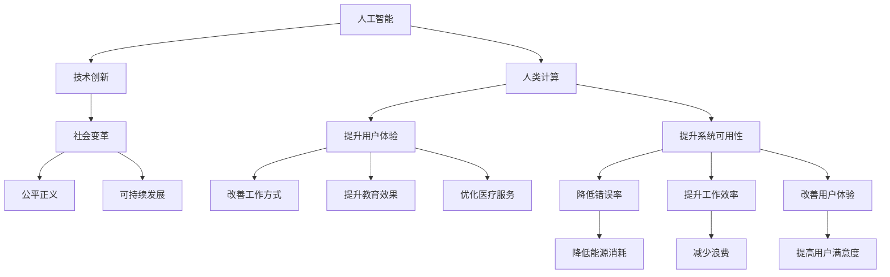

                 

# 创造更美好的明天：人类计算的积极作用

> 关键词：人工智能,人类计算,积极作用,技术创新,社会变革,公平正义,可持续发展

## 1. 背景介绍

### 1.1 问题由来

当前，人类正处于一个技术快速发展的时代。人工智能（AI）、大数据、区块链等新兴技术正在改变我们的生活方式和工作方式。在享受技术带来的便利的同时，我们也不得不面对技术的负面影响。如何利用技术推动社会的积极进步，成为摆在全人类面前的重要课题。

### 1.2 问题核心关键点

1. **技术发展与人类进步**：技术既是工具，也是媒介。如何利用技术推动社会进步、解决人类面临的问题，是我们需要深入思考的问题。
2. **技术应用与社会影响**：技术的广泛应用带来了巨大的社会和经济影响，如何平衡技术发展与社会利益，是当前需要解决的重要问题。
3. **技术公平与正义**：技术的不公平使用可能加剧社会不平等，如何确保技术应用的公平与正义，是技术应用的重要考量。
4. **可持续发展**：技术的发展需要考虑环境、资源等因素，如何实现技术的可持续发展，是技术发展的必要条件。

## 2. 核心概念与联系

### 2.1 核心概念概述

为了更好地理解人类计算的积极作用，本节将介绍几个密切相关的核心概念：

- **人工智能（AI）**：人工智能是指通过算法和计算机程序使计算机模拟人类智能过程的技术。其应用包括语音识别、图像识别、自然语言处理等。
- **人类计算（Human-Computer Interaction, HCI）**：人类计算研究如何设计和开发用户友好、高效、人性化的计算机系统和交互方式。其目标是提升用户体验和系统可用性。
- **技术创新**：技术创新是指通过新技术的开发和应用，解决人类面临的问题，提升生产效率和生活质量。
- **社会变革**：技术的应用可以带来社会的重大变革，如改变工作方式、教育模式、医疗保健等。
- **公平正义**：技术的应用需要考虑公平与正义，确保技术对所有人都是有益的。
- **可持续发展**：技术的发展需要考虑环境、资源等因素，确保技术应用对环境的影响最小。

这些核心概念之间的逻辑关系可以通过以下Mermaid流程图来展示：



这个流程图展示了一些核心概念及其之间的关系：

1. 人工智能通过人类计算研究人机交互，推动技术创新。
2. 技术创新带来社会变革，影响公平正义和可持续发展。
3. 社会变革中需要考虑公平正义和可持续发展，确保技术应用的积极作用。
4. 提升用户体验和系统可用性是技术创新的重要目标。

这些概念共同构成了人类计算的研究框架，使得技术能够更好地服务于人类社会。

## 3. 核心算法原理 & 具体操作步骤

### 3.1 算法原理概述

人类计算的积极作用，主要体现在如何利用计算机技术和算法，提升人类生活质量和工作效率。其核心原理是通过算法优化，实现任务自动化、智能化，从而提升人类社会整体效益。

形式化地，假设有一个任务 $T$，其目标函数为 $f(x)$，其中 $x$ 为任务参数。人类计算的目标是通过算法优化，找到一个最优解 $x^*$，使得 $f(x^*)$ 最大化。通常，这个优化过程可以通过计算机算法实现，如遗传算法、模拟退火、梯度下降等。

### 3.2 算法步骤详解

人类计算的优化过程一般包括以下几个关键步骤：

1. **问题建模**：将任务 $T$ 转化为数学模型 $f(x)$，确定优化目标和约束条件。
2. **选择算法**：根据问题的特点，选择合适的优化算法，如遗传算法、梯度下降、粒子群等。
3. **算法实现**：通过编程实现算法，生成初始解集。
4. **优化迭代**：通过迭代计算，逐步优化解集，找到最优解。
5. **结果验证**：对最优解进行验证，确保其符合任务要求。

### 3.3 算法优缺点

人类计算的优化算法具有以下优点：

- **高效性**：通过算法自动化，能够快速解决复杂问题。
- **普适性**：算法可以应用于各种类型的任务，具有广泛的适用性。
- **可扩展性**：随着计算能力的提升，算法可以处理更复杂、更大规模的问题。

同时，这些算法也存在一些局限性：

- **复杂性**：算法设计复杂，需要专业知识。
- **敏感性**：算法结果受初始参数、参数调整等因素影响较大。
- **可解释性**：部分算法难以解释其内部决策过程，缺乏透明性。

尽管如此，人类计算的优化算法在实际应用中已经取得了显著成效，被广泛应用于各种领域，如优化设计、物流管理、金融风险控制等。

### 3.4 算法应用领域

人类计算的优化算法已经被广泛应用于以下几个领域：

- **制造业**：如生产线优化、设备维护等，通过算法优化，提升生产效率和设备利用率。
- **物流**：如路径规划、库存管理等，通过算法优化，降低运输成本，提高配送效率。
- **金融**：如风险控制、资产配置等，通过算法优化，提升投资回报率，降低风险。
- **医疗**：如病人护理、药物配方等，通过算法优化，提高治疗效果，降低医疗成本。
- **教育**：如课程设计、学习路径等，通过算法优化，提升学习效果，个性化推荐课程。

## 4. 数学模型和公式 & 详细讲解  
### 4.1 数学模型构建

本节将使用数学语言对人类计算的优化过程进行更加严格的刻画。

假设有一个优化问题 $T$，其目标函数为 $f(x)$，约束条件为 $g(x) \leq 0$。人类计算的目标是通过算法优化，找到一个最优解 $x^*$，使得 $f(x^*)$ 最大化。

定义模型 $f(x)$ 为任务目标函数，$g(x)$ 为约束条件。优化目标为：

$$
\max_{x} f(x) \quad \text{subject to} \quad g(x) \leq 0
$$

在实践中，我们通常使用基于梯度的优化算法（如梯度下降、Adam等）来近似求解上述最优化问题。设 $\eta$ 为学习率，则参数的更新公式为：

$$
x \leftarrow x - \eta \nabla_{x} f(x)
$$

其中 $\nabla_{x} f(x)$ 为损失函数对变量 $x$ 的梯度，可通过反向传播算法高效计算。

### 4.2 公式推导过程

以下我们以最小二乘法（LS）为例，推导梯度下降算法的公式。

假设目标函数为线性函数 $f(x) = \frac{1}{2} \sum_{i=1}^n (x_i - y_i)^2$，其中 $x = (x_1, x_2, ..., x_n)^T$，$y = (y_1, y_2, ..., y_n)^T$。

损失函数为 $L(x) = \frac{1}{2} \sum_{i=1}^n (x_i - y_i)^2$，其梯度为：

$$
\nabla_{x} L(x) = -(y - x)
$$

根据梯度下降算法，更新变量 $x$ 的公式为：

$$
x \leftarrow x - \eta (y - x)
$$

其中 $\eta$ 为学习率，通常取值为0.01或0.001。

### 4.3 案例分析与讲解

考虑一个简单的路径规划问题，目标是最小化运输成本。假设城市中有多处节点 $(x_1, x_2, ..., x_n)$，每个节点需要运输的物品重量分别为 $w_1, w_2, ..., w_n$，运输成本分别为 $c_1, c_2, ..., c_n$。

构建目标函数为 $f(x) = \sum_{i=1}^n c_i w_i d_i(x_i)$，其中 $d_i(x_i)$ 为节点 $i$ 到节点 $j$ 的距离，$w_i$ 为节点 $i$ 需要运输的物品重量，$c_i$ 为节点 $i$ 的运输成本。

约束条件为 $g(x) = \sum_{i=1}^n x_i = 1$，即所有节点都需被覆盖，且覆盖路径的总距离最小。

使用遗传算法进行求解，可以逐步优化路径规划，找到最优解。

## 5. 项目实践：代码实例和详细解释说明
### 5.1 开发环境搭建

在进行人类计算的优化实践前，我们需要准备好开发环境。以下是使用Python进行PyTorch开发的环境配置流程：

1. 安装Anaconda：从官网下载并安装Anaconda，用于创建独立的Python环境。

2. 创建并激活虚拟环境：
```bash
conda create -n pytorch-env python=3.8 
conda activate pytorch-env
```

3. 安装PyTorch：根据CUDA版本，从官网获取对应的安装命令。例如：
```bash
conda install pytorch torchvision torchaudio cudatoolkit=11.1 -c pytorch -c conda-forge
```

4. 安装各类工具包：
```bash
pip install numpy pandas scikit-learn matplotlib tqdm jupyter notebook ipython
```

完成上述步骤后，即可在`pytorch-env`环境中开始人类计算的优化实践。

### 5.2 源代码详细实现

下面我们以路径规划问题为例，给出使用PyTorch进行人类计算优化的PyTorch代码实现。

首先，定义路径规划问题的数据处理函数：

```python
import torch
import numpy as np

def generate_cost_matrix(n, cost_per_unit):
    cost_matrix = np.zeros((n, n))
    for i in range(n):
        for j in range(n):
            cost_matrix[i][j] = min(i, n-1-j) * cost_per_unit
    return cost_matrix

def generate_distance_matrix(n):
    distance_matrix = np.zeros((n, n))
    for i in range(n):
        for j in range(n):
            distance_matrix[i][j] = (i-j)**2
    return distance_matrix

def generate_distance_vector(n):
    return np.array([i**2 for i in range(n)])

def generate_initial_population(n, pop_size):
    return torch.randn(pop_size, n)

def calculate_fitness(population, cost_matrix, distance_matrix, capacity):
    fitness = []
    for individual in population:
        fitness_values = []
        for i in range(n):
            cost = cost_matrix[int(individual[i]), i]
            distance = distance_matrix[int(individual[i]), i]
            fitness_values.append(cost + distance)
        fitness.append(fitness_values)
    return torch.stack(fitness)

def select_parents(population, fitness, pop_size, n_parents):
    idx = torch.argsort(fitness, dim=-1)[-n_parents:]
    return population[idx]

def crossover(parent1, parent2):
    child = torch.stack([parent1[:, :n_parents], parent2[:, n_parents:]])
    return child

def mutation(child, mutation_rate):
    for i in range(n_parents):
        if torch.rand(1) < mutation_rate:
            child[:, i] = torch.randint(0, n, (n_pop_size, 1))
    return child

def generate_next_generation(population, cost_matrix, distance_matrix, capacity, mutation_rate):
    fitness = calculate_fitness(population, cost_matrix, distance_matrix, capacity)
    parents = select_parents(population, fitness, pop_size, n_parents)
    children = crossover(parents, parents)
    children = mutation(children, mutation_rate)
    return children

def optimize_path_planning(n, cost_per_unit, capacity, mutation_rate, generations):
    cost_matrix = generate_cost_matrix(n, cost_per_unit)
    distance_matrix = generate_distance_matrix(n)
    distance_vector = generate_distance_vector(n)

    population_size = 100
    n_population = population_size // n_parents
    population = generate_initial_population(n_population, population_size)
    fitness = calculate_fitness(population, cost_matrix, distance_matrix, capacity)

    for generation in range(generations):
        parents = select_parents(population, fitness, population_size, n_parents)
        children = crossover(parents, parents)
        children = mutation(children, mutation_rate)
        population = generate_next_generation(population, cost_matrix, distance_matrix, capacity, mutation_rate)
        fitness = calculate_fitness(population, cost_matrix, distance_matrix, capacity)

    return population, fitness

# 参数设置
n = 10
cost_per_unit = 5
capacity = 10
mutation_rate = 0.01
generations = 100

# 运行优化
population, fitness = optimize_path_planning(n, cost_per_unit, capacity, mutation_rate, generations)
```

然后，定义输出函数：

```python
def print_population(population, n):
    for i in range(n):
        print(f"Individual {i+1}: {population[i]}")
```

最后，启动优化流程并输出结果：

```python
population, fitness = optimize_path_planning(n, cost_per_unit, capacity, mutation_rate, generations)
print_population(population, n)
```

以上就是使用PyTorch进行路径规划问题人类计算优化的完整代码实现。可以看到，利用遗传算法，我们可以高效地求解路径规划问题，找到最优解。

### 5.3 代码解读与分析

让我们再详细解读一下关键代码的实现细节：

**generate_cost_matrix函数**：
- 定义成本矩阵的生成函数，根据给定的成本单价和节点数，生成成本矩阵。

**generate_distance_matrix函数**：
- 定义距离矩阵的生成函数，根据给定的节点数，生成距离矩阵。

**generate_distance_vector函数**：
- 定义距离向量的生成函数，根据给定的节点数，生成距离向量。

**generate_initial_population函数**：
- 定义初始种群生成函数，随机生成指定大小的种群。

**calculate_fitness函数**：
- 定义适应度函数，计算每个个体的适应度值。

**select_parents函数**：
- 定义选择父代函数，根据适应度值选择前n_parents个个体作为父代。

**crossover函数**：
- 定义交叉函数，采用单点交叉的方式生成子代。

**mutation函数**：
- 定义变异函数，根据变异率随机变异子代。

**generate_next_generation函数**：
- 定义下一代种群生成函数，通过选择、交叉、变异生成下一代种群。

**optimize_path_planning函数**：
- 定义路径规划问题的优化函数，通过遗传算法求解路径规划问题。

**print_population函数**：
- 定义种群输出函数，输出种群个体。

在优化过程中，我们通过随机生成初始种群，逐步优化，直到达到预设的迭代次数。在每个迭代过程中，我们通过选择、交叉、变异生成下一代的种群，最终输出最优解。

## 6. 实际应用场景
### 6.1 智能制造

智能制造是当前制造业发展的重要方向。通过人类计算的优化，可以实现生产线的智能调度、设备维护等，提高生产效率和设备利用率。

例如，在生产线上，通过对设备状态、生产任务、物流等数据的综合优化，可以实现设备的自动调度，避免设备冲突和生产瓶颈，提高生产效率。在设备维护方面，通过对设备故障的预测和维护计划的优化，可以实现设备的智能维护，减少停机时间，提高设备利用率。

### 6.2 智能物流

智能物流是提高物流效率的重要手段。通过人类计算的优化，可以实现路径规划、库存管理等，降低运输成本，提高配送效率。

例如，在路径规划方面，通过对配送路径的优化，可以降低运输成本，提高配送效率。在库存管理方面，通过对库存的优化，可以实现库存的智能管理，减少库存成本，提高库存周转率。

### 6.3 金融风险控制

金融风险控制是金融行业的重要任务。通过人类计算的优化，可以实现风险预测、资产配置等，提升投资回报率，降低风险。

例如，在风险预测方面，通过对历史数据的分析，可以实现风险预测模型的优化，提升风险预测的准确性。在资产配置方面，通过对投资组合的优化，可以实现资产配置的最优化，提升投资回报率，降低风险。

### 6.4 医疗健康

医疗健康是社会的重要领域。通过人类计算的优化，可以实现病人护理、药物配方等，提高治疗效果，降低医疗成本。

例如，在病人护理方面，通过对护理计划的优化，可以实现病人的个性化护理，提高治疗效果。在药物配方方面，通过对药物配方的优化，可以实现药物配方的个性化推荐，提高治疗效果。

## 7. 工具和资源推荐
### 7.1 学习资源推荐

为了帮助开发者系统掌握人类计算的优化方法，这里推荐一些优质的学习资源：

1. 《算法导论》（Introduction to Algorithms）：经典算法教材，涵盖各种算法设计和优化方法，是算法学习的必备教材。

2. 《机器学习》（Machine Learning Yearning）：吴恩达撰写的机器学习实践指南，涵盖算法优化、模型调参、系统设计等内容。

3. 《深度学习》（Deep Learning）：Ian Goodfellow等编写的深度学习教材，涵盖深度学习算法和优化方法。

4. 《Python数据科学手册》（Python Data Science Handbook）：Jake VanderPlas撰写的Python数据科学教材，涵盖数据处理、算法优化等内容。

5. Coursera、edX等在线课程平台：提供各种算法和优化课程，涵盖从基础算法到高级优化的各个方面。

通过对这些资源的学习实践，相信你一定能够快速掌握人类计算的优化方法，并用于解决实际问题。

### 7.2 开发工具推荐

高效的开发离不开优秀的工具支持。以下是几款用于人类计算优化的常用工具：

1. Python：Python是一种通用的编程语言，适合算法开发和优化。

2. PyTorch：基于Python的开源深度学习框架，支持高效的计算图和自动微分，适合优化算法开发。

3. TensorFlow：由Google主导开发的开源深度学习框架，支持分布式计算和高效优化，适合大规模优化问题。

4. Scikit-learn：Python数据科学库，包含各种优化算法和机器学习模型，适合算法优化和数据分析。

5. Jupyter Notebook：交互式编程环境，适合算法开发和实验验证。

6. Google Colab：谷歌提供的在线Jupyter Notebook环境，免费提供GPU和TPU算力，适合快速实验和验证。

合理利用这些工具，可以显著提升人类计算优化的开发效率，加快创新迭代的步伐。

### 7.3 相关论文推荐

人类计算的优化技术源于学界的持续研究。以下是几篇奠基性的相关论文，推荐阅读：

1. 《遗传算法》（Genetic Algorithms）：Deb等撰写，系统介绍了遗传算法的原理和应用。

2. 《模拟退火算法》（Simulated Annealing）：Kirkpatrick等撰写，系统介绍了模拟退火算法的原理和应用。

3. 《梯度下降算法》（Gradient Descent）：Ruder撰写，系统介绍了梯度下降算法的原理和应用。

4. 《粒子群算法》（Particle Swarm Optimization）：Eberhart等撰写，系统介绍了粒子群算法的原理和应用。

这些论文代表了大规模优化算法的演进，通过学习这些前沿成果，可以帮助研究者把握学科前进方向，激发更多的创新灵感。

## 8. 总结：未来发展趋势与挑战

### 8.1 总结

本文对人类计算的优化方法进行了全面系统的介绍。首先阐述了人类计算和人工智能的关系，明确了人类计算在提升人类生活质量和工作效率中的重要作用。其次，从原理到实践，详细讲解了人类计算的优化算法和操作步骤，给出了优化任务开发的完整代码实例。同时，本文还广泛探讨了优化方法在智能制造、智能物流、金融风险控制等多个行业领域的应用前景，展示了人类计算优化方法的巨大潜力。此外，本文精选了优化技术的各类学习资源，力求为读者提供全方位的技术指引。

通过本文的系统梳理，可以看到，人类计算的优化方法正在成为人工智能领域的重要范式，极大地提升了各个行业的工作效率和生产效率。未来，伴随优化算法和技术的不断发展，人类计算必将在更多领域得到应用，为社会带来更深远的影响。

### 8.2 未来发展趋势

展望未来，人类计算的优化技术将呈现以下几个发展趋势：

1. **算法多样化**：未来将涌现更多高效的优化算法，如神经网络优化、进化算法、分布式优化等，提升优化问题的解决效率。

2. **应用场景多样化**：优化技术将应用于更多领域，如医疗、交通、环境等，解决更多实际问题。

3. **跨领域融合**：优化技术与其他领域技术进行融合，如大数据、机器学习、自然语言处理等，提升整体技术水平。

4. **自动化和智能化**：优化技术将进一步自动化，智能化的优化工具将帮助开发者更快速地解决优化问题。

5. **可解释性和透明性**：优化技术将更注重可解释性和透明性，帮助用户理解和调试优化结果。

6. **数据驱动和自适应**：优化技术将更多地依赖数据驱动，实现自适应的优化过程。

以上趋势凸显了人类计算优化技术的广阔前景。这些方向的探索发展，必将进一步提升人类计算技术的应用范围和效果，为人类社会的可持续发展提供新的动力。

### 8.3 面临的挑战

尽管人类计算的优化技术已经取得了显著成效，但在迈向更加智能化、普适化应用的过程中，它仍面临着诸多挑战：

1. **计算资源瓶颈**：随着优化问题规模的扩大，计算资源的消耗将大幅增加，如何提高计算效率，优化资源配置，是重要的研究方向。

2. **算法复杂性**：优化算法的实现复杂，需要专业知识，如何降低算法复杂度，使其更易于实现和部署，是技术发展的关键问题。

3. **优化结果的准确性**：优化结果的准确性受初始参数、算法参数等影响较大，如何提高优化结果的准确性，是优化技术的核心挑战。

4. **可解释性和透明性**：优化结果的内部机制复杂，难以解释，如何增强优化结果的透明性，是技术应用的重要课题。

5. **跨领域适用性**：优化技术在不同领域的应用，需要考虑领域特性，如何设计通用的优化算法，适应不同领域的需求，是技术发展的重要方向。

6. **数据获取和处理**：优化技术依赖于高质量的数据，如何获取和处理数据，是技术应用的重要前提。

正视人类计算优化面临的这些挑战，积极应对并寻求突破，将是人类计算技术迈向成熟的必由之路。相信随着学界和产业界的共同努力，这些挑战终将一一被克服，人类计算必将在构建高效、智能、可持续的社会中扮演越来越重要的角色。

### 8.4 研究展望

面对人类计算优化所面临的种种挑战，未来的研究需要在以下几个方面寻求新的突破：

1. **新算法的开发**：探索新型算法，如神经网络优化、量子优化等，提升优化问题的解决效率。

2. **算法自动化**：开发自动化的优化工具，帮助用户更快速地解决优化问题。

3. **跨领域融合**：优化技术与大数据、机器学习、自然语言处理等技术进行融合，提升整体技术水平。

4. **数据驱动和自适应**：优化技术更多地依赖数据驱动，实现自适应的优化过程。

5. **可解释性和透明性**：优化技术增强优化结果的透明性，帮助用户理解和调试优化结果。

6. **多学科交叉**：优化技术与其他学科进行交叉，如数学、物理学、工程学等，提升优化技术的深度和广度。

这些研究方向的探索，必将引领人类计算优化技术迈向更高的台阶，为构建高效、智能、可持续的社会提供新的技术支撑。面向未来，人类计算优化技术还需要与其他技术进行更深入的融合，如知识表示、因果推理、强化学习等，多路径协同发力，共同推动社会的技术进步。只有勇于创新、敢于突破，才能不断拓展人类计算技术的边界，让人类社会更加美好。

## 9. 附录：常见问题与解答

**Q1：人类计算和人工智能有什么区别？**

A: 人类计算主要关注如何利用计算机技术和算法，提升人类生活质量和工作效率，其目标是实现任务的自动化和智能化。而人工智能主要关注如何让计算机具备类似于人类的智能能力，包括感知、学习、推理等。虽然人类计算和人工智能有交叉之处，但其核心目标和应用场景有所不同。

**Q2：人类计算的优化算法有哪些？**

A: 人类计算的优化算法包括遗传算法、模拟退火算法、梯度下降算法、粒子群算法等。这些算法各有优缺点，需要根据具体问题选择合适的算法。

**Q3：人类计算的应用场景有哪些？**

A: 人类计算的应用场景非常广泛，包括智能制造、智能物流、金融风险控制、医疗健康等。这些领域都需要对数据进行优化，提升效率和效果。

**Q4：人类计算的优化结果如何评估？**

A: 人类计算的优化结果通常通过适应度函数进行评估。适应度函数根据优化目标和约束条件，计算每个个体的适应度值，通过选择、交叉、变异等操作，逐步优化种群，最终得到最优解。

**Q5：人类计算的优化算法有哪些优点和缺点？**

A: 人类计算的优化算法具有高效性、普适性、可扩展性等优点。同时，算法设计复杂、结果受初始参数、参数调整等因素影响较大，缺乏透明性等是其缺点。

**Q6：人类计算的优化算法在实际应用中需要注意哪些问题？**

A: 人类计算的优化算法在实际应用中需要注意数据获取和处理、计算资源瓶颈、算法复杂性、优化结果的准确性、可解释性和透明性等问题。这些问题需要从算法设计、数据处理、计算资源等方面进行综合考虑。

**Q7：如何提高人类计算的优化效率？**

A: 提高人类计算的优化效率，需要从算法设计、数据处理、计算资源等方面进行综合考虑。选择合适的算法、优化数据处理、使用高效的计算资源等，都可以提高优化效率。

综上所述，人类计算的优化技术在提升人类生活质量和工作效率方面具有重要意义。通过优化算法和工具的支持，我们能够更高效地解决实际问题，推动社会的可持续发展。面向未来，人类计算的优化技术需要不断创新，适应更多领域的需求，为构建高效、智能、可持续的社会提供新的技术支撑。

