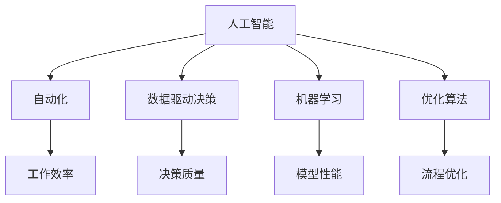

                 

# 利用AI工具提升工作效率与收入

> 关键词：人工智能, 自动化, 数据驱动决策, 机器学习, 优化算法, 收入增长

## 1. 背景介绍

### 1.1 问题由来
在当前信息爆炸的时代，企业面临的挑战越来越多样化、复杂化。无论是客户服务、市场营销还是内部管理，都需要处理大量的数据、实现高效的流程和创造更多的价值。面对这些挑战，传统的手工方式显得力不从心，效率低下且容易出错。因此，利用人工智能(AI)工具提升工作效率与收入，成为越来越多企业的选择。

### 1.2 问题核心关键点
AI工具在提升工作效率和收入方面，主要体现在以下几个方面：
1. 自动化处理：通过AI自动化处理繁琐的任务，如数据分析、客户服务、市场分析等，大幅度提高工作效率。
2. 数据驱动决策：AI分析海量数据，挖掘出有价值的信息和模式，辅助企业做出更准确的决策。
3. 优化业务流程：AI能够识别业务流程中的瓶颈，提供优化建议，从而提升整体业务效率。
4. 收入增长：AI通过客户行为分析、市场预测等，帮助企业精准定位市场机会，提升销售和营销效果。

AI工具的应用，使得企业能够更加灵活地应对市场变化，增强竞争力和盈利能力。但同时，选择合适的AI工具、数据管理和模型部署，也需要企业具备相应的技术和资源。

## 2. 核心概念与联系

### 2.1 核心概念概述

为更好地理解如何利用AI工具提升工作效率与收入，本节将介绍几个密切相关的核心概念：

- 人工智能(AI)：利用算法和数据，使计算机系统能够模拟人类智能行为的技术。
- 自动化(Automation)：通过软件和机器系统，自动执行重复性高、规则明确的任务，提高效率。
- 数据驱动决策(Data-Driven Decision Making)：利用数据分析工具，提取有价值的信息和洞察，指导决策过程。
- 机器学习(Machine Learning)：通过数据训练模型，使机器能够从经验中学习，优化性能。
- 优化算法(Optimization Algorithm)：用于寻找最优解的数学或计算方法，广泛应用于资源分配、流程优化等。

这些核心概念之间的逻辑关系可以通过以下Mermaid流程图来展示：



这个流程图展示了几大核心概念及其之间的关系：

1. 人工智能通过自动化、数据驱动决策和机器学习等技术，实现对任务的自动处理和数据分析，提升工作效率和决策质量。
2. 自动化是AI技术的具体应用，通过机器执行重复性任务，释放人力资源。
3. 数据驱动决策使得AI系统能够从海量数据中提取洞察，为决策提供依据。
4. 机器学习使AI系统能够不断从经验中学习，优化模型性能。
5. 优化算法帮助AI系统在各种复杂环境中寻找最优解，实现资源的高效分配和业务流程的优化。

这些核心概念共同构成了AI工具提升工作效率与收入的基础框架，使其能够在实际应用中发挥强大的作用。通过理解这些核心概念，我们可以更好地把握AI工具的工作原理和优化方向。

## 3. 核心算法原理 & 具体操作步骤

### 3.1 算法原理概述

利用AI工具提升工作效率与收入，主要依赖于以下几个核心算法：

- 自动化流程优化：通过流程分析和优化算法，找到效率瓶颈并提出改进方案。
- 数据驱动的模型训练：利用机器学习算法，训练模型分析用户行为，识别销售机会。
- 预测与决策优化：应用预测算法，优化决策流程，提高决策质量。

这些算法通过数据的驱动，使得AI系统能够自主地学习、优化和执行任务，从而大幅提高工作效率和决策准确性。

### 3.2 算法步骤详解

利用AI工具提升工作效率与收入的流程一般包括以下几个关键步骤：

**Step 1: 数据收集与预处理**
- 收集相关业务数据，如客户行为数据、销售记录、市场调研数据等。
- 对数据进行清洗、归一化、特征提取等预处理操作，确保数据质量。

**Step 2: 模型选择与训练**
- 根据业务需求，选择合适的AI模型，如决策树、神经网络、支持向量机等。
- 利用预处理后的数据，训练模型以学习业务模式和规律。

**Step 3: 模型评估与优化**
- 使用交叉验证等方法评估模型性能，如准确率、召回率、F1分数等。
- 根据评估结果，调整模型参数、选择更适合的算法或进行数据增强，以优化模型表现。

**Step 4: 模型部署与监控**
- 将训练好的模型部署到实际业务系统中，实现自动化决策和数据处理。
- 实时监控模型性能，根据业务反馈调整模型和算法。

**Step 5: 效果评估与迭代**
- 定期评估AI工具带来的业务效果，如效率提升、收入增长等指标。
- 根据效果评估结果，不断迭代AI模型和算法，进一步优化业务流程。

以上是利用AI工具提升工作效率与收入的一般流程。在实际应用中，还需要根据具体业务场景，对各环节进行细化和优化。

### 3.3 算法优缺点

利用AI工具提升工作效率与收入，具有以下优点：
1. 自动化：自动化处理重复性高、规则明确的任务，显著提高工作效率。
2. 数据驱动：通过数据分析，辅助决策，提升决策质量。
3. 模型优化：利用机器学习算法，不断优化模型性能，提高预测准确性。
4. 成本节约：减少人力成本和错误率，降低运营成本。
5. 客户满意度：提升客户服务质量，提高客户满意度。

同时，该方法也存在一定的局限性：
1. 数据质量要求高：AI系统依赖于高质量的数据，数据噪声和错误会影响模型效果。
2. 初始投入高：模型训练和部署需要大量的技术和资源投入。
3. 模型可解释性不足：AI模型通常被认为是"黑盒"，难以解释其内部工作机制。
4. 模型迁移能力有限：现有模型在不同场景下的泛化能力有限，需要针对特定业务场景进行调整。
5. 技术门槛高：企业需要具备一定的AI技术基础和实施能力。

尽管存在这些局限性，但就目前而言，利用AI工具提升工作效率与收入仍是一种高效且富有前景的方法。未来相关研究的重点在于如何进一步降低技术门槛，提高模型的迁移能力，同时兼顾可解释性和伦理性等因素。

### 3.4 算法应用领域

利用AI工具提升工作效率与收入，已经广泛应用于以下领域：

- 客户服务：自动化客服系统、智能推荐、情感分析等，提升客户体验和满意度。
- 市场营销：客户细分、精准投放、广告效果分析等，提升广告投放效果和ROI。
- 供应链管理：需求预测、库存优化、物流管理等，提升供应链效率和响应速度。
- 金融服务：风险评估、反欺诈、投资策略等，提升风险控制和投资收益。
- 医疗健康：疾病预测、个性化治疗、病历分析等，提升医疗服务质量和效率。
- 制造业：质量控制、设备维护、库存管理等，提升生产效率和产品质量。

除了上述这些领域，AI工具还在更多场景中发挥作用，如智能家居、智能城市、教育培训等，为各行各业带来智能化转型。随着AI技术的不断成熟和普及，相信AI工具将在更广泛的领域大放异彩，助力企业提升竞争力。

## 4. 数学模型和公式 & 详细讲解  
### 4.1 数学模型构建

本节将使用数学语言对利用AI工具提升工作效率与收入的流程进行更加严格的刻画。

假设企业收集了客户行为数据 $D=\{(x_i,y_i)\}_{i=1}^N$，其中 $x_i$ 为特征向量，$y_i$ 为二分类标签，分别表示客户是否会购买。目标是通过AI模型 $M_{\theta}$，预测新客户是否会购买，以优化营销策略。

定义模型 $M_{\theta}$ 在输入 $x$ 上的预测概率为 $\hat{y}=M_{\theta}(x)$。模型训练的目标是最小化经验风险：

$$
\mathcal{L}(\theta) = -\frac{1}{N} \sum_{i=1}^N y_i\log M_{\theta}(x_i) + (1-y_i)\log (1-M_{\theta}(x_i))
$$

其中 $\log$ 为自然对数函数。在实际应用中，一般使用交叉熵损失函数进行训练。

### 4.2 公式推导过程

以二分类任务为例，推导交叉熵损失函数及其梯度的计算公式。

假设模型 $M_{\theta}$ 在输入 $x$ 上的输出为 $\hat{y}=M_{\theta}(x) \in [0,1]$，表示样本属于正类的概率。真实标签 $y \in \{0,1\}$。则二分类交叉熵损失函数定义为：

$$
\ell(M_{\theta}(x),y) = -[y\log \hat{y} + (1-y)\log (1-\hat{y})]
$$

将其代入经验风险公式，得：

$$
\mathcal{L}(\theta) = -\frac{1}{N}\sum_{i=1}^N [y_i\log M_{\theta}(x_i)+(1-y_i)\log(1-M_{\theta}(x_i))]
$$

根据链式法则，损失函数对参数 $\theta_k$ 的梯度为：

$$
\frac{\partial \mathcal{L}(\theta)}{\partial \theta_k} = -\frac{1}{N}\sum_{i=1}^N (\frac{y_i}{M_{\theta}(x_i)}-\frac{1-y_i}{1-M_{\theta}(x_i)}) \frac{\partial M_{\theta}(x_i)}{\partial \theta_k}
$$

其中 $\frac{\partial M_{\theta}(x_i)}{\partial \theta_k}$ 可进一步递归展开，利用自动微分技术完成计算。

在得到损失函数的梯度后，即可带入参数更新公式，完成模型的迭代优化。重复上述过程直至收敛，最终得到适应营销策略的最优模型参数 $\theta^*$。

## 5. 项目实践：代码实例和详细解释说明
### 5.1 开发环境搭建

在进行AI工具提升工作效率与收入的实践前，我们需要准备好开发环境。以下是使用Python进行PyTorch开发的环境配置流程：

1. 安装Anaconda：从官网下载并安装Anaconda，用于创建独立的Python环境。

2. 创建并激活虚拟环境：
```bash
conda create -n pytorch-env python=3.8 
conda activate pytorch-env
```

3. 安装PyTorch：根据CUDA版本，从官网获取对应的安装命令。例如：
```bash
conda install pytorch torchvision torchaudio cudatoolkit=11.1 -c pytorch -c conda-forge
```

4. 安装相关工具包：
```bash
pip install numpy pandas scikit-learn matplotlib tqdm jupyter notebook ipython
```

完成上述步骤后，即可在`pytorch-env`环境中开始开发实践。

### 5.2 源代码详细实现

这里我们以客户行为分析为例，给出使用PyTorch进行AI工具开发和应用的完整代码实现。

首先，定义数据处理函数：

```python
from torch.utils.data import Dataset
import torch

class CustomerBehaviorDataset(Dataset):
    def __init__(self, features, labels, tokenizer):
        self.features = features
        self.labels = labels
        self.tokenizer = tokenizer
        
    def __len__(self):
        return len(self.features)
    
    def __getitem__(self, item):
        feature = self.features[item]
        label = self.labels[item]
        
        # 将特征转换为token ids
        encoding = self.tokenizer(feature, return_tensors='pt', max_length=128, padding='max_length', truncation=True)
        input_ids = encoding['input_ids'][0]
        attention_mask = encoding['attention_mask'][0]
        
        return {'input_ids': input_ids, 
                'attention_mask': attention_mask,
                'labels': torch.tensor(label)}
```

然后，定义模型和优化器：

```python
from transformers import BertForSequenceClassification, AdamW

model = BertForSequenceClassification.from_pretrained('bert-base-cased', num_labels=2)

optimizer = AdamW(model.parameters(), lr=2e-5)
```

接着，定义训练和评估函数：

```python
from torch.utils.data import DataLoader
from tqdm import tqdm
from sklearn.metrics import accuracy_score

device = torch.device('cuda') if torch.cuda.is_available() else torch.device('cpu')
model.to(device)

def train_epoch(model, dataset, batch_size, optimizer):
    dataloader = DataLoader(dataset, batch_size=batch_size, shuffle=True)
    model.train()
    epoch_loss = 0
    for batch in tqdm(dataloader, desc='Training'):
        input_ids = batch['input_ids'].to(device)
        attention_mask = batch['attention_mask'].to(device)
        labels = batch['labels'].to(device)
        model.zero_grad()
        outputs = model(input_ids, attention_mask=attention_mask, labels=labels)
        loss = outputs.loss
        epoch_loss += loss.item()
        loss.backward()
        optimizer.step()
    return epoch_loss / len(dataloader)

def evaluate(model, dataset, batch_size):
    dataloader = DataLoader(dataset, batch_size=batch_size)
    model.eval()
    preds, labels = [], []
    with torch.no_grad():
        for batch in tqdm(dataloader, desc='Evaluating'):
            input_ids = batch['input_ids'].to(device)
            attention_mask = batch['attention_mask'].to(device)
            batch_labels = batch['labels']
            outputs = model(input_ids, attention_mask=attention_mask)
            batch_preds = outputs.logits.argmax(dim=1).to('cpu').tolist()
            batch_labels = batch_labels.to('cpu').tolist()
            for pred, label in zip(batch_preds, batch_labels):
                preds.append(pred)
                labels.append(label)
                
    return accuracy_score(labels, preds)

# 训练和评估
epochs = 5
batch_size = 16

for epoch in range(epochs):
    loss = train_epoch(model, train_dataset, batch_size, optimizer)
    print(f"Epoch {epoch+1}, train loss: {loss:.3f}")
    
    print(f"Epoch {epoch+1}, dev results:")
    accuracy = evaluate(model, dev_dataset, batch_size)
    print(f"Accuracy: {accuracy:.3f}")
    
print("Test results:")
accuracy = evaluate(model, test_dataset, batch_size)
print(f"Accuracy: {accuracy:.3f}")
```

以上就是使用PyTorch进行客户行为分析的AI工具开发的完整代码实现。可以看到，使用预训练模型和优化器，代码实现相对简洁高效。

### 5.3 代码解读与分析

让我们再详细解读一下关键代码的实现细节：

**CustomerBehaviorDataset类**：
- `__init__`方法：初始化特征和标签，分词器等关键组件。
- `__len__`方法：返回数据集的样本数量。
- `__getitem__`方法：对单个样本进行处理，将特征输入转换为token ids，并返回模型所需的输入。

**模型和优化器定义**：
- 使用预训练的BERT模型作为初始化参数，设置输出层的标签数为2（客户是否会购买）。
- 选择AdamW优化器，学习率为2e-5。

**训练和评估函数**：
- 使用PyTorch的DataLoader对数据集进行批次化加载，供模型训练和推理使用。
- 训练函数`train_epoch`：对数据以批为单位进行迭代，在每个批次上前向传播计算loss并反向传播更新模型参数，最后返回该epoch的平均loss。
- 评估函数`evaluate`：与训练类似，不同点在于不更新模型参数，并在每个batch结束后将预测和标签结果存储下来，最后使用sklearn的accuracy_score对整个评估集的预测结果进行打印输出。

**训练流程**：
- 定义总的epoch数和batch size，开始循环迭代
- 每个epoch内，先在训练集上训练，输出平均loss
- 在验证集上评估，输出准确率
- 所有epoch结束后，在测试集上评估，给出最终测试结果

可以看到，PyTorch配合Transformer库使得AI工具开发的代码实现变得简洁高效。开发者可以将更多精力放在数据处理、模型改进等高层逻辑上，而不必过多关注底层的实现细节。

当然，工业级的系统实现还需考虑更多因素，如模型的保存和部署、超参数的自动搜索、更灵活的任务适配层等。但核心的AI工具提升工作效率与收入的范式基本与此类似。

## 6. 实际应用场景
### 6.1 智能客服系统

利用AI工具提升工作效率，智能客服系统是一个典型应用。传统的客服系统依赖人力，响应速度慢，高峰期效率低下。而智能客服系统通过自然语言处理(NLP)和机器学习算法，实现自动化处理客户咨询，显著提升服务效率。

在技术实现上，可以收集企业内部的历史客服对话记录，将问题和最佳答复构建成监督数据，在此基础上对预训练模型进行微调。微调后的模型能够自动理解用户意图，匹配最合适的答案模板进行回复。对于客户提出的新问题，还可以接入检索系统实时搜索相关内容，动态组织生成回答。如此构建的智能客服系统，能大幅提升客户咨询体验和问题解决效率。

### 6.2 金融风险控制

金融行业面临的风险复杂多变，传统的手工风险控制方式效率低、成本高。利用AI工具，可以在海量交易数据中快速识别异常交易，提前预警风险，避免损失。

在实际应用中，可以收集银行的交易数据，使用机器学习模型训练出交易异常检测系统。模型通过分析交易模式、频率等特征，预测交易是否异常。一旦发现异常交易，系统便会自动报警，并采取相应的风险控制措施。通过AI工具提升金融风险控制能力，能够有效提升银行的运营效率和客户满意度。

### 6.3 供应链优化

供应链管理涉及多个环节，流程复杂，容易出错。利用AI工具，可以优化供应链管理，提升效率和响应速度。

在技术实现上，可以收集供应链各环节的数据，如库存量、订单量、物流信息等。使用机器学习算法训练供应链优化模型，实时预测需求，优化库存和物流安排。通过AI工具提升供应链管理能力，能够显著降低运营成本，提升供应链响应速度。

### 6.4 未来应用展望

随着AI技术的不断进步，基于AI工具提升工作效率与收入的应用场景将不断扩展。

在医疗健康领域，智能诊断系统通过分析患者数据，快速识别疾病风险，提升诊疗效率。在教育培训领域，个性化学习系统通过分析学生行为，推荐适合的课程和学习资源，提升学习效果。

未来，AI工具还将广泛应用于智能家居、智能城市、智慧农业等更多领域，为各行各业带来智能化转型。随着AI技术的成熟和普及，相信AI工具将在更广泛的领域大放异彩，助力企业提升竞争力。

## 7. 工具和资源推荐
### 7.1 学习资源推荐

为了帮助开发者系统掌握AI工具提升工作效率与收入的理论基础和实践技巧，这里推荐一些优质的学习资源：

1. Coursera《AI for Everyone》课程：由吴恩达教授主讲，全面介绍AI基础概念和应用案例，适合初学者入门。

2. Udacity《Machine Learning Engineer Nanodegree》课程：深入学习机器学习算法和模型训练，涵盖数据预处理、特征工程、模型评估等。

3. Kaggle数据科学竞赛平台：提供丰富的数据集和模型竞赛，实践AI技术并提升模型效果。

4. arXiv论文库：读取最新前沿研究论文，了解AI领域的最新进展。

5. Google AI博客：Google AI团队分享最新技术进展和项目案例，开阔视野。

通过对这些资源的学习实践，相信你一定能够快速掌握AI工具提升工作效率与收入的精髓，并用于解决实际的业务问题。
###  7.2 开发工具推荐

高效的开发离不开优秀的工具支持。以下是几款用于AI工具开发的常用工具：

1. Jupyter Notebook：交互式编程环境，支持Python、R等多种语言，适合开发和研究。

2. Google Colab：谷歌提供的免费Jupyter Notebook环境，集成GPU/TPU算力，方便快速实验。

3. PyTorch Lightning：基于PyTorch的模型管理框架，简化模型训练和评估流程，加速迭代。

4. TensorBoard：TensorFlow配套的可视化工具，实时监测模型训练状态，提供丰富的图表呈现方式。

5. HuggingFace Transformers库：提供预训练模型和微调样例，便于快速搭建AI模型。

6. TensorFlow Extended(TFE)：用于模型训练、部署、评估的开放平台，支持多种深度学习框架。

合理利用这些工具，可以显著提升AI工具开发的效率和质量，加快技术创新的步伐。

### 7.3 相关论文推荐

AI工具提升工作效率与收入的研究源于学界的持续研究。以下是几篇奠基性的相关论文，推荐阅读：

1. "Deep Learning" by Ian Goodfellow, Yoshua Bengio, and Aaron Courville：经典深度学习教材，深入讲解各种深度学习算法和模型。

2. "Human-Computer Interaction: A Problem-Centered Approach" by William Buxton：介绍人机交互理论，理解用户需求和行为，设计更好的AI工具。

3. "Artificial Intelligence: A Modern Approach" by Stuart Russell and Peter Norvig：全面介绍AI技术和应用，覆盖各种算法和模型。

4. "Learning to Predict with Feature Selection" by T. Joachims：介绍特征选择方法，提升模型性能和泛化能力。

5. "Optimization Algorithms" by Nocedal and Wright：经典优化算法书籍，介绍各种优化算法及其应用。

这些论文代表了大数据驱动的AI工具提升工作效率与收入的发展脉络。通过学习这些前沿成果，可以帮助研究者把握学科前进方向，激发更多的创新灵感。

## 8. 总结：未来发展趋势与挑战

### 8.1 总结

本文对利用AI工具提升工作效率与收入进行了全面系统的介绍。首先阐述了AI工具提升工作效率与收入的研究背景和意义，明确了AI工具在提升业务效率、优化决策、提升收入等方面的独特价值。其次，从原理到实践，详细讲解了AI工具的算法原理和具体操作步骤，给出了AI工具开发和应用的完整代码实例。同时，本文还广泛探讨了AI工具在智能客服、金融风险控制、供应链优化等多个领域的应用前景，展示了AI工具的广泛潜力。此外，本文精选了AI工具相关的学习资源，力求为读者提供全方位的技术指引。

通过本文的系统梳理，可以看到，AI工具在提升工作效率与收入方面已经取得了显著成效，得到了众多企业的认可。未来，随着AI技术的不断发展，AI工具将在更多领域发挥更大作用，带来更大的经济效益和社会价值。

### 8.2 未来发展趋势

展望未来，AI工具提升工作效率与收入将呈现以下几个发展趋势：

1. 技术普及：AI工具的应用将更加普及，逐步渗透到各行各业，带来全面数字化转型。

2. 算法优化：通过深度学习、强化学习等前沿算法，提升AI工具的性能和效率，实现更加精细的业务优化。

3. 数据驱动：利用大数据、云计算等技术，构建实时数据驱动的AI系统，实现动态优化和决策。

4. 集成化应用：将AI工具与其他技术进行深度集成，如IoT、AR/VR等，构建更加智能化的应用场景。

5. 跨领域应用：AI工具将突破单一领域的限制，跨领域应用，实现多场景融合和协同优化。

6. 智能交互：利用自然语言处理和计算机视觉技术，提升人机交互体验，构建更加智能化的交互系统。

以上趋势凸显了AI工具提升工作效率与收入的广阔前景。这些方向的探索发展，必将进一步提升AI工具在各行各业的应用价值，为社会带来深远的变革。

### 8.3 面临的挑战

尽管AI工具提升工作效率与收入已经取得了显著成效，但在迈向更加智能化、普适化应用的过程中，仍面临诸多挑战：

1. 技术门槛高：AI工具的应用需要企业具备一定的技术基础和实施能力，技术门槛较高。

2. 数据安全：AI工具依赖大量数据，数据安全和隐私保护问题不容忽视。

3. 算法透明性：AI工具通常被认为是"黑盒"，难以解释其内部工作机制，影响算法透明性和可信度。

4. 模型可扩展性：现有的AI工具在多场景下的泛化能力有限，需要针对特定业务场景进行调整。

5. 算力成本：大规模AI工具的训练和部署需要大量的算力资源，成本较高。

尽管存在这些挑战，但通过持续的技术创新和优化，相信AI工具提升工作效率与收入将克服这些难题，进一步提升工作效率和决策质量。

### 8.4 研究展望

面向未来，AI工具提升工作效率与收入的研究需要在以下几个方面寻求新的突破：

1. 降低技术门槛：通过简化算法、优化工具接口等方式，降低企业实施AI工具的技术门槛。

2. 提升模型可解释性：引入可解释性技术，如可视化、自然语言解释等，提升AI工具的透明性和可信度。

3. 增强模型泛化能力：通过跨领域迁移学习、元学习等技术，提升AI工具在多场景下的泛化能力。

4. 优化算法效率：开发更高效、更轻量级的算法，降低算力成本，提高AI工具的部署和运营效率。

5. 构建智能生态：通过开放平台、标准化接口等方式，构建AI工具的智能生态系统，促进技术的广泛应用。

这些研究方向的探索，必将引领AI工具提升工作效率与收入技术迈向更高的台阶，为构建智能、高效、安全的业务系统铺平道路。面向未来，AI工具提升工作效率与收入的研究需要跨学科、跨领域的协同合作，共同推动技术的持续进步和应用。

## 9. 附录：常见问题与解答

**Q1：AI工具提升工作效率与收入的效率如何？**

A: AI工具提升工作效率与收入的效率主要体现在以下几个方面：
1. 自动化处理：自动化处理重复性高、规则明确的任务，显著提高工作效率。
2. 数据驱动决策：利用数据分析，辅助决策，提升决策质量。
3. 模型优化：通过机器学习算法，不断优化模型性能，提高预测准确性。

具体效率提升幅度取决于具体任务和数据特点，但总体而言，AI工具能够大幅度提升工作效率和决策质量，降低人力成本和错误率，带来显著的效益提升。

**Q2：如何选择适合的AI工具？**

A: 选择适合的AI工具需要考虑以下几个因素：
1. 业务需求：根据业务需求选择对应的AI工具，如自然语言处理、图像识别、预测分析等。
2. 数据质量：选择对数据质量要求较高的工具，确保模型训练效果。
3. 技术基础：评估企业现有的技术基础和实施能力，选择易于上手和部署的工具。
4. 成本预算：考虑AI工具的初始投入和运行成本，选择性价比高的工具。
5. 供应商支持：选择有良好技术支持和社区资源的工具，确保后期维护和升级。

通过综合考虑以上因素，可以选取最适合自己的AI工具，实现业务优化和效率提升。

**Q3：AI工具提升工作效率与收入的实施步骤是什么？**

A: 利用AI工具提升工作效率与收入的实施步骤一般包括以下几个关键步骤：
1. 数据收集与预处理：收集相关业务数据，并进行数据清洗和特征提取。
2. 模型选择与训练：选择合适的AI模型，利用预处理后的数据进行模型训练。
3. 模型评估与优化：使用评估指标评估模型性能，根据结果调整模型和算法。
4. 模型部署与监控：将训练好的模型部署到实际业务系统中，实时监控模型性能。
5. 效果评估与迭代：定期评估AI工具带来的业务效果，根据效果进行模型优化和业务改进。

以上是利用AI工具提升工作效率与收入的一般流程。在实际应用中，还需要根据具体业务场景，对各环节进行细化和优化。

---

作者：禅与计算机程序设计艺术 / Zen and the Art of Computer Programming

