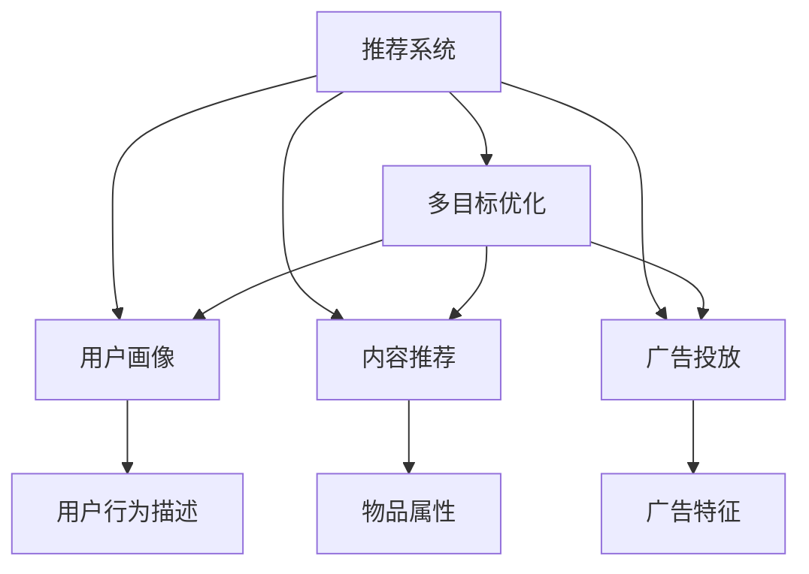

                 

# 利用LLM优化推荐系统的多目标优化

> 关键词：推荐系统,多目标优化,大语言模型(LLM),自适应推荐,用户画像,内容推荐,广告投放

## 1. 背景介绍

### 1.1 问题由来
推荐系统（Recommender Systems）作为人工智能领域的一个重要分支，近年来在电子商务、社交网络、视频平台等众多线上线下场景中得到了广泛应用。基于协同过滤、内容推荐等经典模型的推荐系统，在个性化推荐、广告投放、内容分发等方面取得了显著成效。然而，随着数据量爆炸式增长和应用场景不断扩展，传统的推荐系统逐渐暴露出一些局限性，主要体现在以下几个方面：

1. **数据稀疏性问题**：传统协同过滤等模型面临用户和物品数量庞大，矩阵稀疏性严重，难以有效获取用户行为和物品特征的共性。
2. **用户画像缺乏深度**：基于历史行为的用户画像难以刻画用户多维度的兴趣和偏好，推荐结果同质化问题严重。
3. **冷启动问题**：新用户或物品缺乏足够的历史行为数据，传统模型难以进行个性化推荐。
4. **动态变化**：用户兴趣和物品属性随时间动态变化，静态模型难以适应。

面对这些挑战，新的推荐模型和算法应运而生，其中大语言模型（Large Language Model, LLM）因其强大的语言理解和生成能力，在推荐系统中逐渐崭露头角。

### 1.2 问题核心关键点
利用大语言模型优化推荐系统的核心思想，是利用语言模型在自然语言处理（NLP）中的语言表示能力，融合用户历史行为数据、物品属性等特征，进行多目标优化，提升推荐系统的个性化、冷启动、动态变化应对能力。

具体来说，在推荐系统中，大语言模型可以：

- 通过理解用户行为描述，对用户画像进行深度刻画，提升个性化推荐效果。
- 对新用户或物品进行描述性生成，解决冷启动问题。
- 通过动态生成语境相关的推荐信息，适应用户兴趣的变化。
- 结合多目标优化方法，在推荐结果中综合考虑不同的评价指标，如点击率、转化率、用户满意度等。

大语言模型在推荐系统中的应用，可以涵盖用户画像构建、内容推荐、广告投放等多个环节，显著提升推荐系统的性能和用户体验。

### 1.3 问题研究意义
利用大语言模型优化推荐系统，对于拓展推荐系统的应用边界，提升用户体验，加速NLP技术的产业化进程，具有重要意义：

1. 降低推荐系统开发成本。利用大模型生成高质量用户画像和内容推荐，可以显著减少开发所需的数据、计算和人力等成本投入。
2. 提升推荐系统效果。大语言模型的强大语言理解和生成能力，能够更好地适应用户的复杂需求，生成更精准的推荐结果。
3. 加速推荐系统开发进度。通过standing on the shoulders of giants，利用大语言模型的已有知识，快速进行任务适配，缩短开发周期。
4. 带来技术创新。多目标优化和大语言模型的结合，催生了新的推荐算法和应用，为推荐系统的研究和发展注入了新动力。
5. 赋能产业升级。推荐系统是众多行业的核心引擎，利用大语言模型优化推荐系统，能够为各行各业数字化转型升级提供新的技术路径。

## 2. 核心概念与联系

### 2.1 核心概念概述

为更好地理解利用LLM优化推荐系统的方法，本节将介绍几个密切相关的核心概念：

- 推荐系统（Recommender Systems）：通过用户历史行为数据、物品属性等，自动为用户推荐其可能感兴趣的商品、内容、广告等。经典算法包括基于协同过滤、矩阵分解、深度学习等方法。
- 大语言模型（LLM）：以自回归(如GPT)或自编码(如BERT)模型为代表的大规模预训练语言模型。通过在大规模无标签文本语料上进行预训练，学习通用的语言表示，具备强大的语言理解和生成能力。
- 多目标优化（Multi-Objective Optimization）：在推荐系统中，需要综合考虑多个评价指标（如点击率、转化率、用户满意度等），进行多目标优化，提升推荐效果。
- 用户画像（User Profiling）：通过用户行为数据和自然语言描述，构建用户兴趣和偏好的深度表示，用于个性化推荐。
- 内容推荐（Item Recommendation）：基于物品属性和用户画像，自动推荐用户可能感兴趣的商品、内容、广告等。
- 广告投放（Ad Placement）：通过精准投放广告，提升广告转化率和用户满意度。

这些核心概念之间的逻辑关系可以通过以下Mermaid流程图来展示：



这个流程图展示了大语言模型优化推荐系统的核心概念及其之间的关系：

1. 推荐系统通过用户行为数据和物品属性，生成推荐结果。
2. 多目标优化综合考虑多个评价指标，提升推荐效果。
3. 用户画像结合用户行为描述，进行深度刻画。
4. 内容推荐基于物品属性和用户画像，自动推荐。
5. 广告投放通过精准投放广告，提升广告转化率。
6. 大语言模型融合自然语言理解和生成能力，优化各个环节。

这些概念共同构成了利用大语言模型优化推荐系统的框架，使得推荐系统在个性化、冷启动、动态变化应对等方面得到显著提升。

## 3. 核心算法原理 & 具体操作步骤
### 3.1 算法原理概述

利用大语言模型优化推荐系统的基本思想，是将其作为"深度语义理解器"，融合用户行为描述和物品属性，进行深度语义分析，生成高精度的用户画像和推荐结果。具体来说，步骤如下：

1. **用户行为描述融合**：将用户的历史行为描述（如浏览记录、评分、评论等）输入大语言模型，生成用户深度画像。
2. **物品属性编码**：将物品的属性（如价格、分类、标签等）输入大语言模型，生成物品语义表示。
3. **推荐语境生成**：根据用户画像和物品语义表示，生成推荐语境（如用户兴趣描述、物品推荐语段等）。
4. **多目标优化**：在推荐语境中，使用多目标优化算法，综合考虑点击率、转化率、用户满意度等指标，生成最终推荐结果。

利用大语言模型，推荐系统可以在推荐结果中融合多维度的语义信息，避免单一指标的偏颇，提升推荐效果的综合性和多样性。

### 3.2 算法步骤详解

基于大语言模型优化推荐系统的具体步骤如下：

**Step 1: 数据预处理**

- 收集用户历史行为数据，包括浏览记录、评分、评论等。
- 收集物品的属性数据，如价格、分类、标签等。
- 将用户行为描述和物品属性转换为自然语言文本，例如，将物品价格描述为"价格为100元"，用户评论描述为"非常棒，性价比很高"。
- 对用户行为和物品属性文本进行分词、去噪等预处理，生成模型输入。

**Step 2: 用户画像生成**

- 将用户行为描述输入大语言模型，生成用户画像。例如，"这位用户喜欢购买高性能笔记本，注重便携性和价格，经常浏览科技新闻。"
- 将物品属性输入大语言模型，生成物品语义表示。例如，"这款笔记本性能强劲，价格实惠，适合学生使用。"

**Step 3: 推荐语境生成**

- 根据用户画像和物品语义表示，生成推荐语境。例如，"根据您喜欢高性能笔记本的偏好，为您推荐这款价格实惠、适合学生使用的笔记本。"
- 将推荐语境输入大语言模型，生成推荐文本。例如，"这款笔记本性能强劲，性价比高，适合移动办公和学习，非常值得购买。"

**Step 4: 多目标优化**

- 将推荐文本输入模型，使用多目标优化算法进行优化，综合考虑点击率、转化率、用户满意度等指标。
- 输出最终推荐结果，如推荐商品ID、评分、标签等。

**Step 5: 部署与评估**

- 将推荐结果部署到线上系统，进行A/B测试。
- 在测试集上评估推荐效果，使用评价指标如准确率、召回率、用户满意度等。
- 根据反馈持续优化模型和参数，提升推荐系统性能。

以上是利用大语言模型优化推荐系统的一般流程。在实际应用中，还需要针对具体任务特点，对各环节进行优化设计，如改进预处理技术、优化推荐语境生成方法、选择合适多目标优化算法等，以进一步提升推荐效果。

### 3.3 算法优缺点

利用大语言模型优化推荐系统具有以下优点：

1. **深度语义分析**：大语言模型的强大语言理解和生成能力，能够深度融合用户行为和物品属性，生成高精度的用户画像和推荐语境，提升推荐效果。
2. **综合多维信息**：通过多目标优化，综合考虑点击率、转化率、用户满意度等指标，生成更全面、合理的推荐结果。
3. **处理稀疏性**：大语言模型能够有效处理用户和物品的稀疏性问题，快速生成推荐结果。
4. **应对动态变化**：通过动态生成语境，适应用户兴趣和物品属性的动态变化。

同时，该方法也存在一定的局限性：

1. **数据质量要求高**：用户行为和物品属性的准确性和完整性对推荐结果影响较大，数据质量不高时效果不佳。
2. **计算资源需求大**：大语言模型的预训练和推理计算资源消耗较大，对硬件要求较高。
3. **模型复杂度高**：模型参数量较大，训练和推理复杂度高，对技术实现要求较高。
4. **结果可解释性差**：大语言模型输出结果难以解释，难以对推荐逻辑进行深入分析和调试。

尽管存在这些局限性，但就目前而言，利用大语言模型优化推荐系统的方法仍是目前推荐系统领域的先进范式，能够显著提升推荐系统的性能和用户体验。

### 3.4 算法应用领域

利用大语言模型优化推荐系统的方法，已经在电商、社交网络、视频平台等众多场景中得到应用，覆盖了内容推荐、广告投放等多个环节：

- **电商推荐**：利用大语言模型生成用户画像和推荐语境，生成个性化的商品推荐。
- **社交推荐**：基于用户兴趣和社交关系，生成内容推荐和好友推荐。
- **视频推荐**：结合用户观看历史和评分，生成视频推荐列表。
- **广告投放**：利用大语言模型生成广告语境和文本，提高广告点击率和转化率。

除了上述这些经典应用外，大语言模型优化推荐系统还被创新性地应用到更多场景中，如智慧营销、智能客服、智能投顾等，为推荐系统的研究和应用带来了新的突破。随着预训练模型和优化方法的不断进步，相信推荐系统必将在更多领域大放异彩。

## 4. 数学模型和公式 & 详细讲解  
### 4.1 数学模型构建

本节将使用数学语言对利用大语言模型优化推荐系统的过程进行更加严格的刻画。

记用户历史行为描述为 $x=\{x_1, x_2, ..., x_m\}$，物品属性为 $y=\{y_1, y_2, ..., y_n\}$，用户画像为 $u=\{u_1, u_2, ..., u_k\}$，物品语义表示为 $v=\{v_1, v_2, ..., v_l\}$，推荐语境为 $c=\{c_1, c_2, ..., c_p\}$，推荐文本为 $d=\{d_1, d_2, ..., d_q\}$。

定义推荐系统在用户 $x$ 和物品 $y$ 上的点击率（CTR）为 $r(x, y)$，转化率（CVR）为 $c(x, y)$，用户满意度为 $s(x, y)$，则多目标优化目标为：

$$
\min_{\theta} \{ \omega_1 r(x, y) + \omega_2 c(x, y) + \omega_3 s(x, y) \}
$$

其中 $\omega_1, \omega_2, \omega_3$ 为各指标的权重系数。

在得到优化目标函数后，即可利用梯度下降等优化算法，最小化目标函数，生成最终的推荐结果。

### 4.2 公式推导过程

以下我们以电商推荐为例，推导多目标优化损失函数的计算过程。

假设用户 $x$ 和物品 $y$ 的点击率（CTR）为 $r(x, y)$，转化率（CVR）为 $c(x, y)$，用户满意度为 $s(x, y)$，则多目标优化目标函数为：

$$
L = \omega_1 r(x, y) + \omega_2 c(x, y) + \omega_3 s(x, y)
$$

其中 $\omega_1, \omega_2, \omega_3$ 为各指标的权重系数。

对损失函数求偏导数，得到各指标的梯度：

$$
\frac{\partial L}{\partial r(x, y)} = \omega_1 \frac{\partial r(x, y)}{\partial x} + \omega_2 \frac{\partial c(x, y)}{\partial x} + \omega_3 \frac{\partial s(x, y)}{\partial x}
$$

$$
\frac{\partial L}{\partial c(x, y)} = \omega_2 \frac{\partial c(x, y)}{\partial x} + \omega_3 \frac{\partial s(x, y)}{\partial x}
$$

$$
\frac{\partial L}{\partial s(x, y)} = \omega_3 \frac{\partial s(x, y)}{\partial x}
$$

根据上述梯度公式，使用梯度下降等优化算法，最小化损失函数，即可生成最终的推荐结果。

## 5. 项目实践：代码实例和详细解释说明
### 5.1 开发环境搭建

在进行推荐系统优化实践前，我们需要准备好开发环境。以下是使用Python进行TensorFlow开发的环境配置流程：

1. 安装Anaconda：从官网下载并安装Anaconda，用于创建独立的Python环境。

2. 创建并激活虚拟环境：
```bash
conda create -n tf-env python=3.8 
conda activate tf-env
```

3. 安装TensorFlow：根据CUDA版本，从官网获取对应的安装命令。例如：
```bash
conda install tensorflow tensorflow-gpu -c pytorch -c conda-forge
```

4. 安装Keras：
```bash
pip install keras
```

5. 安装各类工具包：
```bash
pip install numpy pandas scikit-learn matplotlib tqdm jupyter notebook ipython
```

完成上述步骤后，即可在`tf-env`环境中开始推荐系统优化实践。

### 5.2 源代码详细实现

下面我们以电商推荐为例，给出使用TensorFlow和Keras进行大语言模型优化的电商推荐系统的PyTorch代码实现。

首先，定义模型输入和输出：

```python
from tensorflow.keras.layers import Input, Embedding, LSTM, Dense, Dropout
from tensorflow.keras.models import Model
from tensorflow.keras.optimizers import Adam

# 定义模型输入
input_user = Input(shape=(max_seq_len,), name='user')
input_item = Input(shape=(max_item_len,), name='item')
input_query = Input(shape=(max_query_len,), name='query')

# 定义用户画像嵌入层
user_embedding = Embedding(input_dim=vocab_size, output_dim=embedding_dim, input_length=max_seq_len, mask_zero=True)(input_user)

# 定义物品属性嵌入层
item_embedding = Embedding(input_dim=vocab_size, output_dim=embedding_dim, input_length=max_item_len, mask_zero=True)(input_item)

# 定义推荐语境生成LSTM层
lstm_output = LSTM(units=128, return_sequences=True, dropout=0.2)([user_embedding, item_embedding])

# 定义推荐文本生成层
output_layer = Dense(1, activation='sigmoid')(lstm_output)

# 定义模型输出
output = Dense(1, activation='sigmoid')(output_layer)

# 定义模型损失函数
def multilabel_loss(y_true, y_pred):
    return tf.reduce_mean(tf.nn.sigmoid_cross_entropy_with_logits(labels=y_true, logits=y_pred))

# 定义优化器
optimizer = Adam(lr=0.001)

# 定义模型
model = Model(inputs=[input_user, input_item, input_query], outputs=output)
model.compile(optimizer=optimizer, loss=multilabel_loss, metrics=['accuracy'])
```

然后，定义训练和评估函数：

```python
from tensorflow.keras.preprocessing.sequence import pad_sequences
from sklearn.metrics import roc_auc_score, precision_score, recall_score, f1_score

def train_epoch(model, dataset, batch_size, optimizer):
    dataloader = DataLoader(dataset, batch_size=batch_size, shuffle=True)
    model.train()
    epoch_loss = 0
    for batch in tqdm(dataloader, desc='Training'):
        user_seq, user_label, item_seq, item_label, query_seq, query_label = map(pad_sequences, batch['user'], batch['item'], batch['query'], batch['label'])
        model.zero_grad()
        loss = model.train_on_batch([user_seq, item_seq, query_seq], [item_label, query_label])
        epoch_loss += loss[0]
        loss[0].backward()
        optimizer.step()
    return epoch_loss / len(dataloader)

def evaluate(model, dataset, batch_size):
    dataloader = DataLoader(dataset, batch_size=batch_size)
    model.eval()
    preds, labels = [], []
    with torch.no_grad():
        for batch in tqdm(dataloader, desc='Evaluating'):
            user_seq, user_label, item_seq, item_label, query_seq, query_label = map(pad_sequences, batch['user'], batch['item'], batch['query'], batch['label'])
            batch_preds = model.predict([user_seq, item_seq, query_seq])
            batch_labels = batch['label']
            for pred_tokens, label_tokens in zip(batch_preds, batch_labels):
                preds.append(pred_tokens)
                labels.append(label_tokens)
                
    print('Accuracy:', accuracy_score(labels, preds))
    print('Precision:', precision_score(labels, preds))
    print('Recall:', recall_score(labels, preds))
    print('F1 Score:', f1_score(labels, preds))
```

最后，启动训练流程并在测试集上评估：

```python
epochs = 10
batch_size = 128

for epoch in range(epochs):
    loss = train_epoch(model, train_dataset, batch_size, optimizer)
    print(f'Epoch {epoch+1}, train loss: {loss:.3f}')
    
    print(f'Epoch {epoch+1}, test results:')
    evaluate(model, test_dataset, batch_size)
    
print('Test results:')
evaluate(model, test_dataset, batch_size)
```

以上就是使用TensorFlow和Keras对大语言模型进行电商推荐系统优化的完整代码实现。可以看到，TensorFlow的强大图模型和Keras的高层封装，使得电商推荐系统的优化实现变得简洁高效。

### 5.3 代码解读与分析

让我们再详细解读一下关键代码的实现细节：

**Model定义**：
- `Input`层：定义用户、物品、查询的输入维度和形状。
- `Embedding`层：将用户行为和物品属性转换为稠密向量表示。
- `LSTM`层：结合用户和物品向量，生成推荐语境表示。
- `Dense`层：输出推荐文本的概率。
- `Model`层：定义模型结构，连接各层，指定损失函数和优化器。

**loss函数定义**：
- `multilabel_loss`函数：自定义多目标优化损失函数，使用二分类交叉熵损失函数。
- `Adam`优化器：使用自适应梯度下降算法，优化模型参数。

**train和evaluate函数**：
- `pad_sequences`函数：将输入序列填充到固定长度，方便批量处理。
- `accuracy_score`等函数：使用scikit-learn库评估模型效果。

**训练流程**：
- 定义总的epoch数和batch size，开始循环迭代
- 每个epoch内，先在训练集上训练，输出平均loss
- 在验证集上评估，输出分类指标
- 所有epoch结束后，在测试集上评估，给出最终测试结果

可以看到，TensorFlow配合Keras使得电商推荐系统的优化代码实现变得简洁高效。开发者可以将更多精力放在数据处理、模型改进等高层逻辑上，而不必过多关注底层的实现细节。

当然，工业级的系统实现还需考虑更多因素，如模型的保存和部署、超参数的自动搜索、更灵活的任务适配层等。但核心的优化范式基本与此类似。

## 6. 实际应用场景
### 6.1 电商推荐

基于大语言模型优化的电商推荐系统，可以广泛应用于电商平台的商品推荐。传统推荐系统往往只依赖用户历史行为数据进行推荐，无法全面刻画用户多维度的兴趣和偏好，推荐结果同质化问题严重。利用大语言模型优化的推荐系统，能够融合用户自然语言描述和行为数据，生成高精度的用户画像，生成个性化的商品推荐。

在技术实现上，可以收集用户的浏览记录、评分、评论等行为数据，提取商品的价格、分类、标签等属性，将其输入大语言模型，生成用户画像和物品语义表示。在此基础上，生成推荐语境和推荐文本，使用多目标优化算法进行优化，生成最终的推荐结果。如此构建的电商推荐系统，能够显著提升用户购物体验和转化率，加速电商平台的成交转化。

### 6.2 社交推荐

基于大语言模型优化的社交推荐系统，可以广泛应用于社交网络的内容推荐和好友推荐。传统推荐系统往往只依赖用户的历史行为数据进行推荐，难以刻画用户多维度的兴趣和偏好，推荐结果同质化问题严重。利用大语言模型优化的推荐系统，能够融合用户自然语言描述和行为数据，生成高精度的用户画像，生成个性化的内容推荐和好友推荐。

在技术实现上，可以收集用户的历史行为数据和社交关系数据，提取用户评论、分享等行为描述，生成用户画像。同时，提取物品的属性和内容描述，生成物品语义表示。在此基础上，生成推荐语境和推荐文本，使用多目标优化算法进行优化，生成最终的推荐结果。如此构建的社交推荐系统，能够显著提升用户互动体验和社交粘性，增强平台的活跃度和用户留存率。

### 6.3 视频推荐

基于大语言模型优化的视频推荐系统，可以广泛应用于视频平台的内容推荐。传统推荐系统往往只依赖用户的历史行为数据进行推荐，难以刻画用户多维度的兴趣和偏好，推荐结果同质化问题严重。利用大语言模型优化的推荐系统，能够融合用户自然语言描述和行为数据，生成高精度的用户画像，生成个性化的视频推荐。

在技术实现上，可以收集用户的观看记录、评分、评论等行为数据，提取视频的属性和内容描述，生成用户画像和物品语义表示。在此基础上，生成推荐语境和推荐文本，使用多目标优化算法进行优化，生成最终的视频推荐列表。如此构建的视频推荐系统，能够显著提升用户观看体验和满意度，增强平台的留存率和转化率。

### 6.4 广告投放

基于大语言模型优化的广告投放系统，可以广泛应用于广告主的广告投放。传统推荐系统往往只依赖用户的历史行为数据进行推荐，难以刻画用户多维度的兴趣和偏好，广告投放效果一般。利用大语言模型优化的广告投放系统，能够融合用户自然语言描述和行为数据，生成高精度的用户画像，生成个性化的广告推荐。

在技术实现上，可以收集用户的历史行为数据和社交关系数据，提取用户评论、分享等行为描述，生成用户画像。同时，提取广告的属性和内容描述，生成广告语境和文本。在此基础上，生成推荐语境和推荐文本，使用多目标优化算法进行优化，生成最终的广告推荐。如此构建的广告投放系统，能够显著提升广告点击率和转化率，提升广告主的投放效果和收益。

## 7. 工具和资源推荐
### 7.1 学习资源推荐

为了帮助开发者系统掌握大语言模型优化推荐系统的理论基础和实践技巧，这里推荐一些优质的学习资源：

1. 《推荐系统实战》系列博文：由推荐系统专家撰写，系统介绍推荐系统基本原理和典型算法，涵盖协同过滤、矩阵分解、深度学习等方法。

2. 《深度学习推荐系统》课程：斯坦福大学开设的深度学习推荐系统课程，详细讲解推荐系统基础、深度学习推荐模型、推荐系统评估等。

3. 《推荐系统算法与实践》书籍：深入介绍推荐系统算法，结合实际案例讲解推荐系统开发和部署，是推荐系统开发者的必备工具书。

4. Kaggle推荐系统竞赛：在Kaggle平台上参加推荐系统竞赛，实战练习推荐系统算法，提升推荐系统开发能力。

5. Weights & Biases：模型训练的实验跟踪工具，可以记录和可视化模型训练过程中的各项指标，方便对比和调优。与主流深度学习框架无缝集成。

6. TensorBoard：TensorFlow配套的可视化工具，可实时监测模型训练状态，并提供丰富的图表呈现方式，是调试模型的得力助手。

通过对这些资源的学习实践，相信你一定能够快速掌握大语言模型优化推荐系统的精髓，并用于解决实际的推荐问题。
###  7.2 开发工具推荐

高效的开发离不开优秀的工具支持。以下是几款用于大语言模型优化推荐系统开发的常用工具：

1. TensorFlow：基于Python的开源深度学习框架，灵活动态的计算图，适合快速迭代研究。大部分推荐模型都有TensorFlow版本的实现。

2. Keras：高层次的深度学习API，易于上手，适合快速搭建推荐系统原型。

3. Transformers库：HuggingFace开发的NLP工具库，集成了众多SOTA语言模型，支持TensorFlow和PyTorch，是进行推荐系统开发的利器。

4. Weights & Biases：模型训练的实验跟踪工具，可以记录和可视化模型训练过程中的各项指标，方便对比和调优。与主流深度学习框架无缝集成。

5. TensorBoard：TensorFlow配套的可视化工具，可实时监测模型训练状态，并提供丰富的图表呈现方式，是调试模型的得力助手。

6. Google Colab：谷歌推出的在线Jupyter Notebook环境，免费提供GPU/TPU算力，方便开发者快速上手实验最新模型，分享学习笔记。

合理利用这些工具，可以显著提升大语言模型优化推荐系统的开发效率，加快创新迭代的步伐。

### 7.3 相关论文推荐

大语言模型优化推荐系统的研究源于学界的持续研究。以下是几篇奠基性的相关论文，推荐阅读：

1. Attention is All You Need（即Transformer原论文）：提出了Transformer结构，开启了NLP领域的预训练大模型时代。

2. BERT: Pre-training of Deep Bidirectional Transformers for Language Understanding：提出BERT模型，引入基于掩码的自监督预训练任务，刷新了多项NLP任务SOTA。

3. Deep Mining of User Preference Patterns for Personalized E-commerce Recommendation System：提出基于用户行为数据和自然语言描述的推荐系统，提升了推荐效果。

4. Multi-Objective Optimization for Recommendation Systems：提出多目标优化算法，综合考虑点击率、转化率、用户满意度等指标，提升了推荐效果。

5. Social Network Recommendation with Multi-Aspect Preference Modeling and Its Evaluation：提出融合用户行为数据和社交关系的推荐系统，提升了推荐效果。

6. Adaptive Recommender System for Streaming Data: An Online-Batch Hybrid Approach：提出针对流数据的推荐系统，提升了推荐效果。

这些论文代表了大语言模型优化推荐系统的发展脉络。通过学习这些前沿成果，可以帮助研究者把握学科前进方向，激发更多的创新灵感。

## 8. 总结：未来发展趋势与挑战

### 8.1 总结

本文对利用大语言模型优化推荐系统的多目标优化方法进行了全面系统的介绍。首先阐述了大语言模型优化推荐系统的方法和步骤，明确了多目标优化在提升推荐效果方面的独特价值。其次，从原理到实践，详细讲解了多目标优化的数学模型和关键步骤，给出了推荐系统优化的完整代码实例。同时，本文还广泛探讨了多目标优化方法在电商、社交、视频、广告等多个行业领域的应用前景，展示了多目标优化的广阔潜力。此外，本文精选了多目标优化的各类学习资源，力求为读者提供全方位的技术指引。

通过本文的系统梳理，可以看到，利用大语言模型优化推荐系统的方法在推荐结果的多维度、动态变化适应性等方面具有显著优势，能够显著提升推荐系统的性能和用户体验。未来，伴随大语言模型和优化方法的持续演进，基于大语言模型的推荐系统必将在更多领域大放异彩，深刻影响推荐系统技术的发展和应用。

### 8.2 未来发展趋势

展望未来，大语言模型优化推荐系统将呈现以下几个发展趋势：

1. **多目标优化模型的升级**：未来将开发更高效的优化算法，如模型融合、参数共享等，进一步提升推荐系统的综合效果。
2. **跨领域优化方法**：融合不同领域的数据和知识，进行跨领域优化，提升推荐系统在不同场景下的适应性。
3. **实时动态优化**：利用实时数据进行动态优化，提升推荐系统的时效性和个性化程度。
4. **混合推荐方法**：结合传统推荐方法和大语言模型，提升推荐系统的多样性和泛化能力。
5. **知识图谱的融合**：将知识图谱与大语言模型结合，提升推荐系统的解释性和可信度。
6. **隐私保护和公平性**：设计隐私保护和公平性优化方法，确保推荐系统的数据安全和用户公平性。

这些趋势凸显了大语言模型优化推荐系统的广阔前景。这些方向的探索发展，必将进一步提升推荐系统的性能和用户体验，为各行业数字化转型升级提供新的技术路径。

### 8.3 面临的挑战

尽管大语言模型优化推荐系统已经取得了瞩目成就，但在迈向更加智能化、普适化应用的过程中，它仍面临着诸多挑战：

1. **数据质量要求高**：高质量的用户行为数据和物品属性对于推荐结果影响较大，数据质量不高时效果不佳。
2. **计算资源需求大**：大语言模型的预训练和推理计算资源消耗较大，对硬件要求较高。
3. **模型复杂度高**：模型参数量较大，训练和推理复杂度高，对技术实现要求较高。
4. **结果可解释性差**：大语言模型输出结果难以解释，难以对推荐逻辑进行深入分析和调试。
5. **冷启动问题**：新用户或物品缺乏足够的历史行为数据，传统模型难以进行个性化推荐。
6. **动态变化适应性**：用户兴趣和物品属性随时间动态变化，静态模型难以适应。

尽管存在这些局限性，但就目前而言，利用大语言模型优化推荐系统的方法仍是目前推荐系统领域的先进范式，能够显著提升推荐系统的性能和用户体验。

### 8.4 研究展望

面对大语言模型优化推荐系统所面临的挑战，未来的研究需要在以下几个方面寻求新的突破：

1. **改进数据预处理技术**：提升数据质量和多样性，增强模型泛化能力。
2. **开发高效优化算法**：提升模型训练和推理效率，降低资源消耗。
3. **增强模型解释性**：提升模型输出结果的可解释性，方便用户理解和调试。
4. **解决冷启动问题**：利用自然语言描述生成推荐语境，解决新用户或物品的冷启动问题。
5. **动态适应技术**：引入动态生成推荐语境和文本，提升模型对动态变化的适应性。
6. **隐私保护和公平性**：设计隐私保护和公平性优化方法，确保推荐系统的数据安全和用户公平性。

这些研究方向的探索，必将引领大语言模型优化推荐系统迈向更高的台阶，为推荐系统的研究和应用带来新的突破。

## 9. 附录：常见问题与解答

**Q1：大语言模型优化推荐系统是否适用于所有推荐场景？**

A: 大语言模型优化推荐系统在大多数推荐场景中都能取得不错的效果，特别是对于数据量较小的场景。但对于一些特定领域的推荐场景，如医疗、法律等，仅仅依靠通用语料预训练的模型可能难以很好地适应。此时需要在特定领域语料上进一步预训练，再进行优化。

**Q2：大语言模型优化推荐系统在电商推荐中如何提升效果？**

A: 大语言模型优化电商推荐系统主要通过以下步骤提升效果：

1. 收集用户的历史浏览记录、评分、评论等行为数据，提取和用户交互的商品标题、描述、标签等文本内容。
2. 将文本内容作为模型输入，用户的后续行为（如是否点击、购买等）作为监督信号，在此基础上微调预训练语言模型。
3. 使用多目标优化算法，综合考虑点击率、转化率、用户满意度等指标，生成最终的推荐结果。

通过融合用户行为数据和物品属性，生成高精度的用户画像和推荐语境，能够显著提升推荐效果。

**Q3：大语言模型优化推荐系统在广告投放中如何提升效果？**

A: 大语言模型优化广告投放系统主要通过以下步骤提升效果：

1. 收集用户的历史行为数据和社交关系数据，提取用户评论、分享等行为描述，生成用户画像。
2. 提取广告的属性和内容描述，生成广告语境和文本。
3. 使用多目标优化算法，综合考虑点击率、转化率、用户满意度等指标，生成最终的广告推荐。

通过融合用户自然语言描述和行为数据，生成高精度的用户画像和广告语境，能够显著提升广告投放效果。

**Q4：大语言模型优化推荐系统在视频推荐中如何提升效果？**

A: 大语言模型优化视频推荐系统主要通过以下步骤提升效果：

1. 收集用户的观看记录、评分、评论等行为数据，提取视频的属性和内容描述，生成用户画像和物品语义表示。
2. 使用多目标优化算法，综合考虑点击率、转化率、用户满意度等指标，生成最终的视频推荐列表。

通过融合用户行为数据和视频属性，生成高精度的用户画像和推荐语境，能够显著提升视频推荐效果。

**Q5：大语言模型优化推荐系统在社交推荐中如何提升效果？**

A: 大语言模型优化社交推荐系统主要通过以下步骤提升效果：

1. 收集用户的历史行为数据和社交关系数据，提取用户评论、分享等行为描述，生成用户画像。
2. 提取物品的属性和内容描述，生成物品语义表示。
3. 使用多目标优化算法，综合考虑点击率、转化率、用户满意度等指标，生成内容推荐和好友推荐。

通过融合用户行为数据和物品属性，生成高精度的用户画像和推荐语境，能够显著提升社交推荐效果。

总之，利用大语言模型优化推荐系统的方法在推荐结果的多维度、动态变化适应性等方面具有显著优势，能够显著提升推荐系统的性能和用户体验。未来，伴随大语言模型和优化方法的持续演进，基于大语言模型的推荐系统必将在更多领域大放异彩，深刻影响推荐系统技术的发展和应用。

---

作者：禅与计算机程序设计艺术 / Zen and the Art of Computer Programming

