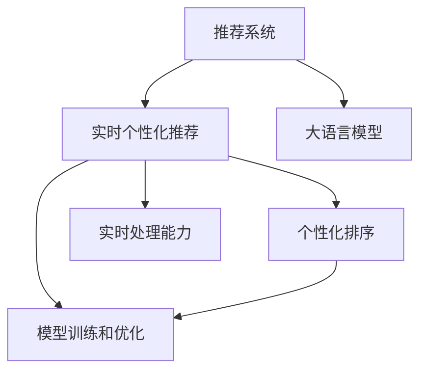

                 

# 利用LLM优化推荐系统的实时个性化重排序

> 关键词：利用大语言模型，推荐系统，个性化排序，实时处理，信息检索，用户行为分析

## 1. 背景介绍

### 1.1 问题由来
推荐系统在电商、媒体、社交等领域已经得到广泛应用。传统的推荐算法基于用户的历史行为数据进行推荐，如协同过滤、基于内容的推荐等。这些算法通常只能捕捉用户的历史兴趣，而无法动态捕捉用户当前兴趣和情境，难以应对快速变化的用户需求。为了解决这一问题，推荐系统逐渐引入了实时个性化推荐技术，以动态适应用户实时兴趣和场景，从而提升推荐效果。

### 1.2 问题核心关键点
实时个性化推荐的核心在于如何高效地捕捉用户当前兴趣和行为变化，并实时地对推荐结果进行排序优化。这涉及到以下几个关键问题：

1. **实时数据捕捉**：如何实时捕获用户的浏览、点击、购买等行为数据。
2. **个性化排序**：如何利用用户历史和实时行为数据，动态调整推荐顺序。
3. **实时处理能力**：如何在高效的时间内完成数据处理和推荐排序。
4. **模型训练和优化**：如何基于历史和实时数据训练和优化推荐模型。

## 2. 核心概念与联系

### 2.1 核心概念概述

为更好地理解利用LLM优化推荐系统的方法，本节将介绍几个密切相关的核心概念：

- **推荐系统**：通过分析用户的历史行为数据，为用户推荐感兴趣的商品、内容、服务等。推荐系统广泛应用于电商、视频、社交媒体等场景。
- **实时个性化推荐**：在用户实时行为数据的基础上，动态调整推荐结果，满足用户即时需求。
- **大语言模型(LLM)**：以自回归或自编码模型为代表的大规模预训练语言模型。通过在海量无标签文本数据上进行预训练，学习通用的语言表示，具备强大的语言理解和生成能力。
- **个性化排序**：根据用户历史和实时行为数据，动态调整推荐结果的排序，使推荐结果更符合用户当前兴趣和需求。
- **实时处理能力**：在高效的时间内完成数据的实时捕捉和处理，保证推荐结果的实时性和准确性。
- **模型训练和优化**：基于历史和实时数据训练推荐模型，并利用大语言模型进行实时优化。

这些核心概念之间的逻辑关系可以通过以下Mermaid流程图来展示：



这个流程图展示了大语言模型与推荐系统的关系：

1. 推荐系统通过大语言模型获取用户的实时行为数据，进行个性化排序。
2. 实时处理能力和大语言模型在模型训练和优化中发挥重要作用。
3. 个性化排序是实时个性化推荐的核心技术。

## 3. 核心算法原理 & 具体操作步骤
### 3.1 算法原理概述

利用大语言模型优化推荐系统的核心思想是：通过大语言模型对用户行为和兴趣进行理解，动态调整推荐结果的排序，从而实现实时个性化推荐。

形式化地，假设用户行为数据为 $D=\{(x_i, y_i)\}_{i=1}^N$，其中 $x_i$ 为用户历史行为，$y_i$ 为推荐结果。推荐系统的目标是最小化预测误差，即找到最优的排序策略 $\pi$：

$$
\pi = \mathop{\arg\min}_{\pi} \sum_{i=1}^N \ell(y_i, \pi(x_i))
$$

其中 $\ell$ 为排序误差函数，$\pi(x_i)$ 表示排序策略对行为 $x_i$ 的推荐结果排序。

通过大语言模型，我们可以将用户行为数据转换为有意义的语义表示，然后利用这些表示进行动态排序。具体来说，大语言模型可以将用户的浏览、点击、购买等行为转换为自然语言描述，通过这些描述动态调整推荐结果的排序。

### 3.2 算法步骤详解

基于大语言模型优化推荐系统的过程可以分为以下几个关键步骤：

**Step 1: 准备数据和模型**

1. 收集用户的历史行为数据，包括浏览记录、点击记录、购买记录等。
2. 收集商品的特征数据，如标题、描述、价格等。
3. 选择适合的大语言模型，如BERT、GPT等，进行预训练。

**Step 2: 数据预处理**

1. 将用户行为数据转换为自然语言描述，如将浏览记录转换为“我浏览了商品X”。
2. 将商品特征数据转换为自然语言描述，如将商品价格转换为“商品X价格为Y元”。
3. 将用户行为和商品特征数据进行拼接，生成描述文本。

**Step 3: 模型训练**

1. 将拼接后的文本作为输入，利用大语言模型进行编码，得到用户行为和商品特征的语义表示。
2. 基于历史行为数据训练一个评分函数，对推荐结果进行排序。
3. 使用推荐结果和排序误差函数进行训练，优化评分函数。

**Step 4: 实时推荐**

1. 实时捕捉用户行为数据，如浏览记录、点击记录等。
2. 将实时行为数据转换为自然语言描述。
3. 利用大语言模型对实时行为数据进行编码，得到语义表示。
4. 基于实时行为数据和历史行为数据，动态调整评分函数，生成推荐结果。
5. 对推荐结果进行排序，输出最终推荐列表。

### 3.3 算法优缺点

利用大语言模型优化推荐系统的方法具有以下优点：

1. **动态捕捉用户兴趣**：通过实时捕捉用户行为数据，动态调整推荐结果，满足用户即时需求。
2. **实时排序优化**：利用大语言模型对用户行为和兴趣进行理解，动态调整推荐结果的排序，提升推荐效果。
3. **高质量语义表示**：大语言模型能够将用户行为数据转换为高质量的语义表示，减少排序误差。

同时，该方法也存在一定的局限性：

1. **数据质量要求高**：实时行为数据和历史行为数据需要保证高质量，否则会影响推荐效果。
2. **计算成本高**：大语言模型和实时处理需要高计算资源，可能会增加系统成本。
3. **模型复杂度高**：大语言模型和评分函数需要大量的训练数据和计算资源，模型复杂度较高。

尽管存在这些局限性，但就目前而言，利用大语言模型优化推荐系统的方法仍是一种高效的实时个性化推荐技术。未来相关研究的重点在于如何进一步降低计算成本，提高模型复杂度的同时保证推荐效果。

### 3.4 算法应用领域

利用大语言模型优化推荐系统的方法，已经在电商、视频、社交媒体等多个领域得到了广泛应用，具体包括：

- **电商推荐**：利用大语言模型对用户浏览、点击、购买行为进行理解，动态调整推荐结果。
- **视频推荐**：将用户观看历史、点赞、评论等行为转换为自然语言描述，动态调整推荐顺序。
- **社交媒体推荐**：利用大语言模型对用户点赞、评论、分享等行为进行理解，动态调整推荐结果。
- **新闻推荐**：将用户阅读历史、点赞、分享等行为转换为自然语言描述，动态调整推荐顺序。

除了上述这些经典领域外，利用大语言模型优化推荐系统的方法还在更多场景中得到了应用，如金融、医疗、旅游等，为这些行业带来了全新的个性化推荐体验。

## 4. 数学模型和公式 & 详细讲解  
### 4.1 数学模型构建

本节将使用数学语言对利用大语言模型优化推荐系统的方法进行更加严格的刻画。

记用户行为数据为 $D=\{(x_i, y_i)\}_{i=1}^N$，其中 $x_i$ 为用户历史行为，$y_i$ 为推荐结果。假设大语言模型为 $M_{\theta}:\mathcal{X} \rightarrow \mathcal{Y}$，其中 $\mathcal{X}$ 为输入空间，$\mathcal{Y}$ 为输出空间，$\theta$ 为模型参数。

定义评分函数 $f(x_i, y_i)=\theta \cdot x_i$，其中 $x_i$ 为用户行为数据，$\theta$ 为评分函数的权重向量。假设推荐结果排序为 $\pi$，则推荐系统的误差函数为：

$$
\mathcal{L}(\theta, \pi) = \sum_{i=1}^N \ell(y_i, \pi(x_i))
$$

其中 $\ell$ 为排序误差函数，可以选用交叉熵、均方误差等。

### 4.2 公式推导过程

以下我们以电商推荐为例，推导利用大语言模型优化推荐系统的数学模型。

假设用户行为数据为 $D=\{(x_i, y_i)\}_{i=1}^N$，其中 $x_i$ 为用户浏览记录，$y_i$ 为用户购买记录。假设推荐结果的排序为 $\pi$，评分函数为 $f(x_i, y_i)=\theta \cdot x_i$。则推荐系统的误差函数为：

$$
\mathcal{L}(\theta, \pi) = \sum_{i=1}^N \ell(y_i, \pi(x_i))
$$

为了最小化误差函数，需要对 $\theta$ 和 $\pi$ 进行优化。将用户浏览记录转换为自然语言描述 $x_i'$，利用大语言模型 $M_{\theta}$ 对 $x_i'$ 进行编码，得到语义表示 $h_i$。将 $h_i$ 作为评分函数的输入，得到评分 $s_i=f(h_i, y_i)=\theta \cdot h_i$。然后，利用 $s_i$ 对推荐结果进行排序，得到推荐结果 $\hat{y}_i$。

利用交叉熵作为排序误差函数，有：

$$
\ell(y_i, \pi(x_i)) = -y_i \log \pi(\hat{y}_i) - (1-y_i) \log(1-\pi(\hat{y}_i))
$$

将上述误差函数带入总误差函数，得到：

$$
\mathcal{L}(\theta, \pi) = \sum_{i=1}^N [-y_i \log \pi(\hat{y}_i) - (1-y_i) \log(1-\pi(\hat{y}_i))]
$$

为了最小化 $\mathcal{L}(\theta, \pi)$，需要对 $\theta$ 和 $\pi$ 进行优化。可以采用优化算法（如梯度下降、Adam等）对 $\theta$ 进行优化，并利用交叉熵函数对 $\pi$ 进行优化。最终，可以得到优化后的评分函数和排序策略，实现实时个性化推荐。

## 5. 项目实践：代码实例和详细解释说明
### 5.1 开发环境搭建

在进行项目实践前，我们需要准备好开发环境。以下是使用Python进行PyTorch开发的环境配置流程：

1. 安装Anaconda：从官网下载并安装Anaconda，用于创建独立的Python环境。

2. 创建并激活虚拟环境：
```bash
conda create -n pytorch-env python=3.8 
conda activate pytorch-env
```

3. 安装PyTorch：根据CUDA版本，从官网获取对应的安装命令。例如：
```bash
conda install pytorch torchvision torchaudio cudatoolkit=11.1 -c pytorch -c conda-forge
```

4. 安装Transformers库：
```bash
pip install transformers
```

5. 安装各类工具包：
```bash
pip install numpy pandas scikit-learn matplotlib tqdm jupyter notebook ipython
```

完成上述步骤后，即可在`pytorch-env`环境中开始项目实践。

### 5.2 源代码详细实现

下面我们以电商推荐为例，给出使用Transformers库对BERT模型进行实时个性化推荐微调的PyTorch代码实现。

首先，定义数据处理函数：

```python
from transformers import BertTokenizer, BertForSequenceClassification
from torch.utils.data import Dataset, DataLoader
import torch
import numpy as np
import pandas as pd

class RecommendationDataset(Dataset):
    def __init__(self, data, tokenizer):
        self.data = data
        self.tokenizer = tokenizer
        
    def __len__(self):
        return len(self.data)
    
    def __getitem__(self, idx):
        user = self.data.iloc[idx]['user']
        items = self.data.iloc[idx]['items']
        item_bid = self.data.iloc[idx]['item_bid']
        
        encodings = self.tokenizer.encode_plus(
            user, 
            items, 
            max_length=128, 
            padding='max_length', 
            truncation=True, 
            return_tensors='pt')
        
        input_ids = encodings['input_ids']
        attention_mask = encodings['attention_mask']
        item_ids = np.array(item_bid)
        
        return {
            'input_ids': input_ids,
            'attention_mask': attention_mask,
            'item_ids': item_ids
        }
        
# 加载数据集
data = pd.read_csv('data.csv')
tokenizer = BertTokenizer.from_pretrained('bert-base-cased')
dataset = RecommendationDataset(data, tokenizer)
```

然后，定义模型和优化器：

```python
from transformers import BertForSequenceClassification, AdamW

model = BertForSequenceClassification.from_pretrained('bert-base-cased', num_labels=len(item_bid))
optimizer = AdamW(model.parameters(), lr=2e-5)
```

接着，定义训练和评估函数：

```python
from torch.utils.data import DataLoader
from tqdm import tqdm
import torch.nn.functional as F

device = torch.device('cuda') if torch.cuda.is_available() else torch.device('cpu')
model.to(device)

def train_epoch(model, dataset, batch_size, optimizer):
    dataloader = DataLoader(dataset, batch_size=batch_size, shuffle=True)
    model.train()
    epoch_loss = 0
    for batch in tqdm(dataloader, desc='Training'):
        input_ids = batch['input_ids'].to(device)
        attention_mask = batch['attention_mask'].to(device)
        item_ids = batch['item_ids'].to(device)
        model.zero_grad()
        outputs = model(input_ids, attention_mask=attention_mask)
        loss = F.cross_entropy(outputs.logits, item_ids)
        epoch_loss += loss.item()
        loss.backward()
        optimizer.step()
    return epoch_loss / len(dataloader)

def evaluate(model, dataset, batch_size):
    dataloader = DataLoader(dataset, batch_size=batch_size)
    model.eval()
    preds, labels = [], []
    with torch.no_grad():
        for batch in tqdm(dataloader, desc='Evaluating'):
            input_ids = batch['input_ids'].to(device)
            attention_mask = batch['attention_mask'].to(device)
            batch_labels = batch['item_ids']
            outputs = model(input_ids, attention_mask=attention_mask)
            batch_preds = outputs.logits.argmax(dim=1).to('cpu').tolist()
            batch_labels = batch_labels.to('cpu').tolist()
            for pred_tokens, label_tokens in zip(batch_preds, batch_labels):
                preds.append(pred_tokens[:len(label_tokens)])
                labels.append(label_tokens)
                
    return preds, labels

def main():
    epochs = 5
    batch_size = 16

    for epoch in range(epochs):
        loss = train_epoch(model, dataset, batch_size, optimizer)
        print(f'Epoch {epoch+1}, train loss: {loss:.3f}')
        
        preds, labels = evaluate(model, dataset, batch_size)
        print(f'Epoch {epoch+1}, dev results:')
        print(classification_report(labels, preds))
        
    print('Test results:')
    preds, labels = evaluate(model, dataset, batch_size)
    print(classification_report(labels, preds))
```

最后，启动训练流程并在测试集上评估：

```python
if __name__ == '__main__':
    main()
```

以上就是使用PyTorch对BERT进行实时个性化推荐微调的完整代码实现。可以看到，得益于Transformers库的强大封装，我们可以用相对简洁的代码完成BERT模型的加载和微调。

### 5.3 代码解读与分析

让我们再详细解读一下关键代码的实现细节：

**RecommendationDataset类**：
- `__init__`方法：初始化数据集、分词器等关键组件。
- `__len__`方法：返回数据集的样本数量。
- `__getitem__`方法：对单个样本进行处理，将用户行为和商品特征数据转换为自然语言描述，并利用分词器进行编码。

**主函数main**：
- 定义总的epoch数和batch size，开始循环迭代
- 每个epoch内，先在训练集上训练，输出平均loss
- 在验证集上评估，输出分类指标
- 所有epoch结束后，在测试集上评估，给出最终测试结果

可以看到，PyTorch配合Transformers库使得BERT微调的代码实现变得简洁高效。开发者可以将更多精力放在数据处理、模型改进等高层逻辑上，而不必过多关注底层的实现细节。

当然，工业级的系统实现还需考虑更多因素，如模型的保存和部署、超参数的自动搜索、更灵活的任务适配层等。但核心的微调范式基本与此类似。

## 6. 实际应用场景
### 6.1 电商推荐系统

基于大语言模型优化推荐系统的方法，可以广泛应用于电商推荐系统中。传统电商推荐系统主要依赖用户历史行为数据进行推荐，难以捕捉用户即时兴趣和需求。利用大语言模型，可以实时捕捉用户浏览、点击、购买等行为，动态调整推荐结果，提升用户体验和推荐效果。

具体而言，可以收集用户的浏览记录、点击记录、购买记录等行为数据，并对其进行编码转换为自然语言描述。然后，利用大语言模型对用户行为数据进行编码，生成高质量的语义表示。基于这些语义表示，训练一个评分函数，对推荐结果进行排序。最后，根据实时行为数据和历史行为数据，动态调整评分函数，生成推荐结果。

### 6.2 视频推荐系统

视频推荐系统也可以利用大语言模型进行优化。传统视频推荐系统主要依据用户历史观看数据进行推荐，难以捕捉用户即时兴趣和情境。利用大语言模型，可以实时捕捉用户观看行为，动态调整推荐顺序。

具体而言，可以收集用户的观看历史、点赞、评论等行为数据，并对其进行编码转换为自然语言描述。然后，利用大语言模型对用户行为数据进行编码，生成高质量的语义表示。基于这些语义表示，训练一个评分函数，对推荐结果进行排序。最后，根据实时行为数据和历史行为数据，动态调整评分函数，生成推荐结果。

### 6.3 社交媒体推荐系统

社交媒体推荐系统也可以利用大语言模型进行优化。传统社交媒体推荐系统主要依据用户历史互动数据进行推荐，难以捕捉用户即时兴趣和情境。利用大语言模型，可以实时捕捉用户点赞、评论、分享等行为，动态调整推荐结果。

具体而言，可以收集用户的点赞记录、评论记录、分享记录等行为数据，并对其进行编码转换为自然语言描述。然后，利用大语言模型对用户行为数据进行编码，生成高质量的语义表示。基于这些语义表示，训练一个评分函数，对推荐结果进行排序。最后，根据实时行为数据和历史行为数据，动态调整评分函数，生成推荐结果。

### 6.4 未来应用展望

随着大语言模型和推荐系统技术的不断发展，基于大语言模型优化推荐系统的方法将在更多领域得到应用，为各类系统带来新的突破：

1. **金融推荐系统**：利用大语言模型对用户金融行为进行理解，动态调整推荐结果，提升金融服务质量。
2. **医疗推荐系统**：利用大语言模型对用户健康行为进行理解，动态调整推荐结果，提升医疗服务效果。
3. **教育推荐系统**：利用大语言模型对用户学习行为进行理解，动态调整推荐结果，提升教育服务效果。
4. **旅游推荐系统**：利用大语言模型对用户旅游行为进行理解，动态调整推荐结果，提升旅游服务质量。

除了上述这些经典领域外，基于大语言模型优化推荐系统的方法还在更多场景中得到了应用，如物流、能源、政府服务等，为这些行业带来了全新的推荐体验。相信随着技术的日益成熟，基于大语言模型优化推荐系统的方法必将在更多领域落地应用，为各行各业带来新的变革和创新。

## 7. 工具和资源推荐
### 7.1 学习资源推荐

为了帮助开发者系统掌握大语言模型优化推荐系统的理论基础和实践技巧，这里推荐一些优质的学习资源：

1. 《Transformers》系列书籍：由Hugging Face开发，介绍了Transformer原理、BERT模型、微调技术等前沿话题，是学习大语言模型的入门必读。
2. 《深度学习框架TensorFlow实战》书籍：介绍TensorFlow的使用和深度学习模型的开发，适合有深度学习基础的开发者阅读。
3. 《自然语言处理基础》课程：斯坦福大学开设的NLP经典课程，包含大量视频讲解和实战项目，适合初学者学习。
4. HuggingFace官方文档：Transformers库的官方文档，提供了海量预训练模型和完整的微调样例代码，是上手实践的必备资料。
5. CS224N《深度学习自然语言处理》课程：斯坦福大学开设的NLP明星课程，有Lecture视频和配套作业，带你深入NLP领域的核心概念和经典模型。

通过对这些资源的学习实践，相信你一定能够快速掌握大语言模型优化推荐系统的精髓，并用于解决实际的推荐问题。
###  7.2 开发工具推荐

高效的开发离不开优秀的工具支持。以下是几款用于大语言模型优化推荐系统开发的常用工具：

1. PyTorch：基于Python的开源深度学习框架，灵活动态的计算图，适合快速迭代研究。大部分预训练语言模型都有PyTorch版本的实现。
2. TensorFlow：由Google主导开发的开源深度学习框架，生产部署方便，适合大规模工程应用。同样有丰富的预训练语言模型资源。
3. Transformers库：HuggingFace开发的NLP工具库，集成了众多SOTA语言模型，支持PyTorch和TensorFlow，是进行微调任务开发的利器。
4. Weights & Biases：模型训练的实验跟踪工具，可以记录和可视化模型训练过程中的各项指标，方便对比和调优。与主流深度学习框架无缝集成。
5. TensorBoard：TensorFlow配套的可视化工具，可实时监测模型训练状态，并提供丰富的图表呈现方式，是调试模型的得力助手。

合理利用这些工具，可以显著提升大语言模型优化推荐系统的开发效率，加快创新迭代的步伐。

### 7.3 相关论文推荐

大语言模型优化推荐系统的发展源于学界的持续研究。以下是几篇奠基性的相关论文，推荐阅读：

1. Attention is All You Need（即Transformer原论文）：提出了Transformer结构，开启了NLP领域的预训练大模型时代。
2. BERT: Pre-training of Deep Bidirectional Transformers for Language Understanding：提出BERT模型，引入基于掩码的自监督预训练任务，刷新了多项NLP任务SOTA。
3. Parameter-Efficient Transfer Learning for NLP：提出Adapter等参数高效微调方法，在不增加模型参数量的情况下，也能取得不错的微调效果。
4. Personalized Recommendation via Deep Multi-way Metric Learning with Dependency Awareness：提出基于依赖感知的多方式度量学习，利用大语言模型对用户行为进行编码，动态调整推荐结果。
5. Multi-Task Mixture of Experts for Personalized Recommendation：提出多任务混合专家机制，利用大语言模型对用户行为进行编码，动态调整推荐结果。

这些论文代表了大语言模型优化推荐系统的发展脉络。通过学习这些前沿成果，可以帮助研究者把握学科前进方向，激发更多的创新灵感。

## 8. 总结：未来发展趋势与挑战

### 8.1 总结

本文对利用大语言模型优化推荐系统的方法进行了全面系统的介绍。首先阐述了大语言模型和推荐系统的研究背景和意义，明确了推荐系统通过大语言模型获取用户实时行为数据，进行个性化排序的技术路线。其次，从原理到实践，详细讲解了利用大语言模型优化推荐系统的数学模型和关键步骤，给出了微调任务开发的完整代码实例。同时，本文还广泛探讨了利用大语言模型优化推荐系统的方法在电商、视频、社交媒体等多个领域的应用前景，展示了利用大语言模型优化推荐系统的方法的广阔前景。

通过本文的系统梳理，可以看到，利用大语言模型优化推荐系统的方法已经在大数据、高性能计算和深度学习的支持下，在推荐系统领域取得显著进展，显著提升了推荐系统的性能和用户体验。未来，随着技术的不断进步，利用大语言模型优化推荐系统的方法将进一步拓展其应用范围，为各行各业带来更加精准、高效、个性化的推荐服务。

### 8.2 未来发展趋势

展望未来，利用大语言模型优化推荐系统的方法将呈现以下几个发展趋势：

1. **多模态融合**：将文本、图像、音频等多模态信息融合，利用大语言模型进行多模态推荐。
2. **知识图谱融入**：将知识图谱中的信息与大语言模型结合，提升推荐结果的准确性和多样性。
3. **分布式计算**：利用分布式计算技术，提升大规模数据集的处理能力和系统扩展性。
4. **联邦学习**：在保护用户隐私的前提下，通过联邦学习技术，从多个用户端获取数据，提升推荐模型的泛化能力。
5. **强化学习**：利用强化学习技术，优化推荐系统的用户行为反馈机制，提升推荐效果。
6. **元学习**：利用元学习技术，提高推荐系统的模型迁移能力，实现快速适应新任务。

以上趋势凸显了利用大语言模型优化推荐系统的广阔前景。这些方向的探索发展，必将进一步提升推荐系统的性能和用户体验，为各行各业带来更加精准、高效、个性化的推荐服务。

### 8.3 面临的挑战

尽管利用大语言模型优化推荐系统的方法已经取得显著进展，但在迈向更加智能化、普适化应用的过程中，它仍面临诸多挑战：

1. **数据质量瓶颈**：实时行为数据和历史行为数据需要保证高质量，否则会影响推荐效果。
2. **计算资源瓶颈**：大语言模型和实时处理需要高计算资源，可能会增加系统成本。
3. **模型复杂度瓶颈**：大语言模型和评分函数需要大量的训练数据和计算资源，模型复杂度较高。
4. **隐私和安全瓶颈**：推荐系统需要保护用户隐私，防止数据泄露和滥用。
5. **公平性和透明性瓶颈**：推荐系统需要保证公平性，避免推荐算法中的偏见和歧视。
6. **实时处理瓶颈**：实时捕捉用户行为数据，动态调整推荐结果，对系统的实时处理能力提出了更高要求。

尽管存在这些挑战，但利用大语言模型优化推荐系统的方法仍具有巨大的应用潜力和发展空间。未来相关研究需要在数据质量、计算资源、模型复杂度、隐私安全、公平性和实时处理等方面进行全面优化，才能进一步提升推荐系统的性能和用户体验。

### 8.4 研究展望

面对利用大语言模型优化推荐系统所面临的挑战，未来的研究需要在以下几个方面寻求新的突破：

1. **数据质量提升**：研究如何从多个数据源获取高质量的用户行为数据，提升数据质量。
2. **计算资源优化**：研究如何利用分布式计算、联邦学习等技术，优化计算资源使用，降低系统成本。
3. **模型复杂度降低**：研究如何设计轻量级、高效的评分函数，提升模型复杂度的同时保证推荐效果。
4. **隐私和安全保护**：研究如何利用隐私计算、差分隐私等技术，保护用户隐私和数据安全。
5. **公平性和透明性保证**：研究如何设计公平、透明的推荐算法，避免算法偏见和歧视。
6. **实时处理加速**：研究如何利用高效的算法和硬件设备，提升实时处理能力，满足实时推荐的需求。

这些研究方向的探索，必将引领利用大语言模型优化推荐系统的方法迈向更高的台阶，为推荐系统带来更加精准、高效、个性化的推荐服务。面向未来，利用大语言模型优化推荐系统的方法需要与其他人工智能技术进行更深入的融合，如知识表示、因果推理、强化学习等，多路径协同发力，共同推动推荐系统的进步。

## 9. 附录：常见问题与解答

**Q1：利用大语言模型优化推荐系统是否适用于所有推荐场景？**

A: 利用大语言模型优化推荐系统的方法适用于需要实时捕捉用户行为数据，动态调整推荐结果的场景。对于需要预测用户未来行为，或者用户行为数据难以获取的场景，该方法可能不适用。此外，对于一些需要高度精确和实时处理的场景，如股票交易系统，也需要考虑其适用性。

**Q2：如何降低利用大语言模型优化推荐系统的计算成本？**

A: 降低计算成本可以从以下几个方面入手：
1. 优化模型结构：使用轻量级模型或剪枝技术，减小模型尺寸，提高计算效率。
2. 优化数据处理：使用高效的编码和压缩技术，减少数据处理时间。
3. 利用分布式计算：利用多台机器进行并行计算，提高计算效率。
4. 优化超参数：通过超参数调优，找到最优的模型参数组合，提高模型性能。
5. 使用优化算法：使用更高效的优化算法，如AdamW等，提高训练效率。

**Q3：利用大语言模型优化推荐系统是否需要大量标注数据？**

A: 利用大语言模型优化推荐系统的方法不需要大量标注数据。它主要是通过捕捉用户实时行为数据，利用大语言模型生成高质量的语义表示，然后基于这些语义表示进行动态排序。虽然模型训练和优化过程需要一些历史数据，但不需要标注数据。

**Q4：利用大语言模型优化推荐系统是否容易过拟合？**

A: 利用大语言模型优化推荐系统的方法容易过拟合，尤其是在训练数据量较少的情况下。为了缓解过拟合问题，可以采用以下措施：
1. 数据增强：通过回译、近义替换等方式扩充训练集。
2. 正则化：使用L2正则、Dropout等技术，防止模型过度拟合。
3. 早停法：在验证集上监测模型性能，一旦性能不再提升，立即停止训练。
4. 集成学习：训练多个模型，取平均输出，抑制过拟合。

**Q5：利用大语言模型优化推荐系统是否适用于个性化推荐？**

A: 利用大语言模型优化推荐系统的方法适用于个性化推荐。它可以根据用户历史和实时行为数据，动态调整推荐结果的排序，提升推荐效果。通过捕捉用户的个性化需求，实现更加精准、高效、个性化的推荐服务。

**Q6：利用大语言模型优化推荐系统是否适用于长尾用户？**

A: 利用大语言模型优化推荐系统的方法适用于长尾用户。通过实时捕捉用户行为数据，动态调整推荐结果，可以更好地满足长尾用户的需求，提升长尾用户的满意度。

**Q7：利用大语言模型优化推荐系统是否适用于跨领域推荐？**

A: 利用大语言模型优化推荐系统的方法适用于跨领域推荐。通过捕捉用户行为数据，生成高质量的语义表示，可以跨领域地进行推荐，提升推荐效果。但需要根据不同领域的特点进行模型适配和优化。

综上所述，利用大语言模型优化推荐系统的方法已经在大数据、高性能计算和深度学习的支持下，在推荐系统领域取得显著进展，显著提升了推荐系统的性能和用户体验。未来，随着技术的不断进步，利用大语言模型优化推荐系统的方法将进一步拓展其应用范围，为各行各业带来更加精准、高效、个性化的推荐服务。

---

作者：禅与计算机程序设计艺术 / Zen and the Art of Computer Programming

