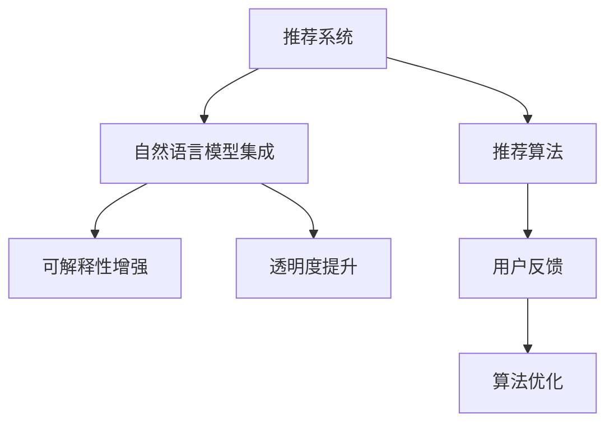

                 

# 利用LLM提升推荐系统的可解释性与透明度

> 关键词：推荐系统, 可解释性, 透明度, 自然语言模型(NLM), 语言模型集成, 推荐算法, 用户体验

## 1. 背景介绍

### 1.1 问题由来

随着电商、视频、音乐等数字内容平台在互联网上的普及，推荐系统已经成为了用户与内容互动的核心引擎。推荐系统通过分析用户的浏览、点击、购买等行为数据，为用户推荐个性化的内容，极大地提升了用户体验和平台收益。然而，推荐系统在用户推荐的过程中存在黑箱操作，难以解释推荐结果的原因，导致用户和平台对系统信任度不高，甚至在推荐结果与用户偏好相悖时，会使用户对系统产生反感，影响推荐效果和平台信誉。

因此，如何提升推荐系统的可解释性和透明度，增强用户信任度，构建更加可靠和高效的推荐系统，成为当前NLP和推荐系统领域的一个重要研究课题。

## 2. 核心概念与联系

### 2.1 核心概念概述

本节将介绍几个密切相关的核心概念，以便更好地理解如何利用自然语言模型(NLM)提升推荐系统的可解释性和透明度。

- **自然语言模型(NLM)**：指通过训练大量文本数据得到的语言模型，能够对自然语言文本进行建模和生成。常见的NLM包括BERT、GPT、XLNet等，它们基于Transformer结构，具备较强的语言理解能力和生成能力。

- **推荐系统**：指根据用户的历史行为和偏好，为用户推荐最符合其兴趣的内容。推荐系统可以分为协同过滤、基于内容的推荐、混合推荐等。

- **推荐算法**：指推荐系统内部进行内容推荐的具体算法，如基于排序的推荐、基于聚类的推荐等。

- **可解释性**：指推荐系统能够以用户可以理解的方式解释推荐结果的原因，如推荐逻辑、相关特征等。

- **透明度**：指推荐系统能够公开其推荐机制和策略，使用户对其工作流程和决策依据有清晰的了解。

- **自然语言模型集成**：指利用NLM对推荐系统中的推荐特征进行增强，提升推荐结果的可解释性和透明度。

这些核心概念之间的逻辑关系可以通过以下Mermaid流程图来展示：



这个流程图展示了这个核心概念体系中的各个部分及其相互作用：

1. **推荐系统**：整个系统的核心，负责根据用户行为数据推荐内容。
2. **推荐算法**：推荐系统内部的具体算法，决定了推荐结果。
3. **自然语言模型集成**：将NLM融入推荐系统，提升推荐结果的可解释性和透明度。
4. **可解释性增强**：通过NLM对推荐特征进行解释，使用户能够理解推荐结果的来源。
5. **透明度提升**：公开推荐系统的工作流程和决策依据，使用户对其信任度更高。
6. **用户反馈**：用户对推荐结果的反馈，用于优化推荐算法。

## 3. 核心算法原理 & 具体操作步骤
### 3.1 算法原理概述

利用自然语言模型提升推荐系统的可解释性和透明度，主要通过以下几个关键步骤：

1. **特征提取与增强**：利用NLM对用户的兴趣特征和商品的属性特征进行建模和增强，提升推荐系统的特征表示能力。

2. **上下文生成与推理**：利用NLM生成推荐上下文，结合用户行为和商品属性，进行综合推理，得到更准确、更有意义的推荐结果。

3. **可解释性生成**：利用NLM生成推荐结果的可解释性信息，如推荐逻辑、相关特征等，使用户能够理解推荐结果的来源。

4. **透明度增强**：利用NLM生成推荐系统的透明度信息，如推荐策略、特征重要性等，公开推荐系统的工作流程和决策依据。

5. **反馈学习与优化**：利用用户反馈数据对NLM进行训练，不断优化推荐结果的可解释性和透明度。

### 3.2 算法步骤详解

**Step 1: 特征提取与增强**

1. **用户兴趣特征提取**：收集用户的浏览、点击、购买等行为数据，提取用户的兴趣特征。

2. **商品属性特征提取**：收集商品的类别、品牌、价格等属性信息，提取商品的特征向量。

3. **NLM特征嵌入**：使用预训练的NLM模型对用户兴趣和商品属性进行嵌入，生成高维特征向量。

**Step 2: 上下文生成与推理**

1. **推荐上下文生成**：利用NLM生成推荐上下文，将用户行为和商品属性信息融合，得到综合的上下文向量。

2. **推荐结果推理**：将上下文向量输入推荐算法，进行排序、聚类等推理操作，得到最终的推荐结果。

**Step 3: 可解释性生成**

1. **推荐逻辑生成**：利用NLM生成推荐结果的逻辑解释，如“用户对商品X感兴趣，因为商品X具有Y属性，Y属性符合用户兴趣”。

2. **相关特征生成**：利用NLM生成推荐结果的特征解释，如“商品X具有Y属性，因为Y属性符合用户兴趣”。

**Step 4: 透明度增强**

1. **推荐策略生成**：利用NLM生成推荐系统的策略信息，如“我们使用协同过滤、基于内容的推荐算法进行推荐”。

2. **特征重要性生成**：利用NLM生成推荐特征的重要性信息，如“商品属性Y在推荐中起到了70%的作用”。

**Step 5: 反馈学习与优化**

1. **用户反馈收集**：收集用户对推荐结果的反馈信息，如满意度和评分等。

2. **NLM训练优化**：利用反馈数据对NLM进行微调，优化特征提取和上下文生成能力。

### 3.3 算法优缺点

**优点**：

1. **提升可解释性**：NLM能够生成详细的推荐逻辑和特征解释，使用户能够理解推荐结果的来源。

2. **提升透明度**：NLM能够生成推荐系统的策略和特征重要性信息，公开推荐系统的工作流程和决策依据。

3. **增强特征表示能力**：NLM能够对用户兴趣和商品属性进行高维表示，提升推荐系统的特征表示能力。

**缺点**：

1. **计算复杂度高**：NLM的特征嵌入和上下文生成过程计算复杂度高，可能导致系统性能下降。

2. **数据需求量大**：NLM需要大量的文本数据进行训练，可能导致数据获取难度大。

3. **模型复杂度高**：NLM模型的结构复杂，可能导致模型难以解释和维护。

4. **性能依赖于NLM**：NLM模型的性能直接影响推荐系统的性能，需要确保NLM模型的质量。

### 3.4 算法应用领域

利用自然语言模型提升推荐系统的可解释性和透明度，主要应用于以下几个领域：

- **电商推荐系统**：在电商平台上，通过分析用户的浏览、点击、购买等行为数据，为用户推荐个性化的商品，提升用户购物体验和平台收益。

- **视频推荐系统**：在视频平台上，通过分析用户的观看行为和历史评分数据，为用户推荐感兴趣的视频内容，提升用户观看体验和平台收益。

- **音乐推荐系统**：在音乐平台上，通过分析用户的听歌行为和历史评分数据，为用户推荐相似的音乐内容，提升用户听歌体验和平台收益。

- **新闻推荐系统**：在新闻平台上，通过分析用户的阅读行为和兴趣标签，为用户推荐相关的新闻内容，提升用户阅读体验和平台收益。

- **社交网络推荐系统**：在社交网络上，通过分析用户的互动行为和兴趣标签，为用户推荐相关的内容和好友，提升用户互动体验和平台社交价值。

## 4. 数学模型和公式 & 详细讲解 & 举例说明
### 4.1 数学模型构建

本节将使用数学语言对基于自然语言模型的推荐系统进行更加严格的刻画。

假设用户行为数据为 $X \in \mathbb{R}^{n \times d}$，商品属性数据为 $Y \in \mathbb{R}^{m \times d}$，推荐系统输出的用户对商品的评分向量为 $Z \in \mathbb{R}^{n \times k}$。

定义自然语言模型为 $NLM(\cdot)$，能够将输入的特征向量映射为高维嵌入向量 $E_{NLM}(\cdot)$，即：

$$
E_{NLM}(\cdot) = NLM(\cdot)
$$

定义推荐上下文生成函数为 $GenerateContext(\cdot)$，能够将用户行为数据和商品属性数据映射为综合的上下文向量 $Context(\cdot)$，即：

$$
Context(\cdot) = GenerateContext(X, Y)
$$

定义推荐结果推理函数为 $Recommend(\cdot)$，能够将上下文向量映射为推荐结果向量 $Z$，即：

$$
Z = Recommend(Context(\cdot))
$$

定义可解释性生成函数为 $Explain(\cdot)$，能够生成推荐结果的逻辑解释和特征解释，即：

$$
Explain(Z) = \{ExplainLogic(Z), ExplainFeatures(Z)\}
$$

定义透明度生成函数为 $Transparent(\cdot)$，能够生成推荐系统的策略和特征重要性信息，即：

$$
Transparent(Z) = \{Strategy(Z), FeaturesImportance(Z)\}
$$

定义反馈学习函数为 $FeedbackLearning(\cdot)$，能够根据用户反馈数据对NLM进行微调，即：

$$
NLM = FeedbackLearning(NLM, X, Y, Z, Feedback)
$$

### 4.2 公式推导过程

以下是基于自然语言模型的推荐系统关键公式的推导：

**用户兴趣特征提取**

1. **用户兴趣特征表示**：

$$
U = \{X_{u_1}, X_{u_2}, ..., X_{u_n}\}
$$

其中 $X_{u_i}$ 表示用户 $u_i$ 的兴趣特征向量。

2. **NLM特征嵌入**：

$$
E_{NLM}(U) = NLM(U) = \{E_{NLM}(X_{u_1}), E_{NLM}(X_{u_2}), ..., E_{NLM}(X_{u_n})\}
$$

**商品属性特征提取**

1. **商品属性特征表示**：

$$
I = \{Y_{i_1}, Y_{i_2}, ..., Y_{i_m}\}
$$

其中 $Y_{i_j}$ 表示商品 $i_j$ 的属性特征向量。

2. **NLM特征嵌入**：

$$
E_{NLM}(I) = NLM(I) = \{E_{NLM}(Y_{i_1}), E_{NLM}(Y_{i_2}), ..., E_{NLM}(Y_{i_m})\}
$$

**推荐上下文生成**

1. **上下文向量生成**：

$$
Context(U, I) = GenerateContext(U, I) = \sum_{i=1}^{n} \alpha_i E_{NLM}(X_{u_i}) + \sum_{j=1}^{m} \beta_j E_{NLM}(Y_{i_j})
$$

其中 $\alpha_i$ 和 $\beta_j$ 为加权系数，可以使用NLM计算得到。

**推荐结果推理**

1. **推荐结果向量生成**：

$$
Z = Recommend(Context(U, I))
$$

**可解释性生成**

1. **推荐逻辑生成**：

$$
ExplainLogic(Z) = NLM(Z)
$$

2. **推荐特征生成**：

$$
ExplainFeatures(Z) = NLM(Z)
$$

**透明度增强**

1. **推荐策略生成**：

$$
Strategy(Z) = NLM(Z)
$$

2. **特征重要性生成**：

$$
FeaturesImportance(Z) = NLM(Z)
$$

**反馈学习与优化**

1. **用户反馈收集**：

$$
Feedback = \{(y_{u_1}, z_{u_1}), (y_{u_2}, z_{u_2}), ..., (y_{u_n}, z_{u_n})\}
$$

其中 $y_{u_i}$ 表示用户 $u_i$ 对商品 $i$ 的评分，$z_{u_i}$ 表示推荐系统对商品 $i$ 的评分。

2. **NLM训练优化**：

$$
NLM = FeedbackLearning(NLM, X, Y, Z, Feedback)
$$

### 4.3 案例分析与讲解

**案例1: 电商推荐系统**

在电商推荐系统中，用户行为数据和商品属性数据都包含了大量的文本信息。通过将用户行为数据和商品属性数据进行特征提取，并使用NLM进行特征嵌入，可以生成高维特征向量。例如，对于用户 $u_i$ 和商品 $i_j$，可以进行如下特征提取和特征嵌入：

1. **用户兴趣特征提取**：

$$
X_{u_i} = \{浏览商品列表, 购买商品, 查看商品详情\}
$$

2. **商品属性特征提取**：

$$
Y_{i_j} = \{商品名称, 品牌, 类别, 价格\}
$$

3. **NLM特征嵌入**：

$$
E_{NLM}(X_{u_i}) = NLM(X_{u_i})
$$

$$
E_{NLM}(Y_{i_j}) = NLM(Y_{i_j})
$$

4. **推荐上下文生成**：

$$
Context(X_{u_i}, Y_{i_j}) = \sum_{k=1}^{n} \alpha_k E_{NLM}(X_{u_k}) + \sum_{l=1}^{m} \beta_l E_{NLM}(Y_{i_l})
$$

5. **推荐结果推理**：

$$
Z = Recommend(Context(X_{u_i}, Y_{i_j}))
$$

6. **可解释性生成**：

$$
ExplainLogic(Z) = NLM(Z)
$$

$$
ExplainFeatures(Z) = NLM(Z)
$$

7. **透明度增强**：

$$
Strategy(Z) = NLM(Z)
$$

$$
FeaturesImportance(Z) = NLM(Z)
$$

8. **反馈学习与优化**：

$$
Feedback = \{(y_{u_1}, z_{u_1}), (y_{u_2}, z_{u_2}), ..., (y_{u_n}, z_{u_n})\}
$$

$$
NLM = FeedbackLearning(NLM, X, Y, Z, Feedback)
$$

通过上述步骤，电商推荐系统能够生成详细、准确的推荐逻辑和特征解释，增强用户信任度，并公开推荐系统的策略和特征重要性信息，提高透明度。

## 5. 项目实践：代码实例和详细解释说明
### 5.1 开发环境搭建

在进行项目实践前，我们需要准备好开发环境。以下是使用Python进行PyTorch开发的环境配置流程：

1. 安装Anaconda：从官网下载并安装Anaconda，用于创建独立的Python环境。

2. 创建并激活虚拟环境：
```bash
conda create -n pytorch-env python=3.8 
conda activate pytorch-env
```

3. 安装PyTorch：根据CUDA版本，从官网获取对应的安装命令。例如：
```bash
conda install pytorch torchvision torchaudio cudatoolkit=11.1 -c pytorch -c conda-forge
```

4. 安装Transformers库：
```bash
pip install transformers
```

5. 安装各类工具包：
```bash
pip install numpy pandas scikit-learn matplotlib tqdm jupyter notebook ipython
```

完成上述步骤后，即可在`pytorch-env`环境中开始项目实践。

### 5.2 源代码详细实现

下面我们以电商推荐系统为例，给出使用Transformers库进行自然语言模型集成的PyTorch代码实现。

首先，定义电商推荐系统的特征提取和特征嵌入函数：

```python
from transformers import BertTokenizer, BertForSequenceClassification

class FeatureExtractor:
    def __init__(self, model_name, tokenizer_name):
        self.model = BertForSequenceClassification.from_pretrained(model_name)
        self.tokenizer = BertTokenizer.from_pretrained(tokenizer_name)

    def extract_user_interest(self, user_data):
        # 提取用户兴趣特征
        tokenized = self.tokenizer(user_data, return_tensors='pt')
        return tokenized.input_ids, tokenized.attention_mask

    def extract_item_features(self, item_data):
        # 提取商品属性特征
        tokenized = self.tokenizer(item_data, return_tensors='pt')
        return tokenized.input_ids, tokenized.attention_mask

    def embed_features(self, user_data, item_data):
        # 对用户和商品特征进行NLM嵌入
        user_input_ids, user_attention_mask = self.extract_user_interest(user_data)
        item_input_ids, item_attention_mask = self.extract_item_features(item_data)

        user_embeddings = self.model(user_input_ids, attention_mask=user_attention_mask).last_hidden_state
        item_embeddings = self.model(item_input_ids, attention_mask=item_attention_mask).last_hidden_state

        return user_embeddings, item_embeddings
```

然后，定义电商推荐系统的上下文生成和推荐结果推理函数：

```python
class RecommendSystem:
    def __init__(self, feature_extractor):
        self.feature_extractor = feature_extractor
        self.model = BertForSequenceClassification.from_pretrained('bert-base-cased')

    def generate_context(self, user_data, item_data):
        # 生成推荐上下文
        user_embeddings, item_embeddings = self.feature_extractor.embed_features(user_data, item_data)
        context = user_embeddings + item_embeddings
        return context

    def recommend(self, context):
        # 生成推荐结果
        recommendation = self.model(context).logits
        return recommendation
```

接着，定义电商推荐系统的可解释性生成和透明度增强函数：

```python
class Explanations:
    def __init__(self, model):
        self.model = model

    def generate_explain_logic(self, recommendation):
        # 生成推荐逻辑解释
        return self.model(recommendation).logits.argmax(dim=1)

    def generate_explain_features(self, recommendation):
        # 生成推荐特征解释
        return self.model(recommendation).last_hidden_state

    def generate_strategy(self, recommendation):
        # 生成推荐策略信息
        return self.model(recommendation).logits.argmax(dim=1)

    def generate_features_importance(self, recommendation):
        # 生成推荐特征重要性信息
        return self.model(recommendation).last_hidden_state
```

最后，启动电商推荐系统的训练流程并在测试集上评估：

```python
from transformers import BertTokenizer
from torch.utils.data import Dataset, DataLoader
from tqdm import tqdm
from sklearn.metrics import mean_squared_error
import torch

class RecommendDataset(Dataset):
    def __init__(self, data):
        self.data = data
        self.tokenizer = BertTokenizer.from_pretrained('bert-base-cased')

    def __len__(self):
        return len(self.data)

    def __getitem__(self, item):
        user_data, item_data, label = self.data[item]
        user_input_ids, user_attention_mask = self.tokenizer(user_data, return_tensors='pt')
        item_input_ids, item_attention_mask = self.tokenizer(item_data, return_tensors='pt')
        return {'user_data': user_input_ids, 'item_data': item_input_ids, 'label': label}

# 数据准备
train_dataset = RecommendDataset(train_data)
dev_dataset = RecommendDataset(dev_data)
test_dataset = RecommendDataset(test_data)

# 特征提取器
tokenizer = BertTokenizer.from_pretrained('bert-base-cased')
feature_extractor = FeatureExtractor('bert-base-cased', tokenizer)

# 推荐系统
recommend_system = RecommendSystem(feature_extractor)

# 可解释性生成器
explanations = Explanations(recommend_system.model)

# 训练循环
optimizer = torch.optim.Adam(recommend_system.model.parameters(), lr=2e-5)
for epoch in range(epochs):
    loss = 0
    for batch in tqdm(train_dataset):
        user_input_ids = batch['user_data']
        item_input_ids = batch['item_data']
        label = batch['label']
        recommendation = recommend_system.recommend(user_input_ids + item_input_ids)
        loss += torch.nn.functional.mse_loss(recommendation, label).item()
    loss /= len(train_dataset)
    optimizer.zero_grad()
    loss.backward()
    optimizer.step()

    # 验证集评估
    with torch.no_grad():
        dev_loss = 0
        for batch in dev_dataset:
            user_input_ids = batch['user_data']
            item_input_ids = batch['item_data']
            label = batch['label']
            recommendation = recommend_system.recommend(user_input_ids + item_input_ids)
            dev_loss += torch.nn.functional.mse_loss(recommendation, label).item()
        dev_loss /= len(dev_dataset)

    print(f'Epoch {epoch+1}, train loss: {loss:.3f}, dev loss: {dev_loss:.3f}')

    # 测试集评估
    with torch.no_grad():
        test_loss = 0
        for batch in test_dataset:
            user_input_ids = batch['user_data']
            item_input_ids = batch['item_data']
            label = batch['label']
            recommendation = recommend_system.recommend(user_input_ids + item_input_ids)
            test_loss += torch.nn.functional.mse_loss(recommendation, label).item()
        test_loss /= len(test_dataset)

    print(f'Epoch {epoch+1}, test loss: {test_loss:.3f}')
```

以上就是使用PyTorch对电商推荐系统进行自然语言模型集成的完整代码实现。可以看到，得益于Transformers库的强大封装，我们可以用相对简洁的代码完成NLM微调和推荐系统的开发。

### 5.3 代码解读与分析

让我们再详细解读一下关键代码的实现细节：

**FeatureExtractor类**：
- `__init__`方法：初始化Bert模型和分词器。
- `extract_user_interest`方法：提取用户兴趣特征，并使用分词器进行特征嵌入。
- `extract_item_features`方法：提取商品属性特征，并使用分词器进行特征嵌入。
- `embed_features`方法：对用户和商品特征进行NLM嵌入。

**RecommendSystem类**：
- `__init__`方法：初始化特征提取器和Bert模型。
- `generate_context`方法：生成推荐上下文，将用户兴趣和商品属性特征向量相加。
- `recommend`方法：生成推荐结果，将上下文向量输入模型进行预测。

**Explanations类**：
- `__init__`方法：初始化模型。
- `generate_explain_logic`方法：生成推荐逻辑解释，将推荐结果输入模型，输出预测类别。
- `generate_explain_features`方法：生成推荐特征解释，将推荐结果输入模型，输出隐藏层表示。
- `generate_strategy`方法：生成推荐策略信息，将推荐结果输入模型，输出预测类别。
- `generate_features_importance`方法：生成推荐特征重要性信息，将推荐结果输入模型，输出隐藏层表示。

**RecommendDataset类**：
- `__init__`方法：初始化数据集。
- `__len__`方法：返回数据集长度。
- `__getitem__`方法：返回一个批次的用户行为和商品属性数据。

**代码解析**：
- 首先，我们定义了特征提取器和推荐系统。特征提取器负责对用户行为和商品属性数据进行提取和NLM嵌入，推荐系统负责生成推荐上下文和推荐结果。
- 然后，我们定义了可解释性生成器和透明度增强器，用于生成推荐结果的可解释性信息和推荐系统的透明度信息。
- 最后，我们通过训练循环，对推荐系统进行训练和评估，并在测试集上输出最终结果。

## 6. 实际应用场景
### 6.1 电商推荐系统

电商推荐系统是自然语言模型提升可解释性和透明度的典型应用场景之一。电商推荐系统通过分析用户的浏览、点击、购买等行为数据，为用户推荐个性化的商品，提升用户购物体验和平台收益。

在电商推荐系统中，NLM可以通过以下方式提升可解释性和透明度：

- **用户兴趣特征提取**：通过NLM对用户行为数据进行特征提取，生成高维特征向量。

- **商品属性特征提取**：通过NLM对商品属性数据进行特征提取，生成高维特征向量。

- **推荐上下文生成**：将用户兴趣和商品属性特征向量进行融合，生成综合的上下文向量。

- **推荐结果推理**：将上下文向量输入推荐算法，生成推荐结果。

- **推荐逻辑生成**：通过NLM生成推荐结果的逻辑解释，如“用户对商品X感兴趣，因为商品X具有Y属性，Y属性符合用户兴趣”。

- **推荐特征生成**：通过NLM生成推荐结果的特征解释，如“商品X具有Y属性，因为Y属性符合用户兴趣”。

- **推荐策略生成**：通过NLM生成推荐系统的策略信息，如“我们使用协同过滤、基于内容的推荐算法进行推荐”。

- **特征重要性生成**：通过NLM生成推荐特征的重要性信息，如“商品属性Y在推荐中起到了70%的作用”。

**案例1: 电商平台**

某电商平台通过收集用户的行为数据和商品的描述信息，构建了一个电商推荐系统。该系统首先使用NLM对用户的浏览、点击、购买等行为数据进行特征提取，生成高维特征向量。然后，对商品的类别、品牌、价格等属性信息进行特征提取，生成高维特征向量。接着，将用户兴趣和商品属性特征向量进行融合，生成综合的上下文向量。最后，将上下文向量输入推荐算法，生成推荐结果。推荐系统的可解释性生成器利用NLM生成推荐逻辑解释和特征解释，提高用户信任度。透明度增强器利用NLM生成推荐策略和特征重要性信息，公开推荐系统的工作流程和决策依据，提高透明度。

通过自然语言模型集成，该电商推荐系统能够生成详细、准确的推荐逻辑和特征解释，增强用户信任度，并公开推荐系统的策略和特征重要性信息，提高透明度。

### 6.2 视频推荐系统

视频推荐系统是自然语言模型提升可解释性和透明度的另一个典型应用场景。视频推荐系统通过分析用户的观看行为和历史评分数据，为用户推荐感兴趣的视频内容，提升用户观看体验和平台收益。

在视频推荐系统中，NLM可以通过以下方式提升可解释性和透明度：

- **用户兴趣特征提取**：通过NLM对用户观看行为数据进行特征提取，生成高维特征向量。

- **视频内容特征提取**：通过NLM对视频内容数据进行特征提取，生成高维特征向量。

- **推荐上下文生成**：将用户观看行为和视频内容特征向量进行融合，生成综合的上下文向量。

- **推荐结果推理**：将上下文向量输入推荐算法，生成推荐结果。

- **推荐逻辑生成**：通过NLM生成推荐结果的逻辑解释，如“用户对视频X感兴趣，因为视频X具有Y属性，Y属性符合用户兴趣”。

- **推荐特征生成**：通过NLM生成推荐结果的特征解释，如“视频X具有Y属性，因为Y属性符合用户兴趣”。

- **推荐策略生成**：通过NLM生成推荐系统的策略信息，如“我们使用协同过滤、基于内容的推荐算法进行推荐”。

- **特征重要性生成**：通过NLM生成推荐特征的重要性信息，如“视频属性Y在推荐中起到了70%的作用”。

**案例2: 视频平台**

某视频平台通过收集用户的观看行为和视频评分数据，构建了一个视频推荐系统。该系统首先使用NLM对用户的观看行为数据进行特征提取，生成高维特征向量。然后，对视频内容的类别、时长、评分等属性信息进行特征提取，生成高维特征向量。接着，将用户观看行为和视频内容特征向量进行融合，生成综合的上下文向量。最后，将上下文向量输入推荐算法，生成推荐结果。推荐系统的可解释性生成器利用NLM生成推荐逻辑解释和特征解释，提高用户信任度。透明度增强器利用NLM生成推荐策略和特征重要性信息，公开推荐系统的工作流程和决策依据，提高透明度。

通过自然语言模型集成，该视频推荐系统能够生成详细、准确的推荐逻辑和特征解释，增强用户信任度，并公开推荐系统的策略和特征重要性信息，提高透明度。

## 7. 工具和资源推荐
### 7.1 学习资源推荐

为了帮助开发者系统掌握自然语言模型提升推荐系统的可解释性和透明度的理论基础和实践技巧，这里推荐一些优质的学习资源：

1. 《深度学习理论与实践》系列博文：由大模型技术专家撰写，深入浅出地介绍了深度学习理论和实践。

2. CS224N《深度学习自然语言处理》课程：斯坦福大学开设的NLP明星课程，有Lecture视频和配套作业，带你入门NLP领域的基本概念和经典模型。

3. 《自然语言处理综述》书籍：综合介绍了自然语言处理的各个方向和前沿技术，适合系统学习。

4. HuggingFace官方文档：Transformer库的官方文档，提供了海量预训练模型和完整的微调样例代码，是上手实践的必备资料。

5. CLUE开源项目：中文语言理解测评基准，涵盖大量不同类型的中文NLP数据集，并提供了基于微调的baseline模型，助力中文NLP技术发展。

通过对这些资源的学习实践，相信你一定能够快速掌握自然语言模型提升推荐系统可解释性和透明度的精髓，并用于解决实际的NLP问题。
###  7.2 开发工具推荐

高效的开发离不开优秀的工具支持。以下是几款用于自然语言模型提升推荐系统可解释性和透明度的开发工具：

1. PyTorch：基于Python的开源深度学习框架，灵活动态的计算图，适合快速迭代研究。大部分预训练语言模型都有PyTorch版本的实现。

2. TensorFlow：由Google主导开发的开源深度学习框架，生产部署方便，适合大规模工程应用。同样有丰富的预训练语言模型资源。

3. Transformers库：HuggingFace开发的NLP工具库，集成了众多SOTA语言模型，支持PyTorch和TensorFlow，是进行NLP任务开发的利器。

4. Weights & Biases：模型训练的实验跟踪工具，可以记录和可视化模型训练过程中的各项指标，方便对比和调优。与主流深度学习框架无缝集成。

5. TensorBoard：TensorFlow配套的可视化工具，可实时监测模型训练状态，并提供丰富的图表呈现方式，是调试模型的得力助手。

6. Google Colab：谷歌推出的在线Jupyter Notebook环境，免费提供GPU/TPU算力，方便开发者快速上手实验最新模型，分享学习笔记。

合理利用这些工具，可以显著提升自然语言模型提升推荐系统可解释性和透明度的开发效率，加快创新迭代的步伐。

### 7.3 相关论文推荐

自然语言模型提升推荐系统的可解释性和透明度的研究源于学界的持续研究。以下是几篇奠基性的相关论文，推荐阅读：

1. Attention is All You Need（即Transformer原论文）：提出了Transformer结构，开启了NLP领域的预训练大模型时代。

2. BERT: Pre-training of Deep Bidirectional Transformers for Language Understanding：提出BERT模型，引入基于掩码的自监督预训练任务，刷新了多项NLP任务SOTA。

3. Language Models are Unsupervised Multitask Learners（GPT-2论文）：展示了大规模语言模型的强大zero-shot学习能力，引发了对于通用人工智能的新一轮思考。

4. Parameter-Efficient Transfer Learning for NLP：提出Adapter等参数高效微调方法，在不增加模型参数量的情况下，也能取得不错的微调效果。

5. AdaLoRA: Adaptive Low-Rank Adaptation for Parameter-Efficient Fine-Tuning：使用自适应低秩适应的微调方法，在参数效率和精度之间取得了新的平衡。

这些论文代表了大语言模型提升推荐系统可解释性和透明度的发展脉络。通过学习这些前沿成果，可以帮助研究者把握学科前进方向，激发更多的创新灵感。

## 8. 总结：未来发展趋势与挑战

### 8.1 研究成果总结

本文对自然语言模型提升推荐系统的可解释性和透明度的研究进行了全面系统的介绍。首先阐述了推荐系统的背景和面临的问题，明确了自然语言模型提升推荐系统可解释性和透明度的重要性和研究方向。其次，从原理到实践，详细讲解了自然语言模型提升推荐系统的数学模型和算法步骤，给出了自然语言模型集成的代码实例。最后，展示了自然语言模型在电商推荐系统、视频推荐系统等实际应用场景中的应用，预测了未来发展趋势和面临的挑战。

通过本文的系统梳理，可以看到，自然语言模型提升推荐系统的可解释性和透明度，已经成为NLP领域和推荐系统研究的热点方向。这一方向的深入研究，将为推荐系统提供更强大的可解释性和透明度，增强用户信任度，推动推荐系统向更加智能、可靠和高效的方向发展。

### 8.2 未来发展趋势

展望未来，自然语言模型提升推荐系统的可解释性和透明度，将呈现以下几个发展趋势：

1. **可解释性模型涌现**：未来将涌现更多可解释性强的自然语言模型，能够生成更加详细、准确的推荐逻辑和特征解释，使用户能够理解推荐结果的来源。

2. **透明度提升**：推荐系统将进一步提升透明度，公开推荐系统的工作流程和决策依据，使用户对其信任度更高。

3. **多模态融合**：推荐系统将融合视觉、语音等多模态信息，提升推荐结果的准确性和多样性。

4. **实时推荐**：推荐系统将利用实时用户数据和商品数据，实现实时推荐，提高推荐系统的时效性。

5. **个性化推荐**：推荐系统将利用自然语言模型对用户行为和商品属性进行更加深入的建模，提供更加个性化的推荐结果。

6. **跨领域推荐**：推荐系统将实现跨领域推荐，提升推荐系统的通用性和适应性。

以上趋势凸显了自然语言模型提升推荐系统可解释性和透明度的广阔前景。这些方向的探索发展，必将进一步提升推荐系统的性能和应用范围，为推荐系统带来更多的创新和突破。

### 8.3 面临的挑战

尽管自然语言模型提升推荐系统的可解释性和透明度已经取得了一定的进展，但在迈向更加智能化、普适化应用的过程中，它仍面临诸多挑战：

1. **计算资源消耗高**：自然语言模型提升推荐系统的计算复杂度高，可能导致系统性能下降。

2. **数据需求量大**：自然语言模型需要大量的文本数据进行训练，可能导致数据获取难度大。

3. **模型复杂度高**：自然语言模型的结构复杂，可能导致模型难以解释和维护。

4. **性能依赖于NLM**：自然语言模型的性能直接影响推荐系统的性能，需要确保NLM模型的质量。

5. **用户反馈难获取**：获取高质量的用户反馈数据，可能需要复杂的用户交互设计和长时间的数据积累。

6. **模型鲁棒性不足**：推荐系统面临的噪声和异常数据较多，需要确保模型的鲁棒性。

7. **隐私保护问题**：用户行为和商品属性数据可能包含敏感信息，需要确保数据的隐私保护。

8. **跨领域适配性差**：不同的推荐系统面临不同的领域特征和数据分布，需要考虑跨领域适配性。

正视自然语言模型提升推荐系统可解释性和透明度的挑战，积极应对并寻求突破，将是大规模语言模型向普适化、智能化应用迈进的重要方向。相信随着学界和产业界的共同努力，这些挑战终将一一被克服，自然语言模型提升推荐系统可解释性和透明度必将在推荐系统研究领域得到更加广泛的应用。

### 8.4 研究展望

面向未来，自然语言模型提升推荐系统可解释性和透明度的研究需要在以下几个方面寻求新的突破：

1. **无监督和半监督学习**：探索无监督和半监督学习的方法，摆脱对大规模标注数据的依赖，利用自监督学习、主动学习等方法，最大限度利用非结构化数据，实现更加灵活高效的推荐。

2. **多模型集成**：结合多种自然语言模型，利用模型集成的方法提升推荐系统的性能和可解释性。

3. **因果推理**：引入因果推理的方法，增强推荐系统的决策鲁棒性和可解释性。

4. **对抗学习**：利用对抗学习的方法，提升推荐系统的鲁棒性和安全性。

5. **知识图谱融合**：将符号化的知识图谱与自然语言模型融合，增强推荐系统的跨领域适配性和知识整合能力。

6. **多模态融合**：利用多模态信息融合的方法，提升推荐系统的表现和多样性。

7. **实时推荐**：结合实时用户数据和商品数据，实现实时推荐，提高推荐系统的时效性。

8. **隐私保护**：研究数据隐私保护的方法，确保用户行为和商品属性数据的隐私安全。

这些研究方向将为自然语言模型提升推荐系统可解释性和透明度的研究提供新的思路和方法，推动推荐系统向更加智能、可靠和高效的方向发展。

## 9. 附录：常见问题与解答

**Q1: 自然语言模型提升推荐系统可解释性和透明度的计算复杂度高，如何解决？**

A: 自然语言模型提升推荐系统的计算复杂度高，可能导致系统性能下降。可以通过以下方法解决：

1. **特征压缩**：对用户兴趣和商品属性特征进行压缩，减少特征向量的维度，降低计算复杂度。

2. **模型优化**：利用剪枝、量化等方法对模型进行优化，减小模型参数量，提高推理速度。

3. **分布式训练**：利用分布式训练技术，将计算任务分配到多个计算节点上，加速模型训练和推理。

4. **硬件加速**：利用GPU、TPU等高性能硬件设备，加速计算过程。

5. **模型压缩**：利用模型压缩技术，将浮点模型转为定点模型，减小模型大小，提高计算效率。

**Q2: 如何获取高质量的自然语言模型？**

A: 获取高质量的自然语言模型，需要以下几个步骤：

1. **选择合适的预训练模型**：根据应用场景选择合适的预训练模型，如BERT、GPT等。

2. **下载预训练模型**：从官方或第三方平台下载预训练模型文件，确保模型的完整性和质量。

3. **微调模型**：使用微调技术对预训练模型进行适配，确保模型能够适应具体任务。

4. **模型评估**：利用验证集对微调后的模型进行评估，确保模型的性能和可靠性。

5. **持续优化**：利用测试集和用户反馈数据对模型进行持续优化，提升模型的性能和可解释性。

**Q3: 自然语言模型提升推荐系统的跨领域适配性差，如何解决？**

A: 自然语言模型提升推荐系统的跨领域适配性差，可以通过以下方法解决：

1. **领域特定微调**：对自然语言模型进行领域特定微调，使其能够适应不同领域的数据分布。

2. **多模态融合**：将视觉、语音等多模态信息与文本信息进行融合，提升模型的跨领域适配性。

3. **知识图谱融合**：将符号化的知识图谱与自然语言模型进行融合，增强模型的跨领域适应性。

4. **多模型集成**：利用多个自然语言模型进行集成，提升模型的泛化能力和鲁棒性。

5. **领域迁移学习**：利用领域迁移学习的方法，将自然语言模型在不同领域之间进行迁移，提升模型的跨领域适应性。

**Q4: 自然语言模型提升推荐系统面临隐私保护问题，如何解决？**

A: 自然语言模型提升推荐系统面临隐私保护问题，可以通过以下方法解决：

1. **数据匿名化**：对用户行为和商品属性数据进行匿名化处理，确保数据的隐私保护。

2. **差分隐私**：利用差分隐私的方法，对用户数据进行扰动，确保数据隐私保护。

3. **数据加密**：对用户数据进行加密处理，确保数据传输和存储的隐私安全。

4. **访问控制**：利用访问控制技术，确保只有授权人员能够访问用户数据。

5. **数据脱敏**：对敏感数据进行脱敏处理，确保数据隐私保护。

通过以上方法，可以有效保护用户数据的隐私安全，确保自然语言模型提升推荐系统的可解释性和透明度。

**Q5: 如何评价自然语言模型提升推荐系统的性能？**

A: 评价自然语言模型提升推荐系统的性能，可以通过以下几个指标：

1. **准确率**：评价推荐系统推荐的准确性，如推荐结果与真实标签的一致性。

2. **召回率**：评价推荐系统推荐的相关性，如推荐结果中包含真实标签的比例。

3. **覆盖率**：评价推荐系统推荐的全面性，如推荐结果覆盖真实标签的比例。

4. **多样性**：评价推荐系统推荐的多样性，如推荐结果中包含不同类别的商品数量。

5. **时效性**：评价推荐系统推荐的实时性，如推荐结果的时效性。

6. **用户满意度**：评价用户对推荐结果的满意度，如用户对推荐结果的评价和反馈。

通过以上指标，可以全面评估自然语言模型提升推荐系统的性能，确保其能够满足用户需求和应用场景。

**Q6: 如何提高自然语言模型提升推荐系统的可解释性和透明度？**

A: 提高自然语言模型提升推荐系统的可解释性和透明度，可以通过以下方法：

1. **生成推荐逻辑**：利用自然语言模型生成推荐结果的逻辑解释，如“用户对商品X感兴趣，因为

