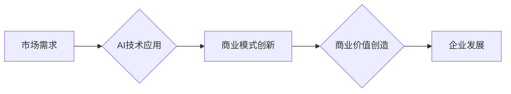

> AI创业公司,商业模式创新,人工智能,机器学习,深度学习,数据驱动,商业价值,市场需求

## 1. 背景介绍

人工智能（AI）技术近年来发展迅速，已渗透到各个行业，为企业带来了巨大的变革机遇。众多AI创业公司涌现，致力于利用AI技术解决实际问题，创造新的价值。然而，在激烈的市场竞争中，单纯依靠技术优势已不足以保证企业的长期发展。商业模式创新成为AI创业公司实现可持续发展的关键。

传统的商业模式往往依赖于产品或服务的直接销售，而AI技术的特点是数据驱动和算法优化，这为商业模式创新提供了新的思路。AI创业公司需要深入理解市场需求，挖掘AI技术的应用场景，并构建能够有效利用AI技术创造价值的商业模式。

## 2. 核心概念与联系

**2.1 商业模式创新**

商业模式创新是指企业在现有商业模式的基础上，通过改变产品、服务、价值主张、客户群体、渠道、资源配置等方面，创造新的商业价值，从而获得竞争优势。

**2.2 AI技术与商业模式创新**

AI技术可以赋能商业模式创新，主要体现在以下几个方面：

* **数据驱动决策:** AI算法能够从海量数据中提取有价值的信息，帮助企业进行数据驱动决策，优化运营效率。
* **个性化定制:** AI技术可以根据用户的需求和行为进行个性化定制，提供更加精准的服务和产品。
* **自动化流程:** AI可以自动化完成许多重复性任务，提高工作效率，降低成本。
* **新产品和服务创新:** AI技术可以帮助企业开发新的产品和服务，满足用户不断变化的需求。

**2.3 商业模式创新案例**

* **Netflix:** 利用AI技术进行内容推荐，提高用户粘性，并通过订阅模式实现持续收入。
* **Uber:** 利用AI技术进行路线规划和价格优化，提高服务效率，并通过平台模式连接司机和乘客。
* **Airbnb:** 利用AI技术进行房源推荐和安全保障，提高用户体验，并通过平台模式连接房东和旅客。

**2.4 Mermaid 流程图**

## 3. 核心算法原理 & 具体操作步骤

**3.1 算法原理概述**

AI创业公司在进行商业模式创新时，需要选择合适的算法来解决具体问题。常见的AI算法包括机器学习、深度学习、自然语言处理等。

* **机器学习:** 通过训练模型，让算法从数据中学习规律，进行预测或分类。
* **深度学习:** 基于神经网络，能够处理更复杂的数据，例如图像、语音、文本等。
* **自然语言处理:** 处理和理解人类语言，例如文本分类、机器翻译、对话系统等。

**3.2 算法步骤详解**

选择合适的算法后，需要进行以下步骤：

1. **数据收集和预处理:** 收集相关数据，并进行清洗、转换、特征提取等预处理工作。
2. **模型选择和训练:** 选择合适的算法模型，并根据数据进行训练，调整模型参数。
3. **模型评估和优化:** 使用测试数据评估模型性能，并根据评估结果进行模型优化。
4. **模型部署和应用:** 将训练好的模型部署到实际应用场景中，并进行监控和维护。

**3.3 算法优缺点**

不同的算法具有不同的优缺点，需要根据具体问题选择合适的算法。

* **机器学习:** 优点是易于理解和实现，缺点是需要大量的标注数据。
* **深度学习:** 优点是能够处理更复杂的数据，缺点是训练时间长，参数量大。
* **自然语言处理:** 优点是能够理解和处理人类语言，缺点是算法复杂度高，需要大量的语料库训练。

**3.4 算法应用领域**

AI算法广泛应用于各个领域，例如：

* **金融:** 风险评估、欺诈检测、投资决策
* **医疗:** 疾病诊断、药物研发、个性化治疗
* **零售:** 商品推荐、库存管理、客户服务
* **制造:** 质量控制、预测维护、生产优化

## 4. 数学模型和公式 & 详细讲解 & 举例说明

**4.1 数学模型构建**

AI算法的数学模型通常基于概率论、统计学和微积分等数学基础。例如，机器学习中的线性回归模型可以表示为：

$$y = w_0 + w_1x_1 + w_2x_2 + ... + w_nx_n + \epsilon$$

其中：

* $y$ 是预测值
* $w_0, w_1, w_2, ..., w_n$ 是模型参数
* $x_1, x_2, ..., x_n$ 是输入特征
* $\epsilon$ 是误差项

**4.2 公式推导过程**

模型参数的学习过程通常使用梯度下降算法，通过不断调整参数，使得模型预测值与真实值之间的误差最小化。梯度下降算法的公式如下：

$$w_i = w_i - \alpha \frac{\partial Loss}{\partial w_i}$$

其中：

* $w_i$ 是模型参数
* $\alpha$ 是学习率
* $Loss$ 是损失函数，用于衡量模型预测值与真实值之间的误差

**4.3 案例分析与讲解**

例如，在图像分类任务中，可以使用卷积神经网络（CNN）模型进行训练。CNN模型通过卷积层和池化层提取图像特征，并通过全连接层进行分类。

## 5. 项目实践：代码实例和详细解释说明

**5.1 开发环境搭建**

AI创业公司需要搭建合适的开发环境，例如使用Python语言和相关的AI库，例如TensorFlow、PyTorch等。

**5.2 源代码详细实现**

具体代码实现需要根据具体的算法和应用场景进行编写。

**5.3 代码解读与分析**

需要对代码进行详细解读，分析算法的实现原理和流程。

**5.4 运行结果展示**

需要展示模型的训练结果和预测结果，并进行评估。

## 6. 实际应用场景

**6.1 医疗保健**

AI可以用于疾病诊断、药物研发、个性化治疗等领域。例如，AI算法可以分析患者的医疗影像数据，辅助医生进行疾病诊断；AI可以用于预测药物的疗效和副作用，加速药物研发过程。

**6.2 金融服务**

AI可以用于风险评估、欺诈检测、投资决策等领域。例如，AI算法可以分析客户的财务数据，评估其信用风险；AI可以用于检测金融交易中的欺诈行为；AI可以用于分析市场数据，进行投资决策。

**6.3 制造业**

AI可以用于质量控制、预测维护、生产优化等领域。例如，AI算法可以分析生产过程中的数据，检测产品质量缺陷；AI可以用于预测设备故障，进行提前维护；AI可以用于优化生产流程，提高生产效率。

**6.4 未来应用展望**

AI技术的应用场景还在不断扩展，未来将有更多新的应用场景出现。例如，AI可以用于自动驾驶、机器人、虚拟现实等领域。

## 7. 工具和资源推荐

**7.1 学习资源推荐**

* **在线课程:** Coursera、edX、Udacity等平台提供丰富的AI课程。
* **书籍:** 《深度学习》、《机器学习实战》等书籍是学习AI技术的经典教材。
* **开源项目:** TensorFlow、PyTorch等开源项目可以帮助开发者学习和实践AI算法。

**7.2 开发工具推荐**

* **Python:** Python是AI开发的常用语言，拥有丰富的AI库和工具。
* **Jupyter Notebook:** Jupyter Notebook是交互式编程环境，方便进行AI算法的开发和调试。
* **云计算平台:** AWS、Azure、GCP等云计算平台提供AI相关的服务和工具。

**7.3 相关论文推荐**

* **《ImageNet Classification with Deep Convolutional Neural Networks》**
* **《Attention Is All You Need》**
* **《BERT: Pre-training of Deep Bidirectional Transformers for Language Understanding》**

## 8. 总结：未来发展趋势与挑战

**8.1 研究成果总结**

近年来，AI技术取得了长足的进步，在各个领域都取得了显著的应用成果。

**8.2 未来发展趋势**

未来，AI技术将朝着更加智能化、自动化、个性化的方向发展。例如，AI将更加擅长理解和处理自然语言，能够进行更复杂的决策和推理。

**8.3 面临的挑战**

AI技术的发展也面临着一些挑战，例如：

* **数据安全和隐私保护:** AI算法依赖于大量数据，如何保证数据的安全和隐私是重要的挑战。
* **算法可解释性和公平性:** 许多AI算法是黑箱模型，难以解释其决策过程，如何保证算法的公平性和可解释性也是重要的挑战。
* **伦理问题:** AI技术的应用可能会带来一些伦理问题，例如人工智能的责任和义务、人工智能的就业影响等。

**8.4 研究展望**

未来，需要加强对AI技术的伦理、安全和公平性的研究，并制定相应的政策和规范，引导AI技术健康发展。

## 9. 附录：常见问题与解答

**9.1 如何选择合适的AI算法？**

选择合适的AI算法需要根据具体的应用场景和数据特点进行选择。

**9.2 如何评估AI模型的性能？**

可以使用准确率、召回率、F1-score等指标来评估AI模型的性能。

**9.3 如何解决AI算法的过拟合问题？**

可以使用正则化、交叉验证等方法来解决AI算法的过拟合问题。

作者：禅与计算机程序设计艺术 / Zen and the Art of Computer Programming 
<end_of_turn>