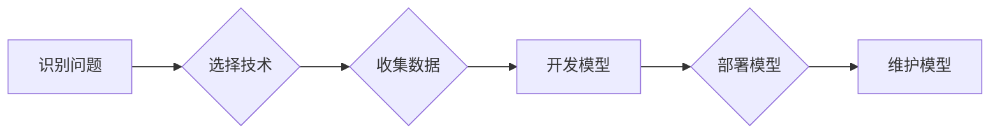

> AI创业, 技术挑战, 应用场景, 场景平衡, 算法原理, 项目实践, 未来趋势

## 1. 背景介绍

人工智能（AI）技术近年来发展迅速，已渗透到各个领域，为创业者带来了前所未有的机遇。AI创业者可以利用AI技术开发创新产品和服务，解决现实问题，创造价值。然而，AI创业也面临着诸多挑战，其中技术、应用场景和场景平衡是最为关键的。

**1.1 AI创业的机遇与挑战**

AI技术的进步为创业者提供了前所未有的机遇：

* **自动化和效率提升:** AI可以自动化许多重复性任务，提高工作效率，降低成本。
* **个性化体验:** AI可以根据用户的需求和喜好提供个性化的产品和服务，提升用户体验。
* **新产品和服务创新:** AI可以帮助创业者开发全新的产品和服务，满足市场需求。

然而，AI创业也面临着诸多挑战：

* **技术门槛高:** AI技术需要专业的知识和技能，创业者需要具备相应的技术背景或团队。
* **数据获取和处理:** AI算法需要大量的数据进行训练和测试，数据获取和处理成本高昂。
* **模型部署和维护:** 将AI模型部署到实际应用场景中，并进行维护和更新，需要一定的技术和资源。
* **伦理和社会影响:** AI技术的应用可能带来伦理和社会问题，创业者需要考虑这些问题，并进行相应的规制和管理。

**1.2 场景平衡的重要性**

AI创业者需要在技术、应用场景和场景平衡之间找到最佳的平衡点。

* **技术:** 创业者需要选择合适的AI技术，并根据实际需求进行定制开发。
* **应用场景:** 创业者需要选择合适的应用场景，确保AI技术能够有效解决问题，并带来商业价值。
* **场景平衡:** 创业者需要根据不同的应用场景，选择不同的AI技术和模型，并进行相应的调整和优化，以确保AI技术的有效性和可持续性。

## 2. 核心概念与联系

**2.1 AI创业的核心概念**

* **人工智能 (AI):** 人工智能是指模拟人类智能行为的计算机系统。
* **机器学习 (ML):** 机器学习是AI的一个子领域，它使计算机能够从数据中学习，并根据学习到的知识进行预测或决策。
* **深度学习 (DL):** 深度学习是机器学习的一个子领域，它使用多层神经网络来模拟人类大脑的学习过程。
* **自然语言处理 (NLP):** 自然语言处理是指使计算机能够理解和处理人类语言的技术。
* **计算机视觉 (CV):** 计算机视觉是指使计算机能够“看”和理解图像的技术。

**2.2 AI创业的联系**

AI创业的核心是将AI技术应用到实际场景中，解决问题，创造价值。

* **技术驱动:** AI技术是AI创业的基础，创业者需要选择合适的AI技术，并进行定制开发。
* **场景导向:** 应用场景是AI创业的导向，创业者需要选择合适的应用场景，确保AI技术能够有效解决问题，并带来商业价值。
* **价值创造:** AI创业的目标是创造价值，创业者需要将AI技术应用到实际场景中，解决问题，并为用户带来价值。

**2.3 AI创业的流程**

AI创业的流程一般包括以下几个步骤：

1. **识别问题:** 首先，创业者需要识别一个需要解决的问题。
2. **选择技术:** 然后，创业者需要选择合适的AI技术来解决问题。
3. **收集数据:** 接下来，创业者需要收集足够的数据来训练AI模型。
4. **开发模型:** 然后，创业者需要开发AI模型，并进行训练和测试。
5. **部署模型:** 接下来，创业者需要将AI模型部署到实际应用场景中。
6. **维护模型:** 最后，创业者需要对AI模型进行维护和更新。

**2.4 Mermaid 流程图**



## 3. 核心算法原理 & 具体操作步骤

**3.1 算法原理概述**

机器学习算法是AI创业的核心，它使计算机能够从数据中学习，并根据学习到的知识进行预测或决策。常见的机器学习算法包括：

* **监督学习:** 监督学习算法需要 labeled 数据进行训练，它可以用于分类和回归问题。
* **无监督学习:** 无监督学习算法不需要 labeled 数据进行训练，它可以用于聚类和降维问题。
* **强化学习:** 强化学习算法通过奖励和惩罚机制来训练模型，它可以用于控制和决策问题。

**3.2 算法步骤详解**

以监督学习算法为例，其步骤如下：

1. **数据预处理:** 对数据进行清洗、转换和特征工程，使其适合模型训练。
2. **模型选择:** 根据实际问题选择合适的模型，例如线性回归、逻辑回归、决策树等。
3. **模型训练:** 使用训练数据训练模型，调整模型参数，使其能够准确预测目标变量。
4. **模型评估:** 使用测试数据评估模型的性能，例如准确率、召回率、F1-score等。
5. **模型调优:** 根据评估结果，调整模型参数或选择其他模型，以提高模型性能。
6. **模型部署:** 将训练好的模型部署到实际应用场景中，用于预测或决策。

**3.3 算法优缺点**

不同的机器学习算法具有不同的优缺点，需要根据实际问题选择合适的算法。

* **线性回归:** 优点：简单易懂，计算速度快。缺点：假设数据服从线性关系，对异常值敏感。
* **逻辑回归:** 优点：适用于分类问题，输出概率。缺点：假设数据服从逻辑分布，对多分类问题效果较差。
* **决策树:** 优点：易于理解和解释，可以处理非线性关系。缺点：容易过拟合，对数据特征敏感。

**3.4 算法应用领域**

机器学习算法广泛应用于各个领域，例如：

* **图像识别:** 用于识别物体、人脸、场景等。
* **自然语言处理:** 用于文本分类、情感分析、机器翻译等。
* **推荐系统:** 用于推荐商品、电影、音乐等。
* **预测分析:** 用于预测销售、股票价格、天气等。

## 4. 数学模型和公式 & 详细讲解 & 举例说明

**4.1 数学模型构建**

机器学习算法通常基于数学模型构建，例如线性回归模型：

$$
y = w_0 + w_1x_1 + w_2x_2 + ... + w_nx_n + \epsilon
$$

其中：

* $y$ 是目标变量
* $x_1, x_2, ..., x_n$ 是输入特征
* $w_0, w_1, w_2, ..., w_n$ 是模型参数
* $\epsilon$ 是误差项

**4.2 公式推导过程**

机器学习算法的训练过程通常是通过最小化损失函数来调整模型参数的。例如，线性回归模型的损失函数为均方误差：

$$
Loss = \frac{1}{n} \sum_{i=1}^{n} (y_i - \hat{y}_i)^2
$$

其中：

* $n$ 是样本数量
* $y_i$ 是第 $i$ 个样本的目标变量
* $\hat{y}_i$ 是模型预测的第 $i$ 个样本的目标变量

通过梯度下降算法，可以迭代更新模型参数，使得损失函数最小化。

**4.3 案例分析与讲解**

假设我们想要预测房价，输入特征包括房屋面积、房间数量、地理位置等，目标变量为房价。我们可以使用线性回归模型进行预测。

通过训练数据，我们可以得到模型参数，例如：

* $w_0 = 100000$
* $w_1 = 500$
* $w_2 = 10000$

这意味着，房屋面积每增加1平方米，房价会增加500元；房间数量每增加1个，房价会增加10000元。

## 5. 项目实践：代码实例和详细解释说明

**5.1 开发环境搭建**

AI创业项目通常需要使用Python语言和相关的库，例如TensorFlow、PyTorch、Scikit-learn等。

**5.2 源代码详细实现**

以下是一个使用Scikit-learn库进行线性回归预测房价的代码示例：

```python
from sklearn.linear_model import LinearRegression
from sklearn.model_selection import train_test_split
import pandas as pd

# 加载数据
data = pd.read_csv('house_data.csv')

# 分割数据
X = data[['面积', '房间数量']]
y = data['房价']
X_train, X_test, y_train, y_test = train_test_split(X, y, test_size=0.2, random_state=42)

# 创建模型
model = LinearRegression()

# 训练模型
model.fit(X_train, y_train)

# 预测房价
y_pred = model.predict(X_test)

# 评估模型性能
from sklearn.metrics import mean_squared_error
mse = mean_squared_error(y_test, y_pred)
print(f'均方误差: {mse}')
```

**5.3 代码解读与分析**

* 首先，我们加载数据，并分割数据为训练集和测试集。
* 然后，我们创建线性回归模型，并使用训练集进行模型训练。
* 接着，我们使用测试集进行模型预测，并计算模型性能。

**5.4 运行结果展示**

运行代码后，会输出模型的均方误差，可以用来评估模型的预测精度。

## 6. 实际应用场景

**6.1 AI创业的应用场景**

AI技术可以应用于各个领域，例如：

* **医疗保健:** 疾病诊断、药物研发、个性化医疗
* **金融服务:** 风险评估、欺诈检测、投资决策
* **零售业:** 商品推荐、库存管理、客户服务
* **教育:** 个性化学习、智能辅导、自动批改
* **制造业:** 质量控制、预测维护、生产优化

**6.2 案例分析**

* **医疗保健:** 一家AI创业公司开发了一种AI算法，可以根据患者的症状和病史进行疾病诊断，提高诊断准确率。
* **金融服务:** 一家AI创业公司开发了一种AI算法，可以识别金融欺诈行为，降低金融机构的损失。
* **零售业:** 一家AI创业公司开发了一种AI算法，可以根据用户的购买历史和喜好进行商品推荐，提高销售额。

**6.3 未来应用展望**

AI技术的应用场景将不断扩展，未来将出现更多创新应用。例如：

* **自动驾驶:** AI技术将推动自动驾驶汽车的普及。
* **机器人:** AI技术将赋予机器人更强的智能和自主性。
* **虚拟现实:** AI技术将增强虚拟现实体验，创造更逼真的虚拟世界。

## 7. 工具和资源推荐

**7.1 学习资源推荐**

* **在线课程:** Coursera、edX、Udacity等平台提供丰富的AI课程。
* **书籍:** 《深度学习》、《机器学习实战》等书籍是AI学习的经典教材。
* **博客和论坛:** AI相关的博客和论坛可以获取最新的AI技术资讯和交流经验。

**7.2 开发工具推荐**

* **Python:** Python是AI开发的常用语言，拥有丰富的AI库。
* **TensorFlow:** TensorFlow是Google开发的开源深度学习框架。
* **PyTorch:** PyTorch是Facebook开发的开源深度学习框架。
* **Scikit-learn:** Scikit-learn是Python机器学习库，提供各种机器学习算法。

**7.3 相关论文推荐**

* **《ImageNet Classification with Deep Convolutional Neural Networks》:** 这篇论文介绍了AlexNet