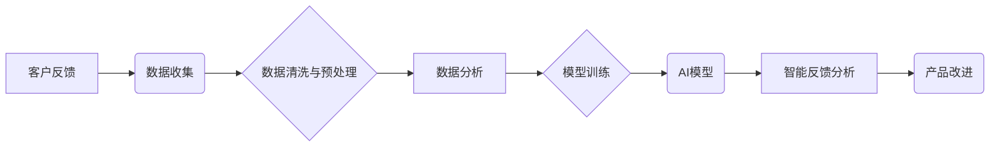

> AI创业, 客户反馈, 数据分析, 机器学习, 自然语言处理, 算法模型, 产品迭代

## 1. 背景介绍

在当今数据爆炸的时代，人工智能（AI）技术正在迅速发展，并开始渗透到各个行业，包括创业领域。AI创业公司利用AI技术开发创新产品和服务，以解决现实问题并创造新的价值。然而，成功的AI创业并非易事，其中获取客户反馈并将其转化为产品改进是一个至关重要的环节。

传统的客户反馈收集方式，例如问卷调查和用户论坛，往往存在效率低、反馈信息不全面、难以分析等问题。而AI技术可以帮助创业公司更有效地收集、分析和利用客户反馈，从而加速产品迭代和提升用户体验。

## 2. 核心概念与联系

### 2.1 客户反馈

客户反馈是指用户对产品或服务的评价、建议和意见。它可以是文字、语音、图像等多种形式，反映了用户对产品的使用体验、功能需求和潜在问题。

### 2.2 AI技术

人工智能（AI）是指模拟人类智能行为的计算机系统。AI技术涵盖了机器学习、深度学习、自然语言处理等多个领域，可以帮助企业自动分析数据、识别模式、做出决策。

### 2.3 数据分析

数据分析是指从数据中提取有价值信息的过程。通过对客户反馈数据进行分析，可以了解用户需求、痛点和满意度，为产品改进提供依据。

**核心概念与联系流程图**



## 3. 核心算法原理 & 具体操作步骤

### 3.1 算法原理概述

获取客户反馈并进行分析，可以使用多种AI算法，例如：

* **自然语言处理（NLP）:** 用于分析文本数据，例如用户评论、反馈意见等，识别情感倾向、主题关键词等。
* **机器学习（ML）:** 用于从数据中学习模式，例如预测用户行为、识别潜在问题等。
* **深度学习（DL）:** 用于处理复杂数据，例如图像、语音等，识别更细粒度的特征。

### 3.2 算法步骤详解

1. **数据收集:** 收集来自不同渠道的客户反馈数据，例如用户评论、问卷调查、论坛讨论等。
2. **数据清洗与预处理:** 清理数据中的噪声、错误信息，并进行格式转换、文本处理等预处理操作，以确保数据质量。
3. **特征提取:** 从客户反馈数据中提取有价值的特征，例如情感倾向、主题关键词、用户画像等。
4. **模型训练:** 使用机器学习算法对提取的特征进行训练，构建预测模型，例如预测用户满意度、识别潜在问题等。
5. **模型评估:** 使用测试数据评估模型的性能，并进行调优，以提高模型准确性。
6. **智能反馈分析:** 将模型应用于实时数据分析，识别用户反馈中的关键信息，并提供可行动的建议。

### 3.3 算法优缺点

**优点:**

* 自动化收集和分析客户反馈，提高效率。
* 识别潜在问题和用户需求，促进产品改进。
* 提供数据驱动的决策支持，降低风险。

**缺点:**

* 需要大量高质量的数据进行训练。
* 模型的准确性取决于数据质量和算法选择。
* 需要专业的技术人员进行开发和维护。

### 3.4 算法应用领域

* **产品开发:** 了解用户需求，优化产品功能和体验。
* **市场营销:** 分析用户反馈，改进营销策略和广告投放。
* **客户服务:** 自动化处理客户问题，提高服务效率。
* **风险管理:** 识别潜在风险，及时采取措施。

## 4. 数学模型和公式 & 详细讲解 & 举例说明

### 4.1 数学模型构建

**情感分析模型:**

假设客户反馈数据包含文本信息，可以使用情感分析模型来识别文本的情感倾向。

一个简单的模型可以基于词袋模型（Bag-of-Words）和情感词典，计算文本中正面词和负面词的权重，从而判断文本的情感倾向。

**公式:**

$$
Sentiment Score = \sum_{i=1}^{n} w_i * Sentiment(word_i)
$$

其中：

* $Sentiment Score$：文本的情感得分
* $n$：文本中词语的数量
* $w_i$：词语 $word_i$ 的权重
* $Sentiment(word_i)$：词语 $word_i$ 的情感倾向值（正值、负值或中性）

### 4.2 公式推导过程

词袋模型假设文本中词语的顺序无关紧要，只关注词语的出现频率。

情感词典是一个包含词语及其情感倾向值的字典。

权重可以根据词语的频率或重要性进行计算。

### 4.3 案例分析与讲解

假设一个客户评论为：“这个产品很棒，功能强大！”

可以使用情感词典和词袋模型计算情感得分：

* “很棒”：情感倾向值为正值
* “功能强大”：情感倾向值为正值

根据词语的权重和情感倾向值，计算出该评论的情感得分是正值，表明用户对该产品的满意度较高。

## 5. 项目实践：代码实例和详细解释说明

### 5.1 开发环境搭建

* Python 3.x
* TensorFlow 或 PyTorch
* NLTK 或 spaCy

### 5.2 源代码详细实现

```python
import nltk
from nltk.sentiment import SentimentIntensityAnalyzer

# 下载情感分析模型
nltk.download('vader_lexicon')

# 初始化情感分析器
analyzer = SentimentIntensityAnalyzer()

# 客户反馈文本
text = "这个产品很棒，功能强大！"

# 计算情感得分
scores = analyzer.polarity_scores(text)

# 打印情感得分
print(scores)
```

### 5.3 代码解读与分析

* 该代码使用NLTK库中的SentimentIntensityAnalyzer类进行情感分析。
* 下载了VADER情感词典，用于识别文本中的情感倾向。
* 使用analyzer.polarity_scores()方法计算文本的情感得分，包括正面、负面、中性以及总分。

### 5.4 运行结果展示

```
{'neg': 0.0, 'neu': 0.293, 'pos': 0.707, 'compound': 0.8937}
```

结果表明，该文本的情感倾向为正值，用户对该产品的满意度较高。

## 6. 实际应用场景

### 6.1 产品迭代

* 分析用户评论，识别产品功能需求和痛点。
* 预测用户对新功能的接受度，优化产品设计。
* 跟踪产品更新后的用户反馈，评估改进效果。

### 6.2 市场营销

* 分析用户对广告和营销活动的反馈，优化营销策略。
* 识别潜在客户群体，进行精准营销。
* 预测用户购买行为，提高销售转化率。

### 6.3 客户服务

* 自动化处理常见客户问题，提高服务效率。
* 识别客户情绪，提供个性化服务。
* 预测客户流失风险，采取措施挽留客户。

### 6.4 未来应用展望

* 更智能的客户服务机器人，能够理解更复杂的客户需求。
* 更精准的个性化推荐系统，根据用户反馈提供更符合用户需求的产品和服务。
* 更有效的风险管理系统，能够识别和预测潜在风险，及时采取措施。

## 7. 工具和资源推荐

### 7.1 学习资源推荐

* **书籍:**
    * 《深度学习》
    * 《自然语言处理》
    * 《机器学习实战》
* **在线课程:**
    * Coursera
    * edX
    * Udacity

### 7.2 开发工具推荐

* **Python:** 
    * TensorFlow
    * PyTorch
    * scikit-learn
* **自然语言处理库:**
    * NLTK
    * spaCy
* **数据可视化工具:**
    * Matplotlib
    * Seaborn

### 7.3 相关论文推荐

* **情感分析:**
    * Sentiment Analysis Using Deep Learning
    * A Survey of Sentiment Analysis Techniques
* **机器学习:**
    * Machine Learning: A Probabilistic Perspective
    * The Elements of Statistical Learning

## 8. 总结：未来发展趋势与挑战

### 8.1 研究成果总结

AI技术在获取和分析客户反馈方面取得了显著进展，为AI创业公司提供了强大的工具和手段。

### 8.2 未来发展趋势

* **更智能的AI模型:** 能够理解更复杂的客户需求和情感。
* **更个性化的客户体验:** 根据用户反馈提供更精准的推荐和服务。
* **更有效的风险管理:** 能够识别和预测潜在风险，及时采取措施。

### 8.3 面临的挑战

* **数据质量:** AI模型的准确性取决于数据质量，需要不断收集和清洗高质量的数据。
* **算法选择:** 不同的算法适用于不同的场景，需要根据实际需求选择合适的算法。
* **伦理问题:** AI技术在收集和分析客户反馈时，需要考虑伦理问题，例如隐私保护和数据安全。

### 8.4 研究展望

未来，AI技术将继续推动客户反馈分析的发展，为AI创业公司提供更智能、更有效的解决方案。

## 9. 附录：常见问题与解答

**Q1: 如何收集高质量的客户反馈数据？**

**A1:** 可以通过多种渠道收集客户反馈数据，例如用户评论、问卷调查、论坛讨论、社交媒体等。

**Q2: 如何处理客户反馈数据中的噪声和错误信息？**

**A2:** 可以使用数据清洗和预处理技术，例如文本清洗、数据去重、异常值处理等，来提高数据质量。

**Q3: 如何选择合适的AI算法进行客户反馈分析？**

**A3:** 需要根据实际需求和数据特点选择合适的算法，例如情感分析、主题建模、用户画像等。

**Q4: 如何确保AI技术在收集和分析客户反馈时，保护用户隐私和数据安全？**

**A4:** 需要遵循相关法律法规和行业标准，采取技术措施和管理制度，确保数据安全和隐私保护。


作者：禅与计算机程序设计艺术 / Zen and the Art of Computer Programming 
<end_of_turn>