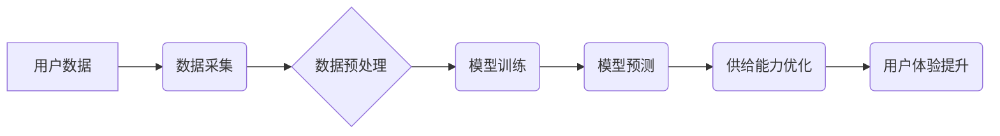

> AI,电商平台,供给能力,推荐系统,预测模型,个性化,效率提升,机器学习

## 1. 背景介绍

电子商务平台作为现代商业的重要组成部分，其发展离不开高效的供给能力。供给能力的提升直接关系到平台的商品丰富度、用户体验和最终的商业成功。传统电商平台依靠人工干预和规则设定来管理商品供给，存在效率低下、难以满足个性化需求等问题。随着人工智能技术的快速发展，AI技术为电商平台供给能力的提升提供了新的机遇和可能性。

## 2. 核心概念与联系

**2.1  电商平台供给能力**

电商平台供给能力是指平台能够提供商品的丰富度、及时性和多样性。它包括以下几个方面：

* **商品丰富度:** 平台上商品种类繁多，能够满足用户多样化的需求。
* **商品及时性:** 平台能够快速响应用户需求，及时提供所需商品。
* **商品多样性:** 平台提供不同品牌、不同价格、不同规格的商品，满足用户个性化需求。

**2.2  人工智能 (AI)**

人工智能 (AI) 是一种模拟人类智能的计算机科学领域。它涵盖了机器学习、深度学习、自然语言处理、计算机视觉等多个分支。AI技术能够帮助电商平台分析海量数据，识别模式，做出智能决策，从而提升供给能力。

**2.3  AI在电商平台供给能力提升中的作用**

AI技术可以应用于电商平台的各个环节，例如商品推荐、库存管理、价格优化、物流配送等，从而提升平台的供给能力。

**2.4  AI技术架构**



## 3. 核心算法原理 & 具体操作步骤

**3.1  算法原理概述**

在电商平台供给能力提升中，常用的AI算法包括：

* **协同过滤算法:** 基于用户历史行为和商品相似度进行推荐。
* **内容过滤算法:** 基于商品属性和用户偏好进行推荐。
* **深度学习算法:** 利用神经网络模型学习用户行为和商品特征，进行更精准的推荐。
* **预测模型算法:** 利用历史数据预测未来需求，优化库存管理和商品供应。

**3.2  算法步骤详解**

以协同过滤算法为例，其具体步骤如下：

1. **数据收集:** 收集用户购买历史、浏览记录、评分等数据。
2. **数据预处理:** 清洗数据，处理缺失值，将数据转化为适合算法处理的格式。
3. **相似度计算:** 计算用户之间的相似度和商品之间的相似度。
4. **推荐生成:** 根据用户和商品的相似度，推荐用户可能感兴趣的商品。

**3.3  算法优缺点**

**协同过滤算法:**

* **优点:** 可以发现用户之间的隐性关系，推荐个性化商品。
* **缺点:** 数据稀疏性问题，新用户和新商品推荐效果较差。

**3.4  算法应用领域**

协同过滤算法广泛应用于电商平台的商品推荐系统、电影推荐系统、音乐推荐系统等。

## 4. 数学模型和公式 & 详细讲解 & 举例说明

**4.1  数学模型构建**

协同过滤算法的核心是计算用户和商品之间的相似度。常用的相似度度量方法包括余弦相似度和皮尔逊相关系数。

**4.2  公式推导过程**

* **余弦相似度:**

$$
\text{相似度} = \frac{\mathbf{u} \cdot \mathbf{v}}{\|\mathbf{u}\| \|\mathbf{v}\|}
$$

其中，$\mathbf{u}$ 和 $\mathbf{v}$ 分别表示用户和商品的特征向量，$\cdot$ 表示点积，$\|\mathbf{u}\|$ 和 $\|\mathbf{v}\|$ 分别表示特征向量的模长。

* **皮尔逊相关系数:**

$$
\text{相似度} = \frac{\sum_{i=1}^{n}(u_i - \bar{u})(v_i - \bar{v})}{\sqrt{\sum_{i=1}^{n}(u_i - \bar{u})^2} \sqrt{\sum_{i=1}^{n}(v_i - \bar{v})^2}}
$$

其中，$u_i$ 和 $v_i$ 分别表示用户和商品的第 $i$ 个特征值，$\bar{u}$ 和 $\bar{v}$ 分别表示用户和商品的平均特征值。

**4.3  案例分析与讲解**

假设有两个用户 A 和 B，他们对以下三款商品的评分如下：

| 商品 | 用户 A | 用户 B |
|---|---|---|
| 商品 1 | 5 | 4 |
| 商品 2 | 3 | 2 |
| 商品 3 | 4 | 5 |

我们可以使用皮尔逊相关系数计算用户 A 和用户 B 的相似度。

## 5. 项目实践：代码实例和详细解释说明

**5.1  开发环境搭建**

* Python 3.x
* TensorFlow 或 PyTorch
* Jupyter Notebook

**5.2  源代码详细实现**

```python
import pandas as pd
from sklearn.metrics.pairwise import cosine_similarity

# 加载用户评分数据
ratings_data = pd.read_csv('ratings.csv')

# 计算用户之间的余弦相似度
user_similarity = cosine_similarity(ratings_data.T)

# 获取用户 A 和用户 B 的相似度
user_a_similarity = user_similarity[0]
user_b_similarity = user_similarity[1]

# 打印相似度
print(f'用户 A 和用户 B 的相似度: {user_a_similarity[1]}')
```

**5.3  代码解读与分析**

* 首先，我们加载用户评分数据。
* 然后，我们使用 `cosine_similarity` 函数计算用户之间的余弦相似度。
* 最后，我们获取用户 A 和用户 B 的相似度，并打印出来。

**5.4  运行结果展示**

运行代码后，会输出用户 A 和用户 B 的相似度值。

## 6. 实际应用场景

**6.1  商品推荐系统**

AI技术可以帮助电商平台构建个性化的商品推荐系统，根据用户的历史行为和偏好推荐相关商品，提升用户体验和转化率。

**6.2  库存管理**

AI预测模型可以根据历史数据预测未来商品需求，帮助电商平台优化库存管理，避免库存积压或缺货。

**6.3  价格优化**

AI算法可以分析市场价格趋势和用户购买行为，帮助电商平台制定动态价格策略，提高利润率。

**6.4  未来应用展望**

随着人工智能技术的不断发展，AI将在电商平台供给能力提升方面发挥更重要的作用。例如，AI可以帮助电商平台实现个性化商品定制、智能物流配送、虚拟试衣等功能，进一步提升用户体验和商业价值。

## 7. 工具和资源推荐

**7.1  学习资源推荐**

* **书籍:**
    * 《深度学习》
    * 《机器学习实战》
* **在线课程:**
    * Coursera
    * edX
    * Udemy

**7.2  开发工具推荐**

* **Python:** 
    * TensorFlow
    * PyTorch
    * scikit-learn
* **云平台:**
    * AWS
    * Azure
    * Google Cloud

**7.3  相关论文推荐**

* **协同过滤算法:**
    * "Collaborative Filtering: A User-Based Approach"
    * "Memory-Based Collaborative Filtering"
* **深度学习算法:**
    * "Deep Learning"
    * "Recurrent Neural Networks for Sequence Learning"

## 8. 总结：未来发展趋势与挑战

**8.1  研究成果总结**

AI技术在电商平台供给能力提升方面取得了显著成果，例如商品推荐系统、库存管理、价格优化等领域取得了突破性进展。

**8.2  未来发展趋势**

未来，AI技术在电商平台供给能力提升方面将继续发展，主要趋势包括：

* **更精准的个性化推荐:** 利用更先进的深度学习算法，实现更精准的个性化商品推荐。
* **更智能的库存管理:** 利用预测模型和机器学习算法，实现更智能的库存管理，优化库存水平和降低成本。
* **更动态的价格优化:** 利用市场数据和用户行为分析，实现更动态的价格优化，提高利润率。

**8.3  面临的挑战**

AI技术在电商平台供给能力提升方面也面临一些挑战，例如：

* **数据安全和隐私保护:** AI算法需要大量数据进行训练，如何保证数据安全和用户隐私保护是一个重要问题。
* **算法解释性和可信度:** 许多AI算法是黑箱模型，难以解释其决策过程，这可能会影响用户的信任度。
* **算法公平性和可控性:** AI算法可能会存在偏见和歧视，需要确保算法公平性和可控性。

**8.4  研究展望**

未来，需要进一步研究如何解决AI技术在电商平台供给能力提升方面的挑战，例如：

* 开发更安全、更隐私的AI算法。
* 提高AI算法的解释性和可信度。
* 确保AI算法的公平性和可控性。


## 9. 附录：常见问题与解答

**9.1  Q: AI技术是否会取代人工？**

**A:** AI技术可以帮助人类提高效率和解决复杂问题，但它不会完全取代人工。AI和人工将共同协作，实现更智能、更高效的商业模式。

**9.2  Q: 如何选择合适的AI算法？**

**A:** 选择合适的AI算法需要根据具体业务需求和数据特点进行分析。例如，对于商品推荐系统，协同过滤算法和深度学习算法都是常用的选择。

**9.3  Q: 如何保证AI算法的公平性和可控性？**

**A:** 

* 在数据收集和算法设计阶段，需要考虑公平性和可控性问题。
* 需要定期评估算法的偏见和歧视，并采取措施进行修正。
* 需要建立相应的监管机制，确保AI算法的合法合规使用。


作者：禅与计算机程序设计艺术 / Zen and the Art of Computer Programming 
<end_of_turn>