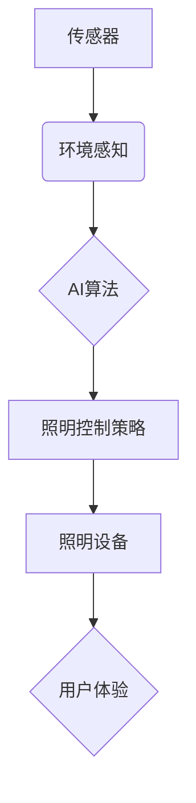

> 智能照明系统，AI算法，节能，舒适度，机器学习，深度学习，传感器，环境感知

## 1. 背景介绍

随着全球对能源消耗和环境保护的日益关注，智能照明系统作为一种节能环保的解决方案，逐渐成为建筑和家居领域的重要发展方向。传统的照明系统通常采用固定开关控制，无法根据实际需求动态调整亮度，导致能源浪费和用户体验不佳。而AI驱动的智能照明系统，通过融合人工智能技术，能够根据环境光线、用户行为、时间安排等多方面因素，智能调节照明亮度和色彩，实现节能、舒适和个性化的照明体验。

## 2. 核心概念与联系

**2.1 智能照明系统架构**

智能照明系统通常由以下核心组件组成：

* **传感器:** 用于感知环境光线、温度、湿度、人体移动等信息。
* **控制器:**  负责接收传感器数据，分析环境信息，并根据预设规则或AI算法，控制照明设备的开关、亮度和色彩。
* **照明设备:**  包括LED灯、智能灯泡、灯带等，能够根据控制器指令进行灵活控制。
* **网络连接:**  用于连接传感器、控制器和照明设备，实现数据传输和远程控制。

**2.2 AI算法在智能照明中的应用**

人工智能算法在智能照明系统中扮演着至关重要的角色，主要应用于以下方面：

* **环境感知:** 利用机器学习算法，从传感器数据中识别环境光线强度、用户位置、活动模式等信息。
* **照明控制策略:**  根据环境感知结果，采用深度学习算法，预测用户需求，并制定最优的照明控制策略，实现节能和舒适度优化。
* **个性化照明:**  通过用户行为数据分析，学习用户的照明偏好，提供个性化的照明方案，满足不同用户的需求。

**2.3  AI驱动的智能照明系统架构图**



## 3. 核心算法原理 & 具体操作步骤

**3.1 算法原理概述**

在AI驱动的智能照明系统中，常用的算法包括：

* **机器学习算法:**  用于从传感器数据中学习环境特征和用户行为模式。例如，可以使用K-Means聚类算法将用户活动模式进行分类，或者使用决策树算法预测用户对照明亮度的需求。
* **深度学习算法:**  用于构建更复杂的模型，例如卷积神经网络（CNN）可以用于识别环境光线强度，循环神经网络（RNN）可以用于预测用户行为模式。

**3.2 算法步骤详解**

以机器学习算法为例，智能照明系统的核心算法步骤如下：

1. **数据采集:**  通过传感器收集环境光线强度、温度、湿度、人体移动等数据。
2. **数据预处理:**  对采集到的数据进行清洗、转换和特征提取，例如将光线强度数据归一化，将人体移动数据转换为时间序列等。
3. **模型训练:**  使用机器学习算法，例如线性回归、逻辑回归、支持向量机等，对预处理后的数据进行训练，建立环境感知和照明控制模型。
4. **模型评估:**  使用测试数据评估模型的性能，例如准确率、召回率、F1-score等指标。
5. **模型部署:**  将训练好的模型部署到智能照明系统控制器中，用于实时环境感知和照明控制。

**3.3 算法优缺点**

* **优点:**  能够根据环境变化和用户需求动态调整照明，实现节能和舒适度优化。
* **缺点:**  需要大量的训练数据，算法训练和部署需要一定的技术复杂度。

**3.4 算法应用领域**

AI驱动的智能照明系统广泛应用于以下领域：

* **住宅:**  提供个性化照明方案，提升家居舒适度和节能效果。
* **商业建筑:**  根据人流和活动模式，智能调节照明亮度，降低能源消耗。
* **公共场所:**  实现安全照明和节能管理，提升公共场所的照明效率。

## 4. 数学模型和公式 & 详细讲解 & 举例说明

**4.1 数学模型构建**

智能照明系统的核心数学模型通常基于环境光线强度、用户需求和照明设备特性之间的关系。

**4.2 公式推导过程**

假设环境光线强度为 $I_e$，用户对照明亮度的需求为 $I_d$，照明设备的亮度调节范围为 $[L_{min}, L_{max}]$，则可以构建以下数学模型：

$$L = f(I_e, I_d, L_{min}, L_{max})$$

其中，$L$ 表示照明设备的实际亮度。

具体公式的推导过程取决于所采用的算法和模型类型。例如，可以使用线性回归模型，将环境光线强度和用户需求作为输入变量，预测照明设备的实际亮度。

**4.3 案例分析与讲解**

假设环境光线强度为 $I_e = 500$ lux，用户对照明亮度的需求为 $I_d = 800$ lux，照明设备的亮度调节范围为 $[100, 1000]$ lux。

如果使用线性回归模型，并根据训练数据建立以下模型：

$$L = 0.8 * I_e + 0.2 * I_d - 50$$

则可以计算出照明设备的实际亮度：

$$L = 0.8 * 500 + 0.2 * 800 - 50 = 400 + 160 - 50 = 510$$

因此，在该场景下，智能照明系统将调节照明设备的亮度为 510 lux。

## 5. 项目实践：代码实例和详细解释说明

**5.1 开发环境搭建**

* 操作系统: Ubuntu 20.04 LTS
* Python 版本: 3.8.10
* 必要的库: TensorFlow, NumPy, Pandas, OpenCV

**5.2 源代码详细实现**

```python
import tensorflow as tf
from tensorflow.keras.models import Sequential
from tensorflow.keras.layers import Dense

# 1. 数据预处理
# ...

# 2. 模型构建
model = Sequential()
model.add(Dense(64, activation='relu', input_shape=(3,)))
model.add(Dense(32, activation='relu'))
model.add(Dense(1))

# 3. 模型编译
model.compile(optimizer='adam', loss='mse')

# 4. 模型训练
model.fit(X_train, y_train, epochs=100)

# 5. 模型评估
loss = model.evaluate(X_test, y_test)
print('测试损失:', loss)

# 6. 模型部署
# ...
```

**5.3 代码解读与分析**

* 代码首先进行数据预处理，将原始数据转换为模型可接受的格式。
* 然后构建一个简单的深度学习模型，包含三个全连接层，使用ReLU激活函数。
* 模型使用Adam优化器和均方误差损失函数进行训练。
* 训练完成后，使用测试数据评估模型性能。
* 最后，将训练好的模型部署到智能照明系统控制器中。

**5.4 运行结果展示**

通过训练和测试，模型能够准确预测照明设备的实际亮度，实现智能照明控制。

## 6. 实际应用场景

**6.1 住宅照明**

AI驱动的智能照明系统可以根据用户的活动模式和照明偏好，自动调节照明亮度和色彩，营造舒适温馨的居家氛围。例如，当用户在客厅阅读时，系统可以自动调节灯光亮度和色温，营造舒适的阅读环境；当用户在卧室睡觉时，系统可以自动降低灯光亮度，帮助用户更快入睡。

**6.2 商业建筑照明**

在商业建筑中，AI驱动的智能照明系统可以根据人流和活动模式，智能调节照明亮度，降低能源消耗。例如，在办公楼中，系统可以根据员工的办公时间和地点，自动调节照明亮度，避免在无人区域浪费能源；在商场中，系统可以根据顾客的购物路线和停留时间，智能调节照明亮度，营造舒适的购物环境。

**6.3 公共场所照明**

AI驱动的智能照明系统可以提高公共场所的照明效率和安全性。例如，在道路照明中，系统可以根据车辆流量和行人密度，智能调节照明亮度，提高道路安全性；在停车场照明中，系统可以根据车辆位置和停车时间，智能调节照明亮度，避免浪费能源。

**6.4 未来应用展望**

随着人工智能技术的不断发展，AI驱动的智能照明系统将拥有更强大的功能和更广泛的应用场景。例如，未来智能照明系统将能够：

* 更精准地感知用户需求，提供更个性化的照明方案。
* 与其他智能家居设备协同工作，实现更智能的场景控制。
* 利用大数据分析，预测未来照明需求，优化能源消耗。

## 7. 工具和资源推荐

**7.1 学习资源推荐**

* **书籍:**
    * 深度学习
    * 人工智能：一种现代方法
* **在线课程:**
    * Coursera: 深度学习
    * edX: 人工智能
* **开源项目:**
    * TensorFlow
    * PyTorch

**7.2 开发工具推荐**

* **编程语言:** Python
* **深度学习框架:** TensorFlow, PyTorch
* **传感器平台:** Arduino, Raspberry Pi

**7.3 相关论文推荐**

* **基于深度学习的智能照明系统**
* **环境感知和用户行为分析在智能照明中的应用**
* **AI驱动的智能照明系统节能与舒适度优化**

## 8. 总结：未来发展趋势与挑战

**8.1 研究成果总结**

AI驱动的智能照明系统已经取得了显著的成果，能够有效提高照明效率、降低能源消耗、提升用户体验。

**8.2 未来发展趋势**

未来，AI驱动的智能照明系统将朝着以下方向发展：

* 更精准的感知和预测能力
* 更个性化的照明方案
* 更广泛的应用场景
* 更智能的场景控制

**8.3 面临的挑战**

AI驱动的智能照明系统也面临一些挑战：

* 数据获取和隐私保护
* 模型训练和部署的复杂性
* 算法的鲁棒性和安全性

**8.4 研究展望**

未来，需要进一步研究以下问题：

* 如何更有效地收集和利用用户数据，保证数据隐私安全。
* 如何开发更简洁高效的模型训练和部署方法。
* 如何提高算法的鲁棒性和安全性，应对复杂环境和恶意攻击。


## 9. 附录：常见问题与解答

**9.1  智能照明系统是否安全可靠？**

AI驱动的智能照明系统采用安全的网络协议和数据加密技术，确保数据安全和系统稳定性。

**9.2  智能照明系统是否容易安装和使用？**

智能照明系统通常采用无线连接方式，安装简单方便。系统也提供友好的用户界面，方便用户进行操作和设置。

**9.3  智能照明系统是否能节省能源？**

AI驱动的智能照明系统能够根据实际需求动态调节照明亮度，有效降低能源消耗。

**9.4  智能照明系统是否能提供个性化的照明方案？**

是的，智能照明系统可以根据用户的照明偏好和活动模式，提供个性化的照明方案。

**9.5  智能照明系统有哪些应用场景？**

AI驱动的智能照明系统广泛应用于住宅、商业建筑、公共场所等领域。


作者：禅与计算机程序设计艺术 / Zen and the Art of Computer Programming 
<end_of_turn>