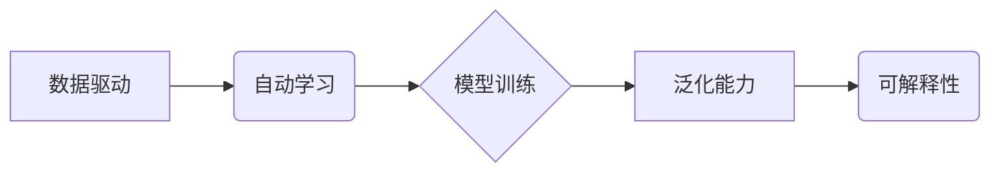

>  人工智能，编程范式，深度学习，模型训练，数据驱动，自动化，可解释性

## 1. 背景介绍

人工智能（AI）的蓬勃发展，正在深刻地改变着我们生活的方方面面。从自动驾驶汽车到智能语音助手，AI技术已经渗透到我们的日常生活。而推动AI发展的核心力量，便是强大的机器学习算法和海量数据。

传统的编程范式，往往是基于明确的指令和逻辑规则，程序员需要事先定义算法步骤，并根据输入数据进行计算和处理。然而，随着AI技术的进步，传统的编程范式逐渐显得力不从心。

深度学习的出现，为AI编程带来了新的范式。深度学习模型，通过多层神经网络结构，能够自动从海量数据中学习特征和规律，从而实现对复杂问题的解决。这种数据驱动、自动学习的编程范式，为AI的发展带来了前所未有的机遇。

## 2. 核心概念与联系

**2.1 数据驱动**

深度学习的核心概念之一是数据驱动。深度学习模型的训练过程，依赖于海量数据的输入。通过对大量数据的学习，模型能够自动提取特征，并建立起数据与目标之间的映射关系。

**2.2 自动学习**

深度学习模型能够自动学习特征和规律，无需人工预先定义算法步骤。模型通过调整神经网络参数，不断优化自身的预测能力。

**2.3 模型训练**

深度学习模型的训练过程，是一个迭代优化过程。模型通过对训练数据的学习，不断调整自身参数，以降低预测误差。

**2.4 泛化能力**

深度学习模型的目标，是能够将从训练数据中学习到的知识，应用到新的、未见过的数据上。

**2.5 可解释性**

深度学习模型的决策过程，往往是复杂的，难以理解。提高深度学习模型的可解释性，是当前研究的一个重要方向。

**2.6 核心概念关系图**



## 3. 核心算法原理 & 具体操作步骤

### 3.1 算法原理概述

深度学习的核心算法，是多层感知机（MLP）和卷积神经网络（CNN）。

* **多层感知机（MLP）**：MLP由多个全连接层组成，每一层的神经元都与上一层的每个神经元连接。MLP能够学习复杂的非线性关系，广泛应用于图像分类、文本处理等领域。

* **卷积神经网络（CNN）**：CNN利用卷积操作和池化操作，能够有效地提取图像特征。CNN在图像识别、目标检测等领域取得了优异的性能。

### 3.2 算法步骤详解

**3.2.1 数据预处理**

深度学习模型的训练，需要对数据进行预处理，例如数据清洗、数据归一化等。

**3.2.2 模型构建**

根据具体的应用场景，选择合适的深度学习模型架构，并定义模型参数。

**3.2.3 模型训练**

使用训练数据，训练深度学习模型，并通过优化算法调整模型参数，以降低预测误差。

**3.2.4 模型评估**

使用测试数据，评估模型的性能，例如准确率、召回率等。

**3.2.5 模型部署**

将训练好的模型部署到实际应用场景中，例如部署到云服务器、嵌入式设备等。

### 3.3 算法优缺点

**优点：**

* 自动学习特征，无需人工干预。
* 能够处理复杂、高维数据。
* 性能优异，在许多领域取得了突破性进展。

**缺点：**

* 训练数据量大，计算资源消耗高。
* 模型训练过程复杂，需要专业知识。
* 模型可解释性差，难以理解模型决策过程。

### 3.4 算法应用领域

深度学习算法广泛应用于以下领域：

* **计算机视觉**：图像识别、目标检测、图像分割、人脸识别等。
* **自然语言处理**：文本分类、机器翻译、文本摘要、对话系统等。
* **语音识别**：语音转文本、语音合成等。
* **推荐系统**：商品推荐、内容推荐等。
* **医疗诊断**：疾病诊断、影像分析等。

## 4. 数学模型和公式 & 详细讲解 & 举例说明

### 4.1 数学模型构建

深度学习模型的数学模型，主要基于神经网络结构和激活函数。

* **神经网络结构**：神经网络由多个层组成，每一层包含多个神经元。神经元之间通过连接权重进行信息传递。

* **激活函数**：激活函数用于引入非线性，使神经网络能够学习复杂的映射关系。常见的激活函数包括 sigmoid 函数、ReLU 函数、tanh 函数等。

### 4.2 公式推导过程

深度学习模型的训练过程，基于梯度下降算法。梯度下降算法的目标，是通过不断调整模型参数，降低模型预测误差。

**损失函数**：用于衡量模型预测结果与真实值的差距。常见的损失函数包括均方误差（MSE）、交叉熵损失（Cross-Entropy Loss）等。

**梯度**：表示损失函数对模型参数的偏导数。梯度方向指示损失函数下降的方向。

**学习率**：控制梯度下降算法的步长。

**更新公式**：用于更新模型参数。

$$
\theta = \theta - \eta \nabla L(\theta)
$$

其中：

* $\theta$：模型参数
* $\eta$：学习率
* $\nabla L(\theta)$：损失函数对模型参数的梯度

### 4.3 案例分析与讲解

**举例说明：**

假设我们训练一个线性回归模型，用于预测房价。

* **输入特征**：房屋面积
* **输出目标**：房价

**损失函数**：均方误差

**梯度下降算法**：

1. 初始化模型参数（权重和偏差）。
2. 计算模型预测结果。
3. 计算损失函数值。
4. 计算梯度。
5. 更新模型参数。
6. 重复步骤2-5，直到损失函数值收敛。

## 5. 项目实践：代码实例和详细解释说明

### 5.1 开发环境搭建

* **操作系统**：Linux、macOS、Windows
* **编程语言**：Python
* **深度学习框架**：TensorFlow、PyTorch、Keras

### 5.2 源代码详细实现

```python
import tensorflow as tf

# 定义模型
model = tf.keras.models.Sequential([
    tf.keras.layers.Dense(64, activation='relu', input_shape=(1,)),
    tf.keras.layers.Dense(1)
])

# 编译模型
model.compile(optimizer='adam', loss='mse')

# 训练模型
model.fit(x_train, y_train, epochs=100)

# 评估模型
loss = model.evaluate(x_test, y_test)
print('Loss:', loss)
```

### 5.3 代码解读与分析

* **模型定义**：使用 Keras 库定义一个简单的线性回归模型，包含两层全连接层。
* **模型编译**：使用 Adam 优化器和均方误差损失函数编译模型。
* **模型训练**：使用训练数据训练模型，训练 epochs 次。
* **模型评估**：使用测试数据评估模型性能，并打印损失值。

### 5.4 运行结果展示

训练完成后，模型能够预测新的房屋面积对应的房价。

## 6. 实际应用场景

深度学习技术在各个领域都有广泛的应用场景。

### 6.1 医疗诊断

深度学习模型能够辅助医生进行疾病诊断，例如识别肿瘤、分析医学影像等。

### 6.2 自动驾驶

深度学习模型能够帮助自动驾驶汽车感知周围环境，例如识别道路标线、交通信号灯等。

### 6.3 人工智能助手

深度学习模型能够构建智能语音助手，例如 Siri、Alexa 等，能够理解用户的语音指令并提供相应的服务。

### 6.4 未来应用展望

随着深度学习技术的不断发展，未来将有更多新的应用场景出现，例如：

* **个性化教育**：根据学生的学习情况，提供个性化的学习方案。
* **精准医疗**：根据患者的基因信息和病史，提供个性化的治疗方案。
* **智能制造**：利用深度学习模型，实现智能生产线，提高生产效率。

## 7. 工具和资源推荐

### 7.1 学习资源推荐

* **书籍**：
    * 深度学习
    * 构建深度学习模型
* **在线课程**：
    * Coursera 深度学习课程
    * Udacity 深度学习工程师 Nanodegree
* **博客和网站**：
    * TensorFlow 官方博客
    * PyTorch 官方博客
    * Andrej Karpathy 博客

### 7.2 开发工具推荐

* **深度学习框架**：TensorFlow、PyTorch、Keras
* **编程语言**：Python
* **数据处理工具**：Pandas、NumPy

### 7.3 相关论文推荐

* **ImageNet Classification with Deep Convolutional Neural Networks**
* **Deep Residual Learning for Image Recognition**
* **Attention Is All You Need**

## 8. 总结：未来发展趋势与挑战

### 8.1 研究成果总结

深度学习技术取得了显著的成果，在计算机视觉、自然语言处理等领域取得了突破性进展。

### 8.2 未来发展趋势

* **模型规模和复杂度提升**：未来深度学习模型将更加庞大，更加复杂。
* **模型可解释性增强**：研究人员将致力于提高深度学习模型的可解释性，使模型决策更加透明。
* **边缘计算和联邦学习**：深度学习模型将更加广泛地部署到边缘设备和分布式系统中。

### 8.3 面临的挑战

* **数据获取和隐私保护**：深度学习模型依赖于海量数据，如何获取高质量数据，并保护用户隐私是一个重要的挑战。
* **计算资源消耗**：训练大型深度学习模型需要大量的计算资源，如何降低计算成本是一个重要的研究方向。
* **模型安全性和鲁棒性**：深度学习模型容易受到攻击和对抗样本的影响，如何提高模型的安全性和鲁棒性是一个重要的挑战。

### 8.4 研究展望

未来，深度学习技术将继续发展，并应用于更多领域。研究人员将致力于解决深度学习面临的挑战，并探索新的应用场景。

## 9. 附录：常见问题与解答

**常见问题**：

* **什么是深度学习？**

深度学习是一种机器学习的子领域，它使用多层神经网络来学习数据特征。

* **深度学习有哪些应用场景？**

深度学习应用广泛，包括图像识别、自然语言处理、语音识别、推荐系统等。

* **如何学习深度学习？**

可以通过阅读书籍、参加在线课程、学习开源框架等方式学习深度学习。

**作者：禅与计算机程序设计艺术 / Zen and the Art of Computer Programming**<end_of_turn>