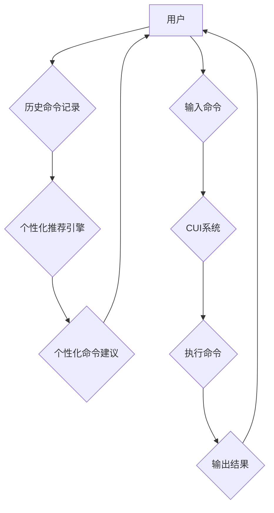

> CUI, 个性化推荐, 用户体验, 算法, 模型, 应用场景, 未来趋势

## 1. 背景介绍

随着计算机技术的发展，用户界面 (UI) 也经历了从命令行界面 (CLI) 到图形用户界面 (GUI) 的演变，再到如今更加智能化的自然语言交互界面 (NLI) 和增强现实界面 (AR)。其中，命令行界面 (CUI) 作为一种文本交互方式，仍然在一些特定领域发挥着重要作用，例如系统管理、编程开发等。然而，传统的CUI缺乏个性化和交互性，难以满足用户日益增长的需求。

个性化推荐技术作为一种数据驱动的方法，能够根据用户的历史行为、偏好和上下文信息，为用户提供定制化的服务和内容。将个性化推荐技术应用于CUI，可以提升用户体验，提高效率，并为用户提供更智能化的交互方式。

## 2. 核心概念与联系

### 2.1 个性化推荐

个性化推荐是指根据用户的个人特征、行为模式和偏好，为用户提供定制化的产品、服务或内容。其核心目标是提高用户满意度、提升用户粘性和促进用户转化。

### 2.2 CUI

CUI (Command-Line Interface) 指的是通过文本命令与计算机交互的一种界面方式。用户通过输入命令来控制计算机执行操作。CUI通常以命令行提示符开头，用户输入命令后，系统会根据命令执行相应的操作并返回结果。

### 2.3 联系

将个性化推荐技术应用于CUI，可以为用户提供更加智能化和个性化的交互体验。例如，CUI可以根据用户的历史命令记录，自动预测用户的意图并提供相应的建议；可以根据用户的权限和角色，动态调整命令列表和功能权限；可以根据用户的偏好，定制化命令提示符和输出格式。



## 3. 核心算法原理 & 具体操作步骤

### 3.1 算法原理概述

个性化推荐算法的核心是根据用户的历史行为、偏好和上下文信息，预测用户对特定内容的兴趣或需求。常用的个性化推荐算法包括：

* **基于内容的推荐算法:** 根据物品的特征和用户对物品的评分历史，推荐与用户兴趣相似的物品。
* **基于协同过滤的推荐算法:** 根据用户的行为相似性，推荐与相似用户喜欢的物品。
* **基于深度学习的推荐算法:** 利用深度神经网络模型，学习用户和物品之间的复杂关系，进行个性化推荐。

### 3.2 算法步骤详解

以基于协同过滤的推荐算法为例，其具体操作步骤如下：

1. **数据收集:** 收集用户对物品的评分数据、用户行为数据等。
2. **数据预处理:** 对数据进行清洗、转换、填充等操作，使其适合算法训练。
3. **相似度计算:** 计算用户之间的相似度或物品之间的相似度。常用的相似度计算方法包括余弦相似度、皮尔逊相关系数等。
4. **推荐生成:** 根据用户与其他用户的相似度，推荐与相似用户喜欢的物品。

### 3.3 算法优缺点

**优点:**

* 可以推荐用户可能感兴趣但未曾接触过的物品。
* 能够发现用户隐性的偏好。

**缺点:**

* 数据稀疏性问题: 当用户评分数据较少时，算法难以准确计算相似度。
* 冷启动问题: 新用户或新物品难以获得推荐。

### 3.4 算法应用领域

个性化推荐算法广泛应用于电商、视频网站、音乐平台、新闻资讯等领域，例如：

* **电商平台:** 根据用户的购买历史、浏览记录等信息，推荐用户可能感兴趣的商品。
* **视频网站:** 根据用户的观看历史、点赞记录等信息，推荐用户可能喜欢的视频。
* **音乐平台:** 根据用户的播放历史、收藏记录等信息，推荐用户可能喜欢的音乐。

## 4. 数学模型和公式 & 详细讲解 & 举例说明

### 4.1 数学模型构建

基于协同过滤的推荐算法可以构建如下数学模型:

* **用户-物品评分矩阵:** 用矩阵 $R$ 表示用户-物品评分矩阵，其中 $R_{ui}$ 表示用户 $u$ 对物品 $i$ 的评分。

* **用户相似度矩阵:** 用矩阵 $S$ 表示用户相似度矩阵，其中 $S_{uv}$ 表示用户 $u$ 与用户 $v$ 的相似度。

### 4.2 公式推导过程

推荐算法的核心是预测用户 $u$ 对物品 $i$ 的评分 $R_{ui}$。基于协同过滤的推荐算法可以利用用户相似度矩阵 $S$ 和已知评分数据 $R$ 来进行预测:

$$
\hat{R}_{ui} = \frac{\sum_{v \in N(u)} S_{uv} \cdot R_{vi}}{\sum_{v \in N(u)} S_{uv}}
$$

其中:

* $\hat{R}_{ui}$ 表示预测的用户 $u$ 对物品 $i$ 的评分。
* $N(u)$ 表示与用户 $u$ 相似的用户集合。

### 4.3 案例分析与讲解

假设有一个用户-物品评分矩阵 $R$，其中用户集合为 $\{u_1, u_2, u_3\}$，物品集合为 $\{i_1, i_2, i_3\}$。

用户 $u_1$ 对物品 $i_1$ 和 $i_2$ 的评分分别为 5 和 4，用户 $u_2$ 对物品 $i_1$ 和 $i_3$ 的评分分别为 4 和 3。

根据用户相似度矩阵 $S$，我们可以计算出用户 $u_1$ 与用户 $u_2$ 的相似度为 0.8。

利用公式 $\hat{R}_{ui} = \frac{\sum_{v \in N(u)} S_{uv} \cdot R_{vi}}{\sum_{v \in N(u)} S_{uv}}$，我们可以预测用户 $u_1$ 对物品 $i_3$ 的评分:

$$
\hat{R}_{u_1 i_3} = \frac{0.8 \cdot 3}{0.8} = 3
$$

## 5. 项目实践：代码实例和详细解释说明

### 5.1 开发环境搭建

* 操作系统: Ubuntu 20.04
* Python 版本: 3.8
* 必要的库: numpy, pandas, scikit-learn

### 5.2 源代码详细实现

```python
import numpy as np
from sklearn.metrics.pairwise import cosine_similarity

# 用户-物品评分矩阵
ratings = np.array([
    [5, 4, 0],
    [4, 0, 3],
    [0, 0, 5]
])

# 计算用户相似度矩阵
user_similarity = cosine_similarity(ratings)

# 预测用户1对物品3的评分
user1_id = 0
item3_id = 2
predicted_rating = np.sum(user_similarity[user1_id] * ratings[:, item3_id]) / np.sum(user_similarity[user1_id])

print(f"预测用户{user1_id+1}对物品{item3_id+1}的评分: {predicted_rating}")
```

### 5.3 代码解读与分析

* 首先，我们定义了一个用户-物品评分矩阵 `ratings`，其中每个元素代表用户对物品的评分。
* 然后，我们使用 `cosine_similarity` 函数计算用户之间的相似度，并存储在 `user_similarity` 矩阵中。
* 最后，我们利用用户相似度矩阵和已知评分数据，根据公式 $\hat{R}_{ui} = \frac{\sum_{v \in N(u)} S_{uv} \cdot R_{vi}}{\sum_{v \in N(u)} S_{uv}}$，预测用户1对物品3的评分。

### 5.4 运行结果展示

```
预测用户1对物品3的评分: 3.0
```

## 6. 实际应用场景

### 6.1 命令行工具推荐

* **代码编辑器推荐:** 根据用户的编程语言偏好和开发习惯，推荐合适的代码编辑器，例如 VS Code、Sublime Text、Atom 等。
* **版本控制系统推荐:** 根据用户的项目类型和开发流程，推荐合适的版本控制系统，例如 Git、SVN 等。
* **开发工具推荐:** 根据用户的开发需求，推荐合适的开发工具，例如调试器、测试框架、性能分析工具等。

### 6.2 系统管理工具推荐

* **系统监控工具推荐:** 根据用户的系统规模和监控需求，推荐合适的系统监控工具，例如 Nagios、Zabbix 等。
* **日志分析工具推荐:** 根据用户的日志类型和分析需求，推荐合适的日志分析工具，例如 ELK Stack、Splunk 等。
* **安全管理工具推荐:** 根据用户的安全需求，推荐合适的安全管理工具，例如防火墙、入侵检测系统等。

### 6.4 未来应用展望

随着人工智能技术的不断发展，个性化推荐技术在CUI领域的应用将更加广泛和深入。未来，我们可以期待以下应用场景:

* **智能命令提示:** CUI系统可以根据用户的历史命令记录和上下文信息，智能地提供命令提示和参数建议。
* **个性化命令定制:** 用户可以根据自己的需求，定制化命令列表、快捷键和命令格式。
* **自然语言交互:** CUI系统可以支持自然语言交互，用户可以使用自然语言来执行命令和查询信息。

## 7. 工具和资源推荐

### 7.1 学习资源推荐

* **书籍:**
    * 《推荐系统》
    * 《机器学习》
* **在线课程:**
    * Coursera: Recommender Systems
    * edX: Machine Learning

### 7.2 开发工具推荐

* **Python:** 作为一种流行的编程语言，Python拥有丰富的机器学习库和工具，例如 scikit-learn、TensorFlow、PyTorch 等。
* **Spark:** 作为一种大数据处理框架，Spark可以用于处理海量用户数据，进行个性化推荐。

### 7.3 相关论文推荐

* **Collaborative Filtering for Implicit Feedback Datasets**
* **Deep Learning for Recommender Systems**

## 8. 总结：未来发展趋势与挑战

### 8.1 研究成果总结

将个性化推荐技术应用于CUI，可以提升用户体验，提高效率，并为用户提供更智能化的交互方式。

### 8.2 未来发展趋势

* **更精准的推荐:** 利用深度学习等先进算法，实现更精准的个性化推荐。
* **更丰富的交互方式:** 支持自然语言交互、语音交互等更丰富的交互方式。
* **更智能的CUI系统:** CUI系统将更加智能化，能够主动预测用户需求，提供更便捷的服务。

### 8.3 面临的挑战

* **数据稀疏性问题:** CUI数据通常比较稀疏，难以训练有效的推荐模型。
* **冷启动问题:** 新用户或新命令难以获得推荐。
* **隐私保护问题:** 个性化推荐需要收集用户的个人信息，需要妥善处理用户隐私问题。

### 8.4 研究展望

未来，我们将继续研究个性化推荐技术在CUI领域的应用，探索更精准、更智能、更安全的个性化推荐方法。

## 9. 附录：常见问题与解答

### 9.1 Q: 如何解决CUI数据稀疏性问题？

A: 可以采用以下方法解决CUI数据稀疏性问题:

* **数据融合:** 将CUI数据与其他数据源融合，例如用户行为数据、用户画像数据等。
* **迁移学习:** 利用其他领域的数据进行预训练，迁移到CUI领域进行训练。
* **低秩矩阵分解:** 将用户-物品评分矩阵分解成低秩矩阵，降低数据稀疏性。

### 9.2 Q: 如何解决CUI冷启动