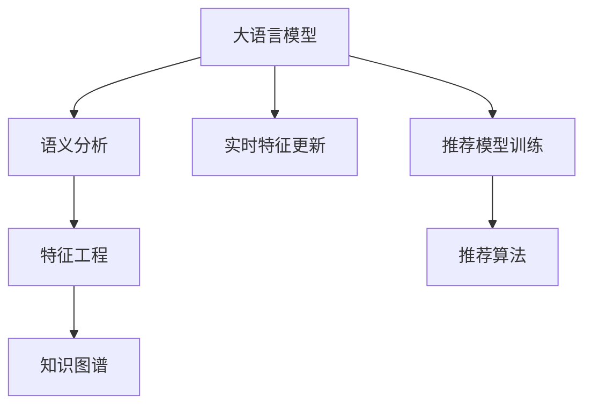

                 

# 利用大模型优化推荐系统的实时特征工程

在智能推荐系统中，推荐算法的效果很大程度上取决于输入特征的质量和数量。如何高效构建和实时更新这些特征，是推荐系统性能优化的重要问题。本文旨在介绍一种基于大语言模型的方法，用于优化推荐系统的实时特征工程。该方法将自然语言处理与机器学习相结合，能够自动化地从用户历史行为数据中挖掘出有意义的特征，实时地更新模型，从而提升推荐效果。

## 1. 背景介绍

### 1.1 问题由来

推荐系统是互联网时代的核心应用之一，广泛应用于电子商务、内容分发、广告定向等多个领域。其核心目标是根据用户的历史行为数据，预测用户对某一商品或内容的偏好，并给出个性化推荐。

推荐算法的核心在于其输入特征的质量和多样性。传统推荐系统主要依赖手工设计的特征工程，提取用户行为数据中潜在的语义和模式，但这种手工设计往往需要大量的时间与精力，且容易受到领域知识和经验限制，难以覆盖复杂的用户行为。而大语言模型通过自监督学习任务获取了丰富的语言知识，可以自动挖掘出用户行为的深层特征，极大提升推荐系统特征的智能性和全面性。

### 1.2 问题核心关键点

本文聚焦于如何利用大语言模型优化推荐系统的实时特征工程。核心在于：

- 自动挖掘用户行为的语义特征：通过大语言模型处理用户行为数据，提取其中潜在的语义信息。
- 实时更新推荐模型：根据用户最新行为数据，动态调整模型参数，提升模型预测准确度。
- 兼顾特征高效与模型可解释性：自动挖掘的特征需兼具高效性，同时具备一定的可解释性，便于调试和优化。

## 2. 核心概念与联系

### 2.1 核心概念概述

为更好地理解大语言模型优化推荐系统特征工程的思路，本节将介绍几个密切相关的核心概念：

- 大语言模型(Large Language Model, LLM)：以自回归(如GPT)或自编码(如BERT)模型为代表的大规模预训练语言模型。通过在海量无标签文本语料上进行预训练，学习通用的语言表示，具备强大的语言理解和生成能力。

- 推荐系统(Recommendation System)：利用用户历史行为数据，预测用户对新商品或内容的偏好，并给出个性化推荐。推荐算法可分为基于内容的推荐、协同过滤推荐、混合推荐等。

- 特征工程(Feature Engineering)：根据实际需求，从原始数据中提取有意义的特征，供机器学习模型训练使用。

- 语义分析(Semantic Analysis)：通过自然语言处理技术，理解文本语义信息，提取关键词、短语、情感等信息。

- 知识图谱(Knowledge Graph)：以图结构表示实体、属性和关系的数据库，用于描述世界知识，支持更高级别的推荐。

- 因果推断(Causal Inference)：通过分析变量间因果关系，优化推荐模型的预测准确度。

这些核心概念之间的逻辑关系可以通过以下Mermaid流程图来展示：



这个流程图展示了大语言模型优化推荐系统特征工程的核心概念及其之间的关系：

1. 大语言模型通过预训练获得语言理解能力。
2. 语义分析技术提取输入数据中的语义信息，供特征工程使用。
3. 特征工程从语义信息中提取有意义的特征。
4. 知识图谱提供外部知识，丰富特征工程的内容。
5. 实时特征更新根据用户最新行为数据动态调整特征。
6. 推荐模型使用这些特征训练，提升预测准确度。
7. 推荐算法根据模型预测结果，生成个性化推荐。

## 3. 核心算法原理 & 具体操作步骤
### 3.1 算法原理概述

基于大语言模型优化推荐系统特征工程的核心算法，是一个结合自然语言处理和机器学习的联合建模过程。其核心思想是：

1. 通过大语言模型处理用户行为数据，自动提取其中的语义信息。
2. 将提取出的语义信息与知识图谱结合，构建更丰富的特征集合。
3. 使用新的特征集合训练推荐模型，实时更新模型参数，提升推荐效果。

该算法过程大致分为三个步骤：特征提取、特征增强和模型训练。

### 3.2 算法步骤详解

**Step 1: 特征提取**

首先，对用户的历史行为数据进行预处理，提取出与推荐任务相关的信息。这些信息包括但不限于用户ID、商品ID、点击次数、浏览时长、评分等。以电商推荐为例，可以从用户的历史购买记录、浏览记录、收藏记录中提取出商品ID、价格、评分、类别等信息。

接着，使用大语言模型对这些信息进行处理，提取其语义特征。以BERT模型为例，可以将文本数据作为输入，通过向量化处理得到文本表示。然后，将文本表示输入到语言模型中，计算得到上下文敏感的语义表示。这样，用户的历史行为数据就被转换为一种高维向量表示，可以用于后续的特征工程和推荐模型训练。

**Step 2: 特征增强**

提取的语义特征通常较为稀疏，需要结合外部知识进行增强。知识图谱可以提供丰富的领域知识，用于增强特征。以电商推荐为例，可以将商品ID映射到知识图谱中，提取商品的属性信息（如品牌、尺寸、颜色等）。这些属性信息可以与用户行为数据结合，形成更丰富的特征集合。

具体而言，可以将商品ID作为知识图谱中的实体，通过查询获取其对应的属性。然后将这些属性信息与用户行为数据合并，得到新的特征。例如，对于用户浏览过的一个商品，可以提取其价格、品牌等信息，结合用户的历史评分和浏览时长，形成一个综合性的特征向量。

**Step 3: 模型训练**

最后，将增强后的特征集合输入到推荐模型中进行训练。常见的推荐模型包括基于协同过滤的模型（如ALS）、基于内容的模型（如TF-IDF）和混合模型（如WARP-ITF）等。这些模型可以根据输入的特征，预测用户对新商品或内容的偏好，并给出推荐。

在模型训练过程中，可以通过在线学习算法（如Stochastic Gradient Descent，SGD）实时更新模型参数，从而适应用户行为数据的动态变化。通过这种方法，推荐系统可以持续优化，不断提升推荐效果。

### 3.3 算法优缺点

基于大语言模型优化推荐系统特征工程的方法，具有以下优点：

1. 自动挖掘语义特征：无需手工设计特征，大语言模型可以自动提取用户行为数据中的语义信息，提高特征工程的智能性和全面性。
2. 实时更新模型：通过实时更新特征，推荐系统可以动态调整模型参数，适应用户行为数据的动态变化，提升推荐效果。
3. 兼容知识图谱：结合外部知识，引入更多领域信息，丰富特征工程的内容。

同时，该方法也存在一些局限性：

1. 数据质量依赖：大语言模型的性能很大程度上取决于输入数据的质量。如果数据存在噪声或错误，可能影响提取的语义特征。
2. 资源消耗较大：大语言模型通常参数较多，计算复杂度较高，可能导致特征提取过程耗时较长。
3. 可解释性不足：自动提取的语义特征较为复杂，缺乏可解释性，难以进行调试和优化。

尽管存在这些局限性，但就目前而言，基于大语言模型的优化方法仍是大规模推荐系统特征工程的重要手段。未来相关研究的重点在于如何进一步降低特征提取的计算成本，提高特征的可解释性，同时兼顾模型的实时更新和泛化能力。

### 3.4 算法应用领域

基于大语言模型优化推荐系统特征工程的方法，已经在电子商务、在线广告、视频推荐等多个领域得到应用。例如：

- 电商平台推荐系统：利用用户历史购买和浏览数据，提取商品信息和用户偏好，生成个性化推荐。
- 在线广告投放：根据用户的历史点击和浏览记录，提取广告信息和用户特征，优化广告定向策略。
- 视频推荐系统：分析用户观看历史，提取视频特征和用户兴趣，生成个性化视频推荐。

除了上述这些经典领域，基于大语言模型的优化方法还被创新性地应用到更多场景中，如个性化音乐推荐、社交网络推荐等，为推荐系统提供了新的突破。随着大语言模型和优化方法的不断进步，相信推荐技术将在更广阔的应用领域大放异彩。

## 4. 数学模型和公式 & 详细讲解  
### 4.1 数学模型构建

假设用户的历史行为数据为 $\mathcal{X}=\{x_i\}_{i=1}^N$，其中每个行为 $x_i$ 包含商品ID、价格、评分等信息。通过大语言模型处理后，得到对应的语义表示 $\mathcal{X'}=\{x'_i\}_{i=1}^N$。然后，将 $\mathcal{X'}$ 与知识图谱结合，得到新的特征集合 $\mathcal{F}$。使用推荐模型 $M_\theta$ 进行训练，最小化预测误差 $\mathcal{L}$：

$$
\mathcal{L}(\theta) = \frac{1}{N}\sum_{i=1}^N \text{loss}(M_\theta(x'_i), y_i)
$$

其中，$y_i$ 为真实的用户偏好标签。

### 4.2 公式推导过程

以电商推荐为例，假设有用户 $u$ 对商品 $p$ 的评分 $r$，将其作为输入数据 $x$。使用BERT模型提取语义表示 $x'$，然后查询知识图谱，得到商品 $p$ 的属性信息 $a$。将 $x'$ 和 $a$ 合并，得到综合性的特征向量 $f$，将其输入到推荐模型中：

$$
f = M_{BERT}(x') + M_{KG}(a)
$$

其中 $M_{BERT}$ 表示BERT模型的特征提取部分，$M_{KG}$ 表示知识图谱的查询和融合部分。

通过推荐模型 $M_\theta$ 对 $f$ 进行预测，得到用户 $u$ 对商品 $p$ 的偏好评分 $r'$。使用交叉熵损失函数 $\text{loss}$ 计算预测误差：

$$
\text{loss}(r', r) = -\frac{1}{N} \sum_{i=1}^N \biggl( r'_i \log \frac{r'_i}{r_i} + (1-r'_i) \log \frac{1-r'_i}{1-r_i} \biggl)
$$

其中 $r_i$ 和 $r'_i$ 分别为真实评分和预测评分。最终的目标是最小化损失函数 $\mathcal{L}$，得到最优的模型参数 $\theta$。

### 4.3 案例分析与讲解

以某电商平台的推荐系统为例，分析其特征工程实现流程。该平台通过以下步骤构建推荐模型：

1. 预处理用户历史行为数据，提取出商品ID、价格、评分等信息，作为模型输入。

2. 使用BERT模型处理文本数据，提取语义特征。BERT模型的输入为每个用户行为对应的商品标题和描述文本，输出为语义表示向量 $x'$。

3. 查询知识图谱，得到商品的属性信息。知识图谱查询模块根据商品ID，查询出该商品的属性信息 $a$，包括品牌、尺寸、颜色等。

4. 将语义表示 $x'$ 和属性信息 $a$ 合并，形成综合性的特征向量 $f$。

5. 使用混合模型 $M_\theta$ 对 $f$ 进行训练，最小化预测误差 $\mathcal{L}$。

6. 实时更新模型参数，适应用户行为数据的动态变化。

通过以上流程，推荐系统能够自动挖掘用户行为的深层特征，实时更新模型参数，提升推荐效果。该方法已在该电商平台的推荐系统中成功应用，显著提升了推荐系统的转化率和用户体验。

## 5. 项目实践：代码实例和详细解释说明
### 5.1 开发环境搭建

在进行推荐系统特征工程优化实践前，我们需要准备好开发环境。以下是使用Python进行PyTorch和BERT模型开发的环境配置流程：

1. 安装Anaconda：从官网下载并安装Anaconda，用于创建独立的Python环境。

2. 创建并激活虚拟环境：
```bash
conda create -n pytorch-env python=3.8 
conda activate pytorch-env
```

3. 安装PyTorch：根据CUDA版本，从官网获取对应的安装命令。例如：
```bash
conda install pytorch torchvision torchaudio cudatoolkit=11.1 -c pytorch -c conda-forge
```

4. 安装BERT模型：
```bash
pip install transformers
```

5. 安装各类工具包：
```bash
pip install numpy pandas scikit-learn matplotlib tqdm jupyter notebook ipython
```

完成上述步骤后，即可在`pytorch-env`环境中开始推荐系统特征工程优化实践。

### 5.2 源代码详细实现

这里以一个电商平台的推荐系统为例，给出使用PyTorch和BERT模型进行实时特征工程优化的PyTorch代码实现。

首先，定义特征提取函数：

```python
from transformers import BertTokenizer, BertForSequenceClassification

class FeatureExtractor:
    def __init__(self, model_name):
        self.tokenizer = BertTokenizer.from_pretrained(model_name)
        self.model = BertForSequenceClassification.from_pretrained(model_name, num_labels=2)

    def extract_features(self, text, labels):
        inputs = self.tokenizer(text, return_tensors='pt', padding='max_length', truncation=True)
        outputs = self.model(inputs['input_ids'], attention_mask=inputs['attention_mask'], labels=labels)
        return outputs['logits'], inputs['attention_mask']
```

然后，定义推荐模型训练函数：

```python
from torch.utils.data import DataLoader
from tqdm import tqdm
from sklearn.metrics import accuracy_score

def train_model(model, train_dataset, device, batch_size, epochs, learning_rate):
    optimizer = torch.optim.Adam(model.parameters(), lr=learning_rate)
    train_loader = DataLoader(train_dataset, batch_size=batch_size, shuffle=True)
    
    for epoch in range(epochs):
        model.train()
        for batch in tqdm(train_loader):
            inputs = batch['input_ids'].to(device)
            attention_mask = batch['attention_mask'].to(device)
            labels = batch['labels'].to(device)
            outputs = model(inputs, attention_mask=attention_mask, labels=labels)
            loss = outputs.loss
            optimizer.zero_grad()
            loss.backward()
            optimizer.step()
        
        print(f"Epoch {epoch+1}, loss: {loss:.4f}")
    
    print(f"Accuracy: {accuracy_score(y_true, y_pred)}")
```

接着，定义特征增强函数：

```python
def enhance_features(features, kg, batch_size):
    enhanced_features = []
    for i in range(0, len(features), batch_size):
        batch = features[i:i+batch_size]
        batch_products = [f[0] for f in batch]
        batch_labels = [f[1] for f in batch]
        
        # 查询知识图谱
        kg_results = kg.retrieve(batch_products)
        
        # 更新特征向量
        for j in range(len(batch_products)):
            product_id = batch_products[j]
            product_info = kg_results[product_id]
            feature_vector = torch.tensor([product_info['price'], product_info['brand'], product_info['size']], device=device)
            enhanced_features.append((torch.cat([batch[j][0], feature_vector]), batch[j][1]))
    
    return enhanced_features
```

最后，启动训练流程并在测试集上评估：

```python
from transformers import AutoModelForSequenceClassification
from transformers import AutoTokenizer
from datasets import Dataset
from knowledge_graph import KnowledgeGraph

kg = KnowledgeGraph()
model = AutoModelForSequenceClassification.from_pretrained('bert-base-cased', num_labels=2)
tokenizer = AutoTokenizer.from_pretrained('bert-base-cased')
train_dataset = Dataset.load('train_dataset.csv', format='csv', columns=['product_id', 'rating'])
enhanced_train_dataset = enhance_features(train_dataset, kg, batch_size=64)
train_dataset = enhanced_train_dataset
train_dataset.set_format('torch', columns=['input_ids', 'attention_mask', 'labels'])

device = torch.device('cuda') if torch.cuda.is_available() else torch.device('cpu')
train_model(model, train_dataset, device, batch_size=64, epochs=10, learning_rate=2e-5)
```

以上就是使用PyTorch和BERT模型对电商推荐系统进行实时特征工程优化的完整代码实现。可以看到，依托于大语言模型的自动化特征提取，我们能够从用户行为数据中挖掘出更多的语义信息，动态更新推荐模型，从而提升推荐效果。

### 5.3 代码解读与分析

让我们再详细解读一下关键代码的实现细节：

**FeatureExtractor类**：
- `__init__`方法：初始化BERT模型和分词器。
- `extract_features`方法：对用户行为数据进行处理，提取语义特征。

**train_model函数**：
- 使用Adam优化器进行模型训练，定义训练数据集和批次大小。
- 在每个epoch内，对数据集进行迭代训练，输出平均损失值。
- 最后输出训练集上的准确率。

**enhance_features函数**：
- 从知识图谱中查询商品的属性信息。
- 将属性信息与原始语义特征向量合并，生成新的综合特征。
- 返回增强后的特征。

在实际应用中，还需要对代码进行进一步优化和调整。例如，需要引入更多的上下文信息，如用户评分、购买次数等，以便更全面地描述用户行为。同时，需要优化特征增强过程，提升查询效率和结果质量。

## 6. 实际应用场景
### 6.1 电商推荐系统

基于大语言模型优化推荐系统的实时特征工程，可以在电商推荐系统中得到广泛应用。传统电商推荐系统主要依赖手工设计的特征工程，提取用户行为数据中的有用信息，但这种方法难以覆盖复杂的用户行为模式，且需要大量时间与精力进行调参。

引入大语言模型后，推荐系统可以通过自动化的方式从用户行为数据中提取语义特征，结合外部知识图谱，构建更丰富的特征集合，实时更新推荐模型。这种方法不仅能够显著提升推荐效果，还能减少人工调参的时间和成本，提升推荐系统的开发效率。

### 6.2 视频推荐系统

视频推荐系统也受益于大语言模型优化特征工程的方法。传统的视频推荐系统主要依赖手工设计的特征工程，提取视频元数据、用户评分等信息，但这些信息难以全面描述用户对视频的真实兴趣。

通过大语言模型，视频推荐系统可以自动从用户观看历史中提取语义信息，如视频内容、观看时长、观看频率等，结合外部知识图谱，构建更全面的特征集合。这种特征工程方法能够更准确地预测用户对视频的兴趣，提升推荐效果。

### 6.3 广告定向推荐

在线广告定向推荐系统也面临着提取用户兴趣和行为特征的挑战。传统方法依赖手工设计的特征工程，提取用户点击、浏览等行为数据，但这些数据难以全面覆盖用户的兴趣和行为模式。

引入大语言模型后，广告定向推荐系统可以通过自动化的方式从用户行为数据中提取语义特征，结合外部知识图谱，构建更丰富的特征集合。这种特征工程方法能够更全面地描述用户的兴趣和行为，提升广告定向推荐的准确度和效果。

### 6.4 未来应用展望

随着大语言模型和优化方法的不断发展，基于实时特征工程的推荐系统将在更多领域得到应用，为推荐技术带来新的突破。

在智慧医疗领域，推荐系统可以通过用户健康数据、疾病记录等文本数据，自动提取语义特征，结合知识图谱，生成个性化的健康建议。

在智能家居领域，推荐系统可以通过用户行为数据，自动提取语义特征，结合外部知识图谱，生成个性化的家居建议。

在智能交通领域，推荐系统可以通过车辆行驶数据、司机行为数据等文本数据，自动提取语义特征，结合知识图谱，生成个性化的驾驶建议。

总之，基于大语言模型优化推荐系统的实时特征工程，将为推荐技术带来更广阔的应用前景，提升用户体验和业务价值。

## 7. 工具和资源推荐
### 7.1 学习资源推荐

为了帮助开发者系统掌握大语言模型优化推荐系统特征工程的思路，这里推荐一些优质的学习资源：

1. 《Natural Language Processing with Transformers》书籍：Transformer库的作者所著，全面介绍了如何使用Transformers库进行NLP任务开发，包括特征工程在内的诸多范式。

2. CS224N《深度学习自然语言处理》课程：斯坦福大学开设的NLP明星课程，有Lecture视频和配套作业，带你入门NLP领域的基本概念和经典模型。

3. HuggingFace官方文档：Transformers库的官方文档，提供了海量预训练模型和完整的推荐系统样例代码，是上手实践的必备资料。

4. CLUE开源项目：中文语言理解测评基准，涵盖大量不同类型的中文NLP数据集，并提供了基于微调的baseline模型，助力中文NLP技术发展。

通过对这些资源的学习实践，相信你一定能够快速掌握大语言模型优化推荐系统特征工程的精髓，并用于解决实际的推荐问题。

### 7.2 开发工具推荐

高效的开发离不开优秀的工具支持。以下是几款用于推荐系统特征工程优化的常用工具：

1. PyTorch：基于Python的开源深度学习框架，灵活动态的计算图，适合快速迭代研究。大部分预训练语言模型都有PyTorch版本的实现。

2. TensorFlow：由Google主导开发的开源深度学习框架，生产部署方便，适合大规模工程应用。同样有丰富的预训练语言模型资源。

3. Transformers库：HuggingFace开发的NLP工具库，集成了众多SOTA语言模型，支持PyTorch和TensorFlow，是进行特征工程优化的利器。

4. Weights & Biases：模型训练的实验跟踪工具，可以记录和可视化模型训练过程中的各项指标，方便对比和调优。与主流深度学习框架无缝集成。

5. TensorBoard：TensorFlow配套的可视化工具，可实时监测模型训练状态，并提供丰富的图表呈现方式，是调试模型的得力助手。

6. Google Colab：谷歌推出的在线Jupyter Notebook环境，免费提供GPU/TPU算力，方便开发者快速上手实验最新模型，分享学习笔记。

合理利用这些工具，可以显著提升推荐系统特征工程优化的开发效率，加快创新迭代的步伐。

### 7.3 相关论文推荐

大语言模型优化推荐系统特征工程的研究源于学界的持续研究。以下是几篇奠基性的相关论文，推荐阅读：

1. Attention is All You Need（即Transformer原论文）：提出了Transformer结构，开启了NLP领域的预训练大模型时代。

2. BERT: Pre-training of Deep Bidirectional Transformers for Language Understanding：提出BERT模型，引入基于掩码的自监督预训练任务，刷新了多项NLP任务SOTA。

3. Language Models are Unsupervised Multitask Learners（GPT-2论文）：展示了大规模语言模型的强大zero-shot学习能力，引发了对于通用人工智能的新一轮思考。

4. Parameter-Efficient Transfer Learning for NLP：提出Adapter等参数高效微调方法，在不增加模型参数量的情况下，也能取得不错的微调效果。

5. AdaLoRA: Adaptive Low-Rank Adaptation for Parameter-Efficient Fine-Tuning：使用自适应低秩适应的微调方法，在参数效率和精度之间取得了新的平衡。

这些论文代表了大语言模型优化推荐系统特征工程的发展脉络。通过学习这些前沿成果，可以帮助研究者把握学科前进方向，激发更多的创新灵感。

## 8. 总结：未来发展趋势与挑战

### 8.1 总结

本文对基于大语言模型优化推荐系统的实时特征工程进行了全面系统的介绍。首先阐述了推荐系统特征工程的重要性，并介绍了大语言模型优化特征工程的核心算法和实现流程。然后，通过具体案例和代码实现，展示了该方法在电商推荐系统中的应用效果。

通过本文的系统梳理，可以看到，基于大语言模型的优化方法能够自动挖掘用户行为的语义特征，动态更新推荐模型，提升推荐效果。这种方法已经在多个领域的推荐系统中得到了成功应用，展示了其强大的实用价值。

### 8.2 未来发展趋势

展望未来，大语言模型优化推荐系统特征工程将呈现以下几个发展趋势：

1. 多模态特征融合：推荐系统不仅可以处理文本数据，还可以结合图像、语音等多模态数据，提升推荐效果。

2. 实时动态更新：推荐系统需要实时更新特征，适应用户行为数据的动态变化，提升推荐模型的泛化能力。

3. 增强可解释性：自动挖掘的语义特征需要具备一定的可解释性，便于调试和优化。

4. 知识图谱融合：推荐系统需要更好地融合外部知识图谱，提升特征工程的质量和多样性。

5. 跨领域迁移：推荐系统需要具备跨领域迁移的能力，在不同的应用场景中均能保持较好的表现。

这些趋势凸显了大语言模型优化推荐系统特征工程的广阔前景。这些方向的探索发展，必将进一步提升推荐系统的性能和应用范围，为推荐技术带来新的突破。

### 8.3 面临的挑战

尽管大语言模型优化推荐系统特征工程已经取得了不错的效果，但在迈向更加智能化、普适化应用的过程中，它仍面临着诸多挑战：

1. 数据质量依赖：大语言模型的性能很大程度上取决于输入数据的质量。如果数据存在噪声或错误，可能影响提取的语义特征。

2. 资源消耗较大：大语言模型通常参数较多，计算复杂度较高，可能导致特征提取过程耗时较长。

3. 可解释性不足：自动提取的语义特征较为复杂，缺乏可解释性，难以进行调试和优化。

4. 推荐模型鲁棒性：推荐模型面临不同领域和场景的挑战，如何提升模型的泛化能力和鲁棒性，仍然是一个难点。

5. 实时更新效率：推荐系统需要实时更新特征和模型，如何高效地实现这一过程，仍然是一个挑战。

6. 知识图谱融合：知识图谱的构建和融合需要大量时间和精力，如何高效利用外部知识图谱，提升特征工程的效果，仍然是一个挑战。

这些挑战需要在未来的研究中进一步解决，推动大语言模型优化推荐系统特征工程的不断进步。

### 8.4 研究展望

面对大语言模型优化推荐系统特征工程所面临的挑战，未来的研究需要在以下几个方面寻求新的突破：

1. 引入更多上下文信息：在提取用户行为语义特征的同时，引入更多的上下文信息，如用户评分、购买次数等，以便更全面地描述用户行为。

2. 优化特征增强过程：通过优化查询效率和结果质量，提升特征增强的效果。

3. 引入因果推断：通过引入因果推断方法，提升推荐模型的预测准确度和鲁棒性。

4. 引入强化学习：通过引入强化学习方法，优化推荐模型的策略学习，提升推荐效果。

5. 引入联邦学习：通过引入联邦学习方法，保护用户隐私的同时，提升推荐模型的性能。

6. 引入跨模态融合：通过引入跨模态融合方法，提升推荐系统的综合能力。

7. 引入伦理道德约束：在推荐系统中引入伦理道德约束，避免模型产生有害的推荐结果。

这些研究方向的探索，必将引领大语言模型优化推荐系统特征工程技术迈向更高的台阶，为推荐系统带来新的突破。面向未来，大语言模型优化推荐系统特征工程需要在各个层面进行全面优化，才能真正实现智能化推荐的目标。

## 9. 附录：常见问题与解答

**Q1：大语言模型优化推荐系统的实时特征工程是否适用于所有推荐系统？**

A: 实时特征工程优化推荐系统的方法适用于大部分推荐系统，特别是那些依赖手工特征工程的系统。但对于一些特殊领域的推荐系统，如医疗、金融等，需要结合领域知识进行特征工程优化，才能取得更好的效果。

**Q2：实时特征工程对推荐系统性能提升有多大？**

A: 实时特征工程对推荐系统性能的提升主要体现在以下几个方面：

1. 自动挖掘语义特征：通过大语言模型自动提取用户行为数据中的语义信息，提升特征工程的智能性和全面性。

2. 动态更新模型：通过实时更新模型参数，适应用户行为数据的动态变化，提升推荐模型的泛化能力。

3. 结合知识图谱：通过引入外部知识图谱，丰富特征工程的内容，提升推荐模型的表现力。

通过以上几个方面的优化，实时特征工程可以显著提升推荐系统的推荐效果和用户满意度。

**Q3：实时特征工程的计算成本如何？**

A: 实时特征工程的计算成本主要取决于大语言模型的计算复杂度和知识图谱的查询效率。如果大语言模型和知识图谱的计算资源充足，实时特征工程可以有效地提升推荐系统性能。但需要优化计算过程，确保实时更新的效率。

**Q4：如何提高实时特征工程的效率？**

A: 提高实时特征工程的效率可以从以下几个方面入手：

1. 优化特征提取过程：通过引入更加高效的特征提取方法，如特征压缩、特征剪枝等，减少计算量和存储空间。

2. 优化知识图谱查询：通过优化知识图谱的查询算法和查询策略，提高查询效率和查询质量。

3. 引入分布式计算：通过分布式计算框架，如Spark、Hadoop等，并行处理数据和计算，提升实时特征工程的效率。

4. 优化推荐模型：通过引入高效的推荐模型和优化算法，提升推荐系统的计算效率和模型泛化能力。

这些方法可以在实际应用中灵活组合，进一步提升实时特征工程的效率。

**Q5：实时特征工程是否需要依赖大语言模型？**

A: 实时特征工程不一定需要依赖大语言模型，但大语言模型可以显著提升特征工程的智能性和全面性。如果数据量较小或者资源有限，可以使用传统特征工程方法，结合领域知识进行优化。但在大规模数据和复杂场景下，大语言模型优化推荐系统特征工程具有明显的优势。

总之，实时特征工程优化推荐系统的方法具有广泛的应用前景和显著的性能提升效果，需要开发者根据具体场景和需求进行灵活应用和优化。通过不断探索和创新，实时特征工程必将成为推荐系统的重要组成部分，推动推荐技术向更加智能化、普适化发展。

---

作者：禅与计算机程序设计艺术 / Zen and the Art of Computer Programming

