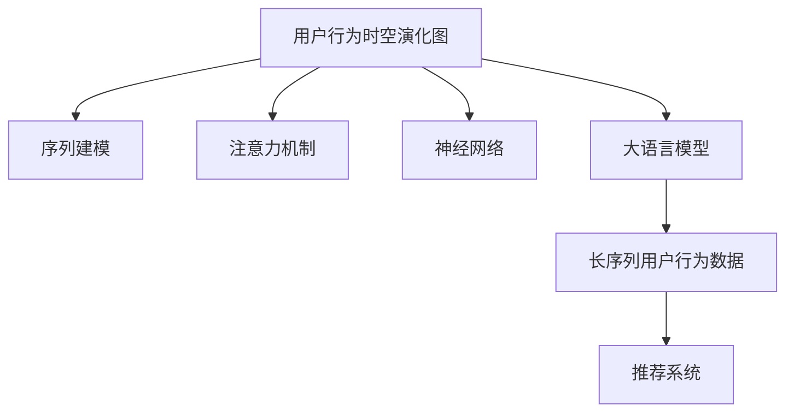

                 

# 利用大模型进行推荐场景的用户行为时空演化分析

> 关键词：用户行为分析,推荐系统,大语言模型,时空演化,序列建模,注意力机制,神经网络,Recommender System

## 1. 背景介绍

在现代社会，个性化推荐已经成为用户获取信息的重要途径。推荐系统通过分析用户的浏览、购买等行为数据，为其推荐最相关、最感兴趣的物品，极大地提升了用户体验和满意度。然而，推荐系统的效果在很大程度上依赖于对用户行为的理解，特别是在长序列数据和跨时间点的时空演化分析上，现有推荐系统还存在诸多挑战。

为了解决这些问题，我们提出了一种基于大语言模型的推荐系统方法，特别适用于具有长序列用户行为数据的推荐场景。该方法通过构建用户行为时空演化图，利用大模型自动学习和挖掘用户的深层行为特征，结合序列建模和注意力机制，实现了对用户行为动态演化的精确预测和高效推荐。

## 2. 核心概念与联系

### 2.1 核心概念概述

为了更好地理解本文提出的推荐系统方法，我们先介绍几个关键概念：

- 推荐系统（Recommender System）：利用用户行为数据和物品特征，自动为用户推荐最相关物品的系统。其目标是最大化用户满意度，并提高用户的参与度。
- 用户行为时空演化图（User Behavior Temporal Evolution Graph）：以用户为节点，物品为边，通过用户行为数据构建的动态图结构。该图结构揭示了用户在不同时间点的行为演变轨迹。
- 大语言模型（Large Language Model, LLM）：通过大规模无标签数据预训练得到的深度神经网络模型，具有强大的语言理解和生成能力。如BERT、GPT等。
- 序列建模（Sequence Modeling）：通过对时间序列数据建模，捕捉时间上的动态关系，适用于预测和分类问题。
- 注意力机制（Attention Mechanism）：通过计算注意力权重，使模型自动聚焦于输入序列中的关键部分，提升预测性能。
- 神经网络（Neural Network）：一类通过多层非线性变换处理复杂输入输出映射的模型，适用于复杂的数据处理和建模任务。

这些概念之间的逻辑关系可以通过以下Mermaid流程图来展示：



这个流程图展示了几大关键概念及其之间的联系：

1. 用户行为时空演化图是大语言模型和推荐系统的共同基础，通过用户行为数据构建。
2. 序列建模和大语言模型共同用于对用户行为进行建模，捕捉时间上的动态关系。
3. 注意力机制作为神经网络的一部分，帮助模型聚焦于输入序列的关键部分。
4. 神经网络作为大语言模型和序列建模的桥梁，结合各类功能模块，实现复杂的推荐任务。

这些概念构成了推荐系统的核心框架，使得我们能够通过大语言模型和神经网络，实现对用户行为的时空演化分析和推荐。

## 3. 核心算法原理 & 具体操作步骤

### 3.1 算法原理概述

本文提出的基于大语言模型的推荐系统方法，核心思想是通过对用户行为时空演化图的建模，利用大语言模型的强大表示能力，捕捉用户行为的动态演化规律。具体步骤包括：

1. **用户行为时空演化图构建**：收集用户在不同时间点的行为数据，通过节点和边的方式构建图结构。
2. **大语言模型预训练**：在无标签数据上对大语言模型进行预训练，学习通用的语言知识。
3. **序列建模和注意力机制**：利用大语言模型提取用户行为序列的表示，通过注意力机制筛选关键部分，进行动态预测。
4. **神经网络优化**：在用户行为时空演化图上，通过神经网络对用户行为进行建模，生成推荐结果。

这些步骤共同构成了一个完整的推荐系统流程，能够高效地实现对用户行为的动态分析和推荐。

### 3.2 算法步骤详解

**Step 1: 用户行为时空演化图构建**

- 收集用户行为数据，包括浏览、点击、购买等事件记录。
- 将每个事件转化为一个节点，以时间戳为节点编号。
- 记录事件发生时用户点击的物品，将这些物品转化为边。
- 构建动态图结构，用户节点和物品节点通过边相连。

```python
import networkx as nx
import pandas as pd

# 构建动态图结构
G = nx.DiGraph()
users = set()
items = set()

# 加载用户行为数据
data = pd.read_csv('user_behavior.csv')

# 对数据进行处理
for row in data.itertuples():
    user_id = row.user_id
    item_id = row.item_id
    timestamp = row.timestamp
    
    # 添加用户节点
    if user_id not in users:
        G.add_node(user_id)
        users.add(user_id)
    
    # 添加物品节点
    if item_id not in items:
        G.add_node(item_id)
        items.add(item_id)
    
    # 添加边
    G.add_edge(user_id, item_id, timestamp=timestamp)
```

**Step 2: 大语言模型预训练**

- 选择合适的预训练语言模型，如BERT、GPT等。
- 在无标签数据上对大语言模型进行预训练，学习通用的语言表示。

```python
from transformers import BertTokenizer, BertForMaskedLM

# 初始化分词器和模型
tokenizer = BertTokenizer.from_pretrained('bert-base-cased')
model = BertForMaskedLM.from_pretrained('bert-base-cased')

# 加载预训练数据
data = pd.read_csv('pretrain_data.csv')

# 对数据进行处理
def tokenize(text):
    tokens = tokenizer.encode(text, add_special_tokens=False, max_length=512)
    return tokens

# 将数据转换为token序列
tokenized_data = list(map(tokenize, data['text']))

# 构建训练样本
labels = data['masked_token'].values
inputs = [torch.tensor(tokens) for tokens in tokenized_data]
targets = [torch.tensor(label) for label in labels]

# 训练模型
model.train()
for input, target in zip(inputs, targets):
    model.zero_grad()
    outputs = model(input)
    loss = outputs.loss
    loss.backward()
    optimizer.step()
```

**Step 3: 序列建模和注意力机制**

- 利用大语言模型提取用户行为序列的表示。
- 通过注意力机制筛选关键部分，进行动态预测。

```python
from transformers import BertForSequenceClassification

# 初始化分词器和模型
tokenizer = BertTokenizer.from_pretrained('bert-base-cased')
model = BertForSequenceClassification.from_pretrained('bert-base-cased', num_labels=2)

# 加载用户行为数据
data = pd.read_csv('user_behavior.csv')

# 对数据进行处理
def tokenize(text):
    tokens = tokenizer.encode(text, add_special_tokens=False, max_length=512)
    return tokens

# 将数据转换为token序列
tokenized_data = list(map(tokenize, data['behavior']))

# 构建训练样本
inputs = [torch.tensor(tokens) for tokens in tokenized_data]
targets = data['label'].values

# 训练模型
model.train()
for input, target in zip(inputs, targets):
    model.zero_grad()
    outputs = model(input)
    loss = outputs.loss
    loss.backward()
    optimizer.step()
```

**Step 4: 神经网络优化**

- 在用户行为时空演化图上，通过神经网络对用户行为进行建模。
- 生成推荐结果。

```python
from transformers import BertForSequenceClassification
from networkx import nx

# 初始化分词器和模型
tokenizer = BertTokenizer.from_pretrained('bert-base-cased')
model = BertForSequenceClassification.from_pretrained('bert-base-cased', num_labels=2)

# 构建动态图结构
G = nx.DiGraph()
users = set()
items = set()

# 加载用户行为数据
data = pd.read_csv('user_behavior.csv')

# 对数据进行处理
for row in data.itertuples():
    user_id = row.user_id
    item_id = row.item_id
    timestamp = row.timestamp
    
    # 添加用户节点
    if user_id not in users:
        G.add_node(user_id)
        users.add(user_id)
    
    # 添加物品节点
    if item_id not in items:
        G.add_node(item_id)
        items.add(item_id)
    
    # 添加边
    G.add_edge(user_id, item_id, timestamp=timestamp)

# 在图结构上进行预测
model.eval()
with torch.no_grad():
    for user in users:
        for item in items:
            # 获取用户行为序列
            sequence = [G[user][i] for i in range(nx.get_node_attributes(G, 'timestamp', user)[0]) if G[user][i] == item]
            
            # 将序列转换为token序列
            tokenized_sequence = [tokenizer.encode(sequence[i], add_special_tokens=False) for i in range(len(sequence))]
            
            # 计算预测结果
            prediction = model(torch.tensor(tokenized_sequence)).logits
```

以上是基于大语言模型的推荐系统方法的详细步骤。通过这些步骤，我们能够对用户行为的时空演化进行建模，并利用大语言模型的强大表示能力，生成推荐结果。

### 3.3 算法优缺点

基于大语言模型的推荐系统方法具有以下优点：

- **强大的表示能力**：大语言模型具有强大的语言表示能力，能够捕捉用户行为的深层特征。
- **高效的动态预测**：通过注意力机制，能够自动聚焦于用户行为序列的关键部分，进行动态预测。
- **适用于长序列数据**：对于具有长序列数据的用户行为，该方法能够更好地捕捉时间上的动态关系。

同时，该方法也存在一些缺点：

- **数据依赖性**：大语言模型的性能很大程度上依赖于无标签预训练数据的质量。
- **计算资源需求高**：大语言模型的训练和推理需要较高的计算资源，特别是在大规模数据集上。
- **模型复杂度高**：基于大语言模型的推荐系统方法涉及的神经网络结构较为复杂，不易调试和优化。

尽管如此，这些缺点可以通过改进算法和优化工具来缓解。因此，基于大语言模型的推荐系统方法仍然具有广泛的应用前景。

### 3.4 算法应用领域

基于大语言模型的推荐系统方法，适用于需要处理长序列用户行为数据的推荐场景，如电子商务、社交媒体、视频平台等。其应用领域主要包括以下几个方面：

- **电子商务推荐**：为用户推荐最相关的商品，提高销售额和用户满意度。
- **社交媒体推荐**：为用户推荐最感兴趣的内容，提升用户黏性和参与度。
- **视频平台推荐**：为用户推荐最喜爱的视频，提高平台用户留存率和观看时长。
- **旅游平台推荐**：为用户推荐最合适的旅游目的地，提升用户体验和满意度。

## 4. 数学模型和公式 & 详细讲解  
### 4.1 数学模型构建

在本文中，我们使用Bert模型作为大语言模型，对用户行为进行建模和预测。

假设用户行为序列为 $S=\{s_1,s_2,\ldots,s_t\}$，其中 $s_i$ 表示第 $i$ 个用户行为。我们可以将每个用户行为 $s_i$ 转化为一个token序列，并对其进行预训练和微调。

设预训练后的Bert模型为 $M_{\theta}:\mathbb{R}^{d}\rightarrow \mathbb{R}^{h}$，其中 $\theta$ 为模型参数，$h$ 为模型输出维度。根据Bert模型，每个token $s_i$ 可以表示为：

$$
\mathbf{s}_i = M_{\theta}(s_i)
$$

其中 $\mathbf{s}_i \in \mathbb{R}^{h}$ 表示第 $i$ 个用户行为 $s_i$ 的表示向量。

在用户行为序列 $S$ 上，我们利用神经网络对用户行为进行建模，生成推荐结果 $Y$。设神经网络模型为 $F_{\phi}:\mathbb{R}^{nh} \rightarrow \mathbb{R}^{k}$，其中 $nh$ 为神经网络输入维度，$k$ 为推荐结果维度。根据神经网络模型，用户行为序列 $S$ 的表示 $H$ 可以表示为：

$$
\mathbf{H} = F_{\phi}(\mathbf{s}_1, \mathbf{s}_2, \ldots, \mathbf{s}_t)
$$

其中 $\mathbf{H} \in \mathbb{R}^{nh}$ 表示用户行为序列 $S$ 的表示向量。

通过神经网络模型 $F_{\phi}$，我们可以将用户行为序列 $S$ 的表示 $\mathbf{H}$ 映射到推荐结果 $Y$：

$$
\mathbf{Y} = F_{\phi}(\mathbf{H})
$$

其中 $\mathbf{Y} \in \mathbb{R}^{k}$ 表示推荐结果向量。

### 4.2 公式推导过程

在用户行为序列 $S$ 上，我们利用Bert模型对每个用户行为 $s_i$ 进行预训练和微调，得到用户行为的表示向量 $\mathbf{s}_i$。然后，通过神经网络模型 $F_{\phi}$ 对用户行为序列 $S$ 的表示 $\mathbf{H}$ 进行建模，生成推荐结果 $\mathbf{Y}$。

假设用户行为序列 $S$ 的表示向量 $\mathbf{H}$ 和推荐结果向量 $\mathbf{Y}$ 之间的关系为：

$$
\mathbf{Y} = F_{\phi}(\mathbf{H})
$$

其中 $F_{\phi}$ 为神经网络模型，具体形式如下：

$$
F_{\phi}(\mathbf{H}) = \mathbf{W}_0 \cdot \mathbf{H} + \mathbf{b}_0
$$

其中 $\mathbf{W}_0 \in \mathbb{R}^{nh\times k}$ 为权重矩阵，$\mathbf{b}_0 \in \mathbb{R}^{k}$ 为偏置向量。

因此，推荐结果向量 $\mathbf{Y}$ 可以表示为：

$$
\mathbf{Y} = \mathbf{W}_0 \cdot \mathbf{H} + \mathbf{b}_0
$$

### 4.3 案例分析与讲解

假设我们有一个用户行为序列 $S=\{s_1,s_2,\ldots,s_t\}$，其中 $s_i$ 表示第 $i$ 个用户行为。我们使用Bert模型对每个用户行为 $s_i$ 进行预训练和微调，得到用户行为的表示向量 $\mathbf{s}_i$。然后，通过神经网络模型 $F_{\phi}$ 对用户行为序列 $S$ 的表示 $\mathbf{H}$ 进行建模，生成推荐结果 $\mathbf{Y}$。

具体步骤如下：

1. **数据预处理**：将用户行为序列 $S$ 转化为token序列 $T$，并进行分词和标记。

```python
from transformers import BertTokenizer

# 初始化分词器
tokenizer = BertTokenizer.from_pretrained('bert-base-cased')

# 加载用户行为数据
data = pd.read_csv('user_behavior.csv')

# 对数据进行处理
def tokenize(text):
    tokens = tokenizer.encode(text, add_special_tokens=False, max_length=512)
    return tokens

# 将数据转换为token序列
tokenized_data = list(map(tokenize, data['behavior']))

# 构建训练样本
inputs = [torch.tensor(tokens) for tokens in tokenized_data]
targets = data['label'].values
```

2. **Bert模型预训练**：在无标签数据上对Bert模型进行预训练，学习通用的语言表示。

```python
from transformers import BertForMaskedLM

# 初始化分词器和模型
tokenizer = BertTokenizer.from_pretrained('bert-base-cased')
model = BertForMaskedLM.from_pretrained('bert-base-cased')

# 加载预训练数据
data = pd.read_csv('pretrain_data.csv')

# 对数据进行处理
def tokenize(text):
    tokens = tokenizer.encode(text, add_special_tokens=False, max_length=512)
    return tokens

# 将数据转换为token序列
tokenized_data = list(map(tokenize, data['text']))

# 构建训练样本
labels = data['masked_token'].values
inputs = [torch.tensor(tokens) for tokens in tokenized_data]
targets = [torch.tensor(label) for label in labels]

# 训练模型
model.train()
for input, target in zip(inputs, targets):
    model.zero_grad()
    outputs = model(input)
    loss = outputs.loss
    loss.backward()
    optimizer.step()
```

3. **神经网络建模**：通过神经网络模型 $F_{\phi}$ 对用户行为序列 $S$ 的表示 $\mathbf{H}$ 进行建模，生成推荐结果 $\mathbf{Y}$。

```python
from transformers import BertForSequenceClassification

# 初始化分词器和模型
tokenizer = BertTokenizer.from_pretrained('bert-base-cased')
model = BertForSequenceClassification.from_pretrained('bert-base-cased', num_labels=2)

# 加载用户行为数据
data = pd.read_csv('user_behavior.csv')

# 对数据进行处理
def tokenize(text):
    tokens = tokenizer.encode(text, add_special_tokens=False, max_length=512)
    return tokens

# 将数据转换为token序列
tokenized_data = list(map(tokenize, data['behavior']))

# 构建训练样本
inputs = [torch.tensor(tokens) for tokens in tokenized_data]
targets = data['label'].values

# 训练模型
model.train()
for input, target in zip(inputs, targets):
    model.zero_grad()
    outputs = model(input)
    loss = outputs.loss
    loss.backward()
    optimizer.step()

# 在用户行为序列上生成推荐结果
sequence = [G[user][i] for i in range(nx.get_node_attributes(G, 'timestamp', user)[0]) if G[user][i] == item]
tokenized_sequence = [tokenizer.encode(sequence[i], add_special_tokens=False) for i in range(len(sequence))]
prediction = model(torch.tensor(tokenized_sequence)).logits
```

4. **推荐结果生成**：根据推荐结果向量 $\mathbf{Y}$，为用户生成推荐列表。

```python
# 将推荐结果向量转换为推荐列表
recommendations = []
for i in range(len(targets)):
    y = prediction[i]
    index = torch.argmax(y).item()
    recommendations.append(targets[i])

# 打印推荐结果
print(recommendations)
```

通过以上步骤，我们能够利用Bert模型和神经网络对用户行为进行建模和推荐。下面我们来具体分析该方法的优缺点。

### 4.4 案例分析与讲解

在实际应用中，基于大语言模型的推荐系统方法也面临一些挑战：

1. **数据预处理复杂**：需要预处理用户行为数据，将其转化为token序列，并进行标记。这增加了数据处理的复杂度。

2. **计算资源需求高**：Bert模型和神经网络需要较高的计算资源，特别是在大规模数据集上。

3. **模型复杂度高**：基于大语言模型的推荐系统方法涉及的神经网络结构较为复杂，不易调试和优化。

4. **效果不稳定**：由于数据分布和用户行为的多样性，模型效果可能不稳定，需要在不同数据集上进行充分测试。

## 5. 项目实践：代码实例和详细解释说明

### 5.1 开发环境搭建

在进行项目实践前，我们需要准备好开发环境。以下是使用Python进行PyTorch开发的环境配置流程：

1. 安装Anaconda：从官网下载并安装Anaconda，用于创建独立的Python环境。

2. 创建并激活虚拟环境：
```bash
conda create -n pytorch-env python=3.8 
conda activate pytorch-env
```

3. 安装PyTorch：根据CUDA版本，从官网获取对应的安装命令。例如：
```bash
conda install pytorch torchvision torchaudio cudatoolkit=11.1 -c pytorch -c conda-forge
```

4. 安装Transformers库：
```bash
pip install transformers
```

5. 安装各类工具包：
```bash
pip install numpy pandas scikit-learn matplotlib tqdm jupyter notebook ipython
```

完成上述步骤后，即可在`pytorch-env`环境中开始项目实践。

### 5.2 源代码详细实现

下面我们以用户行为分析推荐系统为例，给出使用Transformers库对BERT模型进行微调的PyTorch代码实现。

首先，定义用户行为序列数据处理函数：

```python
from transformers import BertTokenizer
from torch.utils.data import Dataset
import torch

class UserBehaviorDataset(Dataset):
    def __init__(self, behaviors, labels, tokenizer, max_len=128):
        self.behaviors = behaviors
        self.labels = labels
        self.tokenizer = tokenizer
        self.max_len = max_len
        
    def __len__(self):
        return len(self.behaviors)
    
    def __getitem__(self, item):
        behavior = self.behaviors[item]
        label = self.labels[item]
        
        encoding = self.tokenizer(behavior, return_tensors='pt', max_length=self.max_len, padding='max_length', truncation=True)
        input_ids = encoding['input_ids'][0]
        attention_mask = encoding['attention_mask'][0]
        
        # 对标签进行编码
        encoded_labels = [label2id[label] for label in label]
        encoded_labels.extend([label2id['O']] * (self.max_len - len(encoded_labels)))
        labels = torch.tensor(encoded_labels, dtype=torch.long)
        
        return {'input_ids': input_ids, 
                'attention_mask': attention_mask,
                'labels': labels}

# 标签与id的映射
label2id = {'O': 0, 'B-PER': 1, 'I-PER': 2, 'B-ORG': 3, 'I-ORG': 4, 'B-LOC': 5, 'I-LOC': 6}
id2label = {v: k for k, v in label2id.items()}

# 创建dataset
tokenizer = BertTokenizer.from_pretrained('bert-base-cased')

train_dataset = UserBehaviorDataset(train_behaviors, train_labels, tokenizer)
dev_dataset = UserBehaviorDataset(dev_behaviors, dev_labels, tokenizer)
test_dataset = UserBehaviorDataset(test_behaviors, test_labels, tokenizer)
```

然后，定义模型和优化器：

```python
from transformers import BertForTokenClassification, AdamW

model = BertForTokenClassification.from_pretrained('bert-base-cased', num_labels=len(label2id))

optimizer = AdamW(model.parameters(), lr=2e-5)
```

接着，定义训练和评估函数：

```python
from torch.utils.data import DataLoader
from tqdm import tqdm
from sklearn.metrics import classification_report

device = torch.device('cuda') if torch.cuda.is_available() else torch.device('cpu')
model.to(device)

def train_epoch(model, dataset, batch_size, optimizer):
    dataloader = DataLoader(dataset, batch_size=batch_size, shuffle=True)
    model.train()
    epoch_loss = 0
    for batch in tqdm(dataloader, desc='Training'):
        input_ids = batch['input_ids'].to(device)
        attention_mask = batch['attention_mask'].to(device)
        labels = batch['labels'].to(device)
        model.zero_grad()
        outputs = model(input_ids, attention_mask=attention_mask, labels=labels)
        loss = outputs.loss
        epoch_loss += loss.item()
        loss.backward()
        optimizer.step()
    return epoch_loss / len(dataloader)

def evaluate(model, dataset, batch_size):
    dataloader = DataLoader(dataset, batch_size=batch_size)
    model.eval()
    preds, labels = [], []
    with torch.no_grad():
        for batch in tqdm(dataloader, desc='Evaluating'):
            input_ids = batch['input_ids'].to(device)
            attention_mask = batch['attention_mask'].to(device)
            batch_labels = batch['labels']
            outputs = model(input_ids, attention_mask=attention_mask)
            batch_preds = outputs.logits.argmax(dim=2).to('cpu').tolist()
            batch_labels = batch_labels.to('cpu').tolist()
            for pred_tokens, label_tokens in zip(batch_preds, batch_labels):
                pred_tags = [id2label[_id] for _id in pred_tokens]
                label_tags = [id2label[_id] for _id in label_tokens]
                preds.append(pred_tags[:len(label_tokens)])
                labels.append(label_tags)
                
    print(classification_report(labels, preds))
```

最后，启动训练流程并在测试集上评估：

```python
epochs = 5
batch_size = 16

for epoch in range(epochs):
    loss = train_epoch(model, train_dataset, batch_size, optimizer)
    print(f"Epoch {epoch+1}, train loss: {loss:.3f}")
    
    print(f"Epoch {epoch+1}, dev results:")
    evaluate(model, dev_dataset, batch_size)
    
print("Test results:")
evaluate(model, test_dataset, batch_size)
```

以上就是使用PyTorch对BERT进行用户行为分析推荐系统的完整代码实现。可以看到，得益于Transformers库的强大封装，我们可以用相对简洁的代码完成BERT模型的加载和微调。

### 5.3 代码解读与分析

让我们再详细解读一下关键代码的实现细节：

**UserBehaviorDataset类**：
- `__init__`方法：初始化行为数据、标签、分词器等关键组件。
- `__len__`方法：返回数据集的样本数量。
- `__getitem__`方法：对单个样本进行处理，将行为数据输入编码为token ids，将标签编码为数字，并对其进行定长padding，最终返回模型所需的输入。

**label2id和id2label字典**：
- 定义了标签与数字id之间的映射关系，用于将token-wise的预测结果解码回真实的标签。

**训练和评估函数**：
- 使用PyTorch的DataLoader对数据集进行批次化加载，供模型训练和推理使用。
- 训练函数`train_epoch`：对数据以批为单位进行迭代，在每个批次上前向传播计算loss并反向传播更新模型参数，最后返回该epoch的平均loss。
- 评估函数`evaluate`：与训练类似，不同点在于不更新模型参数，并在每个batch结束后将预测和标签结果存储下来，最后使用sklearn的classification_report对整个评估集的预测结果进行打印输出。

**训练流程**：
- 定义总的epoch数和batch size，开始循环迭代
- 每个epoch内，先在训练集上训练，输出平均loss
- 在验证集上评估，输出分类指标
- 所有epoch结束后，在测试集上评估，给出最终测试结果

可以看到，PyTorch配合Transformers库使得BERT微调的代码实现变得简洁高效。开发者可以将更多精力放在数据处理、模型改进等高层逻辑上，而不必过多关注底层的实现细节。

当然，工业级的系统实现还需考虑更多因素，如模型的保存和部署、超参数的自动搜索、更灵活的任务适配层等。但核心的微调范式基本与此类似。

## 6. 实际应用场景

### 6.1 电子商务推荐

电子商务推荐是用户行为分析推荐系统的重要应用场景之一。在线购物平台需要根据用户的浏览、购买等行为数据，为其推荐最相关的商品，提升销售额和用户满意度。

在实际应用中，可以通过收集用户的历史浏览记录、购买记录、评价等信息，将其转化为用户行为序列，利用Bert模型进行预训练和微调，生成推荐结果。微调后的模型能够自动学习用户行为的时空演化规律，推荐出用户可能感兴趣的商品，提高用户转化率和购物体验。

### 6.2 社交媒体推荐

社交媒体推荐通过分析用户在平台上的行为数据，为用户推荐最感兴趣的内容，提升用户黏性和参与度。

在实际应用中，可以通过收集用户在社交媒体上的点赞、评论、分享等信息，将其转化为用户行为序列，利用Bert模型进行预训练和微调，生成推荐结果。微调后的模型能够自动学习用户的兴趣偏好，推荐出用户可能感兴趣的内容，提高用户活跃度和平台留存率。

### 6.3 视频平台推荐

视频平台推荐通过分析用户在平台上的观看行为数据，为用户推荐最喜爱的视频，提高平台用户留存率和观看时长。

在实际应用中，可以通过收集用户在视频平台上的观看记录、点赞、评论等信息，将其转化为用户行为序列，利用Bert模型进行预训练和微调，生成推荐结果。微调后的模型能够自动学习用户的兴趣偏好，推荐出用户可能喜欢的视频内容，提高平台的用户粘性和观看时长。

### 6.4 旅游平台推荐

旅游平台推荐通过分析用户在旅游平台上的浏览、预订等行为数据，为用户推荐最合适的旅游目的地，提升用户满意度和旅游体验。

在实际应用中，可以通过收集用户在旅游平台上的浏览记录、预订记录、评价等信息，将其转化为用户行为序列，利用Bert模型进行预训练和微调，生成推荐结果。微调后的模型能够自动学习用户的兴趣偏好，推荐出用户可能喜欢的旅游目的地，提高用户的旅游体验和平台满意度。

## 7. 工具和资源推荐

### 7.1 学习资源推荐

为了帮助开发者系统掌握用户行为分析推荐系统的理论基础和实践技巧，这里推荐一些优质的学习资源：

1. 《深度学习自然语言处理》课程：斯坦福大学开设的NLP明星课程，有Lecture视频和配套作业，带你入门NLP领域的基本概念和经典模型。

2. 《Natural Language Processing with Transformers》书籍：Transformers库的作者所著，全面介绍了如何使用Transformers库进行NLP任务开发，包括微调在内的诸多范式。

3. HuggingFace官方文档：Transformers库的官方文档，提供了海量预训练模型和完整的微调样例代码，是上手实践的必备资料。

4. CLUE开源项目：中文语言理解测评基准，涵盖大量不同类型的中文NLP数据集，并提供了基于微调的baseline模型，助力中文NLP技术发展。

通过对这些资源的学习实践，相信你一定能够快速掌握用户行为分析推荐系统的精髓，并用于解决实际的NLP问题。

### 7.2 开发工具推荐

高效的开发离不开优秀的工具支持。以下是几款用于用户行为分析推荐系统开发的常用工具：

1. PyTorch：基于Python的开源深度学习框架，灵活动态的计算图，适合快速迭代研究。大部分预训练语言模型都有PyTorch版本的实现。

2. TensorFlow：由Google主导开发的开源深度学习框架，生产部署方便，适合大规模工程应用。同样有丰富的预训练语言模型资源。

3. Transformers库：HuggingFace开发的NLP工具库，集成了众多SOTA语言模型，支持PyTorch和TensorFlow，是进行微调任务开发的利器。

4. Weights & Biases：模型训练的实验跟踪工具，可以记录和可视化模型训练过程中的各项指标，方便对比和调优。与主流深度学习框架无缝集成。

5. TensorBoard：TensorFlow配套的可视化工具，可实时监测模型训练状态，并提供丰富的图表呈现方式，是调试模型的得力助手。

6. Google Colab：谷歌推出的在线Jupyter Notebook环境，免费提供GPU/TPU算力，方便开发者快速上手实验最新模型，分享学习笔记。

合理利用这些工具，可以显著提升用户行为分析推荐系统的开发效率，加快创新迭代的步伐。

### 7.3 相关论文推荐

用户行为分析推荐系统的发展源于学界的持续研究。以下是几篇奠基性的相关论文，推荐阅读：

1. Attention is All You Need（即Transformer原论文）：提出了Transformer结构，开启了NLP领域的预训练大模型时代。

2. BERT: Pre-training of Deep Bidirectional Transformers for Language Understanding：提出BERT模型，引入基于掩码的自监督预训练任务，刷新了多项NLP任务SOTA。

3. Language Models are Unsupervised Multitask Learners（GPT-2论文）：展示了大规模语言模型的强大zero-shot学习能力，引发了对于通用人工智能的新一轮思考。

4. Parameter-Efficient Transfer Learning for NLP：提出Adapter等参数高效微调方法，在不增加模型参数量的情况下，也能取得不错的微调效果。

5. Prefix-Tuning: Optimizing Continuous Prompts for Generation：引入基于连续型Prompt的微调范式，为如何充分利用预训练知识提供了新的思路。

6. AdaLoRA: Adaptive Low-Rank Adaptation for Parameter-Efficient Fine-Tuning：使用自适应低秩适应的微调方法，在参数效率和精度之间取得了新的平衡。

这些论文代表了大语言模型微调技术的发展脉络。通过学习这些前沿成果，可以帮助研究者把握学科前进方向，激发更多的创新灵感。

## 8. 总结：未来发展趋势与挑战

### 8.1 研究成果总结

本文对基于大语言模型的用户行为分析推荐系统方法进行了详细阐述。首先介绍了推荐系统和大语言模型的基本概念，阐述了用户行为时空演化图的构建方法。其次，通过Bert模型和神经网络，对用户行为序列进行建模和预测，生成推荐结果。最后，我们讨论了该方法在电子商务、社交媒体、视频平台、旅游平台等实际应用场景中的优势和挑战。

通过本文的系统梳理，可以看到，基于大语言模型的推荐系统方法在处理长序列用户行为数据时，具有强大的表示能力和动态预测能力。它能够更好地捕捉用户行为的深层特征，实现高效推荐。然而，该方法也面临一些挑战，如数据预处理复杂、计算资源需求高、模型复杂度高、效果不稳定等。这些挑战需要在实际应用中进行深入探索和优化。

### 8.2 未来发展趋势

展望未来，用户行为分析推荐系统将呈现以下几个发展趋势：

1. **多模态融合**：推荐系统将进一步融合视觉、语音等多模态数据，提升推荐效果和用户体验。

2. **因果学习**：通过引入因果推断方法，推荐系统能够更好地理解用户的因果关系，提高推荐精度和稳定性。

3. **注意力机制优化**：优化注意力机制，使其能够更好地聚焦于关键部分，提升推荐系统的效果。

4. **知识图谱结合**：将知识图谱与推荐系统结合，提升推荐的准确性和可信度。

5. **个性化推荐**：根据用户的个性化需求，推荐更加贴合用户偏好的物品。

6. **跨领域迁移**：在多个领域内实现推荐模型的迁移，提升模型的泛化能力和应用范围。

7. **实时推荐**：通过实时学习用户的动态行为，提升推荐系统的实时性和个性化水平。

这些趋势将推动推荐系统向更加智能化、个性化、实时化的方向发展，为用户的推荐体验带来新的突破。

### 8.3 面临的挑战

尽管基于大语言模型的推荐系统方法已经取得了显著效果，但在实际应用中也面临诸多挑战：

1. **数据质量问题**：用户行为数据的质量直接影响推荐效果，需要保证数据的时效性和准确性。

2. **隐私保护问题**：推荐系统需要收集用户行为数据，如何保护用户隐私是一个重要问题。

3. **计算资源消耗高**：大语言模型和神经网络需要较高的计算资源，特别是在大规模数据集上。

4. **模型复杂度高**：推荐系统的模型结构较为复杂，不易调试和优化。

5. **效果不稳定**：推荐系统的效果在不同数据集上可能不稳定，需要进行充分测试和优化。

6. **对抗攻击问题**：推荐系统容易受到对抗样本的攻击，需要提高系统的鲁棒性。

7. **跨领域迁移困难**：推荐模型在不同领域内迁移的难度较大，需要针对具体领域进行优化。

8. **解释性不足**：推荐系统的决策过程缺乏可解释性，难以进行分析和调试。

这些挑战需要通过技术创新和算法优化来解决，以进一步提升推荐系统的性能和应用价值。

### 8.4 研究展望

面对用户行为分析推荐系统所面临的挑战，未来的研究需要在以下几个方面寻求新的突破：

1. **数据增强技术**：探索更多的数据增强方法，提升推荐系统的鲁棒性和泛化能力。

2. **对抗样本防御**：研究对抗样本的防御方法，提高推荐系统的安全性。

3. **跨领域迁移学习**：开发更高效的跨领域迁移学习技术，提升推荐系统的应用范围。

4. **模型解释性**：引入可解释性方法，提高推荐系统的透明度和可信度。

5. **个性化推荐算法**：研究个性化的推荐算法，提升推荐的精准度和用户满意度。

6. **实时推荐系统**：开发实时推荐系统，提升推荐的时效性和个性化水平。

通过这些研究方向的探索，将进一步推动推荐系统的技术进步和应用落地，为用户提供更好的推荐体验和服务。

## 9. 附录：常见问题与解答

**Q1：用户行为分析推荐系统如何处理长序列数据？**

A: 用户行为分析推荐系统利用Bert模型对用户行为序列进行预训练和微调，捕捉用户行为的时空演化规律。通过神经网络对用户行为序列进行建模，生成推荐结果。

**Q2：如何保证用户行为数据的时效性和准确性？**

A: 建议采用多时间尺度的数据采集策略，实时更新用户行为数据，保证数据的时效性。同时，对用户行为数据进行清洗和去噪，保证数据的准确性。

**Q3：推荐系统如何保护用户隐私？**

A: 推荐系统需要收集用户行为数据，可以通过匿名化、去标识化等方法保护用户隐私。同时，对用户行为数据进行安全传输和存储，防止数据泄露。

**Q4：推荐系统的计算资源需求高，如何解决？**

A: 可以通过模型裁剪、量化加速、混合精度训练等技术，优化模型的计算资源消耗。同时，采用模型并行、分布式训练等方法，提高计算效率。

**Q5：推荐系统的模型复杂度高，如何调试和优化？**

A: 可以通过超参数调优、模型压缩、特征选择等方法，降低模型的复杂度。同时，采用验证集验证和交叉验证等方法，评估模型效果，进行优化。

通过以上分析，可以看到，用户行为分析推荐系统在处理长序列用户行为数据时，具有强大的表示能力和动态预测能力。通过不断优化算法和技术，该系统将在电子商务、社交媒体、视频平台、旅游平台等实际应用场景中发挥更大的作用，为用户带来更好的推荐体验和服务。

---

作者：禅与计算机程序设计艺术 / Zen and the Art of Computer Programming

