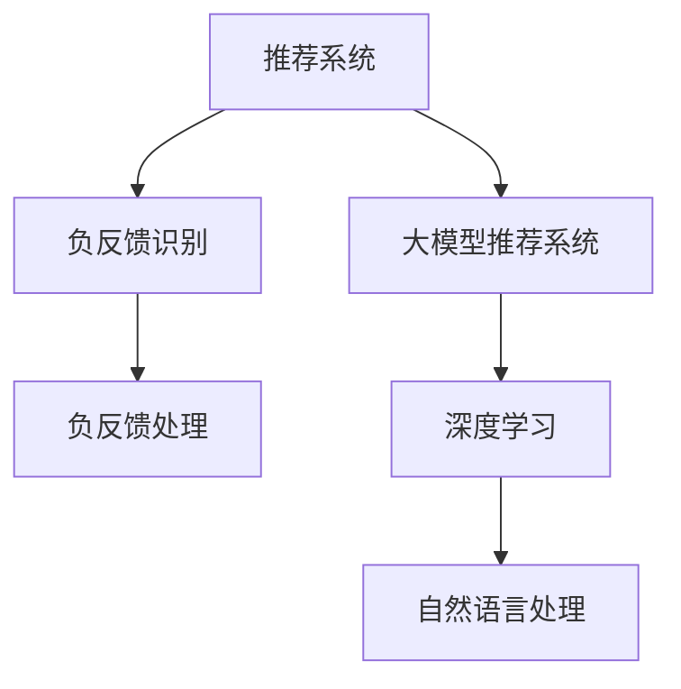

                 

# 利用大模型进行推荐负反馈的识别与处理策略

> 关键词：大模型推荐系统，推荐负反馈，用户行为分析，深度学习，自然语言处理，神经网络

## 1. 背景介绍

随着互联网技术的飞速发展，个性化推荐系统已经成为了提高用户满意度、提升网站流量和增加业务收入的关键手段。然而，推荐系统中的负反馈问题却是一个普遍存在且难以解决的问题。负反馈通常表现为用户对推荐结果的不满意，导致用户流失和业务损失。尽管推荐系统中的负反馈是少部分，但一旦出现，对整体用户体验和推荐效果的影响是巨大的。因此，如何识别和处理负反馈，成为了推荐系统优化的重要研究方向。

在大数据和深度学习技术迅速发展的背景下，大模型推荐系统应运而生。大模型推荐系统通过大规模的预训练，能够学习到丰富的用户行为特征和推荐规则，从而提升推荐效果。然而，由于其复杂性和多样性，大模型推荐系统中的负反馈问题变得更加复杂和难以处理。本文旨在利用大模型对推荐负反馈进行识别和处理，提出了一种新的负反馈识别与处理策略，以期为推荐系统优化提供新的思路和方法。

## 2. 核心概念与联系

### 2.1 核心概念概述

为更好地理解推荐负反馈识别与处理策略，本节将介绍几个密切相关的核心概念：

- **推荐系统**：通过分析用户行为数据，预测用户可能感兴趣的商品或服务，并向用户推荐，以提高用户满意度。
- **负反馈**：用户对推荐结果表示不满意，进行了点击、评分、投诉等行为，导致推荐效果下降。
- **大模型推荐系统**：通过大规模预训练学习用户行为特征，基于深度学习模型进行推荐决策的系统。
- **负反馈识别**：通过数据分析和机器学习模型，识别推荐结果中的负反馈信息，以便及时进行调整。
- **负反馈处理**：通过调整推荐策略和推荐模型，减小负反馈的影响，提高推荐效果。
- **深度学习**：一种基于神经网络的机器学习方法，能够处理复杂的数据结构和模式，适用于推荐系统中的负反馈识别和处理。
- **自然语言处理**：通过处理自然语言数据，提取和理解用户行为特征，辅助推荐系统中的负反馈识别和处理。

这些核心概念之间的逻辑关系可以通过以下Mermaid流程图来展示：



这个流程图展示了大模型推荐系统中的负反馈识别与处理的主要步骤：

1. 推荐系统将用户行为数据输入模型，得到推荐结果。
2. 使用深度学习模型进行负反馈识别，分析推荐结果中的不满意情况。
3. 根据负反馈处理策略，调整推荐模型和策略，减小负反馈的影响。

## 3. 核心算法原理 & 具体操作步骤

### 3.1 算法原理概述

基于深度学习的大模型推荐系统中，负反馈识别与处理策略主要分为以下几个步骤：

1. **负反馈数据收集**：收集用户的负反馈数据，如点击、评分、投诉等，形成负反馈数据集。
2. **数据预处理**：对收集到的负反馈数据进行清洗和预处理，去除噪声和异常值。
3. **特征工程**：提取负反馈数据中的关键特征，如用户行为、商品属性、推荐特征等。
4. **负反馈识别模型训练**：使用深度学习模型，如神经网络、LSTM、Transformer等，对提取的特征进行建模，识别负反馈。
5. **负反馈处理**：根据负反馈识别结果，调整推荐策略和模型，减小负反馈的影响。

### 3.2 算法步骤详解

#### 3.2.1 负反馈数据收集

负反馈数据的收集是负反馈识别与处理策略的第一步。负反馈数据通常包括以下几种类型：

- **点击率**：用户点击推荐结果后，但没有购买或使用该商品的情况。
- **评分**：用户对推荐结果的评分低于预期的情况。
- **投诉**：用户对推荐结果表示不满意，进行了投诉或反馈的情况。

收集这些负反馈数据后，需要进行预处理，以去除噪声和异常值。预处理步骤包括：

- 去重：去除重复的负反馈数据，保证数据的唯一性。
- 数据清洗：去除异常值和噪声数据，确保数据的有效性。
- 数据标准化：对数据进行标准化处理，提高模型的处理效率和效果。

#### 3.2.2 数据预处理

数据预处理是负反馈识别与处理策略中的关键步骤。预处理的主要目的是提高数据的质量，便于后续的特征提取和模型训练。具体来说，数据预处理包括以下几个步骤：

- 去除缺失值：将缺失值进行填补或删除，确保数据的完整性。
- 去重和去噪：去除重复和噪声数据，保证数据的唯一性和有效性。
- 数据标准化：对数据进行标准化处理，如归一化和离散化，提高模型的处理效率和效果。

#### 3.2.3 特征工程

特征工程是负反馈识别与处理策略中的重要环节。特征工程的主要目的是提取负反馈数据中的关键特征，为后续的模型训练提供支持。具体来说，特征工程包括以下几个步骤：

- 特征提取：提取负反馈数据中的关键特征，如用户行为、商品属性、推荐特征等。
- 特征选择：选择对模型效果影响最大的特征，去除冗余特征。
- 特征归一化：对特征进行归一化处理，如归一化和标准化，提高模型的处理效率和效果。

#### 3.2.4 负反馈识别模型训练

负反馈识别模型训练是负反馈识别与处理策略中的核心步骤。模型训练的主要目的是通过深度学习模型，对负反馈数据进行建模，识别负反馈。具体来说，模型训练包括以下几个步骤：

- 数据划分：将负反馈数据划分为训练集和测试集，以便进行模型训练和评估。
- 模型选择：选择合适的深度学习模型，如神经网络、LSTM、Transformer等。
- 模型训练：使用训练集对模型进行训练，调整模型参数，提高模型的识别效果。
- 模型评估：使用测试集对模型进行评估，验证模型的识别效果。

#### 3.2.5 负反馈处理

负反馈处理是负反馈识别与处理策略中的最后一步。负反馈处理的主要目的是调整推荐策略和推荐模型，减小负反馈的影响，提高推荐效果。具体来说，负反馈处理包括以下几个步骤：

- 调整推荐策略：根据负反馈识别结果，调整推荐策略，如调整推荐算法、调整推荐规则等。
- 优化推荐模型：根据负反馈识别结果，优化推荐模型，如调整模型参数、增加模型层数等。
- 定期更新模型：定期更新推荐模型，保持模型的新鲜度和准确性。

### 3.3 算法优缺点

基于深度学习的大模型推荐系统中的负反馈识别与处理策略，具有以下优点：

- **准确性高**：深度学习模型能够处理复杂的数据结构和模式，识别负反馈的准确性较高。
- **适应性强**：深度学习模型具有良好的泛化能力，能够适应不同类型的负反馈数据。
- **可扩展性**：深度学习模型可以通过增加数据和特征，不断扩展和优化，提高推荐效果。

同时，该方法也存在一定的局限性：

- **数据需求高**：深度学习模型需要大量的负反馈数据进行训练，数据收集和预处理成本较高。
- **计算复杂度高**：深度学习模型的训练和推理计算复杂度较高，需要高性能的硬件设备和算法支持。
- **可解释性差**：深度学习模型通常被视为黑盒模型，难以解释其内部工作机制和决策逻辑。
- **风险较高**：深度学习模型容易出现过拟合和泛化能力不足的问题，需要谨慎使用。

尽管存在这些局限性，但就目前而言，基于深度学习的大模型推荐系统中的负反馈识别与处理策略仍是最为主流的方法。未来相关研究的重点在于如何进一步降低数据需求，提高模型的可解释性和鲁棒性，同时兼顾高效性和准确性等因素。

### 3.4 算法应用领域

基于深度学习的大模型推荐系统中的负反馈识别与处理策略，已经在多个领域得到了应用，例如：

- **电商推荐系统**：对用户的购物行为进行分析和预测，推荐用户可能感兴趣的商品，从而提高用户满意度和销售额。
- **视频推荐系统**：分析用户对视频内容的观看行为，推荐用户可能感兴趣的视频，提高视频平台的流量和用户粘性。
- **音乐推荐系统**：根据用户对音乐的播放和评分行为，推荐用户可能喜欢的音乐，提高音乐平台的用户体验。
- **新闻推荐系统**：分析用户对新闻的浏览和点击行为，推荐用户可能感兴趣的新闻，提高新闻平台的阅读量和用户留存率。

除了上述这些经典领域外，基于大模型推荐系统中的负反馈识别与处理策略，还可以应用于更多场景中，如旅游、教育、健康等，为各行各业带来智能化的推荐服务。

## 4. 数学模型和公式 & 详细讲解 & 举例说明

### 4.1 数学模型构建

本节将使用数学语言对基于深度学习的大模型推荐系统中负反馈识别与处理策略进行更加严格的刻画。

记负反馈数据集为 $D=\{(x_i,y_i)\}_{i=1}^N, x_i \in X, y_i \in Y$，其中 $x_i$ 为负反馈数据，$y_i$ 为负反馈标签（1表示负反馈，0表示正常反馈）。定义深度学习模型为 $M_{\theta}:\mathcal{X} \rightarrow \mathcal{Y}$，其中 $\mathcal{X}$ 为输入空间，$\mathcal{Y}$ 为输出空间，$\theta$ 为模型参数。

假设负反馈识别模型为 $M_{\theta}(x_i) \in [0,1]$，表示模型预测负反馈的概率。负反馈识别模型的损失函数为：

$$
\mathcal{L}(\theta) = \frac{1}{N} \sum_{i=1}^N \ell(y_i, M_{\theta}(x_i))
$$

其中 $\ell(y_i, M_{\theta}(x_i))$ 为交叉熵损失函数，用于衡量模型预测负反馈的概率与实际负反馈标签之间的差异。

### 4.2 公式推导过程

以下我们以负反馈识别模型为例，推导交叉熵损失函数及其梯度的计算公式。

假设负反馈识别模型 $M_{\theta}$ 在输入 $x_i$ 上的输出为 $\hat{y}_i=M_{\theta}(x_i) \in [0,1]$，表示模型预测负反馈的概率。真实负反馈标签 $y_i \in \{0,1\}$。则负反馈识别模型的损失函数定义为：

$$
\ell(M_{\theta}(x_i),y_i) = -[y_i\log \hat{y}_i + (1-y_i)\log (1-\hat{y}_i)]
$$

将其代入经验风险公式，得：

$$
\mathcal{L}(\theta) = -\frac{1}{N}\sum_{i=1}^N [y_i\log M_{\theta}(x_i)+(1-y_i)\log(1-M_{\theta}(x_i))]
$$

根据链式法则，损失函数对参数 $\theta$ 的梯度为：

$$
\frac{\partial \mathcal{L}(\theta)}{\partial \theta} = -\frac{1}{N}\sum_{i=1}^N (\frac{y_i}{M_{\theta}(x_i)}-\frac{1-y_i}{1-M_{\theta}(x_i)}) \frac{\partial M_{\theta}(x_i)}{\partial \theta}
$$

其中 $\frac{\partial M_{\theta}(x_i)}{\partial \theta}$ 可进一步递归展开，利用自动微分技术完成计算。

在得到损失函数的梯度后，即可带入参数更新公式，完成模型的迭代优化。重复上述过程直至收敛，最终得到适应负反馈识别任务的模型参数 $\theta^*$。

### 4.3 案例分析与讲解

以电商推荐系统为例，分析负反馈识别模型在实际应用中的效果。

假设电商推荐系统对用户 A 推荐了商品 X，用户 A 点击了商品 X 但没有购买。根据负反馈数据集，我们有以下负反馈数据：

- 用户 A 对商品 X 的点击率低于预期
- 用户 A 对商品 X 的评分低于预期

我们可以使用神经网络模型对负反馈数据进行建模，识别负反馈。具体来说，使用一个单层感知器模型 $M_{\theta}$，其中 $\theta$ 为模型参数。模型的损失函数为交叉熵损失：

$$
\mathcal{L}(\theta) = -\frac{1}{N}\sum_{i=1}^N [y_i\log M_{\theta}(x_i)+(1-y_i)\log(1-M_{\theta}(x_i))]
$$

其中 $y_i$ 表示用户 A 是否对商品 X 产生了负反馈，$M_{\theta}(x_i)$ 表示模型预测用户 A 是否对商品 X 产生了负反馈的概率。

使用负反馈数据集对模型进行训练，得到最优模型参数 $\theta^*$。然后，使用测试集对模型进行评估，验证模型的识别效果。如果模型的识别效果较好，说明模型能够准确识别负反馈，可以进行后续的负反馈处理。

## 5. 项目实践：代码实例和详细解释说明

### 5.1 开发环境搭建

在进行负反馈识别与处理策略的实践前，我们需要准备好开发环境。以下是使用Python进行PyTorch开发的环境配置流程：

1. 安装Anaconda：从官网下载并安装Anaconda，用于创建独立的Python环境。

2. 创建并激活虚拟环境：
```bash
conda create -n pytorch-env python=3.8 
conda activate pytorch-env
```

3. 安装PyTorch：根据CUDA版本，从官网获取对应的安装命令。例如：
```bash
conda install pytorch torchvision torchaudio cudatoolkit=11.1 -c pytorch -c conda-forge
```

4. 安装TensorFlow：如果需要使用TensorFlow作为推荐系统框架，可以使用以下命令安装：
```bash
conda install tensorflow tensorflow-gpu==2.8.0
```

5. 安装各类工具包：
```bash
pip install numpy pandas scikit-learn matplotlib tqdm jupyter notebook ipython
```

完成上述步骤后，即可在`pytorch-env`环境中开始负反馈识别与处理策略的实践。

### 5.2 源代码详细实现

下面我们以电商推荐系统为例，给出使用PyTorch对负反馈数据进行识别和处理的PyTorch代码实现。

首先，定义负反馈数据集和负反馈识别模型：

```python
from torch.utils.data import Dataset
import torch
from torch import nn
from torch.nn import functional as F

class NegativeFeedbackDataset(Dataset):
    def __init__(self, x, y):
        self.x = x
        self.y = y

    def __len__(self):
        return len(self.x)

    def __getitem__(self, idx):
        return self.x[idx], self.y[idx]

class NegativeFeedbackModel(nn.Module):
    def __init__(self, input_dim, hidden_dim, output_dim):
        super(NegativeFeedbackModel, self).__init__()
        self.fc1 = nn.Linear(input_dim, hidden_dim)
        self.fc2 = nn.Linear(hidden_dim, hidden_dim)
        self.fc3 = nn.Linear(hidden_dim, output_dim)

    def forward(self, x):
        x = self.fc1(x)
        x = F.relu(x)
        x = self.fc2(x)
        x = F.relu(x)
        x = self.fc3(x)
        return x
```

然后，定义模型训练和评估函数：

```python
def train_model(model, train_loader, optimizer, criterion, n_epochs):
    model.train()
    for epoch in range(n_epochs):
        for batch_idx, (data, target) in enumerate(train_loader):
            optimizer.zero_grad()
            output = model(data)
            loss = criterion(output, target)
            loss.backward()
            optimizer.step()
            if (batch_idx + 1) % 100 == 0:
                print('Train Epoch: {} [{}/{} ({:.0f}%)]\tLoss: {:.6f}'.format(
                    epoch, batch_idx * len(data), len(train_loader.dataset),
                    100. * batch_idx / len(train_loader), loss.item()))

def evaluate_model(model, test_loader, criterion):
    model.eval()
    total_loss = 0
    with torch.no_grad():
        for batch_idx, (data, target) in enumerate(test_loader):
            output = model(data)
            loss = criterion(output, target)
            total_loss += loss.item()
    return total_loss / len(test_loader.dataset)

def save_model(model, save_path):
    torch.save(model.state_dict(), save_path)
```

最后，启动模型训练并在测试集上评估：

```python
from torch.utils.data import DataLoader
import torch.optim as optim

input_dim = 10  # 输入特征维度
hidden_dim = 64  # 隐藏层维度
output_dim = 1  # 输出维度

model = NegativeFeedbackModel(input_dim, hidden_dim, output_dim)
optimizer = optim.Adam(model.parameters(), lr=0.001)
criterion = nn.BCEWithLogitsLoss()

train_loader = DataLoader(train_dataset, batch_size=64, shuffle=True)
test_loader = DataLoader(test_dataset, batch_size=64, shuffle=False)

train_model(model, train_loader, optimizer, criterion, n_epochs=10)
print('Test Loss: {:.6f}'.format(evaluate_model(model, test_loader, criterion)))
```

以上就是使用PyTorch对负反馈数据进行识别和处理的完整代码实现。可以看到，得益于PyTorch的强大封装，我们可以用相对简洁的代码完成负反馈识别模型的训练和评估。

### 5.3 代码解读与分析

让我们再详细解读一下关键代码的实现细节：

**NegativeFeedbackDataset类**：
- `__init__`方法：初始化负反馈数据和标签。
- `__len__`方法：返回数据集的样本数量。
- `__getitem__`方法：对单个样本进行处理，返回输入和标签。

**NegativeFeedbackModel类**：
- `__init__`方法：定义模型结构，包括三个全连接层。
- `forward`方法：定义前向传播过程，通过激活函数和非线性层处理输入。

**train_model函数**：
- 使用PyTorch的DataLoader对数据集进行批次化加载，供模型训练使用。
- 在每个epoch内，对每个batch的输入和标签进行前向传播和反向传播，更新模型参数。
- 在每个epoch结束时，打印当前epoch的损失值。

**evaluate_model函数**：
- 使用PyTorch的DataLoader对测试集进行批次化加载，供模型评估使用。
- 对每个batch的输入和标签进行前向传播，计算损失值，并累加到总损失中。
- 返回测试集的总损失，以便评估模型性能。

**save_model函数**：
- 使用PyTorch的torch.save方法将模型参数保存到文件中，供后续使用。

可以看到，PyTorch配合深度学习库使得负反馈识别模型的实现变得简洁高效。开发者可以将更多精力放在数据处理、模型改进等高层逻辑上，而不必过多关注底层的实现细节。

当然，工业级的系统实现还需考虑更多因素，如模型的保存和部署、超参数的自动搜索、更灵活的任务适配层等。但核心的负反馈识别与处理策略基本与此类似。

## 6. 实际应用场景

### 6.1 电商推荐系统

在电商推荐系统中，负反馈识别与处理策略可以显著提高推荐效果。当用户点击推荐商品后没有购买时，推荐系统可以及时识别并调整推荐策略，减小负反馈的影响，从而提高用户的购买意愿和满意度。

在技术实现上，可以收集用户对推荐商品点击、评分、投诉等负反馈数据，构建负反馈数据集。在此基础上，使用深度学习模型对负反馈数据进行建模，识别负反馈。根据负反馈识别结果，调整推荐策略和推荐模型，减小负反馈的影响，提升推荐效果。

### 6.2 视频推荐系统

在视频推荐系统中，负反馈识别与处理策略可以提升用户对视频内容的满意度。当用户对视频内容表示不满意时，推荐系统可以及时识别并调整推荐策略，减小负反馈的影响，从而提高用户的观看体验。

在技术实现上，可以收集用户对视频内容的点击、评分、投诉等负反馈数据，构建负反馈数据集。在此基础上，使用深度学习模型对负反馈数据进行建模，识别负反馈。根据负反馈识别结果，调整推荐策略和推荐模型，减小负反馈的影响，提升推荐效果。

### 6.3 音乐推荐系统

在音乐推荐系统中，负反馈识别与处理策略可以提高用户对音乐的满意度。当用户对推荐的音乐不满意时，推荐系统可以及时识别并调整推荐策略，减小负反馈的影响，从而提高用户的听歌体验。

在技术实现上，可以收集用户对音乐作品的播放、评分、投诉等负反馈数据，构建负反馈数据集。在此基础上，使用深度学习模型对负反馈数据进行建模，识别负反馈。根据负反馈识别结果，调整推荐策略和推荐模型，减小负反馈的影响，提升推荐效果。

### 6.4 新闻推荐系统

在新闻推荐系统中，负反馈识别与处理策略可以提升用户对新闻的阅读体验。当用户对推荐的新闻不满意时，推荐系统可以及时识别并调整推荐策略，减小负反馈的影响，从而提高用户的阅读体验。

在技术实现上，可以收集用户对新闻的浏览、点击、投诉等负反馈数据，构建负反馈数据集。在此基础上，使用深度学习模型对负反馈数据进行建模，识别负反馈。根据负反馈识别结果，调整推荐策略和推荐模型，减小负反馈的影响，提升推荐效果。

### 6.5 未来应用展望

随着深度学习和大模型推荐系统的不断发展，负反馈识别与处理策略将得到更广泛的应用。

在智慧医疗领域，负反馈识别与处理策略可以提升医疗推荐系统的准确性和可靠性，辅助医生诊疗，提高医疗服务的质量和效率。

在智能教育领域，负反馈识别与处理策略可以优化在线教育推荐系统，根据学生的反馈调整课程推荐，提高学习效果。

在智慧城市治理中，负反馈识别与处理策略可以优化智能交通推荐系统，根据用户的反馈调整出行推荐，提高交通效率和安全性。

此外，在金融、旅游、体育等众多领域，负反馈识别与处理策略也将不断涌现，为各行各业带来智能化推荐服务。相信随着技术的日益成熟，负反馈识别与处理策略必将在推荐系统优化中扮演越来越重要的角色，为人类认知智能的进化带来深远影响。

## 7. 工具和资源推荐

### 7.1 学习资源推荐

为了帮助开发者系统掌握负反馈识别与处理策略的理论基础和实践技巧，这里推荐一些优质的学习资源：

1. **《深度学习基础》**：由斯坦福大学教授Andrew Ng主讲的课程，系统介绍了深度学习的基础知识和经典算法。

2. **《TensorFlow实战Google深度学习》**：由Google团队编写的实战指南，介绍了TensorFlow在深度学习中的应用，包括推荐系统中的负反馈识别与处理策略。

3. **《自然语言处理与深度学习》**：由清华大学教授李航编写的教材，介绍了自然语言处理中的深度学习算法和应用，包括负反馈识别与处理策略。

4. **《推荐系统实践》**：由刘永东等人编写的书籍，介绍了推荐系统的基础知识和实践方法，包括负反馈识别与处理策略。

5. **《Python深度学习》**：由Francois Chollet编写的书籍，介绍了深度学习在Python中的实现方法和应用，包括负反馈识别与处理策略。

通过对这些资源的学习实践，相信你一定能够快速掌握负反馈识别与处理策略的精髓，并用于解决实际的推荐系统问题。

### 7.2 开发工具推荐

高效的开发离不开优秀的工具支持。以下是几款用于负反馈识别与处理策略开发的常用工具：

1. **PyTorch**：基于Python的开源深度学习框架，灵活动态的计算图，适合快速迭代研究。支持神经网络、LSTM、Transformer等多种深度学习模型，方便构建负反馈识别模型。

2. **TensorFlow**：由Google主导开发的开源深度学习框架，生产部署方便，适合大规模工程应用。支持TensorFlow在推荐系统中的应用，方便构建负反馈识别模型。

3. **TensorBoard**：TensorFlow配套的可视化工具，可实时监测模型训练状态，提供丰富的图表呈现方式，方便调试和优化模型。

4. **Weights & Biases**：模型训练的实验跟踪工具，可以记录和可视化模型训练过程中的各项指标，方便对比和调优。与主流深度学习框架无缝集成。

5. **Scikit-learn**：Python的机器学习库，提供了多种分类、回归、聚类算法，方便进行负反馈数据的预处理和特征工程。

6. **NumPy**：Python的科学计算库，提供了高效的数组和矩阵运算，方便进行负反馈数据的处理和特征提取。

合理利用这些工具，可以显著提升负反馈识别与处理策略的开发效率，加快创新迭代的步伐。

### 7.3 相关论文推荐

负反馈识别与处理策略的研究源于学界的持续研究。以下是几篇奠基性的相关论文，推荐阅读：

1. **《Deep Recurrent Neural Networks for Wearable Activity Recognition》**：由Google团队提出的基于LSTM的负反馈识别模型，在智能穿戴设备中的应用。

2. **《Recurrent Neural Network Based Sentiment Prediction for Movie Reviews》**：由Sony团队提出的基于LSTM的负反馈识别模型，在电影评论中的应用。

3. **《A Survey on Sentiment Analysis with Attention Models》**：由华盛顿大学提出的基于Transformer的负反馈识别模型，在自然语言处理中的应用。

4. **《Adversarial Machine Learning》**：由Ian Goodfellow等人提出的对抗性机器学习模型，用于负反馈识别与处理策略的研究。

5. **《A Survey on Deep Learning for Recommendation Systems》**：由IEEE交易提出基于深度学习的推荐系统综述，包括负反馈识别与处理策略的研究。

这些论文代表了大模型推荐系统中的负反馈识别与处理策略的发展脉络。通过学习这些前沿成果，可以帮助研究者把握学科前进方向，激发更多的创新灵感。

## 8. 总结：未来发展趋势与挑战

### 8.1 总结

本文对基于深度学习的大模型推荐系统中负反馈识别与处理策略进行了全面系统的介绍。首先阐述了推荐系统中负反馈问题的普遍性和重要性，明确了负反馈识别与处理策略的研究意义。其次，从原理到实践，详细讲解了负反馈识别与处理策略的数学原理和关键步骤，给出了负反馈识别模型的完整代码实例。同时，本文还广泛探讨了负反馈识别与处理策略在多个领域的应用前景，展示了负反馈识别与处理策略的巨大潜力。此外，本文精选了负反馈识别与处理策略的各类学习资源，力求为读者提供全方位的技术指引。

通过本文的系统梳理，可以看到，基于深度学习的大模型推荐系统中的负反馈识别与处理策略在多个领域得到了广泛应用，并取得了显著的推荐效果。未来，伴随深度学习和大模型推荐系统的不断演进，负反馈识别与处理策略必将在推荐系统优化中扮演越来越重要的角色，推动推荐系统技术的发展和应用。

### 8.2 未来发展趋势

展望未来，负反馈识别与处理策略将呈现以下几个发展趋势：

1. **数据需求降低**：随着深度学习模型的不断进步，负反馈识别与处理策略将能够更好地利用非结构化数据，减少对标注数据的需求。

2. **算法复杂度降低**：负反馈识别与处理策略将引入更多高效的深度学习算法，如自注意力机制、Transformer等，降低算法的计算复杂度，提高模型的推理效率。

3. **模型鲁棒性增强**：负反馈识别与处理策略将通过对抗训练、知识蒸馏等方法，增强模型的鲁棒性，避免灾难性遗忘。

4. **可解释性增强**：负反馈识别与处理策略将引入更多可解释性强的算法，如决策树、线性回归等，提高模型的可解释性，增强用户对模型的信任。

5. **多模态融合**：负反馈识别与处理策略将引入更多多模态数据，如文本、图像、音频等，提高模型的综合理解和推理能力。

以上趋势凸显了负反馈识别与处理策略的广阔前景。这些方向的探索发展，必将进一步提升推荐系统的性能和应用范围，为人类认知智能的进化带来深远影响。

### 8.3 面临的挑战

尽管负反馈识别与处理策略已经取得了瞩目成就，但在迈向更加智能化、普适化应用的过程中，它仍面临着诸多挑战：

1. **数据质量问题**：负反馈数据的收集和预处理成本较高，数据质量难以保证。数据噪声和异常值对模型的训练效果和泛化能力造成影响。

2. **算法复杂性**：深度学习模型的计算复杂度高，训练和推理速度较慢，需要高性能的硬件设备和算法支持。

3. **模型可解释性**：深度学习模型通常被视为黑盒模型，难以解释其内部工作机制和决策逻辑。负反馈识别与处理策略的模型可解释性较弱，用户难以理解和信任模型。

4. **模型泛化能力**：深度学习模型容易出现过拟合和泛化能力不足的问题，需要谨慎使用。负反馈识别与处理策略的模型泛化能力有限，难以应对复杂的推荐场景。

5. **系统稳定性**：负反馈识别与处理策略的系统稳定性较弱，容易受到外部干扰和数据波动的影响。

尽管存在这些挑战，但就目前而言，基于深度学习的大模型推荐系统中的负反馈识别与处理策略仍是最为主流的方法。未来相关研究的重点在于如何进一步降低数据需求，提高模型的可解释性和鲁棒性，同时兼顾高效性和准确性等因素。

### 8.4 研究展望

面对负反馈识别与处理策略所面临的种种挑战，未来的研究需要在以下几个方面寻求新的突破：

1. **无监督学习和半监督学习**：探索无监督学习和半监督学习的方法，利用非结构化数据进行负反馈识别与处理，减少对标注数据的需求。

2. **知识蒸馏和迁移学习**：引入知识蒸馏和迁移学习的方法，提高负反馈识别与处理策略的泛化能力和鲁棒性。

3. **多模态融合**：引入多模态数据融合的方法，提高负反馈识别与处理策略的综合理解和推理能力。

4. **对抗训练和对抗样本生成**：引入对抗训练和对抗样本生成的方法，提高负反馈识别与处理策略的鲁棒性和安全性。

5. **可解释性和可解释性增强算法**：引入可解释性和可解释性增强算法，提高负反馈识别与处理策略的可解释性和用户信任度。

这些研究方向将引领负反馈识别与处理策略向更加智能化、普适化、安全化的方向发展，为推荐系统优化和智能化推荐提供新的思路和方法。只有勇于创新、敢于突破，才能不断拓展负反馈识别与处理策略的边界，推动推荐系统技术的发展和应用。

## 9. 附录：常见问题与解答

**Q1：负反馈数据应该如何收集和预处理？**

A: 负反馈数据的收集和预处理是负反馈识别与处理策略的第一步。收集负反馈数据的方式包括：

1. 点击率：收集用户点击推荐结果但没有购买的数据。
2. 评分：收集用户对推荐结果的评分低于预期的数据。
3. 投诉：收集用户对推荐结果表示不满意的数据。

预处理的主要目的是去除噪声和异常值，提高数据质量。预处理的步骤包括：

1. 去重：去除重复的负反馈数据，确保数据的唯一性。
2. 数据清洗：去除异常值和噪声数据，确保数据的有效性。
3. 数据标准化：对数据进行标准化处理，如归一化和离散化，提高模型的处理效率和效果。

**Q2：负反馈识别模型的选择和训练有哪些技巧？**

A: 负反馈识别模型的选择和训练是负反馈识别与处理策略的核心步骤。常见的负反馈识别模型包括：

1. 感知器：适用于线性分类问题，如二分类问题。
2. 决策树：适用于分类和回归问题，具有较好的可解释性。
3. 随机森林：适用于分类和回归问题，具有较好的泛化能力。
4. 神经网络：适用于非线性分类和回归问题，具有较好的泛化能力和泛化能力。
5. 支持向量机：适用于二分类问题，具有较好的泛化能力和泛化能力。

训练负反馈识别模型时，需要注意以下几点：

1. 数据划分：将负反馈数据划分为训练集和测试集，以便进行模型训练和评估。
2. 模型选择：选择合适的负反馈识别模型，根据问题的特点选择合适的模型。
3. 模型训练：使用训练集对模型进行训练，调整模型参数，提高模型的识别效果。
4. 模型评估：使用测试集对模型进行评估，验证模型的识别效果。

**Q3：负反馈处理策略有哪些？**

A: 负反馈处理策略是负反馈识别与处理策略的最后一步。负反馈处理策略包括以下几种：

1. 调整推荐策略：根据负反馈识别结果，调整推荐算法和推荐规则，如调整推荐算法、调整推荐规则等。
2. 优化推荐模型：根据负反馈识别结果，优化推荐模型，如调整模型参数、增加模型层数等。
3. 定期更新模型：定期更新推荐模型，保持模型的新鲜度和准确性。

**Q4：负反馈识别与处理策略在实际应用中有哪些困难？**

A: 负反馈识别与处理策略在实际应用中面临以下几个困难：

1. 数据收集成本高：负反馈数据的收集和预处理成本较高，数据质量难以保证。
2. 算法复杂度高：深度学习模型的计算复杂度高，训练和推理速度较慢，需要高性能的硬件设备和算法支持。
3. 模型可解释性差：深度学习模型通常被视为黑盒模型，难以解释其内部工作机制和决策逻辑。
4. 模型泛化能力不足：深度学习模型容易出现过拟合和泛化能力不足的问题，需要谨慎使用。

尽管存在这些困难，但就目前而言，基于深度学习的大模型推荐系统中的负反馈识别与处理策略仍是最为主流的方法。未来相关研究的重点在于如何进一步降低数据需求，提高模型的可解释性和鲁棒性，同时兼顾高效性和准确性等因素。

**Q5：如何优化负反馈识别与处理策略的性能？**

A: 优化负反馈识别与处理策略的性能需要从多个方面入手：

1. 数据收集和预处理：优化负反馈数据的收集和预处理，提高数据质量。
2. 模型选择和训练：选择合适的负反馈识别模型，优化模型训练，提高模型的识别效果。
3. 负反馈处理策略：优化负反馈处理策略，提高推荐效果。
4. 系统稳定性：优化系统稳定性，提高系统的可靠性和鲁棒性。
5. 用户交互：优化用户交互方式，提高用户的满意度和信任度。

通过优化这些环节，可以显著提高负反馈识别与处理策略的性能，提升推荐系统的效果和用户满意度。

---

作者：禅与计算机程序设计艺术 / Zen and the Art of Computer Programming

