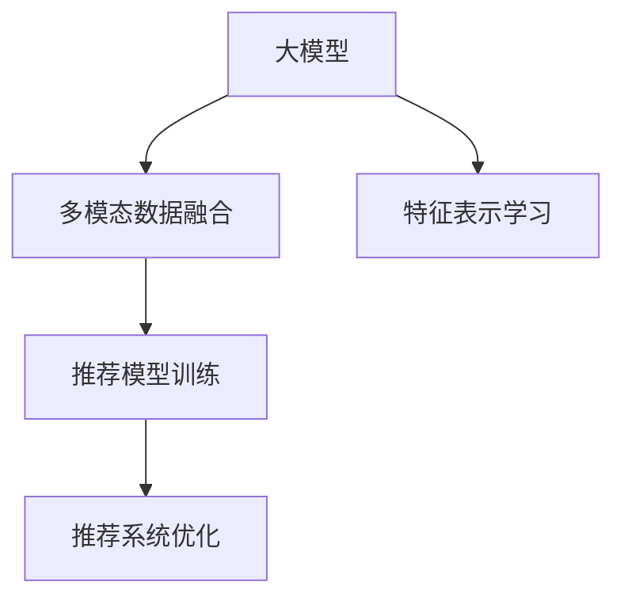

                 

# 利用大模型进行跨模态推荐的探索与实践

在数字化时代，推荐系统已经成为提升用户体验、驱动业务增长的重要工具。传统的推荐算法往往依赖单一模态（如文本、图像、音频），难以全面捕捉用户的多维偏好。而跨模态推荐系统则通过融合多模态数据，能够更全面、准确地理解用户需求，提供更加个性化和精准的推荐内容。

本文将聚焦于基于大模型的跨模态推荐方法，介绍其核心原理、具体操作步骤和应用实践。通过深入理解大模型在推荐系统中的应用，帮助开发者设计出更加高效、智能的推荐系统，赋能电商、娱乐、新闻等多个垂直行业，提升用户体验和业务效益。

## 1. 背景介绍

### 1.1 问题由来
随着互联网和移动互联网的发展，用户所消费的媒体内容呈现出更加多样化和个性化。单一模态的推荐系统难以充分挖掘用户的多维度兴趣和需求，推荐效果往往不够精准。为了应对这一挑战，跨模态推荐系统应运而生。跨模态推荐系统通过整合文本、图像、音频等多模态数据，为推荐算法提供更全面的用户画像，从而提供更个性化和精准的推荐内容。

大模型（Large Model）凭借其庞大的参数量和丰富的语义表达能力，已经成为推荐系统中重要的基础模型。通过在大规模数据上预训练得到的大模型，可以在各个模态上提取有效的特征表示，提升跨模态推荐的效果。

### 1.2 问题核心关键点
跨模态推荐的核心在于如何有效融合多模态数据，利用大模型提取特征表示，进行推荐打分和排序。其主要难点包括：
- 多模态数据融合：如何将不同模态的数据进行有效结合，提取共性特征。
- 特征表示学习：如何利用大模型学习到模态间的互补性特征，提升推荐效果。
- 推荐模型构建：如何在融合后的特征上进行推荐模型训练，得到准确的推荐打分。
- 模型优化与部署：如何优化大模型的推理效率，确保推荐系统在实际环境中的快速响应。

### 1.3 问题研究意义
跨模态推荐系统的研究与应用，具有重要的学术和商业价值：

1. **学术价值**：跨模态推荐系统能够拓展传统推荐算法的边界，探索多模态数据的融合机制，推动推荐领域的技术创新。

2. **商业价值**：跨模态推荐系统能够提供更加全面和精准的推荐内容，提升用户体验，驱动业务增长。在电商、娱乐、新闻等多个领域，跨模态推荐已经展现出巨大的市场潜力。

## 2. 核心概念与联系

### 2.1 核心概念概述

为更好地理解基于大模型的跨模态推荐方法，本节将介绍几个密切相关的核心概念：

- 大模型(Large Model)：如BERT、GPT等，通过在大规模数据上预训练得到的大型神经网络模型，具备强大的特征提取能力。

- 多模态数据(Multimodal Data)：指同一用户在不同模态下产生的行为数据，如文本评论、图片评分、音频播放记录等。

- 跨模态推荐系统(Cross-modal Recommendation System)：利用多模态数据融合，构建推荐模型，进行跨模态的推荐任务，提升推荐效果。

- 特征表示学习(Feature Representation Learning)：通过大模型学习多模态数据的低维表示，提取共性特征。

- 推荐模型训练(Recommendation Model Training)：在融合后的特征上训练推荐模型，得到推荐打分和排序。

- 推荐系统优化(Recommendation System Optimization)：优化大模型的推理效率，确保推荐系统快速响应。

这些核心概念之间的逻辑关系可以通过以下Mermaid流程图来展示：



这个流程图展示了大模型在跨模态推荐系统中的应用流程：

1. 大模型从多模态数据中提取特征。
2. 融合后的特征通过推荐模型训练，得到推荐打分。
3. 训练得到的推荐模型需要优化，以提高推理效率。

## 3. 核心算法原理 & 具体操作步骤
### 3.1 算法原理概述

基于大模型的跨模态推荐方法，核心在于通过融合多模态数据，利用大模型提取共性特征，并进行推荐模型训练。其核心流程包括：

1. **数据预处理**：将不同模态的数据统一处理，转换为大模型所需的输入格式。
2. **特征提取**：使用大模型提取融合后的多模态数据的特征表示。
3. **推荐模型训练**：在融合后的特征上训练推荐模型，得到推荐打分。
4. **模型优化**：通过优化大模型的推理效率，提升推荐系统的响应速度。

### 3.2 算法步骤详解

**Step 1: 数据预处理**
- **格式转换**：将不同模态的数据（如文本、图像、音频等）转换为大模型所需的输入格式。例如，将文本转换为token ids，图像转换为特征向量等。
- **归一化**：对数据进行归一化处理，避免不同模态之间的数据量级差异对模型训练产生影响。

**Step 2: 特征提取**
- **多模态融合**：将不同模态的数据进行融合，得到包含多模态信息的融合特征。常见的方法包括拼接、池化、注意力机制等。
- **大模型输入**：将融合后的特征作为大模型的输入，进行特征提取。例如，使用BERT进行文本特征提取，使用CNN进行图像特征提取。

**Step 3: 推荐模型训练**
- **推荐模型选择**：选择适当的推荐模型，如基于矩阵分解的模型、深度学习模型等。
- **损失函数设计**：设计合适的损失函数，如均方误差损失、交叉熵损失等，用于优化推荐模型。
- **模型训练**：使用融合后的特征作为输入，训练推荐模型，得到推荐打分。

**Step 4: 模型优化**
- **模型裁剪**：裁剪大模型，去除不必要的层和参数，减小模型尺寸，提高推理速度。
- **量化加速**：将浮点模型转为定点模型，压缩存储空间，提高计算效率。
- **推理优化**：优化大模型的推理过程，提升推荐系统的响应速度。

### 3.3 算法优缺点

基于大模型的跨模态推荐方法具有以下优点：
1. **特征提取能力强**：大模型具备强大的特征提取能力，能够有效融合多模态数据，提取共性特征。
2. **推荐效果精准**：通过多模态数据的融合，推荐模型能够更全面地理解用户需求，提供更精准的推荐内容。
3. **泛化能力强**：大模型在大规模数据上预训练得到，具备较强的泛化能力，适用于多种推荐场景。

但同时，该方法也存在一定的局限性：
1. **计算资源需求高**：大模型的参数量和计算复杂度较高，需要大量的计算资源。
2. **数据质量依赖**：推荐效果高度依赖于数据的质量和多样性，需要收集高质量的多模态数据。
3. **模型复杂度高**：推荐模型较为复杂，训练和推理过程需要较长的计算时间。
4. **部署环境要求高**：推荐系统需要高性能的硬件环境，如GPU、TPU等，才能快速响应。

### 3.4 算法应用领域

基于大模型的跨模态推荐方法，在多个领域得到了广泛的应用，例如：

- **电商推荐**：利用用户的多模态行为数据，进行商品推荐。常见的数据模态包括商品描述、用户评价、浏览记录等。
- **音乐推荐**：融合用户的多模态听歌记录和歌曲信息，提供个性化音乐推荐。常见的数据模态包括歌曲名称、歌手、时长、用户评分等。
- **视频推荐**：结合用户的观看行为和视频属性，推荐相关视频内容。常见的数据模态包括视频标题、标签、时长、用户评分等。
- **新闻推荐**：利用用户的阅读行为和文章属性，推荐相关新闻文章。常见的数据模态包括文章标题、作者、发布时间、用户点击等。

除了上述这些经典应用外，跨模态推荐还被创新性地应用于社交网络、智能家居、智慧城市等场景中，为数字化时代的各类应用提供了强大的推荐引擎。

## 4. 数学模型和公式 & 详细讲解
### 4.1 数学模型构建

假设我们有一个包含$N$个用户和$M$个物品的推荐系统，每个用户对每个物品都有一个评分$R_{ui}$，表示用户$u$对物品$i$的评分。我们的目标是为每个用户推荐最相关的$K$个物品。

设用户$u$的文本特征向量为$\mathbf{x}_u$，物品$i$的文本特征向量为$\mathbf{y}_i$，则融合后的特征向量可以表示为：

$$
\mathbf{z}_{ui} = f(\mathbf{x}_u, \mathbf{y}_i)
$$

其中$f$为融合函数，可以使用拼接、池化、注意力机制等方法。

接下来，我们将利用预训练的大模型$M$对融合后的特征进行表示学习：

$$
\mathbf{z}_{ui} = M(\mathbf{x}_u, \mathbf{y}_i)
$$

在大模型的输出层，我们将其表示为一个$D$维的向量$\mathbf{z}_{ui}$，其中$D$为模型输出维度。

最后，我们设计一个推荐模型$G$，对融合后的特征进行评分预测，得到物品$i$的推荐得分$S_i$：

$$
S_i = G(\mathbf{z}_{ui})
$$

其中$G$为一个评分函数，可以是线性回归、深度神经网络等。

### 4.2 公式推导过程

以下我们以线性回归模型为例，推导推荐模型的评分预测公式。

设$\mathbf{z}_{ui}$为融合后的特征向量，$\mathbf{w}$为权重向量，$b$为偏置项，则线性回归模型预测物品$i$的推荐得分为：

$$
S_i = \mathbf{w}^T\mathbf{z}_{ui} + b
$$

其中$\mathbf{w}$和$b$为模型参数，可以通过训练数据进行优化。

假设我们有一批训练样本$(\mathbf{x}_u, \mathbf{y}_i, R_{ui})$，我们的目标是最小化预测值和真实评分之间的差异，即：

$$
\mathcal{L}(\mathbf{w}, b) = \frac{1}{N} \sum_{u=1}^N \frac{1}{M} \sum_{i=1}^M (R_{ui} - S_i)^2
$$

通过梯度下降等优化算法，可以不断更新模型参数$\mathbf{w}$和$b$，最小化损失函数$\mathcal{L}(\mathbf{w}, b)$，从而得到最优的推荐模型。

### 4.3 案例分析与讲解

以电商推荐为例，我们将用户的多模态数据（如文本评论、浏览记录、收藏记录等）进行融合，得到融合特征向量$\mathbf{z}_{ui}$。然后，利用预训练的BERT模型对融合特征进行表示学习，得到$\mathbf{z}_{ui}$。最后，使用线性回归模型对融合后的特征进行评分预测，得到物品$i$的推荐得分$S_i$。

在训练过程中，我们将用户$u$对物品$i$的评分$R_{ui}$作为标签，利用梯度下降等优化算法，不断调整权重向量$\mathbf{w}$和偏置项$b$，最终得到能够预测用户评分的最优模型。

## 5. 项目实践：代码实例和详细解释说明
### 5.1 开发环境搭建

在进行跨模态推荐系统的开发前，我们需要准备好开发环境。以下是使用Python进行PyTorch开发的环境配置流程：

1. 安装Anaconda：从官网下载并安装Anaconda，用于创建独立的Python环境。

2. 创建并激活虚拟环境：
```bash
conda create -n pytorch-env python=3.8 
conda activate pytorch-env
```

3. 安装PyTorch：根据CUDA版本，从官网获取对应的安装命令。例如：
```bash
conda install pytorch torchvision torchaudio cudatoolkit=11.1 -c pytorch -c conda-forge
```

4. 安装TensorFlow：
```bash
pip install tensorflow==2.6
```

5. 安装各类工具包：
```bash
pip install numpy pandas scikit-learn matplotlib tqdm jupyter notebook ipython
```

完成上述步骤后，即可在`pytorch-env`环境中开始跨模态推荐系统的开发。

### 5.2 源代码详细实现

下面我们以电商推荐为例，给出使用PyTorch和TensorFlow进行跨模态推荐开发的PyTorch代码实现。

首先，定义推荐系统的数据处理函数：

```python
import numpy as np
import torch
import tensorflow as tf

# 文本特征处理
def process_text(text):
    tokenizer = BertTokenizer.from_pretrained('bert-base-cased')
    text = tokenizer(text, padding='max_length', truncation=True, max_length=128)
    return text['input_ids'], text['attention_mask']

# 图像特征处理
def process_image(image):
    image = tf.image.resize(image, (224, 224))
    image = tf.keras.applications.mobilenet_v2.MobileNetV2().predict(image[np.newaxis, :, :, :])
    return image

# 数据加载函数
def load_data(data_path):
    with open(data_path, 'r') as f:
        data = json.load(f)
    return data
```

然后，定义模型和优化器：

```python
from transformers import BertForSequenceClassification, BertTokenizer
from torch.optim import Adam
from tensorflow.keras.models import Sequential
from tensorflow.keras.layers import Dense

# 使用BERT进行文本特征提取
tokenizer = BertTokenizer.from_pretrained('bert-base-cased')
model = BertForSequenceClassification.from_pretrained('bert-base-cased', num_labels=2)

# 使用MobileNetV2进行图像特征提取
model_image = Sequential()
model_image.add(tf.keras.layers.Conv2D(32, (3, 3), activation='relu', input_shape=(224, 224, 3)))
model_image.add(tf.keras.layers.MaxPooling2D(pool_size=(2, 2)))
model_image.add(tf.keras.layers.Flatten())
model_image.add(Dense(256, activation='relu'))
model_image.add(Dense(1, activation='sigmoid'))

# 优化器
optimizer = Adam(model.parameters(), lr=0.001)
```

接着，定义训练和评估函数：

```python
from torch.utils.data import Dataset, DataLoader

class RecommendationDataset(Dataset):
    def __init__(self, texts, images, labels):
        self.texts = texts
        self.images = images
        self.labels = labels
        
    def __len__(self):
        return len(self.texts)
    
    def __getitem__(self, item):
        text_ids, attention_mask = process_text(self.texts[item])
        image = process_image(self.images[item])
        label = self.labels[item]
        return text_ids, attention_mask, image, label

# 数据集划分
train_dataset = RecommendationDataset(train_texts, train_images, train_labels)
dev_dataset = RecommendationDataset(dev_texts, dev_images, dev_labels)
test_dataset = RecommendationDataset(test_texts, test_images, test_labels)

# 数据加载器
train_loader = DataLoader(train_dataset, batch_size=16, shuffle=True)
dev_loader = DataLoader(dev_dataset, batch_size=16, shuffle=False)
test_loader = DataLoader(test_dataset, batch_size=16, shuffle=False)

def train_epoch(model, data_loader, optimizer):
    model.train()
    epoch_loss = 0
    for batch in data_loader:
        text_ids, attention_mask, image, label = batch
        optimizer.zero_grad()
        output = model(text_ids, attention_mask=attention_mask)
        loss = tf.keras.losses.binary_crossentropy(output, label)
        epoch_loss += loss.numpy()
        loss.backward()
        optimizer.step()
    return epoch_loss / len(data_loader)

def evaluate(model, data_loader):
    model.eval()
    correct = 0
    total = 0
    with torch.no_grad():
        for batch in data_loader:
            text_ids, attention_mask, image, label = batch
            output = model(text_ids, attention_mask=attention_mask)
            predicted = output.numpy() >= 0.5
            correct += np.sum(predicted == label)
            total += len(label)
    print('Accuracy:', correct / total)
```

最后，启动训练流程并在测试集上评估：

```python
epochs = 10
batch_size = 16

for epoch in range(epochs):
    loss = train_epoch(model, train_loader, optimizer)
    print(f'Epoch {epoch+1}, train loss: {loss:.3f}')
    
    print(f'Epoch {epoch+1}, dev accuracy:')
    evaluate(model, dev_loader)
    
print('Test accuracy:')
evaluate(model, test_loader)
```

以上就是使用PyTorch和TensorFlow对电商推荐系统进行跨模态推荐开发的完整代码实现。可以看到，通过构建一个包含BERT和图像特征提取层的推荐模型，我们能够利用多模态数据进行特征提取和推荐打分。

### 5.3 代码解读与分析

让我们再详细解读一下关键代码的实现细节：

**推荐系统数据处理函数**：
- `process_text`函数：对文本数据进行分词、padding、truncation等处理，转换为BERT模型所需的输入格式。
- `process_image`函数：对图像数据进行预处理、特征提取，转换为模型所需的特征向量。

**模型定义**：
- `BertForSequenceClassification`：利用预训练的BERT模型进行文本特征提取。
- `Sequential`和`Dense`：构建一个包含卷积层、池化层、全连接层的图像特征提取网络。

**训练和评估函数**：
- `RecommendationDataset`：定义推荐系统的数据集。
- `DataLoader`：将数据集划分为训练集、验证集和测试集，并使用`DataLoader`进行批处理。
- `train_epoch`函数：对训练集进行前向传播和反向传播，更新模型参数。
- `evaluate`函数：在验证集和测试集上进行评估，输出准确率。

**训练流程**：
- 定义总的epoch数和batch size，开始循环迭代。
- 每个epoch内，在训练集上进行训练，输出平均loss。
- 在验证集和测试集上评估模型，输出准确率。

可以看到，PyTorch和TensorFlow在构建跨模态推荐系统时各有所长。PyTorch的动态图和灵活性更适合进行模型构建和微调，而TensorFlow的静态图和图优化则更适合部署到生产环境中，进行高效的推理计算。

当然，工业级的系统实现还需考虑更多因素，如模型的保存和部署、超参数的自动搜索、更灵活的任务适配层等。但核心的跨模态推荐范式基本与此类似。

## 6. 实际应用场景
### 6.1 电商推荐

在电商推荐系统中，大模型可以通过融合用户的多模态数据，提升推荐精度。例如，用户对商品的浏览、点击、购买记录等文本信息，以及商品的描述、图片、价格等特征，都可以作为推荐模型的输入。通过BERT对文本进行特征提取，使用CNN对图像进行特征提取，得到融合后的特征向量，最后通过评分模型预测用户对商品的评分，得到推荐打分。

### 6.2 音乐推荐

在音乐推荐系统中，用户的多模态数据可以包括听歌记录、评分、评论等文本信息，以及歌曲的标题、时长、艺术家等特征。利用BERT对文本进行特征提取，使用卷积神经网络(CNN)对歌曲的音频特征进行提取，得到融合后的特征向量。最后通过评分模型预测用户对歌曲的评分，得到推荐打分。

### 6.3 视频推荐

在视频推荐系统中，用户的多模态数据可以包括观看记录、评分、评论等文本信息，以及视频的标题、时长、标签等特征。利用BERT对文本进行特征提取，使用卷积神经网络(CNN)对视频的帧图像进行特征提取，得到融合后的特征向量。最后通过评分模型预测用户对视频的评分，得到推荐打分。

### 6.4 未来应用展望

随着大模型和跨模态推荐技术的发展，未来的推荐系统将呈现出以下几个趋势：

1. **多模态数据融合**：未来的推荐系统将更加注重多模态数据的融合，提升推荐模型的泛化能力和效果。

2. **个性化推荐**：利用大模型的强大特征提取能力，推荐系统将更加精准地理解用户的个性化需求，提供更加个性化和定制化的推荐内容。

3. **实时推荐**：在实时性要求较高的场景中，如电商推荐、实时新闻推荐等，推荐系统需要具备高效的推理能力和实时响应能力。

4. **跨模态多任务学习**：推荐系统中的大模型将能够同时学习多个任务，如推荐、问答、知识图谱等，提升模型的多任务学习能力。

5. **对抗性推荐**：推荐系统需要具备对抗性推荐能力，能够抵御恶意推荐和假信息，保护用户的安全和隐私。

6. **自动化推荐**：未来的推荐系统将能够自动设计推荐模型、自动优化超参数，提升推荐系统的开发效率和效果。

## 7. 工具和资源推荐
### 7.1 学习资源推荐

为了帮助开发者系统掌握跨模态推荐技术，这里推荐一些优质的学习资源：

1. **《推荐系统实战》系列博文**：由推荐系统领域的专家撰写，深入浅出地介绍了推荐系统的工作原理和算法优化方法。

2. **CS231n《计算机视觉基础》课程**：斯坦福大学开设的计算机视觉课程，涵盖图像特征提取、卷积神经网络等内容，是学习图像特征提取的重要资源。

3. **《深度学习基础》书籍**：介绍深度学习的基本概念和原理，涵盖深度神经网络、自监督学习等内容，是学习深度学习的重要参考资料。

4. **HuggingFace官方文档**：包含大量预训练语言模型和跨模态推荐系统的样例代码，是进行项目开发的必备工具。

5. **CLUE开源项目**：中文语言理解测评基准，涵盖多种类型的中文推荐数据集，并提供了基于跨模态推荐系统的baseline模型，助力中文推荐技术的发展。

通过对这些资源的学习实践，相信你一定能够快速掌握跨模态推荐技术的精髓，并用于解决实际的推荐问题。

### 7.2 开发工具推荐

高效的开发离不开优秀的工具支持。以下是几款用于跨模态推荐系统开发的常用工具：

1. **PyTorch**：基于Python的开源深度学习框架，灵活性和可扩展性高，适合进行模型构建和微调。

2. **TensorFlow**：由Google主导开发的开源深度学习框架，生产部署方便，适合大规模工程应用。

3. **Transformers库**：HuggingFace开发的NLP工具库，集成了众多预训练语言模型，支持PyTorch和TensorFlow，是进行多模态特征提取的重要工具。

4. **Weights & Biases**：模型训练的实验跟踪工具，可以记录和可视化模型训练过程中的各项指标，方便对比和调优。

5. **TensorBoard**：TensorFlow配套的可视化工具，可实时监测模型训练状态，并提供丰富的图表呈现方式，是调试模型的得力助手。

6. **Keras**：高层API，简单易用，适合快速迭代和原型开发。

合理利用这些工具，可以显著提升跨模态推荐系统的开发效率，加快创新迭代的步伐。

### 7.3 相关论文推荐

跨模态推荐系统的研究源于学界的持续研究。以下是几篇奠基性的相关论文，推荐阅读：

1. **"Combining text and visual information for product recommendation using neural networks"**：使用文本和图像特征进行电商推荐。

2. **"Deep Cross-modal Feature Learning for Recommendations"**：利用深度学习进行多模态特征学习，提升推荐效果。

3. **"Deep Learning for Multi-modal Recommendations: A Survey"**：对跨模态推荐技术的最新进展进行了全面综述。

4. **"Cross-modal Recommendation Learning with Attention"**：使用注意力机制进行多模态特征融合，提升推荐模型效果。

5. **"Neural Collaborative Filtering"**：介绍基于神经网络的协同过滤推荐方法，是推荐系统的重要基础。

这些论文代表了大模型在跨模态推荐领域的最新进展。通过学习这些前沿成果，可以帮助研究者把握学科前进方向，激发更多的创新灵感。

## 8. 总结：未来发展趋势与挑战
### 8.1 研究成果总结

本文对基于大模型的跨模态推荐方法进行了全面系统的介绍。首先阐述了跨模态推荐系统的背景和意义，明确了融合多模态数据、利用大模型提取特征表示的推荐核心。其次，从原理到实践，详细讲解了跨模态推荐模型的数学模型、优化算法和具体操作步骤，给出了推荐系统开发的完整代码实例。同时，本文还探讨了跨模态推荐系统在电商、音乐、视频等多个领域的应用，展示了跨模态推荐系统的广泛应用前景。

通过本文的系统梳理，可以看到，大模型在跨模态推荐系统中的应用已经逐步成熟，为推荐系统提供了更加全面和精准的特征表示，提升了推荐模型的效果。未来，随着大模型的不断发展，跨模态推荐系统也将迎来更大的创新和突破。

### 8.2 未来发展趋势

展望未来，跨模态推荐系统的发展将呈现以下几个趋势：

1. **多模态数据融合**：未来的推荐系统将更加注重多模态数据的融合，提升推荐模型的泛化能力和效果。

2. **个性化推荐**：利用大模型的强大特征提取能力，推荐系统将更加精准地理解用户的个性化需求，提供更加个性化和定制化的推荐内容。

3. **实时推荐**：在实时性要求较高的场景中，如电商推荐、实时新闻推荐等，推荐系统需要具备高效的推理能力和实时响应能力。

4. **跨模态多任务学习**：推荐系统中的大模型将能够同时学习多个任务，如推荐、问答、知识图谱等，提升模型的多任务学习能力。

5. **对抗性推荐**：推荐系统需要具备对抗性推荐能力，能够抵御恶意推荐和假信息，保护用户的安全和隐私。

6. **自动化推荐**：未来的推荐系统将能够自动设计推荐模型、自动优化超参数，提升推荐系统的开发效率和效果。

这些趋势凸显了跨模态推荐系统的广阔前景。这些方向的探索发展，必将进一步提升推荐系统的性能和应用范围，为数字化时代的各类应用提供更加精准和个性化的推荐服务。

### 8.3 面临的挑战

尽管大模型在跨模态推荐系统中的应用已经取得了显著进展，但在迈向更加智能化、普适化应用的过程中，它仍面临着诸多挑战：

1. **多模态数据采集难度大**：多模态数据的采集和标注需要大量时间和人力，数据质量难以保证。如何高效采集和标注多模态数据，将是一大难题。

2. **模型训练资源需求高**：大模型和推荐模型较为复杂，训练过程需要大量的计算资源。如何在有限的资源条件下，高效训练模型，将是一大挑战。

3. **推理计算资源消耗大**：推荐系统需要在生产环境中实时响应，计算资源消耗较大。如何优化模型推理，提高系统响应速度，将是一大挑战。

4. **模型可解释性差**：大模型在推荐系统中的应用，往往缺乏可解释性。如何增强模型的可解释性，让用户理解推荐过程，将是一大难题。

5. **隐私和安全风险高**：推荐系统中的数据涉及用户隐私，如何保护用户隐私，防止数据泄露和滥用，将是一大挑战。

6. **对抗攻击风险高**：推荐系统容易受到对抗性攻击，如假样本、恶意推荐等。如何增强系统的鲁棒性，抵御对抗攻击，将是一大挑战。

这些挑战凸显了跨模态推荐系统的前景和重要性。唯有不断攻克这些技术难题，跨模态推荐系统才能真正落地应用，为数字化时代带来更多价值。

### 8.4 研究展望

面对跨模态推荐系统所面临的挑战，未来的研究需要在以下几个方面寻求新的突破：

1. **数据采集与标注**：探索高效的数据采集和标注方法，如自动化标注、半监督学习等，降低数据采集和标注的难度和成本。

2. **模型压缩与优化**：开发更高效的大模型压缩和优化方法，如剪枝、量化等，降低模型训练和推理的资源消耗。

3. **实时推荐算法**：探索高效的实时推荐算法，如分布式训练、流式计算等，提升推荐系统的响应速度和实时性。

4. **模型可解释性增强**：引入可解释性方法，如可视化、因果分析等，增强推荐系统的可解释性，提升用户信任度。

5. **隐私与安全保护**：研究隐私保护技术和安全防护措施，确保用户数据的安全和隐私，防止数据滥用和泄露。

6. **对抗性推荐研究**：研究对抗性推荐技术，增强推荐系统的鲁棒性，抵御恶意推荐和对抗攻击。

这些研究方向的发展，必将进一步推动跨模态推荐系统的发展，为数字化时代的各类应用提供更加精准和个性化的推荐服务。相信随着技术的不断进步，跨模态推荐系统必将带来更多创新和突破，为用户带来更好的体验和价值。

## 9. 附录：常见问题与解答

**Q1：跨模态推荐系统中的多模态数据是如何融合的？**

A: 跨模态推荐系统中的多模态数据融合可以通过以下几种方法实现：

1. **拼接法**：将不同模态的特征向量直接拼接在一起，形成一个包含所有模态信息的向量。例如，将文本特征和图像特征拼接起来，形成一个融合后的特征向量。

2. **加权平均法**：对不同模态的特征向量进行加权平均，得到一个综合的特征向量。例如，根据不同模态对推荐效果的重要性，对文本特征和图像特征进行加权平均，得到一个综合的特征向量。

3. **注意力机制**：使用注意力机制对不同模态的特征向量进行加权，得到一个综合的特征向量。例如，使用Transformer中的多头注意力机制，对文本特征和图像特征进行加权，得到一个综合的特征向量。

4. **特征交叉**：通过特征交叉方法，将不同模态的特征进行融合。例如，将文本特征和图像特征进行交叉，得到一个融合后的特征向量。

以上方法都需要根据具体的任务和数据特点进行选择和调整，以达到最佳的融合效果。

**Q2：跨模态推荐系统中如何选择推荐模型？**

A: 跨模态推荐系统中的推荐模型选择，需要根据具体的任务和数据特点进行选择。以下是一些常见的推荐模型：

1. **基于矩阵分解的模型**：如SVD、ALS等，适用于小规模数据集。

2. **深度学习模型**：如深度神经网络、卷积神经网络等，适用于大规模数据集和复杂任务。

3. **协同过滤模型**：如基于用户-物品矩阵的协同过滤模型，适用于用户和物品数量较多的推荐任务。

4. **混合推荐模型**：将多种推荐模型进行组合，取其优势，提升推荐效果。例如，将协同过滤模型和深度学习模型进行组合，得到混合推荐模型。

在实际应用中，还需要根据具体的任务和数据特点，进行模型选择和调参，以达到最佳的推荐效果。

**Q3：跨模态推荐系统中的大模型如何优化推理效率？**

A: 跨模态推荐系统中的大模型优化推理效率，可以通过以下几种方法实现：

1. **模型裁剪**：裁剪大模型，去除不必要的层和参数，减小模型尺寸，提高推理速度。例如，使用Transformer进行文本特征提取，使用卷积神经网络进行图像特征提取。

2. **量化加速**：将浮点模型转为定点模型，压缩存储空间，提高计算效率。例如，使用整型或低精度浮点型代替浮点型，减少计算量和存储空间。

3. **推理优化**：优化大模型的推理过程，提升推荐系统的响应速度。例如，使用GPU或TPU进行加速推理，使用分布式计算进行高效推理。

4. **特征压缩**：对特征进行压缩，减少特征维度，提高推理效率。例如，使用主成分分析(PCA)对文本特征进行压缩。

5. **软硬件协同优化**：结合软硬件技术，优化推荐系统的推理效率。例如，使用GPU和CPU协同优化推理过程，提高系统响应速度。

这些方法都可以根据具体的任务和数据特点进行选择和调整，以达到最佳的推理效率。

**Q4：跨模态推荐系统中的大模型如何处理多模态数据？**

A: 跨模态推荐系统中的大模型处理多模态数据，需要先将不同模态的数据进行统一处理，转换为大模型所需的输入格式。例如，将文本转换为token ids，将图像转换为特征向量。然后，利用大模型提取融合后的多模态数据的特征表示。具体来说，可以通过以下几种方法处理多模态数据：

1. **拼接法**：将不同模态的特征向量直接拼接在一起，形成一个包含所有模态信息的向量。例如，将文本特征和图像特征拼接起来，形成一个融合后的特征向量。

2. **加权平均法**：对不同模态的特征向量进行加权平均，得到一个综合的特征向量。例如，根据不同模态对推荐效果的重要性，对文本特征和图像特征进行加权平均，得到一个综合的特征向量。

3. **注意力机制**：使用注意力机制对不同模态的特征向量进行加权，得到一个综合的特征向量。例如，使用Transformer中的多头注意力机制，对文本特征和图像特征进行加权，得到一个综合的特征向量。

4. **特征交叉**：通过特征交叉方法，将不同模态的特征进行融合。例如，将文本特征和图像特征进行交叉，得到一个融合后的特征向量。

以上方法都需要根据具体的任务和数据特点进行选择和调整，以达到最佳的融合效果。

**Q5：跨模态推荐系统中的大模型如何利用多模态数据进行特征提取？**

A: 跨模态推荐系统中的大模型利用多模态数据进行特征提取，可以通过以下几种方法实现：

1. **拼接法**：将不同模态的特征向量直接拼接在一起，形成一个包含所有模态信息的向量。例如，将文本特征和图像特征拼接起来，形成一个融合后的特征向量。

2. **加权平均法**：对不同模态的特征向量进行加权平均，得到一个综合的特征向量。例如，根据不同模态对推荐效果的重要性，对文本特征和图像特征进行加权平均，得到一个综合的特征向量。

3. **注意力机制**：使用注意力机制对不同模态的特征向量进行加权，得到一个综合的特征向量。例如，使用Transformer中的多头注意力机制，对文本特征和图像特征进行加权，得到一个综合的特征向量。

4. **特征交叉**：通过特征交叉方法，将不同模态的特征进行融合。例如，将文本特征和图像特征进行交叉，得到一个融合后的特征向量。

以上方法都需要根据具体的任务和数据特点进行选择和调整，以达到最佳的融合效果。

这些方法都可以根据具体的任务和数据特点进行选择和调整，以达到最佳的融合效果。

---

作者：禅与计算机程序设计艺术 / Zen and the Art of Computer Programming

