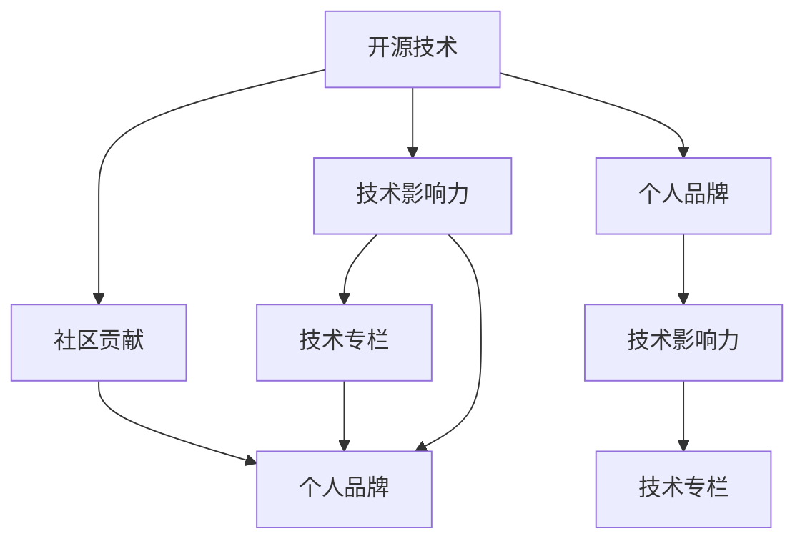

                 

# 利用开源影响力获得技术专栏作者机会

> 关键词：开源技术、影响力、技术专栏、社区贡献、个人品牌

## 1. 背景介绍

### 1.1 问题由来
在当今快速发展的技术环境中，开源项目成为技术交流与合作的重要平台。无数开发者在这里分享代码、讨论技术，构建了一个庞大的知识生态系统。然而，即使有无数优质的技术资源，技术传播和学习的效率仍受限于传统的新闻媒体、博客等形式。技术的传播与学习方式亟需变革，开源技术的深度展示与讨论成为必要。

在此背景下，技术专栏成为一种新的内容形态，它不仅能深入探讨技术原理，还能交流实践经验，引发社区讨论，甚至推动技术进步。技术专栏不仅能增强个人的技术影响力，还能促进开源社区的健康发展。

### 1.2 问题核心关键点
如何利用开源影响力获得技术专栏作者机会，成为技术传播和学习的关键。本文将围绕这一主题，通过深度剖析技术专栏的核心要素，并结合开源技术的现状和趋势，探讨如何最大化开源影响力，从而获得技术专栏作者的机会。

## 2. 核心概念与联系

### 2.1 核心概念概述

为了更好地理解如何利用开源影响力获得技术专栏作者机会，本节将介绍几个关键概念：

- 开源技术（Open Source Technology）：指公开其源代码，允许任何人在任何时间、任何地点、任何方式修改和重新分发的技术。
- 技术专栏（Technology Column）：指以技术为主题的在线内容形式，覆盖技术原理、应用案例、开发经验等多个方面。
- 社区贡献（Community Contribution）：指开发者通过参与开源项目，贡献代码、文档、讨论等形式，为社区带来价值的行动。
- 技术影响力（Technical Influence）：指开发者通过分享知识、解决问题、创新技术等行为，在社区内外的知名度和影响力。
- 个人品牌（Personal Brand）：指开发者通过展示其在技术领域的专业能力和独特见解，建立和维护的自我形象。

这些概念之间的逻辑关系可以通过以下Mermaid流程图来展示：



这个流程图展示了一些关键概念及其之间的关系：

1. 开源技术是社区贡献的基础，社区贡献是技术影响力的来源。
2. 技术影响力是个人品牌的一部分，而个人品牌是技术专栏作者的重要属性。
3. 开源技术通过社区贡献和影响力，最终转化为技术专栏的内容，促进个人品牌的塑造。

## 3. 核心算法原理 & 具体操作步骤
### 3.1 算法原理概述

要利用开源影响力获得技术专栏作者机会，首先需要理解和应用影响力和专栏的相互作用机制。这一过程可以简化为以下步骤：

1. 通过社区贡献，积累技术影响力。
2. 将影响力转化为专栏内容，增强个人品牌。
3. 借助专栏平台，提升技术影响力。

### 3.2 算法步骤详解

具体来说，算法步骤包括以下几个关键步骤：

**Step 1: 参与开源项目，积累技术影响力**

- 选择一个开源项目，深入参与其开发和维护。可以是贡献代码、编写文档、参与讨论、解决 bug 等。
- 确定你的技术方向，选择与自己技能匹配的项目。尽量在多个项目中活跃，但要避免过度分散精力。
- 保持持续的贡献，定期提交代码或更新文档，维持活跃度。

**Step 2: 沉淀技术内容，创作专栏**

- 总结在开源项目中的经验和教训，整理成文章，形成技术专栏。
- 文章主题应贴合社区需求，覆盖技术原理、应用场景、开发技巧等。
- 强调解决问题的独特视角和方法，并引用开源技术作为支持。

**Step 3: 投稿平台，提升影响力**

- 选择合适的技术专栏平台，如GitHub博客、知乎、CSDN、InfoQ等。
- 撰写符合平台要求的投稿文章，遵循平台规则和格式要求。
- 保持高质量的更新，定期发布新内容，保持专栏活跃度。

### 3.3 算法优缺点

利用开源影响力获得技术专栏作者机会的方法有以下优点：

1. 深度接触开源项目，获得实践经验和技术储备。
2. 利用已有影响力，快速建立个人品牌和专栏影响力。
3. 增强技术传播效果，促进技术社区的健康发展。

同时，该方法也存在一些局限性：

1. 需要大量时间和精力投入，初期积累可能缓慢。
2. 对个人能力要求高，需要具备良好的技术视野和写作能力。
3. 依赖平台和社区的认可，成功机会存在不确定性。

尽管存在这些局限性，但总体而言，利用开源影响力获得技术专栏作者机会仍是一种高效且可持续的方式。

### 3.4 算法应用领域

利用开源影响力获得技术专栏作者机会的方法不仅适用于编程语言和技术框架，还广泛适用于各种开源工具、应用程序和平台。例如：

- 开源编程语言（如Python、JavaScript）
- 开源开发框架（如Spring Boot、Flutter）
- 开源云平台（如AWS、Google Cloud）
- 开源数据处理工具（如Spark、TensorFlow）
- 开源操作系统（如Linux、Windows）

在具体应用中，开发者应选择与自身技能和兴趣匹配的开源项目，持续贡献和沉淀内容，最终通过技术专栏提升个人和开源项目的影响力。

## 4. 数学模型和公式 & 详细讲解 & 举例说明
### 4.1 数学模型构建

利用开源影响力获得技术专栏作者机会的过程，本质上是一个社区贡献、技术影响力与专栏创作之间的相互作用模型。我们可以用以下数学模型来表示这一过程：

$$
\text{Influence}_{\text{total}} = \text{Community\_Involve} \times \text{Influence}_{\text{accumulated}} \times \text{Content\_quality}
$$

其中：

- $\text{Community\_Involve}$ 代表参与社区贡献的程度。
- $\text{Influence}_{\text{accumulated}}$ 代表通过贡献积累的技术影响力。
- $\text{Content\_quality}$ 代表技术专栏内容的质量。

### 4.2 公式推导过程

从上述公式可以推导出，要最大化技术专栏的影响力，需要在社区贡献、技术影响力和内容质量三个方面进行优化。

假设有一个开发者在开源项目上的贡献度为 $C$，积累的技术影响力为 $I$，专栏内容质量为 $Q$。则总影响力为：

$$
\text{Influence}_{\text{total}} = C \times I \times Q
$$

若要最大化影响力，需要使 $C$、$I$ 和 $Q$ 同时最大化。因此，我们分别对每个变量进行优化：

1. 对于 $C$，可以通过增加参与开源项目的频率、多样性，以及提高代码质量等方式。
2. 对于 $I$，需要通过有效积累技术影响，如通过解决复杂问题、提出创新技术等。
3. 对于 $Q$，应注重内容的深度、广度和实用性，引用开源技术作为支撑，并通过高质量的撰写和编辑来提升。

### 4.3 案例分析与讲解

以一个开源项目（如TensorFlow）为例，展示如何利用开源影响力获得技术专栏作者机会：

- **Step 1: 参与开源项目**
  - 开发者参与TensorFlow项目，积极提交代码、修复 bug、优化性能等。
  - 关注项目开发动态，通过邮件、社区讨论等方式，与项目贡献者和核心开发者保持交流。

- **Step 2: 沉淀技术内容**
  - 总结在TensorFlow开发中的经验和教训，撰写关于TensorFlow模型优化、高级特性、性能调优等方面的技术文章。
  - 强调TensorFlow在实际应用中的优势和挑战，引用TensorFlow的API和设计思想作为支持。

- **Step 3: 投稿平台**
  - 在GitHub博客、Medium、CSDN等平台上发布技术文章，保持高质量的更新。
  - 通过社交媒体（如Twitter、LinkedIn）推广文章，吸引更多的读者关注和评论。

通过以上步骤，开发者不仅积累了丰富的开源经验和影响力，还建立了个人品牌，最终获得了技术专栏作者的机会。

## 5. 项目实践：代码实例和详细解释说明
### 5.1 开发环境搭建

为了实践利用开源影响力获得技术专栏作者机会，我们需要搭建一个包含开源项目、技术专栏平台和投稿环境的开发环境。以下是具体的配置步骤：

1. 安装开发工具：如Python、Git、IDE（如PyCharm、VS Code）。
2. 选择开源项目：如TensorFlow、React、Flutter等，进行项目克隆和设置。
3. 配置GitHub账号，使用GitHub Pages创建个人博客，并配置CNAME文件。
4. 配置Jekyll或 Hugo等静态网站生成工具，生成博客静态文件。
5. 部署博客至GitHub Pages，测试访问和发布效果。

### 5.2 源代码详细实现

下面以TensorFlow为例，展示如何通过参与开源项目、贡献代码和编写技术文章，获取技术专栏作者机会：

**TensorFlow项目贡献**

1. 克隆TensorFlow项目：

```bash
git clone https://github.com/tensorflow/tensorflow.git
cd tensorflow
```

2. 提交代码和修复bug：

```bash
# 创建新分支
git checkout -b new-feature

# 编写代码
# 修改代码路径: tensorflow/core/ops/my_op.cc

# 提交代码
git add .
git commit -m "Add MyOp to TensorFlow"
git push origin new-feature
```

3. 与项目贡献者互动：

```bash
# 使用GitHub Issues进行讨论
# 提交修复建议或提出改进建议
```

**技术文章创作**

1. 选定技术主题：

```bash
# 如TensorFlow模型优化、高级特性等
```

2. 撰写技术文章：

```bash
# 使用Markdown格式撰写
# 参考TensorFlow文档和API
```

3. 发布技术文章：

```bash
# 使用GitHub Pages发布
# 配置CNAME文件
# 生成静态文件并部署
```

**技术专栏投稿**

1. 选择投稿平台：

```bash
# 如GitHub博客、Medium、CSDN等
```

2. 撰写投稿文章：

```bash
# 遵循平台规则和格式要求
# 引用TensorFlow API和文档
```

3. 投稿并推广：

```bash
# 通过社交媒体推广
```

### 5.3 代码解读与分析

在以上实践中，关键在于持续参与开源项目，积累技术影响力，并利用这些影响力创作高质量的技术专栏内容。具体来说：

- **持续贡献**：需要保持高频度的代码提交和修复，积极与社区互动，积累技术影响。
- **内容质量**：技术文章应覆盖深度、广度，且具有实际应用价值，引用开源技术作为支撑。
- **推广与互动**：通过社交媒体推广技术文章，积极与读者互动，提升文章阅读量和影响力。

通过这样的实践，开发者不仅提升了技术水平，还建立了个人品牌和专栏影响力，为成为技术专栏作者打下坚实基础。

## 6. 实际应用场景
### 6.1 开源社区贡献

在开源社区中，通过持续贡献代码和文档，积累技术影响力，是获得技术专栏作者机会的重要途径。例如，参与TensorFlow社区贡献，撰写TensorFlow相关的技术文章，在GitHub博客和Medium上发布，吸引社区关注和互动，最终获得技术专栏作者的机会。

### 6.2 技术博客与个人品牌

技术博客是展示个人技术深度和广度的重要平台。通过在技术博客上撰写高质量的技术文章，吸引读者关注和互动，可以逐渐建立个人品牌。例如，可以撰写关于TensorFlow高级特性的系列文章，定期发布并推广，提升个人品牌影响力，最终获得技术专栏作者的机会。

### 6.3 技术讲座与演讲

技术讲座和演讲是展示个人技术见解和影响力的有效方式。通过参加技术会议、线上研讨会，分享技术经验和见解，可以扩大影响力。例如，可以在Meetup或TEDx等平台上进行TensorFlow相关的技术讲座，吸引更多人关注和互动，最终获得技术专栏作者的机会。

### 6.4 未来应用展望

随着技术社区和博客平台的不断发展，利用开源影响力获得技术专栏作者机会将变得更加简单和高效。未来，开发者可以通过更多元化的方式展示技术影响力，例如：

1. 利用视频平台，如YouTube、Bilibili，发布技术教程和讲解视频。
2. 参与开源社区的线上讨论，如Slack、Discord等，积极贡献和互动。
3. 利用社交媒体平台，如Twitter、LinkedIn，推广技术文章和讲座。

这些新的应用场景将进一步丰富技术传播和学习的途径，开发者可以通过更多方式展示技术影响力，获得技术专栏作者的机会。

## 7. 工具和资源推荐
### 7.1 学习资源推荐

为了帮助开发者系统掌握利用开源影响力获得技术专栏作者机会的方法，这里推荐一些优质的学习资源：

1. **《开源技术专栏作者指南》**：一本详细介绍技术专栏创作和投稿的指南，涵盖技术写作、投稿技巧等内容。
2. **GitHub官方文档**：详细介绍了如何使用GitHub Pages搭建和部署个人博客，支持静态网站生成工具和CI/CD集成。
3. **Medium博客**：一个高质量的写作平台，支持Markdown格式，并自动生成静态页面。
4. **CSDN博客**：国内领先的编程和技术社区，支持技术文章投稿和社交媒体推广。
5. **信息Q**：一个专注于技术传播和学习的平台，支持技术文章投稿和社区互动。

通过这些资源的学习和实践，相信你一定能够系统掌握利用开源影响力获得技术专栏作者机会的方法，并用于解决实际的传播和学习问题。

### 7.2 开发工具推荐

高效的开发离不开优秀的工具支持。以下是几款用于开源影响力传播和专栏创作开发的常用工具：

1. **GitHub**：全球最大的开源社区，提供代码托管、版本控制、协作开发等功能。
2. **GitHub Pages**：免费的静态网站托管服务，支持Jekyll、Hugo等静态网站生成工具。
3. **Markdown**：轻量级的文本格式，支持语法高亮和代码块，适合编写技术文章。
4. **Git**：分布式版本控制系统，支持代码管理和协作开发。
5. **IDE（如PyCharm、VS Code）**：支持代码编写和调试，提升开发效率。

合理利用这些工具，可以显著提升技术专栏的创作和投稿效率，加快内容传播的步伐。

### 7.3 相关论文推荐

开源技术传播和专栏创作领域的研究不断深入，以下是几篇奠基性的相关论文，推荐阅读：

1. **《开源技术传播与学习：理论与实践》**：详细探讨开源技术传播的机制和效果，提出技术传播的新思路。
2. **《开源社区中的个人品牌建设》**：分析开源社区中个人品牌的形成和维护，提出社区贡献与品牌建设相结合的方法。
3. **《技术博客的影响力提升策略》**：探讨技术博客影响力提升的策略，提出内容优化和社交媒体推广等方法。
4. **《利用社交媒体提升技术影响力》**：分析社交媒体在技术传播中的作用，提出通过社交媒体提升技术影响力的策略。
5. **《开源技术专栏的作者与读者互动分析》**：研究技术专栏作者与读者互动的模式，提出提升互动效果的方法。

这些论文代表了大语言模型微调技术的发展脉络。通过学习这些前沿成果，可以帮助研究者把握学科前进方向，激发更多的创新灵感。

## 8. 总结：未来发展趋势与挑战

### 8.1 总结

本文对利用开源影响力获得技术专栏作者机会的方法进行了全面系统的介绍。首先阐述了开源技术传播和专栏创作的背景和意义，明确了专栏作者机会的获取方式。其次，从原理到实践，详细讲解了开源影响力与技术专栏之间的关系，给出了技术专栏创作的完整代码实例。同时，本文还探讨了开源技术传播在技术社区中的重要性，展示了技术专栏作者的机会与挑战。

通过本文的系统梳理，可以看到，利用开源影响力获得技术专栏作者机会是开源技术传播和学习的关键途径，能显著提升技术传播的效率和效果。未来，伴随开源技术的持续发展和传播平台的不断优化，技术专栏作者的机会将更加广泛，对技术传播的影响也将更加深远。

### 8.2 未来发展趋势

展望未来，开源影响力获得技术专栏作者机会的方法将呈现以下几个发展趋势：

1. 技术传播的多元化：未来的技术传播将不局限于传统的博客和论文，将更多地通过视频、直播、播客等形式进行。
2. 社区互动的增强：技术专栏作者将更加注重与读者、社区的互动，通过讨论、问答等方式，增强技术传播的互动性和参与度。
3. 技术专栏的个性化：技术专栏将更加注重个性化内容，根据读者需求和兴趣，提供定制化的技术信息和解决方案。
4. 社交媒体的整合：技术专栏将更加整合社交媒体，通过微博、微信、Instagram等平台推广和互动，扩大传播范围。
5. 跨领域技术的融合：技术专栏将更多地融合不同领域的知识和技术，提升技术传播的深度和广度。

这些趋势将进一步丰富技术专栏的传播方式和内容形式，提升技术传播的效果和影响。

### 8.3 面临的挑战

尽管利用开源影响力获得技术专栏作者机会的方法已经取得了显著成果，但在迈向更加智能化、普适化应用的过程中，它仍面临诸多挑战：

1. 内容质量参差不齐：开源项目众多，质量参差不齐，难以筛选出高质量的技术内容。
2. 社区互动困难：技术社区的活跃度各不相同，社区贡献与互动的效果难以量化和评估。
3. 社交媒体运营复杂：社交媒体平台的规则和算法不断变化，技术专栏作者的运营难度增加。
4. 技术传播的限制：技术专栏的传播受到平台的限制，如文章篇幅、格式要求等，影响内容传播效果。
5. 个人品牌的不稳定性：技术专栏作者的个人品牌受多方面因素影响，难以保持长期稳定性。

尽管存在这些挑战，但通过不断优化和创新，技术专栏作者的机会将不断扩大，开源技术传播的效率和效果将进一步提升。

### 8.4 研究展望

面对开源影响力获得技术专栏作者机会所面临的挑战，未来的研究需要在以下几个方面寻求新的突破：

1. **内容质量的筛选与提升**：开发自动化的内容筛选和质量评估工具，提升技术专栏的传播效果。
2. **社区互动的增强与量化**：研究社区贡献与互动的量化方法，提升社区活跃度和贡献效果。
3. **社交媒体运营的优化**：研究社交媒体平台的规则和算法，提升技术专栏的运营效果。
4. **跨平台技术传播的实现**：开发跨平台的技术传播工具和平台，提升技术传播的广度和深度。
5. **个人品牌的长期管理**：研究个人品牌管理的长期策略，提升技术专栏作者的稳定性和影响力。

这些研究方向的探索，将引领技术专栏作者机会的获取方法迈向更高的台阶，为开源技术传播和学习的未来发展提供新的动力。总之，利用开源影响力获得技术专栏作者机会是一个多维度、多层次的复杂过程，需要技术社区、平台和作者共同努力，才能不断优化和提升技术传播的效率和效果。

---

作者：禅与计算机程序设计艺术 / Zen and the Art of Computer Programming

