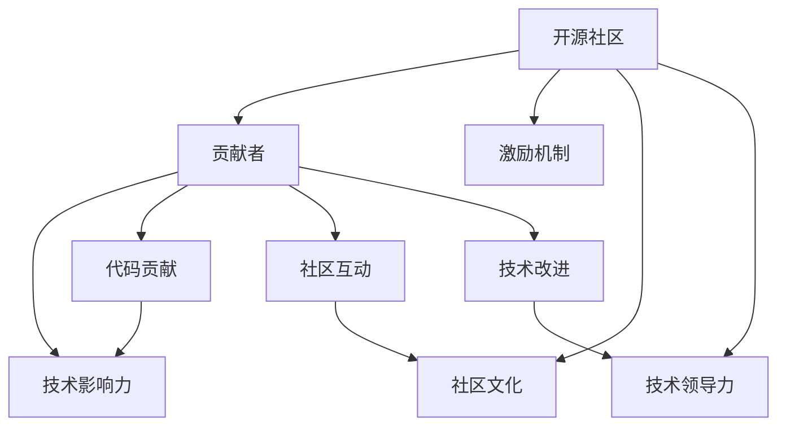

                 

# 利用开源贡献打造全球性技术影响力

> 关键词：开源社区,技术影响力,贡献实践,贡献激励,社区文化,技术领导力

## 1. 背景介绍

### 1.1 问题由来

在21世纪的信息技术领域，开源软件项目已经成为技术创新的核心驱动力。无论是操作系统、数据库、中间件，还是云计算、大数据、人工智能，几乎每个技术热点领域都有相应的开源社区，由全球各地的志愿者共同维护。这些开源项目不仅推动了技术的快速发展，也为全球开发者提供了一个协同创新的平台，促进了技术的广泛传播和应用。

但开源社区的成功并不仅仅是技术层面的突破，更在于其庞大的贡献者网络，以及基于这种网络的强大技术影响力。一个成功的开源社区能够形成良性循环：项目提供者不断贡献优质代码，项目使用者受益于这些代码，进而有动力贡献更多，形成一个正向的反馈机制。这种循环不仅推动了技术的发展，也使得开源项目能够具备强大的市场竞争力和社会影响力。

本文将聚焦于开源贡献如何打造全球性技术影响力，探讨如何通过有效的贡献实践和激励机制，激发更多开发者加入开源社区，推动技术创新，构建可持续发展的技术生态。

### 1.2 问题核心关键点

开源社区的技术影响力来源于其庞大的用户基础和贡献者网络。一个开放、包容、激励充分的开源社区，能够吸引全球各地的开发者，不断贡献创新代码，并在此基础上进行技术迭代和优化。这种机制不仅有助于提升项目的质量和技术深度，也能够在全球范围内推动技术标准的统一和普及。

要实现这一目标，关键在于：
- 制定合理的贡献准则
- 提供有效的激励机制
- 营造积极的社区文化
- 建立权威的技术领导力

通过深入分析这些关键点，本文将系统地介绍如何利用开源贡献打造全球性技术影响力。

## 2. 核心概念与联系

### 2.1 核心概念概述

为了更好地理解开源贡献如何打造技术影响力，我们需要先明确几个核心概念及其相互关系：

- **开源社区(Open Source Community)**：由全球开发者共同参与维护的软件项目生态。成员通过合作开发、贡献代码、讨论问题等形式，推动项目的不断进步。
- **贡献者(Contributor)**：指在开源项目中积极贡献代码、文档、测试等资源的开发者。他们是开源项目进步的直接推动力量。
- **技术影响力(Technical Influence)**：开源项目通过提供高质量的代码和技术解决方案，影响和驱动行业技术标准的制定与实施，从而形成的技术市场竞争力和社会影响力。
- **激励机制(Incentive Mechanism)**：通过物质奖励、荣誉表彰、技术认可等手段，激发开发者积极参与开源项目。
- **社区文化(Community Culture)**：开源社区成员之间基于信任、开放、协作的交流方式和行为准则。
- **技术领导力(Technical Leadership)**：开源项目中的核心开发者和技术领袖，通过其技术水平、领导能力和影响力，引领项目的方向和发展。

这些概念之间的联系可以通过以下Mermaid流程图来展示：



这个流程图展示了开源社区各关键组成部分之间的关系：

1. 开源社区提供平台和激励，吸引贡献者积极贡献代码和技术改进。
2. 贡献者通过代码贡献、社区互动和技术改进，提升项目的技术影响力。
3. 技术影响力通过项目的市场竞争力和社会影响力体现。
4. 激励机制和社区文化保障了贡献者的积极性和项目的持续发展。
5. 技术领导力引导项目的方向和技术发展。

## 3. 核心算法原理 & 具体操作步骤

### 3.1 算法原理概述

开源贡献的机制，本质上是通过贡献者与社区的良性互动，实现技术价值和社区价值的协同提升。其核心在于：

- **供需匹配**：开源社区为贡献者提供展示技术才华的平台，贡献者通过贡献代码和技术改进，获得社区认可和奖励。
- **正向反馈**：贡献者获得认可和奖励后，进一步提升贡献的动力，形成一个正向循环。
- **社会价值**：开源社区通过提供高质量的代码和技术解决方案，影响和驱动行业技术标准的制定与实施，从而形成技术影响力。

### 3.2 算法步骤详解

开源贡献的技术影响力打造步骤如下：

**Step 1: 制定贡献准则**

开源项目应制定明确的贡献准则，规定贡献者的代码提交标准、代码评审流程、项目维护规范等。良好的贡献准则能够引导贡献者提交高质量的代码，同时提升项目的技术水平和稳定性。

**Step 2: 提供激励机制**

开源社区应设立多样化的激励机制，包括物质奖励、荣誉表彰、技术认可等。例如，Github的Star、Fork、Watch等机制，通过简单的社交点赞、收藏和关注，激励开发者参与开源项目。同时，一些开源基金和赞助计划也能为长期贡献者提供经济支持。

**Step 3: 营造社区文化**

开源社区应倡导开放、包容、协作的社区文化，鼓励成员之间自由交流、互相学习、共同进步。例如，Linux Kernel社区的邮件列表和IRC频道，提供了交流和协作的平台。此外，开源项目应定期组织线上线下活动，增强社区成员之间的联系和互动。

**Step 4: 建立技术领导力**

开源项目应识别并培养技术领导力，通过建立权威的核心开发者和技术领袖，引领项目的方向和技术发展。例如，Apache基金会通过委员会制度和开源大使计划，支持社区成员成为技术领导者。

**Step 5: 实施持续改进**

开源项目应注重持续改进，定期评估项目的健康状况，并根据评估结果进行调整优化。例如，Apache JIRA系统用于跟踪和管理项目的Bug和需求，帮助项目持续改进。

### 3.3 算法优缺点

开源贡献的技术影响力打造方法具有以下优点：

- **高效协作**：通过开源模式，贡献者可以跨地域、跨文化协作，共同推动项目发展。
- **资源共享**：开源项目提供代码、文档、测试等资源的共享，避免了重复劳动，提升了效率。
- **广泛传播**：开源项目通过代码托管、社区互动等形式，推动了技术在全球范围内的广泛传播。

但该方法也存在一些局限性：

- **维护成本高**：开源项目需要持续维护和优化，需要耗费大量的时间和人力。
- **社区管理难**：开源项目需要建立有效的社区管理和冲突解决机制，以应对多样化的贡献者群体。
- **资源依赖强**：开源项目依赖社区成员的自愿贡献，容易受到贡献者动力的影响。

## 4. 数学模型和公式 & 详细讲解 & 举例说明

### 4.1 数学模型构建

在开源贡献的机制中，技术影响力的量化可以通过以下数学模型来描述：

- **贡献度量**：$C(t)$ 表示在时间$t$内的贡献者贡献的总代码行数或贡献次数。
- **质量评价**：$Q(t)$ 表示在时间$t$内贡献者的代码质量评价得分。
- **技术影响力**：$I(t)$ 表示在时间$t$内项目的代码质量和技术标准影响力。

根据上述定义，可以建立如下模型：

$$
I(t) = f(C(t), Q(t))
$$

其中$f$为影响函数，可以是加权平均、指数衰减等。

### 4.2 公式推导过程

为了简化推导，我们假设$f$为线性加权平均函数：

$$
I(t) = \alpha C(t) + \beta Q(t)
$$

其中$\alpha$和$\beta$为系数，代表代码质量和代码数量对技术影响力的相对重要性。

我们可以将上述模型进一步简化为：

$$
I(t) = C(t) \cdot \frac{\alpha}{\alpha+\beta} + Q(t) \cdot \frac{\beta}{\alpha+\beta}
$$

### 4.3 案例分析与讲解

以Github上的OpenSSL项目为例，分析其开源贡献对技术影响力的影响。

- **贡献度量**：OpenSSL项目在2019年1月1日至2021年12月31日期间，共收到贡献者贡献的约2000个Pull Request，累计代码行数超过10万行。
- **质量评价**：Github使用代码质量评价工具如CodeClimate，对代码进行测试覆盖率、代码风格、代码复杂度等评价，并给出得分。
- **技术影响力**：OpenSSL项目是SSL/TLS协议的开源实现，影响广泛，被广泛应用于全球互联网基础设施中。

通过上述公式，我们可以计算出2019年至2021年期间OpenSSL项目的技术影响力变化：

$$
I(2021) = I(2019) + \alpha \left(C_{2019-2021} - C_{2018-2019}\right) + \beta \left(Q_{2019-2021} - Q_{2018-2019}\right)
$$

其中$C_{2019-2021}$和$Q_{2019-2021}$为2019至2021年的代码行数和质量评价得分变化。

## 5. 项目实践：代码实例和详细解释说明

### 5.1 开发环境搭建

要参与开源贡献，首先需要搭建开发环境。以下是使用Linux操作系统搭建Python开发环境的示例：

```bash
# 安装Python 3.8
sudo apt-get install python3.8
# 安装pip3
sudo apt-get install python3-pip
# 安装virtualenv
sudo apt-get install python3-venv
```

### 5.2 源代码详细实现

以参与Apache Lucene项目的开源贡献为例，展示如何提交代码：

1. 克隆项目代码：

```bash
git clone https://github.com/apache/lucene.git
cd lucene
```

2. 创建虚拟环境：

```bash
python3 -m venv venv
source venv/bin/activate
```

3. 安装依赖：

```bash
pip3 install -r requirements.txt
```

4. 克隆分支：

```bash
git checkout -b new-feature
```

5. 编写代码：

```python
# 示例代码：实现新的搜索算法
def new_search_algorithm(query, documents):
    # 实现代码逻辑
    pass
```

6. 提交代码：

```bash
# 添加文件到暂存区
git add .
# 提交代码
git commit -m "Add new search algorithm"
# 推送到远程仓库
git push origin new-feature
```

### 5.3 代码解读与分析

参与开源项目的关键在于遵循项目的贡献准则和代码评审流程。以下是Lucene项目的主要代码提交流程：

- **分支管理**：使用分支管理工具，如Git分支、Feature Branch等，明确代码贡献的分支。
- **代码审查**：贡献者将代码提交到远程仓库后，项目维护者会进行代码审查，确保代码质量和兼容性。
- **合并代码**：通过代码审查后，项目维护者将代码合并到主分支。

代码提交过程中，需要注意以下几点：

1. **遵循编码规范**：贡献者应遵循项目的编码规范，确保代码风格一致，便于维护和协作。
2. **文档齐全**：贡献者应撰写详细的代码注释和文档，帮助其他开发者理解代码逻辑和功能实现。
3. **测试覆盖**：贡献者应编写单元测试和集成测试，确保代码质量和稳定性。

## 6. 实际应用场景

### 6.1 开源软件开发

开源软件开发是开源贡献的主要应用场景之一。开发者通过贡献代码、修复Bug、优化性能等形式，推动项目的持续改进和创新。例如，Github上的Apache Hadoop项目，通过全球数万名开发者的共同努力，成为了大数据领域的事实标准。

### 6.2 开源技术支持

开源技术支持是开源贡献的另一种重要形式。开发者可以通过编写文档、进行技术讲解、解答社区问题等方式，为开源项目提供技术支持。例如，Apache Kafka社区的Kafka Streams组件，通过社区技术支持，吸引了大量用户和贡献者。

### 6.3 开源商业应用

开源贡献的技术影响力也体现在开源商业应用中。许多企业通过在开源项目中贡献代码和资源，提升自身的技术水平和市场竞争力。例如，Amazon Web Services (AWS)在Apache Hadoop、Hive等开源项目中贡献了大量代码，推动了云计算领域的发展。

### 6.4 未来应用展望

未来，开源贡献将继续推动技术创新和市场竞争。伴随云计算、大数据、人工智能等技术的深入发展，开源社区将变得更加多样化和复杂化。以下趋势值得关注：

- **跨平台应用**：开源项目将跨越平台和语言限制，提供更加广泛的应用支持。
- **混合开源模式**：结合开源和闭源模式，形成混合型开源解决方案，满足不同用户需求。
- **多社区协作**：不同开源社区之间的协作将更加频繁，形成更加丰富的技术生态。
- **开源生态治理**：开源项目将建立更加完善的技术治理机制，提升项目透明度和公正性。

## 7. 工具和资源推荐

### 7.1 学习资源推荐

开源贡献的实践需要多方面的知识和技能。以下是一些推荐的资源：

1. **开源社区指南**：各大开源基金会（如Apache、Linux Foundation等）提供详细的开源项目指南，帮助贡献者了解贡献流程和最佳实践。
2. **开源项目入门**：各大开源基金会的官方文档和入门教程，帮助新手快速上手开源项目。
3. **开源贡献工具**：Git、GitHub、Gerrit等工具，是开源贡献中的必备工具。

### 7.2 开发工具推荐

以下是一些开源贡献中常用的开发工具：

1. **版本控制系统**：Git是最常用的版本控制系统，支持分支管理、合并、提交等操作。
2. **代码审查工具**：Gerrit、Review Board等工具，用于代码审查和合并管理。
3. **代码编辑器**：Visual Studio Code、Atom等编辑器，提供代码高亮、智能提示等功能，提升开发效率。

### 7.3 相关论文推荐

以下是几篇关于开源贡献和开源社区的研究论文，推荐阅读：

1. "Open Source Software Development as a Social Process"：探讨开源软件开发的社会过程，分析贡献者行为和社区互动。
2. "The Economics of Open Source Innovation"：研究开源社区的创新机制，分析开源项目的激励机制和影响因素。
3. "Collaboration in Open Source Software Development"：分析开源项目中的人际协作模式和沟通方式，提出改进建议。

## 8. 总结：未来发展趋势与挑战

### 8.1 总结

本文系统介绍了如何利用开源贡献打造全球性技术影响力。通过制定合理的贡献准则、提供有效的激励机制、营造积极的社区文化、建立权威的技术领导力，我们能够构建一个高效协作、资源共享、广泛传播的开源社区，推动技术创新和市场竞争。

开源社区的成功不仅在于技术层面的突破，更在于其庞大的贡献者网络和开放、包容、协作的社区文化。这种文化氛围不仅推动了技术的进步，也提升了项目的市场竞争力和社会影响力。

### 8.2 未来发展趋势

未来，开源贡献将继续引领技术创新和市场竞争。以下趋势值得关注：

- **开源社区多样化**：伴随技术领域的扩展，开源社区将更加多样化，涵盖更多领域和应用场景。
- **开源技术普及化**：开源项目将更加普及化，广泛应用于各行各业，推动技术标准的统一和普及。
- **开源技术生态化**：开源项目将与其他开源项目和商业解决方案结合，形成更加丰富和完整的技术生态。

### 8.3 面临的挑战

尽管开源贡献带来了巨大的技术和社会价值，但在实践中仍面临以下挑战：

- **社区管理复杂**：开源社区需要建立有效的管理机制，应对多样化的贡献者和技术问题。
- **技术演进快速**：开源项目需要快速适应技术演进，保持项目的活力和竞争力。
- **商业化压力**：商业化需求对开源项目的贡献模式和维护机制提出了新的要求。

### 8.4 研究展望

未来的研究可以从以下几个方面寻求新的突破：

- **贡献模式创新**：探索新的贡献模式，如基于AI的自动化贡献、基于区块链的贡献激励等，提高贡献效率。
- **社区治理优化**：研究社区治理机制，建立更加透明和公正的贡献评估体系。
- **技术领导力培养**：培养更多的技术领导力，提升开源项目的创新能力和市场竞争力。

通过解决这些挑战，并持续创新和优化，开源贡献必将继续推动技术进步和社会发展，为全球技术生态贡献更多价值。

## 9. 附录：常见问题与解答

**Q1：如何选择合适的开源项目进行贡献？**

A: 选择合适的开源项目可以参考以下几个方面：

- **技术领域**：选择与自己技术领域相关或感兴趣的项目，更容易上手。
- **项目活跃度**：选择活跃度高、更新频繁的项目，确保贡献的代码能够及时反馈和应用。
- **贡献门槛**：选择贡献门槛适中的项目，避免过高或过低的门槛，影响贡献积极性。

**Q2：如何提升开源贡献的质量？**

A: 提升开源贡献的质量需要从以下几个方面入手：

- **遵循贡献准则**：严格按照项目的贡献准则进行贡献，确保代码质量和风格一致。
- **文档齐全**：编写详细的代码注释和文档，帮助其他开发者理解代码逻辑和功能实现。
- **测试覆盖**：编写单元测试和集成测试，确保代码质量和稳定性。

**Q3：如何平衡开源贡献与日常工作？**

A: 平衡开源贡献与日常工作需要灵活管理时间和精力：

- **时间管理**：合理安排时间和精力，确保开源贡献和日常工作两不误。
- **优先级排序**：根据开源贡献的紧急性和重要性，合理安排贡献顺序。
- **团队协作**：与开源社区的成员建立良好的协作关系，共同推动项目进展。

通过以上措施，可以在不影响日常工作的情况下，持续为开源社区贡献力量。

**Q4：开源贡献对个人职业发展有哪些帮助？**

A: 开源贡献对个人职业发展有以下几方面的帮助：

- **技术提升**：通过参与开源项目，提升自身的技术水平和编程能力。
- **职业机会**：开源项目的贡献记录和社区声誉，成为求职时的重要资本。
- **职业发展**：开源项目的贡献记录和影响力，为职业发展提供更多的机会和选择。

综上所述，开源贡献不仅有助于技术进步和社区发展，也为个人职业发展提供了广阔的平台和机会。

---

作者：禅与计算机程序设计艺术 / Zen and the Art of Computer Programming

