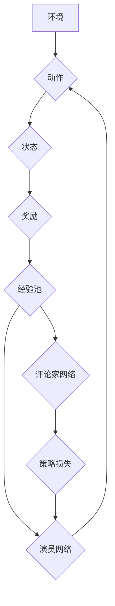

> Deep Deterministic Policy Gradient (DDPG), 强化学习, 连续动作空间, 演员-评论家架构, 稳定性, 代码实例

## 1. 背景介绍

强化学习 (Reinforcement Learning, RL) 作为机器学习的一个重要分支，旨在训练智能体在环境中通过与环境交互学习最优策略，以最大化累积奖励。传统的强化学习算法主要针对离散动作空间，而现实世界中许多问题涉及连续动作空间，例如机器人控制、无人驾驶等。针对连续动作空间的强化学习问题，Deep Deterministic Policy Gradient (DDPG) 算法应运而生。

DDPG 算法结合了深度神经网络和策略梯度方法，能够有效地学习连续动作空间的策略。它基于演员-评论家架构，其中演员网络负责生成策略，评论家网络负责评估策略的好坏。DDPG 算法通过最大化策略的预期奖励来训练演员网络，并通过最小化策略的预期损失来训练评论家网络。

## 2. 核心概念与联系

DDPG 算法的核心概念包括：

* **演员-评论家架构:** 演员网络负责生成策略，评论家网络负责评估策略的好坏。
* **策略梯度:** 通过计算策略参数对奖励的梯度，更新策略参数，以最大化预期奖励。
* **经验回放:** 将训练过程中收集到的经验存储在经验池中，并随机采样经验进行训练，以提高训练效率和稳定性。
* **目标网络:** 使用目标网络来评估策略的好坏，目标网络的参数是演员网络参数的软更新，以避免过拟合。

**DDPG 算法流程图:**



## 3. 核心算法原理 & 具体操作步骤

### 3.1  算法原理概述

DDPG 算法的核心思想是利用深度神经网络学习一个策略，该策略能够将当前状态映射到最优动作。它采用策略梯度方法，通过最大化策略的预期奖励来更新策略参数。

DDPG 算法的训练过程可以概括为以下步骤：

1. 初始化演员网络和评论家网络。
2. 在环境中进行交互，收集经验。
3. 将收集到的经验存储在经验池中。
4. 从经验池中随机采样经验，并使用采样的经验更新演员网络和评论家网络。
5. 重复步骤 2-4，直到策略收敛。

### 3.2  算法步骤详解

1. **初始化网络:** 初始化演员网络和评论家网络，并设置学习率等超参数。
2. **环境交互:** 在环境中进行交互，收集状态、动作、奖励和下一个状态的经验。
3. **经验回放:** 将收集到的经验存储在经验池中。
4. **采样经验:** 从经验池中随机采样一个批次的经验。
5. **计算策略梯度:** 使用采样的经验计算演员网络策略参数的梯度。
6. **更新演员网络:** 使用策略梯度更新演员网络的参数。
7. **计算价值函数:** 使用采样的经验计算评论家网络的价值函数输出。
8. **更新评论家网络:** 使用价值函数的损失函数更新评论家网络的参数。
9. **目标网络更新:** 使用软更新策略更新目标网络的参数。
10. **重复步骤 2-9:** 重复以上步骤，直到策略收敛。

### 3.3  算法优缺点

**优点:**

* 能够有效地学习连续动作空间的策略。
* 稳定性好，不容易出现震荡或发散。
* 能够利用经验回放提高训练效率。

**缺点:**

* 训练过程相对复杂，需要较多的计算资源。
* 算法参数的选择对性能有较大影响。

### 3.4  算法应用领域

DDPG 算法在机器人控制、无人驾驶、金融交易、游戏 AI 等领域都有广泛的应用。

## 4. 数学模型和公式 & 详细讲解 & 举例说明

### 4.1  数学模型构建

DDPG 算法的核心数学模型包括策略网络、价值网络和目标网络。

* **策略网络:** 策略网络是一个深度神经网络，其输入是当前状态，输出是动作。策略网络的参数表示为 $\theta_a$。
* **价值网络:** 价值网络也是一个深度神经网络，其输入是状态和动作，输出是状态-动作对的价值函数。价值网络的参数表示为 $\theta_c$。
* **目标网络:** 目标网络是策略网络和价值网络的复制品，其参数是策略网络和价值网络参数的软更新。目标网络的参数表示为 $\theta_a^-$ 和 $\theta_c^-$。

### 4.2  公式推导过程

DDPG 算法的目标是最大化策略的预期奖励。策略的预期奖励可以表示为：

$$
J(\theta_a) = E_{\tau \sim \rho_\theta} [R(\tau)]
$$

其中，$\tau$ 表示一个轨迹，$\rho_\theta$ 表示策略 $\theta_a$ 生成的轨迹分布，$R(\tau)$ 表示轨迹 $\tau$ 的总奖励。

为了最大化策略的预期奖励，DDPG 算法使用策略梯度方法，即计算策略参数 $\theta_a$ 对预期奖励的梯度，并使用梯度更新策略参数。策略梯度的计算公式为：

$$
\nabla_{\theta_a} J(\theta_a) = E_{\tau \sim \rho_\theta} [\nabla_{\theta_a} \log \pi_\theta(a|\mathbf{s}) \cdot Q_\theta(s, a)]
$$

其中，$\pi_\theta(a|\mathbf{s})$ 表示策略网络在状态 $\mathbf{s}$ 下选择动作 $a$ 的概率，$Q_\theta(s, a)$ 表示价值网络在状态 $\mathbf{s}$ 下执行动作 $a$ 的价值函数。

### 4.3  案例分析与讲解

假设我们有一个机器人控制任务，目标是让机器人从起点移动到终点。DDPG 算法可以用来训练机器人学习最优控制策略。

在训练过程中，机器人会与环境交互，收集状态、动作、奖励和下一个状态的经验。这些经验会被存储在经验池中。然后，DDPG 算法会从经验池中随机采样经验，并使用这些经验更新策略网络和价值网络。

通过反复训练，机器人会逐渐学习到最优控制策略，能够有效地控制自己的运动，最终到达终点。

## 5. 项目实践：代码实例和详细解释说明

### 5.1  开发环境搭建

为了实现 DDPG 算法，我们需要搭建一个开发环境。

* **操作系统:** Ubuntu 18.04 或更高版本
* **Python 版本:** 3.6 或更高版本
* **库依赖:** TensorFlow, PyTorch, NumPy, OpenAI Gym

### 5.2  源代码详细实现

```python
import tensorflow as tf
import numpy as np

# 定义演员网络
class ActorNetwork(tf.keras.Model):
    def __init__(self, state_dim, action_dim):
        super(ActorNetwork, self).__init__()
        self.dense1 = tf.keras.layers.Dense(128, activation='relu')
        self.dense2 = tf.keras.layers.Dense(64, activation='relu')
        self.output = tf.keras.layers.Dense(action_dim, activation='tanh')

    def call(self, state):
        x = self.dense1(state)
        x = self.dense2(x)
        return self.output(x)

# 定义评论家网络
class CriticNetwork(tf.keras.Model):
    def __init__(self, state_dim, action_dim):
        super(CriticNetwork, self).__init__()
        self.dense1 = tf.keras.layers.Dense(128, activation='relu')
        self.dense2 = tf.keras.layers.Dense(64, activation='relu')
        self.output = tf.keras.layers.Dense(1)

    def call(self, state, action):
        x = tf.concat([state, action], axis=-1)
        x = self.dense1(x)
        x = self.dense2(x)
        return self.output(x)

# 定义 DDPG 算法
class DDPG:
    def __init__(self, state_dim, action_dim, learning_rate):
        self.state_dim = state_dim
        self.action_dim = action_dim
        self.learning_rate = learning_rate

        self.actor = ActorNetwork(state_dim, action_dim)
        self.critic = CriticNetwork(state_dim, action_dim)

        self.actor_optimizer = tf.keras.optimizers.Adam(learning_rate=self.learning_rate)
        self.critic_optimizer = tf.keras.optimizers.Adam(learning_rate=self.learning_rate)

    def train(self, state, action, reward, next_state, done):
        # 计算目标值
        with tf.GradientTape() as tape:
            next_action = self.actor(next_state)
            next_q_value = self.critic(next_state, next_action)
            target_q_value = reward + self.gamma * next_q_value * (1 - done)

        # 计算评论家网络的损失
        critic_loss = tf.reduce_mean(tf.square(target_q_value - self.critic(state, action)))

        # 计算演员网络的损失
        action = self.actor(state)
        actor_loss = -tf.reduce_mean(self.critic(state, action))

        # 更新评论家网络和演员网络的参数
        self.critic_optimizer.apply_gradients(zip(tape.gradient(critic_loss, self.critic.trainable_variables), self.critic.trainable_variables))
        self.actor_optimizer.apply_gradients(zip(tape.gradient(actor_loss, self.actor.trainable_variables), self.actor.trainable_variables))

```

### 5.3  代码解读与分析

* **ActorNetwork:** 负责生成策略，输出动作。
* **CriticNetwork:** 负责评估策略的好坏，输出状态-动作对的价值函数。
* **DDPG:** DDPG 算法类，包含演员网络、评论家网络、优化器等。
* **train() 方法:** 训练 DDPG 算法，更新演员网络和评论家网络的参数。

### 5.4  运行结果展示

运行代码后，可以观察到机器人控制策略的学习过程。

## 6. 实际应用场景

DDPG 算法在机器人控制、无人驾驶、金融交易、游戏 AI 等领域都有广泛的应用。

### 6.4  未来应用展望

随着深度学习技术的不断发展，DDPG 算法的应用场景将会更加广泛。例如，它可以应用于医疗诊断、药物研发、个性化教育等领域。

## 7. 工具和资源推荐

### 7.1  学习资源推荐

* **书籍:**
    * Reinforcement Learning: An Introduction by Sutton and Barto
    * Deep Reinforcement Learning Hands-On by Maxim Lapan
* **博客:**
    * OpenAI Blog
    * DeepMind Blog
* **课程:**
    * Deep Reinforcement Learning Specialization by DeepLearning.AI

### 7.2  开发工具推荐

* **TensorFlow:** 深度学习框架
* **PyTorch:** 深度学习框架
* **OpenAI Gym:** 强化学习环境

### 7.3  相关论文推荐

* Continuous Control with Deep Reinforcement Learning by Lillicrap et al.
* Deep Deterministic Policy Gradient by Lillicrap et al.

## 8. 总结：未来发展趋势与挑战

### 8.1  研究成果总结

DDPG 算法在连续动作空间的强化学习领域取得了显著的成果，为解决实际问题提供了有效的