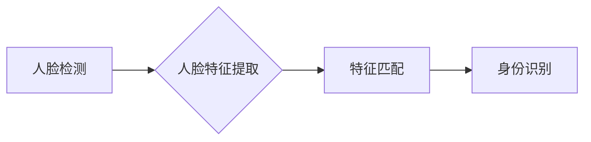

> 人脸识别，计算机视觉，深度学习，卷积神经网络，特征提取，图像处理，OpenCV

## 1. 背景介绍

人脸识别技术作为计算机视觉领域的重要分支，近年来发展迅速，在安防监控、身份验证、人脸搜索等领域得到了广泛应用。其核心思想是通过分析人脸图像中的特征，将人脸与数据库中的信息进行匹配，从而实现身份识别。

随着深度学习技术的兴起，人脸识别算法取得了显著的进步。深度学习模型能够自动学习人脸特征，并具有较强的泛化能力，使得人脸识别技术在准确率、速度和鲁棒性等方面有了大幅提升。

## 2. 核心概念与联系

人脸识别系统通常由以下几个模块组成：

* **人脸检测:** 首先需要检测图像中是否存在人脸，并定位人脸区域。
* **人脸特征提取:** 从检测到的区域中提取人脸特征，例如眼睛、鼻子、嘴巴等位置以及面部轮廓等信息。
* **特征匹配:** 将提取的特征与数据库中的特征进行比较，判断是否匹配。

**人脸识别系统架构**



## 3. 核心算法原理 & 具体操作步骤

### 3.1  算法原理概述

人脸识别算法主要分为两大类：传统算法和深度学习算法。

* **传统算法:** 主要基于手工设计的特征提取方法，例如PCA、LDA等。这些算法需要人工设计特征，并且对光照、姿态等变化较为敏感。

* **深度学习算法:** 利用深度神经网络自动学习人脸特征，具有更强的鲁棒性和泛化能力。常用的深度学习算法包括CNN、ResNet、Inception等。

### 3.2  算法步骤详解

以深度学习算法为例，人脸识别算法的具体步骤如下：

1. **数据预处理:** 将人脸图像进行预处理，例如调整大小、归一化等。
2. **特征提取:** 使用深度神经网络提取人脸特征，例如将图像转换为特征向量。
3. **特征匹配:** 将提取的特征与数据库中的特征进行比较，使用距离度量方法计算相似度。
4. **身份识别:** 根据相似度阈值判断是否匹配，从而识别身份。

### 3.3  算法优缺点

**深度学习算法**

* **优点:** 准确率高、鲁棒性强、泛化能力强。
* **缺点:** 训练数据量大、计算资源需求高、解释性差。

**传统算法**

* **优点:** 计算资源需求低、解释性强。
* **缺点:** 准确率低、鲁棒性差、泛化能力差。

### 3.4  算法应用领域

人脸识别技术广泛应用于以下领域：

* **安防监控:** 人脸识别可以用于监控人员进出、识别嫌疑人等。
* **身份验证:** 人脸识别可以用于手机解锁、银行卡验证等。
* **人脸搜索:** 人脸识别可以用于搜索数据库中的特定人脸图像。
* **医疗诊断:** 人脸识别可以用于识别患者、分析面部表情等。

## 4. 数学模型和公式 & 详细讲解 & 举例说明

### 4.1  数学模型构建

人脸识别算法通常使用距离度量方法来比较特征向量之间的相似度。常用的距离度量方法包括欧氏距离、曼哈顿距离、余弦相似度等。

**欧氏距离:**

$$
d(x,y) = \sqrt{\sum_{i=1}^{n}(x_i - y_i)^2}
$$

其中，$x$ 和 $y$ 是两个特征向量，$n$ 是特征向量的维度。

**余弦相似度:**

$$
sim(x,y) = \frac{x \cdot y}{||x|| ||y||}
$$

其中，$x \cdot y$ 是 $x$ 和 $y$ 的点积，$||x||$ 和 $||y||$ 是 $x$ 和 $y$ 的模长。

### 4.2  公式推导过程

欧氏距离和余弦相似度的公式推导过程可以参考相关数学书籍或论文。

### 4.3  案例分析与讲解

假设有两个特征向量 $x = [1, 2, 3]$ 和 $y = [4, 5, 6]$, 我们可以使用欧氏距离和余弦相似度来计算它们之间的相似度。

* **欧氏距离:**

$$
d(x,y) = \sqrt{(1-4)^2 + (2-5)^2 + (3-6)^2} = \sqrt{9 + 9 + 9} = 3\sqrt{3}
$$

* **余弦相似度:**

$$
sim(x,y) = \frac{1\cdot4 + 2\cdot5 + 3\cdot6}{\sqrt{1^2 + 2^2 + 3^2}\sqrt{4^2 + 5^2 + 6^2}} = \frac{4 + 10 + 18}{\sqrt{14}\sqrt{77}} = \frac{32}{\sqrt{1078}}
$$

## 5. 项目实践：代码实例和详细解释说明

### 5.1  开发环境搭建

本项目使用Python语言和OpenCV库进行开发。需要安装以下软件：

* Python 3.x
* OpenCV

### 5.2  源代码详细实现

```python
import cv2
import numpy as np

# 加载人脸识别模型
face_cascade = cv2.CascadeClassifier(cv2.data.haarcascades + 'haarcascade_frontalface_default.xml')

# 读取图像
img = cv2.imread('image.jpg')

# 将图像转换为灰度图像
gray = cv2.cvtColor(img, cv2.COLOR_BGR2GRAY)

# 检测人脸
faces = face_cascade.detectMultiScale(gray, 1.3, 5)

# 绘制矩形框
for (x, y, w, h) in faces:
    cv2.rectangle(img, (x, y), (x+w, y+h), (0, 255, 0), 2)

# 显示图像
cv2.imshow('Face Detection', img)
cv2.waitKey(0)
cv2.destroyAllWindows()
```

### 5.3  代码解读与分析

* **加载人脸识别模型:** 使用 `cv2.CascadeClassifier` 加载预训练的人脸识别模型。
* **读取图像:** 使用 `cv2.imread` 读取图像文件。
* **转换为灰度图像:** 使用 `cv2.cvtColor` 将图像转换为灰度图像，以便人脸检测算法能够正常工作。
* **检测人脸:** 使用 `face_cascade.detectMultiScale` 检测图像中的人脸，返回人脸区域的坐标信息。
* **绘制矩形框:** 使用 `cv2.rectangle` 在图像上绘制矩形框，将人脸区域标注出来。
* **显示图像:** 使用 `cv2.imshow` 显示图像，并使用 `cv2.waitKey` 等待用户按键。

### 5.4  运行结果展示

运行代码后，将显示包含人脸矩形框的图像。

## 6. 实际应用场景

### 6.1  安防监控

人脸识别技术可以用于监控人员进出、识别嫌疑人、追踪逃犯等。

### 6.2  身份验证

人脸识别可以用于手机解锁、银行卡验证、机场安检等场景，提高身份验证的安全性。

### 6.3  人脸搜索

人脸识别可以用于搜索数据库中的特定人脸图像，例如查找失散人员、识别犯罪嫌疑人等。

### 6.4  未来应用展望

人脸识别技术未来将应用于更广泛的领域，例如：

* **医疗诊断:** 人脸识别可以用于识别患者、分析面部表情、辅助诊断疾病。
* **教育:** 人脸识别可以用于学生考勤、个性化教学等。
* **零售:** 人脸识别可以用于个性化推荐、会员积分等。

## 7. 工具和资源推荐

### 7.1  学习资源推荐

* **书籍:**
    * 《深度学习》
    * 《计算机视觉》
* **在线课程:**
    * Coursera 人工智能课程
    * Udacity 深度学习课程

### 7.2  开发工具推荐

* **OpenCV:** 强大的计算机视觉库。
* **TensorFlow:** 深度学习框架。
* **PyTorch:** 深度学习框架。

### 7.3  相关论文推荐

* **FaceNet: A Unified Embedding for Face Recognition and Clustering**
* **DeepFace: Closing the Gap to Human-Level Performance in Face Verification**

## 8. 总结：未来发展趋势与挑战

### 8.1  研究成果总结

近年来，人脸识别技术取得了显著的进步，准确率、速度和鲁棒性都有大幅提升。深度学习算法成为人脸识别领域的主流方法，并取得了优异的性能。

### 8.2  未来发展趋势

* **更准确、更鲁棒的人脸识别算法:** 研究人员将继续探索新的算法和模型，提高人脸识别的准确率和鲁棒性，使其能够应对更复杂的环境和挑战。
* **跨模态人脸识别:** 将人脸识别与其他模态信息（例如语音、指纹等）融合，提高识别准确率和安全性。
* **隐私保护:** 人脸识别技术涉及到个人隐私问题，研究人员将致力于开发隐私保护的人脸识别算法，确保数据安全和用户隐私。

### 8.3  面临的挑战

* **数据标注:** 人脸识别算法需要大量的标注数据进行训练，数据标注成本高、效率低。
* **公平性与偏见:** 人脸识别算法可能存在公平性问题，例如对特定种族或性别的人脸识别准确率较低。
* **伦理问题:** 人脸识别技术可能被用于监控、跟踪和控制个人，需要谨慎考虑其伦理问题。

### 8.4  研究展望

未来，人脸识别技术将继续发展，并在更多领域得到应用。研究人员将继续探索新的算法、模型和应用场景，推动人脸识别技术向更智能、更安全、更普惠的方向发展。

## 9. 附录：常见问题与解答

### 9.1  人脸识别准确率如何？

人脸识别准确率取决于多种因素，例如算法、训练数据、图像质量等。目前，先进的人脸识别算法在理想条件下可以达到99%以上的准确率。

### 9.2  人脸识别技术是否安全？

人脸识别技术存在一定的安全风险，例如数据泄露、身份盗用等。因此，需要采取相应的安全措施，例如数据加密、身份验证等，确保人脸识别技术的安全使用。

### 9.3  人脸识别技术是否会侵犯隐私？

人脸识别技术确实可能侵犯隐私，例如未经同意进行人脸识别、收集和使用个人信息等。因此，需要制定相应的法律法规和伦理规范，规范人脸识别技术的应用，保护个人隐私。


作者：禅与计算机程序设计艺术 / Zen and the Art of Computer Programming 
<end_of_turn>