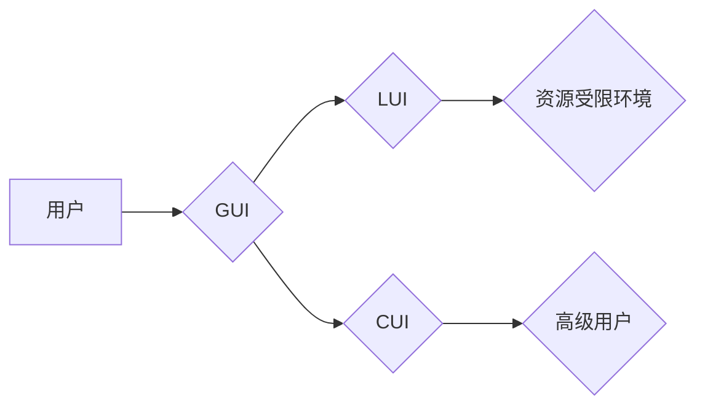

> GUI, LUI, CUI, 协同工作, 人机交互, 用户体验, 界面设计, 跨平台, 跨设备

## 1. 背景介绍

随着科技的飞速发展，用户对交互体验的要求越来越高。传统的命令行界面（CUI）虽然简洁高效，但缺乏直观性和用户友好性。图形用户界面（GUI）凭借其直观易用、操作便捷的优势，逐渐成为主流交互方式。然而，GUI在某些场景下，例如嵌入式系统、资源受限环境或需要高度定制化交互的应用中，可能存在性能瓶颈或难以实现。

近年来，轻量级用户界面（LUI）应运而生，它兼具GUI的直观性和CUI的轻量化特性，在资源受限环境下提供高效的交互体验。LUI通常采用文本或简单的图形元素，并通过键盘、鼠标或触摸屏等多种输入方式进行交互。

本文将深入探讨GUI、LUI和CUI在协同工作中的原理、架构、算法以及实际应用场景，并分析其优缺点和未来发展趋势。

## 2. 核心概念与联系

### 2.1 GUI、LUI和CUI的定义

* **GUI（图形用户界面）：** 基于图形元素和图标的交互方式，用户通过鼠标、键盘等设备与系统进行操作。
* **LUI（轻量级用户界面）：** 采用文本或简单的图形元素，占用资源少，响应速度快，适合资源受限环境。
* **CUI（命令行界面）：** 用户通过文本命令与系统交互，操作方式较为复杂，但效率高。

### 2.2 协同工作模式

GUI、LUI和CUI可以协同工作，形成多层次、多模式的交互体验。

* **GUI作为主界面：** 提供用户友好的图形界面，完成大部分操作。
* **LUI作为辅助界面：** 在特定场景下，例如资源受限环境或需要高度定制化交互的应用中，使用LUI提供轻量级的交互方式。
* **CUI作为底层接口：** 提供命令行接口，支持高级用户或自动化脚本操作。

**Mermaid 流程图**



## 3. 核心算法原理 & 具体操作步骤

### 3.1 算法原理概述

GUI、LUI和CUI的协同工作涉及到多个算法，例如：

* **界面渲染算法：** 将用户界面元素渲染到屏幕上。
* **事件处理算法：** 处理用户输入事件，并触发相应的操作。
* **状态管理算法：** 管理应用程序的状态，并根据用户操作进行更新。

### 3.2 算法步骤详解

1. **用户输入事件：** 用户通过鼠标、键盘或触摸屏等设备输入事件。
2. **事件处理：** 系统接收用户输入事件，并根据事件类型调用相应的处理函数。
3. **界面更新：** 处理函数根据事件内容更新应用程序的状态，并触发界面渲染算法重新渲染界面。
4. **界面渲染：** 界面渲染算法将更新后的界面元素渲染到屏幕上。

### 3.3 算法优缺点

* **GUI渲染算法：** 优点：直观易用，用户体验好。缺点：资源消耗大，性能较低。
* **LUI渲染算法：** 优点：资源消耗小，性能高。缺点：界面不够直观，用户体验相对较差。
* **CUI渲染算法：** 优点：资源消耗极小，性能最高。缺点：界面不够直观，用户体验较差。

### 3.4 算法应用领域

* **GUI：** 桌面应用程序、移动应用程序、网页浏览器等。
* **LUI：** 嵌入式系统、资源受限设备、命令行工具等。
* **CUI：** 系统管理工具、服务器端应用程序、自动化脚本等。

## 4. 数学模型和公式 & 详细讲解 & 举例说明

### 4.1 数学模型构建

GUI、LUI和CUI的协同工作可以抽象为一个状态机模型，其中每个状态代表不同的交互模式，状态之间的转换由用户输入事件触发。

**状态机模型：**

```
状态：
- GUI模式
- LUI模式
- CUI模式

事件：
- 用户输入命令
- 用户点击按钮
- 用户切换模式

转换：
- GUI模式 -> LUI模式：用户输入特定命令
- LUI模式 -> GUI模式：用户点击切换按钮
- GUI模式 -> CUI模式：用户输入特定命令
```

### 4.2 公式推导过程

状态机模型可以利用状态转移函数来描述状态之间的转换关系。

**状态转移函数：**

$$
S_{t+1} = f(S_t, E_t)
$$

其中：

* $S_t$：当前状态
* $E_t$：当前事件
* $S_{t+1}$：下一个状态

### 4.3 案例分析与讲解

例如，当用户在GUI模式下输入特定命令时，状态转移函数会将状态从GUI模式切换到LUI模式。

**案例：**

用户在GUI模式下输入命令“显示帮助”，状态转移函数会将状态从GUI模式切换到LUI模式，并显示LUI界面上的帮助信息。

## 5. 项目实践：代码实例和详细解释说明

### 5.1 开发环境搭建

* 操作系统：Linux/Windows/macOS
* 编程语言：Python/C++/Java
* 开发工具：IDE、文本编辑器、调试器

### 5.2 源代码详细实现

```python
# GUI模式
def gui_mode():
    # ... GUI界面渲染和事件处理代码 ...

# LUI模式
def lui_mode():
    # ... LUI界面渲染和事件处理代码 ...

# CUI模式
def cui_mode():
    # ... CUI界面渲染和事件处理代码 ...

# 状态机
current_mode = "GUI"

while True:
    # 处理用户输入事件
    event = get_user_input()

    # 根据事件类型切换模式
    if event == "切换LUI":
        current_mode = "LUI"
    elif event == "切换CUI":
        current_mode = "CUI"

    # 调用对应模式的代码
    if current_mode == "GUI":
        gui_mode()
    elif current_mode == "LUI":
        lui_mode()
    elif current_mode == "CUI":
        cui_mode()
```

### 5.3 代码解读与分析

* 代码定义了三个模式：GUI、LUI和CUI，并分别实现了对应的界面渲染和事件处理代码。
* 状态机变量`current_mode`记录当前模式。
* 根据用户输入事件，状态机切换到不同的模式，并调用对应模式的代码。

### 5.4 运行结果展示

运行代码后，用户可以根据提示切换不同的交互模式，体验GUI、LUI和CUI的协同工作。

## 6. 实际应用场景

### 6.1 嵌入式系统

在资源受限的嵌入式系统中，LUI可以提供轻量级的交互方式，例如控制家电、汽车仪表盘等。

### 6.2 命令行工具

对于需要高度定制化交互的命令行工具，可以结合GUI和LUI，提供更直观的操作界面，同时保留命令行操作的效率。

### 6.3 多平台应用

GUI、LUI和CUI的协同工作可以帮助开发跨平台应用，在不同平台上提供一致的用户体验。

### 6.4 未来应用展望

随着人工智能和机器学习技术的进步，GUI、LUI和CUI的协同工作将更加智能化和个性化，能够根据用户的行为和习惯自动调整交互模式，提供更优的用户体验。

## 7. 工具和资源推荐

### 7.1 学习资源推荐

* **书籍：**
    * 《人机交互设计》
    * 《用户界面设计》
* **网站：**
    * https://www.interaction-design.org/
    * https://uxplanet.org/

### 7.2 开发工具推荐

* **GUI开发工具：**
    * Qt
    * wxWidgets
    * Tkinter
* **LUI开发工具：**
    * ncurses
    * curses
* **CUI开发工具：**
    * Bash
    * PowerShell

### 7.3 相关论文推荐

* **论文：**
    * 《A Survey of User Interface Design Principles》
    * 《The Evolution of User Interfaces》

## 8. 总结：未来发展趋势与挑战

### 8.1 研究成果总结

GUI、LUI和CUI的协同工作为用户提供了更加灵活、高效和个性化的交互体验。

### 8.2 未来发展趋势

* **人工智能驱动的交互：** 人工智能将被用于分析用户行为，并自动调整交互模式，提供更智能化的交互体验。
* **跨设备协同：** GUI、LUI和CUI将跨越设备边界，实现跨平台、跨设备的协同工作。
* **增强现实和虚拟现实：** GUI、LUI和CUI将与增强现实和虚拟现实技术结合，提供更加沉浸式的交互体验。

### 8.3 面临的挑战

* **用户体验设计：** 如何设计出更加直观、易用、个性化的交互体验仍然是一个挑战。
* **跨平台兼容性：** 确保GUI、LUI和CUI在不同平台上能够兼容和运行流畅仍然是一个挑战。
* **安全性和隐私保护：** 随着交互方式的复杂化，安全性和隐私保护也面临新的挑战。

### 8.4 研究展望

未来，GUI、LUI和CUI的协同工作将继续发展，为用户提供更加智能、高效和个性化的交互体验。


## 9. 附录：常见问题与解答

### 9.1 如何选择合适的交互模式？

选择合适的交互模式取决于具体的应用场景和用户需求。

* **GUI：** 适合需要直观、易用交互的应用。
* **LUI：** 适合资源受限环境或需要高度定制化交互的应用。
* **CUI：** 适合需要高效、精确操作的应用。

### 9.2 如何实现GUI、LUI和CUI的协同工作？

可以使用状态机模型来实现GUI、LUI和CUI的协同工作，根据用户输入事件切换不同的交互模式。

### 9.3 如何设计更加智能化的交互体验？

可以使用人工智能和机器学习技术来分析用户行为，并根据用户的习惯和偏好自动调整交互模式。


作者：禅与计算机程序设计艺术 / Zen and the Art of Computer Programming 
<end_of_turn>