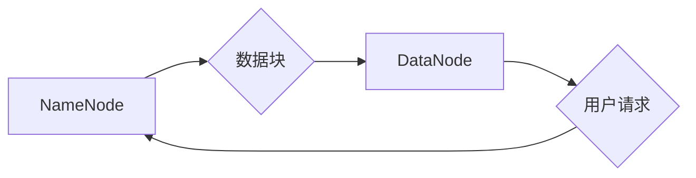

> Hadoop, HDFS, 分布式文件系统, 数据存储, 数据处理, 大数据, 容错, 高可用性, 代码实例

## 1. 背景介绍

在海量数据时代，传统的集中式文件系统已经难以满足对存储和处理海量数据的需求。分布式文件系统 (Distributed File System, DFS) 应运而生，它将数据存储在多个节点上，并通过网络进行访问和管理，从而能够有效地应对海量数据带来的挑战。

Hadoop分布式文件系统 (Hadoop Distributed File System, HDFS) 是Apache Hadoop生态系统中一个关键组件，它提供了一种高可靠、高吞吐量的分布式文件系统，为大数据处理提供了坚实的基础。HDFS的设计理念是将数据存储在多个节点上，并通过数据副本机制保证数据的可靠性。

## 2. 核心概念与联系

HDFS 的核心概念包括：

* **NameNode:** HDFS 的元数据管理节点，负责管理文件系统元数据，如文件路径、文件大小、数据块位置等。
* **DataNode:** HDFS 的数据存储节点，负责存储数据块，并提供数据读取和写入服务。
* **数据块:** HDFS 将文件分割成多个数据块，每个数据块的大小为 128MB。
* **副本机制:** HDFS 通过复制数据块的方式保证数据的可靠性。默认情况下，每个数据块会复制三个副本，存储在不同的 DataNode 上。

**HDFS 架构流程图:**



## 3. 核心算法原理 & 具体操作步骤

### 3.1  算法原理概述

HDFS 的核心算法包括数据块分配算法、数据块复制算法和数据块恢复算法。

* **数据块分配算法:** 当用户上传文件时，NameNode 会根据 DataNode 的可用空间和网络带宽等因素，将数据块分配到不同的 DataNode 上。
* **数据块复制算法:** 当数据块被分配到 DataNode 上后，NameNode 会根据副本数量参数，将数据块复制到其他 DataNode 上。
* **数据块恢复算法:** 当某个 DataNode 发生故障时，NameNode 会根据数据块的副本信息，从其他 DataNode 上恢复数据块。

### 3.2  算法步骤详解

**数据块分配算法步骤:**

1. 用户上传文件到 HDFS。
2. NameNode 接收文件上传请求。
3. NameNode 根据 DataNode 的可用空间和网络带宽等因素，选择合适的 DataNode 存储数据块。
4. NameNode 将数据块分配给选定的 DataNode。

**数据块复制算法步骤:**

1. DataNode 接收数据块。
2. DataNode 将数据块存储到本地磁盘。
3. DataNode 向 NameNode 发送数据块存储成功通知。
4. NameNode 根据副本数量参数，选择其他 DataNode 存储数据块副本。
5. DataNode 将数据块副本发送到选定的 DataNode。

**数据块恢复算法步骤:**

1. NameNode 发现某个 DataNode 发生故障。
2. NameNode 检查数据块的副本信息。
3. NameNode 选择其他 DataNode 上的副本数据块。
4. NameNode 将副本数据块发送到故障 DataNode 的替代节点。
5. 替代节点存储数据块副本。

### 3.3  算法优缺点

**优点:**

* 高可靠性: 数据块复制机制保证了数据的可靠性。
* 高吞吐量: 数据块可以并行读取和写入，提高了数据处理吞吐量。
* 可扩展性: HDFS 可以轻松扩展到更大的集群规模。

**缺点:**

* 数据访问延迟: 数据块分散存储，数据访问需要跨节点网络传输，导致数据访问延迟。
* 数据更新复杂: 数据块更新需要更新所有副本，增加了数据更新的复杂度。

### 3.4  算法应用领域

HDFS 广泛应用于大数据处理、机器学习、数据分析等领域。

## 4. 数学模型和公式 & 详细讲解 & 举例说明

### 4.1  数学模型构建

HDFS 的数据存储和复制机制可以抽象为一个数学模型，其中：

* **N:** 数据节点总数
* **k:** 数据块副本数
* **s:** 数据块大小
* **p:** 数据块存储概率

**数据块存储概率公式:**

$$p = 1 - (1 - \frac{1}{N})^k$$

**数据块丢失概率公式:**

$$q = (1 - \frac{1}{N})^k$$

### 4.2  公式推导过程

数据块存储概率公式的推导过程如下：

1. 每个 DataNode 存储数据块的概率为 1/N。
2. 每个 DataNode 存储数据块的概率为 1/N，则 k 个 DataNode 都不存储数据块的概率为 (1 - 1/N)^k。
3. 因此，k 个 DataNode 至少有一个存储数据块的概率为 1 - (1 - 1/N)^k。

### 4.3  案例分析与讲解

假设 HDFS 集群中包含 10 个 DataNode，数据块副本数为 3，则数据块存储概率为：

$$p = 1 - (1 - \frac{1}{10})^3 = 0.97$$

数据块丢失概率为：

$$q = (1 - \frac{1}{10})^3 = 0.03$$

## 5. 项目实践：代码实例和详细解释说明

### 5.1  开发环境搭建

HDFS 的开发环境搭建需要以下软件：

* Hadoop 软件包
* Java 开发环境
* 集群管理工具 (例如：Cloudera Manager)

### 5.2  源代码详细实现

HDFS 的源代码实现非常复杂，这里只提供一个简单的代码实例，演示如何使用 HDFS API 上传文件。

```java
import org.apache.hadoop.conf.Configuration;
import org.apache.hadoop.fs.FileSystem;
import org.apache.hadoop.fs.Path;

public class HDFSUpload {

    public static void main(String[] args) throws Exception {
        // 配置 HDFS 连接信息
        Configuration conf = new Configuration();
        conf.set("fs.defaultFS", "hdfs://localhost:9000");

        // 获取 HDFS 文件系统对象
        FileSystem fs = FileSystem.get(conf);

        // 上传文件路径
        String localFilePath = "/path/to/local/file";
        String hdfsFilePath = "/path/to/hdfs/file";

        // 上传文件
        fs.copyFromLocalFile(new Path(localFilePath), new Path(hdfsFilePath));

        // 关闭 HDFS 文件系统对象
        fs.close();
    }
}
```

### 5.3  代码解读与分析

这段代码首先配置 HDFS 连接信息，然后获取 HDFS 文件系统对象。接着，使用 `copyFromLocalFile()` 方法将本地文件上传到 HDFS。最后，关闭 HDFS 文件系统对象。

### 5.4  运行结果展示

运行这段代码后，本地文件将被上传到指定的 HDFS 文件路径。

## 6. 实际应用场景

HDFS 在实际应用场景中广泛应用于以下领域：

* **大数据存储:** HDFS 可以存储海量数据，例如日志文件、传感器数据、社交媒体数据等。
* **数据分析:** HDFS 可以为数据分析工具提供数据存储和访问服务，例如 Hadoop MapReduce、Spark 等。
* **机器学习:** HDFS 可以存储机器学习模型和训练数据，并为机器学习算法提供数据访问服务。

### 6.4  未来应用展望

随着大数据量的不断增长，HDFS 将继续在以下领域发挥重要作用：

* **云计算:** HDFS 可以作为云计算平台的基础存储系统。
* **物联网:** HDFS 可以存储物联网设备产生的海量数据。
* **人工智能:** HDFS 可以为人工智能算法提供数据存储和访问服务。

## 7. 工具和资源推荐

### 7.1  学习资源推荐

* Apache Hadoop 官方文档: https://hadoop.apache.org/docs/
* HDFS 权威指南: https://www.oreilly.com/library/view/hadoop-distributed-file/9781449360359/

### 7.2  开发工具推荐

* Cloudera Manager: https://www.cloudera.com/products/manager.html
* Hortonworks Data Platform: https://hortonworks.com/products/hortonworks-data-platform/

### 7.3  相关论文推荐

* Hadoop: A Distributed File System for Reliable Data Storage
* The Design and Implementation of HDFS

## 8. 总结：未来发展趋势与挑战

### 8.1  研究成果总结

HDFS 作为一种高可靠、高吞吐量的分布式文件系统，在海量数据存储和处理领域取得了显著的成果。

### 8.2  未来发展趋势

HDFS 将朝着以下方向发展：

* **更强的性能:** 提高数据访问速度和数据处理吞吐量。
* **更高的可靠性:** 进一步增强数据可靠性和容错能力。
* **更灵活的架构:** 支持多种数据存储模式和数据访问方式。

### 8.3  面临的挑战

HDFS 面临以下挑战：

* **数据安全:** 保护数据安全和隐私。
* **数据管理:** 提高数据管理效率和数据治理能力。
* **成本控制:** 降低 HDFS 的部署和维护成本。

### 8.4  研究展望

未来，HDFS 的研究方向将集中在以下方面：

* **数据安全和隐私保护:** 研究新的数据加密和访问控制机制。
* **数据管理和治理:** 开发新的数据管理工具和框架。
* **成本优化:** 研究 HDFS 的资源调度和性能优化技术。

## 9. 附录：常见问题与解答

**常见问题:**

* HDFS 的数据块大小如何设置？
* HDFS 的副本数量如何设置？
* 如何监控 HDFS 的运行状态？

**解答:**

* HDFS 的数据块大小默认是 128MB，可以通过配置参数修改。
* HDFS 的副本数量默认是 3，可以通过配置参数修改。
* 可以使用 HDFS 的 Web UI 或命令行工具监控 HDFS 的运行状态。


作者：禅与计算机程序设计艺术 / Zen and the Art of Computer Programming 
<end_of_turn>