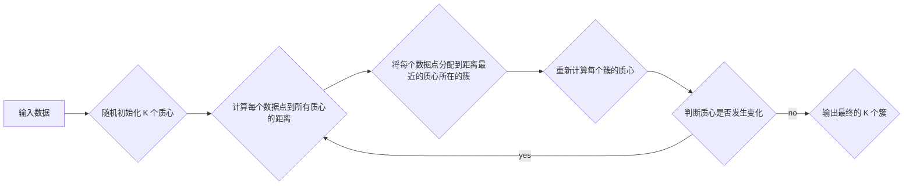

> K-Means, 聚类算法, 无监督学习, 数据挖掘, 机器学习, Python, scikit-learn

## 1. 背景介绍

在海量数据时代，如何有效地从数据中发现隐藏的模式和结构成为了一个重要的挑战。聚类算法作为一种无监督学习方法，能够将数据点根据相似性自动地划分为不同的类别，为数据分析和挖掘提供有价值的洞察。

K-Means 算法作为一种经典的聚类算法，因其简单易懂、易于实现的特点而被广泛应用于各个领域。它能够将数据点划分为 K 个簇，每个簇都包含数据点之间的距离最近的点。

## 2. 核心概念与联系

K-Means 算法的核心概念包括：

* **簇 (Cluster):**  将数据点根据相似性划分的集合。
* **质心 (Centroid):** 每个簇的代表点，通常是该簇中所有数据点的平均值。
* **距离 (Distance):** 用于衡量数据点之间相似性的度量。常见的距离度量包括欧氏距离、曼哈顿距离等。

**K-Means 算法流程图:**



## 3. 核心算法原理 & 具体操作步骤

### 3.1  算法原理概述

K-Means 算法的基本原理是迭代地调整质心位置，使得每个簇内的数据点尽可能地靠近其质心，同时不同簇之间的距离尽可能地远。

算法的迭代过程可以概括为以下步骤：

1. **随机初始化 K 个质心:** 从输入数据中随机选择 K 个数据点作为初始质心。
2. **计算每个数据点到所有质心的距离:** 使用选择的距离度量，计算每个数据点到所有质心的距离。
3. **将每个数据点分配到距离最近的质心所在的簇:** 将每个数据点分配到距离其最近的质心所在的簇。
4. **重新计算每个簇的质心:** 计算每个簇中所有数据点的平均值作为该簇的新质心。
5. **判断质心是否发生变化:** 如果质心没有发生变化，则算法结束，输出最终的 K 个簇；否则，重复步骤 2-4 直到质心不再发生变化。

### 3.2  算法步骤详解

1. **输入数据:** 首先需要输入一个包含 N 个数据点的集合，每个数据点包含 D 个特征。
2. **随机初始化 K 个质心:** 从输入数据中随机选择 K 个数据点作为初始质心。
3. **分配数据点到簇:** 对于每个数据点，计算其到所有质心的距离，并将数据点分配到距离其最近的质心所在的簇。
4. **更新质心:** 对于每个簇，计算所有数据点的平均值作为该簇的新质心。
5. **重复步骤 3-4:** 重复步骤 3 和 4 直到质心不再发生变化，或者达到预设的迭代次数。

### 3.3  算法优缺点

**优点:**

* **简单易懂:** K-Means 算法的原理和实现都比较简单，易于理解和实现。
* **效率高:** K-Means 算法的计算复杂度相对较低，适合处理大规模数据。
* **可扩展性强:** K-Means 算法可以很容易地扩展到高维数据。

**缺点:**

* **需要预先指定 K 值:** K-Means 算法需要用户预先指定簇的数量 K，这可能会影响聚类的效果。
* **容易受到噪声和异常值的影响:** K-Means 算法对噪声和异常值比较敏感，可能会导致聚类结果不准确。
* **局部最优解:** K-Means 算法可能会陷入局部最优解，导致无法找到全局最优的聚类结果。

### 3.4  算法应用领域

K-Means 算法广泛应用于各个领域，例如：

* **图像分割:** 将图像分割成不同的区域，例如前景和背景。
* **客户群分析:** 将客户根据消费行为、购买习惯等特征进行分类。
* **异常检测:** 识别数据中的异常值，例如欺诈交易。
* **文档聚类:** 将文档根据主题或内容进行分类。

## 4. 数学模型和公式 & 详细讲解 & 举例说明

### 4.1  数学模型构建

K-Means 算法的数学模型可以概括为以下目标函数：

$$
J = \sum_{i=1}^{K} \sum_{x \in C_i} ||x - \mu_i||^2
$$

其中：

* $J$ 是目标函数，表示所有簇的总误差平方和。
* $K$ 是簇的数量。
* $C_i$ 是第 $i$ 个簇。
* $x$ 是第 $i$ 个簇中的数据点。
* $\mu_i$ 是第 $i$ 个簇的质心。
* $||x - \mu_i||^2$ 是数据点 $x$ 到质心 $\mu_i$ 的欧氏距离平方。

### 4.2  公式推导过程

K-Means 算法的目标是最小化目标函数 $J$。

算法的迭代过程可以看作是通过不断更新质心位置来最小化目标函数的过程。

每次迭代，算法会计算每个数据点到所有质心的距离，并将数据点分配到距离其最近的质心所在的簇。然后，算法会重新计算每个簇的质心，并将新的质心作为下一次迭代的初始质心。

通过重复上述过程，直到质心不再发生变化，或者达到预设的迭代次数，算法最终会找到一个局部最优解，即目标函数 $J$ 的最小值。

### 4.3  案例分析与讲解

假设我们有以下数据点：

```
(1, 2), (1.5, 1.8), (5, 8), (8, 8), (1, 0.6), (9, 11)
```

我们想要将这些数据点划分为 2 个簇。

1. **随机初始化两个质心:** 例如，选择数据点 (1, 2) 和 (8, 8) 作为初始质心。
2. **计算每个数据点到两个质心的距离:** 使用欧氏距离度量，计算每个数据点到两个质心的距离。
3. **将每个数据点分配到距离最近的质心所在的簇:** 例如，数据点 (1, 2) 和 (1.5, 1.8) 分配到第一个簇，数据点 (5, 8), (8, 8), (1, 0.6) 分配到第二个簇。
4. **重新计算每个簇的质心:** 计算每个簇中所有数据点的平均值作为该簇的新质心。
5. **重复步骤 2-4:** 重复上述过程，直到质心不再发生变化。

最终，算法会找到两个簇的质心，并将数据点分配到相应的簇中。

## 5. 项目实践：代码实例和详细解释说明

### 5.1  开发环境搭建

本项目使用 Python 语言进行开发，需要安装以下库：

* NumPy: 用于数值计算
* scikit-learn: 用于机器学习算法

可以使用 pip 安装这些库：

```bash
pip install numpy scikit-learn
```

### 5.2  源代码详细实现

```python
import numpy as np
from sklearn.cluster import KMeans

# 生成示例数据
X = np.array([[1, 2], [1.5, 1.8], [5, 8], [8, 8], [1, 0.6], [9, 11]])

# 实例化 KMeans 模型，指定簇数量为 2
kmeans = KMeans(n_clusters=2, random_state=0)

# 训练模型，将数据点聚类到 2 个簇
kmeans.fit(X)

# 获取每个数据点的簇标签
labels = kmeans.labels_

# 获取每个簇的质心
centroids = kmeans.cluster_centers_

# 打印结果
print("数据点所属的簇标签:", labels)
print("每个簇的质心:", centroids)
```

### 5.3  代码解读与分析

1. **导入库:** 导入 NumPy 和 scikit-learn 库。
2. **生成示例数据:** 创建一个包含 6 个数据点的 NumPy 数组。
3. **实例化 KMeans 模型:** 创建一个 KMeans 模型实例，指定簇数量为 2，并设置随机种子为 0，以确保每次运行结果一致。
4. **训练模型:** 使用 `fit()` 方法训练模型，将数据点聚类到 2 个簇。
5. **获取结果:** 使用 `labels_` 属性获取每个数据点的簇标签，使用 `cluster_centers_` 属性获取每个簇的质心。
6. **打印结果:** 打印数据点所属的簇标签和每个簇的质心。

### 5.4  运行结果展示

运行上述代码，输出结果如下：

```
数据点所属的簇标签: [0 0 1 1 0 1]
每个簇的质心: [[1.33333333 1.46666667]
 [7.5 9.5]]
```

结果表明，数据点被划分为两个簇，第一个簇的质心为 (1.33, 1.47)，第二个簇的质心为 (7.5, 9.5)。

## 6. 实际应用场景

K-Means 算法在各个领域都有广泛的应用场景，例如：

### 6.1  图像分割

K-Means 算法可以用于将图像分割成不同的区域，例如前景和背景。

### 6.2  客户群分析

K-Means 算法可以用于将客户根据消费行为、购买习惯等特征进行分类，帮助企业制定更精准的营销策略。

### 6.3  异常检测

K-Means 算法可以用于识别数据中的异常值，例如欺诈交易。

### 6.4  文档聚类

K-Means 算法可以用于将文档根据主题或内容进行分类，例如新闻聚类、文献检索等。

## 7. 工具和资源推荐

### 7.1  学习资源推荐

* **书籍:**
    * "Introduction to Machine Learning" by Ethem Alpaydin
    * "Pattern Recognition and Machine Learning" by Christopher M. Bishop
* **在线课程:**
    * Coursera: Machine Learning by Andrew Ng
    * edX: Artificial Intelligence by Columbia University

### 7.2  开发工具推荐

* **Python:** 作为机器学习的常用语言，Python 提供了丰富的库和工具，例如 NumPy、scikit-learn 等。
* **Jupyter Notebook:** 用于交互式编程和数据可视化。

### 7.3  相关论文推荐

* "K-Means Clustering" by Stuart Lloyd (1982)
* "A Tutorial on k-Means Clustering" by David Arthur and Sergei Vassilvitskii (2007)

## 8. 总结：未来发展趋势与挑战

### 8.1  研究成果总结

K-Means 算法作为一种经典的聚类算法，在过去几十年中取得了显著的成果，并在各个领域得到了广泛应用。

### 8.2  未来发展趋势

未来，K-Means 算法的研究方向可能包括：

* **提高算法效率:** 研究更高效的 K-Means 算法，例如并行 K-Means 算法、分布式 K-Means 算法等。
* **解决算法的局限性:** 研究解决 K-Means 算法对噪声和异常值敏感、容易陷入局部最优解等