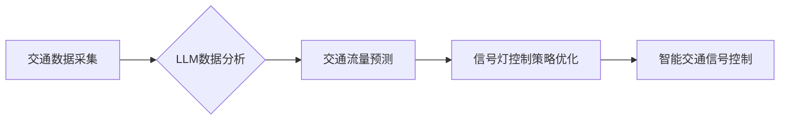

> 智能交通信号控制，LLM，自然语言处理，交通流量预测，优化算法，机器学习

## 1. 背景介绍

随着城市化进程的加速和交通流量的不断增长，交通拥堵已成为全球性难题之一。传统的交通信号控制系统主要依赖预设的时序计划，难以适应实时路况变化，导致信号灯的效率低下，交通流量波动较大。近年来，人工智能技术的发展为智能交通信号控制提供了新的思路和解决方案。

其中，大型语言模型（LLM）作为一种强大的自然语言处理技术，凭借其强大的语义理解和文本生成能力，在智能交通信号控制领域展现出巨大的潜力。LLM可以分析交通数据、预测交通流量、优化信号灯控制策略，从而提高交通效率、缓解拥堵，打造更加智能、高效的城市交通系统。

## 2. 核心概念与联系

### 2.1 智能交通信号控制

智能交通信号控制是指利用传感器、通信技术、人工智能等技术，对交通信号灯进行实时监测和控制，以优化交通流量、提高道路通行效率的系统。

### 2.2 大型语言模型（LLM）

大型语言模型（LLM）是一种基于深度学习的自然语言处理模型，通过训练海量文本数据，学习语言的语法、语义和上下文关系。LLM能够理解和生成人类语言，并具备强大的文本生成、翻译、摘要、问答等能力。

### 2.3 核心概念联系

LLM在智能交通信号控制中的应用主要体现在以下几个方面：

* **交通数据分析:** LLM可以分析来自摄像头、传感器等设备的交通数据，识别车辆类型、速度、方向等信息，并从中提取有价值的交通规律和趋势。
* **交通流量预测:** 基于历史交通数据和实时路况信息，LLM可以利用其强大的预测能力，预测未来交通流量的变化趋势，为信号灯控制提供决策依据。
* **信号灯控制策略优化:** LLM可以根据实时交通流量预测结果，优化信号灯的绿灯时间、红灯时间等控制策略，以最大限度地提高交通流量通行效率。

**Mermaid 流程图**



## 3. 核心算法原理 & 具体操作步骤

### 3.1 算法原理概述

LLM在智能交通信号控制中的应用主要基于以下核心算法：

* **自然语言处理（NLP）算法:** 用于分析和理解交通数据，提取有价值的信息。
* **机器学习（ML）算法:** 用于训练模型，预测交通流量和优化信号灯控制策略。
* **深度学习（DL）算法:** 用于构建更复杂的LLM模型，提高预测精度和控制策略的优化效果。

### 3.2 算法步骤详解

1. **数据采集:** 从摄像头、传感器等设备采集交通数据，包括车辆数量、速度、方向等信息。
2. **数据预处理:** 对采集到的数据进行清洗、格式化和转换，使其适合LLM模型的训练和使用。
3. **模型训练:** 利用机器学习和深度学习算法，训练LLM模型，使其能够理解交通数据、预测交通流量和优化信号灯控制策略。
4. **模型部署:** 将训练好的LLM模型部署到智能交通信号控制系统中，实时分析交通数据、预测交通流量和控制信号灯。
5. **系统评估:** 定期评估系统性能，并根据评估结果对模型进行调整和优化。

### 3.3 算法优缺点

**优点:**

* **高精度预测:** LLM能够学习复杂的交通规律，实现高精度的交通流量预测。
* **实时响应:** LLM可以实时分析交通数据，快速响应路况变化，优化信号灯控制策略。
* **自适应能力强:** LLM可以根据不同的路况和时间段自动调整控制策略，提高系统适应性。

**缺点:**

* **数据依赖性强:** LLM的性能取决于训练数据的质量和数量。
* **计算资源消耗大:** 训练和部署LLM模型需要大量的计算资源。
* **解释性较弱:** LLM的决策过程较为复杂，难以解释其背后的逻辑。

### 3.4 算法应用领域

LLM在智能交通信号控制领域的应用不仅限于城市道路，还可以应用于以下场景：

* **高速公路:** 预测交通流量变化，优化车道分配和限速策略。
* **机场:** 优化航班起降调度，提高机场吞吐量。
* **港口:** 优化船舶进出港调度，提高港口效率。

## 4. 数学模型和公式 & 详细讲解 & 举例说明

### 4.1 数学模型构建

在LLM智能交通信号控制中，常用的数学模型包括：

* **交通流量预测模型:** 利用时间序列分析、机器学习等方法，预测未来交通流量。
* **信号灯控制策略优化模型:** 利用动态规划、遗传算法等方法，优化信号灯的控制策略。

### 4.2 公式推导过程

**交通流量预测模型:**

假设交通流量的时间序列数据为 $y_t$，其中 $t$ 表示时间点。可以使用ARIMA模型预测未来流量 $y_{t+h}$：

$$
y_{t+h} = \phi_1 y_{t+h-1} + \phi_2 y_{t+h-2} + ... + \phi_p y_{t+h-p} + \theta_1 \epsilon_{t+h-1} + \theta_2 \epsilon_{t+h-2} + ... + \theta_q \epsilon_{t+h-q} + \epsilon_{t+h}
$$

其中：

* $\phi_i$ 和 $\theta_i$ 是模型参数。
* $\epsilon_t$ 是误差项。

**信号灯控制策略优化模型:**

可以使用动态规划算法优化信号灯的控制策略，目标函数为最大化交通流量通行效率。

### 4.3 案例分析与讲解

**案例:**

假设一个十字路口，需要优化信号灯的控制策略，以最大化车辆通行效率。

**分析:**

可以使用LLM分析路口交通数据，预测不同时间段的车辆流量，并利用动态规划算法优化信号灯的绿灯时间和红灯时间。

**讲解:**

通过LLM的分析和优化，可以实现以下效果：

* 减少车辆等待时间。
* 提高车辆通行效率。
* 缓解交通拥堵。

## 5. 项目实践：代码实例和详细解释说明

### 5.1 开发环境搭建

* 操作系统：Ubuntu 20.04
* Python 版本：3.8
* 必要的库：transformers, numpy, pandas, matplotlib

### 5.2 源代码详细实现

```python
# 导入必要的库
import transformers
import numpy as np
import pandas as pd
import matplotlib.pyplot as plt

# 加载预训练的LLM模型
model_name = "bert-base-uncased"
model = transformers.AutoModelForSequenceClassification.from_pretrained(model_name)

# 加载交通数据
data = pd.read_csv("traffic_data.csv")

# 数据预处理
# ...

# 训练LLM模型
# ...

# 预测交通流量
# ...

# 优化信号灯控制策略
# ...

# 展示结果
# ...
```

### 5.3 代码解读与分析

* 代码首先导入必要的库，并加载预训练的LLM模型。
* 然后，加载交通数据并进行预处理。
* 接着，训练LLM模型，并使用模型预测交通流量。
* 最后，优化信号灯控制策略，并展示结果。

### 5.4 运行结果展示

* 通过代码运行，可以得到交通流量预测结果和优化后的信号灯控制策略。
* 可以使用图表等方式展示结果，以便更好地理解模型的性能和效果。

## 6. 实际应用场景

### 6.1 城市道路

LLM可以应用于城市道路的智能交通信号控制，优化信号灯的控制策略，提高交通流量通行效率，缓解拥堵。

### 6.2 高速公路

LLM可以应用于高速公路的交通管理，预测交通流量变化，优化车道分配和限速策略，提高道路安全性和通行效率。

### 6.3 交通枢纽

LLM可以应用于机场、港口等交通枢纽的交通管理，优化航班起降调度、船舶进出港调度，提高交通枢纽的吞吐量和效率。

### 6.4 未来应用展望

随着人工智能技术的不断发展，LLM在智能交通信号控制领域的应用将更加广泛和深入。未来，LLM可以与其他智能交通技术相结合，例如自动驾驶、V2X通信等，构建更加智能、高效、安全的城市交通系统。

## 7. 工具和资源推荐

### 7.1 学习资源推荐

* **书籍:**
    * 深度学习
    * 自然语言处理
* **在线课程:**
    * Coursera: 深度学习
    * edX: 自然语言处理
* **开源项目:**
    * transformers
    * TensorFlow

### 7.2 开发工具推荐

* **Python:** 作为人工智能开发的主要语言，Python拥有丰富的库和工具，支持LLM模型的训练和应用。
* **Jupyter Notebook:** 用于代码编写、数据分析和可视化，方便LLM模型的开发和调试。
* **云计算平台:** 例如AWS、Azure、GCP，提供强大的计算资源和服务，支持LLM模型的训练和部署。

### 7.3 相关论文推荐

* **BERT: Pre-training of Deep Bidirectional Transformers for Language Understanding**
* **GPT-3: Language Models are Few-Shot Learners**
* **Traffic Flow Prediction Using Deep Learning**

## 8. 总结：未来发展趋势与挑战

### 8.1 研究成果总结

LLM在智能交通信号控制领域展现出巨大的潜力，能够提高交通效率、缓解拥堵，打造更加智能、高效的城市交通系统。

### 8.2 未来发展趋势

* **模型规模和性能提升:** 未来LLM模型的规模和性能将不断提升，能够处理更复杂的数据，实现更精准的预测和控制。
* **多模态融合:** LLM将与其他传感器数据融合，例如图像、视频、雷达数据等，实现更加全面的交通感知和决策。
* **边缘计算:** LLM将部署到边缘设备，实现实时数据处理和决策，降低网络延迟，提高系统响应速度。

### 8.3 面临的挑战

* **数据安全和隐私保护:** LLM的训练和应用需要大量交通数据，如何保证数据安全和隐私保护是一个重要挑战。
* **模型解释性和可信度:** LLM的决策过程较为复杂，难以解释其背后的逻辑，如何提高模型的解释性和可信度是一个关键问题。
* **伦理和社会影响:** LLM在智能交通信号控制中的应用可能带来一些伦理和社会影响，例如算法偏见、就业问题等，需要进行深入研究和探讨。

### 8.4 研究展望

未来，LLM在智能交通信号控制领域的应用将更加广泛和深入，需要继续加强研究和探索，解决面临的挑战，推动智能交通的发展。

## 9. 附录：常见问题与解答

**常见问题:**

* LLM在智能交通信号控制中的应用有哪些优势？
* LLM在智能交通信号控制中面临哪些挑战？
* 如何保证LLM在智能交通信号控制中的数据安全和隐私保护？

**解答:**

* LLM在智能交通信号控制中的应用优势包括高精度预测、实时响应和自适应能力强。
* LLM在智能交通信号控制中面临的挑战包括数据安全和隐私保护、模型解释性和可信度、伦理和社会影响。
* 为了保证LLM在智能交通信号控制中的数据安全和隐私保护，可以采用数据加密、匿名化等技术，并制定相应的法律法规和政策。


作者：禅与计算机程序设计艺术 / Zen and the Art of Computer Programming 
<end_of_turn>