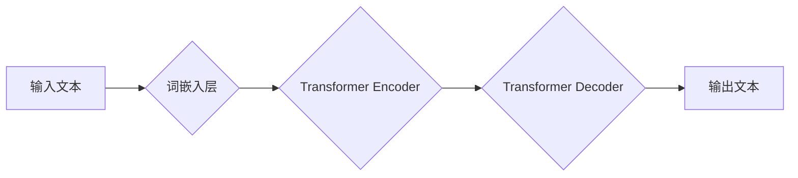

> Large Language Model (LLM), 自然语言处理 (NLP), 深度学习 (Deep Learning), Transformer, 生成式模型, 计算机科学

## 1. 背景介绍

近年来，人工智能（AI）领域取得了令人瞩目的进展，其中，大型语言模型（LLM）作为一种新兴的 AI 技术，展现出强大的潜力，正在深刻地改变着计算机科学的格局。LLM 是一种基于深度学习的强大模型，能够理解和生成人类语言，其应用范围涵盖文本生成、机器翻译、问答系统、代码生成等多个领域。

传统的计算机科学以符号逻辑和算法为基础，侧重于精确计算和逻辑推理。而 LLM 的出现，则为计算机科学注入了一股新的活力，它打破了传统计算机科学的局限性，赋予计算机以更接近人类的语言理解和生成能力。

## 2. 核心概念与联系

LLM 的核心概念是利用深度神经网络学习语言的模式和结构。通过训练海量文本数据，LLM 可以学习到语言的语法、语义和上下文关系，从而能够理解和生成流畅、自然的文本。

**LLM 架构**



**核心概念解释:**

* **词嵌入层:** 将文本中的每个单词映射到一个低维向量空间，使得单词之间的语义关系能够被捕捉。
* **Transformer Encoder:** 利用自注意力机制和多头注意力机制，学习文本中的上下文关系和语义信息。
* **Transformer Decoder:** 基于编码器的输出，生成目标文本。

## 3. 核心算法原理 & 具体操作步骤

### 3.1  算法原理概述

LLM 的核心算法是基于 Transformer 架构的深度神经网络。Transformer 架构的核心是自注意力机制，它能够学习到文本中单词之间的上下文关系，从而提高语言模型的理解和生成能力。

### 3.2  算法步骤详解

1. **数据预处理:** 将原始文本数据进行清洗、分词、标记等预处理操作，使其能够被模型理解。
2. **词嵌入:** 将文本中的每个单词映射到一个低维向量空间，例如使用 Word2Vec 或 GloVe 等词嵌入模型。
3. **Transformer Encoder:** 将词嵌入后的文本输入到 Transformer Encoder 中，通过多层编码器和自注意力机制，学习文本的上下文关系和语义信息。
4. **Transformer Decoder:** 将编码器输出的隐藏状态作为输入，输入到 Transformer Decoder 中，通过解码器和自注意力机制，生成目标文本。
5. **损失函数:** 使用交叉熵损失函数衡量模型的预测结果与真实文本之间的差异。
6. **反向传播:** 利用梯度下降算法，更新模型参数，使得模型的预测结果与真实文本之间的差异最小化。

### 3.3  算法优缺点

**优点:**

* 能够学习到复杂的语言模式和结构。
* 具有强大的文本生成能力。
* 可以应用于多种自然语言处理任务。

**缺点:**

* 训练成本高，需要大量的计算资源和数据。
* 容易受到训练数据中的偏差影响。
* 缺乏对真实世界知识的理解。

### 3.4  算法应用领域

LLM 的应用领域非常广泛，包括：

* **文本生成:** 自动写作、故事创作、诗歌生成等。
* **机器翻译:** 将一种语言翻译成另一种语言。
* **问答系统:** 回答用户提出的问题。
* **代码生成:** 自动生成代码。
* **聊天机器人:** 与用户进行自然语言对话。

## 4. 数学模型和公式 & 详细讲解 & 举例说明

### 4.1  数学模型构建

LLM 的数学模型主要基于 Transformer 架构，其核心是自注意力机制。自注意力机制可以计算每个单词与其他单词之间的相关性，从而学习到文本中的上下文关系。

### 4.2  公式推导过程

**自注意力机制公式:**

$$
Attention(Q, K, V) = softmax(\frac{QK^T}{\sqrt{d_k}})V
$$

其中:

* $Q$：查询矩阵
* $K$：键矩阵
* $V$：值矩阵
* $d_k$：键向量的维度
* $softmax$：softmax 函数

**解释:**

1. 将查询矩阵 $Q$ 与键矩阵 $K$ 进行矩阵乘法，得到一个分数矩阵。
2. 将分数矩阵除以 $\sqrt{d_k}$，以规范化分数。
3. 应用 softmax 函数，将分数矩阵转换为概率分布。
4. 将概率分布与值矩阵 $V$ 进行矩阵乘法，得到最终的注意力输出。

### 4.3  案例分析与讲解

假设我们有一个句子 "The cat sat on the mat"，我们想要计算 "cat" 与其他单词之间的注意力权重。

1. 将每个单词转换为词嵌入向量。
2. 将词嵌入向量作为查询矩阵 $Q$、键矩阵 $K$ 和值矩阵 $V$。
3. 计算注意力权重，得到每个单词与 "cat" 的注意力分数。
4. 将注意力分数进行归一化，得到每个单词与 "cat" 的注意力权重。

通过分析注意力权重，我们可以了解 "cat" 与其他单词之间的关系，例如 "cat" 与 "sat" 的注意力权重较高，表明 "cat" 和 "sat" 存在语义上的关联。

## 5. 项目实践：代码实例和详细解释说明

### 5.1  开发环境搭建

* Python 3.7+
* PyTorch 或 TensorFlow
* CUDA 和 cuDNN (可选，用于 GPU 加速)

### 5.2  源代码详细实现

```python
import torch
import torch.nn as nn

class Transformer(nn.Module):
    def __init__(self, vocab_size, embedding_dim, num_heads, num_layers):
        super(Transformer, self).__init__()
        self.embedding = nn.Embedding(vocab_size, embedding_dim)
        self.encoder_layers = nn.ModuleList([EncoderLayer(embedding_dim, num_heads) for _ in range(num_layers)])
        self.decoder_layers = nn.ModuleList([DecoderLayer(embedding_dim, num_heads) for _ in range(num_layers)])

    def forward(self, input_ids, target_ids):
        # ... (代码实现)

class EncoderLayer(nn.Module):
    # ... (代码实现)

class DecoderLayer(nn.Module):
    # ... (代码实现)
```

### 5.3  代码解读与分析

* **Transformer 类:** 定义了 Transformer 模型的整体结构，包括嵌入层、编码器层和解码器层。
* **EncoderLayer 和 DecoderLayer 类:** 定义了编码器和解码器中的单个层结构，包含自注意力机制、前馈神经网络等模块。
* **forward 方法:** 定义了模型的输入和输出，以及模型的计算过程。

### 5.4  运行结果展示

训练完成后，可以使用模型对新的文本进行预测，例如生成文本、翻译文本等。

## 6. 实际应用场景

LLM 在多个领域都有着广泛的应用场景，例如：

* **聊天机器人:** 构建更自然、更智能的聊天机器人，能够与用户进行流畅的对话。
* **文本摘要:** 自动生成文本的摘要，节省用户阅读时间。
* **机器翻译:** 将一种语言翻译成另一种语言，打破语言障碍。
* **代码生成:** 自动生成代码，提高开发效率。
* **教育领域:** 提供个性化的学习辅导，帮助学生更好地理解知识。

### 6.4  未来应用展望

随着 LLM 技术的不断发展，其应用场景将会更加广泛，例如：

* **个性化内容推荐:** 根据用户的兴趣和偏好，推荐个性化的内容。
* **自动写作:** 自动生成新闻报道、小说、诗歌等各种类型的文本。
* **虚拟助手:** 构建更智能的虚拟助手，能够帮助用户完成各种任务。
* **医疗诊断:** 辅助医生进行疾病诊断，提高诊断准确率。

## 7. 工具和资源推荐

### 7.1  学习资源推荐

* **书籍:**
    * "Deep Learning" by Ian Goodfellow, Yoshua Bengio, and Aaron Courville
    * "Attention Is All You Need" by Vaswani et al.
* **在线课程:**
    * Coursera: Deep Learning Specialization
    * Stanford CS224N: Natural Language Processing with Deep Learning

### 7.2  开发工具推荐

* **PyTorch:** 深度学习框架，支持 GPU 加速。
* **TensorFlow:** 深度学习框架，支持多种平台。
* **Hugging Face Transformers:** 提供预训练的 LLM 模型和工具。

### 7.3  相关论文推荐

* "Attention Is All You Need"
* "BERT: Pre-training of Deep Bidirectional Transformers for Language Understanding"
* "GPT-3: Language Models are Few-Shot Learners"

## 8. 总结：未来发展趋势与挑战

### 8.1  研究成果总结

LLM 技术取得了显著的进展，展现出强大的潜力，为计算机科学带来了新的变革。

### 8.2  未来发展趋势

* **模型规模的进一步扩大:** 训练更大的模型，提升模型的性能。
* **多模态 LLMs:** 将文本、图像、音频等多种模态信息融合到 LLM 中，构建更全面的理解模型。
* **可解释性研究:** 研究 LLM 的决策过程，提高模型的可解释性。
* **伦理与安全问题:** 关注 LLM 的潜在风险，例如生成虚假信息、偏见等问题，并制定相应的伦理规范和安全措施。

### 8.3  面临的挑战

* **训练成本:** 训练大型 LLM 需要大量的计算资源和数据，成本较高。
* **数据偏差:** 训练数据可能存在偏差，导致模型输出存在偏见。
* **可解释性:** LLM 的决策过程复杂，难以解释，这可能会导致模型的信任度降低。

### 8.4  研究展望

未来，LLM 技术将继续发展，并在更多领域发挥重要作用。研究者将继续探索新的模型架构、训练方法和应用场景，推动 LLM 技术的进步。

## 9. 附录：常见问题与解答

* **什么是 LLM?**

LLM 指的是大型语言模型，是一种基于深度学习的强大模型，能够理解和生成人类语言。

* **LLM 的应用场景有哪些?**

LLM 的应用场景非常广泛，包括文本生成、机器翻译、问答系统、代码生成等。

* **如何训练 LLM?**

LLM 的训练需要大量的文本数据和计算资源，通常使用 Transformer 架构的深度神经网络进行训练。

* **LLM 的优势和劣势是什么?**

LLM 的优势在于能够学习到复杂的语言模式和结构，具有强大的文本生成能力。劣势在于训练成本高，容易受到训练数据中的偏差影响。


作者：禅与计算机程序设计艺术 / Zen and the Art of Computer Programming 
<end_of_turn>