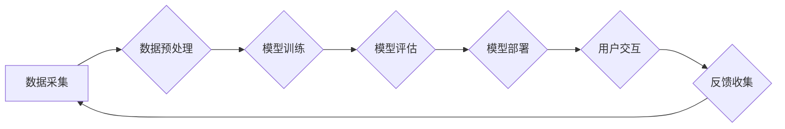

> OpenAI, 人工智能, 价值评估, 训练成本, 模型规模, 竞争格局, 投资回报, 技术趋势

## 1. 背景介绍

2023年，OpenAI 的市值被估算接近 1000 亿美元，这标志着人工智能领域进入了一个新的时代。OpenAI 的成功不仅体现在其强大的技术实力，更体现了市场对人工智能技术的认可和投资热情。

OpenAI 是一家由 Elon Musk、Sam Altman 等科技巨头创立的非营利人工智能研究公司。自成立以来，OpenAI 就致力于开发安全、可控的人工智能技术，并将其应用于各个领域。其旗下的 ChatGPT 聊天机器人凭借其强大的语言生成能力和交互性，迅速走红全球，引发了对人工智能技术的广泛关注和讨论。

OpenAI 的高估值也反映了人工智能技术的巨大潜力。人工智能技术正在深刻地改变着我们的生活，从医疗保健、教育到金融、娱乐等各个领域，人工智能都扮演着越来越重要的角色。

## 2. 核心概念与联系

OpenAI 的核心价值在于其强大的模型训练能力和先进的算法设计。其核心技术包括：

* **Transformer 模型:** Transformer 模型是一种深度学习模型，其能够有效地处理序列数据，例如文本和语音。OpenAI 的 GPT 系列模型都基于 Transformer 架构，并通过大量的训练数据和计算资源，实现了强大的语言理解和生成能力。
* **强化学习:** 强化学习是一种机器学习方法，通过奖励机制来训练模型。OpenAI 利用强化学习技术训练其模型，使其能够更好地理解和响应用户的指令。
* **大规模数据训练:** OpenAI 的模型训练需要大量的文本数据和计算资源。其拥有庞大的数据中心和强大的计算能力，能够训练出规模庞大、性能优异的模型。

**Mermaid 流程图:**

## 3. 核心算法原理 & 具体操作步骤

### 3.1  算法原理概述

OpenAI 的核心算法原理主要基于 Transformer 模型和强化学习技术。

* **Transformer 模型:** Transformer 模型通过自注意力机制和多头注意力机制，能够捕捉文本序列中的长距离依赖关系，从而实现更准确的语言理解和生成。
* **强化学习:** 强化学习通过奖励机制来训练模型，使其能够在特定任务中取得最佳结果。OpenAI 利用强化学习技术训练其模型，使其能够更好地理解用户的指令并生成更符合预期结果的文本。

### 3.2  算法步骤详解

OpenAI 的模型训练过程可以概括为以下步骤：

1. **数据采集:** 收集大量文本数据，例如书籍、文章、网站内容等。
2. **数据预处理:** 对收集到的数据进行清洗、格式化和标记，使其能够被模型训练使用。
3. **模型训练:** 使用 Transformer 模型和强化学习算法，对预处理后的数据进行训练，训练模型能够理解和生成文本。
4. **模型评估:** 使用测试数据评估模型的性能，例如准确率、流畅度等。
5. **模型部署:** 将训练好的模型部署到服务器上，使其能够接受用户的请求并生成文本。

### 3.3  算法优缺点

**优点:**

* **强大的语言理解和生成能力:** Transformer 模型和强化学习算法能够使模型具备强大的语言理解和生成能力，能够生成流畅、自然的文本。
* **可扩展性强:** Transformer 模型的架构能够很好地扩展到更大的数据集和更复杂的模型。
* **适应性强:** 强化学习算法能够使模型适应不同的任务和场景。

**缺点:**

* **训练成本高:** 训练大型语言模型需要大量的计算资源和时间，成本较高。
* **数据依赖性强:** 模型的性能取决于训练数据的质量和数量。
* **可解释性差:** Transformer 模型的内部机制比较复杂，难以解释模型的决策过程。

### 3.4  算法应用领域

OpenAI 的核心算法在多个领域都有广泛的应用，例如：

* **聊天机器人:** ChatGPT 等聊天机器人能够通过自然语言与用户进行对话，提供信息和服务。
* **文本生成:** 可以用于生成各种类型的文本，例如文章、故事、诗歌等。
* **机器翻译:** 可以将文本从一种语言翻译成另一种语言。
* **代码生成:** 可以根据自然语言描述生成代码。

## 4. 数学模型和公式 & 详细讲解 & 举例说明

### 4.1  数学模型构建

Transformer 模型的核心数学模型是自注意力机制和多头注意力机制。

* **自注意力机制:** 自注意力机制能够计算每个词在句子中的重要性，并将其作为上下文信息传递给后续层。其公式如下：

$$
Attention(Q, K, V) = softmax(\frac{QK^T}{\sqrt{d_k}})V
$$

其中，Q、K、V 分别代表查询矩阵、键矩阵和值矩阵，$d_k$ 代表键向量的维度。

* **多头注意力机制:** 多头注意力机制通过并行计算多个自注意力机制，能够捕捉到不同层次的语义信息。其公式如下：

$$
MultiHead(Q, K, V) = Concat(head_1, head_2, ..., head_h)W^O
$$

其中，$head_i$ 代表第 i 个自注意力机制的输出，$h$ 代表注意力头的数量，$W^O$ 代表最终的线性变换矩阵。

### 4.2  公式推导过程

自注意力机制的公式推导过程如下：

1. 将查询矩阵 Q、键矩阵 K 和值矩阵 V 分别进行线性变换，得到 $Q'$, $K'$ 和 $V'$。
2. 计算 $QK^T$ 的每个元素，并进行归一化，得到注意力权重矩阵。
3. 将注意力权重矩阵与值矩阵 V' 相乘，得到最终的注意力输出。

### 4.3  案例分析与讲解

例如，在翻译句子 "The cat sat on the mat" 时，自注意力机制能够计算每个词在句子中的重要性。例如，"cat" 和 "sat" 之间存在着语义关系，因此它们的注意力权重会比较高。而 "the" 和 "mat" 之间则没有直接的语义关系，因此它们的注意力权重会比较低。

## 5. 项目实践：代码实例和详细解释说明

### 5.1  开发环境搭建

OpenAI 的模型训练需要强大的计算资源，通常需要使用云计算平台，例如 Google Cloud Platform 或 Amazon Web Services。

### 5.2  源代码详细实现

OpenAI 的模型代码开源在 GitHub 上，开发者可以根据自己的需求进行修改和使用。

### 5.3  代码解读与分析

OpenAI 的模型代码主要包含以下部分：

* **数据加载和预处理模块:** 用于加载和预处理训练数据。
* **模型定义模块:** 用于定义 Transformer 模型的架构。
* **训练模块:** 用于训练模型，包括优化器、损失函数等。
* **评估模块:** 用于评估模型的性能。

### 5.4  运行结果展示

训练好的模型可以用于生成文本、翻译语言、回答问题等任务。

## 6. 实际应用场景

OpenAI 的技术在多个领域都有实际应用场景：

### 6.1  聊天机器人

ChatGPT 等聊天机器人能够通过自然语言与用户进行对话，提供信息和服务。例如，可以用于客服、教育、娱乐等领域。

### 6.2  文本生成

可以用于生成各种类型的文本，例如文章、故事、诗歌等。例如，可以用于内容创作、营销文案等领域。

### 6.3  机器翻译

可以将文本从一种语言翻译成另一种语言。例如，可以用于国际商务、旅游等领域。

### 6.4  未来应用展望

OpenAI 的技术未来将有更广泛的应用场景，例如：

* **个性化教育:** 根据学生的学习情况，提供个性化的学习内容和辅导。
* **医疗诊断:** 辅助医生进行疾病诊断和治疗方案制定。
* **科学研究:** 加速科学研究的进程，例如药物研发、材料科学等。

## 7. 工具和资源推荐

### 7.1  学习资源推荐

* **OpenAI 官方文档:** https://openai.com/api/
* **Hugging Face:** https://huggingface.co/
* **DeepLearning.AI:** https://www.deeplearning.ai/

### 7.2  开发工具推荐

* **TensorFlow:** https://www.tensorflow.org/
* **PyTorch:** https://pytorch.org/
* **Jupyter Notebook:** https://jupyter.org/

### 7.3  相关论文推荐

* **Attention Is All You Need:** https://arxiv.org/abs/1706.03762
* **BERT: Pre-training of Deep Bidirectional Transformers for Language Understanding:** https://arxiv.org/abs/1810.04805

## 8. 总结：未来发展趋势与挑战

### 8.1  研究成果总结

OpenAI 的研究成果在人工智能领域取得了突破性的进展，其强大的模型训练能力和先进的算法设计，推动了人工智能技术的快速发展。

### 8.2  未来发展趋势

未来，人工智能技术将朝着更加安全、可控、通用化的方向发展。OpenAI 将继续致力于开发更强大的模型和算法，并将其应用于更多领域。

### 8.3  面临的挑战

人工智能技术的发展也面临着一些挑战，例如：

* **数据安全和隐私保护:** 人工智能模型的训练需要大量数据，如何保证数据的安全和隐私保护是一个重要问题。
* **算法偏见:** 人工智能模型的训练数据可能存在偏见，导致模型输出结果存在偏见。
* **伦理问题:** 人工智能技术的应用可能会引发一些伦理问题，例如工作岗位的替代、人工智能的控制权等。

### 8.4  研究展望

OpenAI 将继续致力于解决这些挑战，并推动人工智能技术朝着更加安全、可控、通用化的方向发展。

## 9. 附录：常见问题与解答

**常见问题:**

* OpenAI 的模型是开源的吗？
* OpenAI 的模型训练需要多少计算资源？
* 如何使用 OpenAI 的 API？

**解答:**

* OpenAI 的部分模型代码开源在 GitHub 上，但并非所有模型都开源。
* OpenAI 的模型训练需要大量的计算资源，通常需要使用云计算平台。
* 可以参考 OpenAI 官方文档 https://openai.com/api/ 获取 API 使用指南。

作者：禅与计算机程序设计艺术 / Zen and the Art of Computer Programming 
<end_of_turn>