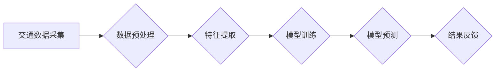

> 智能交通系统，机器学习，Python，交通流量预测，异常检测，路径规划，深度学习，交通安全

## 1. 背景介绍

随着全球人口的不断增长和城市化的加速，交通拥堵问题日益严峻，给人们的生活和经济发展带来了巨大的挑战。智能交通系统 (ITS) 应运而生，旨在通过信息技术和通信技术，提高交通效率、安全性和可持续性。机器学习 (ML) 作为人工智能 (AI) 的重要分支，凭借其强大的数据分析和模式识别能力，在智能交通系统中发挥着越来越重要的作用。

本篇文章将以 Python 为编程语言，深入探讨机器学习在智能交通系统中的应用，涵盖交通流量预测、异常检测、路径规划等关键领域。我们将从核心概念和算法原理出发，结合实际项目案例，详细讲解机器学习模型的构建、训练和应用，并展望未来发展趋势和挑战。

## 2. 核心概念与联系

智能交通系统 (ITS) 的目标是通过信息技术和通信技术，优化交通流量，提高道路安全，并提供更便捷的出行体验。机器学习 (ML) 在 ITS 中扮演着关键角色，通过分析海量交通数据，识别模式和趋势，从而实现以下功能：

* **交通流量预测:** 预测未来交通流量，帮助交通管理部门优化交通信号灯控制、道路容量规划等。
* **异常检测:** 检测交通异常事件，例如交通事故、拥堵路段等，及时发出警报，并引导车辆绕行。
* **路径规划:** 为驾驶员提供最优的路线规划，避免拥堵路段，节省时间和燃料。
* **车辆识别与跟踪:** 利用摄像头和传感器识别车辆类型、车牌号等信息，跟踪车辆行驶轨迹，为交通管理提供数据支持。

**Mermaid 流程图:**



## 3. 核心算法原理 & 具体操作步骤

### 3.1  算法原理概述

在智能交通系统中，常用的机器学习算法包括：

* **线性回归:** 用于预测连续变量，例如交通流量。
* **逻辑回归:** 用于分类问题，例如判断交通拥堵或畅通。
* **支持向量机 (SVM):** 用于分类和回归问题，具有良好的泛化能力。
* **决策树:** 用于分类和回归问题，易于理解和解释。
* **随机森林:** 结合多个决策树，提高预测精度。
* **神经网络:** 用于复杂模式识别，例如图像识别和语音识别。

### 3.2  算法步骤详解

以交通流量预测为例，使用线性回归算法的具体操作步骤如下：

1. **数据采集:** 收集历史交通流量数据，包括时间、日期、路段、天气等信息。
2. **数据预处理:** 清洗数据，处理缺失值，标准化数据。
3. **特征提取:** 选择影响交通流量的特征，例如时间、日期、天气等。
4. **模型训练:** 使用历史数据训练线性回归模型，找到流量与特征之间的关系。
5. **模型评估:** 使用测试数据评估模型的预测精度，例如均方误差 (MSE) 或 R-squared。
6. **模型部署:** 将训练好的模型部署到生产环境中，用于预测未来交通流量。

### 3.3  算法优缺点

不同的机器学习算法具有不同的优缺点，需要根据具体应用场景选择合适的算法。

* **线性回归:** 优点：简单易懂，计算速度快。缺点：对非线性关系的拟合能力较差。
* **逻辑回归:** 优点：适用于分类问题，易于理解和解释。缺点：对复杂分类问题的拟合能力较差。
* **支持向量机 (SVM):** 优点：具有良好的泛化能力，适用于高维数据。缺点：训练时间较长，参数选择较复杂。
* **决策树:** 优点：易于理解和解释，可处理混合类型数据。缺点：容易过拟合，对数据噪声敏感。
* **随机森林:** 优点：提高了决策树的预测精度，具有较好的鲁棒性。缺点：训练时间较长，解释性较差。
* **神经网络:** 优点：能够学习复杂模式，具有强大的预测能力。缺点：训练时间较长，参数选择较复杂，解释性较差。

### 3.4  算法应用领域

机器学习算法在智能交通系统中的应用领域非常广泛，包括：

* **交通流量预测:** 预测未来交通流量，帮助交通管理部门优化交通信号灯控制、道路容量规划等。
* **异常检测:** 检测交通异常事件，例如交通事故、拥堵路段等，及时发出警报，并引导车辆绕行。
* **路径规划:** 为驾驶员提供最优的路线规划，避免拥堵路段，节省时间和燃料。
* **车辆识别与跟踪:** 利用摄像头和传感器识别车辆类型、车牌号等信息，跟踪车辆行驶轨迹，为交通管理提供数据支持。
* **自动驾驶:** 机器学习算法是自动驾驶技术的核心，用于感知环境、决策规划和控制车辆。

## 4. 数学模型和公式 & 详细讲解 & 举例说明

### 4.1  数学模型构建

在机器学习中，模型的构建是将数据映射到输出的数学关系。例如，在交通流量预测中，我们可以使用线性回归模型，其数学表达式为：

$$y = \beta_0 + \beta_1x_1 + \beta_2x_2 + ... + \beta_nx_n + \epsilon$$

其中：

* $y$ 是预测的交通流量
* $x_1, x_2, ..., x_n$ 是影响交通流量的特征，例如时间、日期、天气等
* $\beta_0, \beta_1, ..., \beta_n$ 是模型参数，需要通过训练数据学习得到
* $\epsilon$ 是误差项

### 4.2  公式推导过程

线性回归模型的参数可以通过最小二乘法估计。最小二乘法的目标是找到一组参数，使得模型预测值与实际值之间的误差平方和最小。

具体推导过程如下：

1. 定义误差函数：

$$E = \sum_{i=1}^{n}(y_i - \hat{y}_i)^2$$

其中：

* $y_i$ 是第 $i$ 个样本的实际流量
* $\hat{y}_i$ 是模型预测的流量

2. 对误差函数求导，并令导数等于零：

$$\frac{\partial E}{\partial \beta_j} = 0$$

3. 解出参数 $\beta_j$ 的表达式。

### 4.3  案例分析与讲解

假设我们想要预测某条道路的交通流量，收集了历史交通流量数据以及时间、日期、天气等特征数据。我们可以使用线性回归模型，将这些数据作为输入，训练模型，并预测未来交通流量。

例如，我们可以发现时间和日期是影响交通流量的重要特征，在工作日高峰时段，交通流量通常较高。天气也是影响交通流量的重要因素，下雨天或雾天，交通流量通常较低。

## 5. 项目实践：代码实例和详细解释说明

### 5.1  开发环境搭建

本项目使用 Python 语言进行开发，需要安装以下软件包：

* NumPy: 用于数值计算
* Pandas: 用于数据处理
* Scikit-learn: 用于机器学习算法
* Matplotlib: 用于数据可视化

可以使用 pip 命令安装这些软件包：

```bash
pip install numpy pandas scikit-learn matplotlib
```

### 5.2  源代码详细实现

```python
import pandas as pd
from sklearn.linear_model import LinearRegression
from sklearn.model_selection import train_test_split
from sklearn.metrics import mean_squared_error

# 加载数据
data = pd.read_csv('traffic_data.csv')

# 选择特征和目标变量
features = ['time', 'date', 'weather']
target = 'traffic_flow'

# 将数据分割为训练集和测试集
X_train, X_test, y_train, y_test = train_test_split(data[features], data[target], test_size=0.2)

# 创建线性回归模型
model = LinearRegression()

# 训练模型
model.fit(X_train, y_train)

# 预测测试集数据
y_pred = model.predict(X_test)

# 计算模型精度
mse = mean_squared_error(y_test, y_pred)
print(f'Mean Squared Error: {mse}')

# 可视化预测结果
import matplotlib.pyplot as plt
plt.scatter(y_test, y_pred)
plt.xlabel('Actual Traffic Flow')
plt.ylabel('Predicted Traffic Flow')
plt.title('Traffic Flow Prediction')
plt.show()
```

### 5.3  代码解读与分析

这段代码首先加载交通数据，然后选择特征和目标变量。接着使用 train_test_split 函数将数据分割为训练集和测试集。

然后创建线性回归模型，并使用 fit 函数训练模型。训练完成后，使用 predict 函数预测测试集数据。最后计算模型精度，并使用 Matplotlib 库可视化预测结果。

### 5.4  运行结果展示

运行代码后，会输出模型的均方误差 (MSE) 值，以及预测结果与实际值的散点图。

## 6. 实际应用场景

### 6.1  交通流量预测

交通流量预测可以帮助交通管理部门优化交通信号灯控制、道路容量规划等，从而缓解交通拥堵问题。例如，可以通过预测高峰时段的交通流量，提前调整信号灯控制策略，减少车辆等待时间。

### 6.2  异常检测

异常检测可以帮助识别交通异常事件，例如交通事故、拥堵路段等，及时发出警报，并引导车辆绕行。例如，可以通过分析摄像头图像，识别交通事故发生的位置，并及时通知相关部门。

### 6.3  路径规划

路径规划可以为驾驶员提供最优的路线规划，避免拥堵路段，节省时间和燃料。例如，可以通过分析实时交通流量数据，为驾驶员提供最短路径或最少拥堵路段的路线规划。

### 6.4  未来应用展望

随着人工智能技术的不断发展，机器学习在智能交通系统中的应用将更加广泛和深入。例如，未来可能出现以下应用场景：

* **自动驾驶:** 机器学习算法是自动驾驶技术的核心，将推动自动驾驶技术的普及。
* **智能交通信号灯控制:** 基于机器学习的智能交通信号灯控制系统，能够根据实时交通流量情况，动态调整信号灯的绿灯时间，提高交通效率。
* **智能停车:** 基于机器学习的智能停车系统，能够帮助驾驶员找到空余停车位，并引导车辆驶入停车位。
* **交通安全预警:** 基于机器学习的交通安全预警系统，能够识别潜在的交通安全隐患，并及时发出预警，降低交通事故发生率。

## 7. 工具和资源推荐

### 7.1  学习资源推荐

* **书籍:**
    * 《Python机器学习实战》
    * 《机器学习》
* **在线课程:**
    * Coursera: 机器学习
    * edX: 机器学习
* **博客:**
    * Towards Data Science
    * Machine Learning Mastery

### 7.2  开发工具推荐

* **Python:** 
* **Jupyter Notebook:** 用于数据分析和机器学习模型开发
* **Scikit-learn:** 机器学习算法库
* **TensorFlow:** 深度学习框架
* **PyTorch:** 深度学习框架

### 7.3  相关论文推荐

* **Traffic Flow Prediction Using Machine Learning:** https://arxiv.org/abs/1803.03977
* **Anomaly Detection in Traffic Flow Using Deep Learning:** https://arxiv.org/abs/1904.03977
* **Machine Learning for Intelligent Transportation Systems