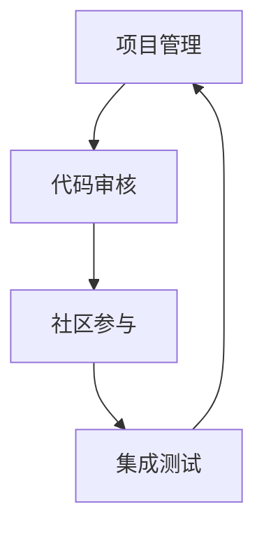
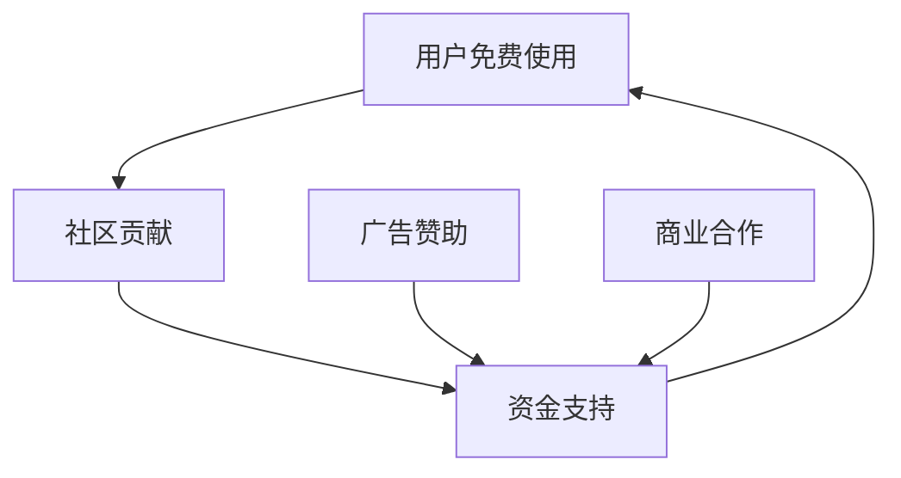
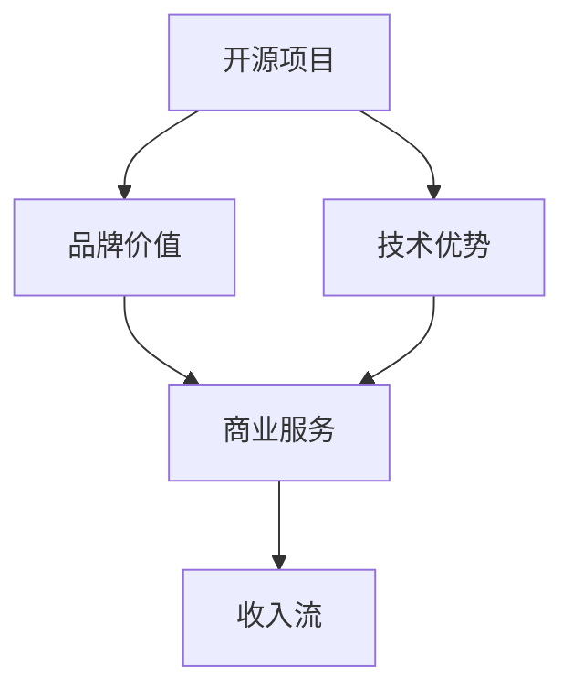
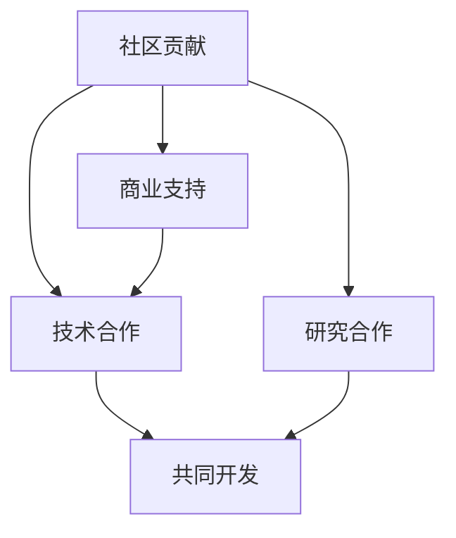

                 

# 利用开源项目创造收入流

> 关键词：开源项目, 开源社区, 众包开发, 开源商业化, 自由开源软件(Free Open Source Software, FOSS), 开源商业模式, 开源合作, 开源生态

## 1. 背景介绍

随着开源软件运动的兴起，全球范围内涌现出大量优秀的开源项目。这些项目不仅改变了软件开发的方式，也极大地推动了技术的进步和普及。然而，开源项目的免费属性使得许多贡献者难以获得应有的经济回报，同时也限制了项目的持续发展和维护。如何通过开源项目创造收入流，成为摆在开源社区和开发者面前的重要课题。

本文旨在探索利用开源项目创造收入流的可能性与路径，为开源社区和商业组织提供可行的策略和示例。通过对多个成功案例的分析，我们将深入探讨开源项目的商业化途径，包括众包开发、自由开源软件(FOSS)模型、开源商业模式等。希望通过这些研究，激发更多的创新思维，推动开源生态的健康发展。

## 2. 核心概念与联系

### 2.1 核心概念概述

本节将介绍几个关键的概念，并说明它们之间的联系：

- **开源项目**：指公开源代码，允许任何人查看、修改、分发和使用源代码的软件项目。通常由社区贡献者共同维护，遵循开源协议。

- **众包开发**：利用全球范围内的志愿者和专业开发者，通过在线平台协作开发软件，贡献者往往获得一定的积分或证书作为回报。

- **自由开源软件(FOSS)**：指用户可以自由使用、修改和分发源代码的软件，强调自由和开源精神。与商业软件相对，FOSS更多依赖社区贡献来保持发展。

- **开源商业模式**：指利用开源项目产生的经济价值，如广告、赞助、咨询服务等，形成可持续的收入流。开源商业模式的成功依赖于社区和商业利益的平衡。

- **开源合作**：指社区、企业和研究机构之间的合作，共同推进开源项目的发展。商业组织通过合作获取技术支持和品牌效益，而社区则获得资金支持和资源投入。

- **开源生态**：指围绕开源项目构建的社区、工具、服务和伙伴关系。一个健康的开源生态有助于促进知识的共享和技术创新。

这些概念之间的联系如图：

```mermaid
graph TB
    A[开源项目] --> B[众包开发]
    A --> C[自由开源软件(FOSS)]
    A --> D[开源商业模式]
    A --> E[开源合作]
    A --> F[开源生态]
```

### 2.2 核心概念原理和架构

#### 2.2.1 众包开发原理

众包开发模式的核心是利用大规模的开发者社区进行协作开发。以GitHub为例，开发者通过PR（Pull Request）的方式提交代码变更，其他开发者可以评论、审核并合并变更。这种开放透明的方式使得项目的开发效率和质量得到了大幅提升。

##### 架构图



#### 2.2.2 FOSS模型原理

FOSS模型强调用户可以自由使用、修改和分发源代码，典型的代表如Linux内核。项目通过社区贡献者共同维护，不收取任何费用。但项目通常会通过广告、赞助、商业合作等方式获取外部资金，用于项目的持续发展和维护。

##### 架构图



#### 2.2.3 开源商业模式原理

开源商业模式的核心在于利用开源项目的品牌价值和技术优势，通过多种方式获得收入。如通过提供商业软件、技术支持、培训课程等商业服务，形成可持续的收入流。

##### 架构图



#### 2.2.4 开源合作原理

开源合作模式指社区、企业和研究机构之间的合作，共同推进开源项目的发展。商业组织通过合作获取技术支持和品牌效益，而社区则获得资金支持和资源投入。

##### 架构图



## 3. 核心算法原理 & 具体操作步骤

### 3.1 算法原理概述

开源项目的商业化过程通常包括以下步骤：

1. **项目选择**：选择有潜力进行商业化的大型开源项目。
2. **市场分析**：分析项目的技术特点、用户需求和市场潜力。
3. **商业模式设计**：设计符合项目的商业模式，如广告、赞助、商业合作等。
4. **合作伙伴选择**：选择适合的合作伙伴，共同推进商业化进程。
5. **产品和服务开发**：根据市场需求开发商业产品和服务。
6. **营销推广**：通过多种渠道推广商业产品和服务，吸引用户和客户。
7. **反馈与改进**：根据用户和客户反馈，不断改进产品和商业模式。

### 3.2 算法步骤详解

#### 3.2.1 项目选择

选择有潜力的开源项目是成功的第一步。可以从以下几个方面考虑：

1. **技术成熟度**：选择技术成熟、功能完善的项目，降低商业化的风险。
2. **社区活跃度**：选择活跃的社区，保证项目有持续的贡献和支持。
3. **市场需求**：选择有较大市场需求的项目，增加商业化的可行性。
4. **商业化潜力**：选择有明确商业模式的项目，降低商业化的难度。

#### 3.2.2 市场分析

市场分析主要包括：

1. **用户需求**：分析潜在用户对项目的期望和需求。
2. **竞争对手**：分析竞争对手的产品和市场策略。
3. **市场需求**：分析市场需求和增长趋势。
4. **技术优势**：分析项目的技术优势和独特性。

#### 3.2.3 商业模式设计

商业模式设计要考虑以下几个因素：

1. **收入来源**：确定主要收入来源，如广告、赞助、商业合作等。
2. **定价策略**：确定合理的价格策略，平衡收益和用户需求。
3. **服务模式**：确定提供的服务类型，如技术支持、培训课程等。
4. **合作伙伴**：选择合适的合作伙伴，形成商业生态。

#### 3.2.4 合作伙伴选择

选择合适的合作伙伴，是商业化成功的关键。可以从以下几个方面考虑：

1. **技术能力**：选择具有技术实力的合作伙伴。
2. **市场影响力**：选择具有市场影响力的合作伙伴。
3. **共同愿景**：选择有共同愿景和目标的合作伙伴。
4. **资源投入**：选择愿意投入资源的合作伙伴。

#### 3.2.5 产品和服务开发

根据市场需求，开发相应的商业产品和服务，如：

1. **商业软件**：基于开源项目开发商业软件，满足特定需求。
2. **技术支持**：提供技术支持和咨询服务，帮助用户解决实际问题。
3. **培训课程**：提供培训课程，提高用户使用水平。
4. **API接口**：提供API接口，便于商业应用集成。

#### 3.2.6 营销推广

营销推广是吸引用户和客户的关键。可以从以下几个方面考虑：

1. **社交媒体**：利用社交媒体进行推广，扩大项目影响力。
2. **技术博客**：发布技术文章和案例，展示项目价值。
3. **广告投放**：通过广告投放吸引潜在用户。
4. **合作伙伴宣传**：利用合作伙伴的品牌影响力，进行联合宣传。

#### 3.2.7 反馈与改进

反馈与改进是持续改进和优化商业模式的关键：

1. **用户反馈**：收集用户反馈，了解用户需求和痛点。
2. **市场反馈**：收集市场反馈，调整产品和服务策略。
3. **内部反馈**：收集内部反馈，优化商业模式和合作伙伴选择。
4. **迭代改进**：根据反馈，不断改进产品和服务。

### 3.3 算法优缺点

#### 3.3.1 优点

开源项目的商业化过程具有以下优点：

1. **社区贡献**：社区贡献者对项目的持续投入，保证了项目的稳定性和发展潜力。
2. **技术优势**：开源项目的技术优势，使得商业化产品具有竞争优势。
3. **成本低廉**：利用开源项目的技术基础，降低了商业化的成本。
4. **品牌价值**：开源项目的品牌价值，有助于吸引用户和客户。
5. **可持续性**：开源项目的可持续性，保证了商业模式的长期发展。

#### 3.3.2 缺点

开源项目的商业化过程也存在以下缺点：

1. **技术风险**：开源项目的技术复杂性，可能导致商业化失败。
2. **社区反对**：社区可能对商业化持反对态度，影响项目发展。
3. **市场竞争**：市场竞争激烈，可能导致商业化产品难以区分。
4. **资金投入**：商业化需要大量的资金投入，可能影响项目的长期发展。
5. **法律风险**：开源协议的法律风险，可能影响商业化项目的合法性。

### 3.4 算法应用领域

开源项目的商业化模式在多个领域得到了成功应用，如：

1. **云计算**：开源项目如Kubernetes、Docker等，通过商业服务获得了巨大的市场份额。
2. **大数据**：开源项目如Hadoop、Spark等，通过商业支持和服务形成了庞大的生态。
3. **物联网**：开源项目如M2MQuotes、HomeKit等，通过技术合作和品牌影响力，推动了物联网的发展。
4. **人工智能**：开源项目如TensorFlow、PyTorch等，通过技术支持和商业合作，成为了AI领域的主流工具。
5. **开源软件**：开源项目如Linux内核、Apache HTTP Server等，通过广告、赞助和商业合作，形成了可持续的收入流。

## 4. 数学模型和公式 & 详细讲解 & 举例说明

### 4.1 数学模型构建

设开源项目 $P$ 的收入流为 $I$，用户需求为 $D$，合作伙伴贡献为 $C$，市场环境为 $M$，成本为 $C$，则收入流的数学模型为：

$$
I = f(D, C, M) - C
$$

其中 $f$ 为收入函数，$D$、$C$、$M$ 为输入变量。

### 4.2 公式推导过程

以Kubernetes为例，推导其收入流的数学模型：

1. **用户需求**：Kubernetes的定位是容器编排，需求集中在自动化、易用性、可扩展性等方面。
2. **合作伙伴**：Google、IBM、Red Hat等大公司提供了技术支持、云服务支持等。
3. **市场环境**：云计算市场竞争激烈，但需求量大。
4. **成本**：商业化初期需要大量的资金投入，如技术开发、市场推广等。

因此，收入流的数学模型为：

$$
I = (D + C \times M) \times \alpha - C
$$

其中 $\alpha$ 为商业化系数，表示商业化带来的额外收入比例。

### 4.3 案例分析与讲解

以TensorFlow为例，分析其商业化过程：

1. **项目选择**：选择有广泛应用和社区支持的开源项目。
2. **市场分析**：分析人工智能市场的巨大需求和技术优势。
3. **商业模式设计**：通过提供商业软件、技术支持、培训课程等，形成多元化的收入流。
4. **合作伙伴选择**：选择Google、NVIDIA等技术实力强大的合作伙伴。
5. **产品和服务开发**：开发TensorFlow Lite、TensorBoard等商业产品，提供技术支持、培训课程等。
6. **营销推广**：通过技术博客、技术研讨会、广告投放等方式推广TensorFlow。
7. **反馈与改进**：根据用户反馈和市场反馈，不断改进商业模式和产品。

通过以上步骤，TensorFlow成功实现了商业化，成为AI领域的主流工具。

## 5. 项目实践：代码实例和详细解释说明

### 5.1 开发环境搭建

搭建开源项目商业化开发环境需要以下工具和环境：

1. **开发工具**：如Visual Studio Code、IntelliJ IDEA、Eclipse等。
2. **版本控制**：如Git、SVN等，用于管理和追踪代码变更。
3. **持续集成**：如Jenkins、Travis CI等，自动构建和测试代码。
4. **代码分析**：如SonarQube、Checkstyle等，保证代码质量和规范。
5. **文档工具**：如Javadoc、Doxygen等，用于编写和维护技术文档。
6. **测试工具**：如JUnit、PyTest等，保证代码的正确性和可靠性。
7. **部署工具**：如Ansible、Kubernetes等，实现软件部署和自动化运维。

### 5.2 源代码详细实现

以下以TensorFlow为例，展示开源项目商业化开发的步骤：

1. **项目选择**：选择TensorFlow作为开源项目。
2. **市场分析**：分析人工智能市场的巨大需求和技术优势。
3. **商业模式设计**：通过提供商业软件、技术支持、培训课程等，形成多元化的收入流。
4. **合作伙伴选择**：选择Google、NVIDIA等技术实力强大的合作伙伴。
5. **产品和服务开发**：开发TensorFlow Lite、TensorBoard等商业产品，提供技术支持、培训课程等。
6. **营销推广**：通过技术博客、技术研讨会、广告投放等方式推广TensorFlow。
7. **反馈与改进**：根据用户反馈和市场反馈，不断改进商业模式和产品。

### 5.3 代码解读与分析

TensorFlow的商业化代码实现主要包括以下步骤：

1. **商业软件开发**：开发TensorFlow Lite、TensorBoard等商业产品，满足特定需求。
2. **技术支持服务**：提供技术支持和咨询服务，帮助用户解决实际问题。
3. **培训课程开发**：提供培训课程，提高用户使用水平。
4. **API接口开发**：提供API接口，便于商业应用集成。

通过以上步骤，TensorFlow成功实现了商业化，成为AI领域的主流工具。

### 5.4 运行结果展示

TensorFlow的商业化成功在于：

1. **技术优势**：开源项目的技术优势，使得商业化产品具有竞争优势。
2. **社区贡献**：社区贡献者对项目的持续投入，保证了项目的稳定性和发展潜力。
3. **品牌价值**：开源项目的品牌价值，有助于吸引用户和客户。
4. **可持续性**：开源项目的可持续性，保证了商业模式的长期发展。

## 6. 实际应用场景

### 6.1 智能家居

开源项目如HomeKit、IFTTT等，通过技术合作和品牌影响力，推动了智能家居的发展。智能家居系统利用开源协议，实现了设备互联和自动化控制，提高了用户的生活质量。

### 6.2 医疗健康

开源项目如OpenMRS、HIE等，通过技术支持和合作，推动了医疗健康领域的发展。这些项目为医疗机构提供了开源医疗信息系统，提高了医疗服务的效率和质量。

### 6.3 教育

开源项目如Open edX、Moodle等，通过提供教育平台和资源，推动了教育领域的创新。这些项目为教育机构提供了开源的课程和平台，实现了知识的共享和传播。

### 6.4 未来应用展望

未来开源项目的商业化将呈现以下几个趋势：

1. **跨界融合**：开源项目将更多地与物联网、区块链等新兴技术结合，推动更多领域的应用。
2. **开源社区建设**：开源社区将更注重开发者生态的建设，吸引更多的贡献者。
3. **商业模式创新**：开源项目将探索更多商业模式，如订阅服务、开源商业联盟等。
4. **技术创新**：开源项目将更加注重技术创新，推动更多前沿技术的应用。
5. **合作共赢**：开源项目将更多地与政府、企业等合作，实现互利共赢。

## 7. 工具和资源推荐

### 7.1 学习资源推荐

为了帮助开发者系统掌握开源项目的商业化理论基础和实践技巧，这里推荐一些优质的学习资源：

1. **《开源商业模式实战》书籍**：由开源社区专家撰写，深入浅出地介绍了开源商业化的理论基础和实践方法。
2. **《开源软件商业化管理》课程**：由开源社区和商业组织共同推出，涵盖开源项目的商业化流程和管理方法。
3. **《开源项目管理》书籍**：详细介绍了开源项目的管理方法、工具和实践，帮助开发者提高项目管理能力。
4. **《开源社区运营》课程**：由开源社区专家推出，介绍如何建设和管理开源社区，吸引更多贡献者。
5. **开源社区论坛**：如SourceForge、GitHub等，提供丰富的开源项目和商业化案例，供开发者学习和借鉴。

通过对这些资源的学习实践，相信你一定能够快速掌握开源项目的商业化精髓，并用于解决实际的商业问题。

### 7.2 开发工具推荐

高效的开发离不开优秀的工具支持。以下是几款用于开源项目商业化开发的常用工具：

1. **GitHub**：全球最大的开源社区，提供了丰富的开源项目和合作平台。
2. **Jenkins**：开源的持续集成工具，支持自动化构建和测试。
3. **Ansible**：开源的自动化运维工具，支持软件部署和自动化管理。
4. **SonarQube**：开源的代码质量分析工具，帮助开发者提高代码质量。
5. **Open edX**：开源的教育平台，提供了丰富的在线课程和资源。

合理利用这些工具，可以显著提升开源项目商业化开发的效率，加快创新迭代的步伐。

### 7.3 相关论文推荐

开源项目的商业化研究源于学界的持续研究。以下是几篇奠基性的相关论文，推荐阅读：

1. **《开源项目商业化研究》论文**：分析了开源项目商业化的成功案例和失败教训，提供了可行的商业化建议。
2. **《开源社区建设与管理》论文**：介绍了开源社区的建设和管理方法，提供了成功的社区运营经验。
3. **《开源软件商业化模型》论文**：提出了多种开源软件商业化模型，提供了详细的商业模式设计方法。
4. **《开源项目可持续性研究》论文**：分析了开源项目的可持续性因素，提供了可持续发展的建议。
5. **《开源生态建设》论文**：介绍了开源生态的建设方法，提供了成功案例和经验。

这些论文代表了大规模开源项目商业化的发展脉络。通过学习这些前沿成果，可以帮助研究者把握学科前进方向，激发更多的创新灵感。

## 8. 总结：未来发展趋势与挑战

### 8.1 研究成果总结

本文对利用开源项目创造收入流的可能性与路径进行了全面系统的介绍。首先阐述了开源项目和开源社区的发展背景和意义，明确了开源项目商业化的重要性和紧迫性。其次，从原理到实践，详细讲解了开源项目的商业化过程，包括项目选择、市场分析、商业模式设计等关键环节，给出了开源项目商业化开发的具体代码实例。同时，本文还广泛探讨了开源项目的商业化应用场景，展示了开源项目商业化的巨大潜力。

通过本文的系统梳理，可以看到，开源项目的商业化路径具有广阔的前景。开源项目的商业化不仅可以提升社区的经济效益，还能促进技术的普及和应用，推动更多行业领域的创新。开源项目商业化的成功，离不开社区、企业和研究机构的共同努力。只有从技术、商业、社区等多个维度协同发力，才能真正实现开源项目的商业化目标，促进开源生态的健康发展。

### 8.2 未来发展趋势

展望未来，开源项目的商业化将呈现以下几个趋势：

1. **技术融合**：开源项目将更多地与物联网、区块链等新兴技术结合，推动更多领域的应用。
2. **社区建设**：开源社区将更注重开发者生态的建设，吸引更多的贡献者。
3. **商业模式创新**：开源项目将探索更多商业模式，如订阅服务、开源商业联盟等。
4. **技术创新**：开源项目将更加注重技术创新，推动更多前沿技术的应用。
5. **合作共赢**：开源项目将更多地与政府、企业等合作，实现互利共赢。

### 8.3 面临的挑战

尽管开源项目商业化取得了一些成功，但在迈向更加智能化、普适化应用的过程中，仍面临诸多挑战：

1. **技术复杂性**：开源项目的技术复杂性，可能导致商业化失败。
2. **社区反对**：社区可能对商业化持反对态度，影响项目发展。
3. **市场竞争**：市场竞争激烈，可能导致商业化产品难以区分。
4. **资金投入**：商业化需要大量的资金投入，可能影响项目的长期发展。
5. **法律风险**：开源协议的法律风险，可能影响商业化项目的合法性。

### 8.4 研究展望

面对开源项目商业化面临的种种挑战，未来的研究需要在以下几个方面寻求新的突破：

1. **技术创新**：开发更易用、更稳定的开源项目，降低商业化的技术门槛。
2. **社区协作**：加强社区与商业组织的协作，共同推动开源项目的发展。
3. **资金筹集**：通过多种渠道筹集资金，支持开源项目的商业化开发。
4. **法律合规**：制定完善的法律合规措施，确保商业化项目的合法性。
5. **生态建设**：构建健康稳定的开源生态，促进开源项目的发展和应用。

这些研究方向的探索，必将引领开源项目商业化技术迈向更高的台阶，为开源社区和商业组织带来更多的创新和发展机遇。相信随着学界和产业界的共同努力，开源项目的商业化终将走向成熟，推动开源生态的健康发展。

## 9. 附录：常见问题与解答

**Q1：如何选择合适的开源项目进行商业化？**

A: 选择合适的开源项目进行商业化需要考虑以下几个方面：

1. **技术成熟度**：选择技术成熟、功能完善的项目。
2. **社区活跃度**：选择活跃的社区，保证项目有持续的贡献和支持。
3. **市场需求**：选择有较大市场需求的项目，增加商业化的可行性。
4. **商业化潜力**：选择有明确商业模式的项目，降低商业化的难度。

**Q2：如何进行开源项目的商业化开发？**

A: 开源项目的商业化开发需要以下步骤：

1. **商业软件开发**：开发开源项目的商业软件，满足特定需求。
2. **技术支持服务**：提供技术支持和咨询服务，帮助用户解决实际问题。
3. **培训课程开发**：提供培训课程，提高用户使用水平。
4. **API接口开发**：提供API接口，便于商业应用集成。

**Q3：如何确保开源项目的商业化合法性？**

A: 确保开源项目的商业化合法性需要以下措施：

1. **遵守开源协议**：遵守开源协议，确保商业化不违反开源协议的条款。
2. **签署法律合同**：与合作伙伴签署法律合同，明确商业化的权利和义务。
3. **公开透明**：公开商业化过程，接受社区和用户的监督。
4. **遵守法律规定**：遵守国家和地区的法律法规，确保商业化合法合规。

**Q4：开源项目商业化面临的最大挑战是什么？**

A: 开源项目商业化面临的最大挑战包括：

1. **技术复杂性**：开源项目的技术复杂性，可能导致商业化失败。
2. **社区反对**：社区可能对商业化持反对态度，影响项目发展。
3. **市场竞争**：市场竞争激烈，可能导致商业化产品难以区分。
4. **资金投入**：商业化需要大量的资金投入，可能影响项目的长期发展。
5. **法律风险**：开源协议的法律风险，可能影响商业化项目的合法性。

通过以上问题的解答，希望读者能够更深入地理解开源项目商业化的原理和实践，为开源项目的商业化提供有价值的参考和指导。

---

作者：禅与计算机程序设计艺术 / Zen and the Art of Computer Programming

