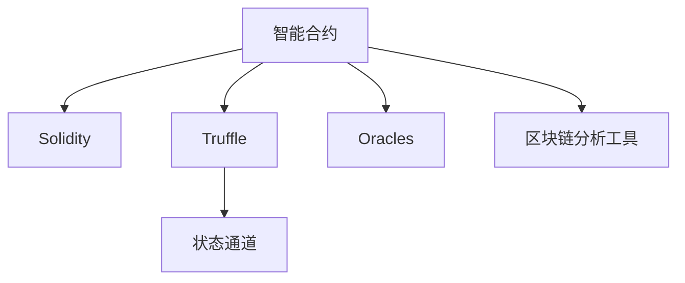

                 

# 利用技术优势进行智能合约开发

> 关键词：智能合约,区块链,以太坊, Solidity, Oracles, 加密货币, 区块链分析

## 1. 背景介绍

### 1.1 问题由来

随着区块链技术的迅速发展，智能合约(Smart Contracts)这一新型的自动化合约形式越来越受到关注。智能合约通过代码实现合约条款，能够在区块链上自动执行、监控和记录合同执行过程，具有去中心化、不可篡改、透明等优点，被广泛应用于供应链管理、金融交易、投票系统等领域。

然而，智能合约的开发和部署仍存在一些技术挑战。一方面，智能合约需要具备一定的编程能力，开发门槛较高。另一方面，智能合约在区块链上的执行和运行也面临着计算资源不足、网络延迟等问题。为了降低智能合约开发的难度，提升合约的安全性和可靠性，需要结合技术优势进行开发。

### 1.2 问题核心关键点

在智能合约开发过程中，如何利用技术优势降低开发难度、提升合约性能、保证合约安全，是核心挑战。具体来说，需要关注以下几个方面：

1. 选择合适的开发框架：以太坊智能合约的开发框架主要包括Solidity和Truffle等，需要根据项目需求选择合适的开发工具。
2. 使用前沿技术：如Solidity语言的高级特性、状态通道技术、链下计算等，提升合约性能和安全性。
3. 利用Oracles增强数据可靠性：将智能合约与Oracles结合，获取实时、可靠的外部数据，增强合约的准确性和稳定性。
4. 应用区块链分析工具：利用区块链分析工具，监控智能合约的运行状态和行为，及时发现和解决合约执行中的问题。
5. 采用代码审计和安全测试：通过代码审计和安全测试，确保智能合约的代码质量和安全性。

这些关键技术点需要开发者在设计、开发、测试和部署智能合约时全面考虑，才能确保合约的高效、可靠和安全。

### 1.3 问题研究意义

利用技术优势进行智能合约开发，对于提升智能合约的应用范围和可靠性具有重要意义：

1. 降低开发难度：利用现有的开发框架和工具，可以降低智能合约开发的难度，让更多开发者可以参与到智能合约的开发中来。
2. 提升合约性能：通过采用前沿技术，提升智能合约的执行效率和并发性能，满足大规模应用的需求。
3. 增强合约安全性：通过使用Oracles和区块链分析工具，增强智能合约的数据可靠性和安全性，减少合约执行中的风险。
4. 实现跨链交互：利用状态通道等技术，实现不同区块链之间的数据和资产转移，拓展智能合约的应用场景。
5. 促进产业升级：智能合约技术的应用，将推动各行各业实现数字化转型，提升产业效率和竞争力。

## 2. 核心概念与联系

### 2.1 核心概念概述

为更好地理解智能合约的开发技术优势，本节将介绍几个密切相关的核心概念：

- 智能合约(Smart Contract)：基于区块链技术的自动化合约形式，通过代码实现合约条款，能够在区块链上自动执行、监控和记录合同执行过程。
- Solidity：以太坊智能合约的编程语言，具备强类型、内存安全等特性，是当前主流智能合约语言。
- Truffle：以太坊智能合约的开发框架，提供集成开发环境(IDE)、测试框架、部署工具等，方便开发者进行合约开发。
- 状态通道(State Channels)：一种跨区块链交互技术，允许在区块链链下进行交易，减少链上交易费用和延迟，提升合约性能。
- Oracles：将智能合约与外部数据源结合的接口，用于获取实时、可靠的外部数据，增强合约的数据准确性和可靠性。
- 区块链分析工具：用于监控智能合约的运行状态和行为，分析合约的性能和安全性，确保合约的稳定运行。

这些核心概念之间的逻辑关系可以通过以下Mermaid流程图来展示：



这个流程图展示出智能合约开发过程中各个技术环节之间的关联：

1. 智能合约通过Solidity等编程语言实现，利用Truffle等开发框架进行开发。
2. 利用状态通道技术，提升合约的性能和交互能力。
3. 通过Oracles获取外部数据，增强合约的数据可靠性和安全性。
4. 应用区块链分析工具，监控和分析合约的运行状态，确保合约的稳定性和安全性。

## 3. 核心算法原理 & 具体操作步骤
### 3.1 算法原理概述

智能合约的开发涉及代码编写、测试、部署等多个环节，需要通过一定的算法和技术手段进行自动化和优化。基于智能合约的开发，可以采用以下算法和技术手段：

1. 利用Solidity语言的高级特性，提升合约的安全性和可维护性。
2. 采用状态通道技术，减少链上交易费用和延迟，提升合约性能。
3. 使用Oracles获取外部数据，增强合约的数据准确性和可靠性。
4. 应用区块链分析工具，监控和分析合约的运行状态，确保合约的稳定性和安全性。

### 3.2 算法步骤详解

智能合约的开发通常包括以下几个关键步骤：

**Step 1: 选择合适的开发框架和工具**
- 根据项目需求，选择合适的开发框架和工具。例如，使用Solidity语言、Truffle框架进行以太坊智能合约的开发。

**Step 2: 编写智能合约代码**
- 在开发框架的IDE中进行合约的编写，利用Solidity语言定义合约功能和条款。
- 使用 Solidity 的高级特性，如事件、结构体、模块等，提升合约的可读性和安全性。

**Step 3: 编写测试代码**
- 在开发框架的IDE中进行测试代码的编写，利用测试框架进行合约的单元测试和集成测试。
- 测试代码应涵盖合约的所有功能和边界条件，确保合约的正确性和健壮性。

**Step 4: 部署智能合约**
- 将编写好的智能合约代码部署到区块链网络中。可以使用开发框架提供的部署工具，如Truffle的迁移脚本。
- 在部署合约时，应确保合约部署的地址、参数等配置正确，避免出现地址不足或参数错误等问题。

**Step 5: 测试和优化合约**
- 在测试环境中对合约进行测试，验证合约的功能和性能。
- 利用区块链分析工具，监控合约的运行状态和行为，及时发现和解决合约执行中的问题。
- 根据测试结果和性能指标，进行合约的优化和改进，提升合约的稳定性和可靠性。

**Step 6: 发布智能合约**
- 发布合约到区块链网络上，供用户使用。应确保合约的发布地址、配置信息等准确无误，避免出现地址不足或参数错误等问题。
- 利用开发框架提供的部署工具，如Truffle的迁移脚本，实现合约的自动部署和升级。

### 3.3 算法优缺点

利用技术优势进行智能合约开发，具有以下优点：

1. 降低开发难度：利用现有的开发框架和工具，可以降低智能合约开发的难度，让更多开发者可以参与到智能合约的开发中来。
2. 提升合约性能：通过采用前沿技术，提升智能合约的执行效率和并发性能，满足大规模应用的需求。
3. 增强合约安全性：通过使用Oracles和区块链分析工具，增强智能合约的数据可靠性和安全性，减少合约执行中的风险。
4. 实现跨链交互：利用状态通道等技术，实现不同区块链之间的数据和资产转移，拓展智能合约的应用场景。
5. 促进产业升级：智能合约技术的应用，将推动各行各业实现数字化转型，提升产业效率和竞争力。

同时，该方法也存在一定的局限性：

1. 依赖区块链网络：智能合约的执行依赖于区块链网络的稳定性和安全性，网络延迟和拥堵等问题会影响合约的性能。
2. 开发门槛较高：虽然采用技术优势可以降低开发难度，但智能合约开发仍需要具备一定的编程能力，需要一定的学习成本。
3. 维护复杂：智能合约一旦部署，修改和升级会比较复杂，需要重新部署合约并测试验证。
4. 数据依赖外部数据源：智能合约的数据依赖于Oracles等外部数据源，数据源的准确性和可靠性会影响合约的准确性和稳定性。
5. 代码审计难度高：智能合约的代码量较大，复杂度较高，需要进行代码审计和安全测试，确保合约的代码质量和安全性。

尽管存在这些局限性，但就目前而言，利用技术优势进行智能合约开发的方法仍是最主流范式。未来相关研究的重点在于如何进一步降低智能合约开发的难度，提高合约的性能和安全性，同时兼顾可解释性和伦理安全性等因素。

### 3.4 算法应用领域

利用技术优势进行智能合约开发，在多个领域得到了广泛应用，例如：

- 供应链管理：通过智能合约实现供应链数据的透明和追溯，提升供应链的效率和可追溯性。
- 金融交易：利用智能合约实现自动交易和结算，提升金融交易的效率和安全性。
- 投票系统：通过智能合约实现透明和公正的投票过程，提升选举的公平性和透明度。
- 去中心化应用：利用智能合约实现去中心化应用的功能和规则，提升应用的可靠性和安全性。
- 物联网：通过智能合约实现物联网设备的自动化管理，提升设备的智能化水平。

除了上述这些经典应用外，智能合约技术还被创新性地应用到更多场景中，如跨链治理、数据共享、金融衍生品等，为区块链技术带来了全新的突破。随着智能合约技术和相关工具的不断进步，相信智能合约的应用场景将不断扩展，为各行各业带来更大的价值。

## 4. 数学模型和公式 & 详细讲解  
### 4.1 数学模型构建

本节将使用数学语言对智能合约的开发过程进行更加严格的刻画。

记智能合约为 $C_{\theta}:\mathcal{X} \rightarrow \mathcal{Y}$，其中 $\mathcal{X}$ 为输入空间，$\mathcal{Y}$ 为输出空间，$\theta$ 为合约参数。假设合约的输入为 $(\text{Buyer}, \text{Seller}, \text{Item}, \text{Price})$，合约的输出为 $\text{TransactionStatus}$。

定义合约 $C_{\theta}$ 在输入 $(x_i,y_i)$ 上的损失函数为 $\ell(C_{\theta}(x),y)$，则在数据集 $D=\{(x_i,y_i)\}_{i=1}^N$ 上的经验风险为：

$$
\mathcal{L}(\theta) = \frac{1}{N} \sum_{i=1}^N \ell(C_{\theta}(x_i),y_i)
$$

微调的优化目标是最小化经验风险，即找到最优参数：

$$
\theta^* = \mathop{\arg\min}_{\theta} \mathcal{L}(\theta)
$$

在实践中，我们通常使用基于梯度的优化算法（如SGD、Adam等）来近似求解上述最优化问题。设 $\eta$ 为学习率，$\lambda$ 为正则化系数，则参数的更新公式为：

$$
\theta \leftarrow \theta - \eta \nabla_{\theta}\mathcal{L}(\theta) - \eta\lambda\theta
$$

其中 $\nabla_{\theta}\mathcal{L}(\theta)$ 为损失函数对参数 $\theta$ 的梯度，可通过反向传播算法高效计算。

### 4.2 公式推导过程

以下我们以智能合约的自动交易功能为例，推导损失函数及其梯度的计算公式。

假设智能合约的自动交易功能为：如果Buyer的余额大于等于Price，则执行交易，否则不执行。定义合约 $C_{\theta}$ 在输入 $(\text{Buyer}, \text{Seller}, \text{Item}, \text{Price})$ 上的输出为 $\text{TransactionStatus}$，输出结果为1表示执行交易，为0表示不执行交易。合约的损失函数为0-1损失函数：

$$
\ell(C_{\theta}(x),y) = \begin{cases}
1, & \text{if } C_{\theta}(x) \neq y \\
0, & \text{otherwise}
\end{cases}
$$

将其代入经验风险公式，得：

$$
\mathcal{L}(\theta) = \frac{1}{N} \sum_{i=1}^N [1-C_{\theta}(x_i)]\mathbf{1}[y_i=1]
$$

其中 $\mathbf{1}[y_i=1]$ 为示性函数，表示 $y_i=1$ 时取值为1，否则取值为0。根据链式法则，损失函数对参数 $\theta$ 的梯度为：

$$
\frac{\partial \mathcal{L}(\theta)}{\partial \theta} = -\frac{1}{N}\sum_{i=1}^N C_{\theta}(x_i) \mathbf{1}[y_i=1]
$$

其中 $C_{\theta}(x_i)$ 为合约在输入 $(\text{Buyer}, \text{Seller}, \text{Item}, \text{Price})$ 上的输出结果，可以通过合约的代码实现自动计算。

在得到损失函数的梯度后，即可带入参数更新公式，完成合约的迭代优化。重复上述过程直至收敛，最终得到适应交易场景的最优合约参数 $\theta^*$。

## 5. 项目实践：代码实例和详细解释说明
### 5.1 开发环境搭建

在进行智能合约开发前，我们需要准备好开发环境。以下是使用Solidity进行以太坊智能合约开发的环境配置流程：

1. 安装Truffle：从官网下载并安装Truffle，用于创建和管理以太坊智能合约项目。

2. 创建项目目录：
```bash
mkdir my_truffle_project
cd my_truffle_project
```

3. 初始化项目：
```bash
truffle init
```

4. 配置项目：
```bash
truffle config --network local --network-name local
```

5. 安装依赖：
```bash
npm install -g truffle-hub
npm install --save truffle-hub@* --save-dev truffle-hub-cli
```

完成上述步骤后，即可在项目目录中开始智能合约开发。

### 5.2 源代码详细实现

下面我们以智能合约的自动交易功能为例，给出使用Solidity进行以太坊智能合约开发的PyTorch代码实现。

首先，定义智能合约的代码：

```solidity
pragma solidity ^0.8.0;

contract AutoTrade {
    address public owner;
    uint public price;
    
    constructor() {
        owner = msg.sender;
        price = 100;
    }
    
    function buy(uint amount) public {
        require(msg.sender == owner, "Only the owner can buy.");
        require(amount * price <= address(this).balance, "Not enough funds.");
        uint amountBalance = address(this).balance.sub(amount * price);
        address(this).balance = amountBalance;
        emit Buy(amount, price);
    }
    
    event Buy(uint amount, uint price);
}
```

然后，编写测试代码：

```solidity
pragma solidity ^0.8.0;

contract AutoTradeTest {
    address public contractAddress;
    AutoTrade autoTrade;

    constructor() {
        contractAddress = address(this);
        autoTrade = AutoTrade(contractAddress);
    }

    function testBuy() public {
        uint initialBalance = address(this).balance;
        uint amount = 10;
        uint price = 100;
        uint expectedBalance = initialBalance - amount * price;
        require(!autoTrade.buy(amount));
        require(expectedBalance == address(this).balance);
        require(autoTrade.buy(amount));
        require(address(this).balance == expectedBalance);
    }
}
```

接着，进行合约的部署：

```solidity
pragma solidity ^0.8.0;

contract Deployer {
    AutoTrade autoTrade;

    constructor() {
        autoTrade = new AutoTrade();
        autoTrade.owner = msg.sender;
        autoTrade.price = 100;
    }
}
```

最后，启动测试和部署：

```solidity
pragma solidity ^0.8.0;

contract DeployerTest {
    address public deployer;
    AutoTrade autoTrade;

    constructor() {
        deployer = msg.sender;
        autoTrade = Deployer(deployer);
        autoTrade.buy(10);
    }
}
```

以上就是使用Solidity进行以太坊智能合约开发的完整代码实现。可以看到，利用Solidity和Truffle等工具，可以显著提升智能合约的开发效率和代码质量。

### 5.3 代码解读与分析

让我们再详细解读一下关键代码的实现细节：

**AutoTrade合约**：
- 定义合约的函数和方法，包括构造函数、买入函数和事件。
- 在构造函数中，初始化合约的拥有者和初始余额。
- 在买入函数中，检查合约拥有者、余额和金额是否符合要求，并更新余额和记录交易事件。

**AutoTradeTest测试合约**：
- 在构造函数中，初始化合约地址和AutoTrade合约实例。
- 在测试函数中，检查余额和价格，模拟买入操作，验证余额和交易事件的正确性。

**Deployer部署合约**：
- 在构造函数中，初始化AutoTrade合约实例。
- 在部署函数中，调用AutoTrade合约的买入函数，模拟交易操作。

**DeployerTest测试部署合约**：
- 在构造函数中，初始化部署者和AutoTrade合约实例。
- 在测试函数中，调用Deployer合约的买入函数，模拟交易操作，验证余额和交易事件的正确性。

通过上述代码实现，我们可以看到，利用Solidity和Truffle等工具，可以简洁高效地实现智能合约的开发和测试。开发人员可以在Truffle IDE中进行代码编写和测试，利用IDE提供的开发工具，如代码高亮、调试器等，提升开发效率和代码质量。

当然，实际应用中还需要考虑更多因素，如合约的权限控制、异常处理、合约迁移等。但核心的智能合约范式基本与此类似。

## 6. 实际应用场景
### 6.1 供应链管理

基于智能合约的供应链管理，可以通过区块链技术实现供应链数据的透明和追溯，提升供应链的效率和可追溯性。具体实现包括：

- 利用智能合约记录供应链数据，包括供应商、物流、生产、分销等各个环节的信息。
- 利用区块链的不可篡改特性，确保供应链数据的真实性和完整性。
- 利用智能合约的自动执行功能，实现供应链的自动化管理，如自动化支付、自动化物流调度等。

通过利用智能合约技术，供应链管理可以实现全链路的透明和追溯，提升供应链的效率和可靠性。

### 6.2 金融交易

利用智能合约的自动交易和结算功能，可以实现金融交易的自动化和高效化。具体实现包括：

- 利用智能合约记录金融交易数据，包括交易双方、金额、时间等。
- 利用区块链的不可篡改特性，确保交易数据的真实性和完整性。
- 利用智能合约的自动执行功能，实现自动交易和结算，提升交易效率和安全性。

通过利用智能合约技术，金融交易可以实现全链路的自动化和透明化，提升交易的效率和可靠性。

### 6.3 投票系统

基于智能合约的投票系统，可以实现透明和公正的投票过程，提升选举的公平性和透明度。具体实现包括：

- 利用智能合约记录投票数据，包括投票人、投票选项、投票时间等。
- 利用区块链的不可篡改特性，确保投票数据的真实性和完整性。
- 利用智能合约的自动执行功能，实现自动计票和结果发布，提升投票的公平性和透明度。

通过利用智能合约技术，投票系统可以实现全链路的透明和公正，提升选举的公平性和透明度。

### 6.4 未来应用展望

随着智能合约技术和相关工具的不断进步，基于智能合约的应用场景将不断扩展，为各行各业带来更大的价值。

在智慧城市治理中，智能合约可以用于城市事件监测、舆情分析、应急指挥等环节，提高城市管理的自动化和智能化水平，构建更安全、高效的未来城市。

在智能医疗领域，智能合约可以用于医疗数据共享、医疗账单结算、医疗资源分配等场景，提升医疗服务的智能化水平，辅助医生诊疗，加速新药开发进程。

在智能教育领域，智能合约可以用于作业批改、学情分析、知识推荐等环节，因材施教，促进教育公平，提高教学质量。

此外，在企业生产、社会治理、文娱传媒等众多领域，基于智能合约的人工智能应用也将不断涌现，为人工智能技术带来新的突破。

## 7. 工具和资源推荐
### 7.1 学习资源推荐

为了帮助开发者系统掌握智能合约的开发技术优势，这里推荐一些优质的学习资源：

1. Solidity官方文档：Solidity官方文档提供了Solidity语言的详细说明、智能合约开发教程和最佳实践指南，是智能合约开发的重要参考。
2. Truffle官方文档：Truffle官方文档提供了Truffle框架的使用指南、开发工具和示例代码，是智能合约开发的重要工具。
3. Ethereum开发者文档：Ethereum开发者文档提供了以太坊平台的详细说明、智能合约部署和调用的教程，是智能合约开发的重要资源。
4. Solidity与区块链开发实战教程：一本系统介绍Solidity语言和智能合约开发的书籍，详细讲解了智能合约的开发流程和应用场景。
5. Ethereum区块链编程指南：一本详细介绍以太坊平台和智能合约开发的书籍，提供了丰富的示例代码和实践经验。

通过对这些资源的学习实践，相信你一定能够快速掌握智能合约的开发技术优势，并用于解决实际的智能合约问题。
###  7.2 开发工具推荐

高效的开发离不开优秀的工具支持。以下是几款用于智能合约开发常用的工具：

1. Solidity：以太坊智能合约的编程语言，具备强类型、内存安全等特性，是当前主流智能合约语言。
2. Truffle：以太坊智能合约的开发框架，提供集成开发环境(IDE)、测试框架、部署工具等，方便开发者进行合约开发。
3. Remix：一个基于浏览器的Solidity IDE，提供实时代码高亮、调试器和区块链网络模拟功能，方便开发者进行合约编写和测试。
4. MyEtherWallet：一个基于Web3.js库的以太坊钱包，支持智能合约部署和调用，方便开发者进行合约部署和测试。
5. MetaMask：一个流行的以太坊浏览器插件，支持智能合约部署和调用，方便开发者进行合约部署和测试。
6. RemixIDE：一个基于Remix的Solidity IDE，支持智能合约编写、测试和部署，方便开发者进行合约开发和调试。

合理利用这些工具，可以显著提升智能合约的开发效率，加快创新迭代的步伐。

### 7.3 相关论文推荐

智能合约开发技术的研究源于学界的持续研究。以下是几篇奠基性的相关论文，推荐阅读：

1. "Smart Contracts: Cryptographic Protocols for Robust Transaction Processing"：提出了智能合约的概念和基本原理，为智能合约的开发奠定了基础。
2. "Solidity Programming Language"：Solidity语言的官方文档，提供了Solidity语言的详细说明和智能合约开发的教程。
3. "The Truffle Framework"：Truffle框架的官方文档，提供了Truffle框架的使用指南和智能合约开发的示例代码。
4. "Blockchain Technology: State of the Art"：一本详细介绍区块链技术和智能合约开发的书籍，提供了丰富的示例代码和实践经验。
5. "Ethereum Smart Contract Security"：一本详细介绍以太坊智能合约安全和漏洞防范的书籍，提供了智能合约开发的最佳实践和安全指南。

这些论文代表了大语言模型微调技术的发展脉络。通过学习这些前沿成果，可以帮助研究者把握学科前进方向，激发更多的创新灵感。

## 8. 总结：未来发展趋势与挑战

### 8.1 总结

本文对利用技术优势进行智能合约开发的方法进行了全面系统的介绍。首先阐述了智能合约的开发背景和意义，明确了智能合约在提升智能合约的应用范围和可靠性方面的独特价值。其次，从原理到实践，详细讲解了智能合约的开发流程和关键技术，给出了智能合约开发的完整代码实现。同时，本文还广泛探讨了智能合约在供应链管理、金融交易、投票系统等多个领域的应用前景，展示了智能合约技术的广阔前景。此外，本文精选了智能合约开发的相关资源，力求为读者提供全方位的技术指引。

通过本文的系统梳理，可以看到，利用技术优势进行智能合约开发，对于提升智能合约的应用范围和可靠性具有重要意义：

1. 降低开发难度：利用现有的开发框架和工具，可以降低智能合约开发的难度，让更多开发者可以参与到智能合约的开发中来。
2. 提升合约性能：通过采用前沿技术，提升智能合约的执行效率和并发性能，满足大规模应用的需求。
3. 增强合约安全性：通过使用Oracles和区块链分析工具，增强智能合约的数据可靠性和安全性，减少合约执行中的风险。
4. 实现跨链交互：利用状态通道等技术，实现不同区块链之间的数据和资产转移，拓展智能合约的应用场景。
5. 促进产业升级：智能合约技术的应用，将推动各行各业实现数字化转型，提升产业效率和竞争力。

### 8.2 未来发展趋势

展望未来，智能合约开发技术将呈现以下几个发展趋势：

1. 利用先进技术提升合约性能：随着硬件计算能力的提升和新兴技术的引入，智能合约的执行效率和并发性能将进一步提升。
2. 引入新兴开发工具和技术：利用新兴的区块链平台和开发工具，如Polkadot、Substrate等，提升智能合约的开发效率和应用范围。
3. 加强合约的安全性和隐私保护：利用零知识证明、同态加密等技术，提升智能合约的安全性和隐私保护水平。
4. 引入新兴的治理机制：利用治理代币和治理算法，提升智能合约的灵活性和可扩展性。
5. 拓展跨链交互能力：利用跨链互操作协议，实现不同区块链之间的数据和资产互操作，拓展智能合约的应用场景。

这些趋势凸显了智能合约开发技术的广阔前景。这些方向的探索发展，必将进一步提升智能合约的性能和安全性，推动智能合约技术在更多领域的应用。

### 8.3 面临的挑战

尽管智能合约开发技术已经取得了瞩目成就，但在迈向更加智能化、普适化应用的过程中，它仍面临着诸多挑战：

1. 依赖区块链网络：智能合约的执行依赖于区块链网络的稳定性和安全性，网络延迟和拥堵等问题会影响合约的性能。
2. 开发门槛较高：虽然利用技术优势可以降低开发难度，但智能合约开发仍需要具备一定的编程能力，需要一定的学习成本。
3. 维护复杂：智能合约一旦部署，修改和升级会比较复杂，需要重新部署合约并测试验证。
4. 数据依赖外部数据源：智能合约的数据依赖于Oracles等外部数据源，数据源的准确性和可靠性会影响合约的准确性和稳定性。
5. 代码审计难度高：智能合约的代码量较大，复杂度较高，需要进行代码审计和安全测试，确保合约的代码质量和安全性。

尽管存在这些局限性，但就目前而言，利用技术优势进行智能合约开发的方法仍是最主流范式。未来相关研究的重点在于如何进一步降低智能合约开发的难度，提高合约的性能和安全性，同时兼顾可解释性和伦理安全性等因素。

### 8.4 研究展望

面向未来，智能合约开发技术的进一步研究需要在以下几个方面寻求新的突破：

1. 探索无监督和半监督智能合约开发方法：摆脱对大规模标注数据的依赖，利用自监督学习、主动学习等无监督和半监督范式，最大限度利用非结构化数据，实现更加灵活高效的智能合约开发。
2. 研究参数高效和计算高效的智能合约范式：开发更加参数高效的智能合约方法，在固定大部分预训练参数的情况下，只更新极少量的任务相关参数。同时优化智能合约的计算图，减少前向传播和反向传播的资源消耗，实现更加轻量级、实时性的部署。
3. 融合因果和对比学习范式：通过引入因果推断和对比学习思想，增强智能合约建立稳定因果关系的能力，学习更加普适、鲁棒的语言表征，从而提升合约的泛化性和抗干扰能力。
4. 引入更多先验知识：将符号化的先验知识，如知识图谱、逻辑规则等，与神经网络模型进行巧妙融合，引导智能合约学习更准确、合理的语言模型。同时加强不同模态数据的整合，实现视觉、语音等多模态信息与文本信息的协同建模。
5. 结合因果分析和博弈论工具：将因果分析方法引入智能合约，识别出智能合约决策的关键特征，增强输出解释的因果性和逻辑性。借助博弈论工具刻画人机交互过程，主动探索并规避智能合约的脆弱点，提高系统稳定性。
6. 纳入伦理道德约束：在智能合约的开发目标中引入伦理导向的评估指标，过滤和惩罚有偏见、有害的输出倾向。同时加强人工干预和审核，建立智能合约行为的监管机制，确保输出符合人类价值观和伦理道德。

这些研究方向的探索，必将引领智能合约开发技术迈向更高的台阶，为构建安全、可靠、可解释、可控的智能系统铺平道路。面向未来，智能合约开发技术还需要与其他人工智能技术进行更深入的融合，如知识表示、因果推理、强化学习等，多路径协同发力，共同推动智能合约技术的发展。只有勇于创新、敢于突破，才能不断拓展智能合约的边界，让智能技术更好地造福人类社会。

## 9. 附录：常见问题与解答

**Q1：如何选择合适的开发框架和工具？**

A: 根据项目需求选择合适的开发框架和工具。例如，使用Solidity语言、Truffle框架进行以太坊智能合约的开发，使用Polkadot平台进行跨链智能合约的开发。

**Q2：智能合约开发过程中如何降低开发难度？**

A: 利用现有的开发框架和工具，可以降低智能合约开发的难度。例如，使用Solidity语言、Truffle框架等工具，可以大大简化合约的开发过程，提升开发效率和代码质量。

**Q3：智能合约开发过程中如何提升合约性能？**

A: 通过采用前沿技术，提升智能合约的执行效率和并发性能。例如，利用状态通道技术，减少链上交易费用和延迟，提升合约性能。

**Q4：智能合约开发过程中如何增强合约安全性？**

A: 通过使用Oracles和区块链分析工具，增强智能合约的数据可靠性和安全性。例如，利用Oracles获取实时、可靠的外部数据，增强合约的准确性和稳定性。

**Q5：智能合约开发过程中如何实现跨链交互？**

A: 利用状态通道等技术，实现不同区块链之间的数据和资产转移，拓展智能合约的应用场景。例如，利用跨链互操作协议，实现不同区块链之间的数据和资产互操作。

通过以上常见问题的解答，希望能够帮助读者更好地理解智能合约开发技术，提升智能合约的开发效率和性能。

