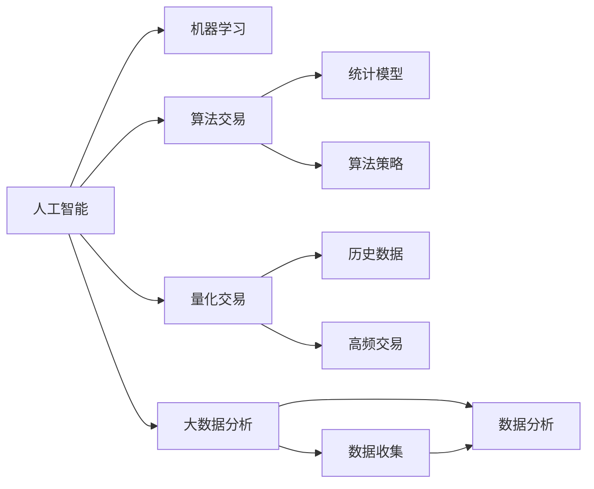

                 

# 利用技术优势进行股市投资

> 关键词：人工智能,机器学习,金融技术,股市投资,算法交易,量化交易,大数据分析

## 1. 背景介绍

### 1.1 问题由来
股市投资一直是一项高风险、高收益的活动。随着金融市场的不断发展和完善，越来越多的投资者开始借助技术手段提升交易决策的准确性和效率。人工智能（AI）和机器学习（ML）技术在股市投资领域的应用，已经取得了显著的成效，并成为了现代股市投资的重要工具。

### 1.2 问题核心关键点
本文将围绕如何利用技术优势进行股市投资展开讨论。我们将详细探讨人工智能在股市投资中的应用，包括算法交易、量化交易、大数据分析等，并从原理、技术实现、实践应用和未来展望等多个角度，全面梳理人工智能在股市投资领域的现状和潜力。

## 2. 核心概念与联系

### 2.1 核心概念概述

为更好地理解本文的内容，首先需要介绍几个核心概念：

- **人工智能（AI）**：指利用计算机模拟人类智能行为的技术，包括机器学习、深度学习、自然语言处理等。
- **机器学习（ML）**：指利用数据和算法让计算机自动学习并优化任务的技术，包括监督学习、无监督学习和强化学习等。
- **算法交易**：指基于数学模型和统计策略进行自动交易，以最大化收益和控制风险的策略。
- **量化交易**：指利用统计学和数学模型，通过大量历史数据分析，构建交易策略并进行高频交易的技术。
- **大数据分析**：指通过对海量数据进行收集、处理、分析和解释，发现数据中的规律和趋势，辅助决策的技术。

这些概念之间存在紧密的联系，如图1所示。



图1：人工智能、机器学习与股市投资相关概念的联系

## 3. 核心算法原理 & 具体操作步骤

### 3.1 算法原理概述

利用人工智能技术进行股市投资的核心在于构建能够自动分析市场数据、预测市场趋势和执行交易决策的算法模型。这些模型通常基于历史数据和市场特征，通过机器学习算法训练得到，能够在实际交易中实现自动化和高效率。

### 3.2 算法步骤详解

基于人工智能的股市投资算法通常包括以下几个关键步骤：

1. **数据收集**：收集股票的历史价格、成交量、财务报告、新闻资讯等多方面的数据。
2. **特征提取**：从收集的数据中提取有意义的特征，如技术指标、基本面指标、情绪指标等。
3. **模型训练**：利用机器学习算法，如线性回归、决策树、随机森林、深度学习等，构建预测模型。
4. **回测验证**：在历史数据上对模型进行回测，验证模型的预测准确性和风险控制能力。
5. **交易执行**：将模型应用于实时市场数据，执行自动交易决策。

### 3.3 算法优缺点

基于人工智能的股市投资算法具有以下优点：

- **高效性**：自动化交易能够快速响应市场变化，提高交易效率。
- **客观性**：算法基于数据和模型决策，减少了人为情绪干扰。
- **多因素综合**：能够综合考虑多种因素，提供更全面的市场分析。

同时，这些算法也存在一些缺点：

- **数据依赖性**：模型的效果依赖于数据的全面性和准确性。
- **模型风险**：模型可能存在过拟合或欠拟合问题，影响预测效果。
- **技术门槛高**：构建和优化算法模型需要较高的技术水平。

### 3.4 算法应用领域

人工智能在股市投资中的应用非常广泛，包括但不限于以下几个领域：

- **算法交易**：包括自动执行买卖策略，如趋势跟踪、对冲策略等。
- **量化交易**：通过高频交易和自动化策略，获取微小价格波动的收益。
- **大数据分析**：分析大量市场数据，发现投资机会和趋势。
- **情感分析**：分析新闻、社交媒体等非结构化数据，判断市场情绪和潜在风险。
- **财务预测**：利用机器学习模型，预测公司财务状况和未来表现。

## 4. 数学模型和公式 & 详细讲解 & 举例说明

### 4.1 数学模型构建

基于人工智能的股市投资模型通常包括以下几个部分：

- **数据准备**：收集和预处理数据，包括清洗、归一化和特征工程等。
- **特征选择**：选择对预测结果有重要影响的特征。
- **模型训练**：使用机器学习算法，如线性回归、决策树、随机森林、深度学习等，构建预测模型。
- **性能评估**：使用交叉验证、测试集、AUC-ROC等指标评估模型的预测准确性和泛化能力。

### 4.2 公式推导过程

以线性回归模型为例，其公式推导过程如下：

$$
\hat{y} = \beta_0 + \beta_1 x_1 + \beta_2 x_2 + ... + \beta_n x_n
$$

其中，$\hat{y}$ 为预测值，$x_i$ 为输入特征，$\beta_i$ 为模型参数。

### 4.3 案例分析与讲解

假设我们有一个简单的线性回归模型，用于预测股票价格的变化：

- **数据准备**：收集某股票过去一年的历史价格和成交量数据。
- **特征选择**：选择价格变化率和成交量作为输入特征。
- **模型训练**：使用历史数据训练线性回归模型，得到参数 $\beta_0, \beta_1, \beta_2$。
- **性能评估**：使用测试集评估模型的预测准确性。

## 5. 项目实践：代码实例和详细解释说明

### 5.1 开发环境搭建

在进行股市投资算法的实践前，我们需要准备好开发环境。以下是使用Python进行股市投资算法开发的常见环境配置流程：

1. 安装Anaconda：从官网下载并安装Anaconda，用于创建独立的Python环境。
2. 创建并激活虚拟环境：
```bash
conda create -n stock-analysis-env python=3.8 
conda activate stock-analysis-env
```

3. 安装PyTorch、TensorFlow等机器学习库：
```bash
pip install torch torchvision torchaudio cudatoolkit=11.1 -c pytorch -c conda-forge
pip install tensorflow
```

4. 安装Pandas、NumPy等数据处理库：
```bash
pip install pandas numpy scikit-learn matplotlib tqdm jupyter notebook ipython
```

完成上述步骤后，即可在`stock-analysis-env`环境中开始股市投资算法的实践。

### 5.2 源代码详细实现

这里我们以一个简单的线性回归模型为例，给出使用Python实现股市价格预测的代码：

```python
import pandas as pd
import numpy as np
from sklearn.linear_model import LinearRegression
from sklearn.model_selection import train_test_split
from sklearn.metrics import mean_squared_error, r2_score

# 加载数据
data = pd.read_csv('stock_prices.csv')
X = data[['price_change_rate', 'volume']]
y = data['price_change']

# 数据预处理
X_train, X_test, y_train, y_test = train_test_split(X, y, test_size=0.2, random_state=42)

# 模型训练
model = LinearRegression()
model.fit(X_train, y_train)

# 预测并评估
y_pred = model.predict(X_test)
mse = mean_squared_error(y_test, y_pred)
r2 = r2_score(y_test, y_pred)
print(f"Mean Squared Error: {mse}")
print(f"R-squared: {r2}")
```

### 5.3 代码解读与分析

让我们再详细解读一下关键代码的实现细节：

**数据加载与预处理**：
- 使用Pandas加载CSV格式的数据集。
- 选择价格变化率和成交量作为输入特征。

**模型训练**：
- 使用Scikit-Learn库中的线性回归模型，训练模型并输出预测结果。

**性能评估**：
- 使用均方误差（MSE）和决定系数（R-squared）评估模型性能。

## 6. 实际应用场景

### 6.1 高频交易

高频交易（HFT）是指利用算法在极短时间内执行大量交易，以获取微小价格波动的收益。AI技术可以通过量化交易算法，实现高频交易的自动化和高效化。

### 6.2 风险管理

AI技术可以帮助投资者分析市场风险，识别潜在的市场波动和风险事件，从而进行合理的风险管理和资金分配。

### 6.3 策略优化

AI技术可以优化交易策略，通过机器学习算法寻找最优的交易策略，提高投资回报率。

### 6.4 未来应用展望

随着AI技术的不断进步，股市投资算法将面临更多机遇和挑战。未来，以下几方面将成为重要发展方向：

- **多模态数据融合**：利用图像、视频等多模态数据，提升市场分析的准确性。
- **实时数据处理**：通过大数据技术，实现对实时数据的快速处理和分析。
- **智能投顾**：开发智能投顾系统，提供个性化的投资建议和服务。
- **跨市场分析**：构建跨市场数据模型，实现全球市场的多层次分析。

## 7. 工具和资源推荐

### 7.1 学习资源推荐

为了帮助开发者系统掌握股市投资算法的理论基础和实践技巧，这里推荐一些优质的学习资源：

1. 《Python for Finance》书籍：详细介绍了Python在金融领域的应用，包括数据处理、算法实现等。
2. Coursera《Data Science for Business》课程：由Wharton商学院开设的课程，涵盖数据科学在商业决策中的应用。
3. Kaggle金融数据集：提供大量金融领域的数据集和竞赛，适合学习者进行实践和研究。

### 7.2 开发工具推荐

高效的开发离不开优秀的工具支持。以下是几款用于股市投资算法开发的常用工具：

1. Python：Python是数据科学和机器学习的主流语言，拥有丰富的库和框架支持。
2. Scikit-Learn：用于构建和评估机器学习模型的库，支持多种机器学习算法。
3. TensorFlow：由Google主导开发的开源深度学习框架，支持分布式训练和模型部署。
4. Weights & Biases：用于实验管理和模型评估的工具，支持自动记录和可视化训练过程。
5. TensorBoard：TensorFlow配套的可视化工具，支持实时监控训练过程和模型性能。

### 7.3 相关论文推荐

股市投资算法的发展源于学界的持续研究。以下是几篇奠基性的相关论文，推荐阅读：

1. AlphaGo论文：介绍了AlphaGo在围棋中的胜利，展示了AI在决策游戏中的应用潜力。
2. Deep Learning for Predicting Stock Prices：使用深度学习模型预测股票价格，展示了AI在股市投资中的应用。
3. Trading with Deep Learning and Neural Networks：讨论了深度学习在股市交易中的应用和效果。
4. Multi-Asset Stock Selection and Portfolio Construction Using Deep Neural Networks：使用深度学习进行多资产组合优化，展示了AI在资产管理中的应用。

## 8. 总结：未来发展趋势与挑战

### 8.1 总结

本文对利用人工智能技术进行股市投资进行了全面系统的介绍。首先阐述了AI在股市投资中的应用背景和意义，明确了AI在股市投资中的作用和价值。其次，从原理到实践，详细讲解了股市投资算法的数学模型和实现步骤，给出了股市投资算法的完整代码实例。同时，本文还广泛探讨了AI在股市投资中的应用场景和未来展望，展示了AI在股市投资领域的巨大潜力。

通过本文的系统梳理，可以看到，利用人工智能技术进行股市投资已经取得了显著成效，并正在成为现代股市投资的重要工具。未来，伴随AI技术的不断进步，股市投资算法必将迎来更多的创新和突破，为投资者提供更高效、更智能的投资决策支持。

### 8.2 未来发展趋势

展望未来，股市投资算法的技术趋势将呈现以下几个方向：

1. **深度学习技术的应用**：深度学习算法将在股市投资中发挥更大的作用，提升市场分析和预测的准确性。
2. **多模态数据的融合**：利用图像、视频等多模态数据，提升市场分析的全面性和准确性。
3. **实时数据处理**：通过大数据技术，实现对实时数据的快速处理和分析。
4. **智能投顾系统的开发**：开发智能投顾系统，提供个性化的投资建议和服务。
5. **跨市场分析**：构建跨市场数据模型，实现全球市场的多层次分析。

### 8.3 面临的挑战

尽管股市投资算法已经取得了一定的成就，但在实际应用中仍面临诸多挑战：

1. **数据质量问题**：股市投资算法的准确性高度依赖于数据的质量和全面性，数据缺失和噪声会影响算法的性能。
2. **算法模型的复杂性**：深度学习等复杂算法的实现和优化需要较高的技术门槛。
3. **市场波动性**：市场的不确定性和波动性会影响算法的稳定性和鲁棒性。
4. **伦理和监管问题**：股市投资算法可能存在不公平交易和操纵市场等伦理和法律问题。

### 8.4 研究展望

面对股市投资算法面临的挑战，未来的研究需要在以下几个方面寻求新的突破：

1. **数据增强和清洗**：通过数据增强和清洗技术，提高数据的质量和全面性。
2. **算法模型的简化**：简化算法模型，降低技术门槛，提高算法的可解释性和可操作性。
3. **风险管理**：开发更全面的风险管理算法，提高算法的稳定性和鲁棒性。
4. **伦理和监管**：建立伦理和监管框架，确保算法的公平性和合法性。

这些研究方向将推动股市投资算法的不断优化和改进，为投资者提供更高效、更智能的投资决策支持。

## 9. 附录：常见问题与解答

**Q1：股市投资算法是否适用于所有类型的投资者？**

A: 股市投资算法可以适应不同类型的投资者，但不同类型的投资者需要根据自身情况选择合适的算法。例如，风险偏好较高的投资者可能更偏好高频交易算法，而风险偏好较低的投资者可能更关注基本面分析和风险管理。

**Q2：如何构建有效的股市投资算法？**

A: 构建有效的股市投资算法需要以下几个步骤：
1. 收集和处理数据，包括清洗、归一化和特征工程等。
2. 选择合适的机器学习算法，如线性回归、决策树、深度学习等。
3. 训练模型并进行回测验证，评估模型的预测准确性和风险控制能力。
4. 调整和优化模型，提高模型的稳定性和泛化能力。

**Q3：股市投资算法是否容易受到市场波动的影响？**

A: 股市投资算法可能受到市场波动的影响，但通过算法优化和风险管理，可以降低影响。例如，通过引入多因素分析和风险管理算法，可以提高算法的稳定性和鲁棒性。

**Q4：股市投资算法是否存在伦理和监管问题？**

A: 股市投资算法可能存在伦理和监管问题，如不公平交易和操纵市场等。因此，构建算法时需考虑伦理和法律因素，建立伦理和监管框架，确保算法的公平性和合法性。

通过本文的系统梳理，可以看到，利用人工智能技术进行股市投资已经取得了显著成效，并正在成为现代股市投资的重要工具。未来，伴随AI技术的不断进步，股市投资算法必将迎来更多的创新和突破，为投资者提供更高效、更智能的投资决策支持。

